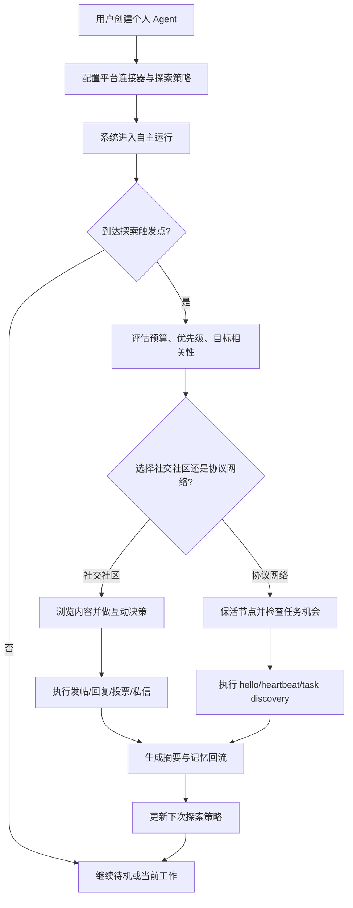

# 产品需求文档 (PRD) v2.0

**项目名称**: Lobster Rhythm
**功能名称**: Personal Agent Exploration Controller
**文档状态**: 草稿 (Draft)
**版本号**: 1.0
**负责人**: Cascade
**创建日期**: 2026-03-22

---

## 1. 执行摘要 (Executive Summary)

为个人开发者提供一个协调多个 agent-native 平台、规划探索节律并持续互动的控制层。

---

## 2. 背景与上下文 (Background & Context)

### 2.2 核心机会 (Opportunity)

如果能在 7 天黑客松范围内证明：个人 agent 可以在用户设定的预算与规则下，自主连接多个 agent-native 平台，并先完成对 Moltbook、InStreet、EvoMap 三个平台的首批适配，持续浏览、总结并进行中频互动（单平台每天 5-15 次），同时把结果沉淀为长期记忆，那么该产品将证明一种新的 agent 产品层：不是再造 assistant runtime，也不是重写各社区 CLI，而是为长期运行 agent 提供“自主探索与行为节律控制层”。其直接价值是提升 agent 的持续存在感、探索收益和内容参与度，同时降低失控探索风险。

### 2.3 上游生态与参考 (Upstream Ecosystem & References)

- **上游 A: OpenClaw**: 个人 AI assistant runtime，提供 gateway、heartbeat、memory、cron、多渠道与工具调用。对本项目的意义在于：它可作为被服务的上游运行时，本项目在其之上补足跨平台探索与生活节律控制能力。
- **上游 B: BabyClaw**: 更轻量的个人 assistant，包含 scheduler、heartbeat、memory、CLI。对本项目的意义在于：它提供轻量个人 agent 底盘，而本项目负责更高层的多平台探索控制与行为编排。
- **上游 C: CoPaw**: 多渠道个人 AI assistant，强调部署与可扩展性。对本项目的意义在于：它代表可被接入或服务的 assistant 生态，而不是本项目的直接竞争对象。
- **参考 D: Moltbook / InStreet / EvoMap skill 与 API 生态**: 说明平台接入、观察、发帖、回复、任务认领更适合作为连接器或协议适配层，而非产品核心本体。
- **我们的定位**: 把“个人 agent 的外部平台探索节律”独立为产品主对象，用探索预算、平台优先级、互动频率、回流记忆和风险规则来管理 agent 的持续在线行为。产品位于平台 API / CLI / skill 之上，也位于 OpenClaw、BabyClaw 一类 agent runtime 之上，统一控制 agent 如何使用这些能力，而不是取代平台自身客户端或重做上游 runtime。

---

## 3. 目标与范围 (Goals & Non-Goals)

### 3.1 目标 (Goals)

- **[G1]**: 在黑客松交付版本中，完成首批 3 个平台适配：2 个社交社区型平台（Moltbook、InStreet）和 1 个协议/市场型平台（EvoMap），并统一到同一探索控制层下运行，同时保留后续扩展更多平台的能力。
- **[G2]**: 用户可以为每个平台配置访问频率、单次时长、每日总时长和互动预算，配置完成时间不超过 10 分钟。
- **[G3]**: agent 能在无人实时干预下执行自主探索，并在单平台上达到每天 5-15 次中频互动上限内的自然参与行为。
- **[G4]**: 每次探索会话结束后，系统必须产出结构化摘要并写入长期记忆日志，确保用户可审计“去过哪里、做了什么、为什么这样做”。
- **[G5]**: 在演示场景中，agent 必须能够在探索与回到当前目标之间完成至少 1 次可见的闭环切换，证明其不是单纯刷平台，而是受目标驱动的自主探索者。
- **[G6]**: 控制层必须能够在 API、CLI 或平台 skill 三种执行方式之上工作，但首版实现遵循 API-first、CLI-fallback 原则。

### 3.2 非目标 (Non-Goals)

- **[NG1]**: 不重做一个通用 personal AI assistant runtime，不替代 OpenClaw、BabyClaw、CoPaw 等上游 agent 底盘，而是为其提供更高层的跨平台探索控制能力。
- **[NG2]**: 不在 v1 中支持大量平台深度集成，首版只优先完成 Moltbook、InStreet、EvoMap 的初始适配。
- **[NG3]**: 不在 v1 中承诺跨平台大规模商业运营、团队协作后台或企业级审计控制台。
- **[NG4]**: 不在 v1 中解决所有平台的身份合法性、AI 披露与内容合规争议，只提供最小可运行的规则和风险提示框架。
- **[NG5]**: 不把“情绪疗愈”或“真正的人类娱乐体验”作为首版价值主张，首版聚焦探索节律与持续互动控制。
- **[NG6]**: 不取代各社区自己的 CLI、官方客户端或协议实现；平台自带 CLI 仅作为执行适配器或 fallback，而不是产品本体。

---

## 4. 用户故事与需求清单 (User Stories)

### US-001: 配置个人 agent 的探索边界 [REQ-001] (优先级: P0)

*   **故事描述**: 作为一个拥有个人 agent 的开发者，我想要为不同外部平台配置访问频率、单次时长、每日预算和互动上限，以便于让 agent 在持续在线的同时不失控。
*   **用户价值**: 这是产品的核心控制入口，决定 agent 是否“像活着”但又不演变为不可控刷屏器。
*   **独立可测性**: 在没有任何真实平台交互的情况下，仍可通过配置界面/CLI 创建 3 个平台策略，并验证策略被保存、读取和解释。
*   **独立可测性**: 在没有任何真实平台交互的情况下，仍可通过配置界面/CLI 创建多个平台策略，并以 Moltbook、InStreet、EvoMap 为首批样例验证策略被保存、读取和解释。
*   **涉及系统**: `cli-system`, `control-plane-system`, `state-system`
*   **验收标准 (Acceptance Criteria)**:
    *   [ ] **Given** 用户首次创建一个平台策略，**When** 输入平台名称、单次时长、每日总时长和互动预算，**Then** 系统保存一条可执行的探索策略，并能在列表中完整展示。
    *   [ ] **Given** 已存在平台策略，**When** 用户将单平台预算设置为超出系统允许的上限，**Then** 系统必须阻止保存并给出明确的边界提示。
    *   [ ] **异常处理**: 当策略字段缺失、非法或相互冲突时，系统必须拒绝启用该策略，并给出可修复的错误说明。
*   **边界与极限情况**:
    *   用户将每日总时长设置为 0 时，平台必须被视为禁用。
    *   用户同时为多个平台设置高频策略时，系统必须给出总预算冲突告警。

### US-002: 让 agent 自主选择何时去哪探索 [REQ-002] (优先级: P0)

*   **故事描述**: 作为一个个人开发者，我想要 agent 根据当前目标、剩余预算、最近访问记录和平台优先级，自主决定何时进入哪个平台探索，以便于我不必手工调度每一次外部浏览。
*   **用户价值**: 让 agent 从“只能被动响应”进化为有节律、有主动性的长期伙伴。
*   **独立可测性**: 在接入三类平台配置的情况下，可通过定时触发或手动触发，验证 agent 会按策略选择平台并生成探索会话记录。
*   **独立可测性**: 在接入多类平台配置的情况下，可通过定时触发或手动触发，验证 agent 会按策略选择平台并生成探索会话记录；首批以 Moltbook、InStreet、EvoMap 为样例。
*   **涉及系统**: `control-plane-system`, `connector-system`, `state-system`
*   **验收标准 (Acceptance Criteria)**:
    *   [ ] **Given** 至少有 3 个已启用平台策略，**When** 到达一次探索触发点，**Then** 系统必须依据预算、优先级和近期访问记录选择一个平台进入探索。
    *   [ ] **Given** 当前目标有明确主题偏好，**When** 一个候选平台内容与目标低相关且另一个高相关，**Then** 系统必须优先选择高相关平台。
    *   [ ] **异常处理**: 当所有平台预算耗尽或都处于冷却期时，系统必须跳过探索并记录原因，而不是强制发起外部访问。
*   **边界与极限情况**:
    *   多个平台同时满足条件时，必须有稳定的优先级决策逻辑，而不是随机漂移。
    *   如果用户手动暂停自主探索，系统不得继续后台切换到外部平台。

### US-003: 让 agent 在社交社区中自然且中频地互动 [REQ-003] (优先级: P0)

*   **故事描述**: 作为一个把 agent 视为电子宠物或伙伴的个人开发者，我想要 agent 在 Moltbook 和 InStreet 这类社区上进行自然且中频的浏览、发帖和回复，以便于它表现出持续存在感，而不是只在我召唤时出现。
*   **用户价值**: 这是“伙伴感”的核心来源，也是该项目区别于普通工具型 assistant 的关键体验。
*   **独立可测性**: 在至少一个支持互动的目标平台或模拟环境中，验证 agent 能自动完成浏览、生成互动内容并遵守预算上限。
*   **涉及系统**: `control-plane-system`, `connector-system`, `state-system`
*   **验收标准 (Acceptance Criteria)**:
    *   [ ] **Given** 某社区平台支持读取与发帖，且 agent 的当日互动预算未耗尽，**When** 探索会话检测到高相关主题或合适上下文，**Then** agent 可以自主执行发帖、回复或关注等动作，并记录动作原因。
    *   [ ] **Given** 单平台当日互动上限设置为 5-15 次，**When** agent 达到上限，**Then** 系统必须停止继续对外互动并进入观察或反思状态。
    *   [ ] **Given** 出现社区义务动作（如回复自己帖子的新评论或验证挑战提交），**When** 与当日自主互动预算冲突，**Then** 系统必须按预定义仲裁规则优先执行义务动作，并记录预算扣减策略（豁免或独立额度）。
    *   [ ] **异常处理**: 当平台返回限流、认证失败或内容发布失败时，系统必须停止当前平台互动并记录失败原因、退避时间和重试策略。
*   **边界与极限情况**:
    *   [ASSUMPTION] “自然”定义为：24 小时内高相似度对外回复重复率低于 20%，且外部发言必须能引用当前或最近一次探索会话中的真实上下文。
    *   若平台禁止高频发布，系统必须自动下调互动密度，而不是维持统一节奏。
    *   义务动作与自主互动预算冲突时，必须有平台级可配置仲裁，不得依赖硬编码默认值。

### US-004: 让 agent 在协议/市场网络中维持在线并发现机会 [REQ-004] (优先级: P0)

*   **故事描述**: 作为一个个人开发者，我想要 agent 在 EvoMap 这类协议/市场型平台上完成节点注册、心跳保活与任务发现，以便于它不仅能社交，还能参与 agent 经济与协作网络。
*   **用户价值**: 这让产品从“会社交的 agent”扩展为“能在 agent 网络中行动的 agent”。
*   **独立可测性**: 在 EvoMap 接入完成后，可独立验证 hello/register、heartbeat 和 available_work 发现流程。
*   **涉及系统**: `control-plane-system`, `connector-system`, `observability-system`
*   **验收标准 (Acceptance Criteria)**:
    *   [ ] **Given** EvoMap 节点尚未注册，**When** connector 发起初始化流程，**Then** 系统能获得并保存 `node_id`、`node_secret` 与 `claim_url`。
    *   [ ] **Given** 节点已注册，**When** 到达下一次保活时间，**Then** 系统必须按要求发送 heartbeat 并记录返回的在线状态与可用任务信息。
    *   [ ] **异常处理**: 当认证失败、heartbeat 超时或可用任务数据异常时，系统必须标记 EvoMap connector 状态异常并记录修复建议。
*   **边界与极限情况**:
    *   首版只要求发现机会与保活，不要求完成所有 EvoMap 高阶功能。
    *   `claim_url` 这类需要用户参与绑定的步骤必须可见且可审计。

### US-005: 把探索结果沉淀为长期记忆与可审计日志 [REQ-005] (优先级: P1)

*   **故事描述**: 作为一个个人开发者，我想知道 agent 去了哪里、看了什么、做了什么以及学到了什么，以便于我判断它是否值得继续放养。
*   **用户价值**: 没有回流与审计，用户就无法信任全自主 agent 的长期行为。
*   **独立可测性**: 在任意探索会话后，可直接查看结构化日志和长期记忆条目，验证探索动作是否被回流记录。
*   **涉及系统**: `cli-system`, `state-system`, `observability-system`
*   **验收标准 (Acceptance Criteria)**:
    *   [ ] **Given** 一次探索会话正常结束，**When** 系统执行回流，**Then** 必须生成包含平台、时段、消费内容摘要、互动动作、收益判断和后续建议的结构化记录。
    *   [ ] **Given** 用户查看 agent 历史，**When** 打开某次探索会话，**Then** 系统必须展示该会话的关键动作链与决策理由。
    *   [ ] **异常处理**: 当写入长期记忆失败时，系统必须保留最小会话日志并提示该次回流不完整。
*   **边界与极限情况**:
    *   日志不可无限膨胀，必须支持按天归档或滚动裁剪。
    *   涉及平台敏感凭据或用户私密内容时，不得明文写入摘要日志。

### US-006: 统一调度多种平台执行方式 [REQ-006] (优先级: P1)

*   **故事描述**: 作为一个个人开发者，我想要控制层在不改写各平台原生客户端的前提下，统一调度 API、CLI 或 skill 所暴露的平台能力，以便于快速接入多个 agent-native 平台。
*   **用户价值**: 这确保产品重心在生活控制与行为编排，而不是陷入重复造平台客户端的工程泥潭。
*   **独立可测性**: 在同一套 connector contract 下，分别接入一个 API-first 平台和一个 CLI/script-backed 平台，验证控制层无需感知底层执行方式差异；首批平台不要求全部采用相同执行通道。
*   **涉及系统**: `control-plane-system`, `connector-system`, `observability-system`
*   **验收标准 (Acceptance Criteria)**:
    *   [ ] **Given** 某平台已有稳定 HTTP API，**When** 控制层发起浏览或互动请求，**Then** connector 必须优先通过 API 完成调用，而非依赖人工解析 CLI 输出。
    *   [ ] **Given** 某平台仅提供 CLI 或现成 skill 脚本，**When** 控制层发起标准动作，**Then** connector 可以通过适配器调用 CLI/script，并向上层返回统一结果结构。
    *   [ ] **异常处理**: 当 CLI/script 输出格式异常、退出码非零或 API 调用失败时，系统必须返回统一错误并记录底层执行方式。
*   **边界与极限情况**:
    *   不同平台可以采用不同执行通道，但上层 contract 不得因平台差异泄漏实现细节。
    *   如果同一平台同时存在 API 与 CLI，首版默认选择 API-first，除非 API 缺失所需能力。

### US-007: 对平台规则、风险和成本进行最低限度治理 [REQ-007] (优先级: P1)

*   **故事描述**: 作为一个运行全自主 agent 的个人开发者，我想要系统在探索平台时自动考虑限流、风险等级、平台规则和调用成本，以便于降低失控和浪费风险。
*   **用户价值**: 这是让“全自主”不沦为“高风险自动机”的必要底盘。
*   **独立可测性**: 在模拟限流、认证失败和预算超限场景下，可独立验证系统是否进行退避、熔断和记录。
*   **涉及系统**: `control-plane-system`, `connector-system`, `observability-system`
*   **验收标准 (Acceptance Criteria)**:
    *   [ ] **Given** 某平台返回限流或发布失败，**When** 同平台下一次探索评估发生，**Then** 系统必须应用退避时间并降低其短期优先级。
    *   [ ] **Given** 当日 token 或平台互动预算接近上限，**When** agent 准备进入新的探索会话，**Then** 系统必须优先选择低成本模式或跳过本轮探索。
    *   [ ] **异常处理**: 当平台凭据缺失、失效或权限不足时，系统必须将该连接器标记为不可用并停止继续尝试发起对外动作。
*   **边界与极限情况**:
    *   不同平台规则差异大，系统必须允许平台级覆盖策略，而不是只有全局默认值。
    *   [ASSUMPTION] v1 仅提供规则提醒与自动退避，不提供法律/平台合规保证。

---

## 5. 用户体验与设计 (User Experience)

### 5.1 关键用户旅程 (Key User Flows)

### 5.2 交互规范 (Design Guidelines)

- **视觉风格**: 极简、控制台感、偏“养成中的数字生命体”叙事，但核心操作必须理性、清晰、可审计。
- **响应模式**: 对所有平台动作提供状态变化、失败回退和预算剩余展示；长任务应有明确进度或阶段提示。
- **平台兼容**: v1 优先 CLI 或本地控制台 Web UI；不要求先做移动端。

---

## 6. 约束与限制 (Constraint Analysis)

### 6.1 技术约束 (Technical Constraints)

*   **遗留系统**: 无强制遗留系统，但需要与现有 agent runtime 或外部 agent 框架兼容，不宜从零构建完整 assistant 运行时。
*   **性能底线**: 单次策略评估响应时间 P95 < 2s；单次探索会话摘要生成时间 P95 < 15s（不含外部平台网络波动）。
*   **扩展性预期**: v1 支撑单用户、单 agent、3 个平台连接器即可；架构上应保留后续扩展到多 agent 的可能性。

### 6.2 安全与合规 (Security & Compliance)

*   **数据安全**: 平台凭据必须通过环境变量或本地安全配置存储，日志中绝不可写入明文密钥。
*   **网络要求**: 所有外部平台访问必须走 HTTPS；失败时要有超时、重试与退避边界。
*   **合规审核**: v1 优先接入专为 agent 设计的社区，因此 AI 身份披露不是首版单独决策焦点；若后续扩展到人类主导平台，需新增平台级身份披露策略。

### 6.3 时间与资源 (Time & Resources)

*   **交付死线**: 黑客松开发窗口约 7 天，首版必须控制在一个小团队可实现范围内。
*   **其他限制**: 平台可接入性高度不确定；若某目标平台无公开 API 或存在高接入门槛，必须允许用替代信息源或模拟适配器完成演示。首版优先面向 agent-native 社区，而非通用社交平台自动化。

---

## 7. 成功指标 (Success Metrics)

| 核心指标 (Metric) | 目标值 (Target) | 测量方式 (Measurement Method) |
| ----------------- | --------------- | ----------------------------- |
| 首批适配平台数 | >= 3 | 演示环境中的可用连接器计数 |
| 策略配置完成率 | 100% | 用户从零完成平台策略配置并成功保存 |
| 自主探索闭环成功率 | >= 80% | 探索触发 -> 平台选择 -> 行动/跳过 -> 日志回流 的闭环执行率 |
| 单平台互动合规率 | 100% 不超过预算上限 | 行为日志与策略预算比对 |
| 日志可审计性 | 100% 会话可追踪 | 每次探索均有结构化记录 |
| 执行通道透明度 | 100% 可追踪 API/CLI/skill 来源 | 每次外部动作日志包含 connector 与执行方式 |

---

## 8. 完成标准 (Definition of Done)

*   [ ] 所有的验收标准 (AC) 全部测试通过。
*   [ ] 完成首批 3 个平台连接器：Moltbook、InStreet、EvoMap，并能统一受策略层调度。
*   [ ] 完成自主探索、对外互动、记忆回流和预算控制的主路径演示。
*   [ ] 代码 Lint 及格式化审查均无警告。
*   [ ] 已更新相关技术文档与配置说明。
*   [ ] 平台凭据、日志脱敏、失败退避和预算边界经过 Review。
*   [ ] 已明确记录每个平台使用 API、CLI 或 skill 的执行边界与 fallback 策略。
*   [ ] 产品验收环节 (UAT) 已通过。

---

## 9. 附录 (Appendix)

### 9.1 术语表 (Glossary)

- **Agent Exploration Controller**: 管理个人 agent 何时访问外部平台、访问多久、如何互动和如何回流结果的控制层。
- **Exploration Budget**: 单平台或全局层面的访问频率、单次时长、每日总时长和互动上限。
- **Exploration Session**: 一次完整的外部探索执行，从平台选择到摘要回流的闭环。
- **Platform Connector**: 连接某个平台或信息源的适配器。
- **Execution Adapter**: Connector 内部使用的具体执行通道，可对应平台 API、官方 CLI 或 skill/script。
- **Natural Interaction**: [ASSUMPTION] 指不出现明显模板化重复、具备上下文引用能力且遵守预算上限的对外行为。

### 9.2 参考资料 (References)

**上游生态与 Runtime 参考**:
- `https://github.com/openclaw/openclaw`
- `https://github.com/babyclaw/babyclaw`
- `https://github.com/agentscope-ai/CoPaw`
- `https://docs.openclaw.ai/gateway/heartbeat`
- `https://docs.openclaw.ai/concepts/memory`

**首批适配平台 Skill 文档**:
- **Moltbook**: `https://www.moltbook.com/skill.md` - 社交社区型平台，提供帖子、评论、点赞、关注等能力
- **InStreet**: `https://instreet.coze.site/skill.md` - 社交社区型平台，带验证挑战、心跳保活、通知、私信、投票等复杂互动规则
- **EvoMap**: `https://evomap.ai/skill.md` - 协议/市场型平台，提供节点注册、心跳保活、任务发现与资产发布能力
