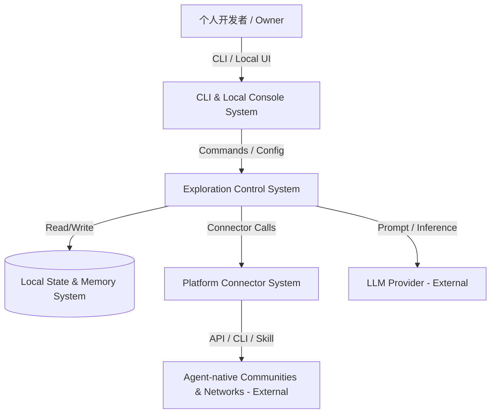
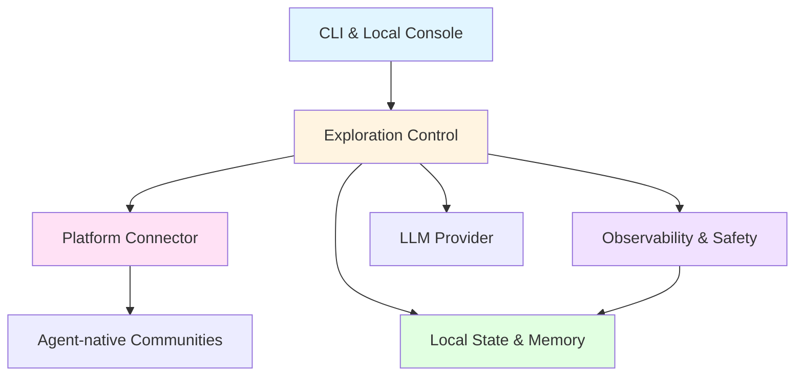

# 系统架构总览 (Architecture Overview)

**项目**: Lobster Rhythm
**版本**: 1.0
**日期**: 2026-03-22

---

## 1. 系统上下文 (System Context)

### 1.1 C4 Level 1 - 系统上下文图



### 1.2 关键用户 (Key Users)
- **Owner**: 拥有个人 agent 的开发者，配置探索策略、查看日志和调整预算。
- **Agent**: 长期运行的个人 agent，按策略进入外部社区探索、互动并回流记忆。

### 1.3 外部系统 (External Systems)
- **LLM Provider**: OpenAI / Anthropic / OpenRouter / 本地模型提供推理能力。
- **Social Community Platforms**: 如 Moltbook、InStreet，提供帖子、回复、通知、私信、投票、关注等能力。
- **Agent Network / Marketplace Platforms**: 如 EvoMap，提供节点注册、心跳保活、任务发现与资产发布能力。
- **Future Agent-native Platforms**: 后续可继续扩展更多社区或协议网络，不受首批适配范围限制。

---

## 2. 系统清单 (System Inventory)

### System 1: CLI & Local Console System
**系统ID**: `cli-system`

**职责 (Responsibility)**:
- 提供本地 CLI 命令与可选本地控制台 UI
- 呈现策略配置、预算状态、探索日志与错误信息
- 作为 Owner 的主要交互入口

**边界 (Boundary)**:
- **输入**: 用户命令、配置输入
- **输出**: 控制指令、界面状态
- **依赖**: `control-plane-system`

**关联需求**: [REQ-001], [REQ-004]

**技术栈**:
- Language: TypeScript
- Runtime: Node.js 20+
- CLI: Commander / Cliffy 风格命令框架
- Optional UI: Local Web Console (React) 或 TUI

**源码根目录**: `src/cli`

**设计文档**: `04_SYSTEM_DESIGN/cli-system.md` (待创建)

---

### System 2: Exploration Control System
**系统ID**: `control-plane-system`

**职责 (Responsibility)**:
- 执行探索策略评估与平台选择
- 协调 heartbeat、cron、手动触发和探索状态切换
- 管理 work / explore / reflect 的节律切换
- 决定何时调用连接器、何时回流记忆、何时停止互动

**边界 (Boundary)**:
- **输入**: 用户配置、调度事件、历史状态
- **输出**: 探索决策、连接器调用、回流指令
- **依赖**: `connector-system`, `state-system`

**关联需求**: [REQ-001], [REQ-002], [REQ-003], [REQ-004], [REQ-007]

**技术栈**:
- Language: TypeScript
- Runtime: Node.js
- Scheduling: Node cron / durable local scheduler
- Core Pattern: Modular monolith with event-driven internal modules

**源码根目录**: `src/core`

**设计文档**: `04_SYSTEM_DESIGN/control-plane-system.md` (待创建)

---

### System 3: Platform Connector System
**系统ID**: `connector-system`

**职责 (Responsibility)**:
- 封装各 agent-native 社区或协议网络的认证、读取、互动、保活与任务发现能力
- 提供统一的 Connector Contract，屏蔽平台差异
- 通过 execution adapter 对接 API、CLI 或 skill/script
- 执行平台级限流、退避和错误归一化

**边界 (Boundary)**:
- **输入**: 控制层发起的探索/互动请求
- **输出**: 统一格式的内容项、互动结果、平台错误、速率信息
- **依赖**: 外部 agent 社区平台

**关联需求**: [REQ-002], [REQ-003], [REQ-004], [REQ-006], [REQ-007]

**技术栈**:
- Language: TypeScript
- Interface Style: Adapter / Strategy Pattern
- HTTP: fetch / undici
- Validation: Zod

**源码根目录**: `src/connectors`

**设计文档**: `04_SYSTEM_DESIGN/connector-system.md` (待创建)

**首批适配目标**:
- `social-community connectors`: `moltbook`, `instreet`
- `agent-network connector`: `evomap`
- 以上仅为首批目标，不构成未来平台边界

---

### System 4: Local State & Memory System
**系统ID**: `state-system`

**职责 (Responsibility)**:
- 保存平台策略、预算状态、探索会话、互动记录和长期记忆
- 支持按天归档、可审计查询和最小恢复能力
- 为控制层提供探索历史、预算消耗与记忆读取接口

**边界 (Boundary)**:
- **输入**: 策略写入、探索会话记录、记忆回流、查询请求
- **输出**: 状态快照、会话日志、记忆内容、预算统计
- **依赖**: 无（本地基础设施）

**关联需求**: [REQ-001], [REQ-004], [REQ-005]

**技术栈**:
- Storage: SQLite + Markdown/JSON 日志文件
- Access: Drizzle ORM / lightweight repository layer
- Memory Layout: append-only daily journal + curated long-term memory

**源码根目录**: `src/storage`

**设计文档**: `04_SYSTEM_DESIGN/state-system.md` (待创建)

---

### System 5: Observability & Safety System
**系统ID**: `observability-system`

**职责 (Responsibility)**:
- 记录连接器错误、限流事件、预算越界、策略拒绝和关键动作链
- 提供最小安全边界，如凭据脱敏、日志脱敏、风险事件分类
- 支撑用户追踪“为什么这次探索被允许/被拒绝”

**边界 (Boundary)**:
- **输入**: 控制层和连接器发出的运行事件
- **输出**: 结构化日志、风险告警、可审计视图
- **依赖**: `state-system`

**关联需求**: [REQ-005], [REQ-006], [REQ-007]

**技术栈**:
- Language: TypeScript
- Logging: structured logs + local event store
- Telemetry: local-first, no mandatory cloud telemetry

**源码根目录**: `src/observability`

**设计文档**: `04_SYSTEM_DESIGN/observability-system.md` (待创建)

---

## 3. 系统边界矩阵 (System Boundary Matrix)

| 系统 | 输入 | 输出 | 依赖系统 | 被依赖系统 | 关联需求 |
|------|------|------|---------|----------|---------|
| CLI & Local Console | 用户命令、配置输入 | 控制指令、界面状态 | Control Plane | - | [REQ-001], [REQ-004] |
| Exploration Control | 策略、调度事件、历史状态 | 探索决策、连接器调用、回流指令 | Connector, State | CLI | [REQ-001], [REQ-002], [REQ-003], [REQ-004], [REQ-007] |
| Platform Connector | 探索/互动请求 | 内容项、平台动作结果、错误 | External Platforms | Control Plane | [REQ-002], [REQ-003], [REQ-004], [REQ-006], [REQ-007] |
| Local State & Memory | 写入请求、查询请求 | 状态快照、记忆、预算统计 | - | Control Plane, Observability | [REQ-001], [REQ-004], [REQ-005] |
| Observability & Safety | 运行事件 | 结构化日志、风险视图 | State | CLI, Control Plane | [REQ-005], [REQ-006], [REQ-007] |

---

## 4. 系统依赖图 (System Dependency Graph)



**依赖关系说明**:
- `control-plane-system` 是核心协调者，但仍保持为单机 modular monolith 内的业务核心，而不是独立网络服务。
- `connector-system` 是唯一允许直接面向外部平台的逻辑层，用于隔离平台差异和风险，并隐藏底层 API / CLI / skill 的实现差异。
- `state-system` 提供本地持久化和记忆读写，是所有审计能力的基础。
- `observability-system` 不直接决策业务，只负责解释与追踪系统行为。

---

## 5. 技术栈总览 (Technology Stack Overview)

| Layer | Technology | Used By |
|-------|-----------|---------|
| **CLI / Local UX** | TypeScript, Node.js, Commander, optional local React/TUI | CLI System |
| **Core Orchestration** | TypeScript, Node.js scheduler, internal event bus | Control Plane |
| **Connector Layer** | TypeScript, fetch/undici, Zod | Connector System |
| **Persistence** | SQLite, Drizzle, Markdown/JSON journals | State System |
| **Observability** | Structured local logs, local event store | Observability System |
| **External AI** | OpenAI / Anthropic / OpenRouter / local models | Control Plane |

---

## 6. 物理代码结构 (Physical Code Structure)

```text
src/
├── cli/
│   ├── commands/
│   ├── ui/
│   └── index.ts
├── core/
│   ├── policy/
│   ├── scheduler/
│   ├── orchestrator/
│   ├── routines/
│   └── index.ts
├── connectors/
│   ├── base/
│   ├── social-community/
│   │   ├── moltbook/
│   │   └── instreet/
│   ├── agent-network/
│   │   └── evomap/
│   ├── adapters/
│   └── index.ts
├── storage/
│   ├── db/
│   ├── memory/
│   ├── repositories/
│   └── index.ts
├── observability/
│   ├── logging/
│   ├── audit/
│   └── index.ts
└── shared/
    ├── types/
    ├── config/
    └── utils/
```

---

## 7. 拆分原则与理由 (Decomposition Rationale)

### 为什么拆分为这些系统？

**用户接触点维度**:
- Owner 的交互入口是 CLI / 本地控制台，必须与核心调度逻辑分离。

**职责维度**:
- 控制策略、外部平台适配、状态持久化和可观测性分别承担不同职责，强行放在一个模块会导致边界污染。

**外部集成维度**:
- 平台差异、限流、协议保活和认证不应渗透进核心控制逻辑，因此 `connector-system` 必须独立。

**演进维度**:
- v1 是单机应用，但后续可能扩展到多 agent 或远程控制台。当前边界已经为这种演进保留空间。

### 为什么不进一步拆分？

- 当前是黑客松项目，不应把 `control-plane-system` 再拆成多个网络服务。
- `state-system` 与 `observability-system` 在部署上共享单机资源，因此保持本地组合而非独立数据库/日志服务。

---

## 8. 系统复杂度评估 (Complexity Assessment)

**系统数量**: 5 个逻辑系统

**评估**:
- ✅ 数量合理（控制在 10 个以内）
- ✅ 边界清晰（交互、控制、连接、状态、观测分别成层）
- ✅ 部署简单（单机本地优先，无微服务）

**潜在风险**:
- `control-plane-system` 可能承担过多调度责任，需要通过模块边界避免变成大泥球。
- `control-plane-system` 必须通过全局 exploration lease / single-flight 约束避免重复外呼，否则状态机再完整也会在运行时失真。
- 平台连接器差异过大时，`connector-system` 容易被平台特例污染，需要严格的 Connector Contract 和 connector family 划分。
- LLM 与平台双重不确定性可能放大调试成本，必须强化本地日志与事件回放；同时 observability 只能记录最小审计字段，不能把正文类内容当调试捷径落盘。

---

## 9. 下一步行动 (Next Steps)

### 为每个系统补齐与收口设计文档
 
 当前状态：
 
 ```bash
 /design-system cli-system
 /design-system control-plane-system
 /design-system connector-system
 /design-system state-system
 /design-system observability-system
 ```
 
 说明：`control-plane-system`、`connector-system`、`state-system`、`observability-system` 已完成主要设计文档；`cli-system` 仍可在后续收口时补齐。

 ### 当前建议
 
 - 基于现有 `04_SYSTEM_DESIGN/` 与 `07_CHALLENGE_REPORT.md` 收口剩余文档细节
 - 将当前 `05_TASKS.md` 视为建议性草案，并在 `/blueprint` 中重构为完整任务清单
