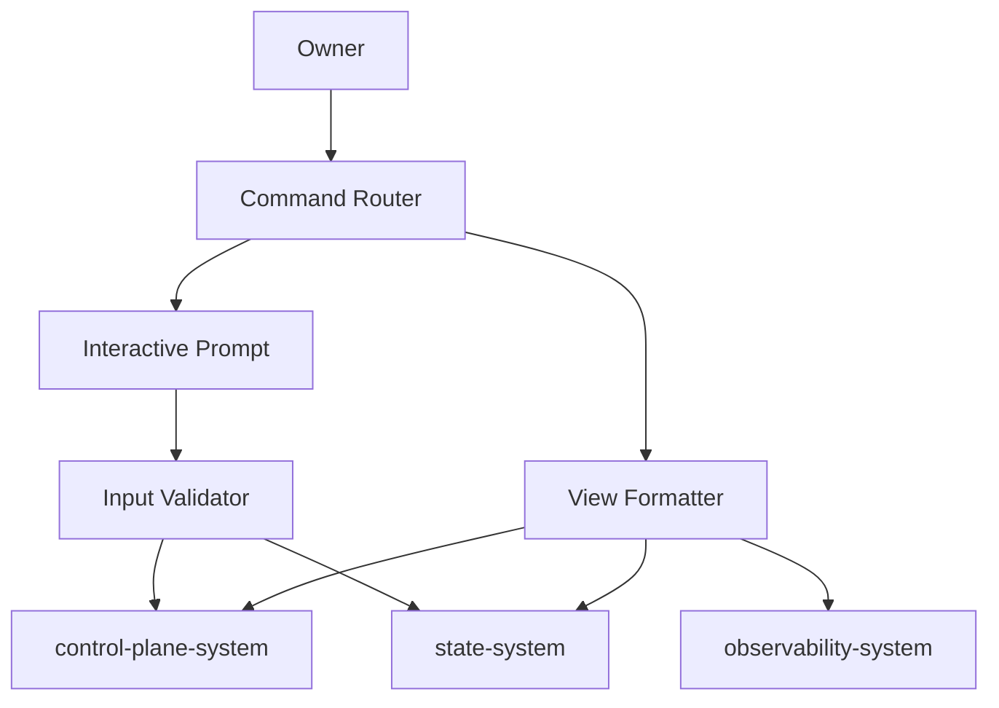

# CLI System 设计文档 (L0 — 导航层)

| 字段          | 值                                                            |
| ------------- | ------------------------------------------------------------- |
| **System ID** | `cli-system`                                                  |
| **Project**   | Lobster Rhythm                                                |
| **Version**   | 1.0                                                           |
| **Status**    | `Draft`                                                       |
| **Author**    | Cascade                                                       |
| **Date**      | 2026-03-22                                                    |
| **L1 Detail** | [cli-system.detail.md](./cli-system.detail.md) — 仅 `/forge` 时加载 |

> [!IMPORTANT]
> **文档分层说明**
> - **本文件 (L0 导航层)**: 架构图、操作契约、设计决策。面向快速理解与任务规划。
> - **[cli-system.detail.md](./cli-system.detail.md) (L1 实现层)**: 完整命令模型、交互流程、边缘情况。仅 `/forge` 任务明确引用时加载。

---

## 📋 目录

|   §   | 章节 | 关键内容 |
| :---: | ---- | -------- |
|   1   | [概览](#1-概览-overview) | 系统目的、边界、职责 |
|   2   | [目标与非目标](#2-目标与非目标-goals--non-goals) | Goals / Non-Goals |
|   3   | [背景与上下文](#3-背景与上下文-background--context) | 约束、PRD 需求 |
|   4   | [系统架构](#4-系统架构-architecture) | Mermaid 图、组件职责 |
|   5   | [接口设计](#5-接口设计-interface-design) | 命令契约、展示模型 |
|   6   | [数据模型](#6-数据模型-data-model) | 视图实体声明 → [L1 §2](./cli-system.detail.md) |
|   7   | [技术选型](#7-技术选型-technology-stack) | 核心技术、关键依赖 |
|   8   | [Trade-offs](#8-trade-offs--alternatives) | ADR 引用、本系统决策 |
|   9   | [安全性考虑](#9-安全性考虑-security-considerations) | 输入校验、脱敏展示 |
|  10   | [性能考虑](#10-性能考虑-performance-considerations) | 响应目标、降级 |
|  11   | [测试策略](#11-测试策略-testing-strategy) | 单测、集成、验收 |
|  12   | [附录](#12-appendix-附录) | 命令分组、参考资料 |

---

## 1. 概览 (Overview)

### 1.1 System Purpose

CLI System 是 Lobster Rhythm 中 Owner 的**主交互入口**。它负责把探索策略、预算状态、连接器状态、探索历史和审计信息，以清晰、可执行、可审计的方式暴露给用户。

### 1.2 System Boundary

| 维度 | 定义 |
|------|------|
| **Input** | 用户命令、交互式输入、查询条件、人工确认动作 |
| **Output** | 控制指令、格式化视图、错误提示、人工介入指引 |
| **Dependencies** | `control-plane-system`, `state-system`, `observability-system` |
| **Dependents** | Owner / 本地控制台使用者 |

### 1.3 System Responsibilities

**负责**:
- 提供本地 CLI 命令与交互式配置入口
- 展示平台策略、预算状态、探索日志、连接器健康与错误信息
- 为需要人工参与的步骤提供明确指引（如 claim url、验证挑战）
- 保证错误信息、拒绝原因和系统状态对 Owner 可理解

**不负责**:
- 不做平台选择与探索策略决策（由 `control-plane-system` 负责）
- 不直接操作外部平台（由 `connector-system` 负责）
- 不持久化业务数据（由 `state-system` 负责）
- 不定义审计事件 taxonomy（由 `observability-system` 负责）

---

## 2. 目标与非目标 (Goals & Non-Goals)

### 2.1 Goals

- **[G1]**: 用户可在 10 分钟内完成首批平台策略配置
- **[G2]**: 所有关键系统状态都可以通过命令查询并可解释
- **[G3]**: 对人工介入步骤给出明确、可执行、不可误解的提示
- **[G4]**: 错误信息优先可修复，而不是只暴露技术细节
- **[G5]**: 保持控制台感与极简体验，不引入重型本地前端作为首版前置条件

### 2.2 Non-Goals

- **[NG1]**: 不实现复杂图形化 dashboard 作为 v1 前置
- **[NG2]**: 不承担平台原生客户端能力
- **[NG3]**: 不直接编辑底层 SQLite 或日志文件
- **[NG4]**: 不实现多用户权限模型

---

## 3. 背景与上下文 (Background & Context)

### 3.1 Why This System?

PRD 要求用户能够配置平台策略、查看探索结果与审计信息；如果没有一个清晰的本地交互入口，控制层将沦为不可操作的“黑箱调度器”。

**关联 PRD 需求**: [REQ-001], [REQ-004], [REQ-005]

### 3.2 Constraints

- **技术约束**: TypeScript + Node.js，本地优先，优先 CLI
- **体验约束**: 极简、控制台感、理性清晰、可审计
- **安全约束**: 不回显敏感凭据；所有用户输入先校验再提交
- **项目约束**: 黑客松 7 天内优先最小可运行，不把 Local Web Console 作为阻塞项

---

## 4. 系统架构 (Architecture)

### 4.1 分层架构图



### 4.2 组件职责

| 组件 | 职责 |
|------|------|
| **Command Router** | 解析命令、参数、子命令和输出模式 |
| **Interactive Prompt** | 在缺少必要参数时引导用户完成输入 |
| **Input Validator** | 校验预算边界、字段合法性与冲突规则 |
| **View Formatter** | 将状态、日志、错误格式化为清晰文本表格/列表 |
| **Action Bridge** | 向 control-plane 发出命令并接收归一化结果 |

### 4.3 交互原则

1. **命令优先，交互补足**：优先支持显式参数，必要时再进入 prompt
2. **解释优先于炫技**：每个拒绝都必须说明为什么、如何修复
3. **危险信息最小暴露**：状态可见，敏感值不可见
4. **人工介入明确可达**：需要用户参与的步骤必须有下一步指令

---

## 5. 接口设计 (Interface Design)

### 5.1 命令契约表

| 操作 | 输入 | 输出 | 副作用 |
|------|------|------|--------|
| `policy set` | 平台、预算、节律参数 | `CliResult<PolicyView>` | 写入平台策略 |
| `policy list` | 过滤条件 | `CliResult<PolicyView[]>` | 无 |
| `status show` | 平台ID? | `CliResult<SystemStatusView>` | 无 |
| `session list` | 时间范围、平台过滤 | `CliResult<SessionSummaryView[]>` | 无 |
| `session show` | `sessionId` | `CliResult<SessionDetailView>` | 无 |
| `connector action-required` | 平台ID? | `CliResult<ActionRequiredView[]>` | 无 |
| `explore trigger` | 平台ID?、模式 | `CliResult<TriggerResultView>` | 触发一次探索 |

### 5.2 统一结果模型

```typescript
CliResult<T> = {
  status: 'success' | 'validation_error' | 'execution_error' | 'not_found';
  data?: T;
  error?: {
    code: string;
    message: string;
    recoverable: boolean;
    nextStep?: string;
  };
  metadata: {
    command: string;
    durationMs: number;
    traceId?: string;
  };
}
```

### 5.3 输出模式

| 模式 | 用途 | 默认场景 |
|------|------|---------|
| `table` | 人类阅读优先 | 列表类命令 |
| `detail` | 结构化详情展示 | 单条对象查看 |
| `json` | 供脚本消费 | 自动化调用 |

### 5.4 人工介入提示契约

当系统需要 Owner 参与时，CLI 必须输出：

1. 当前卡在哪一步
2. 为什么需要人工参与
3. 用户下一步要做什么
4. 完成后应运行哪条命令继续

---

## 6. 数据模型 (Data Model)

| 实体 | 关键字段 |
|------|---------|
| **PolicyView** | `platformId`, `enabled`, `dailyDuration`, `sessionDuration`, `dailyInteractions`, `priority` |
| **SystemStatusView** | `runtimeState`, `platforms[]`, `pendingActions[]`, `budgetSummary` |
| **SessionSummaryView** | `sessionId`, `platformId`, `state`, `startedAt`, `interactionCount`, `outcome` |
| **SessionDetailView** | `sessionId`, `timeline[]`, `decisionReason`, `reflectionSummary`, `auditRefs[]` |
| **ActionRequiredView** | `platformId`, `type`, `reason`, `nextStep`, `deadline?` |

> **L1 完整定义**: [cli-system.detail.md §2](./cli-system.detail.md)

---

## 7. 技术选型 (Technology Stack)

| 技术 | 用途 |
|------|------|
| TypeScript + Node.js | CLI 运行时 |
| Commander 风格命令框架 | 命令解析 |
| Prompt 库 / readline | 交互式输入 |
| 内置表格格式化 | 文本输出 |

---

## 8. Trade-offs & Alternatives

> **决策来源**: [ADR-001: 技术栈选型](../03_ADR/ADR_001_TECH_STACK.md)
>
> 本系统采用 TypeScript + Node.js 构建本地命令入口，不在此重复技术栈选择理由。

> **决策来源**: [ADR-002: 平台连接器模型与执行边界](../03_ADR/ADR_002_CONNECTOR_MODEL.md)
>
> 本系统只展示平台能力、执行通道与 fallback 信息，不承担平台原生客户端职责。

| 决策 | 选择 | 备选方案 |
|------|------|---------|
| 主入口 | CLI-first | 先做 Local Web Console（rejected: 黑客松期过重） |
| 输出风格 | 文本表格 + 详情视图 | 仅 JSON（rejected: 不利于人类审计） |
| 交互方式 | 参数优先 + prompt 补足 | 全交互 wizard（rejected: 脚本化能力差） |
| 状态读取 | 聚合读模型展示 | 直接暴露底层存储结构（rejected: 泄漏内部复杂度） |

---

## 9. 安全性考虑 (Security Considerations)

- 不显示明文凭据、token、secret、claim url 全量内容
- 所有用户输入先做本地校验，避免无效请求下沉到核心系统
- `json` 输出模式同样必须经过脱敏
- 对高风险动作显示显式确认提示

---

## 10. 性能考虑 (Performance Considerations)

| 指标 | 目标 |
|------|------|
| 普通命令响应 | P95 < 500ms |
| 状态查询 | P95 < 1s |
| 会话详情展示 | P95 < 1.5s |
| 交互式校验反馈 | < 100ms |

---

## 11. 测试策略 (Testing Strategy)

| 类型 | 覆盖范围 |
|------|---------|
| 单元测试 | 参数解析、输入校验、格式化输出 |
| 集成测试 | CLI -> control-plane / state / observability 的读写路径 |
| Golden Test | 关键命令输出快照 |
| 验收测试 | 配置策略、查看历史、处理人工介入提示 |

---

## 12. Appendix 附录

### 12.1 命令分组

| 分组 | 说明 |
|------|------|
| `policy` | 策略配置与查询 |
| `status` | 系统状态与平台状态 |
| `session` | 探索历史与会话详情 |
| `connector` | 人工介入与连接器问题查看 |
| `explore` | 手动触发与控制命令 |

### 12.2 参考资料

- `01_PRD.md` §4 用户故事
- `02_ARCHITECTURE_OVERVIEW.md` §2 System Inventory
- `03_ADR/ADR_001_TECH_STACK.md`
- `03_ADR/ADR_002_CONNECTOR_MODEL.md`
