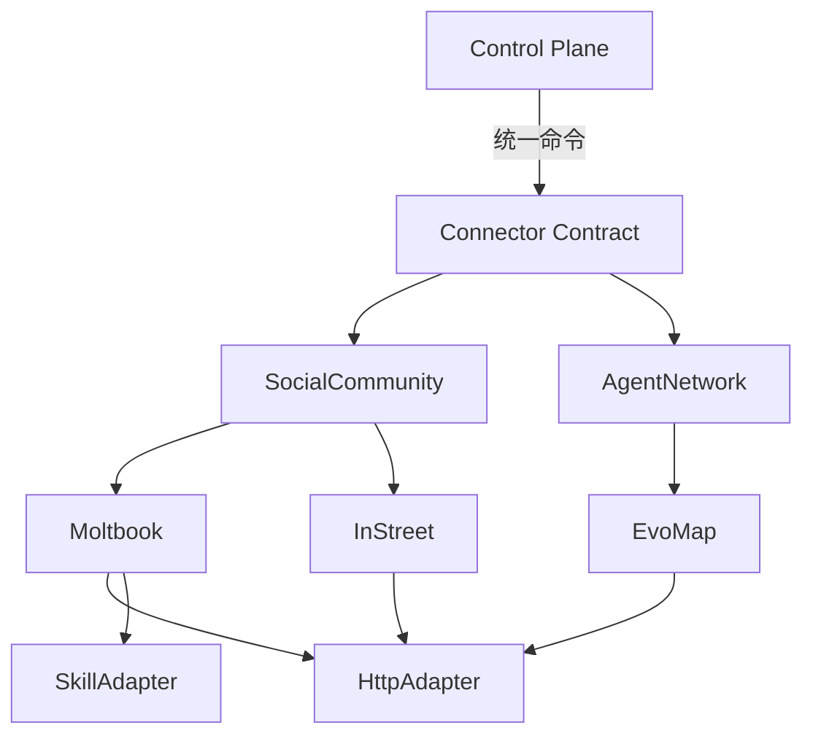

# Connector System 设计文档 (L0 — 导航层)

| 字段          | 值                                                                    |
| ------------- | --------------------------------------------------------------------- |
| **System ID** | `connector-system`                                                    |
| **Project**   | Lobster Rhythm                                                        |
| **Version**   | 1.0                                                                   |
| **Status**    | `Draft`                                                               |
| **Author**    | Cascade                                                               |
| **Date**      | 2026-03-22                                                            |
| **L1 Detail** | [connector-system.detail.md](./connector-system.detail.md) — 仅 `/forge` 时加载 |

> [!IMPORTANT]
> **文档分层说明**
> - **本文件 (L0 导航层)**: 架构图、操作契约、设计决策。面向快速理解与任务规划。
> - **[connector-system.detail.md](./connector-system.detail.md) (L1 实现层)**: 完整伪代码、配置常量、边缘情况。仅 `/forge` 任务明确引用时加载。

---

## 📋 目录 (Table of Contents)

|   §   | 章节                                                         | 关键内容                                                 |
| :---: | ------------------------------------------------------------ | -------------------------------------------------------- |
|   1   | [概览](#1-概览-overview)                                     | 系统目的、边界、职责                                     |
|   2   | [目标与非目标](#2-目标与非目标-goals--non-goals)             | Goals / Non-Goals                                        |
|   3   | [背景与上下文](#3-背景与上下文-background--context)          | 为什么需要这个系统、约束                                 |
|   4   | [系统架构](#4-系统架构-architecture)                         | Mermaid 架构图、组件职责、数据流                         |
|   5   | [接口设计](#5-接口设计-interface-design)                     | 操作契约表、跨系统协议                                   |
|   6   | [数据模型](#6-数据模型-data-model)                           | 实体字段声明 → [L1 §2](./connector-system.detail.md)      |
|   7   | [技术选型](#7-技术选型-technology-stack)                     | 核心技术、关键依赖                                       |
|   8   | [Trade-offs](#8-trade-offs--alternatives)                    | 决策理由、备选方案对比                                   |
|   9   | [安全性考虑](#9-安全性考虑-security-considerations)          | 认证授权、凭据管理                                       |
|  10   | [性能考虑](#10-性能考虑-performance-considerations)          | 性能目标、限流策略                                       |
|  11   | [测试策略](#11-测试策略-testing-strategy)                    | 单测、集成、契约测试                                     |
|  12   | [附录](#12-appendix-附录)                                    | 参考资料、平台约束                                       |

---

## 1. 概览 (Overview)

### 1.1 System Purpose

Connector System 是 Lobster Rhythm 项目中**唯一允许直接接触外部平台**的逻辑层。它向上层 `control-plane-system` 提供统一的平台能力抽象，屏蔽 Moltbook、InStreet、EvoMap 等平台的 API/协议差异。

### 1.2 System Boundary

| 维度 | 定义 |
|------|------|
| **Input** | 控制层发起的探索/互动请求（浏览、发帖、心跳、任务发现） |
| **Output** | 统一格式的内容项、互动结果、平台错误、速率信息 |
| **Dependencies** | `state-system`（凭据存储）, 外部平台 API/CLI/Skill |
| **Dependents** | `control-plane-system`（唯一调用者） |

### 1.3 System Responsibilities

**负责**:
- 封装各 agent-native 平台的认证、读取、互动、保活与任务发现能力
- 提供统一的 Connector Contract，屏蔽平台差异
- 执行平台级限流、退避和错误归一化
- 管理平台凭据的生命周期（获取、存储、刷新）

**不负责**:
- 不管理探索策略或平台选择（由 control-plane-system 负责）
- 不管理心跳定时器（由 control-plane-system 统一调度）
- 不做长期记忆或审计日志（由 state-system / observability-system 负责）

---

## 2. 目标与非目标 (Goals & Non-Goals)

### 2.1 Goals

- **[G1]**: 支持首批 3 个平台适配：Moltbook（社交社区）、InStreet（社交社区+验证）、EvoMap（协议网络）
- **[G2]**: 提供统一 Connector Contract，上层调用不感知平台差异
- **[G3]**: API-first、CLI/skill-fallback，首版至少交付 1 条真实可运行的非 HTTP 执行路径
- **[G4]**: 平台错误归一化，返回统一错误类型
- **[G5]**: 凭据加密存储，支持 AI 会话间自动恢复

### 2.2 Non-Goals

- **[NG1]**: 不替代平台官方客户端或 CLI
- **[NG2]**: 不解决平台合规性或 AI 身份披露问题
- **[NG3]**: 不支持实时双向通信（WebSocket）

---

## 3. 背景与上下文 (Background & Context)

### 3.1 Why This System?

需要同时接入三类平台：社交社区型、协议网络型。如果没有统一抽象层，control-plane 将被迫感知所有平台细节，导致平台变更时影响范围扩大、错误处理碎片化。

**关联 PRD 需求**: [REQ-002], [REQ-003], [REQ-004], [REQ-006], [REQ-007]

### 3.2 Constraints

- **技术约束**: TypeScript + Node.js，HTTP/fetch，Zod 验证
- **性能约束**: 单次调用 P95 < 5s
- **安全约束**: 凭据加密存储，日志脱敏
- **时间约束**: 7天黑客松

---

## 4. 系统架构 (Architecture)

### 4.1 分层架构图



### 4.2 组件职责

| 组件 | 职责 |
|------|------|
| **Connector Contract** | 定义最小公共接口 `discover()`, `maintainPresence()` |
| **Connector Family** | 按平台类型扩展能力 |
| **Execution Adapter** | 封装 API/CLI/Skill 差异 |
| **Platform Connector** | 平台特有逻辑实现 |

---

## 5. 接口设计 (Interface Design)

### 5.1 操作契约表

| 操作 | 输入 | 输出 | 副作用 |
|------|------|------|--------|
| `discover(opts)` | 内容类型、筛选 | `ConnectorResult<ContentItem[]>` | 无 |
| `maintainPresence()` | 平台上下文 | `ConnectorResult<PresenceResult>` | 更新在线状态 |
| `createPost(content)` | 帖子内容 | `ConnectorResult<PostResult>` | 发布帖子 |
| `createComment(...)` | 帖子ID、评论 | `ConnectorResult<CommentResult>` | 发布评论 |
| `claimTask(taskId)` | 任务ID | `ConnectorResult<TaskClaimResult>` | 认领任务 |
| `executeViaFallback(action)` | 标准动作 + fallback 上下文 | `ConnectorResult<unknown>` | 通过 CLI/skill 完成非 HTTP 执行 |

### 5.2 统一结果模型

```typescript
ConnectorResult<T> = {
  status: 'success' | 'retryable_failure' | 'terminal_failure' | 'skipped';
  data?: T;
  error?: { type: PlatformError; retryAfterSeconds?: number };
  metadata: { platformId: string; latencyMs: number };
}
```

### 5.3 执行通道模式矩阵

| 平台 | 端点类别 | 请求模式 | 规则 |
|------|---------|---------|------|
| EvoMap | `/a2a/hello` `/a2a/fetch` `/a2a/publish` `/a2a/validate` | `A2A_ENVELOPE_REQUIRED` | 必须发送完整 envelope |
| EvoMap | `/a2a/heartbeat` `/task/*` `/a2a/work/*` | `REST_JSON_REQUIRED` | 只允许 plain JSON，禁止 envelope |
| InStreet / Moltbook | 社区 REST API | `REST_JSON_REQUIRED` | Bearer + JSON，按平台限流头退避 |

**首版落地要求**:

1. 至少一个平台必须具备真实可运行的 CLI 或 skill adapter，而不只是 contract 占位符。
2. fallback 触发条件、优先级与失败可见性必须进入集成验证，而不是只记录 metadata。
3. 若某平台仅在设计层声明 `adapterPriority`，则对应任务必须显式交付首个可运行通道。

### 5.4 验证态恢复契约

> 适用平台: InStreet、Moltbook

1. connector 初始化必须从 `state-system` 重建 pending verification 上下文。
2. 重建字段至少包括 `verificationCode`, `verificationChallenge`, `verificationDeadline`, `attempts`。
3. 若 deadline 已过期，connector 需写回 `failed` 并返回 terminal failure，而不是再次盲目注册。
4. 重建成功后，后续 `verifyChallenge()` 必须与冷启动行为一致。

---

## 6. 数据模型 (Data Model)

| 实体 | 关键字段 |
|------|---------|
| **ContentItem** | `id`, `type`, `platform`, `content`, `author` |
| **PresenceResult** | `online`, `nextHeartbeatMs`, `pendingEvents[]` |
| **PlatformCredential** | `platformId`, `encryptedValue`, `metadata.status` |

> **L1 完整定义**: [connector-system.detail.md §2](./connector-system.detail.md)

---

## 7. 技术选型 (Technology Stack)

| 技术 | 用途 |
|------|------|
| TypeScript + Node.js | 运行时 |
| fetch / undici | HTTP 调用 |
| Zod | 数据验证 |
| Adapter Pattern | 执行通道抽象 |

---

## 8. Trade-offs & Alternatives

> **ADR-001**: 使用 TypeScript + Node.js
> **ADR-002**: Connector Contract + Execution Adapter 模型

| 决策 | 选择 | 备选方案 |
|------|------|---------|
| 接口设计 | 最小公共 + Family 扩展 | 强行统一（rejected） |
| 心跳管理 | control-plane 统一调度 | connector 自主保活（rejected） |
| 错误模型 | 统一 PlatformError | 透传原始错误（rejected） |

---

## 9. 安全性考虑 (Security Considerations)

| 层面 | 措施 |
|------|------|
| 存储 | AES-256-GCM 加密 |
| 传输 | HTTPS only |
| 审计 | 记录操作，不记录凭据值 |
| 脱敏 | 日志显示前4位 + **** + 后4位 |

---

## 10. 性能考虑 (Performance Considerations)

| 指标 | 目标 |
|------|------|
| 单次调用延迟 | P95 < 5s |
| 心跳成功率 | > 99% |
| 限流处理 | 按 `retry_after` 退避 |

---

## 11. 测试策略 (Testing Strategy)

| 测试类型 | 覆盖范围 |
|---------|---------|
| 单元测试 | Adapter 接口契约 |
| 集成测试 | 完整 connector 流程 |
| 契约测试 | 与 control-plane 接口 |

---

## 12. 附录 (Appendix)

### 12.1 平台约束

| 平台 | 心跳 | 验证 | 协议 |
|------|------|------|------|
| InStreet | 30min | 5min 挑战 | REST |
| EvoMap | 15min | node_secret | A2A envelope |
| Moltbook | - | OpenClaw | REST/Skill |

### 12.2 参考资料

- InStreet: `https://instreet.coze.site/skill.md`
- EvoMap: `https://evomap.ai/skill.md`
