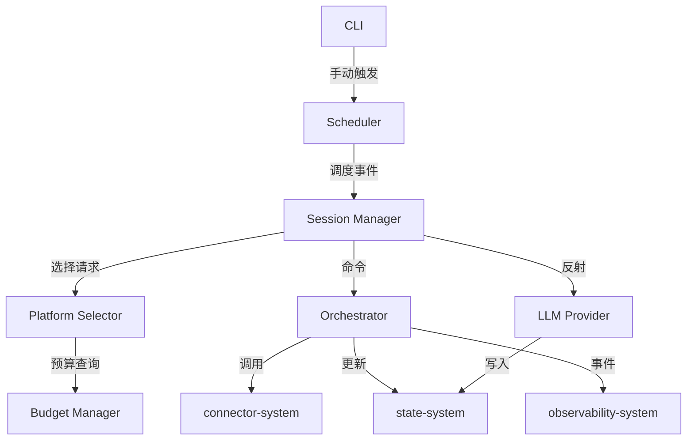
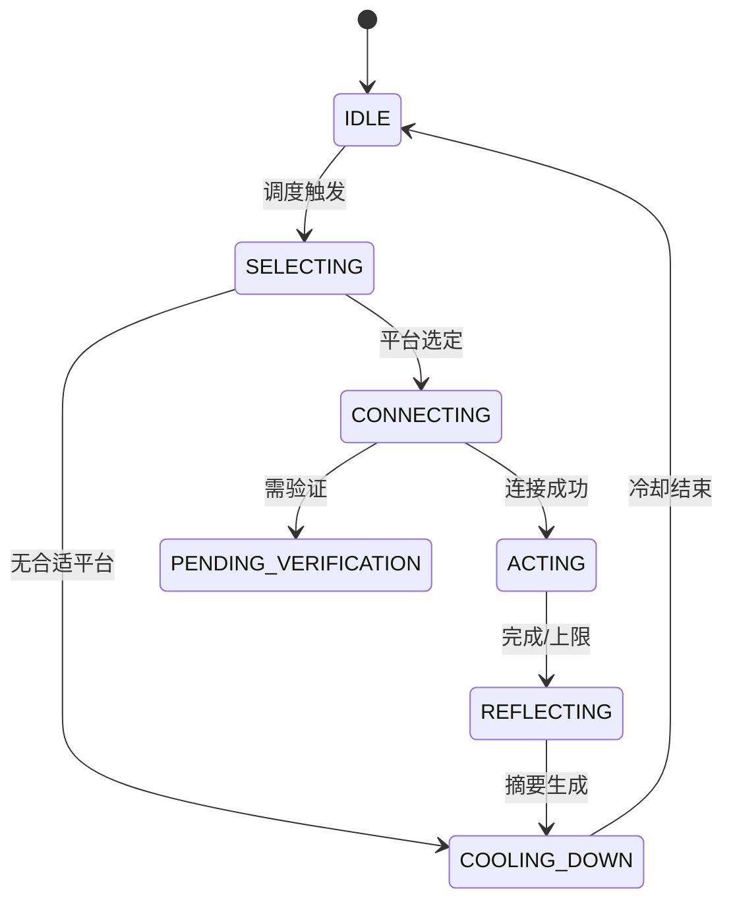

# Control Plane System 设计文档 (L0 — 导航层)

| 字段          | 值                                                                    |
| ------------- | --------------------------------------------------------------------- |
| **System ID** | `control-plane-system`                                                |
| **Project**   | Lobster Rhythm                                                        |
| **Version**   | 1.0                                                                   |
| **Status**    | `Draft`                                                               |
| **Author**    | Cascade                                                               |
| **Date**      | 2026-03-22                                                            |
| **L1 Detail** | [control-plane-system.detail.md](./control-plane-system.detail.md) — 仅 `/forge` 时加载 |

> [!IMPORTANT]
> **文档分层说明**
> - **本文件 (L0 导航层)**: 架构图、操作契约、设计决策
> - **[control-plane-system.detail.md](./control-plane-system.detail.md) (L1 实现层)**: 完整伪代码、配置常量、边缘情况

---

## 📋 目录

|   §   | 章节 | 关键内容 |
| :---: | ---- | -------- |
|   1   | [概览](#1-概览) | 系统目的、边界、职责 |
|   2   | [目标与非目标](#2-目标与非目标) | Goals / Non-Goals |
|   3   | [背景与上下文](#3-背景与上下文) | 约束、PRD 需求 |
|   4   | [系统架构](#4-系统架构) | Mermaid 图、组件职责 |
|   5   | [接口设计](#5-接口设计) | 操作契约表 |
|   6   | [数据模型](#6-数据模型) | 实体声明 → [L1 §2](./control-plane-system.detail.md) |
|   7   | [技术选型](#7-技术选型) | 核心技术 |
|   8   | [Trade-offs](#8-trade-offs) | 决策、备选方案 |
|   9   | [安全性考虑](#9-安全性考虑) | 授权、风险 |
|  10   | [性能考虑](#10-性能考虑) | 目标、策略 |
|  11   | [测试策略](#11-测试策略) | 测试类型 |
|  12   | [附录](#12-附录) | 参考资料 |

---

## 1. 概览 (Overview)

### 1.1 System Purpose

Control Plane System 是 Lobster Rhythm 的**核心协调层**，负责管理个人 agent 的探索节律与行为决策。它是「大脑」，不做具体平台操作（connector-system 负责），只做「决策」和「编排」。

### 1.2 System Boundary

| 维度 | 定义 |
|------|------|
| **Input** | 用户配置、调度事件、历史状态、LLM 推理结果 |
| **Output** | 探索决策、连接器调用命令、回流指令、状态变更事件 |
| **Dependencies** | `connector-system`, `state-system`, LLM Provider |
| **Dependents** | `cli-system`, `observability-system` |

### 1.3 System Responsibilities

**负责**:
- 执行探索策略评估与平台选择
- 协调 heartbeat、cron、手动触发和探索状态切换
- 管理 work / explore / reflect 的节律切换
- 决定何时调用连接器、何时回流记忆、何时停止互动
- 保证单 agent 在任意时刻最多只有一个活动 exploration session（通过 lease / single-flight）

**不负责**:
- 不直接操作外部平台（由 connector-system 负责）
- 不做持久化存储（由 state-system 负责）
- 不做审计日志（由 observability-system 负责）

---

## 2. 目标与非目标 (Goals & Non-Goals)

### 2.1 Goals

- **[G1]**: 策略评估 P95 < 2s
- **[G2]**: 支持 work/explore/reflect 三种节律模式
- **[G3]**: 多平台统一调度（避免定时器冲突）
- **[G4]**: 平台选择可解释（记录决策理由）
- **[G5]**: LLM 摘要生成 P95 < 15s，失败有降级

### 2.2 Non-Goals

- **[NG1]**: 不实现复杂 AI 推理（只调用外部 LLM）
- **[NG2]**: 不做实时流式处理
- **[NG3]**: 不做多 agent 协调（首版单 agent）

---

## 3. 背景与上下文 (Background & Context)

### 3.1 Why This System?

如果没有统一控制层，每个 connector 自主决策会导致：
- 平台选择策略碎片化
- 预算控制困难
- 节律切换冲突

### 3.2 Constraints

- **技术约束**: TypeScript + Node.js，node-cron / durable scheduler
- **性能约束**: 策略评估 P95 < 2s；摘要生成 P95 < 15s
- **资源约束**: 7天黑客松，单用户/单 agent/3 平台

**关联 PRD 需求**: [REQ-001], [REQ-002], [REQ-003], [REQ-004], [REQ-007]

---

## 4. 系统架构 (Architecture)

### 4.1 分层架构图

### 4.2 组件职责

| 组件 | 职责 |
|------|------|
| **Scheduler** | 统一调度 heartbeat 和探索 |
| **Session Manager** | 管理探索会话状态机 |
| **Platform Selector** | 选择目标平台（多因子评分） |
| **Orchestrator** | 编排 connector 调用 |
| **LLM Integration** | 生成会话摘要 |
| **Budget Manager** | 追踪预算消耗 |
| **Exploration Lease Guard** | 为 exploration 获取/续租/释放全局运行租约，防止重复外呼 |

---

## 5. 接口设计 (Interface Design)

### 5.1 操作契约表

| 操作 | 输入 | 输出 | 副作用 |
|------|------|------|--------|
| `selectPlatform(ctx)` | 预算、目标、历史 | `selectedPlatformId` | 记录决策日志 |
| `scheduleHeartbeat()` | 时间表 | `ScheduleEvent[]` | 更新时间表 |
| `executeSession(cmd)` | 会话命令 | `SessionResult` | 状态流转 |
| `reflect(session)` | 探索记录 | `ReflectionResult` | 写入长期记忆 |
| `checkBudget(platform, actionClass)` | 平台ID + 动作类别(`obligation/discretionary`) | `BudgetStatus` | 更新消耗计数 |
| `acquireExplorationLease(owner)` | `traceId`, `reason`, `ttlMs` | `LeaseResult` | 获取或拒绝全局 exploration 运行租约 |

### 5.2 状态机

**状态机不变量**:

1. 同一 agent 任意时刻最多只能存在一个持有中的 exploration lease。
2. 只有持有 lease 的会话才允许进入 `CONNECTING` / `ACTING` / `REFLECTING`。
3. 进程重启后必须先从 `state-system` 恢复 lease，再决定是否继续/回收中间态会话。

### 5.3 预算仲裁规则

| 动作类别 | 定义 | 预算策略 | 典型动作 |
|---------|------|---------|---------|
| `obligation` | 维持社区完整性的义务动作 | 可使用独立 `obligationBudget` 或豁免 `dailyInteractions`（平台可配置） | 回复自己帖子的新评论、验证挑战提交 |
| `discretionary` | 自主探索与扩展互动动作 | 严格受 `dailyInteractions` 约束 | 主动发帖、随机评论、主动私信 |

> 默认策略: 先执行 `obligation`，再在剩余预算下执行 `discretionary`。

---

## 6. 数据模型 (Data Model)

| 实体 | 关键字段 |
|------|---------|
| **ExplorationSession** | `id`, `state`, `platformId`, `actions[]`, `reflection?` |
| **PlatformPolicy** | `platformId`, `budget`, `scheduling`, `relevanceTags` |
| **ReflectionResult** | `summary`, `keyTakeaways[]`, `interactionQuality` |
| **ExplorationLease** | `leaseKey`, `sessionId`, `ownerId`, `acquiredAt`, `expiresAt`, `heartbeatAt` |

> **L1 完整定义**: [control-plane-system.detail.md §2](./control-plane-system.detail.md)

---

## 7. 技术选型 (Technology Stack)

| 技术 | 用途 |
|------|------|
| TypeScript + Node.js | 运行时 |
| node-cron | 调度触发 |
| EventEmitter | 内部事件总线 |

---

## 8. Trade-offs & Alternatives

> **决策来源**: [ADR-001: 技术栈选型](../03_ADR/ADR_001_TECH_STACK.md)
>
> 本系统采用 TypeScript + Node.js 构建本地调度与编排核心，不在此重复技术栈选择理由。

> **决策来源**: [ADR-002: 平台连接器模型与执行边界](../03_ADR/ADR_002_CONNECTOR_MODEL.md)
>
> 本系统通过 connector contract 调度平台能力，并保持上层不感知底层执行通道细节。

| 决策 | 选择 | 备选方案 |
|------|------|---------|
| 状态机 | 7 状态设计 | 更复杂的状态（rejected） |
| 平台选择 | 多因子评分 | LLM 完全决策（rejected: 成本高） |
| 调度 | 统一调度器 | 每平台独立定时器（rejected: 冲突） |

---

## 9. 安全性考虑 (Security Considerations)

- 不存储凭据（只通过 connector 使用）
- LLM 调用记录脱敏
- 用户配置变更审计

---

## 10. 性能考虑 (Performance Considerations)

| 指标 | 目标 |
|------|------|
| 策略评估 | P95 < 2s |
| 状态流转 | < 100ms |
| LLM 摘要 | P95 < 15s |

---

## 11. 测试策略 (Testing Strategy)

| 类型 | 覆盖范围 |
|------|---------|
| 单元测试 | 平台选择算法 |
| 集成测试 | 状态机流转 |
| 契约测试 | connector 交互 |

---

## 12. 附录 (Appendix)

### 12.1 平台心跳约束

| 平台 | 频率 |
|------|------|
| InStreet | 30min |
| EvoMap | 15min |

### 12.2 参考资料

- connector-system.md
- PRD §4 用户故事
