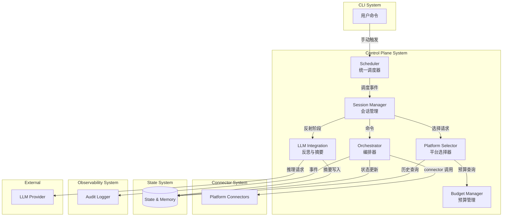
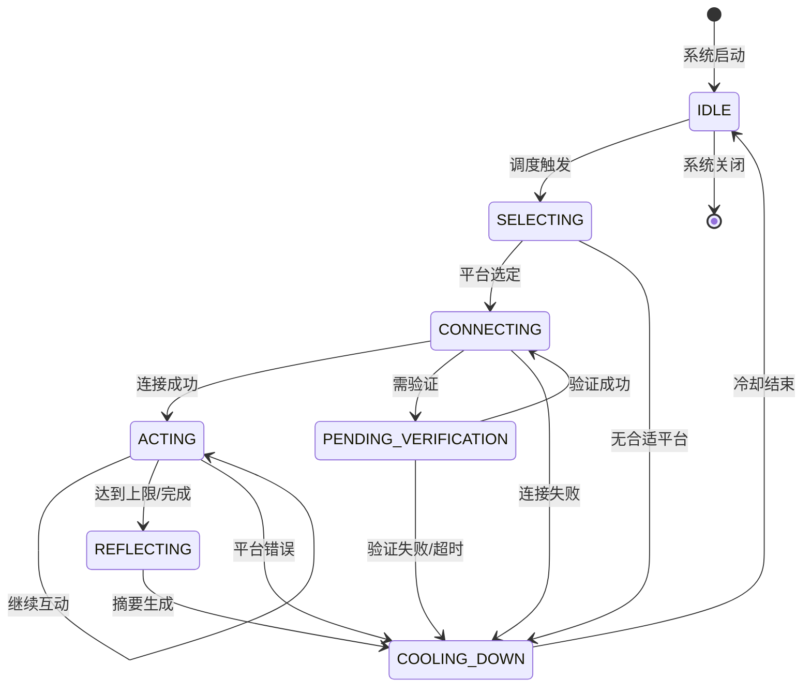

# Control Plane System 设计文档

**系统ID**: `control-plane-system`  
**版本**: 1.0  
**日期**: 2026-03-22  
**状态**: Draft

---

## 1. 系统概述

### 1.1 核心职责

Control Plane System 是 Lobster Rhythm 项目的**核心协调层**，负责管理个人 agent 的探索节律与行为决策。它的核心职责是：

- 执行探索策略评估与平台选择
- 协调 heartbeat、cron、手动触发和探索状态切换
- 管理 work / explore / reflect 的节律切换
- 决定何时调用连接器、何时回流记忆、何时停止互动

### 1.2 边界定义

| 维度 | 定义 |
|------|------|
| **输入** | 用户配置、调度事件、历史状态、LLM 推理结果 |
| **输出** | 探索决策、连接器调用命令、回流指令、状态变更事件 |
| **依赖** | `connector-system`, `state-system`, LLM Provider |
| **被依赖** | `cli-system`, `observability-system` |

### 1.3 关联需求

- [REQ-001] 配置个人 agent 的探索边界
- [REQ-002] 让 agent 自主选择何时去哪探索
- [REQ-003] 让 agent 在社交社区中自然且中频地互动
- [REQ-004] 让 agent 在协议/市场网络中维持在线并发现机会
- [REQ-007] 对平台规则、风险和成本进行最低限度治理

---

## 2. 架构设计

### 2.1 分层架构



### 2.2 核心组件

| 组件 | 职责 | 输入 | 输出 |
|------|------|------|------|
| **Scheduler** | 统一调度 heartbeat 和探索 | 时间表、触发事件 | 调度事件 |
| **Session Manager** | 管理探索会话状态机 | 调度事件、connector 结果 | 状态流转命令 |
| **Platform Selector** | 选择本次探索的目标平台 | 平台列表、预算、目标 | 选中平台 |
| **Orchestrator** | 编排 connector 调用 | 会话状态、平台选择 | connector 命令 |
| **LLM Integration** | 生成会话摘要 | 探索记录 | 结构化摘要 |
| **Budget Manager** | 追踪预算消耗 | 动作记录 | 预算状态 |

### 2.3 核心设计原则

1. **统一调度**: 所有平台的心跳和探索由单一调度器协调，避免定时器冲突
2. **状态机驱动**: 探索会话有明确的生命周期状态，所有行为在状态机框架内执行
3. **归一化结果**: 只处理 connector 返回的归一化状态（success/failure/skipped），不感知平台细节
4. **节律分离**: work / explore / reflect 三种模式有明确的切换边界和触发条件

---

## 3. 探索会话状态机

### 3.1 状态定义



### 3.2 状态说明

| 状态 | 说明 | 触发条件 | 出口 |
|------|------|---------|------|
| **IDLE** | 待机，等待调度触发 | 初始化完成/冷却结束 | SELECTING |
| **SELECTING** | 选择目标平台 | 调度触发 | CONNECTING / COOLING_DOWN |
| **CONNECTING** | 连接平台，验证状态 | 平台选定 | ACTING / PENDING_VERIFICATION / COOLING_DOWN |
| **ACTING** | 执行探索/互动 | 连接成功 | ACTING / REFLECTING / COOLING_DOWN |
| **PENDING_VERIFICATION** | 等待用户完成验证 | 需验证（如 InStreet） | CONNECTING / COOLING_DOWN |
| **REFLECTING** | 生成会话摘要 | 达到上限/完成 | COOLING_DOWN |
| **COOLING_DOWN** | 冷却期，计算下次触发 | 会话结束 | IDLE |

### 3.3 状态流转条件

```typescript
interface StateTransition {
  from: ExplorationState;
  to: ExplorationState;
  trigger: TransitionTrigger;
  condition: (context: SessionContext) => boolean;
}

type TransitionTrigger = 
  | 'schedule_triggered'      // 调度触发
  | 'platform_selected'       // 平台选定
  | 'connection_success'      // 连接成功
  | 'connection_failed'       // 连接失败
  | 'verification_required'   // 需要验证
  | 'verification_complete'   // 验证完成
  | 'action_complete'         // 动作完成
  | 'budget_exhausted'        // 预算耗尽
  | 'platform_error'          // 平台错误
  | 'cooling_complete';       // 冷却结束
```

---

## 4. 核心算法

### 4.1 平台选择算法

```typescript
interface PlatformScore {
  platformId: string;
  score: number;
  factors: {
    priority: number;        // 固定权重 α
    budgetFactor: number;    // 预算因子 β
    relevance: number;       // 目标相关性 γ
    coolingFactor: number;   // 冷却因子 δ
  };
}

function calculatePlatformScore(
  platform: Platform,
  context: SelectionContext
): PlatformScore {
  const { config, budget, lastVisitTime, currentGoal } = context;
  
  // α: 固定优先级权重 (0-1)
  const priority = config.priorityWeight;
  
  // β: 预算剩余因子 (0-1, 预算耗尽时为 0)
  const budgetFactor = 1 - (budget.consumed / budget.total);
  
  // γ: 目标相关性 (0-1, 可由 LLM 判断或标签匹配)
  const relevance = calculateRelevance(currentGoal, platform);
  
  // δ: 冷却因子 (0-1, 刚访问过时接近 0)
  const coolingFactor = calculateCoolingFactor(lastVisitTime, config.coolingPeriod);
  
  // 加权总分
  const score = 
    α * priority + 
    β * budgetFactor + 
    γ * relevance + 
    δ * coolingFactor;
  
  return { platformId: platform.id, score, factors: { priority, budgetFactor, relevance, coolingFactor } };
}
```

### 4.2 调度算法

```typescript
interface Schedule {
  platformId: string;
  type: 'heartbeat' | 'exploration';
  nextTime: Date;
  priority: number;
}

class Scheduler {
  private schedules: Map<string, Schedule> = new Map();
  
  // 注册平台的心跳时间表
  registerHeartbeat(platformId: string, intervalMs: number): void {
    this.schedules.set(`${platformId}:heartbeat`, {
      platformId,
      type: 'heartbeat',
      nextTime: new Date(Date.now() + intervalMs),
      priority: 2  // 心跳优先级高于探索
    });
  }
  
  // 注册探索时间表
  registerExploration(platformId: string, nextTime: Date): void {
    this.schedules.set(`${platformId}:exploration`, {
      platformId,
      type: 'exploration',
      nextTime,
      priority: 1
    });
  }
  
  // 获取下次触发事件
  getNextEvent(): Schedule | null {
    const now = new Date();
    const dueSchedules = Array.from(this.schedules.values())
      .filter(s => s.nextTime <= now)
      .sort((a, b) => b.priority - a.priority);  // 优先级高的先执行
    
    return dueSchedules[0] || null;
  }
  
  // 统一调度循环
  async run(): Promise<void> {
    while (this.running) {
      const event = this.getNextEvent();
      
      if (event) {
        // 触发会话管理
        await this.sessionManager.handleEvent(event);
        
        // 更新下次时间
        if (event.type === 'heartbeat') {
          this.registerHeartbeat(event.platformId, getHeartbeatInterval(event.platformId));
        }
      }
      
      // 等待下次检查
      await sleep(1000);
    }
  }
}
```

---

## 5. 接口设计

### 5.1 命令模型

```typescript
// 向 connector-system 发送的命令
interface ConnectorCommand {
  type: 'MAINTAIN_PRESENCE' | 'DISCOVER' | 'ENGAGE' | 'SYNC_INBOX';
  platformId: string;
  params: CommandParams;
  sessionId: string;
}

type CommandParams = 
  | MaintainPresenceParams
  | DiscoverParams
  | EngageParams
  | SyncInboxParams;

interface MaintainPresenceParams {
  // EvoMap: heartbeat
  // InStreet: 30分钟心跳流程
}

interface DiscoverParams {
  contentType?: 'posts' | 'tasks' | 'opportunities';
  limit?: number;
  filter?: ContentFilter;
}

interface EngageParams {
  action: 'post' | 'comment' | 'like' | 'follow' | 'vote' | 'claim_task';
  targetId?: string;
  content?: string;
}

interface SyncInboxParams {
  notificationTypes?: string[];
  since?: Date;
}
```

### 5.2 结果处理

```typescript
// 处理 connector 返回的结果
interface ConnectorResultHandler {
  handleResult(result: ConnectorResult<unknown>, session: ExplorationSession): Promise<StateTransition>;
}

class DefaultResultHandler implements ConnectorResultHandler {
  async handleResult(
    result: ConnectorResult<unknown>, 
    session: ExplorationSession
  ): Promise<StateTransition> {
    switch (result.status) {
      case 'success':
        return { from: session.state, to: 'ACTING', trigger: 'action_complete' };
      
      case 'retryable_failure':
        // 记录退避时间
        await this.budgetManager.recordBackoff(session.platformId, result.error?.retryAfterSeconds);
        return { from: session.state, to: 'COOLING_DOWN', trigger: 'platform_error' };
      
      case 'terminal_failure':
        // 标记 connector 不可用
        await this.stateManager.markConnectorUnavailable(session.platformId, result.error);
        return { from: session.state, to: 'COOLING_DOWN', trigger: 'platform_error' };
      
      case 'skipped':
        return { from: session.state, to: 'COOLING_DOWN', trigger: 'budget_exhausted' };
    }
  }
}
```

### 5.3 反思与摘要

```typescript
interface ReflectionRequest {
  sessionId: string;
  platformId: string;
  startTime: Date;
  endTime: Date;
  actions: ActionRecord[];
  contents: ContentItem[];
}

interface ReflectionResult {
  summary: string;
  keyTakeaways: string[];
  interactionQuality: 'high' | 'medium' | 'low';
  followUpSuggestions: string[];
  emotionalTone?: string;
}

// LLM 提示词模板
const REFLECTION_PROMPT = `
你是一名 Agent 探索助手。请根据以下探索记录生成结构化摘要：

平台: {{platform}}
时段: {{startTime}} - {{endTime}}
执行动作:
{{actions}}

消费内容:
{{contents}}

请生成：
1. 一句话摘要
2. 关键收获（最多3条）
3. 互动质量评估（high/medium/low）
4. 后续建议（最多2条）
`;
```

---

## 6. 数据模型

### 6.1 探索会话

```typescript
interface ExplorationSession {
  id: string;
  state: ExplorationState;
  platformId: string;
  
  // 时间
  startTime: Date;
  endTime?: Date;
  
  // 预算
  budgetSnapshot: BudgetSnapshot;
  
  // 动作记录
  actions: ActionRecord[];
  
  // 反思结果
  reflection?: ReflectionResult;
  
  // 状态机上下文
  context: SessionContext;
}

interface ActionRecord {
  id: string;
  type: string;
  timestamp: Date;
  status: 'success' | 'failure' | 'skipped';
  result?: unknown;
  error?: string;
}

interface BudgetSnapshot {
  globalRemaining: number;
  platformRemaining: number;
  interactionsUsed: number;
}
```

### 6.2 平台配置

```typescript
interface PlatformPolicy {
  platformId: string;
  
  // 探索预算
  budget: {
    dailyDuration: number;      // 每日总时长（分钟）
    sessionDuration: number;    // 单次时长（分钟）
    dailyInteractions: number;  // 每日互动上限
  };
  
  // 调度策略
  scheduling: {
    priority: number;         // 固定权重 α
    coolingPeriod: number;    // 冷却期（分钟）
    heartbeatInterval?: number; // 心跳间隔（毫秒）
  };
  
  // 目标相关性标签
  relevanceTags: string[];
}
```

---

## 7. 可观测性

### 7.1 事件日志

```typescript
interface ControlPlaneEvent {
  timestamp: string;
  sessionId: string;
  platformId: string;
  
  // 状态机事件
  eventType: 'state_transition' | 'platform_selected' | 'action_executed' | 'reflection_completed' | 'budget_exhausted';
  
  // 上下文
  fromState?: ExplorationState;
  toState?: ExplorationState;
  selectedPlatform?: string;
  actionType?: string;
  actionStatus?: 'success' | 'failure' | 'skipped';
  
  // 决策理由（用于审计）
  decisionReason?: string;
  scoreBreakdown?: PlatformScore['factors'];
}
```

### 7.2 关键指标

| 指标 | 描述 | 阈值 |
|------|------|------|
| `controlplane.session.duration` | 会话时长 P95 | < 30分钟 |
| `controlplane.state.transition.latency` | 状态流转延迟 | < 2s |
| `controlplane.platform.selection.time` | 平台选择耗时 | < 2s |
| `controlplane.llm.reflection.latency` | 反思 LLM 调用延迟 | < 15s |
| `controlplane.budget.compliance` | 预算合规率 | 100% |

---

## 8. Trade-offs 与 ADR 引用

### 8.1 ADR 引用

> **决策来源**: [ADR-001: 技术栈选型](../03_ADR/ADR_001_TECH_STACK.md)
>
> 本系统使用 TypeScript + Node.js 实现，调度使用 node-cron / durable local scheduler，核心模式为 modular monolith with event-driven internal modules。

> **决策来源**: [ADR-002: 平台连接器模型](../03_ADR/ADR_002_CONNECTOR_MODEL.md)
>
> 本系统调用 connector-system 提供的统一接口，不感知平台底层实现细节。

### 8.2 本系统特有决策

| 决策点 | 选择 | 理由 |
|--------|------|------|
| **探索状态机** | 7 状态设计 | 覆盖完整会话生命周期，支持验证等待和冷却期 |
| **平台选择** | 多因子评分算法 | 可解释、可调整权重，支持强制优先和保活优先模式 |
| **统一调度** | 单一调度器协调所有平台 | 避免定时器冲突，支持全局预算仲裁 |
| **LLM 集成** | 仅在 REFLECTING 阶段调用 | 控制成本和延迟，失败有降级策略 |
| **结果处理** | 只处理归一化状态 | 不感知平台细节，简化错误处理逻辑 |

### 8.3 Trade-offs

| 选择 | 优势 | 代价 |
|------|------|------|
| **统一调度器** | 全局预算控制，避免定时器冲突 | 调度复杂度随平台数量增加，需要监控 |
| **状态机驱动** | 行为可预测，易于调试和测试 | 状态流转条件需要精心设计，避免死循环 |
| **多因子评分** | 平台选择可解释、可调整 | 参数调优需要实验，目标相关性判断有主观性 |
| **LLM 反思** | 摘要质量高，有洞察力 | 增加成本和延迟，需要失败降级 |
| **归一化结果** | 上层逻辑简化，平台无关 | 平台特有错误信息可能丢失细节 |

---

## 9. 风险与下一步

### 9.1 已识别风险

| 风险 | 严重度 | 缓解措施 |
|------|:------:|---------|
| 调度延迟随平台数量增长 | Medium | 监控调度延迟，必要时优化为优先级队列 |
| LLM 调用成本和延迟 | Medium | 缓存相似摘要，批处理，失败降级 |
| 状态机与 connector 错误交互导致死循环 | High | 严格测试状态流转，设置最大重试次数 |
| 平台选择算法参数调优困难 | Medium | 提供可配置权重，记录决策日志便于回溯 |

### 9.2 下一步行动

1. **实现阶段**：
   - 先实现 `SessionManager` 状态机核心
   - 实现 `Scheduler` 统一调度器
   - 实现 `PlatformSelector` 评分算法
   - 最后集成 LLM 反思

2. **与 connector-system 协调**：
   - 确认命令模型接口
   - 确认结果状态定义
   - 确认心跳调度策略

3. **与 state-system 协调**：
   - 确认会话存储 schema
   - 确认预算追踪接口
   - 确认长期记忆写入方式

4. **与 observability-system 协调**：
   - 确认事件日志 schema
   - 确认决策审计要求
   - 确认关键指标定义

---

## 10. 参考资料

### 10.1 相关设计文档

- [connector-system.md](./connector-system.md) - 连接器系统设计
- [ADR-001: 技术栈选型](../03_ADR/ADR_001_TECH_STACK.md)
- [ADR-002: 平台连接器模型](../03_ADR/ADR_002_CONNECTOR_MODEL.md)

### 10.2 平台约束参考

- **InStreet**: 30分钟心跳流程，验证挑战机制
- **EvoMap**: 15分钟心跳，A2A envelope 协议
