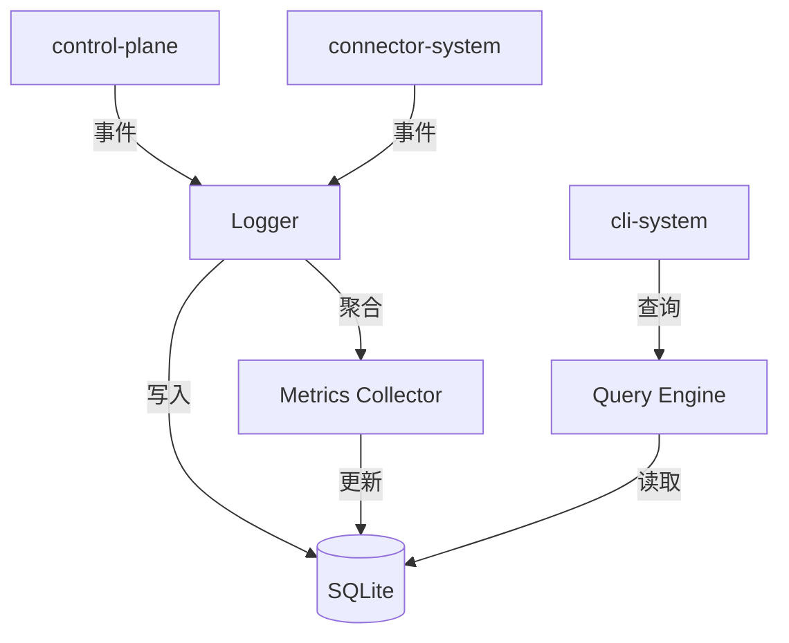

# Observability System 设计文档 (L0 — 导航层)

| 字段          | 值                                                                    |
| ------------- | --------------------------------------------------------------------- |
| **System ID** | `observability-system`                                                |
| **Project**   | Lobster Rhythm                                                        |
| **Version**   | 1.0                                                                   |
| **Status**    | `Draft`                                                               |
| **Author**    | Cascade                                                               |
| **Date**      | 2026-03-22                                                            |
| **L1 Detail** | [observability-system.detail.md](./observability-system.detail.md)    |

---

## 📋 目录

|   §   | 章节 | 关键内容 |
| :---: | ---- | -------- |
|   1   | [概览](#1-概览) | 系统目的、边界、职责 |
|   2   | [目标与非目标](#2-目标与非目标) | Goals / Non-Goals |
|   3   | [背景与上下文](#3-背景与上下文) | 约束、PRD 需求 |
|   4   | [系统架构](#4-系统架构) | Mermaid 图、组件职责 |
|   5   | [接口设计](#5-接口设计) | 操作契约表 |
|   6   | [数据模型](#6-数据模型) | 实体声明 → [L1 §2](./observability-system.detail.md) |
|   7   | [技术选型](#7-技术选型) | 核心技术 |
|   8   | [Trade-offs](#8-trade-offs) | 决策、备选方案 |
|   9   | [安全性考虑](#9-安全性考虑) | 脱敏、隐私 |
|  10   | [性能考虑](#10-性能考虑) | 目标、策略 |
|  11   | [测试策略](#11-测试策略) | 测试类型 |
|  12   | [附录](#12-附录) | 参考资料 |

---

## 1. 概览 (Overview)

### 1.1 System Purpose

Observability System 负责记录、存储和查询 agent 的全生命周期行为数据。它是「审计员」和「分析师」，让 owner 能够信任并理解 agent 的自主行为。

### 1.2 System Boundary

| 维度 | 定义 |
|------|------|
| **Input** | 事件、日志、指标（来自 control-plane, connector, cli） |
| **Output** | 审计日志、指标聚合、查询结果 |
| **Dependencies** | `state-system`（存储） |
| **Dependents** | `cli-system`（展示），`control-plane-system`（决策参考） |

### 1.3 System Responsibilities

**负责**:
- 记录所有跨系统事件（connector 调用、状态流转、LLM 调用）
- 生成关键指标（成功率、延迟、预算合规率）
- 支持结构化查询（按平台、时段、动作类型过滤）
- 凭据脱敏（日志中不记录敏感信息）

**不负责**:
- 不做实时告警（首版超出范围）
- 不做复杂数据分析（只提供原始数据+基础聚合）
- 不存储长期记忆内容（只存审计元数据）

---

## 2. 目标与非目标 (Goals & Non-Goals)

### 2.1 Goals

- **[G1]**: 100% 会话可追踪（每次探索均有结构化记录）
- **[G2]**: 凭据脱敏率 100%（日志无敏感信息）
- **[G3]**: 查询响应 P95 < 1s（最近 30 天数据）
- **[G4]**: 存储 90 天（自动归档）

### 2.2 Non-Goals

- **[NG1]**: 不实现实时监控 Dashboard
- **[NG2]**: 不做机器学习异常检测
- **[NG3]**: 不做跨用户聚合分析

---

## 3. 背景与上下文 (Background & Context)

### 3.1 Why This System?

PRD 要求「没有回流与审计，用户就无法信任全自主 agent」。observability-system 是信任的基础。

**关联 PRD 需求**: [REQ-005], [REQ-007]

### 3.2 Constraints

- **技术约束**: SQLite 本地存储，结构化日志
- **性能约束**: 写入不影响主流程（异步）
- **隐私约束**: 凭据脱敏，用户可导出原始数据

---

## 4. 系统架构 (Architecture)

### 4.1 分层架构图



### 4.2 组件职责

| 组件 | 职责 |
|------|------|
| **Logger** | 接收事件，格式化，脱敏，写入 |
| **Query Engine** | 处理查询请求，过滤，聚合 |
| **Metrics Collector** | 定期聚合指标（成功率、延迟） |
| **Storage** | SQLite 持久化 |

---

## 5. 接口设计 (Interface Design)

### 5.1 操作契约表

| 操作 | 输入 | 输出 | 副作用 |
|------|------|------|--------|
| `logEvent(event)` | 原始事件 | `void` | 写入日志表 |
| `logAudit(action)` | 审计动作 | `void` | 写入审计表 |
| `queryEvents(filter)` | 查询条件 | `Event[]` | 无（只读） |
| `getMetrics(name, range)` | 指标名、时间范围 | `MetricSeries` | 无（只读） |
| `exportLogs(range)` | 时间范围 | `ExportFile` | 生成导出文件 |

### 5.2 事件类型（统一 Taxonomy）

```typescript
type EventType = 
  // Connector 调用相关
  | 'connector_call'              // connector 调用
  | 'connector_retryable_failure' // 可重试失败
  | 'connector_terminal_failure'  // 不可恢复失败
  
  // 状态机流转
  | 'state_transition'            // 状态机流转
  | 'verification_timeout'        // 验证超时（来自 control-plane）
  | 'cooling_applied'             // 冷却期应用
  
  // 平台选择与决策
  | 'platform_selected'           // 平台选择
  | 'platform_skipped'            // 平台跳过（含理由）
  | 'budget_exhausted'            // 预算耗尽
  
  // LLM 相关
  | 'llm_reflection'              // LLM 调用
  | 'llm_reflection_failed'       // LLM 失败降级
  
  // 凭据生命周期
  | 'credential_changed'          // 凭据变更
  | 'credential_verified'         // 凭据验证成功
  | 'credential_failed'           // 凭据验证失败
  | 'credential_revoked'          // 凭据撤销
  
  // 系统级
  | 'session_resumed'             // 会话恢复
  | 'session_archived'            // 会话归档
  | 'user_action';                // 用户手动操作

// 事件重要性分级（用于丢弃策略）
type EventPriority = 'critical' | 'high' | 'normal' | 'low';

const EVENT_PRIORITY_MAP: Record<EventType, EventPriority> = {
  'credential_changed': 'critical',      // 审计必需
  'credential_verified': 'critical',
  'credential_failed': 'critical',
  'credential_revoked': 'critical',
  'verification_timeout': 'high',        // 解释性事件
  'cooling_applied': 'high',
  'platform_skipped': 'high',
  'connector_terminal_failure': 'high',
  'session_resumed': 'high',
  'state_transition': 'normal',
  'platform_selected': 'normal',
  'budget_exhausted': 'normal',
  'connector_call': 'normal',
  'connector_retryable_failure': 'normal',
  'llm_reflection': 'low',               // 可丢弃
  'llm_reflection_failed': 'low',
  'session_archived': 'low',
  'user_action': 'low',
};
```

### 5.3 事件丢弃策略

| 优先级 | 队列满时行为 | 说明 |
|--------|-------------|------|
| `critical` | 阻塞写入，永不丢弃 | 审计必需事件 |
| `high` | 同步写入，阻塞直到成功 | 重要解释性事件 |
| `normal` | 异步写入，允许延迟 | 常规事件 |
| `low` | 异步写入，队列满时丢弃 | 可丢失事件 |

---

## 6. 数据模型 (Data Model)

| 实体 | 关键字段 |
|------|---------|
| **EventLog** | `id`, `timestamp`, `type`, `platformId?`, `sessionId?`, `payload` |
| **AuditLog** | `id`, `timestamp`, `action`, `actor`, `resource`, `result` |
| **MetricPoint** | `name`, `timestamp`, `value`, `labels` |

> **L1 完整定义**: [observability-system.detail.md §2](./observability-system.detail.md)

---

## 7. 技术选型 (Technology Stack)

| 技术 | 用途 |
|------|------|
| SQLite | 本地结构化存储 |
| EventEmitter | 事件收集 |
| Async Queue | 异步写入（不阻塞主流程） |

---

## 8. Trade-offs & Alternatives

 > **决策来源**: [ADR-001: 技术栈选型](../03_ADR/ADR_001_TECH_STACK.md)
 >
 > 本系统采用本地 SQLite 与异步写入队列承载结构化事件，不在此重复主栈选择理由。

 > **决策来源**: [ADR-002: 平台连接器模型与执行边界](../03_ADR/ADR_002_CONNECTOR_MODEL.md)
 >
 > 本系统负责记录 execution adapter 与失败来源，支撑上层对 API / CLI / skill 通道的可追踪性。

| 决策 | 选择 | 备选方案 |
|------|------|---------|
| 存储 | SQLite | 纯文本日志（rejected: 查询困难） |
| 写入 | 异步队列 | 同步写入（rejected: 影响性能） |
| 脱敏 | 正则匹配 + 字段黑名单 | 加密存储（rejected: 查询无法脱敏） |

---

## 9. 安全性考虑 (Security Considerations)
 
 - 凭据字段自动脱敏（基于精确字段名匹配规则，避免误匹配）
 - 用户可导出原始数据（JSON 格式）
 - 不收集用户隐私内容（只存元数据）

---

## 10. 性能考虑 (Performance Considerations)

| 指标 | 目标 |
|------|------|
| 写入延迟 | < 10ms（异步） |
| 查询延迟 | P95 < 1s（30天数据） |
| 存储增长 | < 100MB/月 |

---

## 11. 测试策略 (Testing Strategy)

| 类型 | 覆盖范围 |
|------|---------|
| 单元测试 | 脱敏逻辑 |
| 集成测试 | 事件流转 |
| 性能测试 | 批量写入 |

---

## 12. 附录 (Appendix)

### 12.1 指标列表

| 指标名 | 类型 | 说明 |
|--------|------|------|
| `exploration.success_rate` | gauge | 探索成功率 |
| `connector.latency.p95` | gauge | connector 延迟 |
| `budget.compliance_rate` | gauge | 预算合规率 |

### 12.2 参考资料

- PRD §5 用户体验
- `connector-system.md` §5 接口设计
