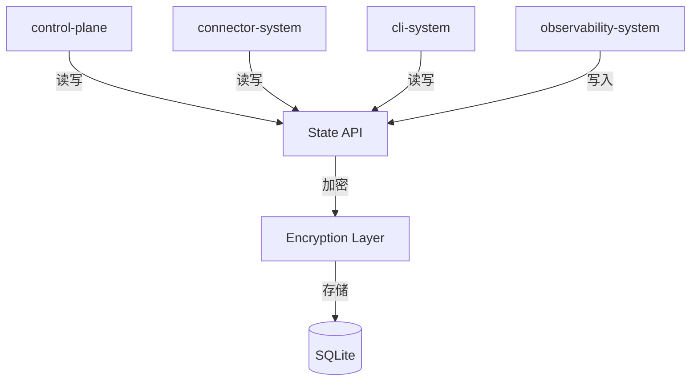

# State System 设计文档 (L0 — 导航层)

| 字段          | 值                                                                    |
| ------------- | --------------------------------------------------------------------- |
| **System ID** | `state-system`                                                        |
| **Project**   | Lobster Rhythm                                                        |
| **Version**   | 1.0                                                                   |
| **Status**    | `Draft`                                                               |
| **Author**    | Cascade                                                               |
| **Date**      | 2026-03-22                                                            |
| **L1 Detail** | [state-system.detail.md](./state-system.detail.md)                    |

---

## 📋 目录

|   §   | 章节 | 关键内容 |
| :---: | ---- | -------- |
|   1   | [概览](#1-概览) | 系统目的、边界、职责 |
|   2   | [目标与非目标](#2-目标与非目标) | Goals / Non-Goals |
|   3   | [背景与上下文](#3-背景与上下文) | 约束、PRD 需求 |
|   4   | [系统架构](#4-系统架构) | Mermaid 图、组件职责 |
|   5   | [接口设计](#5-接口设计) | 操作契约表 |
|   6   | [数据模型](#6-数据模型) | 实体声明 → [L1 §2](./state-system.detail.md) |
|   7   | [技术选型](#7-技术选型) | 核心技术 |
|   8   | [Trade-offs](#8-trade-offs) | 决策、备选方案 |
|   9   | [安全性考虑](#9-安全性考虑) | 加密、备份 |
|  10   | [性能考虑](#10-性能考虑) | 目标、策略 |
|  11   | [测试策略](#11-测试策略) | 测试类型 |
|  12   | [附录](#12-附录) | 参考资料 |

---

## 1. 概览 (Overview)

### 1.1 System Purpose

State System 是 Lobster Rhythm 的**持久化层**，负责存储所有非临时数据：用户配置、平台凭据、会话记录、长期记忆。它是「记忆库」，让 AI 会话间不丢失状态。

### 1.2 System Boundary

| 维度 | 定义 |
|------|------|
| **Input** | 写请求（来自 control-plane, connector, cli） |
| **Output** | 读结果、查询结果 |
| **Dependencies** | 无（底层 SQLite） |
| **Dependents** | 所有其他系统 |

### 1.3 System Responsibilities

**负责**:
- 存储用户配置和平台策略
- 加密存储平台凭据
- 存储探索会话和长期记忆
- 提供 CRUD 接口
- 数据备份和恢复

**不负责**:
- 不做数据解释或业务逻辑
- 不做审计日志（由 observability-system 负责）
- 不做跨会话同步（单用户本地优先）

---

## 2. 目标与非目标 (Goals & Non-Goals)

### 2.1 Goals

- **[G1]**: 凭据加密存储（AES-256-GCM）
- **[G2]**: AI 会话间状态自动恢复
- **[G3]**: 数据可备份/恢复
- **[G4]**: 查询延迟 P95 < 100ms

### 2.2 Non-Goals

- **[NG1]**: 不做分布式存储
- **[NG2]**: 不做实时同步
- **[NG3]**: 不做数据版本控制

---

## 3. 背景与上下文 (Background & Context)

### 3.1 Why This System?

PRD 强调「AI 会话间不丢失凭据」。state-system 提供加密持久化，让新 AI 会话能恢复完整状态。

**关联 PRD 需求**: [REQ-001], [REQ-004], [REQ-005]

### 3.2 Constraints

- **技术约束**: SQLite 本地文件
- **安全约束**: 主密码派生密钥
- **性能约束**: 单机本地访问

---

## 4. 系统架构 (Architecture)

### 4.1 分层架构图



### 4.2 组件职责

| 组件 | 职责 |
|------|------|
| **State API** | 提供统一 CRUD 接口 |
| **Encryption Layer** | 凭据加密/解密 |
| **Storage** | SQLite 持久化 |

---

## 5. 接口设计 (Interface Design)

### 5.1 操作契约表

| 操作 | 输入 | 输出 | 副作用 |
|------|------|------|--------|
| `get(key)` | 键 | 值 | 无 |
| `set(key, value)` | 键、值 | `void` | 写入 |
| `delete(key)` | 键 | `void` | 删除 |
| `query(table, filter)` | 表名、条件 | 记录数组 | 无 |
| `getCredential(platformId)` | 平台ID | 解密凭据 | 更新 lastUsedAt |
| `setCredential(cred)` | 凭据 | `void` | 加密写入 |
| `export()` | - | 加密备份 | 生成文件 |
| `import(data, password)` | 备份数据、密码 | `void` | 恢复数据 |
| `tryAcquireExplorationLease(lease)` | 运行租约 | `LeaseAcquireResult` | 获取或续租全局 exploration 锁 |
| `releaseExplorationLease(ref)` | `leaseKey`, `sessionId` | `void` | 释放全局 exploration 锁 |

---

## 6. 数据模型 (Data Model)

| 实体 | 关键字段 |
|------|---------|
| **UserConfig** | `id`, `preferences`, `globalBudget` |
| **PlatformPolicy** | `platformId`, `budget`, `scheduling` |
| **PlatformCredential** | `platformId`, `type` (`api_key`/`node_secret`/`oauth_token`), `encryptedValue` (含 IV/tag/salt), `metadata` (含完整 status 枚举: unregistered/pending_verification/active/expired/revoked/failed), `platformSpecific` (含 nodeId, claimUrl, verificationDeadline) |
| **ExplorationSession** | `id`, `platformId`, `state`, `budgetSnapshot`, `actionsJson`, `reflectionJson?`, `contextJson` (新增，用于恢复), `schemaVersion` (版本控制), `createdAt`, `updatedAt` |
| **LongTermMemory** | `id`, `type`, `content`, `embedding?` |
| **ExplorationLease** | `leaseKey`, `sessionId`, `ownerId`, `traceId`, `acquiredAt`, `heartbeatAt`, `expiresAt` |

> **L1 完整定义**: [state-system.detail.md §2](./state-system.detail.md)

---

## 7. 技术选型 (Technology Stack)

| 技术 | 用途 |
|------|------|
| SQLite | 本地结构化存储 |
| AES-256-GCM | 凭据加密 |
| PBKDF2 | 主密码派生密钥 |
| better-sqlite3 | Node.js SQLite 驱动 |

---

## 8. Trade-offs & Alternatives

> **决策来源**: [ADR-001: 技术栈选型](../03_ADR/ADR_001_TECH_STACK.md)
>
> 本系统采用 SQLite 作为单机状态与日志存储，不在此重复主栈与单机存储选择理由。

| 决策 | 选择 | 备选方案 |
|------|------|---------|
| 存储 | SQLite | JSON 文件（rejected: 查询困难） |
| 加密 | AES-256-GCM | 明文存储（rejected: 不安全） |
| 密钥派生 | PBKDF2 | Argon2（rejected: Node.js 支持有限） |
| 备份 | 加密导出 | 自动云同步（rejected: 超出范围） |

---

## 9. 安全性考虑 (Security Considerations)

- 主密码派生密钥（PBKDF2，100k 迭代）
- 凭据字段单独加密
- 内存中解密后及时清除
- 支持明文导出（用户自担风险，需二次确认）
- exploration lease 必须以 compare-and-set 方式获取，避免多 tick / 重启恢复时重复执行

---

## 10. 性能考虑 (Performance Considerations)

| 指标 | 目标 |
|------|------|
| 单条读取 | < 10ms |
| 查询延迟 | P95 < 100ms |
| 批量写入 | < 100ms/100条 |

---

## 11. 测试策略 (Testing Strategy)

| 类型 | 覆盖范围 |
|------|---------|
| 单元测试 | 加密/解密逻辑 |
| 集成测试 | 完整 CRUD 流程 |
| 安全测试 | 密钥派生、脱敏 |

---

## 12. 附录 (Appendix)

### 12.1 数据库表结构

```sql
-- 凭据表
CREATE TABLE credentials (
  platform_id TEXT PRIMARY KEY,
  type TEXT NOT NULL,
  encrypted_value TEXT NOT NULL,
  metadata TEXT NOT NULL,
  platform_specific TEXT NOT NULL DEFAULT '{}',
  created_at TEXT NOT NULL,
  updated_at TEXT NOT NULL
);

-- 会话表
CREATE TABLE sessions (
  id TEXT PRIMARY KEY,
  platform_id TEXT NOT NULL,
  state TEXT NOT NULL,
  start_time TEXT NOT NULL,
  end_time TEXT,
  budget_snapshot TEXT NOT NULL,
  actions_json TEXT NOT NULL,
  reflection_json TEXT,
  context_json TEXT NOT NULL,
  schema_version INTEGER NOT NULL,
  created_at TEXT NOT NULL,
  updated_at TEXT NOT NULL
);

-- exploration 全局运行租约表
CREATE TABLE exploration_leases (
  lease_key TEXT PRIMARY KEY,
  session_id TEXT NOT NULL,
  owner_id TEXT NOT NULL,
  trace_id TEXT NOT NULL,
  acquired_at TEXT NOT NULL,
  heartbeat_at TEXT NOT NULL,
  expires_at TEXT NOT NULL
);
```

### 12.2 参考资料

- connector-system.md §6 凭据管理
- PRD §5 用户体验
