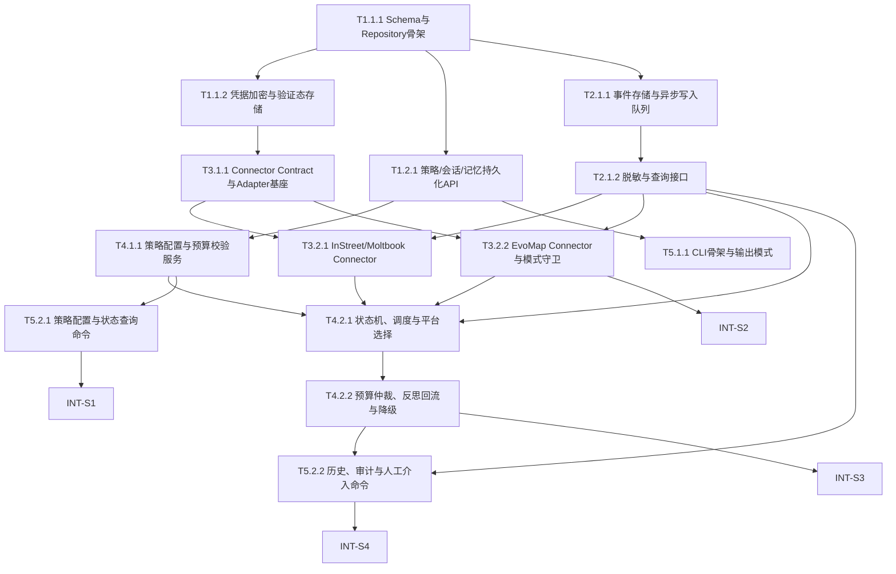

# Lobster Rhythm 任务清单 (05_TASKS)

> 版本: v1  
> 来源: 基于 `01_PRD.md`、`02_ARCHITECTURE_OVERVIEW.md`、`03_ADR/` 与 `04_SYSTEM_DESIGN/` 的正式 `/blueprint` 产物  
> 目标: 生成可直接进入 `/forge` 的正式 WBS 任务蓝图  
> 状态: 当前为正式任务真理源，替代此前 challenge 承接草案

---

## 🔗 依赖图总览

---

## 📊 Sprint 路线图

| Sprint | 代号 | 核心任务 | 退出标准 | 预估 |
|--------|------|---------|---------|------|
| S1 | Bedrock | 状态存储、审计底座、CLI骨架 | 本地 schema 可初始化；策略可保存与查询；状态命令可返回结构化结果 | 2-3d |
| S2 | Connect | Connector contract + 三平台首批接入 | InStreet / Moltbook / EvoMap connector 可在模拟环境跑通核心路径 | 2-3d |
| S3 | Rhythm | 自主探索调度、预算仲裁、记忆回流 | 探索触发 → 平台选择 → 行动/跳过 → 回流形成闭环 | 2-3d |
| S4 | Audit | CLI查询、人工介入、演示可审计性 | Owner 可配置、查看历史、定位待处理动作并完成演示路径 | 1-2d |

---

## System 1: Local State & Memory System

### Phase 1: Foundation (基础设施)

- [ ] **T1.1.1** [REQ-001]: 建立 SQLite schema 与 repository 骨架
  - **描述**: 创建状态数据库、基础表结构与 repository 访问边界，支撑后续策略、会话、凭据和审计读写。
  - **输入**: `02_ARCHITECTURE_OVERVIEW.md` §2 System 4, §6；`04_SYSTEM_DESIGN/state-system.md` §4, §5, §12.1
  - **输出**: `src/storage/db/*`、初始化 migration、repository 基础接口
  - **📎 参考**: `ADR_001_TECH_STACK.md`；`04_SYSTEM_DESIGN/state-system.md` §8
  - **验收标准**:
    - Given 本地开发环境已准备完成
    - When 初始化数据库 schema
    - Then `credentials`、`sessions` 与策略相关表成功创建且字段与设计一致
    - Given repository 层被上层调用
    - When 执行基础 CRUD
    - Then 能返回稳定 typed 结果而非裸 SQL 结构
  - **验证类型**: 编译检查
  - **验证说明**: 初始化数据库并检查 schema 与设计表结构一致；确认 storage 模块可被正常导入编译。
  - **估时**: 4h
  - **依赖**: 无

- [ ] **T1.1.2** [REQ-004]: 实现凭据加密、状态枚举与验证态恢复存储
  - **描述**: 完成凭据加密存储、状态枚举持久化及 pending verification 所需字段写读能力。
  - **输入**: `01_PRD.md` §6.2；`04_SYSTEM_DESIGN/state-system.md` §6, §9；`04_SYSTEM_DESIGN/state-system.detail.md` §2.1, §3.1, §3.2
  - **输出**: `src/storage/repositories/credential-repository.*`、加密服务、状态更新接口
  - **📎 参考**: `ADR_001_TECH_STACK.md`；`04_SYSTEM_DESIGN/connector-system.md` §5.4
  - **验收标准**:
    - Given 有有效主密码与平台凭据值
    - When 写入并再次读取凭据
    - Then 返回的明文值正确且数据库中不出现明文内容
    - Given 凭据处于 `pending_verification`
    - When 读取平台特有字段
    - Then 能完整恢复 `verificationChallenge`、`verificationDeadline` 等上下文
  - **验证类型**: 单元测试
  - **验证说明**: 运行加密/解密与凭据存储测试，确认往返正确且明文不落盘。
  - **估时**: 5h
  - **依赖**: T1.1.1

### Phase 2: Core (核心能力)

- [ ] **T1.2.1** [REQ-005]: 实现策略、会话与长期记忆持久化 API
  - **描述**: 提供策略读写、会话序列化/反序列化、长期记忆落盘与查询接口。
  - **输入**: `01_PRD.md` §4 US-001, US-005；`04_SYSTEM_DESIGN/state-system.md` §5, §6；`04_SYSTEM_DESIGN/state-system.detail.md` §2.2, §2.3
  - **输出**: `src/storage/repositories/policy-repository.*`、`session-repository.*`、`memory-repository.*`
  - **📎 参考**: `04_SYSTEM_DESIGN/control-plane-system.detail.md` §2.1；`04_SYSTEM_DESIGN/state-system.md` §11
  - **验收标准**:
    - Given 一条合法平台策略
    - When 写入并查询策略列表
    - Then 返回的预算与调度字段完整可用于上层解释
    - Given 一次探索会话结束并附带 reflection
    - When 执行持久化与重新加载
    - Then 会话上下文、动作链与反思结果保持一致
  - **验证类型**: 集成测试
  - **验证说明**: 通过 state 模块集成测试验证策略、会话、记忆三类数据的完整往返。
  - **估时**: 6h
  - **依赖**: T1.1.1

### Phase 3: Polish (优化)

- [ ] **T1.3.1** [REQ-005]: 实现备份/恢复与数据归档边界
  - **描述**: 完成加密导出、恢复入口和按天归档边界，防止日志与会话数据无限膨胀。
  - **输入**: `01_PRD.md` §4 US-005；`04_SYSTEM_DESIGN/state-system.md` §5, §9, §10；`04_SYSTEM_DESIGN/state-system.detail.md` §4.1, §5
  - **输出**: `src/storage/backup/*`、归档策略实现、恢复命令接口
  - **📎 参考**: `ADR_001_TECH_STACK.md`；`04_SYSTEM_DESIGN/state-system.md` §8
  - **验收标准**:
    - Given 已有本地状态数据库
    - When 执行加密导出与导入
    - Then 数据可恢复且恢复后 schema 与记录完整
    - Given 会话与日志数据持续累积
    - When 达到归档阈值
    - Then 旧数据被按设计归档而不是无限增长
  - **验证类型**: 手动验证
  - **验证说明**: 通过导出、恢复、归档演练确认文件生成、恢复成功与数据完整性。
  - **估时**: 4h
  - **依赖**: T1.2.1

---

## System 2: Observability & Safety System

### Phase 1: Foundation (基础设施)

- [ ] **T2.1.1** [REQ-005]: 建立事件存储、审计表与异步写入队列
  - **描述**: 创建 observability 所需的事件表、审计表、指标表及异步写入队列框架。
  - **输入**: `02_ARCHITECTURE_OVERVIEW.md` §2 System 5；`04_SYSTEM_DESIGN/observability-system.md` §4, §5, §6；`04_SYSTEM_DESIGN/state-system.md` §4
  - **输出**: `src/observability/logging/*`、事件表 migration、写入队列基础实现
  - **📎 参考**: `ADR_001_TECH_STACK.md`；`04_SYSTEM_DESIGN/observability-system.md` §8
  - **验收标准**:
    - Given 系统开始接收运行事件
    - When 事件进入 observability 管道
    - Then 事件可被异步写入存储且 critical/high 事件不被静默丢弃
    - Given 查询最近事件
    - When 从存储读取事件
    - Then 返回结构与 `EventLog` 设计一致
  - **验证类型**: 集成测试
  - **验证说明**: 运行事件写入与读取测试，确认队列、表结构和优先级策略生效。
  - **估时**: 5h
  - **依赖**: T1.1.1

- [ ] **T2.1.2** [REQ-007]: 实现脱敏、事件 taxonomy 与查询接口
  - **描述**: 落实统一事件 taxonomy、精确字段脱敏规则与面向 CLI/调试的查询 API。
  - **输入**: `01_PRD.md` §4 US-007；`04_SYSTEM_DESIGN/observability-system.md` §5.2, §5.3, §9；`04_SYSTEM_DESIGN/observability-system.detail.md` §1, §2, §3.1, §3.2
  - **输出**: `src/observability/audit/*`、查询接口、脱敏规则测试
  - **📎 参考**: `ADR_002_CONNECTOR_MODEL.md`；`04_SYSTEM_DESIGN/observability-system.md` §11
  - **验收标准**:
    - Given 输入 payload 包含敏感字段
    - When 事件被记录或查询输出为 JSON/文本
    - Then 敏感字段被统一脱敏且普通字段不被误伤
    - Given 查询某平台某会话的事件链
    - When 调用查询接口
    - Then 能返回可过滤、可追踪、带 trace 信息的结果
  - **验证类型**: 单元测试
  - **验证说明**: 运行脱敏与查询测试，确认事件 taxonomy、字段脱敏与过滤逻辑正确。
  - **估时**: 5h
  - **依赖**: T2.1.1

### Phase 2: Polish (优化)

- [ ] **T2.2.1** [REQ-005]: 实现指标聚合与导出能力
  - **描述**: 聚合关键运行指标并提供导出接口，支撑 Sprint 级演示与故障定位。
  - **输入**: `01_PRD.md` §7；`04_SYSTEM_DESIGN/observability-system.md` §5.1, §10, §12.1；`04_SYSTEM_DESIGN/observability-system.detail.md` §3.3
  - **输出**: `src/observability/metrics/*`、导出能力、聚合测试
  - **📎 参考**: `ADR_001_TECH_STACK.md`；`04_SYSTEM_DESIGN/observability-system.md` §8
  - **验收标准**:
    - Given 已累计一段时间的运行数据
    - When 聚合 `exploration.success_rate`、`connector.latency.p95` 等指标
    - Then 返回的数据窗口与聚合结果符合设计定义
    - Given Owner 请求导出日志与指标
    - When 执行导出接口
    - Then 生成可读导出文件且不包含未脱敏敏感数据
  - **验证类型**: 集成测试
  - **验证说明**: 运行指标聚合与导出测试，确认输出格式、窗口聚合和脱敏要求满足设计。
  - **估时**: 4h
  - **依赖**: T2.1.2

---

## System 3: Platform Connector System

### Phase 1: Foundation (基础设施)

- [ ] **T3.1.1** [REQ-006]: 建立 connector contract、错误模型与 adapter 基座
  - **描述**: 实现统一 connector contract、执行适配器接口与归一化错误模型，作为三类平台接入公共基础。
  - **输入**: `02_ARCHITECTURE_OVERVIEW.md` §2 System 3；`03_ADR/ADR_002_CONNECTOR_MODEL.md`；`04_SYSTEM_DESIGN/connector-system.md` §4, §5, §8
  - **输出**: `src/connectors/base/*`、`src/connectors/adapters/*`、共享错误与结果模型
  - **📎 参考**: `ADR_002_CONNECTOR_MODEL.md`；`04_SYSTEM_DESIGN/connector-system.detail.md` §2.2, §3.3
  - **验收标准**:
    - Given 上层通过统一 contract 发起标准动作
    - When connector base 处理请求与错误
    - Then 返回统一 `ConnectorResult` 结构且不泄漏平台实现细节
    - Given 适配器执行失败
    - When 错误被包装返回
    - Then 上层可区分 success / retryable / terminal / skipped
  - **验证类型**: 单元测试
  - **验证说明**: 运行 contract 与 error model 测试，确认结果归一化与 adapter 接口行为稳定。
  - **估时**: 6h
  - **依赖**: T1.1.2

### Phase 2: Core (核心能力)

- [ ] **T3.2.1** [REQ-003]: 实现 InStreet / Moltbook 社区 connector 与验证态恢复
  - **描述**: 完成社交社区 connector 的读取、互动、验证挑战恢复与基础退避逻辑。
  - **输入**: `01_PRD.md` §4 US-003；`04_SYSTEM_DESIGN/connector-system.md` §5.1, §5.4；`04_SYSTEM_DESIGN/connector-system.detail.md` §3.1, §3.1.1, §5
  - **输出**: `src/connectors/social-community/instreet/*`、`src/connectors/social-community/moltbook/*`、社区 connector 集成测试
  - **📎 参考**: `ADR_002_CONNECTOR_MODEL.md`；`04_SYSTEM_DESIGN/connector-system.md` §12.1
  - **验收标准**:
    - Given 社区平台需要注册或验证挑战
    - When connector 冷启动或进程重启后初始化
    - Then 能从 state 恢复 pending verification 并避免重复注册风暴
    - Given 社区平台支持浏览与互动
    - When 执行 discover / createPost / createComment 等标准动作
    - Then 返回统一结果并按限流/失败情况给出退避信息
  - **验证类型**: 集成测试
  - **验证说明**: 通过模拟平台或测试替身验证注册恢复、浏览和互动路径能稳定返回归一化结果。
  - **估时**: 7h
  - **依赖**: T3.1.1, T2.1.2

- [ ] **T3.2.2** [REQ-004]: 实现 EvoMap connector、A2A envelope 与端点模式守卫
  - **描述**: 完成 EvoMap 的注册、heartbeat、available work 查询及 A2A/REST 模式路由守卫。
  - **输入**: `01_PRD.md` §4 US-004；`03_ADR/ADR_002_CONNECTOR_MODEL.md`；`04_SYSTEM_DESIGN/connector-system.md` §5.3, §12.1；`04_SYSTEM_DESIGN/connector-system.detail.md` §3.2, §3.4
  - **输出**: `src/connectors/agent-network/evomap/*`、协议测试、模式守卫实现
  - **📎 参考**: `ADR_002_CONNECTOR_MODEL.md`；`04_SYSTEM_DESIGN/connector-system.detail.md` §5
  - **验收标准**:
    - Given EvoMap A2A 与 REST 端点混合存在
    - When connector 向不同端点发起请求
    - Then `/a2a/hello|fetch|publish|validate` 使用 envelope，`/a2a/heartbeat` 与 `/task/*` 使用 plain JSON
    - Given 节点尚未注册或需保活
    - When 执行初始化与 heartbeat
    - Then 能保存 `node_id`、`node_secret` 与 `claim_url` 并返回统一 presence 结果
  - **验证类型**: 集成测试
  - **验证说明**: 运行 EvoMap 协议测试，确认 envelope 构造、模式守卫和保活逻辑正确。
  - **估时**: 7h
  - **依赖**: T3.1.1, T2.1.2

### Phase 3: Polish (优化)

- [ ] **T3.3.1** [REQ-006]: 实现 execution channel 可观测性与 fallback 标注
  - **描述**: 为 API / CLI / skill 三类执行通道打上统一元数据，确保上层与审计层能看到实际执行来源。
  - **输入**: `01_PRD.md` §4 US-006；`04_SYSTEM_DESIGN/connector-system.md` §5.2, §5.3；`04_SYSTEM_DESIGN/observability-system.md` §1, §5
  - **输出**: connector metadata 扩展、执行通道日志字段、fallback 标注测试
  - **📎 参考**: `ADR_002_CONNECTOR_MODEL.md`；`04_SYSTEM_DESIGN/cli-system.md` §8
  - **验收标准**:
    - Given connector 通过 API、CLI 或 skill 执行动作
    - When 上层查询结果或审计事件
    - Then 可明确看到执行通道与 fallback 来源
    - Given CLI/script 输出异常或 API 不可用
    - When 触发 fallback
    - Then 结果中保留底层执行来源且错误可归因
  - **验证类型**: 集成测试
  - **验证说明**: 通过不同执行通道的模拟测试确认 metadata 与审计字段一致可用。
  - **估时**: 4h
  - **依赖**: T3.2.1, T3.2.2, T2.1.2

---

## System 4: Exploration Control System

### Phase 1: Foundation (基础设施)

- [ ] **T4.1.1** [REQ-001]: 实现策略配置、预算读取与冲突校验服务
  - **描述**: 完成 control-plane 对平台策略的读取、合法性校验、预算冲突判断与禁用规则解释。
  - **输入**: `01_PRD.md` §4 US-001；`02_ARCHITECTURE_OVERVIEW.md` §2 System 2；`04_SYSTEM_DESIGN/control-plane-system.md` §5.1, §6；`04_SYSTEM_DESIGN/control-plane-system.detail.md` §2.2
  - **输出**: `src/core/policy/*`、预算校验服务、冲突解释结果模型
  - **📎 参考**: `04_SYSTEM_DESIGN/cli-system.md` §5；`04_SYSTEM_DESIGN/state-system.md` §5
  - **验收标准**:
    - Given 用户提交合法或非法平台策略
    - When control-plane 执行校验
    - Then 能识别预算上限、字段冲突和禁用平台情况并返回可解释结果
    - Given 多个平台同时配置为高频策略
    - When 进行全局预算检查
    - Then 返回明确冲突告警而非静默接受
  - **验证类型**: 单元测试
  - **验证说明**: 运行策略与预算校验测试，确认不同配置组合的解释结果符合 PRD 规则。
  - **估时**: 5h
  - **依赖**: T1.2.1

### Phase 2: Core (核心能力)

- [ ] **T4.2.1** [REQ-002]: 实现会话状态机、统一调度与平台选择算法
  - **描述**: 实现探索会话状态机、统一调度循环、平台评分选择与验证超时处理。
  - **输入**: `01_PRD.md` §4 US-002；`04_SYSTEM_DESIGN/control-plane-system.md` §4, §5.2；`04_SYSTEM_DESIGN/control-plane-system.detail.md` §2.1, §3.1, §3.2, §3.3, §4.1
  - **输出**: `src/core/scheduler/*`、`src/core/orchestrator/*`、平台选择服务、状态流转测试
  - **📎 参考**: `ADR_002_CONNECTOR_MODEL.md`；`04_SYSTEM_DESIGN/connector-system.md` §5
  - **验收标准**:
    - Given 至少有 3 个启用平台且预算状态已加载
    - When 到达一次调度触发点
    - Then 系统按优先级、预算、目标相关性和冷却因子稳定选择平台或明确跳过
    - Given 会话处于 `PENDING_VERIFICATION`
    - When 超时检查运行
    - Then `elapsedMs` 为合法数值且能正确进入后续冷却/取消逻辑
  - **验证类型**: 集成测试
  - **验证说明**: 运行调度与状态机集成测试，确认平台选择、心跳优先和超时处理行为稳定。
  - **估时**: 7h
  - **依赖**: T4.1.1, T3.2.1, T3.2.2, T2.1.2

- [ ] **T4.2.2** [REQ-003]: 实现义务动作预算仲裁、反思回流与失败降级
  - **描述**: 完成 obligation/discretionary 仲裁、LLM 反思回流、失败降级和最小日志保留。
  - **输入**: `01_PRD.md` §4 US-003, US-005；`04_SYSTEM_DESIGN/control-plane-system.md` §5.3；`04_SYSTEM_DESIGN/control-plane-system.detail.md` §2.3, §3.4, §5.1；`04_SYSTEM_DESIGN/observability-system.md` §5
  - **输出**: `src/core/routines/*`、回流服务、预算仲裁实现、反思 fallback 测试
  - **📎 参考**: `04_SYSTEM_DESIGN/state-system.md` §6；`04_SYSTEM_DESIGN/observability-system.detail.md` §2
  - **验收标准**:
    - Given 社区义务动作与自主互动预算冲突
    - When 系统进行动作仲裁
    - Then 义务动作优先且预算扣减策略符合设计配置
    - Given LLM 反思失败或超时
    - When 系统执行回流
    - Then 生成最小可审计摘要而不阻断会话闭环
  - **验证类型**: 集成测试
  - **验证说明**: 运行预算仲裁与 reflection fallback 测试，确认义务动作优先级和最小日志回流有效。
  - **估时**: 6h
  - **依赖**: T4.2.1, T1.2.1, T2.1.2

### Phase 3: Polish (优化)

- [ ] **T4.3.1** [REQ-007]: 实现平台退避、不可用标记与低成本跳过策略
  - **描述**: 将限流、认证失败、预算接近上限等风险条件编织进控制层决策，形成统一跳过/退避/标记逻辑。
  - **输入**: `01_PRD.md` §4 US-007；`04_SYSTEM_DESIGN/control-plane-system.md` §3, §9, §10；`04_SYSTEM_DESIGN/observability-system.md` §5.2
  - **输出**: 风险决策规则、退避策略实现、风险事件联动测试
  - **📎 参考**: `04_SYSTEM_DESIGN/connector-system.md` §5.2；`04_SYSTEM_DESIGN/observability-system.md` §12.1
  - **验收标准**:
    - Given 平台返回限流、认证失败或预算接近上限
    - When control-plane 评估下一次探索
    - Then 会应用退避、降低优先级或跳过本轮探索并记录原因
    - Given 平台被标记为不可用
    - When 后续调度继续执行
    - Then 不会继续盲目发起外部动作
  - **验证类型**: 单元测试
  - **验证说明**: 运行风险决策测试，确认退避、不可用标记和低成本跳过逻辑按规则生效。
  - **估时**: 4h
  - **依赖**: T4.2.2

---

## System 5: CLI & Local Console System

### Phase 1: Foundation (基础设施)

- [ ] **T5.1.1** [REQ-001]: 实现 CLI 命令骨架、输出模式与参数解析
  - **描述**: 建立 CLI 应用入口、命令路由、`table/detail/json` 输出模式和非交互参数解析能力。
  - **输入**: `02_ARCHITECTURE_OVERVIEW.md` §2 System 1；`04_SYSTEM_DESIGN/cli-system.md` §4, §5.1, §5.3；`04_SYSTEM_DESIGN/cli-system.detail.md` §1, §2.1, §4.1
  - **输出**: `src/cli/index.*`、命令注册、格式化器基础实现
  - **📎 参考**: `ADR_001_TECH_STACK.md`；`04_SYSTEM_DESIGN/cli-system.md` §8
  - **验收标准**:
    - Given 用户执行 CLI 根命令与子命令
    - When 参数解析与输出模式切换发生
    - Then 系统能稳定识别命令、参数和输出模式
    - Given 非交互模式缺少必填参数
    - When 执行命令
    - Then 返回明确缺失参数错误与下一步提示
  - **验证类型**: 编译检查
  - **验证说明**: 启动 CLI 并检查命令注册、帮助输出和不同输出模式是否可正常工作。
  - **估时**: 4h
  - **依赖**: T1.2.1

### Phase 2: Core (核心能力)

- [ ] **T5.2.1** [REQ-001]: 实现策略配置、列表与系统状态查询命令
  - **描述**: 将策略配置、策略列表、系统状态和平台状态查询暴露为 CLI 命令，并提供可修复错误提示。
  - **输入**: `01_PRD.md` §4 US-001；`04_SYSTEM_DESIGN/cli-system.md` §5.1, §5.2；`04_SYSTEM_DESIGN/cli-system.detail.md` §3.1, §3.2；T4.1.1 产出的策略校验服务
  - **输出**: `src/cli/commands/policy/*`、`src/cli/commands/status/*`、交互式 prompt 与视图格式化实现
  - **📎 参考**: `04_SYSTEM_DESIGN/control-plane-system.md` §5；`04_SYSTEM_DESIGN/cli-system.md` §11
  - **验收标准**:
    - Given 用户创建或修改平台策略
    - When 通过 CLI 提交配置
    - Then 系统可保存策略并在列表中展示完整预算和调度信息
    - Given 输入非法预算或冲突配置
    - When CLI 执行校验
    - Then 返回可理解、可修复的错误而非底层技术异常
  - **验证类型**: 集成测试
  - **验证说明**: 通过 CLI 集成测试验证策略配置、查询与错误反馈路径能正常驱动 control-plane。
  - **估时**: 6h
  - **依赖**: T5.1.1, T4.1.1

- [ ] **T5.2.2** [REQ-005]: 实现会话历史、审计详情与人工介入查询命令
  - **描述**: 为 Owner 提供探索会话详情、关键动作链、审计引用和待处理人工动作查看命令。
  - **输入**: `01_PRD.md` §4 US-005；`04_SYSTEM_DESIGN/cli-system.md` §5.1, §5.4；`04_SYSTEM_DESIGN/cli-system.detail.md` §3.3, §3.4；T2.1.2 产出的查询接口；T4.2.2 产出的会话回流结果
  - **输出**: `src/cli/commands/session/*`、`src/cli/commands/connector/*`、详情视图与 action-required 提示
  - **📎 参考**: `04_SYSTEM_DESIGN/observability-system.md` §5；`04_SYSTEM_DESIGN/cli-system.md` §12.1
  - **验收标准**:
    - Given 系统已执行至少一次探索会话
    - When 用户查看会话列表和单次会话详情
    - Then 能看到关键动作链、决策理由、反思摘要与审计引用
    - Given 某平台需要 claim url、验证或手动介入
    - When 用户运行 `connector action-required`
    - Then CLI 输出原因、下一步动作和继续命令，而不是仅显示原始错误
  - **验证类型**: 集成测试
  - **验证说明**: 通过 CLI 查询测试验证历史展示、审计引用和人工介入提示符合设计契约。
  - **估时**: 6h
  - **依赖**: T5.1.1, T2.1.2, T4.2.2

### Phase 3: Polish (优化)

- [ ] **T5.3.1** [REQ-005]: 实现 Golden 输出测试与演示友好格式化
  - **描述**: 固化关键命令输出快照，确保表格、详情视图和 JSON 输出在迭代中保持稳定可读。
  - **输入**: `04_SYSTEM_DESIGN/cli-system.md` §5.3, §11；`04_SYSTEM_DESIGN/cli-system.detail.md` §6；T5.2.1 与 T5.2.2 产出的命令实现
  - **输出**: Golden snapshots、格式化测试、演示输出模板
  - **📎 参考**: `04_SYSTEM_DESIGN/cli-system.md` §10, §11
  - **验收标准**:
    - Given 关键命令已有稳定输出
    - When 运行 golden snapshot 测试
    - Then 文本表格、详情视图和 JSON 输出保持一致且可读
    - Given 演示命令被执行
    - When 展示系统状态与历史
    - Then 输出符合控制台风格并便于录屏/人工验收
  - **验证类型**: 单元测试
  - **验证说明**: 运行 CLI golden 测试并人工检查演示输出样式是否清晰稳定。
  - **估时**: 3h
  - **依赖**: T5.2.1, T5.2.2

---

## 集成验证任务 (INT)

- [ ] **INT-S1** [MILESTONE]: S1 集成验证 — Bedrock
  - **描述**: 验证状态存储、审计底座和 CLI 骨架已经形成最小可运行基础。
  - **输入**: T1.1.1、T1.1.2、T1.2.1、T2.1.1、T2.1.2、T5.1.1、T5.2.1 的产出
  - **输出**: S1 集成验证记录（通过/失败 + 问题清单）
  - **📎 参考**: `02_ARCHITECTURE_OVERVIEW.md` §3, §4；`04_SYSTEM_DESIGN/cli-system.md` §5
  - **验收标准**:
    - Given S1 相关任务已完成
    - When 初始化数据库、保存策略并通过 CLI 查询状态
    - Then 本地 schema、策略持久化和状态展示全部通过
  - **验证类型**: 手动验证
  - **验证说明**: 按退出标准逐条执行初始化、保存、查询动作，并记录日志或截图作为证据。
  - **估时**: 3h
  - **依赖**: T1.2.1, T2.1.2, T5.2.1

- [ ] **INT-S2** [MILESTONE]: S2 集成验证 — Connect
  - **描述**: 验证三类 connector 已按统一 contract 接入，并能在模拟环境跑通核心动作。
  - **输入**: T3.1.1、T3.2.1、T3.2.2、T3.3.1 的产出
  - **输出**: S2 集成验证记录（通过/失败 + 协议/平台问题清单）
  - **📎 参考**: `ADR_002_CONNECTOR_MODEL.md`；`04_SYSTEM_DESIGN/connector-system.md` §5
  - **验收标准**:
    - Given 社区型与协议型 connector 均已接入
    - When 运行 discover、verify、heartbeat、task discovery 等核心路径
    - Then 所有动作均通过统一结果模型返回，且执行通道可观测
  - **验证类型**: 集成测试
  - **验证说明**: 运行 connector 集成测试或模拟调用，确认协议路径、恢复逻辑和 metadata 一致可用。
  - **估时**: 3h
  - **依赖**: T3.3.1

- [ ] **INT-S3** [MILESTONE]: S3 集成验证 — Rhythm
  - **描述**: 验证自主探索闭环，包括平台选择、状态流转、义务动作仲裁与回流。
  - **输入**: T4.1.1、T4.2.1、T4.2.2、T4.3.1 的产出 + T3.2.1/T3.2.2 connector 能力
  - **输出**: S3 集成验证记录（闭环通过/失败 + 回归问题清单）
  - **📎 参考**: `01_PRD.md` §4 US-002, US-003, US-007；`04_SYSTEM_DESIGN/control-plane-system.md` §5
  - **验收标准**:
    - Given 至少 3 个平台策略已启用且 connector 可用
    - When 手动或定时触发一次探索
    - Then 系统完成平台选择、行动/跳过、反思回流并留下可审计记录
  - **验证类型**: 集成测试
  - **验证说明**: 运行端到端集成场景，确认闭环成功率、退避与回流行为符合设计预期。
  - **估时**: 4h
  - **依赖**: T4.3.1

- [ ] **INT-S4** [MILESTONE]: S4 集成验证 — Audit
  - **描述**: 验证 Owner 可通过 CLI 完成配置、状态检查、历史查看和人工介入定位，满足演示需求。
  - **输入**: T5.2.1、T5.2.2、T5.3.1 的产出 + S1-S3 的运行结果
  - **输出**: S4 集成验证记录（演示脚本通过/失败 + Bug 清单）
  - **📎 参考**: `01_PRD.md` §5.1；`04_SYSTEM_DESIGN/cli-system.md` §5, §10
  - **验收标准**:
    - Given 系统已经完成至少一次探索与若干审计记录
    - When Owner 使用 CLI 配置策略、查看状态、查看历史并读取 action-required
    - Then 所有关键路径可见、可解释、可继续执行，满足演示可审计性
  - **验证类型**: 手动验证
  - **验证说明**: 按演示脚本逐步执行 CLI 命令并记录终端输出，确认关键路径完整可展示。
  - **估时**: 3h
  - **依赖**: T5.3.1, INT-S3

---

## User Story Overlay

| User Story | 覆盖任务 | 闭环判断 |
|-----------|---------|---------|
| **US-001 / REQ-001** 配置探索边界 | T1.2.1, T4.1.1, T5.1.1, T5.2.1, INT-S1 | 已覆盖配置写入、校验、CLI 展示与基础验证 |
| **US-002 / REQ-002** 自主选择何时去哪探索 | T3.1.1, T4.2.1, T4.3.1, INT-S3 | 已覆盖平台选择、调度、跳过与退避闭环 |
| **US-003 / REQ-003** 社区中频互动 | T3.2.1, T4.2.2, INT-S2, INT-S3 | 已覆盖社区 connector、义务仲裁与回流验证 |
| **US-004 / REQ-004** 协议网络保活与机会发现 | T1.1.2, T3.2.2, T5.2.2, INT-S2 | 已覆盖节点注册、claim 信息可见性、保活与人工介入提示 |
| **US-005 / REQ-005** 长期记忆与审计日志 | T1.2.1, T2.1.1, T2.1.2, T2.2.1, T4.2.2, T5.2.2, T5.3.1, INT-S4 | 已覆盖回流、审计查询、历史展示与导出 |
| **US-006 / REQ-006** 统一调度多种执行方式 | T3.1.1, T3.2.2, T3.3.1, INT-S2 | 已覆盖 contract、adapter、execution channel 可追踪性 |
| **US-007 / REQ-007** 风险与成本治理 | T2.1.2, T4.2.2, T4.3.1, INT-S3 | 已覆盖脱敏、退避、预算仲裁与不可用标记 |

### Overlay 结论

- **P0 User Story** 已全部进入 S1-S3，未被延后到收尾阶段
- **跨系统闭环** 已通过 INT-S1 ~ INT-S4 串联验证
- **当前任务集** 可支持 `/forge` 按 Sprint/Wave 渐进推进

---

## 完成定义 (Definition of Done)

1. 每个 Level 3 任务均包含输入、输出、验收标准、验证类型、验证说明、估时与依赖。
2. 每个 [REQ-XXX] 至少被一个任务和一个集成验证任务覆盖。
3. S1-S4 均存在对应的 INT 集成验证任务，且未通过 INT 不得关闭对应 Sprint。
4. 任务输入对齐设计文档引用，不出现“相关设计”这类模糊表述。
5. 任务粒度控制在 3h-7h 的可执行范围，适合后续 `/forge` 波次推进。
