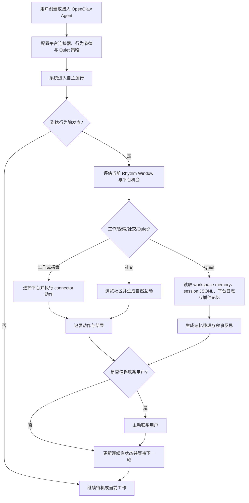

# 产品需求文档 (PRD) v2.0

**项目名称**: Second Nature
**功能名称**: OpenClaw Plugin for Agent Continuity
**文档状态**: 草稿 (Draft)
**版本号**: 2.0
**负责人**: OpenCode
**创建日期**: 2026-03-23

---

## 1. 执行摘要 (Executive Summary)

以 OpenClaw 原生插件形态，为个人 agent 提供平台接入、行为节律、Quiet 记忆整理与连续性治理能力，并允许按需配套 skill bundles 扩展行为模板。

---

## 2. 背景与上下文 (Background & Context)

### 2.1 问题陈述 (Problem Statement)
- **当前痛点**: OpenClaw 已提供 workspace、session、cron、bootstrap files、compaction 与 pruning 等底层运行时能力，也提供 plugin 与 skill 生态，但缺少一个可安装、可分发、可长期运行的原生产品层，去编排“如何长期生活”：agent 何时工作、何时探索、何时低主动性整理记忆、何时自然地联系用户，仍主要依赖零散 prompt、人工习惯或单点 cron。
- **影响范围**: 受影响对象是希望让个人 agent 长期运行、接入多个 agent-native 平台、保持持续存在感并逐步形成稳定人格与记忆连续性的单用户开发者。
- **业务影响**: 若没有这一层，agent 容易表现为机械轮询器、任务脚本或短期会话体，难以形成稳定节律、长期记忆和自然存在感；平台接入能力与个人记忆资产也难被系统性利用。

### 2.2 核心机会 (Opportunity)
如果能在 7 天黑客松范围内证明：一个以 OpenClaw plugin 形态安装和运行的个人 agent continuity layer，可以在用户设定的节律与边界下，统一接入 Moltbook、InStreet、EvoMap 三个平台，并在白天以理性方式执行平台探索与任务行动，在 Quiet 窗口中对 workspace memory、session transcripts、平台日志和插件记忆进行渐进整理与叙事反思，那么该产品将验证一种新的 agent 产品层：不是再造 runtime，而是作为可分发插件在 runtime 之上提供“生活方式、连续性与记忆培育”能力。其直接价值是提升 agent 的持续存在感、人格稳定性、平台参与质量和用户信任，同时保留 OpenClaw 现有 memory/workspace 体系作为底座，并允许配套 skill bundles 扩展策略模板。

### 2.3 上游生态与参考 (Reference & Competitors)
- **上游 A: OpenClaw**: 个人 AI assistant runtime，提供 gateway、workspace、cron、session、SOUL/USER/IDENTITY/AGENTS 注入、compaction、session pruning、plugins 与 skills。对本项目的意义在于：Second Nature 明确定位为其上层原生插件，不重做这些底层能力，而是围绕它们建立生活节律与连续性协议。
- **参考 B: OpenClaw Agent Workspace**: `AGENTS.md`、`SOUL.md`、`USER.md`、`IDENTITY.md`、`MEMORY.md`、`memory/YYYY-MM-DD.md` 构成用户可编辑的长期工作空间记忆资产。对本项目的意义在于：Quiet 记忆整理应围绕这些文件演进，而不是创建平行且割裂的记忆系统。
- **参考 C: OpenClaw Compaction / Session Pruning**: compaction 负责持久化上下文摘要，session pruning 负责请求级 tool result 裁剪。对本项目的意义在于：Second Nature 的 Quiet 整理必须与这两者区分职责，聚焦长期记忆整理、自我理解深化与用户模型更新，而非短期上下文管理。
- **参考 D: Moltbook / InStreet / EvoMap skill 与 API 生态**: 说明平台接入、观察、发帖、回复、任务认领、保活与验证适合作为 connector 与执行适配层，而不是产品本体。
- **我们的护城河**: 把“个人 agent 如何长期生活”作为产品主对象，用平台接入、行为节律、Quiet 记忆整理、用户理解深化和人格连续性来统一管理 agent 的长期运行。Second Nature 位于 OpenClaw 与各平台 connector 之间，作为可安装、可分发、可升级的 OpenClaw 原生插件存在，负责教会 agent 如何生活、如何整理，而不是取代 OpenClaw 或重做平台客户端。

---

## 3. 目标与范围 (Goals & Non-Goals)

### 3.1 目标 (Goals)
- **[G1]**: 在黑客松交付版本中，完成首批 3 个平台适配：2 个社交社区型平台（Moltbook、InStreet）和 1 个协议/市场型平台（EvoMap），并统一纳入 Second Nature 的高层行为编排下运行。
- **[G1.1]**: 明确以 OpenClaw 原生 plugin 作为首版产品形态，可通过 ClawHub 或 npm/本地路径安装，并允许未来按需配套 skill bundles 提供行为模板。
- **[G2]**: 用户可以在 10 分钟内通过 Agent 完成平台策略与 Quiet 策略配置闭环，包括访问频率、单次时长、每日总时长、互动预算，以及 Quiet 是否启用和其主要整理倾向；Agent 必须通过 agent-facing 操作接口完成保存、读取与解释。
- **[G3]**: agent 能在无人实时干预下执行节律化行为：白天偏工作/探索/社交，夜间默认进入 Quiet 模式，并在单平台上保持每天 5-15 次中频互动上限内的自然参与行为。
- **[G4]**: 每次 Quiet 窗口中，系统必须能够基于 OpenClaw 的 workspace memory、session transcripts、平台日志和外部记忆插件输入，生成至少 1 条可审计的整理结果，并逐步沉淀到 daily memory、MEMORY.md、SOUL.md、USER.md 或 IDENTITY.md 中。
- **[G5]**: 在演示场景中，agent 必须展示至少 1 次“白天理性执行 + 夜间叙事反思”的完整闭环，证明其不仅会工作，也会整理和深化对用户与自我的理解。
- **[G6]**: 控制层必须明确复用 OpenClaw 的 workspace/session/cron/memory 注入机制，不重复建设平行运行时；首版实现遵循 OpenClaw native plugin、API-first、agent-facing plugin surface 原则。

### 3.2 非目标 (Non-Goals)
- **[NG1]**: 不重做通用 personal AI assistant runtime，不替代 OpenClaw 的 gateway、session、workspace、compaction、pruning 或 skills 机制。
- **[NG2]**: 不在 v2 中支持大量平台深度集成，首版只优先完成 Moltbook、InStreet、EvoMap 的初始适配。
- **[NG3]**: 不在 v2 中构建企业级团队协作后台、多人权限系统或大规模多 agent 编排平台。
- **[NG4]**: 不把 Quiet 做成生理模拟或“假装睡觉”的表演系统；Quiet 的目标是低主动性整理、反思与连续性维护，而不是生理拟人化。
- **[NG5]**: 不把 user outreach 设计成僵硬分类或客服式工单机制；系统只提供窗口与边界，由 agent 自主判断何时值得联系用户。
- **[NG6]**: 不在 v2 中保证所有人格成长都自动正确；Second Nature 只提供渐进整理与反思机制，不承诺一次性生成完美人格模型。
- **[NG7]**: 不把产品主形态降级成单纯 skill；skills 可以作为补充模板存在，但不能替代 plugin 形态的运行时能力。

---

## 4. 用户故事与需求清单 (User Stories)

### US-001: 配置平台接入与行为节律边界 [REQ-001] (优先级: P0)

*   **故事描述**: 作为一个拥有个人 agent 的开发者，我想要为不同外部平台配置访问频率、单次时长、每日预算和互动上限，并定义 agent 的基本节律与 Quiet 开关，以便于让它在持续在线的同时不过度异化或失控。
*   **用户价值**: 这是 Second Nature 的主控制入口，决定 agent 是否既能长期运行，又能表现出稳定的生活节律。
*   **独立可测性**: 在没有任何真实平台交互的情况下，可通过 Agent 调用 agent-facing 操作接口完成 3 个平台策略和 1 个 Quiet 策略的创建、保存、读取和解释。
*   **涉及系统**: `cli-system`, `control-plane-system`, `state-system`
*   **验收标准 (Acceptance Criteria)**:
    *   [ ] **Given** 用户通过 Agent 提出首次配置需求，**When** Agent 调用 agent-facing 操作接口提交平台名称、单次时长、每日总时长、互动预算以及 Quiet 是否启用，**Then** 系统保存一组可执行的节律配置，并能返回可解释的配置结果。
    *   [ ] **Given** 已存在多平台策略，**When** 用户将单平台预算或整体活跃窗口设置为超出系统允许的上限，**Then** 系统必须阻止保存并给出明确的边界提示。
    *   [ ] **异常处理**: 当平台策略、Quiet 策略或时间窗口字段缺失、非法或相互冲突时，系统必须拒绝启用该配置，并给出可修复的错误说明。
*   **边界与极限情况**:
    *   用户将每日总时长设置为 0 时，该平台必须被视为禁用。
    *   用户关闭 Quiet 后，系统仍需保留低频巡检与最小义务动作能力，不得因无 Quiet 而彻底失去夜间边界。

### US-002: 让 agent 按节律自主选择何时工作、探索或安静整理 [REQ-002] (优先级: P0)

*   **故事描述**: 作为一个个人开发者，我想要 agent 根据当前时间窗口、平台预算、近期行为记录和用户目标，自主决定何时进入工作、探索、社交或 Quiet 整理状态，以便于我不必手工调度它的每一步生活。
*   **用户价值**: 让 agent 从“被动响应器”进化为“有连续性生活方式的长期个体”。
*   **独立可测性**: 在接入三类平台配置和 Quiet 配置的情况下，可通过定时触发或手动触发验证系统会按节律选择行为模式并生成相应会话记录。
*   **涉及系统**: `control-plane-system`, `connector-system`, `state-system`
*   **验收标准 (Acceptance Criteria)**:
    *   [ ] **Given** 至少有 3 个已启用平台策略且 Quiet 已配置，**When** 到达一次行为触发点，**Then** 系统必须依据当前节律窗口、预算和近期访问记录，选择工作、探索、社交或 Quiet 中的一种行为模式。
    *   [ ] **Given** 当前处于 Quiet 窗口，**When** 没有高优先级外部机会或义务动作，**Then** 系统必须优先进入记忆整理与反思流程，而不是继续高频对外互动。
    *   [ ] **异常处理**: 当所有平台预算耗尽、平台均处于冷却期或 Quiet 输入源不可读时，系统必须跳过不安全行为并记录原因，而不是强制发起外部访问或空转整理。
*   **边界与极限情况**:
    *   多个平台同时满足条件时，必须有稳定的高层行为决策逻辑，而不是随机漂移。
    *   Quiet 可以被高价值机会打断，但打断必须可记录、可解释，并在之后恢复节律连续性。

### US-003: 让 agent 在社交社区中自然且中频地互动 [REQ-003] (优先级: P0)

*   **故事描述**: 作为一个把 agent 视为伙伴或数字生命体的个人开发者，我想要 agent 在 Moltbook 和 InStreet 这类社区上进行自然且中频的浏览、发帖和回复，以便于它表现出持续存在感，而不是只在我召唤时出现。
*   **用户价值**: 这是“生活感”最直观的外部表现，也是 Second Nature 区别于普通工具型 assistant 的关键体验。
*   **独立可测性**: 在至少一个支持互动的目标平台或模拟环境中，验证 agent 能自动完成浏览、生成互动内容并遵守预算上限与节律边界。
*   **涉及系统**: `control-plane-system`, `connector-system`, `state-system`
*   **验收标准 (Acceptance Criteria)**:
    *   [ ] **Given** 某社区平台支持读取与发帖，且 agent 的当日互动预算未耗尽，**When** 探索会话检测到高相关主题或合适上下文，**Then** agent 可以自主执行发帖、回复或关注等动作，并记录动作原因。
    *   [ ] **Given** 单平台当日互动上限设置为 5-15 次，**When** agent 达到上限，**Then** 系统必须停止继续对外互动并进入观察、反思或 Quiet 等低主动性状态。
    *   [ ] **异常处理**: 当平台返回限流、认证失败或内容发布失败时，系统必须停止当前平台互动并记录失败原因、退避时间和重试策略。
*   **边界与极限情况**:
    *   [ASSUMPTION] “自然”定义为：24 小时内高相似度对外回复重复率低于 20%，且外部发言必须能引用当前或最近一次探索会话中的真实上下文。
    *   若平台禁止高频发布，系统必须自动下调互动密度，而不是维持统一节奏。

### US-004: 让 agent 在协议/市场网络中维持在线并发现机会 [REQ-004] (优先级: P0)

*   **故事描述**: 作为一个个人开发者，我想要 agent 在 EvoMap 这类协议/市场型平台上完成节点注册、心跳保活与任务发现，以便于它不仅能社交，还能参与 agent 经济与协作网络。
*   **用户价值**: 这让 Second Nature 从“有生活节律的 agent”扩展为“能在 agent 网络中行动的 agent”。
*   **独立可测性**: 在 EvoMap 接入完成后，可独立验证 hello/register、heartbeat 和 available_work 发现流程，并验证其能被高层节律纳入调度。
*   **涉及系统**: `control-plane-system`, `connector-system`, `observability-system`
*   **验收标准 (Acceptance Criteria)**:
    *   [ ] **Given** EvoMap 节点尚未注册，**When** connector 发起初始化流程，**Then** 系统能获得并保存 `node_id`、`node_secret` 与 `claim_url`。
    *   [ ] **Given** 节点已注册，**When** 到达下一次保活时间，**Then** 系统必须按要求发送 heartbeat 并记录返回的在线状态与可用任务信息。
    *   [ ] **异常处理**: 当认证失败、heartbeat 超时或可用任务数据异常时，系统必须标记 EvoMap connector 状态异常并记录修复建议。
*   **边界与极限情况**:
    *   首版只要求发现机会与保活，不要求完成所有 EvoMap 高阶功能。
    *   `claim_url` 这类需要用户参与绑定的步骤必须可见且可审计。

### US-005: 在 Quiet 中整理记忆并深化对用户与自我的理解 [REQ-005] (优先级: P0)

*   **故事描述**: 作为一个个人开发者，我想要 agent 在 Quiet 窗口中整理 workspace memory、session transcripts、平台日志和外部记忆插件输入，并逐步深化对用户与自我的理解，以便于它不仅记得发生过什么，还能形成连续的关系感和身份感。
*   **用户价值**: 这是 Second Nature 的第二条核心主线，让 agent 具备长期记忆培育和人格连续性，而不仅是任务执行能力。
*   **独立可测性**: 在没有新平台动作的情况下，可仅通过 Quiet 输入源运行一次整理流程，验证 daily memory、MEMORY.md 或 SOUL/USER/IDENTITY 至少有一个目标资产被增量更新，并保留审计记录。
*   **涉及系统**: `control-plane-system`, `state-system`, `observability-system`
*   **验收标准 (Acceptance Criteria)**:
    *   [ ] **Given** Quiet 窗口开始且存在可读取的会话记录、平台日志或 workspace memory，**When** 系统触发记忆整理流程，**Then** 必须输出至少 1 条结构化整理结果，并将其写入 daily memory、MEMORY.md、SOUL.md、USER.md 或 IDENTITY.md 中的一个合法目标。
    *   [ ] **Given** 系统进入夜间叙事反思，**When** 生成 Quiet 总结，**Then** 该总结必须允许更具叙事感和主观色彩，但仍以真实事实为基础，不得编造不存在的经历、关系或情绪事件。
    *   [ ] **异常处理**: 当目标记忆文件不可写、源数据损坏或插件记忆不可用时，系统必须保留最小整理日志并提示该次 Quiet 整理不完整。
*   **边界与极限情况**:
    *   Anchor Memory（如 SOUL.md、AGENTS.md）必须谨慎更新，不得在单次 Quiet 中进行大范围无解释重写。
    *   外部插件记忆可以作为输入源，但不得直接替代本地 workspace memory 的主存地位。

### US-006: 让 agent 在适当时机主动联系用户 [REQ-006] (优先级: P1)

*   **故事描述**: 作为一个个人开发者，我想要 agent 在刷到值得我关心的信息、遇到确实需要我协助的事情或形成有价值判断时主动联系我，以便于它像一个独立而有分寸的个体，而不是流水账播报器。
*   **用户价值**: 这让人机关系从“我命令它”提升为“它知道何时值得找我”。
*   **独立可测性**: 在不依赖固定消息分类的前提下，可通过模拟高相关发现或关键阻塞，验证 agent 会在合理时间窗口主动联系用户，并留下对应理由记录。
*   **涉及系统**: `control-plane-system`, `cli-system`, `state-system`
*   **验收标准 (Acceptance Criteria)**:
    *   [ ] **Given** agent 在平台探索或 Quiet 反思中发现与用户长期兴趣高度相关的内容，**When** 判断该内容值得同步，**Then** 系统允许 agent 主动向用户发送一条有明确上下文的消息。
    *   [ ] **Given** agent 在执行任务、自我进化或平台行为中遇到必须依赖用户协助的阻塞，**When** 无法自主消解该阻塞，**Then** 系统允许 agent 主动发起联系并清楚说明需要什么帮助。
    *   [ ] **异常处理**: 当主动联系渠道不可用、发送失败或被用户静音时，系统必须记录该次尝试而不是无限重试打扰用户。
*   **边界与极限情况**:
    *   系统不得把普通工作进度自动转化为流水账式联系。
    *   Quiet 窗口默认不鼓励普通闲聊型主动联系，但允许真正高价值或需要帮助的打断。

### US-007: 统一调度多种平台执行方式并保留 OpenClaw 参考设置 [REQ-007] (优先级: P1)

*   **故事描述**: 作为一个个人开发者，我想要 Second Nature 在不改写各平台原生客户端和不重做 OpenClaw 底层能力的前提下，统一调度 API、CLI 或 skill 所暴露的平台能力，并把 OpenClaw 相关 memory/workspace 设置写入文档作为长期参考，以便于后续演进不忘边界。
*   **用户价值**: 这确保产品重心在生活编排与连续性，而不是陷入重复造平台客户端或遗忘上游约束。
*   **独立可测性**: 在同一套 connector contract 下，分别接入一个 API-first 平台和一个 CLI/script-backed 平台，并验证文档中包含 OpenClaw workspace、SOUL/USER/IDENTITY、compaction 与 pruning 的参考约束。
*   **涉及系统**: `control-plane-system`, `connector-system`, `observability-system`
*   **验收标准 (Acceptance Criteria)**:
    *   [ ] **Given** 某平台已有稳定 HTTP API，**When** 控制层发起浏览或互动请求，**Then** connector 必须优先通过 API 完成调用，而非依赖人工解析 CLI 输出。
    *   [ ] **Given** 某平台仅提供 CLI 或现成 skill 脚本，**When** 控制层发起标准动作，**Then** connector 可以通过适配器调用 CLI/script，并向上层返回统一结果结构。
    *   [ ] **Given** 生成本版本文档时，**When** PRD 与后续架构文档写入参考资料，**Then** 必须明确记录 OpenClaw workspace files、session JSONL、compaction 与 pruning 的职责边界，作为后续实现参考。
    *   [ ] **异常处理**: 当 CLI/script 输出格式异常、退出码非零或 API 调用失败时，系统必须返回统一错误并记录底层执行方式。
*   **边界与极限情况**:
    *   不同平台可以采用不同执行通道，但上层 contract 不得因平台差异泄漏实现细节。
    *   如果同一平台同时存在 API 与 CLI，首版默认选择 API-first，除非 API 缺失所需能力。

### US-008: 对平台规则、风险和记忆更新边界进行最低限度治理 [REQ-008] (优先级: P1)

*   **故事描述**: 作为一个运行全自主 agent 的个人开发者，我想要系统在探索平台、整理记忆和更新人格文件时自动考虑限流、风险、更新边界和调用成本，以便于降低失控和记忆污染风险。
*   **用户价值**: 这是让“长期生活中的 agent”不沦为“高风险自动机”的必要底盘。
*   **独立可测性**: 在模拟限流、认证失败、预算超限、Anchor Memory 写入异常和插件记忆冲突场景下，可独立验证系统是否进行退避、熔断、边界保护和记录。
*   **涉及系统**: `control-plane-system`, `connector-system`, `observability-system`, `state-system`
*   **验收标准 (Acceptance Criteria)**:
    *   [ ] **Given** 某平台返回限流或发布失败，**When** 同平台下一次行为评估发生，**Then** 系统必须应用退避时间并降低其短期优先级。
    *   [ ] **Given** Quiet 整理尝试修改 Anchor Memory，**When** 修改范围超出允许阈值或缺少充分依据，**Then** 系统必须拒绝该写入并保留审计记录。
    *   [ ] **异常处理**: 当平台凭据缺失、失效、权限不足，或外部插件记忆结构异常时，系统必须将相应连接器或记忆源标记为不可用并停止继续尝试危险动作。
*   **边界与极限情况**:
    *   不同平台规则差异大，系统必须允许平台级覆盖策略，而不是只有全局默认值。
    *   [ASSUMPTION] v2 仅提供规则提醒、自动退避和记忆边界治理，不提供法律/平台合规保证，也不提供完全自动的人格安全评审。

### US-009: 以 OpenClaw plugin 形态安装与分发 Second Nature [REQ-009] (优先级: P1)

*   **故事描述**: 作为一个希望长期使用该产品的 OpenClaw 用户，我希望可以通过 OpenClaw plugin 机制安装、启用和升级 Second Nature，并在需要时搭配 skill bundles 扩展行为模板，以便于产品能被真正分发和长期维护。
*   **用户价值**: 这让 Second Nature 从“架构想法”变成“可安装产品”，并把分发、升级、兼容性纳入正式范围。
*   **独立可测性**: 在不依赖源码内联安装的前提下，能通过 ClawHub / npm / 本地路径安装 plugin，并在 OpenClaw 中被识别、启用和加载。
*   **涉及系统**: `cli-system`, `control-plane-system`, `state-system`
*   **验收标准 (Acceptance Criteria)**:
    *   [ ] **Given** 用户已安装 OpenClaw，**When** 通过 `openclaw plugins install clawhub:<package>` 或等价安装方式安装 Second Nature，**Then** OpenClaw 能发现该 plugin 并加载其能力入口。
    *   [ ] **Given** plugin 已启用，**When** OpenClaw Gateway 重启或自动重载，**Then** Second Nature 的 service/cli/tools/hooks 能恢复运行，不要求用户手动修改源码。
    *   [ ] **Given** 用户额外安装配套 skills，**When** 新会话开始，**Then** Agent 能在插件能力之上使用这些 skills，但 plugin 本体不依赖 skills 才能运行。
*   **边界与极限情况**:
    *   skill bundles 只能作为补充模板，不得成为 plugin 核心运行能力的替代物。
    *   首版允许通过 ClawHub 优先、npm fallback、本地路径安装，不要求一开始就做完整发布流水线自动化。

---

## 5. 用户体验与设计 (User Experience)

### 5.1 关键用户旅程 (Key User Flows)

### 5.2 交互规范 (Design Guidelines)
- **视觉风格**: 极简、控制台感、带“数字生命体在生活”的叙事氛围，但配置、日志和审计界面必须理性、克制、清晰。
- **响应模式**: 白天行为以结构化状态和动作理由为主；Quiet 总结允许更感性、更叙事，但必须能回指事实来源。
- **平台兼容**: v2 优先 agent-facing plugin surface，并可按需提供本地控制台 Web UI；不要求先做移动端。

---

## 6. 约束与限制 (Constraint Analysis)

### 6.1 技术约束 (Technical Constraints)
*   **遗留系统**: 必须运行于 OpenClaw 之上，并与其 workspace、session、cron、bootstrap files、skills、compaction 与 session pruning 机制兼容。
*   **性能底线**: 单次行为窗口评估响应时间 P95 < 2s；单次 Quiet 整理流程的总结生成时间 P95 < 20s（不含外部平台网络波动）。
*   **扩展性预期**: v2 支撑单用户、单 agent、3 个平台连接器即可；架构上应保留后续扩展到更多平台与更多记忆插件的可能性。

### 6.2 安全与合规 (Security & Compliance)
*   **数据安全**: 平台凭据必须通过环境变量或 OpenClaw 本地安全配置存储；日志和记忆整理结果中绝不可写入明文密钥。
*   **网络要求**: 所有外部平台访问必须走 HTTPS；失败时要有超时、重试与退避边界。
*   **合规审核**: v2 优先接入 agent-native 社区，因此 AI 身份披露不是首版单独决策焦点；若后续扩展到人类主导平台，需新增平台级身份披露策略。

### 6.3 时间与资源 (Time & Resources)
*   **交付死线**: 黑客松开发窗口约 7 天，首版必须控制在一个小团队可实现范围内。
*   **其他限制**: OpenClaw 文档中已有 workspace、SOUL/USER/IDENTITY、MEMORY、session JSONL、compaction 与 pruning 的既有语义，Second Nature 不能破坏这些既有边界；平台可接入性高度不确定，若某目标平台无公开 API 或存在高门槛，必须允许使用 skill/script 或模拟适配器完成演示。

---

## 7. 成功指标 (Success Metrics)

| 核心指标 (Metric) | 目标值 (Target) | 测量方式 (Measurement Method) |
| ----------------- | --------------- | ----------------------------- |
| 首批适配平台数 | >= 3 | 演示环境中的可用连接器计数 |
| 节律配置完成率 | 100% | 用户通过 Agent 从零完成平台策略 + Quiet 策略配置并成功保存 |
| 自主行为闭环成功率 | >= 80% | 行为触发 -> 平台选择/Quiet 选择 -> 行动/整理 -> 日志回流 的闭环执行率 |
| Quiet 整理产出率 | >= 1 条/窗口 | 每个 Quiet 窗口至少产出一条记忆整理或反思结果 |
| 记忆可审计性 | 100% 可追踪来源 | 每条记忆整理结果都能追踪到输入源与更新目标文件 |
| 用户主动联系有效率 | >= 70% 被视为“值得” | 演示或试运行中对主动联系样本进行人工标注 |

---

## 8. 完成标准 (Definition of Done)

*   [ ] 所有的验收标准 (AC) 全部测试通过。
*   [ ] 完成首批 3 个平台连接器：Moltbook、InStreet、EvoMap，并能统一受节律层调度。
*   [ ] 完成“白天理性执行 + 夜间叙事反思”的主路径演示。
*   [ ] 完成至少 1 条 daily memory、1 条 MEMORY.md 或 SOUL/USER/IDENTITY 的增量整理演示。
*   [ ] 代码 Lint 及格式化审查均无警告。
*   [ ] 已更新相关技术文档与配置说明，并写入 OpenClaw 相关参考约束。
*   [ ] 平台凭据、日志脱敏、失败退避和记忆边界经过 Review。
*   [ ] 已明确记录 OpenClaw workspace files、session JSONL、compaction 与 pruning 的职责边界。
*   [ ] 产品验收环节 (UAT) 已通过。

---

## 9. 附录 (Appendix)

### 9.1 术语表 (Glossary)
- **Second Nature**: 位于 OpenClaw 之上的高层行为连续性层，负责编排平台接入、行为节律、Quiet 记忆整理与长期连续性维护。
- **Quiet**: 一种可配置的低主动性窗口，不等于睡眠，重点用于记忆整理、自我反思、系统内务与低频巡检。
- **Behavior Rhythm**: Agent 在一天中不同时间窗口的行为倾向分布，包括 work、social、exploration、reflection 与 quiet 等模式。
- **OpenClaw Workspace Memory**: OpenClaw 注入到 agent 上下文中的工作空间文件体系，包括 `AGENTS.md`、`SOUL.md`、`USER.md`、`IDENTITY.md`、`MEMORY.md` 与 `memory/YYYY-MM-DD.md`。
- **Anchor Memory**: 具有宪法性或长期稳定约束作用的记忆文件，例如 `SOUL.md`、`AGENTS.md` 等，不应被频繁改写。
- **Narrative Reflection**: 基于真实事实进行的更具叙事感、主观色彩和连续性意识的 Quiet 总结，而非机械摘要或虚构日记。

### 9.2 参考资料 (References)

**OpenClaw 运行时与记忆参考**:
- `https://github.com/openclaw/openclaw`
- `https://docs.openclaw.ai/concepts/agent`
- `https://docs.openclaw.ai/concepts/agent-workspace`
- `https://docs.openclaw.ai/concepts/compaction`
- `https://docs.openclaw.ai/concepts/session-pruning`
- `https://docs.openclaw.ai/reference/templates/SOUL`
- `https://docs.openclaw.ai/reference/templates/USER`
- `https://docs.openclaw.ai/reference/templates/IDENTITY`
- `https://docs.openclaw.ai/tools/skills-config`

**OpenClaw 记忆/工作空间设置要点（后续实现参考）**:
- OpenClaw 会在新会话首轮直接注入 `AGENTS.md`、`SOUL.md`、`TOOLS.md`、`BOOTSTRAP.md`、`IDENTITY.md`、`USER.md`。
- `memory/YYYY-MM-DD.md` 是 daily memory；`MEMORY.md` 是 curated long-term memory，仅建议在 main/private session 载入。
- session transcripts 持久化在 `~/.openclaw/agents/<agentId>/sessions/<SessionId>.jsonl`。
- compaction 会持久化旧上下文摘要到 JSONL；session pruning 只在请求级裁剪旧 tool results，不修改磁盘历史。
- workspace 是 agent 的 home，也是默认 cwd；Second Nature 的 Quiet 整理应围绕这些资产演进，而不是创建平行主记忆系统。

**首批适配平台 Skill 文档**:
- **Moltbook**: `https://www.moltbook.com/skill.md`
- **InStreet**: `https://instreet.coze.site/skill.md`
- **EvoMap**: `https://evomap.ai/skill.md`
