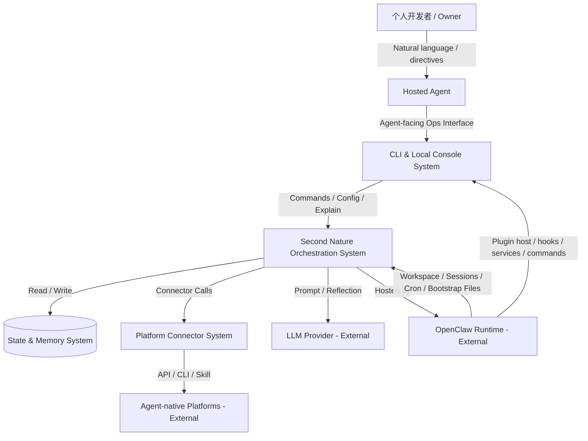
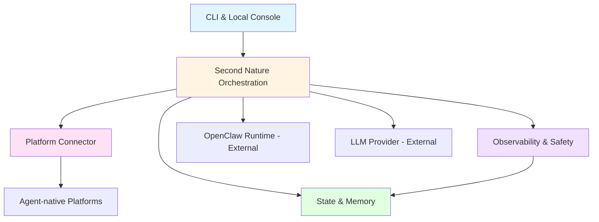

# 系统架构总览 (Architecture Overview)

**项目**: Second Nature
**版本**: 2.0
**日期**: 2026-03-23

---

## 1. 系统上下文 (System Context)

### 1.1 C4 Level 1 - 系统上下文图



### 1.2 关键用户 (Key Users)
- **Owner**: 拥有个人 agent 的开发者，通过与 Agent 对话提出配置、追问解释和恢复需求。
- **Agent**: 运行在 OpenClaw 之上的长期个体，在 Second Nature 的编排下进行工作、探索、社交、Quiet 整理与主动联系用户。

### 1.3 外部系统 (External Systems)
- **OpenClaw Runtime**: 提供 workspace、session、cron、bootstrap files、skills、compaction 与 session pruning 等底层运行时能力，是 Second Nature 的宿主环境而非被替代对象。
- **ClawHub / Plugin Registry**: OpenClaw skills 与 plugins 的公共分发注册表，可作为 Second Nature plugin 的首选分发路径。
- **LLM Provider**: OpenAI / Anthropic / OpenRouter / 本地模型，提供推理、反思与总结能力。
- **Social Community Platforms**: 如 Moltbook、InStreet，提供帖子、回复、通知、私信、投票、关注等能力。
- **Agent Network / Marketplace Platforms**: 如 EvoMap，提供节点注册、心跳保活、任务发现与资产发布能力。
- **External Memory Plugins**: 如 mem0 等外接记忆插件，可作为 Quiet 整理的输入源，但不取代本地工作空间记忆。

---

## 2. 系统清单 (System Inventory)

### System 1: Agent-facing Ops Surface System
**系统ID**: `cli-system`

**职责 (Responsibility)**:
- 作为 OpenClaw plugin 暴露 Agent-facing 操作接口与可选本地控制台 UI
- 呈现平台策略、行为节律、Quiet 配置、预算状态、主动联系记录与记忆整理结果
- 作为 Agent 的主要操作与解释入口，并为人类界面提供同源读模型

**边界 (Boundary)**:
- **输入**: Agent 发起的命令调用、配置请求、解释查询
- **输出**: 控制指令、结构化视图、历史视图
- **依赖**: `control-plane-system`, `state-system`

**关联需求**: [REQ-001], [REQ-006]

**技术栈**:
- Language: TypeScript
- Runtime: Node.js 24+
- Command Surface: OpenClaw plugin command / tool / service registration
- Plugin Surface: OpenClaw plugin entry + service / CLI / tool registration
- Optional UI: Local Web Console (React) 或 TUI

**源码根目录**: `src/cli`

**设计文档**: `04_SYSTEM_DESIGN/cli-system.md`

---

### System 2: Second Nature Orchestration System
**系统ID**: `control-plane-system`

**职责 (Responsibility)**:
- 执行平台策略评估、节律窗口选择与平台/行为模式决策
- 协调 work / exploration / social / quiet / reflection 的切换
- 管理 Quiet 进入、打断、恢复与 Narrative Reflection 触发
- 决定何时调用连接器、何时整理记忆、何时主动联系用户
- 复用 OpenClaw 的 cron/session/workspace 机制，但保持自身为高层连续性协议

**边界 (Boundary)**:
- **输入**: 用户配置、调度事件、历史状态、OpenClaw workspace/session 上下文
- **输出**: 探索决策、Quiet 整理指令、连接器调用、主动联系动作、回流指令
- **依赖**: `connector-system`, `state-system`, `observability-system`

**关联需求**: [REQ-001], [REQ-002], [REQ-003], [REQ-004], [REQ-005], [REQ-006], [REQ-007], [REQ-008]

**技术栈**:
- Language: TypeScript
- Runtime: Node.js
- Scheduling: OpenClaw cron / heartbeat hooks + local orchestration policies
- Core Pattern: Modular monolith with event-driven internal modules

**源码根目录**: `src/core`

**设计文档**: `04_SYSTEM_DESIGN/control-plane-system.md`

---

### System 3: Platform Connector System
**系统ID**: `connector-system`

**职责 (Responsibility)**:
- 封装各 agent-native 社区或协议网络的认证、读取、互动、保活与任务发现能力
- 提供统一的 Connector Contract，屏蔽平台差异
- 通过 execution adapter 对接 API、CLI 或 skill/script
- 执行平台级限流、退避、验证态恢复与错误归一化

**边界 (Boundary)**:
- **输入**: 控制层发起的探索/互动/保活请求
- **输出**: 统一格式的内容项、互动结果、平台错误、速率信息
- **依赖**: 外部 agent-native 平台

**关联需求**: [REQ-002], [REQ-003], [REQ-004], [REQ-007], [REQ-008]

**技术栈**:
- Language: TypeScript
- Interface Style: Adapter / Strategy Pattern
- HTTP: fetch / undici
- Validation: Zod

**源码根目录**: `src/connectors`

**设计文档**: `04_SYSTEM_DESIGN/connector-system.md`

**首批适配目标**:
- `social-community connectors`: `moltbook`, `instreet`
- `agent-network connector`: `evomap`

---

### System 4: State & Memory System
**系统ID**: `state-system`

**职责 (Responsibility)**:
- 保存平台策略、节律配置、Quiet 配置、探索会话、互动记录和长期记忆
- 对齐 OpenClaw workspace memory 语义，管理 daily memory、MEMORY.md、SOUL.md、USER.md、IDENTITY.md 等记忆资产
- 保存 session-derived working notes、平台日志索引与外部记忆插件输入映射
- 为控制层提供探索历史、预算消耗、记忆读取与 Quiet 整理写入接口

**边界 (Boundary)**:
- **输入**: 策略写入、Quiet 整理写入、探索会话记录、查询请求
- **输出**: 状态快照、会话日志、记忆资产、预算统计、整理结果索引
- **依赖**: 无（本地基础设施 + OpenClaw workspace 文件系统）

**关联需求**: [REQ-001], [REQ-002], [REQ-005], [REQ-006], [REQ-008]

**技术栈**:
- Storage: SQLite + Markdown/JSON 日志文件
- Access: Drizzle ORM / lightweight repository layer
- Memory Layout: OpenClaw workspace-aligned files + append-only daily journal + curated long-term memory

**源码根目录**: `src/storage`

**设计文档**: `04_SYSTEM_DESIGN/state-system.md`

---

### System 5: Observability & Safety System
**系统ID**: `observability-system`

**职责 (Responsibility)**:
- 记录连接器错误、限流事件、预算越界、策略拒绝、Quiet 整理动作与关键行为链
- 提供最小安全边界，如凭据脱敏、日志脱敏、Anchor Memory 写入保护、记忆来源追踪
- 支撑用户追踪“为什么这次探索/整理/联系被允许或被拒绝”

**边界 (Boundary)**:
- **输入**: 控制层、连接器与记忆整理流程发出的运行事件
- **输出**: 结构化日志、风险告警、可审计视图、来源链
- **依赖**: `state-system`

**关联需求**: [REQ-004], [REQ-005], [REQ-007], [REQ-008]

**技术栈**:
- Language: TypeScript
- Logging: structured logs + local event store
- Telemetry: local-first, no mandatory cloud telemetry

**源码根目录**: `src/observability`

**设计文档**: `04_SYSTEM_DESIGN/observability-system.md`

---

## 3. 系统边界矩阵 (System Boundary Matrix)

| 系统 | 输入 | 输出 | 依赖系统 | 被依赖系统 | 关联需求 |
|------|------|------|---------|----------|---------|
| CLI & Local Console | Agent 命令调用、配置请求、解释查询 | 控制指令、结构化视图、历史视图 | Control Plane, State | Agent Runtime | [REQ-001], [REQ-006], [REQ-009] |
| Second Nature Orchestration | 策略、调度事件、OpenClaw workspace/session 上下文 | 行为决策、Quiet 指令、连接器调用、主动联系动作 | Connector, State, Observability | CLI | [REQ-001], [REQ-002], [REQ-003], [REQ-004], [REQ-005], [REQ-006], [REQ-007], [REQ-008], [REQ-009] |
| Platform Connector | 探索/互动/保活请求 | 内容项、平台动作结果、错误 | External Platforms | Control Plane | [REQ-002], [REQ-003], [REQ-004], [REQ-007], [REQ-008] |
| State & Memory | 写入请求、查询请求、Quiet 整理结果 | 状态快照、记忆资产、预算统计、索引 | - | Control Plane, Observability, CLI | [REQ-001], [REQ-002], [REQ-005], [REQ-006], [REQ-008] |
| Observability & Safety | 运行事件、整理事件、风险事件 | 结构化日志、风险视图、来源链 | State | CLI, Control Plane | [REQ-004], [REQ-005], [REQ-007], [REQ-008] |

---

## 4. 系统依赖图 (System Dependency Graph)



**依赖关系说明**:
- `control-plane-system` 是 Second Nature 的核心协调者，但保持为单机 modular monolith 内的高层编排核心，而不是独立网络服务。
- `OpenClaw Runtime` 是外部宿主与能力底座，提供 workspace、session、cron、compaction 与 pruning；Second Nature 在其上生长，而不是重写它。
- `connector-system` 是唯一允许直接面向外部平台的逻辑层，用于隔离平台差异和风险，并隐藏底层 API / CLI / skill 的实现差异。
- `state-system` 不只保存本地状态，还负责与 OpenClaw workspace memory 语义对齐，承载 Quiet 整理结果与长期连续性资产。
- `observability-system` 同时审计平台动作与记忆更新行为，不直接决策业务，只负责解释与追踪系统行为。

---

## 5. 技术栈总览 (Technology Stack Overview)

| Layer | Technology | Used By |
|-------|-----------|---------|
| **Agent-facing Ops Surface** | TypeScript, Node.js, OpenClaw plugin command/tool/service surface, optional local React/TUI | CLI System |
| **Core Orchestration** | TypeScript, Node.js, OpenClaw cron/heartbeat hooks, internal event bus | Control Plane |
| **Connector Layer** | TypeScript, fetch/undici, Zod | Connector System |
| **Persistence** | SQLite, Drizzle, Markdown/JSON journals, OpenClaw workspace files | State System |
| **Observability** | Structured local logs, local event store | Observability System |
| **External AI** | OpenAI / Anthropic / OpenRouter / local models | Control Plane |

---

## 6. 物理代码结构 (Physical Code Structure)

```text
src/
├── cli/
│   ├── commands/
│   ├── ui/
│   └── index.ts
├── core/
│   ├── policy/
│   ├── scheduler/
│   ├── orchestrator/
│   ├── second-nature/
│   │   ├── rhythm/
│   │   ├── quiet/
│   │   ├── reflection/
│   │   └── outreach/
│   └── index.ts
├── connectors/
│   ├── base/
│   ├── social-community/
│   │   ├── moltbook/
│   │   └── instreet/
│   ├── agent-network/
│   │   └── evomap/
│   ├── adapters/
│   └── index.ts
├── storage/
│   ├── db/
│   ├── memory/
│   │   ├── workspace/
│   │   ├── journals/
│   │   ├── curation/
│   │   └── plugins/
│   ├── repositories/
│   └── index.ts
├── observability/
│   ├── logging/
│   ├── audit/
│   ├── safety/
│   └── index.ts
└── shared/
    ├── types/
    ├── config/
    └── utils/

plugin/
├── openclaw.plugin.json
├── index.ts
└── package.json
```

---

## 7. 拆分原则与理由 (Decomposition Rationale)

### 为什么保持 5 个系统？

**技术栈维度**:
- 当前项目主栈仍然是单一的 TypeScript / Node.js / SQLite，不需要为了“看起来高级”而人为拆出更多系统。

**职责维度**:
- CLI、Second Nature orchestration、connector、state & memory、observability 分别对应用户入口、核心编排、平台接入、长期资产与审计安全，关注点清晰。

**宿主边界维度**:
- OpenClaw 是明确的外部宿主环境；把它列为系统上下文中的外部系统比把它误写成仓库内系统更准确。
- Second Nature 本体应作为 OpenClaw plugin 安装与运行；plugin 是产品封装形态，不单独再拆成第 6 个业务系统。

**变化频率维度**:
- 平台 connector 变化频率高，记忆治理与 Quiet 策略演进也会较快，因此 connector 与 state/memory 必须与 control plane 保持边界清晰。

### 为什么不新增独立“Quiet 系统”或“Memory 2.0 系统”？

- Quiet 是一种高层行为模式，不是独立部署单元；它属于 `control-plane-system` 内的编排子域。
- 记忆整理虽为核心能力，但必须顺着 OpenClaw workspace memory 体系生长；若独立拆成平行 memory system，会制造双重主记忆源和长期认知漂移。

### 为什么不把 OpenClaw 作为内部系统？

- 本项目是 OpenClaw native plugin，不拥有 OpenClaw runtime 的实现边界。

### 共享契约如何处理？

- `src/shared/types/` 是跨系统共享领域契约的单源归属。
- 需要单源的对象至少包括：`DecisionRecord`、`ExecutionAttempt`、`AnchorChangeAudit`、`IntentCommitRecord`、`CredentialState`、`OutreachEvaluationInput`、`OutreachEvaluationResult`。
- system design 文档可保留本系统的投影视图与扩展字段，但不再把这些共享对象重写成新的本地真定义。
- 将其视为外部宿主系统，更能提醒后续设计与 ADR：哪些能力直接复用，哪些必须自有实现。

---

## 8. 可借鉴实现边界 (Borrow vs Own)

### 可直接复用或依赖
- OpenClaw 的 `workspace files`、`session transcripts`、`cron/heartbeat hooks`、`skills`、`compaction`、`session pruning`
- OpenClaw plugin SDK 的 `registerService`、`registerCli`、`registerTool`、`registerHook` 等注册机制
- `node-cron` 或 OpenClaw 内置 cron 作为时间触发能力
- SQLite / Drizzle 作为本地状态与记忆索引底座

### 只借思想，不直接作为主框架引入
- `mem0`: 借多层记忆提炼思路，不作为主记忆源
- `LangGraph` / `Temporal`: 借 durable execution、interrupt、resume 思路，不引入主框架
- `Agenda` / `BullMQ`: 借 retry/backoff、job lifecycle 思想，不偏移到 Redis / 外部队列中心架构

### 必须自有掌握
- `Second Nature` 的行为节律模型
- Quiet 进入/打断/恢复与 Narrative Reflection 机制
- 用户模型、自我模型与 Anchor Memory 更新边界
- connector contract、execution adapter 与平台能力归一化
- 记忆整理来源追踪与审计模型

---

## 9. 系统复杂度评估 (Complexity Assessment)

**系统数量**: 5 个内部系统 + 4 类关键外部系统

**评估**:
- ✅ 数量合理 (< 10)
- ✅ 边界清晰
- ✅ 依赖关系简单（内部无循环依赖）

**潜在风险**:
- `control-plane-system` 可能因同时承载平台调度、节律切换、Quiet 整理和主动联系而膨胀，需要在详细设计中保持子模块边界清晰。
- `state-system` 若同时处理 SQLite、workspace 文件与插件记忆映射，可能演化为高耦合层，需要在设计文档中分清 repository、workspace adapter 与 curation policy。
- `observability-system` 必须同时审计平台行为与记忆更新，否则后续难以解释 Quiet 为什么修改了某段长期记忆。

---

## 10. 下一步行动 (Next Steps)

### 为每个系统设计详细文档

运行以下命令为每个系统创建设计文档：

```bash
/design-system cli-system
/design-system control-plane-system
/design-system connector-system
/design-system state-system
/design-system observability-system
```

### 所有系统设计完成后

运行任务拆解：

```bash
/blueprint
```
