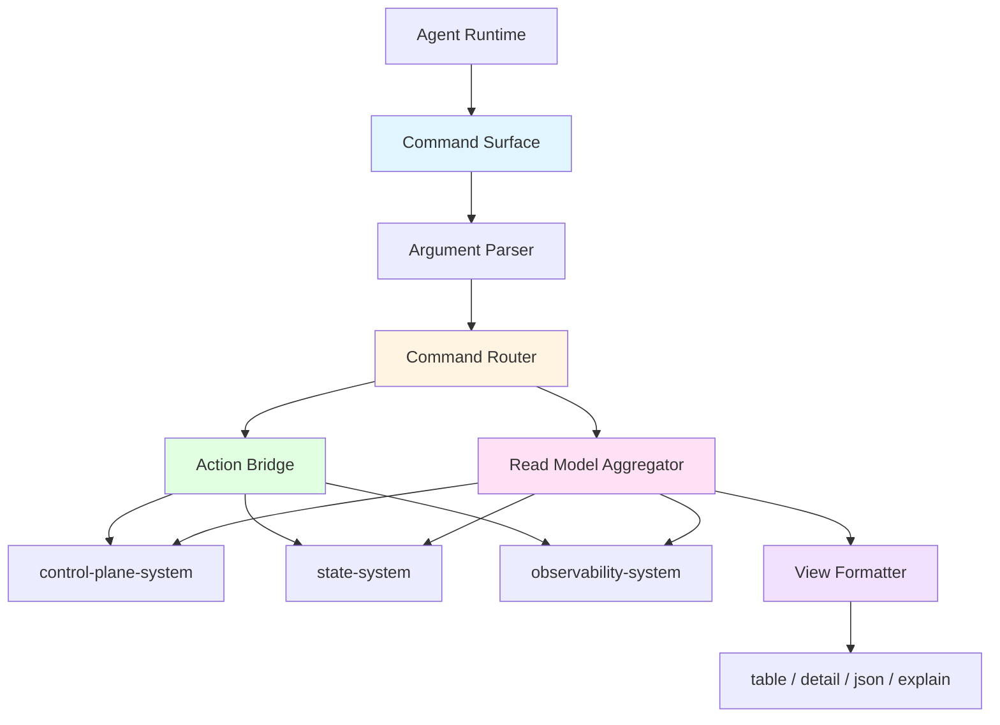
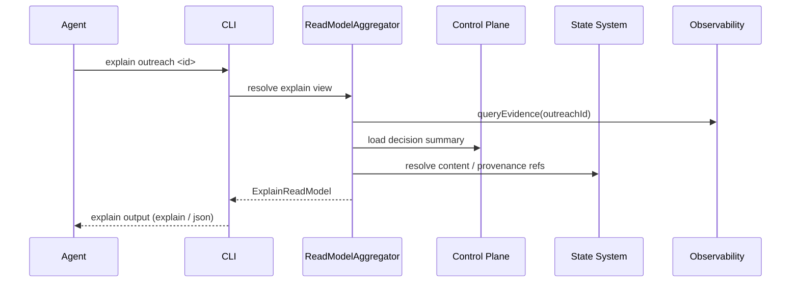
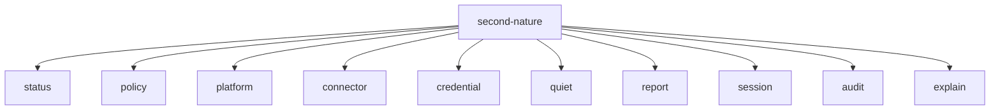
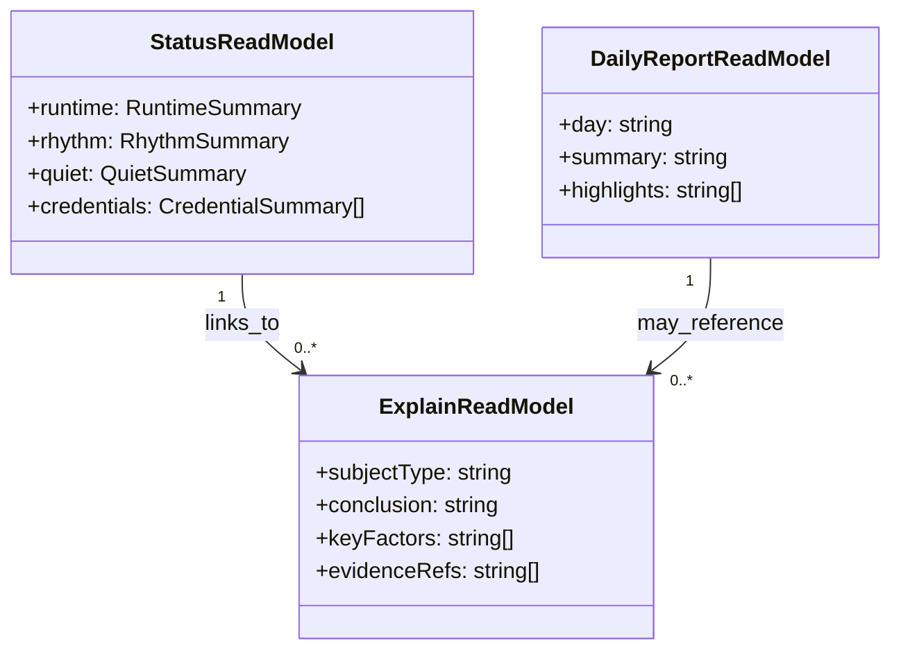

# CLI System 设计文档 (L0 — 导航层)

| 字段          | 值                                                                    |
| ------------- | --------------------------------------------------------------------- |
| **System ID** | `cli-system`                                                          |
| **Project**   | Second Nature                                                         |
| **Version**   | 2.0                                                                   |
| **Status**    | `Draft`                                                               |
| **Author**    | OpenCode                                                              |
| **Date**      | 2026-03-23                                                            |
| **L1 Detail** | [cli-system.detail.md](./cli-system.detail.md) — 仅 `/forge` 时加载 |

> [!IMPORTANT]
> **文档分层说明**
> - **本文件 (L0 导航层)**: 架构图、操作契约、设计决策。面向快速理解与任务规划。禁止放配置字典、算法伪代码和方法体。
> - **[cli-system.detail.md](./cli-system.detail.md) (L1 实现层)**: 完整命令模型、交互流程、边缘情况。仅 `/forge` 任务明确引用时加载。
> - **L1 锚点原则 ⚠️**: L1 中的每一节都必须在本文件有对应超链接入口。严禁 L1 出现 L0 完全未提及的“孤岛内容”。

---

## 📋 目录 (Table of Contents)

|   §   | 章节 | 关键内容 |
| :---: | ---- | -------- |
|   1   | [概览](#1-概览-overview) | 系统目的、边界、职责 |
|   2   | [目标与非目标](#2-目标与非目标-goals--non-goals) | Goals / Non-Goals |
|   3   | [背景与上下文](#3-背景与上下文-background--context) | Why、约束、调研结论 |
|   4   | [系统架构](#4-系统架构-architecture) | Mermaid 架构图、组件职责、数据流 |
|   5   | [接口设计](#5-接口设计-interface-design) | 命令契约、跨系统协议、输出模式 |
|   6   | [数据模型](#6-数据模型-data-model) | 状态/报告/解释读模型 → [L1 §1-2](./cli-system.detail.md) |
|   7   | [技术选型](#7-技术选型-technology-stack) | 核心技术、关键依赖 |
|   8   | [Trade-offs](#8-trade-offs--alternatives-权衡与备选方案) | ADR 引用 + 本系统特有决策 |
|   9   | [安全性考虑](#9-安全性考虑-security-considerations) | 脱敏、确认、最小披露 |
|  10   | [性能考虑](#10-性能考虑-performance-considerations) | 查询、渲染与降级 |
|  11   | [测试策略](#11-测试策略-testing-strategy) | 命令、explain、json、恢复测试 |
|  12   | [部署与运维](#12-部署与运维-deployment--operations) | agent-facing console |
|  13   | [未来考虑](#13-未来考虑-future-considerations) | TUI、local web console |
|  14   | [附录](#14-appendix-附录) | 命令对象、参考资料 |

**L1 实现层** → [cli-system.detail.md](./cli-system.detail.md)（仅 `/forge` 时加载）
> [§1 配置常量](./cli-system.detail.md#1-配置常量-config-constants) · [§2 数据结构](./cli-system.detail.md#2-核心数据结构完整定义-full-data-structures) · [§3 算法](./cli-system.detail.md#3-核心算法伪代码-non-trivial-algorithm-pseudocode) · [§4 决策树](./cli-system.detail.md#4-决策树详细逻辑-decision-tree-details) · [§5 边缘情况](./cli-system.detail.md#5-边缘情况与注意事项-edge-cases--gotchas)

---

## 1. 概览 (Overview)

### 1.1 System Purpose (系统目的)

`cli-system` 是 Second Nature 的 **Agent-facing operational interface**。它在实现上首先表现为 OpenClaw plugin 注册出的 `command / tool / service` surface，而不是给终端用户直接操作的交互式终端。它用于：
- 非交互式配置平台策略、行为节律、Quiet 与凭证状态
- 读取 daily report、session、connector、credential、risk 与 audit
- 获取结构化 explain 结果，回答“为什么选这个平台”“为什么没联系我”“为什么 `SOUL.md` 改了”
- 返回 `requiredUserInput` 与 `nextStep`，让 Agent 自己向用户追问或说明恢复步骤

### 1.2 System Boundary (系统边界)

- **输入 (Input)**: Agent 发起的命令调用、结构化参数、查询条件、恢复请求
- **输出 (Output)**: 结构化结果、解释视图、错误码、恢复建议、JSON 结果
- **依赖系统 (Dependencies)**: `control-plane-system`, `state-system`, `observability-system`, `connector-system`
- **被依赖系统 (Dependents)**: Agent Runtime / Host Environment

### 1.3 System Responsibilities (系统职责)

**负责**:
- 提供非交互式配置、查询、解释、恢复和手动触发入口
- 为平台、credential、Quiet、daily report、session、audit 提供聚合读模型
- 把 `DecisionRecord`、`OutreachDecision`、`AnchorChangeAudit` 等结构化结果转成 Agent 可继续转述的 explain payload
- 在需要用户参与时，返回 `requiredUserInput` 与 `nextStep`，而不是阻塞式 prompt

**不负责**:
- 不直接决定行为策略、平台选择或记忆整理（由 `control-plane-system` 负责）
- 不直接操作外部平台（由 `connector-system` 负责）
- 不持久化 canonical 数据（由 `state-system` 负责）
- 不定义审计 taxonomy（由 `observability-system` 负责）

---

## 2. 目标与非目标 (Goals & Non-Goals)

### 2.1 Goals

- **[G1]**: Agent 能以非交互方式完成平台策略、Quiet 与 credential 初始配置或恢复
- **[G2]**: 所有关键系统状态都可通过命令查询并解释
- **[G3]**: `why denied / why selected / why outreach / why soul changed` 成为一等 explain 能力
- **[G4]**: 提供 AI-friendly 结构化输出，优先 `json/explain`，并保留少量人类可读视图
- **[G5]**: 对需要人工参与的步骤输出明确、可执行、可恢复的 `requiredUserInput` 与 `nextStep`

### 2.2 Non-Goals

- **[NG1]**: 不把 TUI 或 Local Web Console 作为首版前置条件
- **[NG2]**: 不承担平台原生客户端能力
- **[NG3]**: 不暴露底层 SQLite / JSONL / raw logs 结构作为默认用户界面
- **[NG4]**: 不把 CLI 设计成交互式 prompt-first 终端或终端产品本体

---

## 3. 背景与上下文 (Background & Context)

### 3.1 Why This System? (为什么需要这个系统？)

Second Nature 的复杂度已经不仅是“设个 cron 跑跑平台”了，它包含：
- 平台策略
- Quiet 与 rhythm
- credential lifecycle
- decision explainability
- daily report 与 memory governance

如果 CLI 只是简单命令集，Agent 很难稳定读取、组合和解释系统状态；如果 CLI 做成交互式聊天壳，又会牺牲可预测性、脚本化与可编排性。

**关联 PRD 需求**: [REQ-001], [REQ-004], [REQ-005], [REQ-006], [REQ-008]

### 3.2 Current State (现状分析)

- v1 CLI 更像“状态查看 + 触发操作”入口
- v2 需要升级为 continuity console：不仅能看状态，还要能看解释、报告、凭证阶段、Quiet 轨迹和 anchor diff
- 当前最重要的升级不是“更多命令”，而是“更好的读模型与 explain 能力”

### 3.3 Constraints (约束条件)

- **技术约束**: TypeScript + Node.js，本地或云端可调用；以 plugin-registered command/tool/service surface 为主，与 OpenClaw native plugin 形态一致
- **体验约束**: AI-friendly、可编排、可脚本化、解释性优先
- **安全约束**: 默认最小披露；credential / secret /私密正文只显示状态和受限摘要
- **项目约束**: 黑客松 7 天，优先做 non-interactive command surface，可选人类界面作为后续增强

### 3.4 调研结论摘要

- 推荐模式是 **Plugin Surface + Read Models + Explain Trace + Minimal Recovery Hints**
- explainability 应优先结构化，再提供 prose
- 不依赖 prompt；所有关键命令都应可一次性通过参数完成
- `status`, `report`, `credential`, `explain` 应成为一级对象，而不是散落在少量状态命令中

完整研究见 `._research/cli-system-research.md`。

---

## 4. 系统架构 (Architecture)

### 4.1 Architecture Diagram (架构图)



### 4.2 Core Components (核心组件)

| Component Name | Responsibility | Tech Stack | Notes |
| -------------- | -------------- | ---------- | ----- |
| `CommandSurface` | plugin 注册的命令/工具入口、统一参数模型、少量帮助信息 | TypeScript | Agent-friendly，非交互式 |
| `CommandRouter` | 路由到读/写/解释命令 | TypeScript | 入口协调器 |
| `ReadModelAggregator` | 从 control-plane/state/observability 聚合用户视图 | TypeScript | 不暴露底层 schema |
| `ExplainFormatter` | 渲染 why denied / why selected / why outreach / why soul changed | TypeScript | 输出 Agent 可继续转述的结构化 payload |
| `RecoveryHintBuilder` | 生成人工恢复所需 next-step 与 required-user-input | TypeScript | 不阻塞等待用户输入 |
| `ActionBridge` | 调用写接口，如配置策略、保存 credential、提交验证答案、触发恢复 | TypeScript | 连接核心系统 |

### 4.3 Data Flow (数据流)



**关键数据流说明**:
1. 写命令通过 `ActionBridge` 落到底层系统，读命令通过 `ReadModelAggregator` 聚合读模型；CLI 只是 surface，不是业务本体。
2. `explain` 类命令优先读 `observability-system`，必要时再回 state / control-plane 补充上下文。
3. `status` 不是底层快照直出，而是按 runtime / rhythm / quiet / credentials / connectors / risk 分块聚合。
4. 对需要用户参与的步骤，CLI 只输出 `requiredUserInput` 与 `nextStep`，由 Agent 自己决定如何转述给用户。

### 4.4 一级命令对象



> **完整命令树与 explain 读模型**: 见 [L1 §4](./cli-system.detail.md#4-决策树详细逻辑-decision-tree-details)

---

## 5. 接口设计 (Interface Design)

### 5.1 操作契约表 (Operation Contracts)

| 操作 | [REQ-XXX] | 前置条件 | 消耗/输入 | 产出/副作用 | 实现细节 |
| ---- | :-------: | -------- | --------- | ----------- | :------: |
| `policySet(input)` | [REQ-001] | 平台与策略字段合法 | policy args | 写入平台策略 | [§3.1](./cli-system.detail.md#31-policyset) |
| `statusShow(scope)` | [REQ-001] | 系统可读 | status scope | `StatusReadModel` | [§3.2](./cli-system.detail.md#32-statusshow) |
| `credentialShow(platformId)` | [REQ-008] | platform exists | platform id | `CredentialReadModel` | [§3.3](./cli-system.detail.md#33-credentialshow) |
| `credentialVerify(platformId, answer)` | [REQ-008] | credential = pending verification | verification answer | 更新 credential state / next steps | [§3.4](./cli-system.detail.md#34-credentialverify) |
| `reportShow(day)` | [REQ-005] | report exists | day / range | `DailyReportReadModel` | [§3.5](./cli-system.detail.md#35-reportshow) |
| `quietShow(scope)` | [REQ-005] | quiet policy configured | quiet query | `QuietReadModel` | [§3.6](./cli-system.detail.md#36-quietshow) |
| `sessionShow(sessionId)` | [REQ-002] | session exists | session id | `SessionDetailReadModel` | [§3.7](./cli-system.detail.md#37-sessionshow) |
| `explainDecision(subject)` | [REQ-008] | subject resolvable | decision / outreach / asset / proposal id | `ExplainReadModel` | [§3.8](./cli-system.detail.md#38-explaindecision) |

### 5.2 跨系统接口协议 (Cross-System Interface)

```ts
export interface StatusReadPort {
  loadStatus(scope?: string): Promise<StatusReadModel>;
}

export interface ExplainReadPort {
  explainDecision(subject: ExplainSubject): Promise<ExplainReadModel>;
}

export interface PolicyWritePort {
  savePolicy(input: PolicyWriteInput): Promise<void>;
}

export interface CredentialActionPort {
  saveCredentialContext(input: CredentialContextWrite): Promise<void>;
}
```

### 5.3 输出模式

| 模式 | 用途 | 默认场景 |
|------|------|---------|
| `json` | 脚本消费、自动化、测试断言 | 所有关键命令默认推荐 |
| `explain` | 结构化解释视图 | `explain *`, `why denied`, `why soul changed` |
| `detail` | 人类审阅型完整状态 | 调试或人工介入场景 |
| `table` | 多对象摘要、横向比较 | 可选的人类审阅场景 |

### 5.4 explain 视图对象

| Explain Subject | 问题 | 读取来源 |
| --------------- | ---- | -------- |
| `platform-selection` | 为什么选了这个平台 | control-plane + observability |
| `decision` | 为什么 deny/defer/escalate | observability |
| `outreach` | 为什么联系 / 没联系用户 | control-plane + observability |
| `soul-change` | 为什么 `SOUL.md` 变了 | state-system + observability |

---

## 6. 数据模型 (Data Model)

### 6.1 核心实体 (Core Entities)

```ts
interface StatusReadModel {
  runtime: RuntimeSummary;
  rhythm: RhythmSummary;
  quiet: QuietSummary;
  connectors: ConnectorSummary[];
  credentials: CredentialSummary[];
  risk: RiskSummary;
}

interface DailyReportReadModel {
  day: string;
  summary: string;
  highlights: string[];
  sourceRefs: string[];
}

interface ExplainReadModel {
  subjectType: 'decision' | 'platform-selection' | 'outreach' | 'soul-change';
  conclusion: string;
  keyFactors: string[];
  evidenceRefs: string[];
  requiredUserInput?: string[];
  nextStep?: string;
}
```

> *(完整字段、视图对象与命令选项详见 [L1 §1-2](./cli-system.detail.md#1-配置常量-config-constants))*

### 6.2 实体关系图 (Entity Relationship)



### 6.3 数据流向 (Data Flow Direction)

- `control-plane-system` 提供状态摘要、平台选择结果、decision summary。
- `state-system` 提供 daily report、credential state、memory asset refs。
- `observability-system` 提供证据链与 explain 所需结构化事件。
- CLI 只聚合和渲染，不保存 canonical 业务状态。

---

## 7. 技术选型 (Technology Stack)

### 7.1 Core Technologies (核心技术)

| Domain | Choice | Rationale |
| ------ | ------ | --------- |
| Runtime | Node.js + TypeScript | 与整体主栈一致 |
| Plugin surface | OpenClaw plugin command / tool / service registration | 首要入口，贴合宿主形态 |
| Command parsing | Commander 风格命令框架 | 作为命令 surface 的稳定实现方式 |
| Rendering | json/explain-first formatter | Agent 可消费，必要时人类可读 |
| Optional TUI | Bubble Tea / Ink 风格启发 | 仅后续给人类观察用，不做主入口 |

### 7.2 Key Libraries/Dependencies (关键依赖)

- OpenClaw plugin 注册机制（command / tool / service surface）
- `commander` 风格命令框架
- `zod`：CLI 输入与 JSON 输出结构校验
- 结构化 formatter：json / explain 输出
- 表格/详情渲染工具：仅调试或人类审阅辅助

---

## 8. Trade-offs & Alternatives (权衡与备选方案)

### 8.1 主栈与宿主方式 - 引用 ADR

> **决策来源**: [ADR-001: 主技术栈与宿主运行时选择](../03_ADR/ADR_001_TECH_STACK.md)
>
> 本系统采用 TypeScript + Node.js 作为本地 operator console，不在此重复主栈选择理由。
>
> **本系统特有实现**: CLI-first，local-first，可选增强视图但不强依赖独立前端。

### 8.2 Quiet / report / explain 的产品语义 - 引用 ADR

> **决策来源**: [ADR-003: Second Nature 行为节律、Quiet 与记忆治理原则](../03_ADR/ADR_003_SECOND_NATURE_GOVERNANCE.md)
>
> 本系统负责把 Quiet、Narrative Reflection、Anchor Memory 变更与用户主动联系结果转换为可理解视图。
>
> **本系统特有实现**: `explain` 被设计成一等对象，而不是附加错误文案。

---

### 8.3 Agent-facing plugin surface vs TUI-first

**Option A: agent-facing plugin surface with optional TUI (✅ Selected)**
- ✅ **优点**:
  - 易脚本化、易复现、易被 Agent 稳定调用
  - 与黑客松资源匹配
  - 适合 `--json` 与 explain 输出
- ❌ **缺点**:
  - 初看没有大屏那么“炫”

**Option B: TUI-first / dashboard-first**
- ✅ **优点**:
  - 浏览体验好
- ❌ **缺点**:
  - 容易拖累整体交付
  - 可脚本性和可审计性下降

**结论**: 首版以 agent-facing plugin surface 为正路；CLI 只是其中一种自然表现形式，TUI 只作为未来增强。

### 8.4 非交互命令式 vs prompt-first

**Option A: non-interactive command-first (✅ Selected)**
- ✅ **优点**:
  - 显式、可复现、可自动化、适合 Agent 调用
  - 云端环境下无需交互式终端依赖
- ❌ **缺点**:
  - 人类直接操作时没有 prompt 友好

**Option B: wizard / 对话式 prompt-first**
- ✅ **优点**:
  - 新手更容易开始
- ❌ **缺点**:
  - 不适合 Agent 在云端稳定调用
  - 结果难脚本化

**结论**: 以非交互命令式为主；若未来需要人类界面，应另做上层壳，而不是污染 CLI 本体。

### 8.5 explain 作为独立读模型 vs 混在 detail 中

**Option A: 独立 explain read model (✅ Selected)**
- ✅ **优点**:
  - 结构化、稳定、适合 why-questions
  - 可同时支持 detail / json / human-readable explain
- ❌ **缺点**:
  - 需要额外聚合层

**Option B: detail 里夹带 explain 文本**
- ✅ **优点**:
  - 实现简单
- ❌ **缺点**:
  - why 信息容易散乱
  - 不利于脚本消费

**结论**: `explain` 必须是一等视图对象。

---

## 9. 安全性考虑 (Security Considerations)

- credential 状态可见，但 secret/token/challenge 明文默认不可见
- `json` 输出同样必须经过脱敏与最小披露
- 高风险动作通过显式参数或上层确认机制触发，CLI 本体不依赖交互确认
- explain 输出默认显示 `content_ref`、摘要和原因码，而不是完整敏感正文
- 对需要用户参与的恢复，输出 `requiredUserInput` 和 `nextStep`，由 Agent 转述给用户

---

## 10. 性能考虑 (Performance Considerations)

| 指标 | 目标 | 说明 |
|------|------|------|
| 普通命令响应 | P95 < 500ms | 本地读取和聚合 |
| explain 查询 | P95 < 1s | 需要查询 observability + state |
| daily report 查看 | P95 < 300ms | 基于文件与轻索引 |
| 交互式校验反馈 | < 100ms | 本地校验优先 |

**优化策略**:
- 使用聚合读模型，避免 CLI 直接拼 raw 事件
- `status` 命令采用分块加载，必要时按 scope 查询
- explain 走 `queryEvidence` 聚合，不逐层盲查底层存储

---

## 11. 测试策略 (Testing Strategy)

| 类型 | 覆盖范围 |
|------|---------|
| 单元测试 | 参数解析、视图渲染、脱敏、explain formatter |
| 集成测试 | policy set、credential verify、report show、explain * 命令链路 |
| JSON 契约测试 | `--json` / `--explain` 字段稳定性 |
| 非交互恢复测试 | 缺参报错、`requiredUserInput` 返回、恢复建议输出 |
| 验收测试 | why denied / why selected / why outreach / why soul changed |

---

## 12. 部署与运维 (Deployment & Operations)

- 默认作为 Agent 可调用的本地/云端 plugin-registered ops surface 运行
- 允许未来增加 `watch` / `dashboard` / `review` 子入口，但不改变 Agent-facing 主范式
- 运维和演示优先命令应包括：`status`, `credential`, `report`, `quiet`, `session`, `explain`

---

## 13. 未来考虑 (Future Considerations)

- 可在后续引入给人类看的局部 TUI（如 `watch status`, `review pending-actions`）
- 可增加本地 web console，但其读模型与 explain 仍应复用 CLI 同一聚合层
- 若后续多 workspace / 多 agent，需要引入 profile / context 选择层

---

## 14. Appendix (附录)

### 14.1 术语表
- **Agent-facing Interface**: 面向 Agent 运行时的操作与解释入口，而不是最终用户直接使用的界面
- **Plugin Surface**: 由 OpenClaw plugin 注册的 command / tool / service 入口，是 `cli-system` 的首要实现形态
- **Explain Read Model**: 面向 why-question 的结构化解释视图
- **Required User Input**: 由 CLI 返回、供 Agent 转述给用户的人类参与需求

### 14.2 参考资料
- `../03_ADR/ADR_001_TECH_STACK.md`
- `../03_ADR/ADR_003_SECOND_NATURE_GOVERNANCE.md`
- `./_research/cli-system-research.md`
