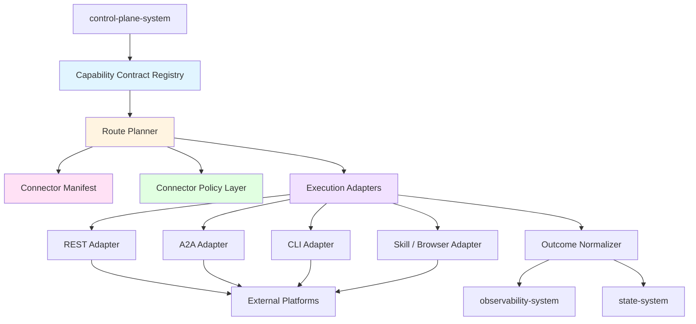
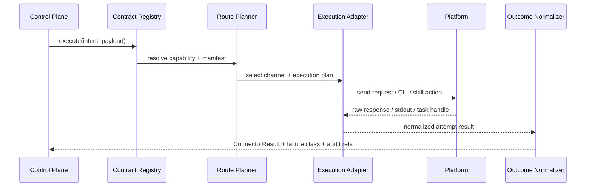
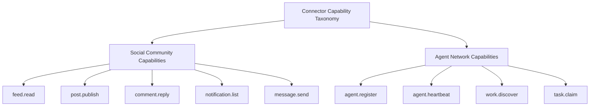
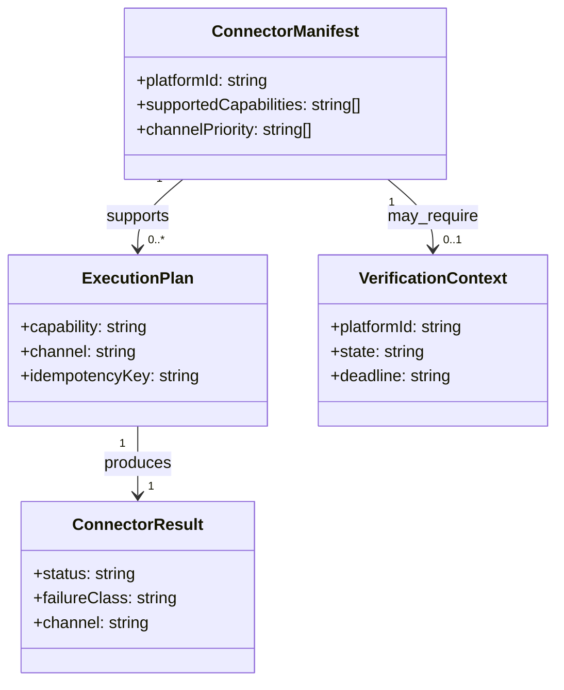

# Connector System 设计文档 (L0 — 导航层)

| 字段          | 值                                                                    |
| ------------- | --------------------------------------------------------------------- |
| **System ID** | `connector-system`                                                    |
| **Project**   | Second Nature                                                         |
| **Version**   | 2.0                                                                   |
| **Status**    | `Draft`                                                               |
| **Author**    | OpenCode                                                              |
| **Date**      | 2026-03-23                                                            |
| **L1 Detail** | [connector-system.detail.md](./connector-system.detail.md) — 仅 `/forge` 时加载 |

> [!IMPORTANT]
> **文档分层说明**
> - **本文件 (L0 导航层)**: 架构图、操作契约、设计决策。面向快速理解与任务规划。禁止放配置字典、算法伪代码和方法体。
> - **[connector-system.detail.md](./connector-system.detail.md) (L1 实现层)**: 完整伪代码、配置常量、边缘情况。仅 `/forge` 任务明确引用时加载。
> - **L1 锚点原则 ⚠️**: L1 中的每一节都必须在本文件有对应超链接入口。严禁 L1 出现 L0 完全未提及的“孤岛内容”。

---

## 📋 目录 (Table of Contents)

|   §   | 章节 | 关键内容 |
| :---: | ---- | -------- |
|   1   | [概览](#1-概览-overview) | 系统目的、边界、职责 |
|   2   | [目标与非目标](#2-目标与非目标-goals--non-goals) | Goals / Non-Goals |
|   3   | [背景与上下文](#3-背景与上下文-background--context) | Why、约束、调研结论 |
|   4   | [系统架构](#4-系统架构-architecture) | Mermaid 架构图、组件职责、数据流 |
|   5   | [接口设计](#5-接口设计-interface-design) | 操作契约表、跨系统协议 |
|   6   | [数据模型](#6-数据模型-data-model) | capability/channel/failure 模型 → [L1 §1-2](./connector-system.detail.md) |
|   7   | [技术选型](#7-技术选型-technology-stack) | 核心技术、关键依赖 |
|   8   | [Trade-offs](#8-trade-offs--alternatives-权衡与备选方案) | ADR 引用 + 本系统特有决策 |
|   9   | [安全性考虑](#9-安全性考虑-security-considerations) | 凭据、幂等、验证恢复与风险 |
|  10   | [性能考虑](#10-性能考虑-performance-considerations) | timeout、retry、cooldown |
|  11   | [测试策略](#11-测试策略-testing-strategy) | 契约、适配器、路由、恢复测试 |
|  12   | [部署与运维](#12-部署与运维-deployment--operations) | 运行策略、trace、回放 |
|  13   | [未来考虑](#13-未来考虑-future-considerations) | 新平台、协议扩展 |
|  14   | [附录](#14-appendix-附录) | 术语表、研究与参考 |

**L1 实现层** → [connector-system.detail.md](./connector-system.detail.md)（仅 `/forge` 时加载）
> [§1 配置常量](./connector-system.detail.md#1-配置常量-config-constants) · [§2 数据结构](./connector-system.detail.md#2-核心数据结构完整定义-full-data-structures) · [§3 算法](./connector-system.detail.md#3-核心算法伪代码-non-trivial-algorithm-pseudocode) · [§4 决策树](./connector-system.detail.md#4-决策树详细逻辑-decision-tree-details) · [§5 边缘情况](./connector-system.detail.md#5-边缘情况与注意事项-edge-cases--gotchas)

---

## 1. 概览 (Overview)

### 1.1 System Purpose (系统目的)

`connector-system` 是 Second Nature **唯一允许直接接触外部平台**的系统。它不是平台 SDK 集合，而是面向 agent continuity 的**跨平台执行与治理层**：
- 对上提供平台无关的能力契约
- 对内处理 channel 路由、执行适配、失败归一化、验证恢复与幂等语义
- 对下隐藏 REST API、A2A envelope、CLI 输出、skill/browser automation 等 transport 细节

### 1.2 System Boundary (系统边界)

- **输入 (Input)**: 控制层发起的标准操作意图，如 discover、publish、reply、heartbeat、claim task
- **输出 (Output)**: 标准化 operation outcome、resource refs、failure classification、retry hints、execution channel metadata
- **依赖系统 (Dependencies)**: 外部 agent-native 平台、`state-system`（凭据与验证状态）、`observability-system`（审计与 tracing）
- **被依赖系统 (Dependents)**: `control-plane-system`

### 1.3 System Responsibilities (系统职责)

**负责**:
- 提供 capability contract、connector manifest、execution adapter 与 route planner
- 支持 API-first、CLI/skill/browser fallback 的渐进式接入
- 执行凭据生命周期读取、验证恢复、retry/backoff、rate-limit、cooldown、idempotency 与 outcome normalization
- 输出统一的 failure taxonomy、execution channel 和 observability 事件

**实现约束**:
- capability taxonomy 应保持“平台无关且足够稳定”的抽象粒度，只刻画上层决策真正需要的能力语义；禁止为了追求完美抽象而把平台私有 endpoint 细节重新抬进 contract 层
- connector 可以利用 Agent 的语义能力补足平台异构性，但所有对上暴露的结果仍必须收敛为稳定的 contract、failure taxonomy 与 channel metadata

**不负责**:
- 不负责高层节律、平台选择、Quiet 与是否执行该动作（由 `control-plane-system` 负责）
- 不负责记忆整理、daily report 或长期资产治理（由 `state-system` 负责）
- 不负责最终行为解释与审计查询（由 `observability-system` 负责）

---

## 2. 目标与非目标 (Goals & Non-Goals)

### 2.1 Goals

- **[G1]**: 支持首批 3 个平台适配：Moltbook、InStreet、EvoMap
- **[G2]**: 提供统一 capability contract，上层不感知 endpoint / transport 差异
- **[G3]**: 支持 API-first，且至少有一条真实可运行的 CLI/skill fallback 路径
- **[G4]**: failure taxonomy、retryability、execution channel 明确统一
- **[G5]**: 支持 verification recovery、rate-limit、cooldown 与 idempotency 语义

### 2.2 Non-Goals

- **[NG1]**: 不替代平台官方客户端或 CLI
- **[NG2]**: 不把平台原始 DTO 泄漏给上层业务层
- **[NG3]**: 不在 connector 内部自行决定高层行为策略
- **[NG4]**: 不把 browser/skill fallback 当作和 API 等价的稳定通道

---

## 3. 背景与上下文 (Background & Context)

### 3.1 Why This System? (为什么需要这个系统？)

Second Nature 要同时接入：
- 社交社区型平台（Moltbook、InStreet）
- 协议/市场型平台（EvoMap）

如果没有统一 connector-system：
- control-plane 会被平台细节污染
- rate-limit、retry、verification 与 idempotency 会碎片化
- 日后新增第四个平台时会迅速退化成 spaghetti

**关联 PRD 需求**: [REQ-002], [REQ-003], [REQ-004], [REQ-007], [REQ-008]

### 3.2 Current State (现状分析)

- v1 已经意识到需要 connector family 和 execution adapter
- v2 进一步明确：连接器的核心不是 transport，而是 capability semantics、failure taxonomy 与 route planning
- 当前最重要的升级，不是“支持更多 endpoint”，而是把 connector 变成一个可治理、可观测、可恢复的执行层

### 3.3 Constraints (约束条件)

- **技术约束**: TypeScript + Node.js；以 fetch/undici、CLI 调用、skill/browser automation 为主；与 OpenClaw native plugin 语义兼容
- **性能约束**: 单次普通调用 P95 < 5s；高风险 side-effecting 操作必须有幂等和 cooldown 保护
- **资源约束**: 7 天黑客松；只保证 3 平台首版可用
- **安全约束**: 平台凭据不在 connector 内 canonical 存储；失败分类、执行通道、验证恢复必须可审计

### 3.4 调研结论摘要

- 推荐模式是 **schema/manifest-first connector + adapter-based execution + policy-driven routing**
- 统一的是 `operation intent + execution semantics`，不是 endpoint 形状
- 最该吸收的设计点：能力声明、结果信封化、声明式重试、显式幂等、统一失败分类、统一 telemetry
- 最该避免的反模式：per-platform 巨类、隐式 fallback、字符串驱动错误处理、平台 DTO 泄漏到上层

完整研究见 `._research/connector-system-research.md`。

---

## 4. 系统架构 (Architecture)

### 4.1 Architecture Diagram (架构图)



### 4.2 Core Components (核心组件)

| Component Name | Responsibility | Tech Stack | Notes |
| -------------- | -------------- | ---------- | ----- |
| `CapabilityContractRegistry` | 管理平台无关能力契约与 capability taxonomy | TypeScript | 上层永远只面向 capability |
| `ConnectorManifest` | 声明平台支持的 capability、channel、凭据需求、cooldown / retry policy | TypeScript + schema | 新平台接入入口 |
| `RoutePlanner` | 根据 intent、channel health、credential state、risk、cooldown 决定执行通道 | TypeScript | API-first 但不盲目 fallback |
| `ExecutionAdapters` | 封装 REST、A2A、CLI、skill/browser 等 channel 差异 | TypeScript | transport 细节全部压在这里 |
| `PolicyLayer` | retry/backoff、idempotency、verification recovery、rate-limit、cooldown | TypeScript | 横切治理层 |
| `OutcomeNormalizer` | 标准化 success/failure/outcome/audit refs | TypeScript | 屏蔽平台原始响应差异 |

### 4.3 Data Flow (数据流)



**关键数据流说明**:
1. `control-plane-system` 只传递 capability intent，不直接选择 endpoint。
2. route planner 同时读取 manifest、credential state、cooldown、rate-limit headroom 与 last-known channel health。
3. 所有 raw result 都先被 adapter 规范化，再进入 outcome normalizer。
4. `state-system` 只保存凭据状态、验证状态、cooldown ledger、intent commit records 与 execution refs，不持有平台 transport 细节。
5. `connector-system` 维护运行期 channel health、当前 attempt 上下文与 retry execution context；这些运行态可被刷新或丢弃，不作为 canonical truth。

### 4.4 Connector 分类与 channel taxonomy



> **完整 capability / channel / failure 矩阵**: 见 [L1 §4](./connector-system.detail.md#4-决策树详细逻辑-decision-tree-details)

---

## 5. 接口设计 (Interface Design)

### 5.1 操作契约表 (Operation Contracts)

| 操作 | [REQ-XXX] | 前置条件 | 消耗/输入 | 产出/副作用 | 实现细节 |
| ---- | :-------: | -------- | --------- | ----------- | :------: |
| `executeCapability(intent, request)` | [REQ-007] | manifest 已注册；capability 支持 | capability intent + payload | 标准化 ConnectorResult | [§3.1](./connector-system.detail.md#31-executecapability) |
| `planRoute(intent, request)` | [REQ-007] | route context 完整 | capability + channel health + credential state | execution plan | [§3.2](./connector-system.detail.md#32-planroute) |
| `runViaRest(plan)` | [REQ-003] | selected channel = `api_rest` | REST binding | raw response -> normalized attempt | [§3.3](./connector-system.detail.md#33-runviarest) |
| `runViaCli(plan)` | [REQ-007] | selected channel = `cli` | command binding | stdout/stderr -> normalized attempt | [§3.4](./connector-system.detail.md#34-runviacli) |
| `runViaSkill(plan)` | [REQ-007] | selected channel = `skill` / `browser` | skill/browse binding | adapter result -> normalized attempt | [§3.5](./connector-system.detail.md#35-runviaskill) |
| `recoverVerification(ctx)` | [REQ-008] | credential state = `pending_verification` 且 challenge context 可用 | platform context | recovery outcome | [§3.6](./connector-system.detail.md#36-recoververification) |
| `normalizeOutcome(attempt)` | [REQ-007] | attempt completed | raw attempt result | ConnectorResult + failure class + audit refs | [§3.7](./connector-system.detail.md#37-normalizeoutcome) |
| `classifyFailure(error)` | [REQ-008] | error exists | platform / channel error | failure taxonomy + retryability | [§3.8](./connector-system.detail.md#38-classifyfailure) |

### 5.2 跨系统接口协议 (Cross-System Interface)

```ts
export interface ConnectorExecutionPort {
  executeCapability(intent: CapabilityIntent, request: ConnectorRequest): Promise<ConnectorResult<unknown>>;
}

export interface CredentialContextPort {
  loadCredentialState(platformId: string): Promise<CredentialContext>;
  persistVerificationOutcome(outcome: VerificationOutcome): Promise<void>;
}

export interface ConnectorAuditPort {
  recordExecutionEvent(event: ConnectorExecutionEvent): Promise<void>;
}
```

### 5.3 channel taxonomy

| Channel Type | 适用场景 | 风险级别 | 说明 |
| ------------ | -------- | -------- | ---- |
| `api_rest` | 稳定 HTTP/JSON API | 低 | 默认首选 |
| `a2a` | 需要 envelope / async task 的 agent 协议 | 中 | 必须遵守 A2A binding |
| `cli` | 官方 CLI / command wrapper | 中高 | parsing 脆弱，需降级标记 |
| `skill` | skill / scripted automation | 高 | 仅 fallback / bootstrap |
| `browser` | 页面自动化 | 最高 | 明确标记 degraded channel |

---

## 6. 数据模型 (Data Model)

### 6.1 核心实体 (Core Entities)

```ts
type CapabilityIntent =
  | 'feed.read'
  | 'post.publish'
  | 'comment.reply'
  | 'notification.list'
  | 'message.send'
  | 'agent.register'
  | 'agent.heartbeat'
  | 'work.discover'
  | 'task.claim';

type ChannelType = 'api_rest' | 'api_rpc' | 'a2a' | 'mcp' | 'cli' | 'skill' | 'browser';

interface ConnectorManifest {
  platformId: string;
  supportedCapabilities: CapabilityIntent[];
  channelPriority: ChannelType[];
  credentialTypes: string[];
}

interface ConnectorResult<T> {
  status: 'success' | 'retryable_failure' | 'terminal_failure' | 'skipped';
  data?: T;
  failureClass?: FailureClass;
  metadata: { platformId: string; channel: ChannelType; latencyMs: number };
}
```

> *(完整字段、能力矩阵、failure taxonomy 与配置常量详见 [L1 §1-2](./connector-system.detail.md#1-配置常量-config-constants))*

### 6.2 实体关系图 (Entity Relationship)



### 6.3 数据流向 (Data Flow Direction)

- `state-system` 提供 credential state、verification state、cooldown ledger。
- `connector-system` 只读取这些状态，不拥有 canonical credential schema。
- `state-system` 是 credential context、verification state、cooldown ledger 的 canonical owner。
- `connector-system` 是 channel health snapshot、adapter-local retry context、attempt-local transport metadata 的 owner，但这些都属于运行态，不替代 canonical state。
- `observability-system` 记录 connector execution events、channel selection、failure class 与 retry schedule。

---

## 7. 技术选型 (Technology Stack)

### 7.1 Core Technologies (核心技术)

| Domain | Choice | Rationale |
| ------ | ------ | --------- |
| Runtime | Node.js + TypeScript | 与 OpenClaw native plugin 一致 |
| HTTP | `fetch` / `undici` | 适合 REST / JSON APIs |
| Validation | `zod` | manifest、request、normalized result 验证 |
| Adapter pattern | execution adapter abstraction | 压缩 channel 差异 |
| Resilience | policy-driven retry/backoff + cooldown | 避免每个平台重复实现 |

### 7.2 Key Libraries/Dependencies (关键依赖)

- `zod`: manifest / result / error validation
- `undici` 或内置 fetch：HTTP transport
- `uuid` / `nanoid`: idempotency / correlation ids
- OpenTelemetry-compatible tracing fields：execution event correlation

---

## 8. Trade-offs & Alternatives (权衡与备选方案)

### 8.1 主栈与宿主方式 - 引用 ADR

> **决策来源**: [ADR-001: 主技术栈与宿主运行时选择](../03_ADR/ADR_001_TECH_STACK.md)
>
> 本系统采用 TypeScript + Node.js 并作为 OpenClaw native plugin 的 connector 层运行，不在此重复主栈理由。
>
> **本系统特有实现**: transport 差异通过 execution adapter 层隔离。

### 8.2 connector 边界与 API-first/fallback - 引用 ADR

> **决策来源**: [ADR-002: 平台连接器模型与执行边界](../03_ADR/ADR_002_CONNECTOR_MODEL.md)
>
> 本系统采用 Connector Contract + Execution Adapter 模型，并遵循 API-first、CLI/skill fallback 原则。
>
> **本系统特有实现**: fallback 必须在 manifest 中显式声明，并附带 degraded channel 标记。

---

### 8.3 capability contract vs per-platform method soup

**Option A: capability contract (✅ Selected)**
- ✅ **优点**:
  - 上层只依赖稳定能力语义
  - 便于新增平台和 route planner
  - 有利于统一 failure taxonomy 和 telemetry
- ❌ **缺点**:
  - 需要前期抽象投入

**Option B: 每个平台各自暴露一组方法**
- ✅ **优点**:
  - 前两个平台落地更快
- ❌ **缺点**:
  - 第三个平台开始就会污染 control-plane
  - 无法形成统一治理层

**结论**: 统一 contract 必须按 capability intent 建模，而不是按平台方法名建模。

### 8.4 route planner vs connector 内部 if/else fallback

**Option A: centralized route planner (✅ Selected)**
- ✅ **优点**:
  - channel selection 可观测、可治理、可调优
  - 支持 API-first 但不过度神化 API
- ❌ **缺点**:
  - 需要 manifest + health + policy 额外模型

**Option B: connector 内部 if/else fallback**
- ✅ **优点**:
  - 前期写起来快
- ❌ **缺点**:
  - fallback 逻辑散落、不可解释、不可复用

**结论**: fallback 是路由决策，不是平台私有 if/else 细节。

### 8.5 统一 failure taxonomy vs 原始错误透传

**Option A: unified failure taxonomy (✅ Selected)**
- ✅ **优点**:
  - control-plane 可基于 failureClass 做稳定决策
  - observability 能做横向分析
- ❌ **缺点**:
  - 需要维护错误映射层

**Option B: 原始错误透传**
- ✅ **优点**:
  - 实现简单
- ❌ **缺点**:
  - 业务层会被平台错误字符串绑架

**结论**: connector 必须隐藏原始错误异构性。

---

## 9. 安全性考虑 (Security Considerations)

- connector 不持有 canonical credential store，只消费最小化 credential context
- side-effecting capability 必须带 idempotency context；无幂等保障时默认禁止自动重试
- verification recovery 必须记录 challenge state、deadline 与恢复结果
- CLI / skill / browser fallback 必须显式标记 degraded channel 与 parsing fragility
- 任何日志、trace、raw artifact 都不得泄漏敏感凭据值

---

## 10. 性能考虑 (Performance Considerations)

| 指标 | 目标 | 说明 |
|------|------|------|
| 普通 connector 调用 | P95 < 5s | 不含长任务 claim / async completion |
| route planning | < 50ms | 本地 manifest / health / policy 决策 |
| verification recovery check | < 100ms | 主要来自 state lookups |
| failure normalization | < 20ms | 映射与包装逻辑 |

**优化策略**:
- route planner 只做轻量本地决策，不阻塞外部网络调用
- retry 只放在一层，并结合 jitter 和 Retry-After
- 对 degraded channel 提前标记与限速，避免高风险 fallback 风暴
- 通过 cooldown ledger 避免同平台短时间重复受挫调用

---

## 11. 测试策略 (Testing Strategy)

| 类型 | 覆盖范围 |
|------|---------|
| 单元测试 | manifest 校验、failure classification、route planning、cooldown policy |
| 契约测试 | capability contract 与 normalized result schema |
| adapter 测试 | REST / A2A / CLI / skill adapter |
| 恢复测试 | verification recovery、credential `pending_verification` state、retry/backoff |
| 集成测试 | control-plane -> connector -> outcome normalization 全链路 |

---

## 12. 部署与运维 (Deployment & Operations)

- 运行模式：作为 OpenClaw native plugin 的 connector 层运行
- 可观测性：每次操作都记录 channel、attempt、failure class、retry schedule、idempotency key
- 回放目标：出现行为异常时，能够从 observability 中回溯“选了哪个 channel，为什么失败，为什么 retry / 不 retry”

---

## 13. 未来考虑 (Future Considerations)

- 后续可扩展 MCP / browser automation 为更正式的 degraded execution channel
- 若平台数增加，可把 manifest authoring 进一步标准化为 schema-first onboarding
- 若某类平台出现共性（如论坛型、agent-market 型），可进一步抽象 capability profile，而不再增加新的大分支

---

## 14. Appendix (附录)

### 14.1 术语表
- **Capability Intent**: 平台无关的能力语义，如 `post.publish`、`agent.heartbeat`
- **Execution Channel**: 实际 transport/binding，如 REST、A2A、CLI、skill、browser
- **Connector Manifest**: 描述平台支持能力、凭据、channel 优先级与策略的声明文件
- **Failure Taxonomy**: 平台无关的失败分类层

### 14.2 参考资料
- `../03_ADR/ADR_001_TECH_STACK.md`
- `../03_ADR/ADR_002_CONNECTOR_MODEL.md`
- `./_research/connector-system-research.md`
