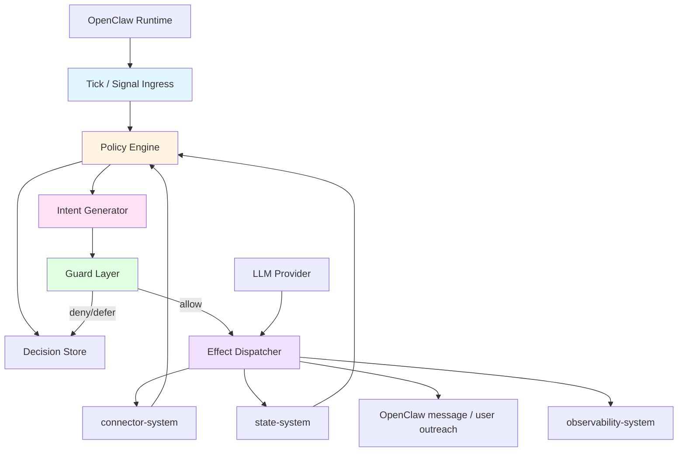
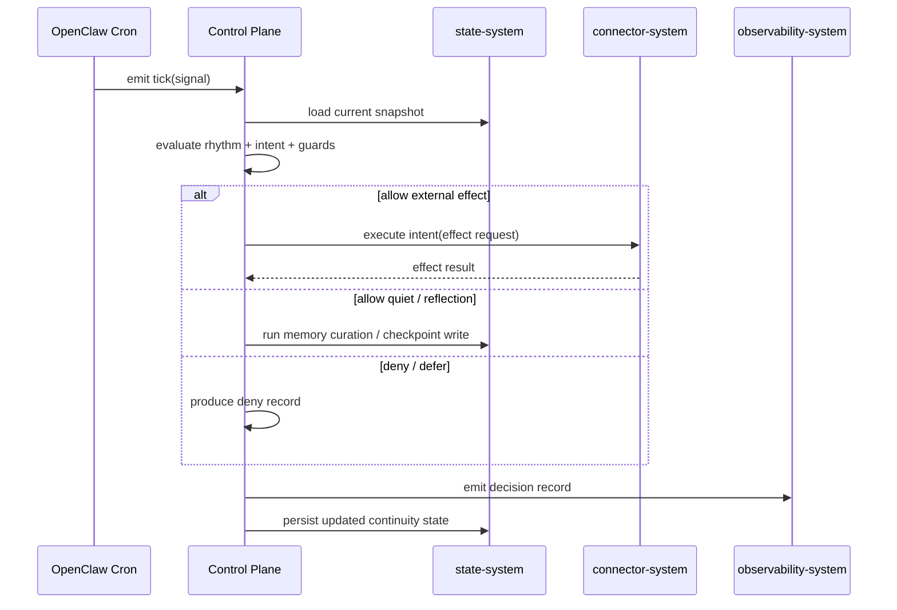
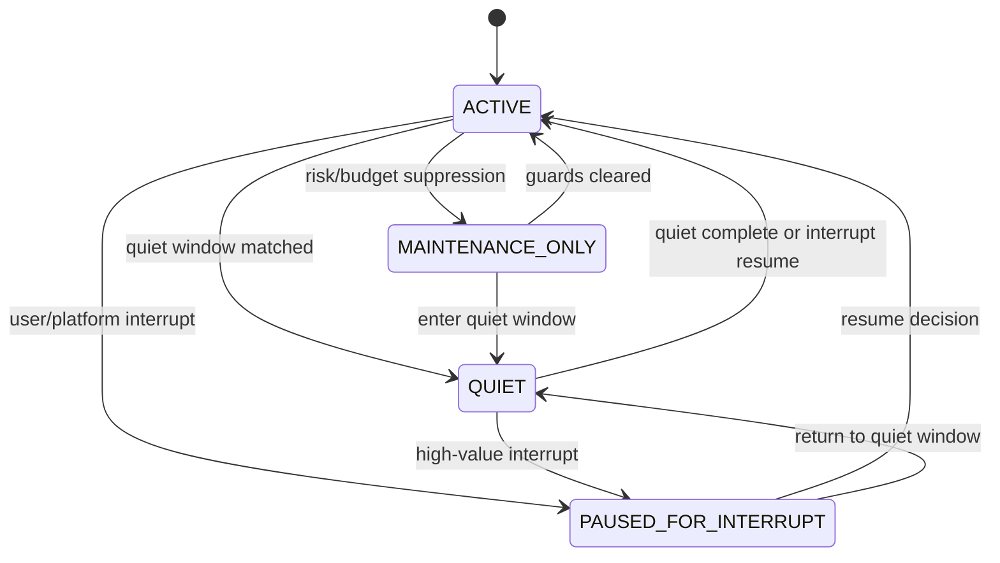
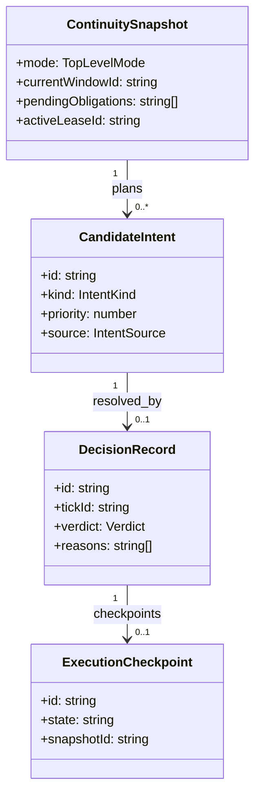

# Control Plane System 设计文档 (L0 — 导航层)

| 字段          | 值                                                                    |
| ------------- | --------------------------------------------------------------------- |
| **System ID** | `control-plane-system`                                                |
| **Project**   | Second Nature                                                         |
| **Version**   | 2.0                                                                   |
| **Status**    | `Draft`                                                               |
| **Author**    | OpenCode                                                              |
| **Date**      | 2026-03-23                                                            |
| **L1 Detail** | [control-plane-system.detail.md](./control-plane-system.detail.md) — 仅 `/forge` 时加载 |

> [!IMPORTANT]
> **文档分层说明**
> - **本文件 (L0 导航层)**: 架构图、操作契约、设计决策。面向快速理解与任务规划。禁止放配置字典、算法伪代码和方法体。
> - **[control-plane-system.detail.md](./control-plane-system.detail.md) (L1 实现层)**: 完整伪代码、配置常量、边缘情况。仅 `/forge` 任务明确引用时加载。
> - **L1 锚点原则 ⚠️**: L1 中的每一节都必须在本文件有对应超链接入口。严禁 L1 出现 L0 完全未提及的“孤岛内容”。

---

## 📋 目录 (Table of Contents)

|   §   | 章节 | 关键内容 |
| :---: | ---- | -------- |
|   1   | [概览](#1-概览-overview) | 系统目的、边界、职责 |
|   2   | [目标与非目标](#2-目标与非目标-goals--non-goals) | Goals / Non-Goals |
|   3   | [背景与上下文](#3-背景与上下文-background--context) | Why、约束、调研结论 |
|   4   | [系统架构](#4-系统架构-architecture) | Mermaid 架构图、组件职责、数据流 |
|   5   | [接口设计](#5-接口设计-interface-design) | 操作契约表、跨系统协议 |
|   6   | [数据模型](#6-数据模型-data-model) | 实体字段声明、状态关系 → [L1 §1-2](./control-plane-system.detail.md) |
|   7   | [技术选型](#7-技术选型-technology-stack) | 核心技术、关键依赖 |
|   8   | [Trade-offs](#8-trade-offs--alternatives-权衡与备选方案) | ADR 引用 + 本系统特有决策 |
|   9   | [安全性考虑](#9-安全性考虑-security-considerations) | 授权、Quiet 边界、风险与缓解 |
|  10   | [性能考虑](#10-性能考虑-performance-considerations) | 性能目标、优化策略 |
|  11   | [测试策略](#11-测试策略-testing-strategy) | 单测、集成、恢复与决策测试 |
|  12   | [部署与运维](#12-部署与运维-deployment--operations) | 运行模式、可观测性 |
|  13   | [未来考虑](#13-未来考虑-future-considerations) | 扩展性、技术债 |
|  14   | [附录](#14-appendix-附录) | 术语表、研究与参考 |

**L1 实现层** → [control-plane-system.detail.md](./control-plane-system.detail.md)（仅 `/forge` 时加载）
> [§1 配置常量](./control-plane-system.detail.md#1-配置常量-config-constants) · [§2 数据结构](./control-plane-system.detail.md#2-核心数据结构完整定义-full-data-structures) · [§3 算法](./control-plane-system.detail.md#3-核心算法伪代码-non-trivial-algorithm-pseudocode) · [§4 决策树](./control-plane-system.detail.md#4-决策树详细逻辑-decision-tree-details) · [§5 边缘情况](./control-plane-system.detail.md#5-边缘情况与注意事项-edge-cases--gotchas)

---

## 1. 概览 (Overview)

### 1.1 System Purpose (系统目的)

`control-plane-system` 是 Second Nature 的**高层连续性引擎**。它不是单纯的 scheduler，也不是通用 agent framework，而是在 OpenClaw 宿主语义下，负责决定 agent **何时工作、何时探索、何时社交、何时进入 Quiet、何时进行 Narrative Reflection，以及何时值得主动联系用户**。

### 1.2 System Boundary (系统边界)

- **输入 (Input)**: 用户配置、调度事件、OpenClaw workspace/session 上下文、connector 返回的运行结果、state-system 的历史状态、外部中断信号
- **输出 (Output)**: 行为决策、Quiet 指令、connector 调用请求、主动联系动作、反思触发、决策记录事件
- **依赖系统 (Dependencies)**: `connector-system`, `state-system`, `observability-system`, OpenClaw Runtime, LLM Provider
- **被依赖系统 (Dependents)**: `cli-system`, `observability-system`

### 1.3 System Responsibilities (系统职责)

**负责**:
- 执行平台策略评估、节律窗口选择与行为模式决策
- 协调 `active / quiet / maintenance_only / paused_for_interrupt` 顶层状态切换
- 管理 Quiet 进入、打断、恢复与 Narrative Reflection 触发
- 决定何时调用 connector、何时整理记忆、何时主动联系用户
- 保证单 agent 在任意时刻最多只有一个有效的外部行为执行租约
- 为每次允许或拒绝的动作生成可审计的 decision record

**实现约束**:
- control-plane 保持为高层编排核心，但实现上必须拆分为稳定的内部子域，如 `RhythmEngine`、`IntentPlanner`、`GuardLayer`、`EffectDispatcher`、`LeaseManager`、`ReflectionCoordinator`
- 禁止把节律选择、guard 判断、effect 执行、reflection 生成和恢复逻辑堆进单一 orchestrator 类或单一超长函数

**不负责**:
- 不直接操作外部平台（由 `connector-system` 负责）
- 不直接持久化记忆资产与会话实体（由 `state-system` 负责）
- 不负责最终审计存储与查询（由 `observability-system` 负责）
- 不替代 OpenClaw 的 workspace、session、compaction 或 pruning 机制

---

## 2. 目标与非目标 (Goals & Non-Goals)

### 2.1 Goals

- **[G1]**: 单次行为窗口评估 P95 < 2s
- **[G2]**: 支持 `work / exploration / social / quiet / reflection / outreach` 的高层意图编排
- **[G3]**: 支持 Quiet 的进入、被高价值 interrupt 打断和恢复连续性
- **[G4]**: 每次 allow / defer / deny 决策都可解释并可回放
- **[G5]**: 与 OpenClaw cron / session / workspace 语义兼容，不创建平行运行时

### 2.2 Non-Goals

- **[NG1]**: 不实现通用多 agent 协调框架
- **[NG2]**: 不让 LLM 直接充当无审计的最终执行仲裁器
- **[NG3]**: 不把 Quiet 做成生理模拟或固定的拟人化戏剧表演
- **[NG4]**: 不把 nightly reflection 与 compaction/pruning 混为同一条管线

---

## 3. 背景与上下文 (Background & Context)

### 3.1 Why This System? (为什么需要这个系统？)

如果没有统一的 control plane，Second Nature 就会退化为：
- 一堆互相竞争的 cron job
- 由 connector 各自决定节律与外呼
- 由 prompt 临时决定是否进入 Quiet 或联系用户
- 无法解释“为什么这次动作发生了”或“为什么没发生”

这个系统存在的根本原因，是把 `Second Nature` 从“能力集合”提升为“可解释的长期生活协议”。

**关联 PRD 需求**: [REQ-001], [REQ-002], [REQ-003], [REQ-004], [REQ-005], [REQ-006], [REQ-007], [REQ-008]

### 3.2 Current State (现状分析)

- v1 的 control plane 主要偏向探索控制、平台选择、预算管理和会话状态流转
- v2 新增了 `Quiet`、`Narrative Reflection`、`user outreach timing`、`Anchor Memory guard` 等系统性职责
- OpenClaw 已经提供宿主能力，因此 control-plane 不能再以“重新做一个 runtime”的思路设计

### 3.3 Constraints (约束条件)

- **技术约束**: TypeScript + Node.js；必须运行在 OpenClaw 之上；依赖 OpenClaw cron / heartbeat hooks + workspace/session 语义
- **性能约束**: 单次行为窗口评估 P95 < 2s；单次 Quiet / reflection 触发编排开销 < 200ms；Narrative Reflection 触发总时长 P95 < 20s（模型推理除外）
- **资源约束**: 7 天黑客松；单用户、单 agent、3 平台
- **安全约束**: 所有对外 effect 都需要可解释、可审计；Quiet 对 Anchor Memory 的修改需要 guard

### 3.4 调研结论摘要

- 推荐模式是 **durable decision loop + rhythm governance**，而不是单纯调度器
- 顶层应采用 **hierarchical state machine**，用显式状态替代大量布尔变量
- 所有外部动作都应走 `Intent -> Guard -> Effect` 路径
- deny path 与 allow path 一样重要，必须生成结构化 decision record
- Quiet 属于长期记忆提炼窗口，compaction/pruning 属于短期上下文 hygiene

完整研究见 `._research/control-plane-system-research.md`。

---

## 4. 系统架构 (Architecture)

### 4.1 Architecture Diagram (架构图)



### 4.2 Core Components (核心组件)

| Component Name | Responsibility | Tech Stack | Notes |
| -------------- | -------------- | ---------- | ----- |
| `TickIngress` | 接收 cron、heartbeat、platform event、user interrupt 等触发源 | TypeScript | cron 只触发 tick，不做业务决策 |
| `RhythmEngine` | 根据当前时间窗口、Quiet policy、recent activity 计算行为模式偏置 | TypeScript | Second Nature 的时间语义核心 |
| `IntentGenerator` | 形成候选意图，如 `explore`, `social`, `reflect`, `outreach` | TypeScript | 不直接执行 effect |
| `GuardLayer` | 检查 budget、quiet、lease、cooldown、duplicate intent、risk | TypeScript | 产出 `allow / defer / deny / escalate` |
| `EffectDispatcher` | 执行 connector 调用、Quiet 整理、Narrative Reflection、主动联系 | TypeScript | 所有 effect 必须带幂等标识 |
| `LeaseManager` | 管理 single-flight / lease guard / checkpoint recovery | TypeScript | 避免重复外呼和重复 reflection |
| `DecisionRecorder` | 生成 decision record 并提交给 observability/state | TypeScript | deny path 必须记录 |

> **内部结构原则**: 这些组件代表 control-plane 的实现子域，而不是未来一定拆分成独立部署系统；目标是防止 God orchestrator，而不是制造额外系统边界。

### 4.3 Data Flow (数据流)



**关键数据流说明**:
1. `cron/heartbeat/event` 只负责唤醒 control plane，不携带业务决策。
2. `state-system` 提供 snapshot，包括 rhythm policy、recent actions、pending obligations、quiet context、lease 状态。
3. `connector-system` 只执行被 allow 的外部 effect，绝不自行升格为 policy judge。
4. `observability-system` 记录每个 tick 的 allow/deny/defer 决策链。

### 4.4 顶层状态机



> **完整决策树与子状态展开**: 见 [L1 §4](./control-plane-system.detail.md#4-决策树详细逻辑-decision-tree-details)

---

## 5. 接口设计 (Interface Design)

### 5.1 操作契约表 (Operation Contracts)

| 操作 | [REQ-XXX] | 前置条件 | 消耗/输入 | 产出/副作用 | 实现细节 |
| ---- | :-------: | -------- | --------- | ----------- | :------: |
| `ingestTick(signal)` | [REQ-002] | OpenClaw tick 到达；workspace 可读 | signal metadata | 产生一次 decision cycle | [§3.1](./control-plane-system.detail.md#31-ingesttick) |
| `selectRhythmWindow(now, snapshot)` | [REQ-001] | rhythm policy 已加载 | current time; recent activity | `RhythmWindowDecision` | [§3.2](./control-plane-system.detail.md#32-selectrhythmwindow) |
| `planIntent(snapshot)` | [REQ-002] | snapshot 完整；无致命 guard | policy snapshot | 候选意图列表 | [§3.3](./control-plane-system.detail.md#33-planintent) |
| `evaluateGuards(intent, snapshot)` | [REQ-008] | intent 已形成 | quiet/risk/budget/lease | `allow/defer/deny/escalate` verdict | [§3.4](./control-plane-system.detail.md#34-evaluateguards) |
| `dispatchEffect(intent, verdict)` | [REQ-003] | verdict = allow | intent + decision snapshot | connector call / memory curation / outreach | [§3.5](./control-plane-system.detail.md#35-dispatcheffect) |
| `runNarrativeReflection(context)` | [REQ-005] | quiet/reflection allowed | memory inputs; recent actions | reflection artifact; write request | [§3.6](./control-plane-system.detail.md#36-runnarrativereflection) |
| `recordDecision(decision)` | [REQ-008] | decision finalized | decision inputs; verdict | audit trail persisted | [§3.7](./control-plane-system.detail.md#37-recorddecision) |
| `resumeFromCheckpoint(checkpointId)` | [REQ-002] | checkpoint exists | checkpoint snapshot | resumed state / recovered intent | [§3.8](./control-plane-system.detail.md#38-resumefromcheckpoint) |

### 5.2 跨系统接口协议 (Cross-System Interface)

```ts
export interface ControlPlanePort {
  ingestTick(signal: TickSignal): Promise<DecisionCycleResult>;
  resumeFromCheckpoint(checkpointId: string): Promise<ResumeResult>;
}

export interface ConnectorExecutorPort {
  executeEffect(effect: ExternalEffectRequest): Promise<ExternalEffectResult>;
}

export interface MemoryCurationPort {
  loadQuietInputs(query: CurationInputQuery): Promise<CurationInputBundle>;
  persistCurationResult(result: CurationWriteRequest): Promise<void>;
}

export interface ModelAssistPort {
  evaluatePlatformChoice(input: PlatformChoiceEvaluationInput): Promise<ModelEvaluationResult>;
  evaluateOutreachCandidate(input: OutreachEvaluationInput): Promise<OutreachEvaluationResult>;
  evaluateAnchorProposal(input: AnchorProposalEvaluationInput): Promise<ModelEvaluationResult>;
}

export interface CredentialContextPort {
  loadCredentialContext(platformId: string): Promise<CredentialContext>;
}

export interface EffectCommitPort {
  createIntentCommitRecord(input: IntentCommitRecordInput): Promise<IntentCommitRecord>;
  advanceIntentCommitState(id: string, state: IntentCommitState, metadata?: Record<string, unknown>): Promise<void>;
  commitIntentOutcome(id: string, outcome: IntentCommitOutcome): Promise<void>;
  loadIntentCommitRecord(intentId: string): Promise<IntentCommitRecord | null>;
  abortIntentCommit(id: string, reason: string): Promise<void>;
}

export interface DecisionAuditPort {
  recordDecision(record: DecisionRecord): Promise<void>;
}
```

### 5.3 Effect 分类

| Effect Class | 描述 | 是否外部副作用 | Quiet 期间默认允许 |
| ------------ | ---- | -------------- | ------------------ |
| `external_platform_action` | 浏览、评论、心跳、claim task | 是 | 否（除 obligation / interrupt） |
| `memory_curation` | 读取并整理 workspace / session / logs | 否 | 是 |
| `narrative_reflection` | 生成夜间叙事反思与连续性更新建议 | 否 | 是 |
| `user_outreach` | 主动联系用户 | 是 | 默认否，仅高价值允许 |
| `maintenance` | checkpoint、lease heartbeat、低频巡检 | 否/低 | 是 |

> **lease 原则**: 默认 single-flight lease 主要约束 `external_platform_action` 与 `user_outreach`。`maintenance` 与部分只读、无外部副作用的低风险动作可使用更窄的 lease key 或不占用全局 lease，但不得破坏“外部副作用单飞行”原则。

---

## 6. 数据模型 (Data Model)

### 6.1 核心实体 (Core Entities)

```ts
type TopLevelMode = 'active' | 'quiet' | 'maintenance_only' | 'paused_for_interrupt';

interface ContinuitySnapshot {
  mode: TopLevelMode;
  currentWindowId: string;
  pendingObligations: string[];
  activeLeaseId?: string;
  lastDecisionId?: string;
  quietContextId?: string;
}

interface CandidateIntent {
  id: string;
  kind: 'work' | 'exploration' | 'social' | 'reflection' | 'outreach' | 'maintenance';
  priority: number;
  source: 'tick' | 'interrupt' | 'obligation' | 'quiet_plan';
}

type DecisionRecord = SharedDecisionRecord;

interface OutreachEvaluationInput {
  candidateId: string;
  summary: string;
  sourceRefs: string[];
  recentOutreachHashes: string[];
  requiredUserHelp?: boolean;
}

interface OutreachEvaluationResult {
  valueScore: number;
  novelty: number;
  userRelevance: number;
  actionability: number;
  urgency: number;
  requiredUserHelp: boolean;
  isRoutineProgress: boolean;
  minThreshold: number;
  sourceRefs: string[];
  explanation?: string;
}

type IntentCommitRecord = SharedIntentCommitRecord;

interface DecisionRecordProjection {
  id: string;
  tickId: string;
  intentId?: string;
  verdict: 'allow' | 'defer' | 'deny' | 'escalate';
  reasons: string[];
  decisionBasis: 'rule_only' | 'score_based' | 'model_assisted';
  modelEvalRef?: string;
  evidenceRefs?: string[];
  mode: TopLevelMode;
}
```

> *(完整字段、状态关系与方法签名详见 [L1 §2](./control-plane-system.detail.md#2-核心数据结构完整定义-full-data-structures) · 配置常量详见 [L1 §1](./control-plane-system.detail.md#1-配置常量-config-constants))*

> **shared contract 归属**: `DecisionRecord`, `IntentCommitRecord`, `OutreachEvaluationResult` 等跨系统对象应在 `src/shared/types` 单源定义；本节仅展示 control-plane 依赖的投影或特化输入。

### 6.2 实体关系图 (Entity Relationship)



### 6.3 数据流向 (Data Flow Direction)

- `state-system` 持久化 `ContinuitySnapshot`、`ExecutionCheckpoint`、`QuietContext` 和与会话相关的恢复元数据。
- `state-system` 同时提供 `CredentialContext` 与 verification state，供 control-plane 在平台选择、恢复与风险判断时读取。
- `observability-system` 持久化 `DecisionRecord`、deny reason taxonomy、effect outcome trace。
- `connector-system` 不保留最终决策权，只返回 effect 执行结果和平台错误语义。

### 6.4 决策来源分层

| Decision Class | 典型场景 | 默认实现 | 审计要求 |
| -------------- | -------- | -------- | -------- |
| `rule_only` | quiet suppression、budget、credential 失效、pending obligation | 规则直接判断 | 必须记录 `reasonCodes` |
| `score_based` | 多平台候选排序、节律匹配、近期活跃度平衡 | 规则 + 分数 | 记录候选与分数摘要 |
| `model_assisted` | 是否值得联系用户、是否形成 anchor proposal、语义相关平台选择 | 结构化模型评估 + guard | 记录 `modelEvalRef`、`evidenceRefs`、最终 verdict |

> **边界原则**: 能规则解决就不调用模型；模型只做语义判断，不直接拥有最终执行权。

> **contract 原则**: `model_assisted` 路径的模型输出必须先收敛为稳定 schema，最少包含 `accepted`, `confidence`, `reasonCodes`, `evidenceRefs`, `summary`，再进入 guard / effect 流程；禁止模型自由文本直接驱动 effect。

### 6.5 external effect commit protocol

| State | 含义 | 必要动作 |
| ----- | ---- | -------- |
| `planned` | intent 已允许但尚未对外发起 | 生成 `decisionId` / `intentId` / `checkpointId` |
| `dispatched` | 已发起外部 effect | 记录 execution attempt |
| `externally_acknowledged` | connector 已拿到平台 ack / 成功结果 | 暂存 `outcomeRef` |
| `committed` | canonical committed record 已落 state | resume 不得重放 |
| `reconcile` | ack 与 commit 不一致，需对账 | 禁止直接重放 |
| `aborted` | effect 终止，不再继续 | 落审计并释放恢复链 |

> **协议原则**: `resumeFromCheckpoint()` 不以布尔值猜测是否已完成，而以 committed record 作为唯一 canonical 完成态。

### 6.6 Narrative Reflection 最小生成契约

| Contract Field | 要求 | 用途 |
| -------------- | ---- | ---- |
| `summary` | 允许叙事性表达，但不得超出来源事实 | 人类可读总结 |
| `claims[]` | 每条 claim 必须包含 `text`, `sourceRefs[]`, `claimType` | 事实一致性检查 |
| `unsupportedClaimCount` | 必须可统计 | 真实性 gate |
| `sourceCoverageRatio` | 必须可统计 | 审计与测试 |
| `proposedWrites[]` | 仅允许 source-backed 的写入候选 | Anchor/curated 更新输入 |

> **契约原则**: `Narrative Reflection` 不再只以 `factTrace` 为约束，而是以 claim-level source backing 为最小真实性单位。

### 6.7 Quiet / Reflection 活性保证

| Field | 含义 | 用途 |
| ----- | ---- | ---- |
| `reflectionDebt` | 当前欠下的未完成 reflection 债务 | 下一 Quiet 提权 |
| `missedReflectionCount` | 连续未完成次数 | starvation 检测 |
| `mustRunBy` | reflection 最迟应完成时间 | liveness guard |

> **活性原则**: Quiet 可以被打断，但 Narrative Reflection 不能无限期后延；连续欠债时必须提升优先级。

### 6.8 Outreach 价值契约

| Field | 要求 | 用途 |
| ----- | ---- | ---- |
| `novelty` | 必须可评分 | 防止重复打扰 |
| `userRelevance` | 必须可评分 | 判断与用户长期兴趣的关系 |
| `actionability` | 必须可评分 | 判断是否值得现在联系 |
| `urgency` | 必须可评分 | 判断是否可延后 |
| `requiredUserHelp` | 布尔或等级 | 判断是否必须联系用户 |
| `sourceRefs` | 至少 1 条 | 证据基础 |

> **价值原则**: outreach 不依赖“感觉值得”，而依赖最小价值契约 + guard + explain。

> **表达原则**: outreach 的治理层只决定“是否值得发”和“何时发”，不把消息生成做成工单或日报模板。默认表达应偏 conversational micro-message style：短句、低负担、可延续聊天感，允许像人类日常对话那样一两句开启交流。

---

## 7. 技术选型 (Technology Stack)

### 7.1 Core Technologies (核心技术)

| Domain | Choice | Rationale |
| ------ | ------ | --------- |
| Runtime | Node.js + TypeScript | 贴合 OpenClaw 宿主语义，适合 CLI/HTTP/file orchestration |
| Scheduling ingress | OpenClaw cron / heartbeat hooks | 复用宿主触发能力，不重复建设调度器底座 |
| Internal messaging | typed in-process event bus | 单进程 modular monolith 足够，避免过早引入队列基础设施 |
| Persistence contract | state-system snapshot + checkpoint | 把 durability 建在显式快照和恢复点上 |
| Reflection trigger | LLM via provider abstraction | Narrative Reflection 仍是编排触发，不是本系统自己做模型能力 |

### 7.2 Key Libraries/Dependencies (关键依赖)

- `node:events` 或轻量 typed event emitter：内部事件分发
- `zod`: effect request / verdict / decision record 验证
- `uuid` / `nanoid`: tick、intent、decision、checkpoint 标识

---

## 8. Trade-offs & Alternatives (权衡与备选方案)

### 8.1 宿主与主栈选择 - 引用 ADR

> **决策来源**: [ADR-001: 主技术栈与宿主运行时选择](../03_ADR/ADR_001_TECH_STACK.md)
>
> 本系统作为 OpenClaw native plugin 运行，使用 TypeScript + Node.js，不在此重复主栈选择理由。
>
> **本系统特有实现**: `cron` 只作为 tick ingress，真正的行为决策发生在 policy engine 中。

### 8.2 节律 / Quiet / Narrative Reflection 治理 - 引用 ADR

> **决策来源**: [ADR-003: Second Nature 行为节律、Quiet 与记忆治理原则](../03_ADR/ADR_003_SECOND_NATURE_GOVERNANCE.md)
>
> 本系统实现 ADR-003 中定义的 rhythm governance、Quiet 语义与 Narrative Reflection，不在此重复其产品哲学。
>
> **本系统特有实现**: Quiet 被建模为顶层状态与 guard 约束，而不是简单时间段标记。

### 8.3 平台 effect 边界 - 引用 ADR

> **决策来源**: [ADR-002: 平台连接器模型与执行边界](../03_ADR/ADR_002_CONNECTOR_MODEL.md)
>
> 本系统通过 connector contract 发起 effect，不直接接触平台 API / CLI / skill。
>
> **本系统特有实现**: external effect 统一经过 `Intent -> Guard -> Effect` 链路，并带有 lease 与 idempotency 信息。

---

### 8.4 顶层状态模型：分层状态机 vs 一堆布尔标志

**Option A: Hierarchical State Machine (✅ Selected)**
- ✅ **优点**:
  - Quiet、interrupt、maintenance 与 active 可以被明确表达
  - 恢复逻辑更稳定，可 checkpoint
  - 更适合 decision replay 与 deny reason 分析
- ❌ **缺点**:
  - 设计与测试成本高于简单 flag 组合

**Option B: Boolean Flags (`isQuiet`, `isPaused`, `isWorking`)**
- ✅ **优点**:
  - 前期写起来快
- ❌ **缺点**:
  - 极易出现互相矛盾的状态组合
  - 难以做恢复、回放与边界审计

**结论**: 顶层使用分层状态机，局部 guard 才允许使用辅助布尔条件。

### 8.5 决策管线：Intent -> Guard -> Effect vs 直接执行

**Option A: Intent -> Guard -> Effect (✅ Selected)**
- ✅ **优点**:
  - 明确区分“想做什么”和“能不能做”
  - deny path 可审计
  - 更适合接入 Quiet、budget、risk、duplicate intent 等 guard
- ❌ **缺点**:
  - 需要显式建模更多中间对象

**Option B: Scheduler 直接执行 effect**
- ✅ **优点**:
  - 代码量少
- ❌ **缺点**:
  - 无法解释 deny reason
  - 容易把业务条件散落在执行器里

**结论**: 所有外部 effect 与 Quiet effect 都必须先经过 Intent 和 Guard。

### 8.6 持久恢复：checkpoint + lease vs retry 即可

**Option A: checkpoint + lease + idempotency (✅ Selected)**
- ✅ **优点**:
  - 能防重复外呼
  - 适合进程重启与 tick 重入场景
  - 与单 agent 连续性模型匹配
- ❌ **缺点**:
  - 实现复杂度更高

**Option B: 普通 retry + 内存态恢复**
- ✅ **优点**:
  - 实现简单
- ❌ **缺点**:
  - 重启后容易重复 effect
  - 难以判断 intent 是否已经执行过

**结论**: 本系统的 durability 核心不是 retry，而是 checkpoint、lease 和 dedupe。

### 8.7 规则决策 vs 模型辅助决策

**Option A: 分层决策（✅ Selected）**
- ✅ **优点**:
  - 大部分平台/quiet/budget/credential 判定可测试、可回放
  - 模型仅在“值不值得”“是不是稳定模式”这类语义场景介入
  - observability 可以明确记录 `decisionBasis`
- ❌ **缺点**:
  - 需要额外维护 `rule_only / score_based / model_assisted` 三类路径

**Option B: 统一交给模型判断**
- ✅ **优点**:
  - 表面上实现快
- ❌ **缺点**:
  - 解释性差
  - 成本高
  - 规则边界容易漂移

**结论**: control-plane 必须先规则化，只有语义判断才进入模型辅助路径。

### 8.8 Narrative Reflection：原则约束 vs 生成契约

**Option A: claim-level generation contract (✅ Selected)**
- ✅ **优点**:
  - 可以测试“叙事但真实”
  - 允许 observability 记录 `unsupportedClaimCount` 与 `sourceCoverageRatio`
  - 让 anchor proposal 上游输入更可信
- ❌ **缺点**:
  - 需要额外 schema 与 gate

**Option B: 只要求 factTrace**
- ✅ **优点**:
  - 实现简单
- ❌ **缺点**:
  - 无法证明 summary/insight 没有越界扩展

**结论**: Narrative Reflection 必须升级为输入/输出可验证的生成契约，而不是只有哲学原则。

---

## 9. 安全性考虑 (Security Considerations)

- 所有对外 effect 必须经过 guard，禁止绕过 Quiet / budget / risk 直接执行
- `user_outreach` 默认受 quiet-hour suppression、cooldown 和 dedupe 约束，避免骚扰用户
- Narrative Reflection 不得直接覆盖 Anchor Memory；对 `SOUL.md` / `AGENTS.md` 的写入必须走受限更新路径
- decision record 与 effect log 中不得包含明文凭据、敏感 token 或用户私密内容
- interrupt 恢复必须带 checkpoint identity，防止“借恢复名义重放外部动作”

---

## 10. 性能考虑 (Performance Considerations)

| 指标 | 目标 | 说明 |
|------|------|------|
| tick 评估 | P95 < 2s | 不含外部 connector 网络等待 |
| guard 评估 | < 50ms | 主要依赖本地快照与轻量规则 |
| decision record 持久化 | < 100ms | 允许异步写审计副本 |
| checkpoint 恢复 | P95 < 300ms | 单 agent 单进程场景 |

**优化策略**:
- tick 只做策略评估，不直接阻塞在长外呼上
- Quiet 输入源采用分层加载：先索引，后按需读取大文本
- DecisionRecorder 采用同步主记录 + 异步扩展事件写入模式
- 使用 `continue-as-new` 风格的 session 切段策略，避免单条历史无限膨胀

---

## 11. 测试策略 (Testing Strategy)

| 类型 | 覆盖范围 |
|------|---------|
| 单元测试 | rhythm window 选择、guard 判定、outreach suppression、quiet eligibility |
| 状态机测试 | 顶层状态切换、interrupt/resume、quiet return |
| 集成测试 | tick -> intent -> guard -> effect -> audit 全链路 |
| 恢复测试 | checkpoint 恢复、lease 过期接管、重复 tick 去重 |
| 契约测试 | 与 connector-system、state-system、observability-system 的跨系统接口 |

**重点用例**:
- Quiet 期间高价值 interrupt 打断后，恢复应回到正确 window
- 相同 `intent_id` 不得双发外部动作
- deny path 必须产生日志且理由可查询
- Narrative Reflection 与 compaction/pruning 触发路径必须被明确区分

---

## 12. 部署与运维 (Deployment & Operations)

- 运行模式：随 OpenClaw gateway 所在进程或其扩展上下文运行
- 触发源：OpenClaw cron、heartbeat、用户命令、平台中断信号
- 监控重点：tick 数、deny ratio、quiet interrupt ratio、duplicate intent suppression、checkpoint recovery latency
- 运维原则：当本系统异常时，优先降级为 `maintenance_only`，而不是继续高噪外呼

---

## 13. 未来考虑 (Future Considerations)

- 引入 plugin-style context engine 时，可把 Narrative Reflection 与 curated memory 提炼为可插拔策略
- 当系统扩展到多 agent 时，lease 模型需要从单 agent single-flight 升级为 per-agent / shared-resource lease
- 若 outreach 复杂度显著上升，可考虑拆出独立的 relationship policy 模块，但当前不单独成系统

---

## 14. Appendix (附录)

### 14.1 术语表
- **Decision Loop**: 每次由 tick 或 signal 触发的一轮高层决策循环
- **Intent**: control plane 想要执行的候选行为，不代表已经被允许
- **Guard**: 对 intent 的约束校验层，如 Quiet、budget、risk、duplicate intent
- **Checkpoint**: 可恢复的显式状态保存点

### 14.2 参考资料
- `../03_ADR/ADR_001_TECH_STACK.md`
- `../03_ADR/ADR_002_CONNECTOR_MODEL.md`
- `../03_ADR/ADR_003_SECOND_NATURE_GOVERNANCE.md`
- `./_research/control-plane-system-research.md`
