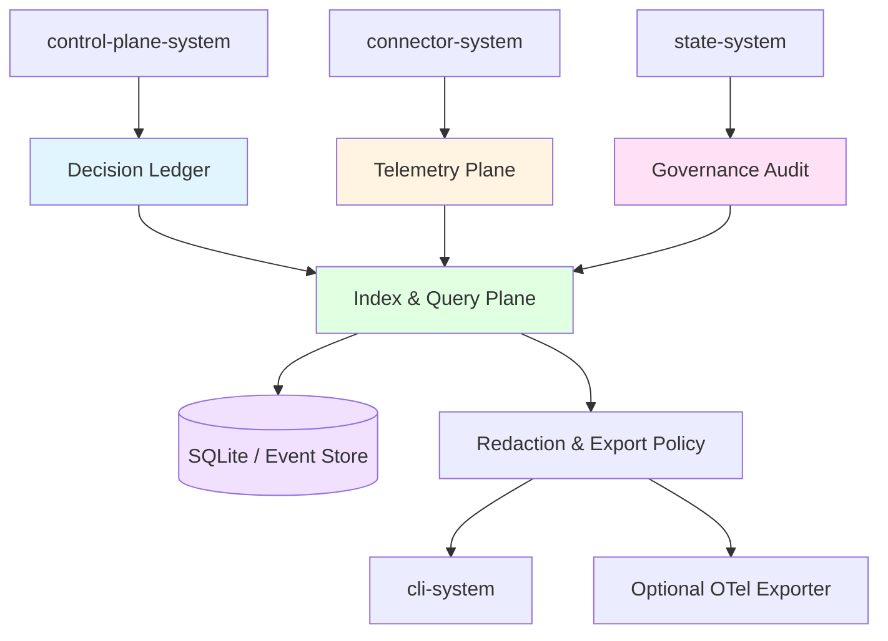
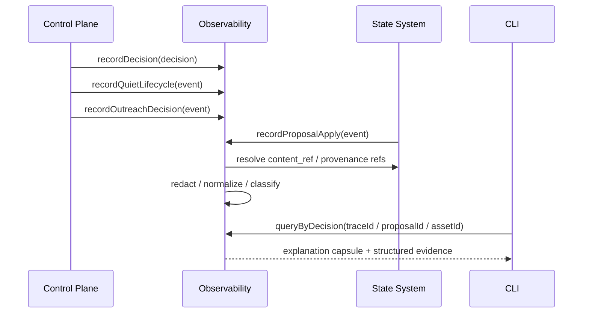
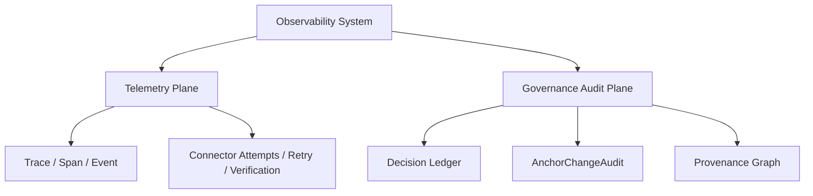
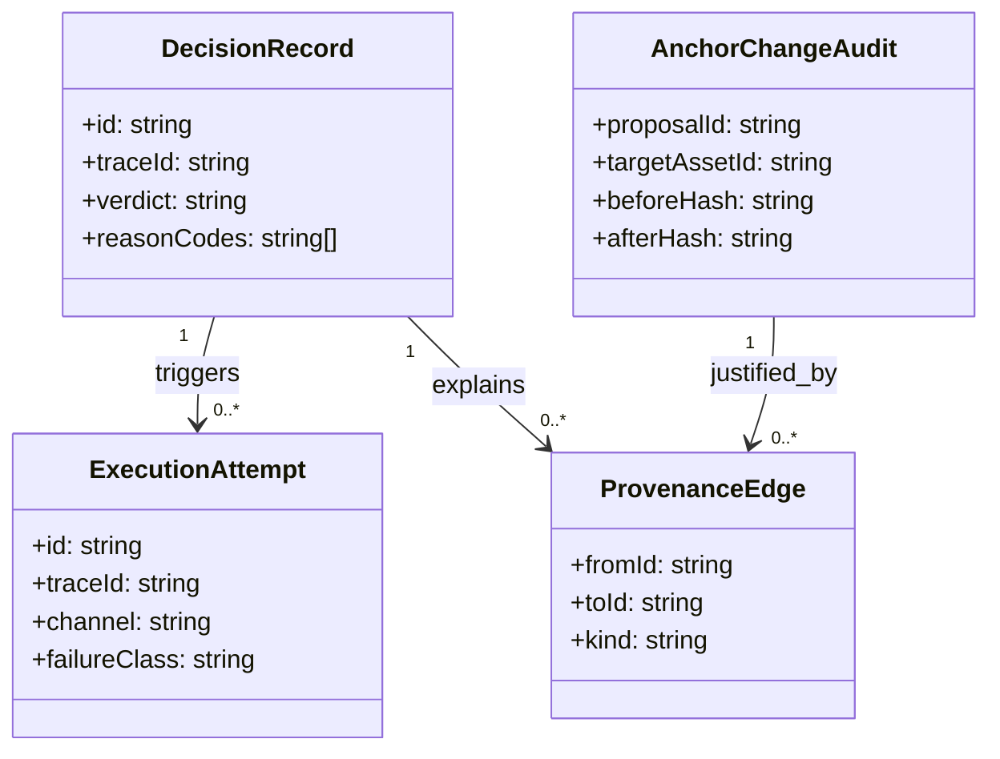

# Observability System 设计文档 (L0 — 导航层)

| 字段          | 值                                                                    |
| ------------- | --------------------------------------------------------------------- |
| **System ID** | `observability-system`                                                |
| **Project**   | Second Nature                                                         |
| **Version**   | 2.0                                                                   |
| **Status**    | `Draft`                                                               |
| **Author**    | OpenCode                                                              |
| **Date**      | 2026-03-23                                                            |
| **L1 Detail** | [observability-system.detail.md](./observability-system.detail.md) — 仅 `/forge` 时加载 |

> [!IMPORTANT]
> **文档分层说明**
> - **本文件 (L0 导航层)**: 架构图、操作契约、设计决策。面向快速理解与任务规划。禁止放配置字典、算法伪代码和方法体。
> - **[observability-system.detail.md](./observability-system.detail.md) (L1 实现层)**: 完整伪代码、配置常量、边缘情况。仅 `/forge` 任务明确引用时加载。
> - **L1 锚点原则 ⚠️**: L1 中的每一节都必须在本文件有对应超链接入口。严禁 L1 出现 L0 完全未提及的“孤岛内容”。

---

## 📋 目录 (Table of Contents)

|   §   | 章节 | 关键内容 |
| :---: | ---- | -------- |
|   1   | [概览](#1-概览-overview) | 系统目的、边界、职责 |
|   2   | [目标与非目标](#2-目标与非目标-goals--non-goals) | Goals / Non-Goals |
|   3   | [背景与上下文](#3-背景与上下文-background--context) | Why、约束、调研结论 |
|   4   | [系统架构](#4-系统架构-architecture) | Mermaid 架构图、组件职责、数据流 |
|   5   | [接口设计](#5-接口设计-interface-design) | 操作契约表、跨系统协议 |
|   6   | [数据模型](#6-数据模型-data-model) | 决策/审计/来源链模型 → [L1 §1-2](./observability-system.detail.md) |
|   7   | [技术选型](#7-技术选型-technology-stack) | 核心技术、关键依赖 |
|   8   | [Trade-offs](#8-trade-offs--alternatives-权衡与备选方案) | ADR 引用 + 本系统特有决策 |
|   9   | [安全性考虑](#9-安全性考虑-security-considerations) | 脱敏、敏感内容治理、审计边界 |
|  10   | [性能考虑](#10-性能考虑-performance-considerations) | 采样、写入、查询与保留 |
|  11   | [测试策略](#11-测试策略-testing-strategy) | 决策回放、redaction、provenance 测试 |
|  12   | [部署与运维](#12-部署与运维-deployment--operations) | local-first 双平面 |
|  13   | [未来考虑](#13-未来考虑-future-considerations) | exporter、schema 演进 |
|  14   | [附录](#14-appendix-附录) | 术语表、研究与参考 |

**L1 实现层** → [observability-system.detail.md](./observability-system.detail.md)（仅 `/forge` 时加载）
> [§1 配置常量](./observability-system.detail.md#1-配置常量-config-constants) · [§2 数据结构](./observability-system.detail.md#2-核心数据结构完整定义-full-data-structures) · [§3 算法](./observability-system.detail.md#3-核心算法伪代码-non-trivial-algorithm-pseudocode) · [§4 决策树](./observability-system.detail.md#4-决策树详细逻辑-decision-tree-details) · [§5 边缘情况](./observability-system.detail.md#5-边缘情况与注意事项-edge-cases--gotchas)

---

## 1. 概览 (Overview)

### 1.1 System Purpose (系统目的)

`observability-system` 是 Second Nature 的**解释与治理证据层**。它不只是记录 agent 做了什么，而是记录：
- 为什么允许某个动作
- 为什么拒绝、延后或升级某个动作
- connector 具体通过哪条通道执行
- 平台凭证处于什么状态、验证流程卡在哪里
- Quiet 为什么被打断、为什么被压制
- Narrative Reflection 为何被提升、为何被拒绝
- `SOUL.md` / Anchor Memory 为什么被改、改了什么、依据是什么

### 1.2 System Boundary (系统边界)

- **输入 (Input)**: control-plane decision records、connector execution events、state-system provenance / proposal / apply 事件、Quiet / outreach lifecycle 事件
- **输出 (Output)**: decision ledger、correlated telemetry、governance audit、provenance query result、redaction manifest
- **依赖系统 (Dependencies)**: `state-system`（持久层与 provenance 资产）、可选 OTel exporter
- **被依赖系统 (Dependents)**: `cli-system`, `control-plane-system`, `state-system`

### 1.3 System Responsibilities (系统职责)

**负责**:
- 维护 `decision ledger + telemetry + governance audit` 三层可观测模型
- 记录 allow / deny / defer / escalate 决策链
- 关联 connector channel、failure taxonomy、retry/backoff、verification recovery
- 审计 state-system proposal/apply、anchor diff、provenance edge
- 审计 credential lifecycle、verification recovery 与 platform activation chain
- 对敏感内容执行结构化 redaction，保留解释性而不泄漏原文

**实现约束**:
- `DecisionRecord`、`ExecutionAttempt`、`AnchorChangeAudit` 等跨系统共享对象必须使用单源共享类型定义，禁止 control-plane、connector、observability 各自维护语义相近但会逐渐漂移的副本 schema
- evidence 查询必须优先依赖索引键与 resolution plan 组装证据，不得把 observability 退化为跨 state / audit / telemetry 的全文盲扫层

**不负责**:
- 不决定业务策略或行为模式（由 `control-plane-system` 负责）
- 不保存 canonical memory 内容正文（由 `state-system` 负责）
- 不强依赖云端 tracing 平台作为唯一真相源

---

## 2. 目标与非目标 (Goals & Non-Goals)

### 2.1 Goals

- **[G1]**: 让每次 allow / deny / defer / escalate 都可追溯
- **[G2]**: 覆盖 connector execution、Quiet lifecycle、Narrative Reflection、outreach、anchor proposal/apply 的领域事件
- **[G3]**: 在不泄漏敏感内容的前提下保留足够解释性
- **[G4]**: 支持通过 decision id、trace id、asset id、proposal id、session id 查询跨系统证据链
- **[G5]**: local-first，审计平面 append-only 且长期保真

### 2.2 Non-Goals

- **[NG1]**: 不优先建设实时监控大屏
- **[NG2]**: 不做复杂机器学习异常检测
- **[NG3]**: 不把 OTel trace backend 当作唯一审计存储
- **[NG4]**: 不在 observability 中保存完整私信、完整帖子正文、完整 reflection 正文或凭据明文

---

## 3. 背景与上下文 (Background & Context)

### 3.1 Why This System? (为什么需要这个系统？)

Second Nature 的卖点不是“会自动跑”，而是“会自动跑，还能说清楚为什么这么跑”。如果 observability-system 只做普通日志：
- 用户无法理解某次动作为什么没发生
- Quiet 为什么被打断无法解释
- `SOUL.md` 为什么被修改无法回溯
- connector 失败究竟是限流、验证、协议漂移还是解析失败也说不清

所以 observability-system 必须承担**信任层**角色，而不只是日志层。

**关联 PRD 需求**: [REQ-004], [REQ-005], [REQ-007], [REQ-008]

### 3.2 Current State (现状分析)

- v1 主要关注 connector 调用、状态流转、LLM 调用与基础指标
- v2 新增 decision-centric observability、proposal/apply 审计、Quiet lifecycle、user outreach consideration 等要求
- 当前的升级关键不是“更多 metrics”，而是“更清晰的证据链”

### 3.3 Constraints (约束条件)

- **技术约束**: TypeScript + Node.js；本地优先；与 state-system 的轻索引和 provenance 模型协作
- **性能约束**: 审计记录不应显著阻塞主流程；查询最近 30 天数据 P95 < 1s
- **资源约束**: 7 天黑客松；首版优先 decision ledger 和 governance audit，不追求全功能 tracing 平台
- **安全约束**: 所有敏感原文默认最小保留，必须显式记录 redaction 过程

### 3.4 调研结论摘要

- 推荐模式是 **decision ledger + correlated telemetry + governance audit**
- deny/defer/escalate 与 allow 一样重要
- OpenTelemetry 适合作为相关性骨架，不适合作为唯一审计源
- 审计与运行日志必须双平面管理
- provenance / proposal / apply / anchor diff 都是本系统一等实体

完整研究见 `._research/observability-system-research.md`。

---

## 4. 系统架构 (Architecture)

### 4.1 Architecture Diagram (架构图)



### 4.2 Core Components (核心组件)

| Component Name | Responsibility | Tech Stack | Notes |
| -------------- | -------------- | ---------- | ----- |
| `DecisionLedger` | 保存高层 allow/deny/defer/escalate 决策账本 | TypeScript | observability 第一优先级 |
| `TelemetryPlane` | 保存 trace/span/event 相关性与 execution attempt | OTel-compatible model | 可导出、可采样 |
| `GovernanceAudit` | 保存 proposal/apply、anchor diff、risk event、quiet lifecycle | TypeScript | append-only、长期保真 |
| `RedactionPolicy` | 执行字段脱敏、内容裁剪、content_ref 替代策略 | TypeScript | 敏感内容治理核心 |
| `QueryEngine` | 按 decision id / trace id / asset id / session id 查询证据链 | SQLite + query layer | 支持 CLI 调阅 |

### 4.3 Data Flow (数据流)



**关键数据流说明**:
1. control-plane 的每次决策必须先落 decision ledger，而不是只在 effect 成功后记日志。
2. connector execution 进入 telemetry plane，用 trace / span / event 表示一次运行链路。
3. state-system proposal / apply / diff 进入 governance audit，形成长期治理证据。
4. CLI 读到的不是原始大段日志，而是 redaction 后的 explanation capsule + structured evidence。

**查询原则**:
- `queryEvidence` 先按 `decision_id`, `trace_id`, `asset_id`, `proposal_id`, `session_id` 缩小范围，再按 resolution plan 组装 evidence bundle
- `content_ref` 的解析应是按需补充，而不是默认展开全部正文；observability 负责解释链，不负责替代 state-system 做原文检索

### 4.4 双平面模型



> **完整事件清单与决策树**: 见 [L1 §4](./observability-system.detail.md#4-决策树详细逻辑-decision-tree-details)

---

## 5. 接口设计 (Interface Design)

### 5.1 操作契约表 (Operation Contracts)

| 操作 | [REQ-XXX] | 前置条件 | 消耗/输入 | 产出/副作用 | 实现细节 |
| ---- | :-------: | -------- | --------- | ----------- | :------: |
| `recordDecision(record)` | [REQ-008] | decision 已形成 | decision payload | 追加 decision ledger | [§3.1](./observability-system.detail.md#31-recorddecision) |
| `recordExecutionAttempt(attempt)` | [REQ-007] | connector attempt 已开始/完成 | channel / attempt / failure info | 追加 telemetry event | [§3.2](./observability-system.detail.md#32-recordexecutionattempt) |
| `recordQuietLifecycle(event)` | [REQ-005] | Quiet 进入/跳过/打断/恢复发生 | quiet lifecycle event | 追加 governance audit | [§3.3](./observability-system.detail.md#33-recordquietlifecycle) |
| `recordOutreachDecision(event)` | [REQ-006] | outreach considered / denied / sent | outreach decision info | 记录 consideration 与 suppression 原因 | [§3.4](./observability-system.detail.md#34-recordoutreachdecision) |
| `recordAnchorChangeAudit(event)` | [REQ-008] | proposal/apply/reject 发生 | proposal/apply/diff refs | 追加 anchor audit | [§3.5](./observability-system.detail.md#35-recordanchorchangeaudit) |
| `recordCredentialLifecycle(event)` | [REQ-008] | register/verify/expire/revoke 发生 | credential status change | 追加 credential audit | [§3.5a](./observability-system.detail.md#35a-recordcredentiallifecycle) |
| `queryEvidence(query)` | [REQ-008] | query 合法 | decision/trace/asset/proposal key | explanation capsule + evidence set | [§3.6](./observability-system.detail.md#36-queryevidence) |
| `redactEvent(event)` | [REQ-008] | event 待持久化 / 导出 | raw event | masked / erased event + manifest | [§3.7](./observability-system.detail.md#37-redactevent) |
| `exportAuditBundle(range)` | [REQ-008] | time range 合法 | export request | redacted audit bundle | [§3.8](./observability-system.detail.md#38-exportauditbundle) |

### 5.2 跨系统接口协议 (Cross-System Interface)

```ts
export interface DecisionAuditPort {
  recordDecision(record: DecisionRecord): Promise<void>;
  queryEvidence(query: EvidenceQuery): Promise<EvidenceBundle>;
}

export interface ExecutionTelemetryPort {
  recordExecutionAttempt(attempt: ExecutionAttempt): Promise<void>;
}

export interface GovernanceAuditPort {
  recordAnchorChangeAudit(event: AnchorChangeAudit): Promise<void>;
  recordCredentialLifecycle(event: CredentialLifecycleAudit): Promise<void>;
  recordQuietLifecycle(event: QuietLifecycleEvent): Promise<void>;
  recordOutreachDecision(event: OutreachDecision): Promise<void>;
}
```

### 5.3 事件类别

| Event Class | 说明 | 优先级 |
| ----------- | ---- | ------ |
| `decision.recorded` | allow/deny/defer/escalate 决策账本 | critical |
| `connector.attempt.*` | connector 执行尝试、重试、失败、恢复 | high |
| `quiet.*` | quiet entered/skipped/interrupted/resumed | high |
| `reflection.*` | reflection started/completed/suppressed/promoted/rejected | high |
| `outreach.*` | outreach considered/denied/deferred/sent | high |
| `anchor.*` | proposal created/applied/rejected/conflicted | critical |
| `credential.*` | registered/pending_verification/active/expired/revoked/failed | critical |
| `redaction.applied` | redaction manifest 记录 | normal |

---

## 6. 数据模型 (Data Model)

### 6.1 核心实体 (Core Entities)

```ts
type DecisionVerdict = 'allow' | 'deny' | 'defer' | 'escalate';

type DecisionRecord = SharedDecisionRecord;

type ExecutionAttempt = SharedExecutionAttempt;

interface ExecutionAttemptProjection {
  id: string;
  traceId: string;
  platformId: string;
  channel: string;
  failureClass?: string;
  commitState?: 'planned' | 'dispatched' | 'externally_acknowledged' | 'committed' | 'reconcile' | 'aborted';
}

type AnchorChangeAudit = SharedAnchorChangeAudit;

interface CredentialLifecycleAudit {
  id: string;
  platformId: string;
  statusFrom?: string;
  statusTo: string;
  verificationDeadline?: string;
  attemptsRemaining?: number;
}

interface ReflectionAudit {
  id: string;
  modelEvalRef?: string;
  claimCount: number;
  unsupportedClaimCount: number;
  sourceCoverageRatio: number;
  reflectionDebt?: number;
  starved?: boolean;
}

interface OutreachQualityAudit {
  id: string;
  valueScore: number;
  noveltyScore: number;
  requiredUserAction: boolean;
  suppressionReason?: string;
}
```

> *(完整字段、redaction manifest、provenance edge 与配置常量详见 [L1 §1-2](./observability-system.detail.md#1-配置常量-config-constants))*

> **shared contract 归属**: `DecisionRecord`, `ExecutionAttempt`, `AnchorChangeAudit` 应来自 `src/shared/types` 的单源定义；本节只允许保留 observability 特有投影字段或审计扩展字段。

> **说明**: `DecisionRecord` 与 `ExecutionAttempt` 的 canonical 字段由 shared contract 定义；observability 在本节仅补充审计扩展投影，如 `ExecutionAttemptProjection`、`CredentialLifecycleAudit`、`ReflectionAudit`、`OutreachQualityAudit`。

### 6.2 实体关系图 (Entity Relationship)



### 6.3 数据流向 (Data Flow Direction)

- decision ledger 与 governance audit 作为 append-only 审计层长期保留。
- telemetry plane 可按策略导出 / 采样，但本地应保留与 decision 关联的关键摘要。
- `content_ref` 指向 state-system 的资产，不在 observability 中重复存正文。

---

## 7. 技术选型 (Technology Stack)

### 7.1 Core Technologies (核心技术)

| Domain | Choice | Rationale |
| ------ | ------ | --------- |
| Local audit store | SQLite / append-only event tables | 适合 local-first 审计与查询 |
| Correlation model | OTel-compatible trace / span / event fields | 适合作为相关性骨架 |
| Redaction | structured field-based redaction | 比正则黑名单更稳 |
| Export | optional OTel / JSON bundle exporter | 可选云端，不强依赖 |

### 7.2 Key Libraries/Dependencies (关键依赖)

- `drizzle-orm`：本地审计表与索引查询
- `zod`：事件与导出 payload 校验
- OpenTelemetry-compatible field model：trace/span/event 相关字段规范

---

## 8. Trade-offs & Alternatives (权衡与备选方案)

### 8.1 主栈与本地优先 - 引用 ADR

> **决策来源**: [ADR-001: 主技术栈与宿主运行时选择](../03_ADR/ADR_001_TECH_STACK.md)
>
> 本系统采用本地优先的 TypeScript + Node.js + SQLite 结构，不在此重复主栈理由。
>
> **本系统特有实现**: 云端 exporter 是可选项，本地审计账本才是真相源。

### 8.2 Quiet / Anchor Memory 审计要求 - 引用 ADR

> **决策来源**: [ADR-003: Second Nature 行为节律、Quiet 与记忆治理原则](../03_ADR/ADR_003_SECOND_NATURE_GOVERNANCE.md)
>
> 本系统负责为 Quiet、Narrative Reflection 与 Anchor Memory 治理提供正式可审计证据。
>
> **本系统特有实现**: `quiet.*`, `reflection.*`, `anchor.*`, `outreach.*` 均是显式事件族，而不是普通字符串日志。

---

### 8.3 decision-centric observability vs execution-log-first

**Option A: decision ledger first (✅ Selected)**
- ✅ **优点**:
  - 能回答“为什么没做”
  - 与 control-plane 的 allow/deny/defer 语义匹配
  - 最符合用户信任需求
- ❌ **缺点**:
  - 需要额外设计 verdict / reason code / explanation 模型

**Option B: 只记执行日志**
- ✅ **优点**:
  - 容易实现
- ❌ **缺点**:
  - 根本无法解释被抑制的动作

**结论**: observability-system 必须以 decision ledger 为中心，不以 connector log 为中心。

### 8.4 单平面日志 vs 双平面观测

**Option A: 双平面（telemetry + governance audit）(✅ Selected)**
- ✅ **优点**:
  - 运行观测与治理证据可分别优化
  - 审计层可长期保真，telemetry 层可灵活导出/采样
- ❌ **缺点**:
  - 模型更复杂

**Option B: 所有东西混在一张日志表**
- ✅ **优点**:
  - 初期简单
- ❌ **缺点**:
  - 运行事件与治理事件互相污染
  - retention / export / redaction 无法分层

**结论**: 运行观测与治理审计必须分层。

### 8.5 保存原文 vs 保存结构化解释

**Option A: 结构化解释 + content_ref (✅ Selected)**
- ✅ **优点**:
  - 既保留解释性，又降低泄漏风险
  - 与 state-system 的 canonical artifact 模型一致
- ❌ **缺点**:
  - 查询时需要二次追踪引用

**Option B: 直接把原文都存进 observability**
- ✅ **优点**:
  - 查询简单
- ❌ **缺点**:
  - 极易成为敏感信息泄漏面

**结论**: observability 不是原文仓库，而是解释层。

### 8.6 结构化决策来源 vs “模型觉得如此”

**Option A: 记录 `decisionBasis + modelEvalRef + evidenceRefs` (✅ Selected)**
- ✅ **优点**:
  - 能区分规则直接决策和模型辅助决策
  - 解释链更稳定
  - 有利于后续测试和回放
- ❌ **缺点**:
  - schema 更复杂

**Option B: 只记录 explanation capsule**
- ✅ **优点**:
  - 写起来简单
- ❌ **缺点**:
  - 无法判断这次决策到底靠规则还是靠模型

**结论**: 所有关键决策必须显式记录 `decisionBasis`，模型辅助时必须记录 `modelEvalRef`。

### 8.8 external effect commit observability

**Option A: committed record + reconcile visibility (✅ Selected)**
- ✅ **优点**:
  - 可以区分“已经外部成功”与“已经 canonical committed”
  - resume/replay 的证据更清楚
- ❌ **缺点**:
  - 需要额外 commit 状态字段

**Option B: 只看 execution attempts**
- ✅ **优点**:
  - 实现简单
- ❌ **缺点**:
  - 无法判断哪个 attempt 才是 canonical 生效动作

**结论**: observability 必须能看见 effect commit protocol 的完整状态。

### 8.7 Narrative Reflection 真实性审计

**Option A: reflection-specific audit fields (✅ Selected)**
- ✅ **优点**:
  - 可验证 Narrative Reflection 的真实性质量
  - 允许回放和验收测试
- ❌ **缺点**:
  - 需要额外记录 claim 统计字段

**Option B: 只记录 modelEvalRef 和 evidenceRefs**
- ✅ **优点**:
  - 实现简单
- ❌ **缺点**:
  - 无法判断 reflection 是否有 unsupported claims

**结论**: observability 必须为 Narrative Reflection 提供专属真实性审计字段。

---

## 9. 安全性考虑 (Security Considerations)

- 所有事件默认最小化，不保存完整私信、完整帖子、完整 prompt、凭据明文
- 使用 `redaction_manifest` 记录哪些字段被 mask / erase / hash
- `content_ref` 替代正文嵌入，必要时通过 state-system 二次追溯
- AnchorChangeAudit 必须记录 hash、diff 摘要和 proposal/apply 关系，而不是直接保存整篇 `SOUL.md`

---

## 10. 性能考虑 (Performance Considerations)

| 指标 | 目标 | 说明 |
|------|------|------|
| decision record 写入 | < 50ms | 审计优先，关键路径可同步 |
| telemetry event 写入 | < 20ms | 可异步缓冲 |
| 最近 30 天证据链查询 | P95 < 1s | 决策 / proposal / asset / trace 查询 |
| 导出审计 bundle | P95 < 3s | 受时间范围影响 |

**优化策略**:
- decision ledger / governance audit 关键事件优先同步落盘
- telemetry plane 可异步缓冲与批量写入
- 高频事件可采样，但 governance audit 事件默认不采样
- 通过索引键：`decision_id`, `trace_id`, `asset_id`, `proposal_id`, `session_id` 支撑高效查询

---

## 11. 测试策略 (Testing Strategy)

| 类型 | 覆盖范围 |
|------|---------|
| 单元测试 | reason code、redaction、failure taxonomy、quiet lifecycle 映射 |
| 集成测试 | decision -> connector attempt -> proposal/apply -> evidence query 全链路 |
| 安全测试 | 敏感内容不落盘、masked/erased manifest 正确 |
| 查询测试 | 按 decision/trace/asset/proposal 查询证据链 |
| 回放测试 | deny / defer / quiet interrupt / anchor reject 场景可回放 |

---

## 12. 部署与运维 (Deployment & Operations)

- local-first，默认随本地系统运行
- exporter 可选，不可作为唯一真相源
- 审计保留策略：治理事件长期保留，telemetry 可按窗口裁剪或导出
- CLI 应支持最常用的查询入口：`why denied`, `why changed`, `what channel`, `what was redacted`

---

## 13. 未来考虑 (Future Considerations)

- 后续可映射到更成熟的 OTel GenAI semantic conventions，但不应现在就硬绑定 vendor-specific schema
- 若后续出现 review UI，可直接消费 decision ledger 与 governance audit
- 若未来引入多 agent，需要扩展 actor / subject / target 维度，但保持 verdict-first 模型不变

---

## 14. Appendix (附录)

### 14.1 术语表
- **Decision Ledger**: 以 allow/deny/defer/escalate 为中心的高层决策账本
- **Governance Audit**: proposal/apply、anchor diff、risk 与 provenance 的治理审计平面
- **Explanation Capsule**: 面向人类的简洁可解释摘要，不包含敏感原文
- **Redaction Manifest**: 描述字段被如何裁剪/脱敏/哈希的结构化说明

### 14.2 参考资料
- `../03_ADR/ADR_001_TECH_STACK.md`
- `../03_ADR/ADR_003_SECOND_NATURE_GOVERNANCE.md`
- `./_research/observability-system-research.md`
