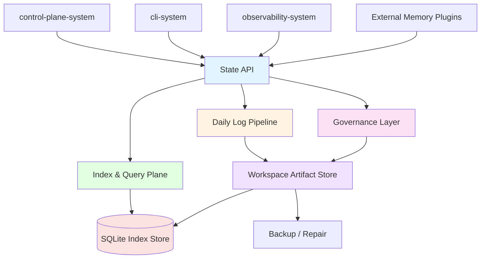
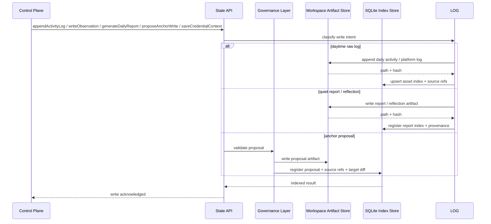
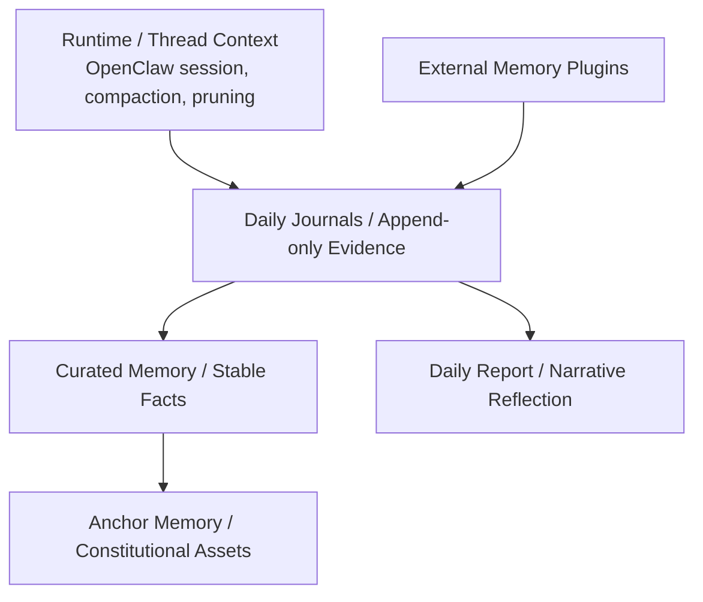
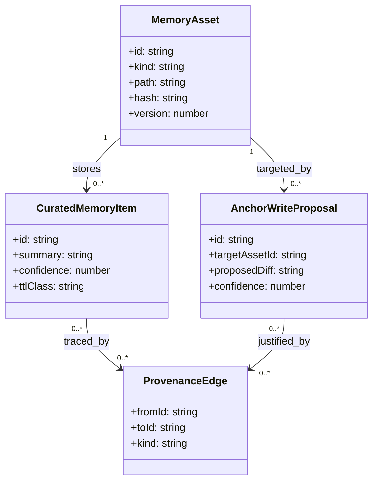

# State System 设计文档 (L0 — 导航层)

| 字段          | 值                                                                    |
| ------------- | --------------------------------------------------------------------- |
| **System ID** | `state-system`                                                        |
| **Project**   | Second Nature                                                         |
| **Version**   | 2.0                                                                   |
| **Status**    | `Draft`                                                               |
| **Author**    | OpenCode                                                              |
| **Date**      | 2026-03-23                                                            |
| **L1 Detail** | [state-system.detail.md](./state-system.detail.md) — 仅 `/forge` 时加载 |

> [!IMPORTANT]
> **文档分层说明**
> - **本文件 (L0 导航层)**: 架构图、操作契约、设计决策。面向快速理解与任务规划。禁止放配置字典、算法伪代码和方法体。
> - **[state-system.detail.md](./state-system.detail.md) (L1 实现层)**: 完整伪代码、配置常量、边缘情况。仅 `/forge` 任务明确引用时加载。
> - **L1 锚点原则 ⚠️**: L1 中的每一节都必须在本文件有对应超链接入口。严禁 L1 出现 L0 完全未提及的“孤岛内容”。

---

## 📋 目录 (Table of Contents)

|   §   | 章节 | 关键内容 |
| :---: | ---- | -------- |
|   1   | [概览](#1-概览-overview) | 系统目的、边界、职责 |
|   2   | [目标与非目标](#2-目标与非目标-goals--non-goals) | Goals / Non-Goals |
|   3   | [背景与上下文](#3-背景与上下文-background--context) | Why、约束、调研结论 |
|   4   | [系统架构](#4-系统架构-architecture) | Mermaid 架构图、组件职责、数据流 |
|   5   | [接口设计](#5-接口设计-interface-design) | 操作契约表、跨系统协议 |
|   6   | [数据模型](#6-数据模型-data-model) | 分层记忆实体、关系与治理 → [L1 §1-2](./state-system.detail.md) |
|   7   | [技术选型](#7-技术选型-technology-stack) | 核心技术、关键依赖 |
|   8   | [Trade-offs](#8-trade-offs--alternatives-权衡与备选方案) | ADR 引用 + 本系统特有决策 |
|   9   | [安全性考虑](#9-安全性考虑-security-considerations) | 身份文件保护、来源链与加密 |
|  10   | [性能考虑](#10-性能考虑-performance-considerations) | 查询、索引、修复策略 |
|  11   | [测试策略](#11-测试策略-testing-strategy) | 单测、迁移、治理测试 |
|  12   | [部署与运维](#12-部署与运维-deployment--operations) | 本地运行、修复与备份 |
|  13   | [未来考虑](#13-未来考虑-future-considerations) | 扩展性、插件接入 |
|  14   | [附录](#14-appendix-附录) | 术语表、研究与参考 |

**L1 实现层** → [state-system.detail.md](./state-system.detail.md)（仅 `/forge` 时加载）
> [§1 配置常量](./state-system.detail.md#1-配置常量-config-constants) · [§2 数据结构](./state-system.detail.md#2-核心数据结构完整定义-full-data-structures) · [§3 算法](./state-system.detail.md#3-核心算法伪代码-non-trivial-algorithm-pseudocode) · [§4 决策树](./state-system.detail.md#4-决策树详细逻辑-decision-tree-details) · [§5 边缘情况](./state-system.detail.md#5-边缘情况与注意事项-edge-cases--gotchas)

---

## 1. 概览 (Overview)

### 1.1 System Purpose (系统目的)

`state-system` 是 Second Nature 的**生活日志与记忆基座**。它的首要职责不是“存更多数据”，而是让 agent 的一天能被合理记录、夜里能被重新阅读、最终能产出人和 agent 都看得懂的连续性资产。

它负责管理：
- OpenClaw workspace-aligned memory assets
- 日间原始日志（看了什么、做了什么、发生了什么）
- Quiet 整理输入与夜间 Narrative Reflection 产物
- 每日 24 小时报告与稳定记忆候选
- 平台凭证、验证状态与恢复上下文
- Anchor Memory proposal/apply 流程
- SQLite 轻索引、查询面与审计元数据

### 1.2 System Boundary (系统边界)

- **输入 (Input)**: 策略写入、Quiet curation 写入、Narrative Reflection proposal、session / platform logs 索引请求、查询请求、governed anchor write apply 请求
- **输出 (Output)**: 状态快照、记忆资产内容、索引结果、provenance trace、write proposals、repair / backup 结果
- **依赖系统 (Dependencies)**: OpenClaw workspace 文件系统、本地 SQLite、文件系统 API
- **被依赖系统 (Dependents)**: `control-plane-system`, `observability-system`, `cli-system`

### 1.3 System Responsibilities (系统职责)

**负责**:
- 管理 OpenClaw workspace-aligned 记忆资产：`SOUL.md`、`USER.md`、`IDENTITY.md`、`MEMORY.md`、`memory/YYYY-MM-DD.md`
- 管理日间原始日志、平台浏览记录、行为痕迹、AI 轻量 observation 与 Quiet 输入材料
- 生成并保存每日 24 小时报告、夜间 Narrative Reflection 与稳定记忆候选
- 保存平台注册凭证、verification challenge、deadline、尝试次数与激活状态
- 提供 memory curation pipeline 所需的读取、索引、去重、合并与写入治理接口
- 使用 SQLite 作为轻索引 / 治理状态 / provenance plane，使用文件系统作为 canonical artifact plane
- 记录 Anchor Memory proposal、apply、diff 与来源链

**不负责**:
- 不决定何时进入 Quiet、何时反思、何时联系用户（由 `control-plane-system` 负责）
- 不直接执行平台动作或外部副作用（由 `connector-system` 负责）
- 不独立充当审计解释层（由 `observability-system` 负责）
- 不替代 OpenClaw 的 session compaction / pruning 逻辑

---

## 2. 目标与非目标 (Goals & Non-Goals)

### 2.1 Goals

- **[G1]**: 用 **filesystem + SQLite hybrid** 方式管理记忆真相源与轻索引面，文件存内容，SQLite 存路径、状态、关系与来源链
- **[G2]**: 建立明确的日间记录机制：平台浏览、交互、任务、失败与 observation 自动进入当日日志
- **[G3]**: 建立明确的 Quiet 整理机制：读取当天/近期日志，产出夜间 Narrative Reflection 与每日 24 小时报告
- **[G4]**: 所有 Anchor Memory 写入都必须通过 `proposal -> apply` 治理路径，并记录 diff
- **[G5]**: 平台凭证与验证状态可恢复，connector 不保存 canonical credential
- **[G6]**: 本地查询与索引读取 P95 < 100ms；关键资产修复可在启动时自动完成

### 2.2 Non-Goals

- **[NG1]**: 不把完整聊天历史直接当长期记忆真相源
- **[NG2]**: 不把外部 memory 插件作为 canonical self memory store
- **[NG3]**: 不允许普通 reflection 直接覆盖 `SOUL.md` / `AGENTS.md`
- **[NG4]**: 不把 compaction/pruning 结果直接等同于长期记忆沉淀

---

## 3. 背景与上下文 (Background & Context)

### 3.1 Why This System? (为什么需要这个系统？)

Second Nature 的核心不是“记得更多”，而是“知道什么该保真、什么该提炼、什么只能提议、什么必须慎改”。如果 state-system 只是一个长记忆表：
- Quiet 会没有真正的落点
- Anchor Memory 会缺少治理边界
- OpenClaw workspace files 会沦为孤岛
- compaction / curation / reflection / plugin input 会混成一团

所以 state-system 必须成为连续性资产的正式管理者。

**关联 PRD 需求**: [REQ-001], [REQ-002], [REQ-005], [REQ-006], [REQ-008]

### 3.2 Current State (现状分析)

- v1 的 state-system 更像“SQLite + 凭据加密 + 会话表 + 长期记忆表”
- v2 新增了 Quiet、Narrative Reflection、Anchor Memory guard、workspace-aligned memory 等概念
- 当前最大的升级需求，不是再加几张表，而是把记忆资产改造成**分层治理模型 + 日志驱动的生活机制**
- 首版真正重要的产出不是“复杂 memory DB”，而是：
  - 当天看了什么、做了什么的可读日志
  - Quiet 对这些日志的整理结果
  - 每天一份 24 小时报告

### 3.3 Constraints (约束条件)

- **技术约束**: 主栈 TypeScript + Node.js + SQLite；必须与 OpenClaw workspace files 语义兼容
- **凭证约束**: 平台密钥与 verification context 只能进入受保护结构化存储，不能写入 md/report/log 正文
- **性能约束**: 查询与索引读取 P95 < 100ms；文件落盘与索引更新必须具备补偿式恢复能力
- **资源约束**: 7 天黑客松；单用户、单 agent、本地优先
- **安全约束**: 平台凭据必须加密；Anchor Memory 默认只读；所有 proposal / apply 都必须有 provenance

### 3.4 调研结论摘要

- 推荐模式是 **4 层记忆 + 2 条写入路径 + 1 条审计链**
- 文件系统应作为 canonical artifact plane，SQLite 作为轻索引 / query / governance plane
- Anchor / constitutional memory 必须默认只读，只能通过 proposal/apply 流程更新
- external memory plugins 只能做输入源和检索增强，不能做主存
- Narrative Reflection 应是稀疏提炼器，而不是膨胀式“再写一份总结”
- `quiet` 与 `日间记录` 暂不拆成独立系统，更适合作为 `control-plane-system + state-system` 的协作机制

完整研究见 `._research/state-system-research.md`。

---

## 4. 系统架构 (Architecture)

### 4.1 Architecture Diagram (架构图)



### 4.2 Core Components (核心组件)

| Component Name | Responsibility | Tech Stack | Notes |
| -------------- | -------------- | ---------- | ----- |
| `StateAPI` | 统一读写入口，区分 journals / reports / curated / anchor proposal / apply | TypeScript | 不暴露泛化 `saveMemory()` |
| `DailyLogPipeline` | 组织日间日志、平台 observation、行为事件与 AI 轻量记录 | TypeScript | 白天低加工、高保真 |
| `WorkspaceArtifactStore` | 管理文件型记忆资产与原子落盘 | FS API | 文件是真相源 |
| `IndexStore` | 保存 SQLite 轻索引、查询面、反向引用、治理状态 | SQLite + Drizzle | 不存正文主内容 |
| `CredentialVault` | 保存平台凭证、verification challenge、deadline、状态 | SQLite + encryption | connector 只读取 context |
| `GovernanceLayer` | proposal/apply、Anchor guard、fact trace、diff 记录 | TypeScript | 记忆治理核心 |
| `PluginIngress` | 处理 mem0 等外部记忆插件输入映射 | TypeScript | 仅输入，不直接写 anchor |
| `RepairAndBackup` | 启动扫描、hash 校验、orphan repair、导出备份 | TypeScript | 保证本地一致性 |

### 4.3 Data Flow (数据流)



**关键数据流说明**:
1. 日间平台浏览、交互、失败、任务与 observation 优先进入 append-only 日志，而不是先做重加工。
2. Quiet 会读取当天/近期日志，并产出 `reflection.md`、`report.md` 以及少量 curated candidates。
3. SQLite 仅记录 `asset_id`, `path`, `hash`, `kind`, `version`, `status`, `last_indexed_at` 等元数据，支持 repair、查询与治理。
4. Anchor Memory 的普通反思写入不会直接生效，只会变成 proposal，并记录 diff。
5. external memory plugins 进入 journal/candidate/import path，不可直接写 identity files。

### 4.6 平台凭证与验证状态

- 凭证 canonical store 属于 `state-system`，而不是 `connector-system` 或 `observability-system`。
- canonical credential lifecycle state 统一为：`missing`、`pending_verification`、`active`、`expired`、`revoked`、`failed`。
- `verification_required` 属于 connector failure taxonomy，不是 canonical credential state；`challenged` 属于 verification challenge 阶段标签，不单独作为 lifecycle state。
- 以 InStreet 为例，注册后应保存：
  - `api_key`（加密）
  - `verification_code`
  - `challenge_text`（可选裁剪保存）
  - `expires_at`
  - `attempts_remaining`
- connector 只通过 `CredentialContext` 读取，不得持久化平台密钥真相源。

### 4.4 记忆分层模型与产出机制



> **完整分层与写入决策树**: 见 [L1 §4](./state-system.detail.md#4-决策树详细逻辑-decision-tree-details)

### 4.5 为什么暂不拆成新系统

- `quiet` 是高层行为模式，仍应由 `control-plane-system` 决定何时进入、何时退出、何时打断。
- `日间记录` 是状态与记忆资产的写入机制，仍应属于 `state-system` 的数据与资产职责。
- 现阶段把它们拆成独立系统，只会制造额外接口、重复治理和更多偶然复杂度。
- 结论：
  - `quiet` = `control-plane-system` 的编排机制
  - `日间记录 / 夜间报告 / Anchor diff 治理` = `state-system` 的资产机制

---

## 5. 接口设计 (Interface Design)

### 5.1 操作契约表 (Operation Contracts)

| 操作 | [REQ-XXX] | 前置条件 | 消耗/输入 | 产出/副作用 | 实现细节 |
| ---- | :-------: | -------- | --------- | ----------- | :------: |
| `appendActivityLog(entry)` | [REQ-005] | entry 有来源；时间戳有效 | activity / browse / action record | 追加 daily activity log；更新轻索引 | [§3.1](./state-system.detail.md#31-appendactivitylog) |
| `appendObservation(entry)` | [REQ-005] | 来源可追踪；非最终结论 | AI 轻量 observation | 追加 observation log | [§3.2](./state-system.detail.md#32-appendobservation) |
| `generateDailyReport(input)` | [REQ-005] | 存在当日日志或 reflection 输入 | day slice | 生成 `report.md` / `reflection.md` | [§3.3](./state-system.detail.md#33-generatedailyreport) |
| `upsertCuratedMemory(candidate)` | [REQ-005] | dedupe 已完成；非 anchor | curated candidate | 生成 / 更新 curated memory item | [§3.4](./state-system.detail.md#34-upsertcuratedmemory) |
| `proposeAnchorWrite(proposal)` | [REQ-008] | target 是 anchor asset；有 fact trace | proposed diff | 写 proposal artifact；记录 diff；状态初始为 `draft/requires_review` | [§3.5](./state-system.detail.md#35-proposeanchorwrite) |
| `applyGovernedAnchorWrite(proposalId)` | [REQ-008] | proposal = `approved` 且 `beforeHash == currentHash` | proposal id | 原子更新目标文件；记录 apply log | [§3.6](./state-system.detail.md#36-applygovernedanchorwrite) |
| `loadQuietInputs(query)` | [REQ-005] | query 合法 | date range / asset filters | Quiet 输入 bundle | [§3.7](./state-system.detail.md#37-loadquietinputs) |
| `importExternalMemory(observation)` | [REQ-006] | plugin source trusted enough for ingest | external memory record | 转换为 candidate observation / journal item | [§3.8](./state-system.detail.md#38-importexternalmemory) |
| `explainProvenance(assetId)` | [REQ-008] | asset exists | asset id | 返回来源链、proposal/apply 记录 | [§3.9](./state-system.detail.md#39-explainprovenance) |
| `repairIndexes()` | [REQ-008] | startup / manual repair | current asset scan | 修复 orphan index / stale hash | [§3.10](./state-system.detail.md#310-repairindexes) |

### 5.2 跨系统接口协议 (Cross-System Interface)

```ts
export interface MemoryReadPort {
  loadQuietInputs(query: CurationInputQuery): Promise<CurationInputBundle>;
  loadAnchorMemory(): Promise<AnchorAssetBundle>;
  explainProvenance(assetId: string): Promise<ProvenanceTrace>;
  loadCredentialContext(platformId: string): Promise<CredentialContext>;
  loadPolicy(platformId: string): Promise<PlatformPolicyRecord | null>;
  loadIntentCommitRecord(intentId: string): Promise<IntentCommitRecord | null>;
}

export interface MemoryWritePort {
  appendActivityLog(entry: ActivityLogWrite): Promise<AssetWriteAck>;
  appendObservation(entry: ObservationWrite): Promise<AssetWriteAck>;
  generateDailyReport(input: DailyReportInput): Promise<AssetWriteAck>;
  upsertCuratedMemory(item: CuratedMemoryWrite): Promise<AssetWriteAck>;
  proposeAnchorWrite(proposal: AnchorWriteProposal): Promise<ProposalAck>;
  applyGovernedAnchorWrite(proposalId: string): Promise<ApplyAck>;
  saveCredentialContext(input: CredentialContextWrite): Promise<void>;
  savePolicy(input: PolicyWriteInput): Promise<void>;
}

export interface EffectCommitStorePort {
  createIntentCommitRecord(input: IntentCommitRecordInput): Promise<IntentCommitRecord>;
  advanceIntentCommitState(id: string, state: IntentCommitState, metadata?: Record<string, unknown>): Promise<void>;
  commitIntentOutcome(id: string, outcome: IntentCommitOutcome): Promise<void>;
  loadIntentCommitRecord(intentId: string): Promise<IntentCommitRecord | null>;
  abortIntentCommit(id: string, reason: string): Promise<void>;
  markIntentCommitReconcile(id: string, details: Record<string, unknown>): Promise<void>;
}

export interface PluginIngressPort {
  importExternalMemory(observation: ExternalMemoryObservation): Promise<IngestAck>;
}
```

### 5.3 资产类别

| Asset Kind | Canonical Plane | 默认写入方式 | 说明 |
| ---------- | --------------- | ------------ | ---- |
| `daily_journal` | filesystem | append | 当天行为与浏览证据流 |
| `daily_report` | filesystem | overwrite-per-day | 当天 24 小时报告与 Quiet Reflection |
| `curated_memory` | filesystem + sqlite index | upsert | 稳定事实与长期线索 |
| `anchor_memory` | filesystem | proposal/apply | `SOUL.md`, `USER.md`, `IDENTITY.md`, `MEMORY.md` |
| `proposal` | filesystem + sqlite index | create | 受治理的候选改动 |
| `provenance_record` | sqlite | append | 来源链与审计关系 |
| `credential_record` | sqlite | upsert | 加密凭证、verification 状态与恢复上下文 |
| `policy_record` | sqlite | upsert | 平台策略与 Quiet 开关等 canonical 配置状态 |
| `intent_commit_record` | sqlite | create / advance / commit / reconcile | 外部副作用 durable protocol 的 canonical 账本 |

---

## 6. 数据模型 (Data Model)

### 6.1 核心实体 (Core Entities)

```ts
type MemoryLayer = 'runtime_context' | 'daily_journal' | 'curated_memory' | 'anchor_memory';

interface MemoryAsset {
  id: string;
  kind: 'daily_journal' | 'daily_report' | 'curated_memory' | 'anchor_memory' | 'proposal';
  path: string;
  hash: string;
  version: number;
  layer: MemoryLayer;
}

interface DailyReportArtifact {
  id: string;
  day: string;
  summary: string;
  highlights: string[];
  sourceRefs: string[];
}

interface CuratedMemoryItem {
  id: string;
  title: string;
  summary: string;
  confidence: number;
  ttlClass: 'short' | 'medium' | 'long';
  sourceRefs: string[];
}

interface AnchorWriteProposal {
  id: string;
  targetAssetId: string;
  beforeHash?: string;
  afterHash?: string;
  status: 'draft' | 'requires_review' | 'approved' | 'rejected' | 'applied' | 'conflicted';
  proposedDiff: string;
  reason: string;
  supportingSources: string[];
  confidence: number;
}

interface CredentialContext {
  platformId: string;
  status: 'missing' | 'pending_verification' | 'active' | 'expired' | 'revoked' | 'failed';
  credentialType: 'api_key' | 'oauth_token' | 'node_secret' | 'verification_code';
  verificationDeadline?: string;
  attemptsRemaining?: number;
}

interface PolicyWriteInput {
  platformId: string;
  socialDailyLimit: number;
  quietEnabled: boolean;
}

interface PlatformPolicyRecord {
  platformId: string;
  socialDailyLimit: number;
  quietEnabled: boolean;
  updatedAt: string;
}

type IntentCommitState = 'planned' | 'dispatched' | 'externally_acknowledged' | 'committed' | 'reconcile' | 'aborted';

interface IntentCommitRecord {
  id: string;
  intentId: string;
  decisionId: string;
  checkpointId?: string;
  state: IntentCommitState;
  outcomeRef?: string;
  metadata?: Record<string, unknown>;
  updatedAt: string;
}
```

> *(完整字段、方法签名与配置常量详见 [L1 §1-2](./state-system.detail.md#1-配置常量-config-constants))*

### 6.2 实体关系图 (Entity Relationship)



### 6.3 数据流向 (Data Flow Direction)

- 文件系统保存 canonical artifacts 和 proposal files。
- SQLite 保存 `asset registry`、`provenance graph`、`index`、`repair metadata`、`audit relations` 与 `intent commit records`。
- 平台策略属于 `state-system` 的 canonical state，默认进入 SQLite `policy_record` 平面；`cli-system` 与其他调用方只能通过公开 `savePolicy/loadPolicy` port 读写，不得各自维护私有 policy 真相源。
- `observability-system` 可通过 `asset_id` 和 `proposal_id` 反查写入链。
- `state-system` 是 effect commit protocol 的 canonical owner；control-plane 和 connector 只能通过公开 port 读写，不得各自维护私有提交账本。

---

## 7. 技术选型 (Technology Stack)

### 7.1 Core Technologies (核心技术)

| Domain | Choice | Rationale |
| ------ | ------ | --------- |
| Structured storage | SQLite + Drizzle | 适合本地轻索引、事务、修复、检索元数据，不作为正文主存 |
| Canonical artifacts | Markdown / JSONL files | 便于人工审阅、git 备份、低锁定耦合，是内容真相源 |
| File write pattern | temp file + atomic rename | 保证文件落盘一致性 |
| DB mode | SQLite WAL | 适合本地读写并发与快速恢复 |
| Search / lookup | SQLite indices + lightweight text search | 首版足够，无需引入外部搜索引擎 |

### 7.2 Key Libraries/Dependencies (关键依赖)

- `drizzle-orm`: SQLite schema 与查询层
- `better-sqlite3` 或等价稳定驱动：本地 SQLite 操作
- `zod`: proposal / provenance / asset metadata 验证
- `fs/promises`: canonical artifact 写入与 repair

---

## 8. Trade-offs & Alternatives (权衡与备选方案)

### 8.1 主栈与宿主边界 - 引用 ADR

> **决策来源**: [ADR-001: 主技术栈与宿主运行时选择](../03_ADR/ADR_001_TECH_STACK.md)
>
> 本系统采用 TypeScript + Node.js + SQLite，并运行在 OpenClaw native plugin 语义下，不在此重复主栈选择理由。
>
> **本系统特有实现**: 文件系统作为 canonical artifact plane，SQLite 作为轻索引与治理状态平面。

### 8.2 Quiet / Anchor Memory 治理 - 引用 ADR

> **决策来源**: [ADR-003: Second Nature 行为节律、Quiet 与记忆治理原则](../03_ADR/ADR_003_SECOND_NATURE_GOVERNANCE.md)
>
> 本系统实现 ADR-003 中定义的 workspace-aligned memory、Anchor Memory guard 与 Narrative Reflection 写入边界。
>
> **本系统特有实现**: Anchor files 默认只读，普通 reflection 只能生成 proposal。

---

### 8.3 filesystem + SQLite hybrid vs 全 SQLite

**Option A: filesystem + SQLite hybrid (✅ Selected)**
- ✅ **优点**:
  - 人可读资产与结构化检索兼得
  - 更贴合 OpenClaw workspace memory 语义
  - 文件可直接备份、审阅、版本化
- ❌ **缺点**:
  - 需要处理文件与索引的一致性补偿

**Option B: 全 SQLite 存储**
- ✅ **优点**:
  - 事务一致性单点更强
- ❌ **缺点**:
  - 不适合承担 `SOUL.md` / `USER.md` / `IDENTITY.md` 这类人可读资产
  - 与 OpenClaw workspace memory 语义割裂

**结论**: 对 Second Nature 而言，文件是真相源，SQLite 是管理面，不反过来。

### 8.4 是否需要把 Quiet / 日间记录拆成新系统

**Option A: 保持为机制，不拆新系统 (✅ Selected)**
- ✅ **优点**:
  - 避免把行为编排和记忆资产切成更多边界
  - `quiet` 仍由 control-plane 决定，`日间记录` 仍由 state-system 落盘，职责清楚
  - 首版更利于快速落地
- ❌ **缺点**:
  - `state-system` 设计必须更强调机制，而不能只讲存储

**Option B: 拆出 Quiet System / Logging System**
- ✅ **优点**:
  - 名义上更“模块化”
- ❌ **缺点**:
  - 会制造额外接口、重复治理、更多偶然复杂度
  - 当前规模完全不值当

**结论**: 现阶段不拆新系统，按“control-plane 编排 + state-system 落盘/治理”的协作机制实现。

### 8.5 普通写入 vs proposal/apply 治理

**Option A: proposal/apply split (✅ Selected)**
- ✅ **优点**:
  - 保护 Anchor Memory 不被热路径直接覆盖
  - 审计、diff、回滚和 review 语义清楚
- ❌ **缺点**:
  - 实现路径更长

**Option B: reflection 直接写 anchor files**
- ✅ **优点**:
  - 实现最省事
- ❌ **缺点**:
  - 极易人格漂移
  - 无法解释“为什么这次改了灵魂文件”

**结论**: Anchor Memory 只能受控演进，不能自由重写；`apply` 必须依赖显式审批状态与 compare-before-write 冲突检测。

### 8.6 external memory plugin 角色

**Option A: 输入源 / augmentation (✅ Selected)**
- ✅ **优点**:
  - 可吸收 mem0 等系统的检索与压缩价值
  - 保持本地 canonical memory 主权
- ❌ **缺点**:
  - 需要本地 ingest / mapping 逻辑

**Option B: canonical memory store**
- ✅ **优点**:
  - 接入快
- ❌ **缺点**:
  - 主记忆依赖第三方 schema 与 merge 语义
  - 不利于审计与离线 continuity

**结论**: external plugin 只能做候选事实流，不能做身份真相层。

### 8.7 凭证留在 connector vs canonical store 留在 state

**Option A: canonical credential store in state-system (✅ Selected)**
- ✅ **优点**:
  - connector 可保持无状态或轻状态
  - verification recovery 与审计链统一
  - 平台注册/激活流程可跨会话恢复
- ❌ **缺点**:
  - 需要 state-system 维护加密与状态机

**Option B: 每个 connector 自己保管凭证**
- ✅ **优点**:
  - 看似封装性强
- ❌ **缺点**:
  - 凭证与 verification 状态容易碎片化
  - observability 难以统一审计

**结论**: connector 只消费 credential context，canonical credential store 必须在 state-system。

---

## 9. 安全性考虑 (Security Considerations)

- 平台凭据与敏感配置继续使用加密存储，不得进入记忆资产明文内容
- `SOUL.md` 等核心文件每次 apply 后都必须记录 before/after hash 与 diff 摘要
- `SOUL.md`, `AGENTS.md` 等 Anchor Memory 默认只读，不允许普通流程直接覆盖
- 所有 proposal/apply 都必须记录 `supporting_sources`、`confidence`、`policy_basis`、`risk_flags`
- provenance chain 必须可反查到 journal entry / connector event / reflection run
- 文件写入采用原子落盘，避免写半截造成资产损坏

---

## 10. 性能考虑 (Performance Considerations)

| 指标 | 目标 | 说明 |
|------|------|------|
| 单条索引查询 | < 10ms | SQLite index 命中 |
| 复合检索 | P95 < 100ms | 通过 asset registry + provenance joins |
| 单次日志追加 | < 50ms | 文件追加 + 轻索引更新 |
| 每日报告生成后的落盘 | < 100ms | 文件写入 + provenance 登记 |
| repair scan 启动耗时 | P95 < 1s | 单用户本地 workspace 规模 |

**优化策略**:
- canonical artifact 先落盘，再异步补充非关键派生索引
- SQLite 开启 WAL，并控制 checkpoint 策略
- 对大文件 journal 采用按日切片与增量索引
- Narrative Reflection 只读取需要的 slice，不扫描所有历史资产

---

## 11. 测试策略 (Testing Strategy)

| 类型 | 覆盖范围 |
|------|---------|
| 单元测试 | 写入触发规则、proposal validation、anchor guard、dedupe / merge 规则 |
| 集成测试 | activity log -> report -> proposal -> apply -> provenance 全链路 |
| 文件一致性测试 | 原子落盘、损坏恢复、orphan repair |
| 迁移测试 | SQLite schema migration、asset metadata version 兼容 |
| 治理测试 | 普通 reflection 不得直接写 anchor；proposal 需带 fact trace；soul diff 必须落审计 |

---

## 12. 部署与运维 (Deployment & Operations)

- 默认随本地 OpenClaw workspace 一起运行
- 启动时执行：asset scan、hash 验证、orphan index repair、stale proposal cleanup
- 备份策略：优先导出 workspace artifacts + SQLite backup；不直接粗暴拷贝活跃数据库文件
- 运维目标：即便 SQLite 索引损坏，也能从 canonical artifacts 重建主要索引面
- 首版产出目标：保证每天至少能稳定生成一份 `report.md` 或 `reflection.md`

---

## 13. 未来考虑 (Future Considerations)

- 可在后续加入更强的全文索引或 embeddings，但必须仍以 canonical artifact + provenance 为主
- 若 external memory plugin 数量增加，可把 `PluginIngress` 单独演化为 importer 子模块
- 若 Anchor proposal 审核复杂度上升，可加入 owner-assisted review UI，但不应改变“proposal/apply 分离”原则

---

## 14. Appendix (附录)

### 14.1 术语表
- **Memory Substrate**: 支撑连续性资产、日志、索引、治理与恢复的底层记忆基底，而不是单一数据库表
- **Canonical Artifact**: 在文件系统中作为真相源存在的人可读记忆资产
- **Daily Report**: 对过去 24 小时行为、浏览、思考与 Quiet 整理结果的汇总产物
- **Proposal**: 对 Anchor Memory 的候选修改，不代表已生效
- **Provenance Trace**: 从某条记忆或改动反查其来源证据链的能力

### 14.2 参考资料
- `../03_ADR/ADR_001_TECH_STACK.md`
- `../03_ADR/ADR_003_SECOND_NATURE_GOVERNANCE.md`
- `./_research/state-system-research.md`
