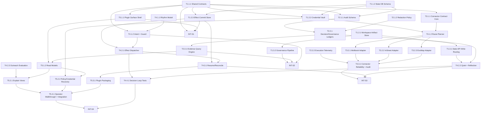

# Second Nature v2 任务清单 (Blueprint)

**项目**: Second Nature  
**版本**: `.anws/v2`  
**阶段**: Blueprint  
**生成日期**: 2026-03-24  
**来源**: `01_PRD.md`, `02_ARCHITECTURE_OVERVIEW.md`, `03_ADR/`, `04_SYSTEM_DESIGN/`

---

## 🔗 依赖图总览

---

## 📊 Sprint 路线图

| Sprint | 代号 | 核心任务 | 退出标准 | 预估 |
|--------|------|---------|---------|------|
| S1 | Substrate | shared contracts + state schema + plugin shell + audit substrate | plugin 可加载；SQLite schema 可启动；shared contracts 可被所有系统引用 | 1.5-2d |
| S2 | Decision Spine | state API + governance + decision ledger + rhythm/guard | 一次 synthetic tick 可形成 allow/deny decision，并能产出 evidence query 与 anchor proposal | 1.5-2d |
| S3 | World Contact | connectors + effect dispatcher + quiet/reflection + resume | 至少 1 条 connector 主路径和 1 条 Quiet 主路径可运行，且无重复外部副作用 | 2-3d |
| S4 | Operator Voice | outreach + explain + recovery UX + packaging + final integration | 完整演示链路可跑通：配置 -> 自主行为 -> Quiet 反思 -> explain -> plugin 安装/加载 | 2-2.5d |

---

## System 1: State & Shared Contract System

### Phase 1: Foundation (共享契约与状态底座)

- [x] **T1.1.1** [REQ-008]: 建立 shared continuity contracts
  - **描述**: 在 `src/shared/types/` 中定义跨系统单源契约，统一 `DecisionRecord`、`ExecutionAttempt`、`AnchorChangeAudit`、`IntentCommitRecord`、`CredentialState`、`OutreachEvaluationInput/Result`。
  - **输入**: `02_ARCHITECTURE_OVERVIEW.md` §7 共享契约如何处理；`04_SYSTEM_DESIGN/control-plane-system.md` §6.1；`04_SYSTEM_DESIGN/observability-system.md` §6.1；`04_SYSTEM_DESIGN/state-system.md` §6.1
  - **输出**: `src/shared/types/continuity.ts`, `src/shared/types/credential.ts`, `src/shared/types/outreach.ts`
  - **📎 参考**: `ADR_001_TECH_STACK.md`, `07_CHALLENGE_REPORT.md` §R4-C1
  - **验收标准**:
    - Given 最新 system design 已声明 shared contracts 单源归属
    - When 实现 shared type 模块并让各系统改为导入该模块
    - Then 不再需要在系统内维护同名核心契约真定义
  - **验证类型**: 编译检查
  - **验证说明**: 运行类型检查，确认共享契约可被 state/control-plane/observability/cli 导入且无重复导出冲突
  - **估时**: 3h
  - **依赖**: 无
  - **优先级**: P0

- [x] **T1.1.2** [REQ-008]: 创建 state-system SQLite schema 与 repository 骨架
  - **描述**: 为 asset registry、credential records、proposal records、provenance edges、intent commit records 建立 Drizzle schema 与仓储层骨架。
  - **输入**: `04_SYSTEM_DESIGN/state-system.md` §4.2；`04_SYSTEM_DESIGN/state-system.md` §5.3；`04_SYSTEM_DESIGN/state-system.md` §6.1；`ADR_001_TECH_STACK.md`
  - **输出**: `src/storage/db/schema/*.ts`, `src/storage/repositories/*.ts`, `src/storage/db/index.ts`
  - **📎 参考**: `ADR_001_TECH_STACK.md`, `04_SYSTEM_DESIGN/state-system.md` §8.3
  - **验收标准**:
    - Given state-system 需要 SQLite 作为治理与索引平面
    - When 建立 schema 与基础 repository
    - Then 所有核心表结构都可被状态层与审计层稳定引用
  - **验证类型**: 编译检查
  - **验证说明**: 运行 migration/类型生成流程，确认 schema 可初始化且 repository 编译通过
  - **估时**: 4h
  - **依赖**: T1.1.1
  - **优先级**: P0

### Phase 2: Memory & Governance Core (记忆与治理核心)

- [x] **T1.2.1** [REQ-005]: 实现 workspace artifact store 与 canonical 路径布局
  - **描述**: 实现 `workspace/` 下 journals、reports、curated、proposals、anchor assets 的路径解析、原子写入与 hash 计算。
  - **输入**: `04_SYSTEM_DESIGN/state-system.md` §4.1；`04_SYSTEM_DESIGN/state-system.md` §4.4；`04_SYSTEM_DESIGN/state-system.md` §7.1；T1.1.2 产出的 schema 约束
  - **输出**: `src/storage/memory/workspace/*.ts`, `src/storage/memory/journals/*.ts`, `src/storage/memory/paths.ts`
  - **📎 参考**: `ADR_003_SECOND_NATURE_GOVERNANCE.md` §4-5, `04_SYSTEM_DESIGN/state-system.md` §8.3
  - **验收标准**:
    - Given state-system 以文件系统为 canonical artifact plane
    - When 写入 journal/report/proposal/anchor 资产
    - Then 文件路径、原子写入与 hash 更新符合设计约束
  - **验证类型**: 集成测试
  - **验证说明**: 运行文件写入测试，确认不同资产写入到预期目录且 hash/版本信息可回流到索引层
  - **估时**: 4h
  - **依赖**: T1.1.2
  - **优先级**: P0

- [x] **T1.2.2** [REQ-008]: 实现 CredentialVault 与 canonical lifecycle state 持久化
  - **描述**: 实现凭证加密存储、`pending_verification`/`active` 等 canonical 状态管理，以及 challenge context 读取接口。
  - **输入**: `04_SYSTEM_DESIGN/state-system.md` §4.6；`04_SYSTEM_DESIGN/state-system.md` §5.2；`04_SYSTEM_DESIGN/state-system.md` §6.1；`01_PRD.md` §6.2；T1.1.1 产出的 `CredentialState`
  - **输出**: `src/storage/repositories/credential-repository.ts`, `src/storage/services/credential-vault.ts`
  - **📎 参考**: `ADR_002_CONNECTOR_MODEL.md` §90-95, `07_CHALLENGE_REPORT.md` §R4-H2
  - **验收标准**:
    - Given connector 不得持有 canonical credential store
    - When 保存和读取 credential context
    - Then lifecycle state、deadline、attemptsRemaining 与 challenge context 可一致返回，且敏感值不落入 workspace 记忆文件或审计正文
  - **验证类型**: 单元测试
  - **验证说明**: 运行凭证仓储测试，确认状态读写、加密存储和字段映射符合统一枚举，并检查 workspace/日志产物中无明文密钥
  - **估时**: 3h
  - **依赖**: T1.1.1, T1.1.2
  - **优先级**: P0

- [x] **T1.2.3** [REQ-008]: 实现 EffectCommitStore 与 durable transition helpers
  - **描述**: 实现 `planned -> dispatched -> externally_acknowledged -> committed/reconcile/aborted` 的持久状态推进与查询接口。
  - **输入**: `04_SYSTEM_DESIGN/state-system.md` §5.2；`04_SYSTEM_DESIGN/state-system.md` §6.1；`04_SYSTEM_DESIGN/control-plane-system.md` §6.5；T1.1.1 产出的 `IntentCommitRecord`
  - **输出**: `src/storage/repositories/intent-commit-repository.ts`, `src/storage/services/effect-commit-store.ts`
  - **📎 参考**: `ADR_003_SECOND_NATURE_GOVERNANCE.md`, `07_CHALLENGE_REPORT.md` §R4-H1
  - **验收标准**:
    - Given state-system 是 effect commit protocol 的 canonical owner
    - When control-plane 请求 create/advance/commit/load/abort/reconcile
    - Then 所有状态推进都通过公开 port 完成且可被 resume 流程查询
  - **验证类型**: 单元测试
  - **验证说明**: 运行状态迁移测试，确认非法迁移被拒绝、合法迁移可回放、committed 作为唯一完成态
  - **估时**: 4h
  - **依赖**: T1.1.1, T1.1.2
  - **优先级**: P0

### Phase 3: State API & Governance Workflow (统一读写与治理工作流)

- [x] **T1.3.1** [REQ-005]: 实现 StateAPI 写入路由与 Quiet 输入聚合
  - **描述**: 实现 activity/observation/report/quiet-input 的分类写入与 `loadQuietInputs()` 聚合逻辑。
  - **输入**: `04_SYSTEM_DESIGN/state-system.md` §4.3；`04_SYSTEM_DESIGN/state-system.md` §5.1；`04_SYSTEM_DESIGN/state-system.md` §5.2；`01_PRD.md` §9.2 OpenClaw 记忆/工作空间设置要点；T1.2.1 产出的 workspace store
  - **输出**: `src/storage/state-api.ts`, `src/storage/services/daily-log-pipeline.ts`, `src/storage/services/quiet-input-loader.ts`
  - **📎 参考**: `ADR_003_SECOND_NATURE_GOVERNANCE.md` §73-90, `04_SYSTEM_DESIGN/state-system.md` §8.4
  - **验收标准**:
    - Given control-plane 需要统一写入日间日志与 Quiet 输入
    - When 调用 StateAPI 写入 activity/observation/report 或读取 Quiet bundle
    - Then 数据可被正确分类落盘并按需回读，且 workspace 资产与 `~/.openclaw/` 下的 sessions/config/credentials 不发生职责混淆
  - **验证类型**: 集成测试
  - **验证说明**: 运行状态 API 集成测试，确认 journal/report 进入 workspace 资产平面，而 session/config/credentials 仍保持在 OpenClaw 运行时私有目录
  - **估时**: 4h
  - **依赖**: T1.2.1, T1.1.2
  - **优先级**: P0

- [x] **T1.3.2** [REQ-008]: 实现 proposal/apply 治理管线与 provenance 查询
  - **描述**: 实现 `proposeAnchorWrite()`、`applyGovernedAnchorWrite()` 与 `explainProvenance()`，包括 CAS、冲突标记与来源链登记。
  - **输入**: `04_SYSTEM_DESIGN/state-system.md` §5.1；`04_SYSTEM_DESIGN/state-system.md` §6.1；`04_SYSTEM_DESIGN/state-system.detail.md` §3.5-3.9；T1.2.1 产出的 workspace store
  - **输出**: `src/storage/services/governance-layer.ts`, `src/storage/services/provenance-service.ts`
  - **📎 参考**: `ADR_003_SECOND_NATURE_GOVERNANCE.md` §92-100, `04_SYSTEM_DESIGN/state-system.md` §8.5
  - **验收标准**:
    - Given Anchor Memory 只能经由 proposal/apply 受控演进
    - When 创建 proposal、应用 proposal、查询 provenance
    - Then 系统能记录 supporting sources、before/after hash、冲突状态和 apply 结果
  - **验证类型**: 集成测试
  - **验证说明**: 运行治理链路测试，确认普通 reflection 不能直写 anchor，approved proposal 可 CAS 应用，provenance 可追溯
  - **估时**: 4h
  - **依赖**: T1.2.1, T1.1.2, T1.1.1
  - **优先级**: P0

### Phase 4: Repair & Durability Polish (修复与耐久性优化)

- [ ] **T1.4.1** [REQ-008]: 实现 repair/backup 启动流程与 orphan 修复
  - **描述**: 实现 asset scan、hash 校验、orphan index 修复、SQLite 备份导出与 stale proposal 清理流程。
  - **输入**: `04_SYSTEM_DESIGN/state-system.md` §10；`04_SYSTEM_DESIGN/state-system.md` §12；`04_SYSTEM_DESIGN/state-system.detail.md` §3.10；T1.1.2, T1.2.1 的产出
  - **输出**: `src/storage/services/repair-and-backup.ts`, `src/storage/bootstrap/repair.ts`
  - **📎 参考**: `ADR_001_TECH_STACK.md` §91-96, `04_SYSTEM_DESIGN/state-system.md` §12
  - **验收标准**:
    - Given 工作空间中可能存在 orphan index 或 stale proposal
    - When 启动 repair/backup 流程
    - Then 系统能标记不一致资产、修正索引并生成可恢复备份
  - **验证类型**: 手动验证
  - **验证说明**: 构造 orphan/stale 场景后执行启动修复流程，检查修复日志与备份输出是否符合预期
  - **估时**: 3h
  - **依赖**: T1.2.1, T1.3.2
  - **优先级**: P1

---

## System 2: Observability & Evidence System

### Phase 1: Audit Substrate (审计底座)

- [x] **T2.1.1** [REQ-008]: 建立 observability event schema 与索引键
  - **描述**: 为 decision ledger、execution attempts、governance audit、redaction manifest 建立事件表与 `decision_id/trace_id/asset_id/proposal_id/session_id` 索引。
  - **输入**: `04_SYSTEM_DESIGN/observability-system.md` §4.1；`04_SYSTEM_DESIGN/observability-system.md` §5.1；`04_SYSTEM_DESIGN/observability-system.md` §10；T1.1.1, T1.1.2 的产出
  - **输出**: `src/observability/db/schema/*.ts`, `src/observability/db/index.ts`
  - **📎 参考**: `ADR_001_TECH_STACK.md`, `04_SYSTEM_DESIGN/observability-system.md` §8.4
  - **验收标准**:
    - Given observability 需要 decision/telemetry/governance 双平面
    - When 创建本地审计表与索引
    - Then 关键查询键都可被数据库层直接支持
  - **验证类型**: 编译检查
  - **验证说明**: 运行 schema 初始化与类型检查，确认审计表可创建、索引定义无冲突
  - **估时**: 3h
  - **依赖**: T1.1.1, T1.1.2
  - **优先级**: P0

- [x] **T2.1.2** [REQ-008]: 实现结构化 redaction policy 与 manifest 生成
  - **描述**: 实现字段级 mask/erase/hash 规则，统一生成 `redactionManifest` 并覆盖 decision/telemetry/governance 全部事件入口。
  - **输入**: `04_SYSTEM_DESIGN/observability-system.md` §1.3；`04_SYSTEM_DESIGN/observability-system.md` §9；`04_SYSTEM_DESIGN/observability-system.detail.md` §3.7
  - **输出**: `src/observability/redaction/policy.ts`, `src/observability/redaction/manifest.ts`
  - **📎 参考**: `ADR_003_SECOND_NATURE_GOVERNANCE.md`, `04_SYSTEM_DESIGN/observability-system.md` §8.5
  - **验收标准**:
    - Given 审计层不能成为敏感信息泄漏面
    - When 任何事件进入 observability 持久化路径
    - Then 敏感字段都按策略被 mask/erase/hash，且 manifest 可查询
  - **验证类型**: 单元测试
  - **验证说明**: 运行 redaction 测试，确认 token/message/body 等字段不会以明文落盘
  - **估时**: 3h
  - **依赖**: T2.1.1
  - **优先级**: P0

### Phase 2: Ledgers & Query Plane (账本与查询平面)

- [x] **T2.2.1** [REQ-008]: 实现 DecisionLedger 与 GovernanceAudit append ports
  - **描述**: 实现 `recordDecision()`、`recordQuietLifecycle()`、`recordOutreachDecision()`、`recordAnchorChangeAudit()`、`recordCredentialLifecycle()` 等 append-only 写入端口。
  - **输入**: `04_SYSTEM_DESIGN/observability-system.md` §5.1；`04_SYSTEM_DESIGN/observability-system.md` §5.2；`04_SYSTEM_DESIGN/observability-system.md` §5.3；T2.1.1, T2.1.2 的产出
  - **输出**: `src/observability/services/decision-ledger.ts`, `src/observability/services/governance-audit.ts`
  - **📎 参考**: `ADR_003_SECOND_NATURE_GOVERNANCE.md` §124-128, `04_SYSTEM_DESIGN/observability-system.md` §8.3
  - **验收标准**:
    - Given allow/deny/defer/escalate 与 quiet/outreach/anchor 事件都需可审计
    - When 各系统调用 append ports 写入事件
    - Then 事件按正确平面持久化并带 redaction manifest
  - **验证类型**: 集成测试
  - **验证说明**: 运行审计写入测试，确认 decision、quiet、anchor、credential 事件进入正确表并可回读
  - **估时**: 4h
  - **依赖**: T2.1.1, T2.1.2, T1.1.1
  - **优先级**: P0

- [x] **T2.2.2** [REQ-007]: 实现 ExecutionTelemetryPort 与 commit-state 记录
  - **描述**: 实现 connector attempt 记录、retry metadata、idempotency key 与 commit state 可见性。
  - **输入**: `04_SYSTEM_DESIGN/observability-system.md` §5.1；`04_SYSTEM_DESIGN/observability-system.md` §6.1；`04_SYSTEM_DESIGN/control-plane-system.md` §6.5；T2.1.1 的产出
  - **输出**: `src/observability/services/execution-telemetry.ts`
  - **📎 参考**: `ADR_002_CONNECTOR_MODEL.md`, `04_SYSTEM_DESIGN/observability-system.md` §8.8
  - **验收标准**:
    - Given connector 执行需要和 decision/commit protocol 关联
    - When 记录 execution attempt 或状态推进
    - Then channel、failureClass、retryPolicy、commitState 可完整回溯
  - **验证类型**: 集成测试
  - **验证说明**: 运行 execution telemetry 测试，确认 attempt 事件能关联 traceId 与 commitState
  - **估时**: 3h
  - **依赖**: T2.1.1, T1.1.1
  - **优先级**: P0

- [x] **T2.3.1** [REQ-008]: 实现 Evidence QueryEngine 与 resolution plan
  - **描述**: 实现 `queryEvidence()`、`resolveEvidencePath()` 与 explanation capsule 组装逻辑，确保查询先走索引计划，再按需解析 `content_ref`。
  - **输入**: `04_SYSTEM_DESIGN/observability-system.md` §4.3；`04_SYSTEM_DESIGN/observability-system.md` §6.3；`04_SYSTEM_DESIGN/observability-system.detail.md` §3.6；T2.2.1, T2.2.2, T1.3.2 的产出
  - **输出**: `src/observability/query/evidence-query-engine.ts`, `src/observability/query/compose-evidence.ts`
  - **📎 参考**: `07_CHALLENGE_REPORT.md` §R4-C1, `04_SYSTEM_DESIGN/observability-system.md` §1.3
  - **验收标准**:
    - Given explain 查询需要跨 decision/telemetry/governance 聚合
    - When 使用 decisionId/traceId/assetId/proposalId 发起查询
    - Then 系统能按 resolution plan 返回稳定 evidence bundle，而不是全文盲扫
  - **验证类型**: 集成测试
  - **验证说明**: 运行 evidence query 集成测试，确认不同查询键返回的 evidence bundle 结构稳定且查询路径正确
  - **估时**: 4h
  - **依赖**: T2.2.1, T2.2.2, T1.3.2
  - **优先级**: P0

- [ ] **T2.3.2** [REQ-005]: 实现 reflection/outreach 审计扩展字段投影
  - **描述**: 实现 `ReflectionAudit` 与 `OutreachQualityAudit` 的特有投影字段，如 `unsupportedClaimCount`、`sourceCoverageRatio`、`valueScore`、`suppressionReason`。
  - **输入**: `04_SYSTEM_DESIGN/observability-system.md` §6.1；`04_SYSTEM_DESIGN/control-plane-system.md` §6.6；`04_SYSTEM_DESIGN/control-plane-system.md` §6.8
  - **输出**: `src/observability/projections/reflection-audit.ts`, `src/observability/projections/outreach-quality-audit.ts`
  - **📎 参考**: `ADR_003_SECOND_NATURE_GOVERNANCE.md`, `04_SYSTEM_DESIGN/observability-system.md` §8.7
  - **验收标准**:
    - Given reflection 与 outreach 需要额外的真实性/价值度量
    - When observability 写入对应治理事件
    - Then 系统能保留这些扩展字段而不污染 shared contract 本体
  - **验证类型**: 单元测试
  - **验证说明**: 运行审计投影测试，确认扩展字段可序列化、可查询且不影响共享对象结构
  - **估时**: 3h
  - **依赖**: T2.2.1
  - **优先级**: P2

### Phase 3: Quality Gates (质量关卡)

- [ ] **T2.4.1** [REQ-008]: 建立 observability 集成验证套件
  - **描述**: 为 deny path、anchor audit、credential lifecycle、evidence query、redaction 安全性建立集成测试套件。
  - **输入**: `04_SYSTEM_DESIGN/observability-system.md` §11；`04_SYSTEM_DESIGN/observability-system.md` §5.1；T2.2.1, T2.2.2, T2.3.1, T2.3.2 的产出
  - **输出**: `tests/integration/observability/*.test.ts`
  - **📎 参考**: `ADR_003_SECOND_NATURE_GOVERNANCE.md`, `07_CHALLENGE_REPORT.md` 附录 B
  - **验收标准**:
    - Given observability 是解释与治理证据层
    - When 执行 observability 集成验证套件
    - Then deny path、anchor diff、credential audit、evidence query 与 redaction 全部通过
  - **验证类型**: 集成测试
  - **验证说明**: 运行 observability 集成测试，确认所有关键审计链路可回放且无敏感字段泄漏
  - **估时**: 4h
  - **依赖**: T2.3.1, T2.3.2
  - **优先级**: P1

---

## System 3: Platform Connector System

### Phase 1: Contract Foundation (连接器契约基础)

- [x] **T3.1.1** [REQ-007]: 实现 connector contract core 与 manifest loader
  - **描述**: 建立 capability registry、manifest schema、failure taxonomy、connector request/result 结构与统一入口。
  - **输入**: `04_SYSTEM_DESIGN/connector-system.md` §4.2；`04_SYSTEM_DESIGN/connector-system.md` §5.1；`04_SYSTEM_DESIGN/connector-system.md` §6.1；T1.1.1 的 shared contracts
  - **输出**: `src/connectors/base/contract.ts`, `src/connectors/base/manifest.ts`, `src/connectors/base/failure-taxonomy.ts`
  - **📎 参考**: `ADR_002_CONNECTOR_MODEL.md` §46-68, `04_SYSTEM_DESIGN/connector-system.md` §8.3
  - **验收标准**:
    - Given control-plane 只能面向 capability intent 编排
    - When 加载 connector manifest 并校验 capability/failure/channel 定义
    - Then 每个平台都能通过统一 contract 暴露能力而不泄漏底层 DTO
  - **验证类型**: 单元测试
  - **验证说明**: 运行 manifest/failure-taxonomy 单元测试，确认 schema 校验、failure class 与 capability 注册均通过
  - **估时**: 4h
  - **依赖**: T1.1.1
  - **优先级**: P0

- [x] **T3.1.2** [REQ-008]: 实现 route planner 与 credential/cooldown 边界读取
  - **描述**: 实现 route planner，读取 state-system canonical credential state 与 cooldown ledger，并维护 connector 运行态 health/attempt context。
  - **输入**: `04_SYSTEM_DESIGN/connector-system.md` §4.3；`04_SYSTEM_DESIGN/connector-system.md` §6.3；`04_SYSTEM_DESIGN/state-system.md` §4.6；T1.2.2, T3.1.1 的产出
  - **输出**: `src/connectors/base/route-planner.ts`, `src/connectors/base/channel-health.ts`
  - **📎 参考**: `ADR_002_CONNECTOR_MODEL.md`, `07_CHALLENGE_REPORT.md` §R4-H2
  - **验收标准**:
    - Given credential state 与 cooldown ledger 的 canonical owner 是 state-system
    - When connector 进行通道路由
    - Then planner 能使用 `pending_verification` / cooldown 等 canonical 信息做稳定选路
  - **验证类型**: 单元测试
  - **验证说明**: 运行 route planner 测试，确认 API-first、pending_verification 降级与 cooldown block 规则生效
  - **估时**: 4h
  - **依赖**: T1.2.2, T3.1.1
  - **优先级**: P0

### Phase 2: Platform Adapters (平台适配器)

- [x] **T3.2.1** [REQ-003]: 实现 Moltbook social connector 主路径
  - **描述**: 实现 Moltbook 的 `feed.read`、`post.publish`、`comment.reply` 主路径绑定与结果归一化。
  - **输入**: `04_SYSTEM_DESIGN/connector-system.md` §4.4；`01_PRD.md` §US-003；`ADR_002_CONNECTOR_MODEL.md` §90-95；T3.1.1, T3.1.2 的产出
  - **输出**: `src/connectors/social-community/moltbook/*.ts`
  - **📎 参考**: `ADR_002_CONNECTOR_MODEL.md`, `04_SYSTEM_DESIGN/connector-system.md` §11
  - **验收标准**:
    - Given Moltbook 属于首批社交社区平台
    - When control-plane 请求读取 feed 或执行发帖/回复
    - Then connector 能返回统一结果结构并记录执行通道元信息；若官方 skill/doc 暂时不可达，任务仍需提供可替换的 adapter seam 与风险说明
  - **验证类型**: 集成测试
  - **验证说明**: 运行 Moltbook 适配器测试或模拟调用；若文档站点不可用，则至少验证 contract、adapter seam 与 mock path 完整，并记录外部文档可用性风险
  - **估时**: 5h
  - **依赖**: T3.1.1, T3.1.2
  - **优先级**: P0

- [x] **T3.2.2** [REQ-003]: 实现 InStreet connector 与 verification recovery 主路径
  - **描述**: 实现 InStreet 的通知、私信、投票、心跳与验证恢复路径，保证 `pending_verification` 可恢复。
  - **输入**: `01_PRD.md` §US-003；`04_SYSTEM_DESIGN/connector-system.md` §5.1；`04_SYSTEM_DESIGN/state-system.md` §4.6；InStreet skill 文档（注册验证挑战、`/api/v1/home` 心跳流程、论坛/Playground API 分离）；T1.2.2, T3.1.2 的产出
  - **输出**: `src/connectors/social-community/instreet/*.ts`
  - **📎 参考**: `ADR_002_CONNECTOR_MODEL.md` §92-95, `07_CHALLENGE_REPORT.md` §R4-H2
  - **验收标准**:
    - Given InStreet 存在验证挑战与互动能力
    - When connector 处理 notification/message/heartbeat 或 resume verification
    - Then 系统能使用 canonical credential state 完成恢复并统一返回结果，且验证挑战、`Authorization: Bearer API_KEY`、论坛/Playground API 边界不被混用
  - **验证类型**: 集成测试
  - **验证说明**: 运行 InStreet 场景测试，确认注册验证、`/api/v1/home` 心跳检查、回复评论优先级与论坛/Playground 路由边界都按文档约束工作
  - **估时**: 6h
  - **依赖**: T1.2.2, T3.1.2
  - **优先级**: P0

- [x] **T3.2.3** [REQ-004]: 实现 EvoMap connector 与 agent-network 主路径
  - **描述**: 实现 EvoMap 的 `agent.register`、`agent.heartbeat`、`work.discover`、`task.claim` 绑定。
  - **输入**: `01_PRD.md` §US-004；`04_SYSTEM_DESIGN/connector-system.md` §4.4；`ADR_002_CONNECTOR_MODEL.md` §65-68；EvoMap integration guide（hello/heartbeat/node_secret/bundle/envelope/task endpoints）；T3.1.1, T3.1.2 的产出
  - **输出**: `src/connectors/agent-network/evomap/*.ts`
  - **📎 参考**: `ADR_002_CONNECTOR_MODEL.md`, `04_SYSTEM_DESIGN/connector-system.md` §2.1
  - **验收标准**:
    - Given EvoMap 属于首批 agent-network 平台
    - When connector 执行 register/heartbeat/work discovery/claim
    - Then 系统能获得标准化结果并回写必要状态与审计引用，且满足 `node_secret` header、hello/fetch/publish 协议 envelope、15 分钟 heartbeat 与 task REST 端点分离要求
  - **验证类型**: 集成测试
  - **验证说明**: 运行 EvoMap 适配测试或模拟 API，确认 hello 分配 `your_node_id`、heartbeat 轮询、task claim/complete REST 调用，以及 publish bundle 的 envelope/asset-array 约束全部成立
  - **估时**: 6h
  - **依赖**: T3.1.1, T3.1.2
  - **优先级**: P0

### Phase 3: Reliability & Audit Integration (可靠性与审计集成)

- [ ] **T3.3.1** [REQ-007]: 集成 connector telemetry、retry/cooldown 与 degraded fallback 约束
  - **描述**: 统一接入 execution telemetry、retry/backoff、cooldown、idempotency 与 degraded channel 标记，并补全可靠性测试。
  - **输入**: `04_SYSTEM_DESIGN/connector-system.md` §9-11；`04_SYSTEM_DESIGN/observability-system.md` §5.1；InStreet skill 文档（429 / retry_after_seconds）；EvoMap integration guide（401/403/422/429 failure modes）；T2.2.2, T3.2.1, T3.2.2, T3.2.3 的产出
  - **输出**: `src/connectors/base/policy-layer.ts`, `tests/integration/connectors/*.test.ts`
  - **📎 参考**: `ADR_002_CONNECTOR_MODEL.md`, `04_SYSTEM_DESIGN/connector-system.md` §8.4-8.5
  - **验收标准**:
    - Given connector 需要稳定处理 retry/cooldown/degraded fallback
    - When 运行 connector 集成场景
    - Then 系统能记录 attempt telemetry、阻止危险重试并保留正确 failure class，同时正确处理 InStreet 429 节流与 EvoMap 的 `node_secret_required` / `bundle_required` / `asset_id mismatch` 等协议错误
  - **验证类型**: 集成测试
  - **验证说明**: 执行 connector 集成测试，确认 cooldown、生效的 degraded 标记、单层重试策略，以及平台特定协议/认证错误分类均符合文档约束
  - **估时**: 4h
  - **依赖**: T2.2.2, T3.2.1, T3.2.2, T3.2.3
  - **优先级**: P0

---

## System 4: Control Plane System

### Phase 1: Rhythm & Intent Core (节律与意图核心)

- [x] **T4.1.1** [REQ-001]: 实现 rhythm policy 模型与窗口选择器
  - **描述**: 实现节律配置模型、时间窗口匹配与 top-level mode 选择逻辑。
  - **输入**: `04_SYSTEM_DESIGN/control-plane-system.md` §4.4；`04_SYSTEM_DESIGN/control-plane-system.md` §5.1 `selectRhythmWindow`；`01_PRD.md` §US-001, §US-002
  - **输出**: `src/core/second-nature/rhythm/rhythm-policy.ts`, `src/core/second-nature/rhythm/select-window.ts`
  - **📎 参考**: `ADR_003_SECOND_NATURE_GOVERNANCE.md` §66-86, `04_SYSTEM_DESIGN/control-plane-system.md` §8.4
  - **验收标准**:
    - Given 用户已配置平台与 Quiet 策略
    - When 到达任意时间点并加载当前快照
    - Then control-plane 能返回稳定的工作/Quiet/maintenance 顶层模式
  - **验证类型**: 单元测试
  - **验证说明**: 运行 rhythm window 测试，确认不同时间窗口和 suppression 条件下返回结果稳定可复现
  - **估时**: 4h
  - **依赖**: T1.1.1
  - **优先级**: P0

- [x] **T4.1.2** [REQ-002]: 实现 intent planner、guard layer 与 decision basis 选择
  - **描述**: 实现 obligation/platform/quiet/outreach 意图合成、guard 判定、`rule_only/score_based/model_assisted` 决策路径。
  - **输入**: `04_SYSTEM_DESIGN/control-plane-system.md` §4.2；`04_SYSTEM_DESIGN/control-plane-system.md` §5.1 `planIntent/evaluateGuards`；`04_SYSTEM_DESIGN/control-plane-system.md` §6.4；T4.1.1, T3.1.1 的产出
  - **输出**: `src/core/second-nature/orchestrator/intent-planner.ts`, `src/core/second-nature/orchestrator/guard-layer.ts`
  - **📎 参考**: `ADR_003_SECOND_NATURE_GOVERNANCE.md` §97-100, `04_SYSTEM_DESIGN/control-plane-system.md` §8.5-8.7
  - **验收标准**:
    - Given control-plane 需要在多种候选意图之间做稳定决策
    - When 加载 snapshot、policy 与 connector/state 上下文
    - Then 系统能生成排序后的 intent 列表并给出清晰 guard verdict
  - **验证类型**: 单元测试
  - **验证说明**: 执行 intent/guard 单元测试，确认 duplicate、budget、quiet、awaiting_user 等 guard 生效
  - **估时**: 5h
  - **依赖**: T4.1.1, T3.1.1, T1.2.2
  - **优先级**: P0

### Phase 2: Effect Orchestration (副作用编排)

- [ ] **T4.2.1** [REQ-003]: 实现 lease-aware effect dispatcher 与 commit protocol 接线
  - **描述**: 实现外部 effect 的 single-flight lease、checkpoint、state-owned commit protocol 接线，并驱动 connector 执行。
  - **输入**: `04_SYSTEM_DESIGN/control-plane-system.md` §5.2；`04_SYSTEM_DESIGN/control-plane-system.md` §6.5；`04_SYSTEM_DESIGN/state-system.md` §5.2；T1.2.3, T3.3.1 的产出
  - **输出**: `src/core/second-nature/orchestrator/effect-dispatcher.ts`, `src/core/second-nature/orchestrator/lease-manager.ts`
  - **📎 参考**: `ADR_002_CONNECTOR_MODEL.md`, `07_CHALLENGE_REPORT.md` §R4-H1
  - **验收标准**:
    - Given 外部副作用必须受 lease 与 commit protocol 保护
    - When control-plane allow 一个 external effect
    - Then 系统能先 checkpoint、再推进 commit state、最后安全提交或进入 reconcile/abort
  - **验证类型**: 集成测试
  - **验证说明**: 运行 dispatcher 集成测试，确认外部 effect 不会在重入与失败场景下双发
  - **估时**: 5h
  - **依赖**: T1.2.3, T3.3.1, T2.2.1
  - **优先级**: P0

- [ ] **T4.2.2** [REQ-005]: 实现 Quiet pipeline 与 Narrative Reflection contract enforcement
  - **描述**: 实现 Quiet 进入、curation/reflection 调度、claim-level source backing 校验与 guarded writes 过滤。
  - **输入**: `04_SYSTEM_DESIGN/control-plane-system.md` §6.6；`04_SYSTEM_DESIGN/control-plane-system.md` §6.7；`04_SYSTEM_DESIGN/state-system.md` §4.3；`01_PRD.md` §9.2 OpenClaw 记忆/工作空间设置要点；OpenClaw compaction/session pruning 文档；`ADR_003_SECOND_NATURE_GOVERNANCE.md` §73-96
  - **输出**: `src/core/second-nature/quiet/quiet-pipeline.ts`, `src/core/second-nature/reflection/run-narrative-reflection.ts`
  - **📎 参考**: `ADR_003_SECOND_NATURE_GOVERNANCE.md`, `04_SYSTEM_DESIGN/control-plane-system.md` §8.8
  - **验收标准**:
    - Given Quiet 是记忆整理与 Narrative Reflection 的正式窗口
    - When 系统进入 Quiet 且存在可读输入源
    - Then 只能生成 source-backed reflection 与受 guard 保护的写入候选，并且不会把 compaction/pruning 错当成长期记忆整理替代物
  - **验证类型**: 集成测试
  - **验证说明**: 运行 Quiet/reflection 集成测试，确认 daily memory/workspace 资产整理与 compaction/pruning 的职责边界清晰，unsupported claims 会被拒绝
  - **估时**: 5h
  - **依赖**: T1.3.1, T2.2.1
  - **优先级**: P0

- [ ] **T4.2.3** [REQ-006]: 实现 outreach evaluation 与 conversational micro-message gating
  - **描述**: 实现 outreach candidate 评估、价值阈值判断、去重/cooldown 约束与 conversational micro-message 风格输出准备。
  - **输入**: `04_SYSTEM_DESIGN/control-plane-system.md` §6.8；`04_SYSTEM_DESIGN/control-plane-system.md` §5.2 `ModelAssistPort`；`01_PRD.md` §US-006；T1.1.1 的 outreach contracts
  - **输出**: `src/core/second-nature/outreach/evaluate-outreach.ts`, `src/core/second-nature/outreach/build-message.ts`
  - **📎 参考**: `ADR_003_SECOND_NATURE_GOVERNANCE.md` §97-100, `07_CHALLENGE_REPORT.md` §R4-M1
  - **验收标准**:
    - Given user outreach 既要有价值门槛又要保持人类对话感
    - When 系统评估一个 outreach candidate
    - Then 能返回结构化评估结果，并生成短句、轻量、可继续聊的消息模板
  - **验证类型**: 单元测试
  - **验证说明**: 运行 outreach 评估测试，确认 routine progress 被抑制，高价值/需帮助情形可通过 gate
  - **估时**: 4h
  - **依赖**: T1.1.1, T2.2.1
  - **优先级**: P1

### Phase 3: Recovery & Whole-loop Validation (恢复与整环验证)

- [ ] **T4.3.1** [REQ-002]: 实现 checkpoint/resume/reconcile continuity flow
  - **描述**: 实现 `resumeFromCheckpoint()`、commit-state 检查、already_committed/needs_reconcile/ready_to_resume 分支。
  - **输入**: `04_SYSTEM_DESIGN/control-plane-system.md` §5.1 `resumeFromCheckpoint`；`04_SYSTEM_DESIGN/control-plane-system.md` §6.5；`04_SYSTEM_DESIGN/state-system.md` §5.2；T1.2.3, T4.2.1 的产出
  - **输出**: `src/core/second-nature/orchestrator/resume-from-checkpoint.ts`
  - **📎 参考**: `ADR_003_SECOND_NATURE_GOVERNANCE.md`, `07_CHALLENGE_REPORT.md` §R3-H2
  - **验收标准**:
    - Given 系统可能在 external effect 后或 Quiet 中断时重启
    - When 通过 checkpoint 恢复 continuity flow
    - Then 系统能正确区分 committed、reconcile、ready_to_resume，不会盲目重放外部副作用
  - **验证类型**: 集成测试
  - **验证说明**: 运行恢复流程测试，确认重启/重入场景下不会产生重复外呼且状态可安全恢复
  - **估时**: 5h
  - **依赖**: T1.2.3, T4.2.1
  - **优先级**: P0

- [ ] **T4.4.1** [REQ-002]: 建立 decision loop 全链路验证套件
  - **描述**: 为 active/quiet/interrupt/outreach/deny path 建立 control-plane 主循环集成测试，覆盖节律、lease、commit、reflection 与 explain 回流。
  - **输入**: `04_SYSTEM_DESIGN/control-plane-system.md` §11；`04_SYSTEM_DESIGN/control-plane-system.md` §6.5-6.8；T4.2.1, T4.2.2, T4.2.3, T4.3.1 的产出
  - **输出**: `tests/integration/control-plane/*.test.ts`
  - **📎 参考**: `ADR_003_SECOND_NATURE_GOVERNANCE.md`, `07_CHALLENGE_REPORT.md` 附录 B
  - **验收标准**:
    - Given control-plane 是系统的高层连续性引擎
    - When 执行全链路 decision-loop 测试
    - Then allow/deny/quiet/interruption/resume/outreach 都能稳定通过并留下可解释证据
  - **验证类型**: 集成测试
  - **验证说明**: 运行 control-plane 集成套件，确认单轮 tick 到 effect/audit 的主路径可回放、可解释、可恢复
  - **估时**: 5h
  - **依赖**: T4.2.1, T4.2.2, T4.2.3, T4.3.1
  - **优先级**: P0

- [ ] **T4.4.2** [REQ-002]: 收敛正式 `ingestTick` 入口并替换测试适配器临时入口
  - **描述**: 在不改变现有决策语义的前提下，补齐 `control-plane-system` 的正式入口编排（`ingestTick`），将当前 whole-loop 使用的测试适配层入口收敛为生产可复用入口，并保留最薄测试适配器仅做基础设施装配。
  - **输入**: `04_SYSTEM_DESIGN/control-plane-system.md` §5.1 `ingestTick`；`04_SYSTEM_DESIGN/control-plane-system.detail.md` §3.1；T4.1.2, T4.2.1, T4.2.2, T4.2.3, T4.3.1, T4.4.1 的产出
  - **输出**: `src/core/second-nature/orchestrator/*.ts`, `tests/integration/control-plane/decision-loop-validation.test.ts`
  - **📎 参考**: `ADR_003_SECOND_NATURE_GOVERNANCE.md`, `04_SYSTEM_DESIGN/control-plane-system.md` §11
  - **验收标准**:
    - Given T4.4.1 已验证 whole-loop 语义，但统一入口仍主要由测试适配层承接
    - When 提供正式 `ingestTick` 入口并驱动 active/quiet/interrupt/outreach/deny/resume 场景
    - Then 测试不再依赖测试私有决策捷径，且 decision/evidence/commit-state 语义与现有实现保持一致
  - **验证类型**: 集成测试
  - **验证说明**: 运行 control-plane 全链路套件，确认 `ingestTick` 入口覆盖 quiet allow + interrupt + durability + explainability，并验证测试适配器仅做装配不重写业务判断
  - **估时**: 4h
  - **依赖**: T4.4.1
  - **优先级**: P1

---

## System 5: Agent-facing Ops Surface System

### Phase 1: Plugin Surface Foundation (插件表面基础)

- [x] **T5.1.1** [REQ-009]: 注册 plugin command/tool/service surface 外壳
  - **描述**: 建立 OpenClaw plugin 入口、命令分组、tool/service 注册骨架与命令路由容器；如仓库尚无现成工程骨架，允许一并补齐最小可编译支撑（如根级 `package.json`、`tsconfig.json` 与必要目录骨架），但不提前承担完整打包与分发细节。
  - **输入**: `02_ARCHITECTURE_OVERVIEW.md` §2 System 1；`04_SYSTEM_DESIGN/cli-system.md` §1.1；`04_SYSTEM_DESIGN/cli-system.md` §4.2；OpenClaw plugins / SDK / building-plugins 文档；`ADR_001_TECH_STACK.md` §59-68
  - **输出**: `plugin/index.ts`, `plugin/openclaw.plugin.json`, `src/cli/index.ts`, `src/cli/commands/index.ts`
  - **📎 参考**: `ADR_001_TECH_STACK.md`, `04_SYSTEM_DESIGN/cli-system.md` §8.3
  - **验收标准**:
    - Given Second Nature 的主形态是 OpenClaw native plugin
    - When plugin 被 OpenClaw 加载
    - Then command/tool/service surface 可被注册且不依赖人类交互式终端，并满足 `package.json` 的 `openclaw.extensions` 与 `openclaw.plugin.json` manifest 约束
    - Then 若当前仓库缺少工程骨架，T5.1.1 产出的最小工程支撑足以让 plugin load smoke check 成立，但不要求覆盖完整安装/分发链路
  - **验证类型**: 编译检查
  - **验证说明**: 运行 plugin 加载 smoke 检查，确认入口、manifest、focused SDK subpath imports 与命令路由都能被宿主识别
  - **估时**: 4h
  - **依赖**: T1.1.1
  - **优先级**: P0

### Phase 2: Read Models & Explain UX (读模型与解释体验)

- [x] **T5.1.2** [REQ-001]: 实现 status/report/quiet/session/credential 聚合读模型
  - **描述**: 实现 `StatusReadModel`、`DailyReportReadModel`、`QuietReadModel`、`SessionDetailReadModel`、`CredentialReadModel` 聚合层。
  - **输入**: `04_SYSTEM_DESIGN/cli-system.md` §5.1；`04_SYSTEM_DESIGN/cli-system.md` §6.1；`04_SYSTEM_DESIGN/state-system.md` §5.2；`04_SYSTEM_DESIGN/control-plane-system.md` §6.3；T1.3.1, T2.3.1 的产出
  - **输出**: `src/cli/read-models/*.ts`
  - **📎 参考**: `ADR_001_TECH_STACK.md`, `04_SYSTEM_DESIGN/cli-system.md` §8.5
  - **验收标准**:
    - Given Agent 需要通过 ops surface 查询关键系统状态
    - When 调用 status/report/quiet/session/credential 读命令
    - Then 系统能返回聚合后的稳定读模型，而不是底层原始快照
  - **验证类型**: 集成测试
  - **验证说明**: 运行 CLI 读模型集成测试，确认输出字段稳定、作用域正确、敏感信息已最小披露
  - **估时**: 4h
  - **依赖**: T1.3.1, T2.3.1, T4.1.1
  - **优先级**: P0

- [x] **T5.2.1** [REQ-008]: 实现 explain views 与 why-question 路由
  - **描述**: 实现 decision/platform/outreach/soul-change explain subject 路由与 explanation payload formatter。
  - **输入**: `04_SYSTEM_DESIGN/cli-system.md` §5.4；`04_SYSTEM_DESIGN/observability-system.md` §4.3；`04_SYSTEM_DESIGN/control-plane-system.md` §6.8；T2.3.1, T4.2.3, T1.3.2 的产出
  - **输出**: `src/cli/explain/resolve-subject.ts`, `src/cli/explain/format-explanation.ts`
  - **📎 参考**: `ADR_003_SECOND_NATURE_GOVERNANCE.md`, `04_SYSTEM_DESIGN/cli-system.md` §11
  - **验收标准**:
    - Given Agent 需要回答 why denied/why outreach/why soul changed
    - When 调用 explain 命令并指定 subject
    - Then 系统能返回 conclusion、keyFactors、evidenceRefs、requiredUserInput/nextStep 等结构化解释
  - **验证类型**: 集成测试
  - **验证说明**: 运行 explain 集成测试，确认多种 subject 类型都能正确解析并关联 evidence bundle
  - **估时**: 5h
  - **依赖**: T2.3.1, T4.2.3, T1.3.2, T5.1.2
  - **优先级**: P0

- [x] **T5.2.2** [REQ-001]: 实现 policy write、credential verify 与 requiredUserInput 恢复流
  - **描述**: 实现 policy set、credential verify、缺参校验、`requiredUserInput`/`nextStep` 返回与 action bridge 写入路径。
  - **输入**: `04_SYSTEM_DESIGN/cli-system.md` §5.1；`04_SYSTEM_DESIGN/cli-system.md` §5.2；`04_SYSTEM_DESIGN/state-system.md` §5.2；`04_SYSTEM_DESIGN/connector-system.md` §5.1；T1.2.2, T5.1.1 的产出
  - **输出**: `src/cli/commands/policy.ts`, `src/cli/commands/credential.ts`, `src/cli/action-bridge.ts`
  - **📎 参考**: `ADR_001_TECH_STACK.md`, `04_SYSTEM_DESIGN/cli-system.md` §8.4
  - **验收标准**:
    - Given Agent 需要非交互配置策略与处理恢复型输入
    - When 调用 policy/credential 写命令且参数缺失或验证流程待处理
    - Then 系统返回明确的 `requiredUserInput`、`nextStep` 或成功写入结果
    - Then `policy set` 必须写入 `state-system` 的 canonical policy store；不得使用 CLI 进程内 `Map`、临时内存数据库或其他私有存储替代正式写路径
  - **验证类型**: 集成测试
  - **验证说明**: 运行 CLI 写命令集成测试，确认 policy 保存后可通过 canonical state 回读，credential verify 可在真实 `pending_verification` 记录上推进，且缺参恢复流均可工作
  - **估时**: 4h
  - **依赖**: T1.2.2, T4.1.1, T5.1.1
  - **优先级**: P0

### Phase 3: Packaging & Operator Flow (打包与操作链路)

- [x] **T5.3.1** [REQ-009]: 完成 plugin manifest、安装与加载生命周期打包
  - **描述**: 在 T5.1.1 最小工程骨架的基础上，完成 `plugin/package.json`、plugin manifest、load/reload 钩子与 ClawHub/npm/local path 安装 smoke 路径。
  - **输入**: `01_PRD.md` §US-009；`02_ARCHITECTURE_OVERVIEW.md` §6；OpenClaw plugins 文档（install/list/enable/status/gateway restart）；OpenClaw building-plugins 文档；`ADR_001_TECH_STACK.md` §84-95；T5.1.1 的 plugin shell
  - **输出**: `plugin/package.json`, `plugin/openclaw.plugin.json`, `scripts/plugin-smoke-check.ts`
  - **📎 参考**: `ADR_001_TECH_STACK.md`, `01_PRD.md` §US-009
  - **验收标准**:
    - Given Second Nature 需要以 OpenClaw plugin 形态安装和分发
    - When 执行本地加载或安装 smoke 检查
    - Then plugin manifest、入口与宿主加载流程均能成立，并覆盖本地路径安装、ClawHub/npm 解析顺序与 gateway restart 后的重新加载要求
    - Then T5.3.1 负责完整打包、安装与分发验证；T5.1.1 中为可编译/可加载而引入的最小工程骨架不视为越界
  - **验证类型**: 手动验证
  - **验证说明**: 按 OpenClaw 文档执行本地路径安装与 gateway restart 检查，确认宿主可识别命令/工具/服务入口，并记录 ClawHub/npm fallback 路径
  - **估时**: 4h
  - **依赖**: T5.1.1, T4.3.1
  - **优先级**: P1

- [x] **T5.4.1** [REQ-009]: 建立 operator walkthrough 与 CLI/plugin 集成验证套件
  - **描述**: 为配置、恢复、状态查询、explain、plugin load 制作集成验证脚本与演示步骤文档。
  - **输入**: `01_PRD.md` §US-001, §US-006, §US-009；`04_SYSTEM_DESIGN/cli-system.md` §11；T5.1.2, T5.2.1, T5.2.2, T5.3.1 的产出
  - **输出**: `tests/integration/cli/*.test.ts`, `docs/operator-walkthrough.md`
  - **📎 参考**: `ADR_001_TECH_STACK.md`, `04_SYSTEM_DESIGN/cli-system.md` §12
  - **验收标准**:
    - Given CLI/plugin surface 是 Agent 的主要运维与解释入口
    - When 执行 operator walkthrough 与集成验证套件
    - Then 配置、恢复、状态查询、explain 与 plugin 加载链路都可稳定演示
  - **验证类型**: 集成测试
  - **验证说明**: 运行 CLI/plugin 集成验证并按 walkthrough 逐步检查，确认关键场景具备可演示性
  - **估时**: 5h
  - **依赖**: T5.2.1, T5.2.2, T5.3.1
  - **优先级**: P1

---

## 📍 Sprint 集成验证任务

- [x] **INT-S1** [MILESTONE]: S1 集成验证 — Substrate
  - **描述**: 验证 shared contracts、state schema、credential vault、effect commit store 与 plugin shell 是否形成可启动底座。
  - **输入**: `02_ARCHITECTURE_OVERVIEW.md` §6；`04_SYSTEM_DESIGN/state-system.md` §5.2；T1.1.1, T1.1.2, T1.2.1, T1.2.2, T1.2.3, T2.1.1, T2.1.2, T5.1.1 的产出
  - **输出**: `docs/validation/s1-substrate-report.md`
  - **📎 参考**: `ADR_001_TECH_STACK.md`, `07_CHALLENGE_REPORT.md` 关闭说明
  - **验收标准**:
    - Given S1 所有底座任务已完成
    - When 执行 plugin 加载、SQLite 初始化、shared contract 导入和 redaction smoke 检查
    - Then 底座可启动且无 shared contract/owner 级别断裂
  - **验证类型**: 集成测试
  - **验证说明**: 按退出标准逐条执行底座检查，确认 plugin 可加载、数据库可初始化、shared contracts 可被多系统同时引用
  - **估时**: 2h
  - **依赖**: T1.1.1, T1.1.2, T1.2.1, T1.2.2, T1.2.3, T2.1.1, T2.1.2, T5.1.1
  - **优先级**: P0

- [x] **INT-S2** [MILESTONE]: S2 集成验证 — Decision Spine
  - **描述**: 验证 state API、governance、decision ledger、evidence query 与 rhythm/guard spine 是否能支撑 synthetic decision cycle。
  - **输入**: `01_PRD.md` §US-001, §US-002, §US-005；T1.3.1, T1.3.2, T2.2.1, T2.2.2, T2.3.1, T4.1.1, T4.1.2 的产出
  - **输出**: `docs/validation/s2-decision-spine-report.md`
  - **📎 参考**: `ADR_003_SECOND_NATURE_GOVERNANCE.md`, `04_SYSTEM_DESIGN/control-plane-system.md` §6.4-6.8
  - **验收标准**:
    - Given S2 的状态、治理与决策 spine 已完成
    - When 执行 synthetic tick 并生成 decision/evidence/anchor proposal
    - Then allow/deny 决策、evidence query 与 proposal 治理链全部可成立
  - **验证类型**: 集成测试
  - **验证说明**: 运行 synthetic decision cycle 脚本，确认 decision ledger、evidence bundle 与治理写入链路同时成立
  - **估时**: 2h
  - **依赖**: T1.3.1, T1.3.2, T2.2.1, T2.2.2, T2.3.1, T4.1.1, T4.1.2
  - **优先级**: P0

- [ ] **INT-S3** [MILESTONE]: S3 集成验证 — World Contact
  - **描述**: 验证 connector 主路径、effect dispatcher、Quiet pipeline 与 resume/reconcile 是否能协作，且不会产生重复外部副作用。
  - **输入**: `01_PRD.md` §US-003, §US-004, §US-005；T3.1.1, T3.1.2, T3.2.1, T3.2.2, T3.2.3, T3.3.1, T4.2.1, T4.2.2, T4.3.1 的产出
  - **输出**: `docs/validation/s3-world-contact-report.md`
  - **📎 参考**: `ADR_002_CONNECTOR_MODEL.md`, `ADR_003_SECOND_NATURE_GOVERNANCE.md`
  - **验收标准**:
    - Given S3 的平台接入与副作用编排已完成
    - When 执行 connector 主路径、Quiet 主路径与 checkpoint 恢复验证
    - Then 平台行为与 Quiet 行为都能协作完成，且 resume 不会重放副作用
  - **验证类型**: 集成测试
  - **验证说明**: 逐条执行平台适配、Quiet 运行与恢复场景，确认 commit protocol、retry/cooldown、reflection guard 全部有效
  - **估时**: 3h
  - **依赖**: T3.1.1, T3.1.2, T3.2.1, T3.2.2, T3.2.3, T3.3.1, T4.2.1, T4.2.2, T4.3.1
  - **优先级**: P0

- [ ] **INT-S4** [MILESTONE]: S4 集成验证 — Operator Voice
  - **描述**: 验证配置 -> 自主行为 -> Quiet 反思 -> explain -> plugin 加载的完整演示闭环。
  - **输入**: `01_PRD.md` §US-001~US-009；T1.4.1, T2.3.2, T2.4.1, T4.2.3, T4.4.1, T5.1.2, T5.2.1, T5.2.2, T5.3.1, T5.4.1 的产出
  - **输出**: `docs/validation/s4-operator-voice-report.md`
  - **📎 参考**: `ADR_001_TECH_STACK.md`, `ADR_003_SECOND_NATURE_GOVERNANCE.md`
  - **验收标准**:
    - Given S4 的 ops surface、outreach、packaging 与集成验证已完成
    - When 逐条执行配置、运行、Quiet、outreach、explain 与 plugin load 检查
    - Then 系统可完成 end-to-end 演示闭环，并满足 blueprint 定义的最终退出标准
  - **验证类型**: 集成测试
  - **验证说明**: 按 operator walkthrough 逐步执行最终演示场景，保留日志/截图/结果报告作为验收证据
  - **估时**: 3h
  - **依赖**: T1.4.1, T2.3.2, T2.4.1, T4.2.3, T4.4.1, T5.1.2, T5.2.1, T5.2.2, T5.3.1, T5.4.1
  - **优先级**: P0

---

## 🎯 User Story Overlay

### US-001: 配置平台接入与行为节律边界 (P0)
**涉及任务**: T1.2.2 -> T4.1.1 -> T5.1.1 -> T5.2.2 -> INT-S4  
**关键路径**: T1.2.2 -> T4.1.1 -> T5.2.2  
**独立可测**: ✅ S4 结束即可完整演示  
**覆盖状态**: ✅ 完整

### US-002: 节律化自主选择工作/探索/Quiet (P0)
**涉及任务**: T4.1.1 -> T4.1.2 -> T4.2.1 -> T4.2.2 -> T4.3.1 -> T4.4.1 -> INT-S3  
**关键路径**: T4.1.1 -> T4.1.2 -> T4.2.1 -> T4.3.1  
**独立可测**: ✅ S3 结束即可演示  
**覆盖状态**: ✅ 完整

### US-003: 社交社区中自然且中频地互动 (P0)
**涉及任务**: T3.1.1 -> T3.1.2 -> T3.2.1 -> T3.2.2 -> T3.3.1 -> T4.2.1 -> INT-S3  
**关键路径**: T3.1.1 -> T3.1.2 -> T3.2.1/T3.2.2 -> T3.3.1 -> T4.2.1  
**独立可测**: ✅ S3 结束即可演示  
**覆盖状态**: ✅ 完整

### US-004: 协议/市场网络中维持在线并发现机会 (P0)
**涉及任务**: T3.1.1 -> T3.1.2 -> T3.2.3 -> T3.3.1 -> T4.2.1 -> INT-S3  
**关键路径**: T3.1.1 -> T3.1.2 -> T3.2.3 -> T3.3.1  
**独立可测**: ✅ S3 结束即可演示  
**覆盖状态**: ✅ 完整

### US-005: Quiet 中整理记忆并深化理解 (P0)
**涉及任务**: T1.2.1 -> T1.3.1 -> T1.3.2 -> T2.2.1 -> T4.2.2 -> T4.4.1 -> INT-S3  
**关键路径**: T1.2.1 -> T1.3.1 -> T4.2.2  
**独立可测**: ✅ S3 结束即可演示  
**覆盖状态**: ✅ 完整

### US-006: 在适当时机主动联系用户 (P1)
**涉及任务**: T1.1.1 -> T4.2.3 -> T5.2.1 -> T5.2.2 -> T5.4.1 -> INT-S4  
**关键路径**: T4.2.3 -> T5.2.1  
**独立可测**: ✅ S4 结束即可演示  
**覆盖状态**: ✅ 完整

### US-007: 统一调度多种平台执行方式并保留 OpenClaw 参考设置 (P1)
**涉及任务**: T3.1.1 -> T3.1.2 -> T3.3.1 -> T2.2.2 -> T5.4.1 -> INT-S4  
**关键路径**: T3.1.1 -> T3.1.2 -> T3.3.1  
**独立可测**: ✅ S3 结束具备核心能力，S4 完成操作验证  
**覆盖状态**: ✅ 完整

### US-008: 平台规则、风险和记忆更新边界治理 (P1)
**涉及任务**: T1.1.1 -> T1.2.2 -> T1.2.3 -> T1.3.2 -> T2.2.1 -> T2.4.1 -> T3.3.1 -> T4.2.1 -> T4.4.1 -> INT-S4  
**关键路径**: T1.2.3 -> T4.2.1 -> T4.3.1  
**独立可测**: ✅ S4 结束即可集中验证  
**覆盖状态**: ✅ 完整

### US-009: 以 OpenClaw plugin 形态安装与分发 Second Nature (P1)
**涉及任务**: T5.1.1 -> T5.3.1 -> T5.4.1 -> INT-S4  
**关键路径**: T5.1.1 -> T5.3.1 -> T5.4.1  
**独立可测**: ✅ S4 结束即可演示  
**覆盖状态**: ✅ 完整

---

## 📊 汇总

| 指标 | 数值 |
|------|------|
| 总任务数 | 38 |
| P0 任务 | 31 |
| P1 任务 | 6 |
| P2 任务 | 1 |
| Sprint 数 | 4 |
| 总预估工时 | 151h |

---

## ✅ Blueprint 检查结果

- [x] 每个 Sprint 均有退出标准与 `INT-S{N}` 集成验证任务
- [x] 所有 Level 3 任务均包含输入、输出、验收标准、验证类型、验证说明、估时与依赖
- [x] 每个任务的输入都至少引用一个具体设计文档
- [x] 已生成 Mermaid 依赖图
- [x] 已生成 User Story Overlay 且覆盖完整
- [x] 已为 `/forge` 准备 Wave 1 起始任务建议
