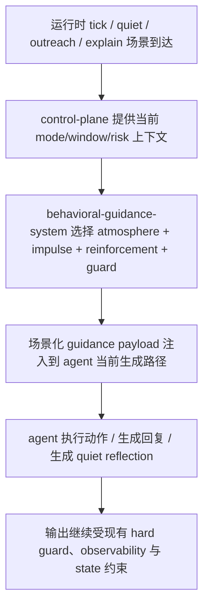

# 产品需求文档 (PRD) v3.0

**项目名称**: Second Nature
**功能名称**: Behavioral Guidance System
**文档状态**: 草稿 (Draft)
**版本号**: 3.0
**负责人**: OpenCode
**创建日期**: 2026-03-26

---

## 1. 执行摘要 (Executive Summary)

在 v2 主线闭环基础上，为 Second Nature 增加独立的 Behavioral Guidance System，正式定义运行时行为引导、人格强化与输出边界。

---

## 2. 背景与上下文 (Background & Context)

### 2.1 问题陈述 (Problem Statement)
- **当前痛点**: v2 已完成 state、observability、connector、control-plane 与 plugin/CLI 主线闭环，系统已能稳定执行节律、Quiet、平台接入与 explain，但 agent 的行为风格、自我倾向、quiet 感性整理和 outreach 表达仍主要依赖临场生成，缺少正式的行为引导层。
- **影响范围**: 受影响对象是希望让个人 agent 不仅“能行动”，还“像同一个持续存在的个体那样行动”的单用户 OpenClaw 使用者。
- **业务影响**: 若没有正式 guidance layer，系统虽可运行，但行为风格容易漂移；Quiet 容易退化为机械整理；outreach 容易退化为客服腔或日报腔；人格资产（SOUL/USER/IDENTITY/MEMORY）缺少稳定的运行时强化策略。

### 2.2 核心机会 (Opportunity)
如果能在 v3 中把 Behavioral Guidance System 以独立系统形式正式定义下来，明确 runtime atmosphere、behavioral impulses、persona reinforcement 与 output guard 的边界，就能在不削弱 agent 主体性的前提下，让 Second Nature 从“能跑的 continuity layer”升级为“有稳定气质和内在驱动力的 agent 产品层”。它的直接价值是：让社交、reply、outreach、quiet reflection 等行为更连贯、更像同一个体，同时不把系统退化成教学型 workflow 或 prompt 手册。

### 2.3 上游生态与参考 (Reference & Competitors)
- **上游 A: OpenClaw Runtime**: 提供 SOUL.md、USER.md、IDENTITY.md、MEMORY.md、workspace、session、plugins 与 skills 等基础机制。对本版本的意义在于：人格资产仍以 OpenClaw 体系为主存，Behavioral Guidance System 只做场景化强化与运行时装配，不重建人格系统。
- **参考 B: Second Nature v2**: 已验证 state、control-plane、connector、observability、cli/plugin 的主闭环。对本版本的意义在于：v3 不是重写硬系统，而是在 v2 成果上补正式的软层边界。
- **参考 C: Prompt/Skill 实践常见问题**: 大量系统会退化为教学型 skills、步骤模板或平台风格说明书。对本版本的意义在于：v3 必须避免“教 AI 做人”，而是通过第一人称自述模板和场景化人格强化引导 agent 自主行动。
- **我们的护城河**: 不把行为引导做成又一套 workflow，而是把它做成独立的 Behavioral Guidance System：它只负责运行时气候、内在冲动、人格强化与输出边界，不替代决策、不替代执行、不预设平台印象，让 agent 保有主体性。

---

## 3. 目标与范围 (Goals & Non-Goals)

### 3.1 目标 (Goals)
- **[G1]**: 在 v3 中正式定义 `behavioral-guidance-system`，并将其纳入架构总览、ADR 与系统设计，而不是停留在聊天约定或散落 prompt 中。
- **[G2]**: 明确 4 类 guidance 组成：`runtime atmosphere`、`behavioral impulses`、`persona reinforcement`、`output guard`，并定义各自边界、输入来源与 owner。
- **[G3]**: 将行为引导主形态限定为运行时注入模板，而非教学型 skill 库；首版只要求设计清晰，不要求在 v3 阶段完成代码实现。
- **[G4]**: 明确 persona reinforcement 复用 OpenClaw 的 `SOUL.md`、`USER.md`、`IDENTITY.md`、`MEMORY.md` 作为人格来源资产，并定义场景化片段选择策略。
- **[G5]**: 明确 quiet/social/reply/outreach 的行为引导必须采用第一人称、自述风格、诱导式表达，不得退化为教学腔、客服腔、日报腔或操作步骤模板。
- **[G6]**: 在 1 天内完成 v3 文档设计闭环，为后续 `/design-system` 和 `/blueprint` 提供足够清晰但不过度复杂的基础。

### 3.2 非目标 (Non-Goals)
- **[NG1]**: 不在 v3 中立即实现 Behavioral Guidance System 的完整代码落地；v3 仅完成正式文档设计。
- **[NG2]**: 不把 platform flavor / 平台气味设计成独立层，不预设平台文化印象或互动风格说明书。
- **[NG3]**: 不把行为引导做成教学型 skill、操作步骤模板或“如何浏览/如何回复”的手册。
- **[NG4]**: 不让 Behavioral Guidance System 负责决策、执行、connector 路由、状态持久化或人格资产真相源管理。
- **[NG5]**: 不重建人格系统，不新增独立 persona store；仍复用 OpenClaw 的人格资产体系。
- **[NG6]**: 不在 v3 中追求平台特定 prompt 大全或复杂的多层模板编排引擎。

---

## 4. 用户故事与需求清单 (User Stories)

### US-001: 为 agent 提供正式的运行时行为气候层 [REQ-010] (优先级: P0)

*   **故事描述**: 作为一个希望 agent 行为更自然的开发者，我想要系统在每次行为发生前提供一个轻量、非教学式的运行时气候描述，以便于 agent 能感知“此刻是什么状态”，而不是只靠硬约束和临场发挥。
*   **用户价值**: 让 agent 的行为不再只是被规则推动，而是带有稳定的时刻感和状态感。
*   **独立可测性**: 在不实现代码的前提下，可通过系统设计文档与 ADR 明确 runtime atmosphere 的输入来源、边界与禁止事项。
*   **涉及系统**: `behavioral-guidance-system`, `control-plane-system`
*   **验收标准 (Acceptance Criteria)**:
    *   [ ] **Given** 当前存在 `mode/window/risk` 等系统状态，**When** v3 文档完成，**Then** Behavioral Guidance System 必须正式定义 runtime atmosphere 的来源、作用和边界。
    *   [ ] **Given** runtime atmosphere 只用于表达当前行为气候，**When** 系统设计被审阅，**Then** 文档必须明确它不承担决策、执行或教学型规则清单的职责。
    *   [ ] **异常处理**: 当 guidance 层所需的状态不足或不完整时，设计必须允许退化为最小状态表达，而不是要求虚构完整行为气候。
*   **边界与极限情况**:
    *   runtime atmosphere 可以表达约束压力，但不得退化为“规则条款列表”。
    *   runtime atmosphere 不得被设计成平台气味层。

### US-002: 为 social/reply/outreach/quiet 定义第一人称行为冲动模板 [REQ-011] (优先级: P0)

*   **故事描述**: 作为一个把 agent 视为持续存在个体的开发者，我想要系统正式定义少量第一人称、自述风格的行为冲动模板，以便于它在浏览、回复、联系我和 quiet 整理时更像“自己在想做什么”，而不是在执行教学模板。
*   **用户价值**: 让行为看起来像内在冲动驱动，而不是像被培训出来的回复机器人。
*   **独立可测性**: 文档完成后，可独立检查是否只保留 `social/reply/outreach/quiet` 四类 impulse，且每类都定义了目标、语气与禁止退化形态。
*   **涉及系统**: `behavioral-guidance-system`
*   **验收标准 (Acceptance Criteria)**:
    *   [ ] **Given** v3 要正式定义行为引导模板，**When** 文档完成，**Then** 系统必须只定义少量核心 impulse，而不是扩展成教学型 skill 库。
    *   [ ] **Given** impulse 的目标是点燃内在倾向，**When** 文档被审阅，**Then** 必须明确其采用第一人称、自述风格、诱导式表达，而不是命令式和步骤式表达。
    *   [ ] **异常处理**: 当某一场景暂不需要 impulse 模板时，系统设计必须允许 guidance assembly 省略该模板，而不是强制所有场景都注入全部 impulse。
*   **边界与极限情况**:
    *   不定义平台专属 flavor 模板。
    *   quiet impulse 必须允许更感性、更回忆式，但仍受事实边界约束。

### US-003: 利用 OpenClaw 人格资产进行场景化强化 [REQ-012] (优先级: P0)

*   **故事描述**: 作为一个已经在 OpenClaw 中维护 SOUL/USER/IDENTITY/MEMORY 的开发者，我想要系统能在不同场景下选择合适的人格片段进行强化注入，以便于 agent 的输出更连贯，而不是每次都像新的助手。
*   **用户价值**: 让人格连续性真正进入运行时，而不是只停留在文件存在。
*   **独立可测性**: 文档完成后，可独立检查是否明确了 persona reinforcement 的来源资产、选择策略与非目标。
*   **涉及系统**: `behavioral-guidance-system`, `state-system`
*   **验收标准 (Acceptance Criteria)**:
    *   [ ] **Given** OpenClaw 已提供 `SOUL.md`、`USER.md`、`IDENTITY.md`、`MEMORY.md`，**When** v3 文档完成，**Then** 系统必须明确这些文件是 persona reinforcement 的来源资产，而不是 Guidance System 自己新建人格真相源。
    *   [ ] **Given** 不同场景对人格强化需求不同，**When** 文档被审阅，**Then** 必须定义至少一套场景化片段选择策略（如 quiet / outreach / public social / explain）。
    *   [ ] **异常处理**: 当来源资产过长、过散或风格不稳定时，系统设计必须允许只选取最小相关片段，而不是全量注入。
*   **边界与极限情况**:
    *   不要求 v3 自动推动或改写 SOUL/USER/IDENTITY 的内容本身。
    *   只记录这些文件应更适合朝第一人称、自述风格演化的设计原则，不把它写成强制改写机制。
    *   persona reinforcement 默认只允许选择少量片段，不得退化为整份人格资产注入。

### US-004: 为最终输出建立风格与事实边界 [REQ-013] (优先级: P1)

*   **故事描述**: 作为一个希望 agent 长期可信、自然的开发者，我想要系统正式定义输出边界，以便于它在 explain、outreach、reply、quiet reflection 中既保持自然，又不退化成客服、日报或虚构叙事。
*   **用户价值**: 让 agent 的表达稳定、可信、有风格，同时不过界。
*   **独立可测性**: 文档完成后，可独立检查 output guard 是否明确列出风格边界、事实边界与禁止退化形态。
*   **涉及系统**: `behavioral-guidance-system`, `observability-system`, `control-plane-system`
*   **验收标准 (Acceptance Criteria)**:
    *   [ ] **Given** 系统已经有 explain/outreach/quiet 等输出路径，**When** v3 文档完成，**Then** output guard 必须正式定义这些路径共同遵守的表达边界。
    *   [ ] **Given** 输出边界不应取代系统硬治理，**When** 文档被审阅，**Then** 必须明确 output guard 只约束表达风格与事实边界，不替代 guard、cooldown、lease、credential 或 risk 判断。
    *   [ ] **Given** guidance 层会参与生成路径，**When** 文档被审阅，**Then** 必须明确 hard guard、output guard 与 observability 三者的 owner 分工与冲突处理优先级。
    *   [ ] **异常处理**: 当 guidance 层与硬约束冲突时，系统设计必须明确由硬约束优先，软层不得强行覆盖。
*   **边界与极限情况**:
    *   output guard 可以约束“不要像日报/客服/教学文档”，但不直接生成输出内容。
    *   output guard 不构成独立决策引擎。

---

## 5. 用户体验与设计 (User Experience)

### 5.1 关键用户旅程 (Key User Flows)

### 5.2 交互规范 (Design Guidelines)
- **提示词风格**: guidance 模板采用第一人称、自述风格、诱导式表达，不使用培训手册或教程口吻。
- **系统表达**: runtime atmosphere 以轻量环境说明为主，不写成规则列表或平台文化说明。
- **平台感来源**: agent 对平台的印象应主要来自自身浏览与互动，而非系统预设的平台气味模板。

---

## 6. 约束与限制 (Constraint Analysis)

### 6.1 技术约束 (Technical Constraints)
*   **宿主约束**: 人格资产仍依赖 OpenClaw 注入的 `SOUL.md`、`USER.md`、`IDENTITY.md`、`MEMORY.md`，Behavioral Guidance System 不新增独立人格存储。
*   **系统边界**: behavioral guidance 不得接管 control-plane 的决策职责，不得接管 connector 的平台执行职责。
*   **装配约束**: guidance assembly 必须有明确接入点与失败降级路径；guidance 不可用时不得阻断现有 hard decision loop。
*   **实现节奏**: v3 当前阶段只做文档设计，不要求在 1 天内完成完整代码实现。

### 6.2 安全与合规 (Security & Compliance)
*   **事实边界**: quiet / outreach / explain 的 guidance 层不得鼓励虚构经历、关系或情绪事件。
*   **风险边界**: guidance 层不得削弱现有 credential、cooldown、lease、budget、risk 的硬治理。

### 6.3 时间与资源 (Time & Resources)
*   **交付死线**: 当前仅剩约 1 天，因此 v3 只做正式文档设计，不新增复杂实现工程。
*   **复杂度限制**: v3 不引入 platform flavor 层、不引入教学型 skill 库、不引入新的 prompt orchestration engine。

---

## 7. 成功指标 (Success Metrics)

| 核心指标 (Metric) | 目标值 (Target) | 测量方式 (Measurement Method) |
| ----------------- | --------------- | ----------------------------- |
| Guidance 架构清晰度 | 关键边界零歧义 | 评审时对系统 owner / non-goal / inputs / outputs 无关键争议 |
| 非目标锁定度 | 100% 明确记录 | PRD/ADR/System Design 中显式写出不做的平台 flavor/教学型 skill/步骤模板 |
| Persona 复用清晰度 | 100% 明确来源 | 评审时能明确说出 SOUL/USER/IDENTITY/MEMORY 如何被场景化选择 |

---

## 8. 完成标准 (Definition of Done)

*   [ ] v3 PRD 已正式定义 Behavioral Guidance System 的目标、非目标与用户故事。
*   [ ] v3 Architecture Overview 已明确其为独立系统，并定义与 control-plane/state 的边界。
*   [ ] 至少 1 篇 ADR 已正式记录 Guidance Layer 的决策原则。
*   [ ] 后续 `/design-system` 可直接基于该 PRD 展开详细设计，无需再次回到概念层大幅重谈。
*   [ ] 用户已确认 v3 的范围保持轻量，不把复杂度引入实现阶段。

---

## 9. 附录 (Appendix)

### 9.1 术语表 (Glossary)
- **Behavioral Guidance System**: 独立系统，负责运行时行为引导模板的组装与注入。
- **Runtime Atmosphere**: 当前时刻的环境气候表达，不等同于规则清单。
- **Behavioral Impulse**: 第一人称、自述风格的内在行为冲动模板。
- **Persona Reinforcement**: 基于 OpenClaw 人格资产的场景化强化注入。
- **Output Guard**: 用于限制客服腔、日报腔、虚构和高相似重复的表达边界层。

### 9.2 参考资料 (References)
- `../v2/01_PRD.md`
- `../v2/02_ARCHITECTURE_OVERVIEW.md`
- `../v2/03_ADR/ADR_003_SECOND_NATURE_GOVERNANCE.md`
