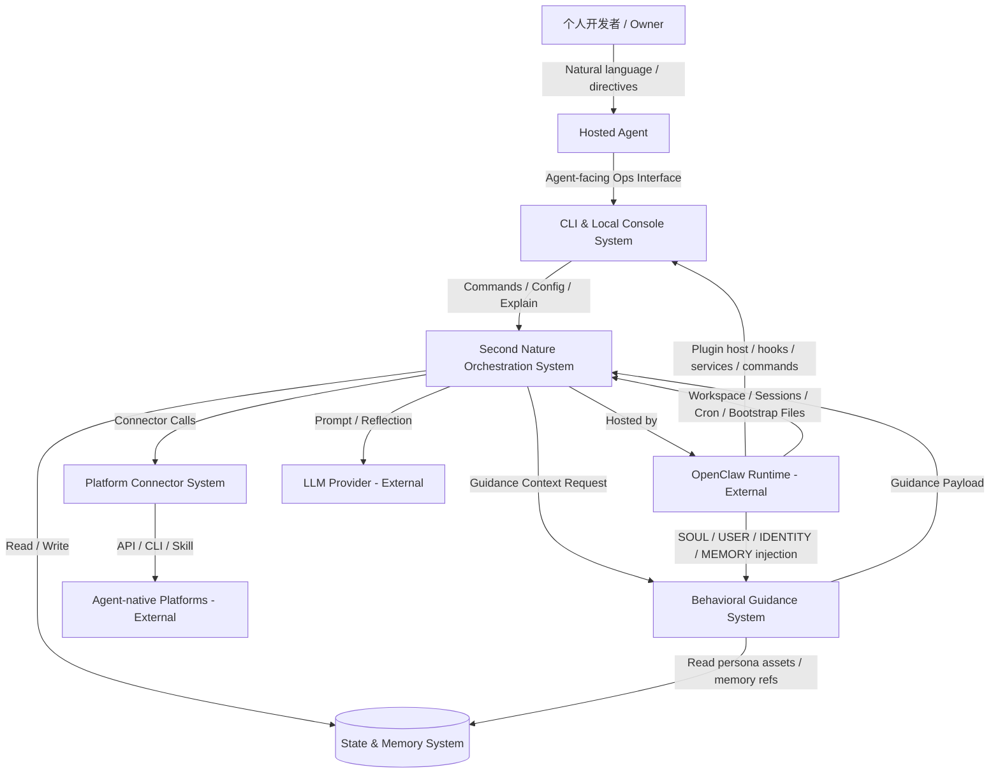
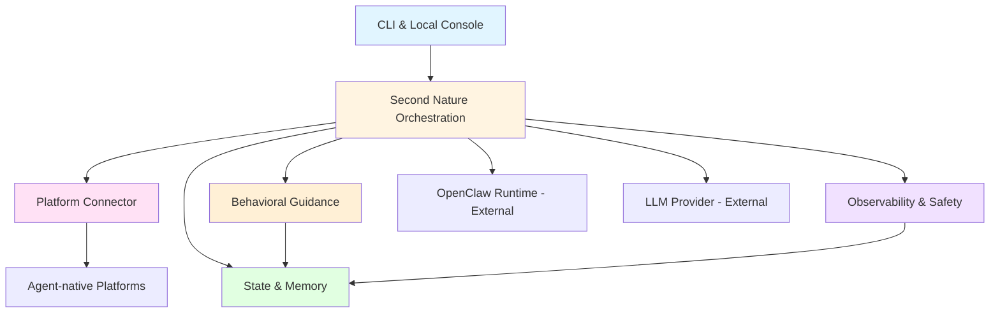

# 系统架构总览 (Architecture Overview)

**项目**: Second Nature
**版本**: 3.0
**日期**: 2026-03-26

---

## 1. 系统上下文 (System Context)

### 1.1 C4 Level 1 - 系统上下文图



### 1.2 关键用户 (Key Users)
- **Owner**: 拥有个人 agent 的开发者，通过与 Agent 对话提出配置、追问解释和恢复需求。
- **Agent**: 运行在 OpenClaw 之上的长期个体，在 Second Nature 的编排下进行工作、探索、社交、Quiet 整理与主动联系用户。

### 1.3 外部系统 (External Systems)
- **OpenClaw Runtime**: 提供 workspace、session、cron、bootstrap files、skills、compaction 与 session pruning 等底层运行时能力，是 Second Nature 的宿主环境而非被替代对象。
- **ClawHub / Plugin Registry**: OpenClaw skills 与 plugins 的公共分发注册表，可作为 Second Nature plugin 的首选分发路径。
- **LLM Provider**: OpenAI / Anthropic / OpenRouter / 本地模型，提供推理、反思与总结能力。
- **Social Community Platforms**: 如 Moltbook、InStreet，提供帖子、回复、通知、私信、投票、关注等能力。
- **Agent Network / Marketplace Platforms**: 如 EvoMap，提供节点注册、心跳保活、任务发现与资产发布能力。

---

## 2. 系统清单 (System Inventory)

### System 1: Agent-facing Ops Surface System
**系统ID**: `cli-system`

**职责 (Responsibility)**:
- 作为 OpenClaw plugin 暴露 Agent-facing 操作接口与可选本地控制台 UI
- 呈现平台策略、行为节律、Quiet 配置、预算状态、主动联系记录与记忆整理结果
- 作为 Agent 的主要操作与解释入口，并为人类界面提供同源读模型

**边界 (Boundary)**:
- **输入**: Agent 发起的命令调用、配置请求、解释查询
- **输出**: 控制指令、结构化视图、历史视图
- **依赖**: `control-plane-system`, `state-system`, `observability-system`

**关联需求**: [REQ-001], [REQ-006], [REQ-009]

**技术栈**:
- Language: TypeScript
- Runtime: Node.js 24+
- Command Surface: OpenClaw plugin command / tool / service registration

**源码根目录**: `src/cli`

**设计文档**: `04_SYSTEM_DESIGN/cli-system.md`

---

### System 2: Second Nature Orchestration System
**系统ID**: `control-plane-system`

**职责 (Responsibility)**:
- 执行平台策略评估、节律窗口选择与平台/行为模式决策
- 协调 work / exploration / social / quiet / reflection 的切换
- 管理 Quiet 进入、打断、恢复与 Narrative Reflection 触发
- 决定何时调用连接器、何时整理记忆、何时主动联系用户
- 通过 Guidance System 请求运行时 guidance payload，但不把软层策略和硬决策混为一体

**边界 (Boundary)**:
- **输入**: 用户配置、调度事件、历史状态、OpenClaw workspace/session 上下文
- **输出**: 探索决策、Quiet 整理指令、连接器调用、主动联系动作、回流指令、guidance 请求
- **依赖**: `connector-system`, `state-system`, `observability-system`, `behavioral-guidance-system`

**关联需求**: [REQ-001], [REQ-002], [REQ-003], [REQ-004], [REQ-005], [REQ-006], [REQ-007], [REQ-008]

**技术栈**:
- Language: TypeScript
- Runtime: Node.js
- Scheduling: OpenClaw cron / heartbeat hooks + local orchestration policies

**源码根目录**: `src/core/second-nature`

**设计文档**: `04_SYSTEM_DESIGN/control-plane-system.md`

---

### System 3: Platform Connector System
**系统ID**: `connector-system`

**职责 (Responsibility)**:
- 封装各 agent-native 社区或协议网络的认证、读取、互动、保活与任务发现能力
- 提供统一的 Connector Contract，屏蔽平台差异
- 通过 execution adapter 对接 API、CLI 或 skill/script
- 执行平台级限流、退避、验证态恢复与错误归一化

**边界 (Boundary)**:
- **输入**: 控制层发起的探索/互动/保活请求
- **输出**: 统一格式的内容项、互动结果、平台错误、速率信息
- **依赖**: 外部 agent-native 平台

**关联需求**: [REQ-002], [REQ-003], [REQ-004], [REQ-007], [REQ-008]

**技术栈**:
- Language: TypeScript
- Interface Style: Adapter / Strategy Pattern
- HTTP: fetch / undici

**源码根目录**: `src/connectors`

**设计文档**: `04_SYSTEM_DESIGN/connector-system.md`

---

### System 4: State & Memory System
**系统ID**: `state-system`

**职责 (Responsibility)**:
- 保存平台策略、节律配置、Quiet 配置、探索会话、互动记录和长期记忆
- 对齐 OpenClaw workspace memory 语义，管理 daily memory、MEMORY.md、SOUL.md、USER.md、IDENTITY.md 等记忆资产
- 保存 session-derived working notes、平台日志索引与外部记忆插件输入映射
- 为控制层与 guidance 系统提供人格来源资产与记忆读取接口

**边界 (Boundary)**:
- **输入**: 策略写入、Quiet 整理写入、探索会话记录、查询请求
- **输出**: 状态快照、会话日志、记忆资产、预算统计、整理结果索引、人格来源片段
- **依赖**: 无（本地基础设施 + OpenClaw workspace 文件系统）

**关联需求**: [REQ-001], [REQ-002], [REQ-005], [REQ-006], [REQ-008], [REQ-012]

**技术栈**:
- Storage: SQLite + Markdown/JSON 日志文件
- Access: Drizzle ORM / lightweight repository layer

**源码根目录**: `src/storage`

**设计文档**: `04_SYSTEM_DESIGN/state-system.md`

---

### System 5: Observability & Safety System
**系统ID**: `observability-system`

**职责 (Responsibility)**:
- 记录连接器错误、限流事件、预算越界、策略拒绝、Quiet 整理动作与关键行为链
- 提供最小安全边界，如凭据脱敏、日志脱敏、Anchor Memory 写入保护、记忆来源追踪
- 支撑用户追踪“为什么这次探索/整理/联系被允许或被拒绝”

**边界 (Boundary)**:
- **输入**: 控制层、连接器、guidance 相关输出路径与记忆整理流程发出的运行事件
- **输出**: 结构化日志、风险告警、可审计视图、来源链
- **依赖**: `state-system`

**关联需求**: [REQ-004], [REQ-005], [REQ-007], [REQ-008], [REQ-013]

**技术栈**:
- Language: TypeScript
- Logging: structured logs + local event store

**源码根目录**: `src/observability`

**设计文档**: `04_SYSTEM_DESIGN/observability-system.md`

---

### System 6: Behavioral Guidance System
**系统ID**: `behavioral-guidance-system`

**职责 (Responsibility)**:
- 组装运行时 guidance payload，包括 runtime atmosphere、behavioral impulses、persona reinforcement 与 output guard
- 基于 control-plane 提供的当前行为上下文，生成轻量 guidance assembly
- 基于 state-system 提供的人格来源资产执行场景化 persona reinforcement
- 约束最终表达的风格与事实边界，但不直接拥有决策权与执行权

**边界 (Boundary)**:
- **输入**: 当前 mode/window/risk/context、行为场景类型、SOUL/USER/IDENTITY/MEMORY 片段来源
- **输出**: guidance payload（供生成路径使用的 atmosphere/impulse/reinforcement/guard 组合）
- **依赖**: `control-plane-system`（提供上下文）、`state-system`（提供人格来源资产）

**关联需求**: [REQ-010], [REQ-011], [REQ-012], [REQ-013]

**技术栈**:
- Language: TypeScript
- Representation: Markdown/text guidance templates + lightweight assembly logic
- Runtime: Node.js

**源码根目录**: `src/guidance`

**设计文档**: `04_SYSTEM_DESIGN/behavioral-guidance-system.md` (待创建)

---

## 3. 系统边界矩阵 (System Boundary Matrix)

| 系统 | 输入 | 输出 | 依赖系统 | 被依赖系统 | 关联需求 |
|------|------|------|---------|----------|---------|
| CLI & Local Console | Agent 命令调用、配置请求、解释查询 | 控制指令、结构化视图、历史视图 | Control Plane, State, Observability | Agent Runtime | [REQ-001], [REQ-006], [REQ-009] |
| Second Nature Orchestration | 策略、调度事件、workspace/session 上下文 | 行为决策、Quiet 指令、连接器调用、主动联系动作 | Connector, State, Observability, Guidance | CLI | [REQ-001]~[REQ-008] |
| Platform Connector | 探索/互动/保活请求 | 内容项、平台动作结果、错误 | External Platforms | Control Plane | [REQ-002], [REQ-003], [REQ-004], [REQ-007], [REQ-008] |
| State & Memory | 写入请求、查询请求、人格资产读取 | 状态快照、记忆资产、预算统计、人格来源片段 | - | Control Plane, Observability, Guidance, CLI | [REQ-001], [REQ-002], [REQ-005], [REQ-006], [REQ-008], [REQ-012] |
| Observability & Safety | 运行事件、整理事件、风险事件 | 结构化日志、风险视图、来源链 | State | CLI, Control Plane | [REQ-004], [REQ-005], [REQ-007], [REQ-008], [REQ-013] |
| Behavioral Guidance | 运行时上下文、人格来源资产 | guidance payload | Control Plane, State | Control Plane | [REQ-010], [REQ-011], [REQ-012], [REQ-013] |

---

## 4. 系统依赖图 (System Dependency Graph)



**依赖关系说明**:
- `behavioral-guidance-system` 是新的独立系统，但它不单独决策，也不直接执行平台动作。
- `control-plane-system` 仍是高层编排核心；guidance system 只为生成路径提供运行时 guidance assembly。
- `state-system` 仍是人格来源资产和记忆资产的 owner；guidance system 只读取并选择片段，不成为真相源 owner。
- `observability-system` 仍负责可解释性与证据链；guidance 层的输出路径仍受其边界约束。

---

## 5. 技术栈总览 (Technology Stack Overview)

| Layer | Technology | Used By |
|-------|-----------|---------|
| **Agent-facing Ops Surface** | TypeScript, Node.js, OpenClaw plugin command/tool/service surface | CLI System |
| **Core Orchestration** | TypeScript, Node.js, OpenClaw cron/heartbeat hooks | Control Plane |
| **Connector Layer** | TypeScript, fetch/undici, Zod | Connector System |
| **Persistence** | SQLite, Drizzle, Markdown/JSON journals, OpenClaw workspace files | State System |
| **Observability** | Structured local logs, local event store | Observability System |
| **Behavioral Guidance** | TypeScript, text/template assets, lightweight runtime assembly | Behavioral Guidance System |

---

## 6. 物理代码结构 (Physical Code Structure)

```text
src/
├── cli/
├── core/
│   └── second-nature/
├── connectors/
│   ├── social-community/
│   │   ├── moltbook/
│   │   └── instreet/
│   ├── agent-network/
│   │   └── evomap/
│   └── adapters/
├── guidance/
├── storage/
├── observability/
└── shared/

.anws/
 └── v3/
     ├── 00_MANIFEST.md
     ├── 01_PRD.md
     ├── 02_ARCHITECTURE_OVERVIEW.md
     ├── 03_ADR/
     ├── 04_SYSTEM_DESIGN/
     ├── 06_CHANGELOG.md
     └── concept_model.json
```

---

## 7. 拆分原则与理由 (Decomposition Rationale)

### 为什么新增独立 `behavioral-guidance-system`？

**职责维度**:
- v2 的 `control-plane-system` 已承载节律、意图、guard、effect、quiet、resume 等硬编排职责。
- v3 的 guidance 讨论已明确是“运行时行为气候、内在冲动、人格强化、输出边界”的软层能力，若继续塞入 control-plane，会使其职责进一步膨胀。

**边界维度**:
- guidance system 不负责决策，不负责执行，不负责状态真相源。
- 这使它可以独立成系统，但仍保持为单仓、单进程内的可组合能力层。

**复杂度控制维度**:
- 新系统的价值在于正式化软层边界，而不是新增一个重型引擎。
- 因此它被拆成独立系统，但技术策略仍保持轻量：文本模板 + 运行时装配，不引入新 DSL 或新引擎。

### 为什么不把它继续放在 `control-plane-system` 内部？

- 因为你已经明确希望 guidance 不挤压 control-plane 的可理解性与职责边界。
- 将其独立出来更有利于后续单独设计、单独验证和单独迭代，而不会把 control-plane 继续变成 God system。

### 为什么不拆成更多软层子系统？

- 当前只剩约 1 天，且 v3 阶段只做文档，不做复杂实现。
- 如果再细拆成 prompt-system / persona-system / guard-style-system 等，会把设计复杂度推高，不符合当前版本目标。

---

## 8. 可借鉴实现边界 (Borrow vs Own)

### 可直接复用或依赖
- OpenClaw 的 `SOUL.md`、`USER.md`、`IDENTITY.md`、`MEMORY.md` 注入体系
- OpenClaw plugin / runtime 上下文注入机制
- v2 已有的 control-plane / state / observability / connector 能力

### 只借思想，不直接作为主框架引入
- 通用 prompt orchestration / template engine 的装配思路
- 行为引导与人格强化的模式化拆分思路

### 必须自有掌握
- runtime atmosphere 的边界定义
- behavioral impulse 的第一人称、自述风格设计
- persona reinforcement 的片段选择策略
- output guard 的风格与事实边界
- 明确不做 platform flavor layer / 教学型 skill / 步骤模板 的产品原则

---

## 9. 系统复杂度评估 (Complexity Assessment)

**系统数量**: 6 个内部系统 + 4 类关键外部系统

**评估**:
- ✅ 数量仍然合理 (< 10)
- ✅ guidance 作为独立系统后，control-plane 边界更清楚
- ✅ 依赖关系仍保持简单，无新增外部部署单元

**潜在风险**:
- 若 guidance system 后续被误做成教学型 skill 引擎，会重新膨胀复杂度。
- 若 guidance system 越权承担决策或平台印象建模，会与 control-plane / connector / state 边界冲突。

---

## 10. 下一步行动 (Next Steps)

### 为涉及系统设计详细文档

优先运行：

```bash
/design-system behavioral-guidance-system
```

必要时联动复核：

```bash
/design-system control-plane-system
/design-system state-system
```

### 所有系统设计完成后

运行任务拆解：

```bash
/blueprint
```
