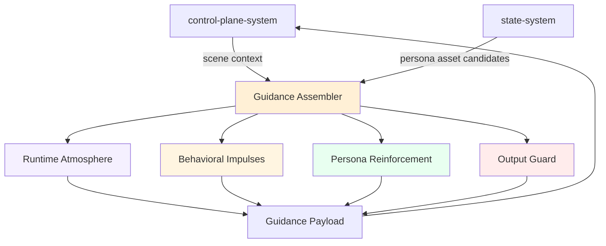
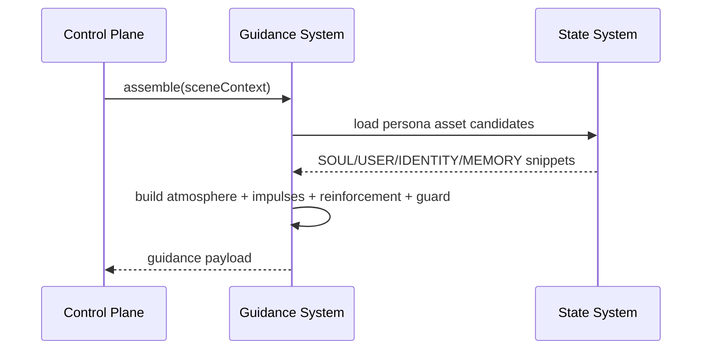
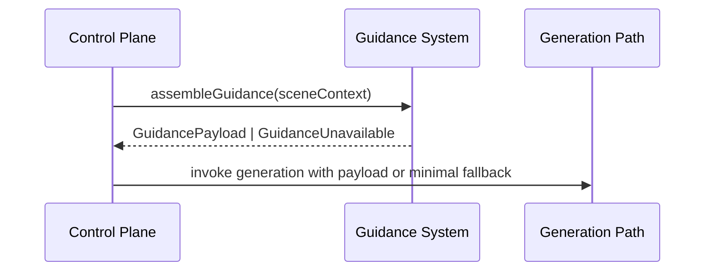

# Behavioral Guidance System 设计文档 (L0 — 导航层)

| 字段 | 值 |
| --- | --- |
| **System ID** | `behavioral-guidance-system` |
| **Project** | Second Nature |
| **Version** | 3.0 |
| **Status** | `Draft` |
| **Author** | OpenCode |
| **Date** | 2026-03-26 |

---

## 1. 概览 (Overview)

### 1.1 System Purpose (系统目的)

`behavioral-guidance-system` 是 Second Nature 的独立软层系统。它负责把当前运行时环境、场景需求、人格来源资产与表达边界，组装成一份轻量 guidance payload，供 agent 的生成路径使用。

它的目标不是替 agent 决策，而是让 agent 在既有硬治理和行为编排之上，具有更稳定的气候感、内在冲动和人格连续性。

### 1.2 System Boundary (系统边界)

- **输入 (Input)**:
  - 来自 `control-plane-system` 的当前场景上下文
  - 来自 `state-system` 的人格来源资产片段
  - 必要时来自现有系统的风险/约束摘要
- **输出 (Output)**:
  - guidance payload：`atmosphere`、`impulses`、`persona_reinforcement`、`output_guard`
- **依赖系统 (Dependencies)**:
  - `control-plane-system`
  - `state-system`
- **被依赖系统 (Dependents)**:
  - `control-plane-system`

### 1.3 System Responsibilities (系统职责)

**负责**:
- 组装 runtime atmosphere
- 选择 behavioral impulses
- 进行 persona reinforcement 片段选择
- 附加 output guard

**不负责**:
- 不做行为决策
- 不做 connector 调度或平台执行
- 不管理人格资产真相源
- 不预设平台文化印象
- 不提供教学型 skill 或步骤模板

---

## 2. 目标与非目标 (Goals & Non-Goals)

### 2.1 Goals

- **[G1]**: 正式定义 guidance assembly 的系统归属与输入输出边界
- **[G2]**: 用轻量模板装配 `atmosphere / impulses / persona_reinforcement / output_guard`
- **[G3]**: 保留 agent 主体性，不把平台印象系统预写死
- **[G4]**: 复用 OpenClaw 人格资产，而不是重建人格系统

### 2.2 Non-Goals

- **[NG1]**: 不做 platform flavor layer
- **[NG2]**: 不做教学型 skill 库
- **[NG3]**: 不做步骤模板
- **[NG4]**: 不接管 control-plane 的决策职责
- **[NG5]**: 不新增 persona store 或 prompt orchestration engine

---

## 3. 背景与上下文 (Background & Context)

### 3.1 Why This System? (为什么需要这个系统？)

Second Nature v2 已能稳定地完成：
- 节律调度
- Quiet 整理
- 平台接入
- explain 与 operator voice

但还缺少一个正式的软层能力来保证：
- 行为风格不漂移
- outreach 不退化成客服式汇报
- quiet 具有更感性、更回看式的整理气质
- SOUL/USER/IDENTITY/MEMORY 真正进入运行时

### 3.2 Current State (现状分析)

- v2 的硬系统能力已闭环
- guidance 当前更多依赖临场生成和零散 prompt 约定
- 若继续把 guidance 塞进 control-plane，会继续增加复杂度

### 3.3 Constraints (约束条件)

- **技术约束**: 继续沿用 TypeScript + Node.js 主栈，不引入新引擎
- **边界约束**: 不得替代 control-plane、state、connector 的 owner 职责
- **产品约束**: 不预设平台文化印象，不把 agent 训练成 workflow 机器人
- **时间约束**: 当前先做清晰设计，不追求完整实现

### 3.4 调研结论摘要

- 推荐用轻量 context assembly，而不是 giant prompt
- persona reinforcement 应是片段选择，不是整份注入
- output guard 应以“禁止退化项”为主，而不是“推荐话术库”
- 平台印象应更多来自 agent 自己的浏览与体验

完整研究见 `./_research/behavioral-guidance-system-research.md`。

---

## 4. 系统架构 (Architecture)

### 4.1 Architecture Diagram (架构图)



### 4.2 Core Components (核心组件)

| Component Name | Responsibility | Tech Stack | Notes |
| -------------- | -------------- | ---------- | ----- |
| `GuidanceAssembler` | 汇总当前场景需要的 guidance block | TypeScript | 系统核心协调器 |
| `AtmosphereBuilder` | 生成运行时气候表达 | TypeScript | 只表达环境，不教学 |
| `ImpulseSelector` | 选择当前需要的行为冲动模板 | TypeScript | 仅 4 类核心 impulse |
| `PersonaSelector` | 从人格来源资产中挑选少量片段 | TypeScript | 只做选择，不做改写 |
| `OutputGuardBuilder` | 附加表达边界约束 | TypeScript | 防止退化表达 |

### 4.3 Data Flow (数据流)



**关键数据流说明**:
1. `control-plane-system` 提供当前行为场景，但不把决策权下放给 guidance。
2. `state-system` 提供人格来源资产，但 guidance 只做场景化片段选择。
3. guidance payload 是轻量组合结果，不是整本文档拼接。

### 4.4 Guidance Assembly Integration Boundary



**接入边界说明**:
1. `control-plane-system` 是 guidance request 的唯一发起方。
2. `behavioral-guidance-system` 只返回 `GuidancePayload` 或显式的不可用结果，不直接调用生成模型。
3. guidance payload 仅作为生成前上下文增强，不拥有行为仲裁权。
4. 若 guidance 不可用，`control-plane-system` 必须允许退化为最小 guidance 路径，不能阻断既有 hard decision loop。
5. 最小 fallback 只允许包含：最小 atmosphere、空或精简 impulses、无 persona reinforcement、最小 output guard。

---

## 5. 接口设计 (Interface Design)

### 5.1 操作契约表 (Operation Contracts)

| 操作 | [REQ-XXX] | 前置条件 | 输入 | 产出 | 说明 |
| ---- | :-------: | -------- | ---- | ---- | ---- |
| `assembleGuidance(sceneContext)` | [REQ-010] | scene 已分类 | mode/window/risk/scene | `GuidancePayload` | 主入口 |
| `selectPersonaSnippets(sceneType)` | [REQ-012] | persona assets 可读 | scene + asset candidates | `PersonaSnippet[]` | 只做选择 |
| `buildAtmosphere(sceneContext)` | [REQ-010] | runtime context 可读 | mode/window/risk | `AtmosphereBlock` | 环境气候 |
| `selectImpulses(sceneType)` | [REQ-011] | scene 已知 | social/reply/outreach/quiet | `ImpulseBlock[]` | 只选四类 |
| `buildOutputGuard(sceneType)` | [REQ-013] | scene 已知 | output path | `GuardBlock` | 风格/事实边界 |

### 5.2 Owner 分工表

| 问题 | Owner |
| ---- | ----- |
| 是否执行该动作 | `control-plane-system` |
| 动作是否合法/安全 | 现有 hard guard（control-plane / connector / state） |
| 当前需要何种 guidance payload | `behavioral-guidance-system` |
| 输出风格与事实边界 | `behavioral-guidance-system` |
| guidance 是否被记录与解释 | `observability-system` |
| 人格资产真相源 | `state-system` |

### 5.3 Guidance Payload 结构

```ts
interface GuidancePayload {
  atmosphere?: AtmosphereBlock;
  impulses: ImpulseBlock[];
  personaReinforcement: PersonaSnippet[];
  outputGuard?: GuardBlock;
}
```

### 5.4 场景分类

| Scene Type | 典型来源 | Guidance 重点 |
| ---------- | -------- | ------------- |
| `social` | 浏览 / 社交时段 | social impulse + light atmosphere |
| `reply` | 评论 / 短回复 | reply impulse + concise guard |
| `outreach` | 联系用户 | outreach impulse + anti-report guard |
| `quiet` | quiet / reflection | quiet impulse + SOUL/MEMORY reinforcement |
| `explain` | why-question | reinforcement + factual guard |

---

## 6. 数据模型 (Data Model)

### 6.1 核心实体 (Core Entities)

```ts
interface SceneContext {
  sceneType: 'social' | 'reply' | 'outreach' | 'quiet' | 'explain';
  mode: 'active' | 'quiet' | 'maintenance_only' | 'paused_for_interrupt';
  windowId?: string;
  riskLevel?: 'low' | 'medium' | 'high';
}

interface AtmosphereBlock {
  summary: string;
  openness: 'open' | 'narrow' | 'quiet';
}

interface ImpulseBlock {
  kind: 'social' | 'reply' | 'outreach' | 'quiet';
  text: string;
}

interface PersonaSnippet {
  source: 'SOUL' | 'USER' | 'IDENTITY' | 'MEMORY';
  text: string;
  rationale: string;
}

interface GuardBlock {
  constraints: string[];
}
```

### 6.2 数据流向 (Data Flow Direction)

- `control-plane-system` 提供 `SceneContext`
- `state-system` 提供人格来源候选片段
- `behavioral-guidance-system` 只做组合，不产生新的 canonical state

### 6.3 Persona Selection 契约边界

- 每次默认只选择少量片段（建议 1-3 个），不得把整份 `SOUL/USER/IDENTITY/MEMORY` 作为默认注入路径。
- `quiet`、`outreach`、`social`、`reply`、`explain` 等 scene 必须允许不同的来源优先级。
- 选择结果必须包含 `rationale`，以便后续 explain/debug 审计。
- `persona reinforcement` 只能强化当前场景的一致性，不得成为新的隐式人格真相源。

---

## 7. 技术选型 (Technology Stack)

### 7.1 Core Technologies (核心技术)

| Domain | Choice | Rationale |
| ------ | ------ | --------- |
| Runtime | Node.js + TypeScript | 与现有主栈一致 |
| Template representation | Markdown/text fragments | 轻量、易审阅、易演进 |
| Assembly logic | In-process composition | 不引入新引擎 |

### 7.2 Key Libraries/Dependencies (关键依赖)

- 继续复用现有 TypeScript / Node.js 主栈
- 不新增 DSL / prompt orchestration engine

---

## 8. Trade-offs & Alternatives (权衡与备选方案)

### 8.1 主栈与宿主方式 - 引用 ADR

> **决策来源**: [ADR-001: 主技术栈与宿主运行时选择](../03_ADR/ADR_001_TECH_STACK.md)
>
> 本系统继续沿用 TypeScript + Node.js + OpenClaw native plugin 语义，不在此重复主栈选择理由。
>
> **本系统特有实现**: 不引入新的 guidance engine，只做轻量模板装配。

### 8.2 Guidance Layer 边界 - 引用 ADR

> **决策来源**: [ADR-004: Behavioral Guidance Layer 的系统边界与实现形态](../03_ADR/ADR_004_BEHAVIORAL_GUIDANCE_LAYER.md)
>
> 本系统作为独立 `behavioral-guidance-system` 存在，负责 guidance assembly / persona reinforcement / output guard，不负责决策与执行。
>
> **本系统特有实现**: guidance payload 采用四段式组合，不做平台 flavor 层，不做教学型 skill。

### 8.3 独立系统 vs control-plane 子模块

**Option A: control-plane 内部 guidance 子模块**
- ✅ **优点**:
  - 调用链短
- ❌ **缺点**:
  - 继续增加 control-plane 复杂度
  - 软层边界更难维护

**Option B: 独立 behavioral-guidance-system (✅ Selected)**
- ✅ **优点**:
  - 软层职责清晰
  - 保持 control-plane 可理解性
- ❌ **缺点**:
  - 新增系统设计工作量

**结论**: 采用独立系统，但保持轻量。

### 8.4 Impulse 模板 vs 教学型 skill

**Option A: 第一人称 impulse 模板 (✅ Selected)**
- ✅ **优点**:
  - 点燃内在倾向，保留 agent 主体性
  - 避免 workflow 机器人化
- ❌ **缺点**:
  - 输出效果更依赖场景装配质量

**Option B: 教学型 skill / 步骤模板**
- ✅ **优点**:
  - 表面更可控
- ❌ **缺点**:
  - 教学味重
  - 与产品目标冲突

**结论**: 采用 impulse 模板，不采用教学型 skill。

### 8.5 平台印象预设 vs 观察中形成印象

**Option A: 系统预设平台 flavor**
- ✅ **优点**:
  - 看似方便统一风格
- ❌ **缺点**:
  - 容易压制 agent 自身观察
  - 容易过时和刻板化

**Option B: agent 通过浏览形成印象 (✅ Selected)**
- ✅ **优点**:
  - 保留主体性
  - 与平台实时体验一致
- ❌ **缺点**:
  - 平台感更多依赖观察质量

**结论**: 不做 platform flavor layer。

### 8.6 Output Guard vs Hard Guard / Observability

**Option A: output guard 作为第二套安全治理**
- ✅ **优点**:
  - 表面上更统一
- ❌ **缺点**:
  - 与现有 hard guard 冲突
  - owner 模糊
  - explain 语义混乱

**Option B: output guard 只约束表达边界，hard guard 继续负责动作安全 (✅ Selected)**
- ✅ **优点**:
  - owner 清晰
  - 与现有 observability 体系更兼容
- ❌ **缺点**:
  - 需要额外定义两层 guard 的协作边界

**结论**: output guard 不替代 hard guard；当两者冲突时，hard guard 优先，observability 负责记录 guidance 参与。

---

## 9. 安全性考虑 (Security Considerations)

- Guidance 不得诱导虚构经历或关系
- Persona reinforcement 只读取来源资产，不擅自改写真相源
- Output guard 必须明确防止客服腔、日报腔、教学腔与高重复模板化输出
- 当 guidance 与硬治理冲突时，硬治理优先
- Guidance 不可用时必须允许最小 fallback，而不是因为软层缺失而阻断动作链路

---

## 10. 性能考虑 (Performance Considerations)

| 指标 | 目标 | 说明 |
|------|------|------|
| guidance assembly | < 50ms | 仅做轻量片段选择与组合 |
| persona snippet selection | < 20ms | 只选少量片段，不做重检索引擎 |
| payload size | 保持轻量 | 避免 giant prompt |

**优化策略**:
- 每轮只选最小必要片段
- guidance block 小型化
- 不整份注入人格文档

---

## 11. 测试策略 (Testing Strategy)

| 类型 | 覆盖范围 |
|------|---------|
| 文档评审 | guidance 边界是否清晰 |
| 模板审查 | impulse 是否保持第一人称、自述风格 |
| 集成测试（后续） | scene -> guidance assembly -> output path |
| 回归检查（后续） | guidance 不得覆盖硬 guard |
| 契约测试（后续） | fallback 路径、owner 分工、persona selection 上限 |

---

## 12. 部署与运维 (Deployment & Operations)

- 当前阶段仅做文档设计，不新增独立部署单元
- 后续实现时预计作为仓库内独立模块运行，而不是单独服务

---

## 13. 未来考虑 (Future Considerations)

- 后续可在不改变边界的前提下增加更多 scene type
- 后续可为 persona snippet 选择增加更细粒度 scoring，但不应升级为新引擎
- 若未来 guidance 需要被 explain/debug 观察，可由 cli-system 提供只读摘要视图

---

## 14. Appendix (附录)

### 14.1 术语表
- **Runtime Atmosphere**: 运行时环境气候表达
- **Behavioral Impulse**: 行为冲动模板
- **Persona Reinforcement**: 人格片段强化注入
- **Output Guard**: 输出边界层

### 14.2 参考资料
- `../03_ADR/ADR_001_TECH_STACK.md`
- `../03_ADR/ADR_004_BEHAVIORAL_GUIDANCE_LAYER.md`
- `./_research/behavioral-guidance-system-research.md`
