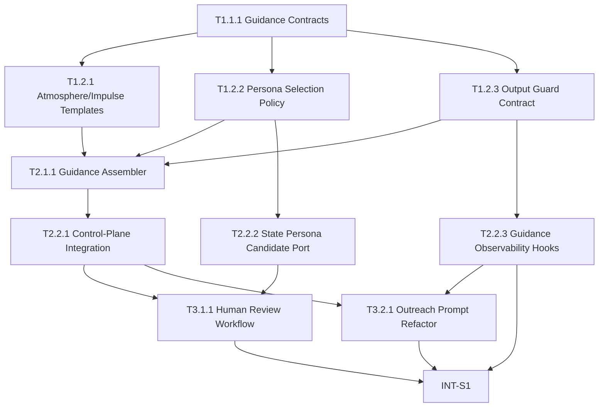

# Second Nature v3 任务清单 (Blueprint)

**项目**: Second Nature  
**版本**: `.anws/v3`  
**阶段**: Blueprint  
**生成日期**: 2026-03-26  
**来源**: `01_PRD.md`, `02_ARCHITECTURE_OVERVIEW.md`, `03_ADR/`, `04_SYSTEM_DESIGN/`

---

## 🔗 依赖图总览

---

## 📊 Sprint 路线图

| Sprint | 代号 | 核心任务 | 退出标准 | 预估 |
|--------|------|---------|---------|------|
| S1 | Guidance Core | guidance contract + templates + assembler + state/observability 接口 | guidance payload 四段式可装配，且不越权承担决策/执行 | 1-1.5d |
| S2 | Humanized Runtime | human review loop + outreach refactor + minimal runtime integration | 所有注入模板可人工审核，outreach 不再依赖固定话术模板 | 1-1.5d |

---

## System 1: Behavioral Guidance System

### Phase 1: Foundation (契约与模板基础)

- [x] **T1.1.1** [REQ-010]: 定义 guidance payload 与 owner contract
  - **描述**: 在 `src/guidance/` 建立 `GuidancePayload`、`SceneContext`、`AtmosphereBlock`、`ImpulseBlock`、`PersonaSnippet`、`GuardBlock` 的单源契约，并明确 control-plane / guidance / state / observability 的 owner 分工接口。
  - **输入**: `01_PRD.md` §US-001~US-004；`02_ARCHITECTURE_OVERVIEW.md` §2 System 2 / System 4 / System 5 / System 6；`03_ADR/ADR_004_BEHAVIORAL_GUIDANCE_LAYER.md` §2, §7-8；`04_SYSTEM_DESIGN/behavioral-guidance-system.md` §5.1, §5.2, §6.1
  - **输出**: `src/guidance/types.ts`, `src/guidance/contracts.ts`
  - **📎 参考**: `ADR_004_BEHAVIORAL_GUIDANCE_LAYER.md`, `behavioral-guidance-system.md` §5-6
  - **验收标准**:
    - Given v3 已定义 guidance system 为独立系统，When 实现 guidance contracts，Then guidance payload 与 owner 分工有单源类型定义可供后续模块引用。
    - Given output guard 不得替代硬治理，When 审阅接口定义，Then 类型与契约必须明确区分 hard guard owner 与 output guard owner。
  - **验证类型**: 编译检查
  - **验证说明**: 运行类型检查，确认 guidance contracts 可被 guidance/control-plane/state/observability 引用且无循环定义。
  - **估时**: 3h
  - **依赖**: 无
  - **优先级**: P0

- [x] **T1.2.1** [REQ-011]: 定义 runtime atmosphere 与四类 behavioral impulse 模板
  - **描述**: 在 `src/guidance/templates/` 中建立 `social`、`reply`、`outreach`、`quiet` 四类 impulse 模板和最小 atmosphere 模板，要求全部采用第一人称、自述风格、诱导式表达，不得写成教学型步骤模板。
  - **输入**: `01_PRD.md` §US-001, §US-002；`03_ADR/ADR_004_BEHAVIORAL_GUIDANCE_LAYER.md` §3-6；`04_SYSTEM_DESIGN/behavioral-guidance-system.md` §4.2, §5.4, §8.4
  - **输出**: `src/guidance/templates/atmosphere/*.md`, `src/guidance/templates/impulses/*.md`
  - **📎 参考**: `ADR_004_BEHAVIORAL_GUIDANCE_LAYER.md`, `_research/behavioral-guidance-system-research.md`
  - **验收标准**:
    - Given v3 已明确不做教学型 skill 与步骤模板，When 模板被创建，Then 模板必须保持第一人称、自述风格，不出现分步骤操作教学。
    - Given guidance 模板会直接影响 agent 表达，When 模板初稿完成，Then 每个模板必须进入人工审核列表，未经人工确认不得视为可发布模板。
  - **验证类型**: 手动验证
  - **验证说明**: 人工阅读模板，确认语气、自述风格和非教学边界成立，并在审核记录中标记通过/需修改。
  - **估时**: 4h
  - **依赖**: T1.1.1
  - **优先级**: P0

- [x] **T1.2.2** [REQ-012]: 定义 persona reinforcement 选择策略与最小注入预算
  - **描述**: 在 guidance 系统中定义 persona candidate selection policy，明确 scene 对应的来源优先级、默认片段数量上限、`rationale` 要求，以及不得整份注入人格资产的约束。
  - **输入**: `01_PRD.md` §US-003；`03_ADR/ADR_004_BEHAVIORAL_GUIDANCE_LAYER.md` §5；`04_SYSTEM_DESIGN/behavioral-guidance-system.md` §5.1 `selectPersonaSnippets`、§6.3；`04_SYSTEM_DESIGN/state-system.md`（v2）§4.4, §5.1
  - **输出**: `src/guidance/persona-selection.ts`, `src/guidance/templates/persona-selection-policy.md`
  - **📎 参考**: `ADR_004_BEHAVIORAL_GUIDANCE_LAYER.md`, `behavioral-guidance-system.md` §6.3
  - **验收标准**:
    - Given persona reinforcement 只做场景化强化，When 选择策略被实现，Then 系统必须限制默认片段数量，并要求每个片段带 `rationale`。
    - Given state-system 是人格资产真相源 owner，When 审阅该策略，Then 策略不得要求创建新的 persona canonical store。
  - **验证类型**: 单元测试
  - **验证说明**: 运行 selection policy 测试，确认 scene 优先级、片段上限和 rationale 约束成立。
  - **估时**: 4h
  - **依赖**: T1.1.1
  - **优先级**: P0

- [x] **T1.2.3** [REQ-013]: 定义 output guard 退化项约束与 fallback contract
  - **描述**: 实现 output guard 配置与 fallback contract，明确客服腔/日报腔/教学腔/虚构/高重复等退化项约束，以及 guidance 不可用时的最小 fallback 结构。
  - **输入**: `01_PRD.md` §US-004；`03_ADR/ADR_004_BEHAVIORAL_GUIDANCE_LAYER.md` §7-8；`04_SYSTEM_DESIGN/behavioral-guidance-system.md` §4.4, §5.1 `buildOutputGuard`, §8.6, §9
  - **输出**: `src/guidance/output-guard.ts`, `src/guidance/fallback.ts`
  - **📎 参考**: `ADR_004_BEHAVIORAL_GUIDANCE_LAYER.md`, `behavioral-guidance-system.md` §8.6
  - **验收标准**:
    - Given output guard 只约束表达边界，When contract 被实现，Then 必须明确它不替代 hard guard，且冲突时 hard guard 优先。
    - Given guidance 可能不可用，When fallback contract 被实现，Then 系统必须允许退化到最小 guidance 路径，而不是阻断既有 decision loop。
  - **验证类型**: 单元测试
  - **验证说明**: 运行 output guard/fallback 测试，确认退化项约束与 minimal fallback 结构成立。
  - **估时**: 4h
  - **依赖**: T1.1.1
  - **优先级**: P1

### Phase 2: Core Assembly (核心装配)

- [x] **T2.1.1** [REQ-010]: 实现 GuidanceAssembler 与四段式 payload 组合
  - **描述**: 实现 guidance assembly 主入口，根据 scene context 汇总 atmosphere、impulses、persona reinforcement 与 output guard，返回轻量 `GuidancePayload`。
  - **输入**: `04_SYSTEM_DESIGN/behavioral-guidance-system.md` §4.1-4.4；T1.2.1, T1.2.2, T1.2.3 的产出；`03_ADR/ADR_004_BEHAVIORAL_GUIDANCE_LAYER.md` §8
  - **输出**: `src/guidance/guidance-assembler.ts`
  - **📎 参考**: `behavioral-guidance-system.md` §4, §5.1
  - **验收标准**:
    - Given 当前 scene context 已知，When 调用 `assembleGuidance(sceneContext)`，Then 系统能返回四段式 guidance payload 或显式的 guidance unavailable 结果。
    - Given guidance system 不拥有决策权，When 装配逻辑被审阅，Then assembly 不得根据模板内容改变 allow/deny 等决策语义。
  - **验证类型**: 单元测试
  - **验证说明**: 运行 assembler 测试，确认 social/reply/outreach/quiet/explain 场景下 payload 结构稳定且不越权。
  - **估时**: 5h
  - **依赖**: T1.2.1, T1.2.2, T1.2.3
  - **优先级**: P0

### Phase 3: Integration (集成)

- [x] **T2.2.1** [REQ-010]: 接入 control-plane 的 guidance request 与 minimal fallback
  - **描述**: 在 control-plane 的生成路径接入 guidance request，明确 guidance request 的唯一发起点，并在 guidance unavailable 时走最小 fallback 路径。
  - **输入**: `04_SYSTEM_DESIGN/behavioral-guidance-system.md` §4.4, §5.2；`02_ARCHITECTURE_OVERVIEW.md` §2 System 2 / System 6；T2.1.1 产出的 `GuidanceAssembler`
  - **输出**: `src/core/second-nature/guidance/request-guidance.ts`, `src/core/second-nature/guidance/apply-guidance.ts`
  - **📎 参考**: `ADR_004_BEHAVIORAL_GUIDANCE_LAYER.md` §8, `behavioral-guidance-system.md` §4.4
  - **验收标准**:
    - Given control-plane 是 guidance request 的唯一发起方，When guidance 接入生成路径，Then 调用链必须清楚体现 request -> payload -> generation，不新增第二个 owner。
    - Given guidance 不可用，When 运行生成路径，Then 系统必须退化到 minimal fallback，不阻断既有 hard decision loop。
  - **验证类型**: 集成测试
  - **验证说明**: 运行 control-plane 与 guidance 集成测试，确认 request owner 唯一、fallback 不阻断主链。
  - **估时**: 5h
  - **依赖**: T2.1.1
  - **优先级**: P0

- [x] **T2.2.2** [REQ-012]: 为 persona reinforcement 增加 state persona candidate 读取端口
  - **描述**: 在 state-system 中暴露最小 persona candidate 读取端口，为 SOUL/USER/IDENTITY/MEMORY 片段选择提供统一输入，而不创建新的 canonical persona store。
  - **输入**: `01_PRD.md` §US-003；`02_ARCHITECTURE_OVERVIEW.md` §2 System 4 / System 6；`04_SYSTEM_DESIGN/behavioral-guidance-system.md` §5.1 `selectPersonaSnippets`, §6.3；`04_SYSTEM_DESIGN/state-system.md`（v2）§5.2
  - **输出**: `src/storage/services/persona-candidate-loader.ts`, `src/storage/index.ts`
  - **📎 参考**: `ADR_004_BEHAVIORAL_GUIDANCE_LAYER.md` §5
  - **验收标准**:
    - Given state-system 是人格资产真相源 owner，When 暴露 persona candidate 读取端口，Then guidance system 只能读取候选片段，不能获得新的写入 owner 身份。
    - Given persona selection 默认不能整份注入，When candidate loader 返回结果，Then 返回结构必须支持片段级选择而不是整份文件直出。
  - **验证类型**: 集成测试
  - **验证说明**: 运行 state/guidance 集成测试，确认读取接口粒度正确且不引入新的 canonical store。
  - **估时**: 4h
  - **依赖**: T1.2.2
  - **优先级**: P1

- [x] **T2.2.3** [REQ-013]: 接入 guidance 参与记录与 explain/debug 可见性
  - **描述**: 在 observability-system 中增加 guidance 参与的最小记录语义，允许后续 explain/debug 查看 guidance 是否参与、选择了哪些 block、使用了哪些 persona snippet rationale。
  - **输入**: `04_SYSTEM_DESIGN/behavioral-guidance-system.md` §5.2, §6.3, §8.6；`02_ARCHITECTURE_OVERVIEW.md` §2 System 5 / System 6；`04_SYSTEM_DESIGN/observability-system.md`（v2）§5.1, §6.3
  - **输出**: `src/observability/projections/guidance-audit.ts`, `src/observability/index.ts`
  - **📎 参考**: `ADR_004_BEHAVIORAL_GUIDANCE_LAYER.md`, `behavioral-guidance-system.md` §8.6
  - **验收标准**:
    - Given output guard 与 hard guard 的 owner 已区分，When guidance 参与生成路径，Then observability 必须能记录 guidance 的参与事实，而不把它误记成 hard safety veto。
    - Given persona reinforcement 结果包含 rationale，When explain/debug 读取 guidance 记录，Then 至少能看到 guidance block 与 snippet rationale 的最小摘要。
  - **验证类型**: 集成测试
  - **验证说明**: 运行 observability/guidance 集成测试，确认 guidance participation 可记录且不污染现有 hard guard 语义。
  - **估时**: 4h
  - **依赖**: T1.2.3, T2.1.1
  - **优先级**: P1

### Phase 4: Human Review & Runtime Closure (人工审核与运行时收口)

- [x] **T3.1.1** [REQ-011]: 建立所有 guidance 模板的人类审核工作流
  - **描述**: 为 atmosphere / impulse / persona reinforcement / output guard 模板建立统一人工审核机制，确保所有涉及提示词与注入消息的内容必须经人类审核后方可视为有效模板。
  - **输入**: `01_PRD.md` §US-002~US-004；`04_SYSTEM_DESIGN/behavioral-guidance-system.md` §2.2, §11；T1.2.1, T1.2.2, T1.2.3 的产出
  - **输出**: `docs/guidance-template-review.md`, `tests/integration/guidance/template-review.test.ts`
  - **📎 参考**: `behavioral-guidance-system.md` §11
  - **验收标准**:
    - Given 所有 guidance 文案都可能直接进入 AI 消息注入路径，When 建立审核工作流，Then 模板必须经过人类审核后才能被标记为可用。
    - Given 用户要求所有提示词和注入消息都要人工审核，When 审阅流程被检查，Then 任何 guidance 模板都不能绕过人工审核直接定稿。
  - **验证类型**: 手动验证
  - **验证说明**: 人工检查审核清单与模板状态记录，确认存在明确的审核入口、通过状态和退回修改路径。
  - **估时**: 3h
  - **依赖**: T1.2.1, T1.2.2, T1.2.3
  - **优先级**: P0

- [x] **T3.2.1** [REQ-013]: 重构现有用户外联提示词为“意图级提示”而非固定话术
  - **描述**: 重构当前已实现的 outreach 生成策略，不再输出固定话术模板，而是只提供大致意图、语气边界与 `SOUL` 一致性要求，让 Agent 自己用符合人设的话语组织表达。
  - **输入**: `01_PRD.md` §US-004；`03_ADR/ADR_004_BEHAVIORAL_GUIDANCE_LAYER.md` §6-8；`04_SYSTEM_DESIGN/behavioral-guidance-system.md` §5.4 `outreach`, §8.4, §8.6；现有 v2 `src/core/second-nature/outreach/*` 的产出
  - **输出**: `src/guidance/templates/impulses/outreach.md`, `src/core/second-nature/outreach/build-message.ts`, `tests/integration/control-plane/outreach-style.test.ts`
  - **📎 参考**: `ADR_004_BEHAVIORAL_GUIDANCE_LAYER.md`, `behavioral-guidance-system.md` §5.4
  - **验收标准**:
    - Given 当前用户外联语言过于固定，When 重构 outreach guidance，Then 系统必须输出意图级 guidance，而不是固定句式定稿文案。
    - Given 用户要求 Agent 用符合 `SOUL` 人设的话语表达，When Agent 生成 outreach 消息，Then guidance 只能提供大致意思和语气边界，最终措辞仍由 Agent 结合 persona reinforcement 自主完成。
    - Given 这类文案会进入运行时注入路径，When 该变更完成，Then outreach 相关 guidance 模板必须经过人工审核通过。
  - **验证类型**: 集成测试
  - **验证说明**: 运行 outreach 集成测试，确认不再返回固定硬编码文案，并人工审阅其 guidance 语义是否仅传达意图与边界。
  - **估时**: 4h
  - **依赖**: T2.2.1, T2.2.2, T2.2.3, T3.1.1
  - **优先级**: P1

---

## 📍 Sprint 集成验证任务

- [x] **INT-S1** [MILESTONE]: S1 集成验证 — Guidance Core
  - **描述**: 验证 guidance payload 契约、模板、assembler、state candidate port 与 observability hooks 是否形成最小 guidance 主链。
  - **输入**: T1.1.1, T1.2.1, T1.2.2, T1.2.3, T2.1.1, T2.2.2, T2.2.3 的产出
  - **输出**: `docs/validation/v3-s1-guidance-core-report.md`
  - **📎 参考**: `behavioral-guidance-system.md` §4-11
  - **验收标准**:
    - Given S1 相关任务已完成，When 执行 guidance core 集成验证，Then guidance payload 四段式、persona snippet 选择与 observability 记录必须协同成立。
    - Given guidance 不可用时应允许 fallback，When 验证降级路径，Then 既有 hard decision loop 不应被阻断。
  - **验证类型**: 集成测试
  - **验证说明**: 运行 guidance core 集成套件并产出验证报告，确认 payload、fallback、snippet 选择与 audit 语义成立。
  - **估时**: 3h
  - **依赖**: T2.2.3
  - **优先级**: P0

- [ ] **INT-S2** [MILESTONE]: S2 集成验证 — Humanized Runtime
  - **描述**: 验证 guidance 审核流程、outreach 意图级提示、persona reinforcement 与 output guard 是否形成可人工审核且不模板化的运行时行为链。
  - **输入**: T2.2.1, T2.2.2, T2.2.3, T3.1.1, T3.2.1 的产出
  - **输出**: `docs/validation/v3-s2-humanized-runtime-report.md`
  - **📎 参考**: `ADR_004_BEHAVIORAL_GUIDANCE_LAYER.md`, `behavioral-guidance-system.md` §8.4-8.6
  - **验收标准**:
    - Given S2 相关任务已完成，When 执行集成验证，Then social/reply/outreach/quiet guidance 都必须保持第一人称、自述风格，且不退化为教学模板。
    - Given 所有提示词与注入文案都必须人工审核，When 审查 S2 产出，Then 不存在绕过人工审核直接定稿的 guidance 模板。
  - **验证类型**: 集成测试
  - **验证说明**: 运行运行时 guidance 集成测试并结合人工审核记录，确认 guidance 行为链与审核流程都成立。
  - **估时**: 3h
  - **依赖**: T3.2.1
  - **优先级**: P1

---

## 🎯 User Story Overlay

### US-001: 为 agent 提供正式的运行时行为气候层 (P0)
**涉及任务**: T1.1.1 -> T1.2.1 -> T2.1.1 -> T2.2.1 -> INT-S1  
**关键路径**: T1.1.1 -> T1.2.1 -> T2.1.1 -> T2.2.1  
**独立可测**: ✅ S1 结束即可验证 guidance atmosphere 主链  
**覆盖状态**: ✅ 完整

### US-002: 为 social/reply/outreach/quiet 定义第一人称行为冲动模板 (P0)
**涉及任务**: T1.2.1 -> T2.1.1 -> T3.1.1 -> INT-S2  
**关键路径**: T1.2.1 -> T2.1.1 -> T3.1.1  
**独立可测**: ✅ S2 结束即可人工验证 guidance 模板风格  
**覆盖状态**: ✅ 完整

### US-003: 利用 OpenClaw 人格资产进行场景化强化 (P0)
**涉及任务**: T1.2.2 -> T2.2.2 -> T2.1.1 -> INT-S1  
**关键路径**: T1.2.2 -> T2.2.2 -> T2.1.1  
**独立可测**: ✅ S1 结束即可验证 persona snippet 选择链  
**覆盖状态**: ✅ 完整

### US-004: 为最终输出建立风格与事实边界 (P1)
**涉及任务**: T1.2.3 -> T2.2.3 -> T3.2.1 -> INT-S2  
**关键路径**: T1.2.3 -> T2.2.3 -> T3.2.1  
**独立可测**: ✅ S2 结束即可验证 output guard + outreach 风格边界  
**覆盖状态**: ✅ 完整

---

## 📊 汇总

| 指标 | 数值 |
|------|------|
| 总任务数 | 10 |
| P0 任务 | 6 |
| P1 任务 | 4 |
| P2 任务 | 0 |
| Sprint 数 | 2 |
| 总预估工时 | 39h |

---

## ✅ Blueprint 检查结果

- [x] 每个 Sprint 均有退出标准与 `INT-S{N}` 集成验证任务
- [x] 所有 Level 3 任务均包含输入、输出、验收标准、验证类型、验证说明、估时与依赖
- [x] 所有涉及提示词或注入消息的任务均要求人工审核
- [x] 现有 outreach 固定话术重构已作为独立任务纳入蓝图
