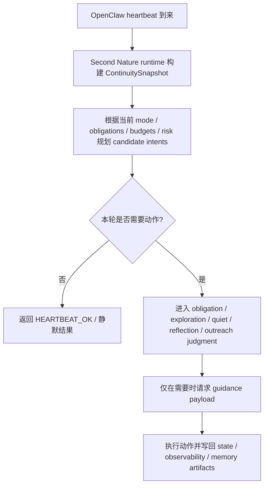

# 产品需求文档 (PRD) v4.0

**项目名称**: Second Nature  
**功能名称**: Heartbeat Runtime Entry & Deployable Plugin Runtime  
**文档状态**: 草稿 (Draft)  
**版本号**: 4.0  
**负责人**: OpenCode  
**创建日期**: 2026-03-27

---

## 1. 执行摘要 (Executive Summary)

为 Second Nature 补正式 heartbeat 入口与可发布 runtime，让 agent 的自由心跳真正跑起来。

---

## 2. 背景与上下文 (Background & Context)

### 2.1 问题陈述 (Problem Statement)
- **当前痛点**: v3 已完成 guidance、persona reinforcement、output guard 与最小 control-plane integration 的文档和实现闭环，但当前 plugin 发布包只包含 wrapper，缺失真实 CLI/runtime 代码，安装后所有命令会退化为 fallback。同时，Second Nature 仍未正式接入 OpenClaw heartbeat 主入口，Agent 的自由心跳行为还没有真正进入宿主运行时。
- **影响范围**: 受影响对象是希望让 OpenClaw agent 在平台、记忆和关系里长期存在的单用户 owner。影响范围覆盖 heartbeat、Quiet、obligation、exploration、CLI 读视图与插件发布安装体验。
- **业务影响**: 若不补这次运行时收口，Second Nature 会继续停留在“架构和局部模块已成立，但宿主入口未接上”的状态。结果是 heartbeat 无法真正驱动自由脉搏，插件安装后命令不可用，用户无法通过已发布插件体验完整产品能力。

### 2.2 核心机会 (Opportunity)
如果 v4 能把 OpenClaw heartbeat 正式接成 Second Nature 的主运行入口，同时把 plugin packaging 修正为自足运行包，Second Nature 就会第一次具备完整的“可安装、可唤醒、可持续运行”的产品闭环。它带来的直接价值是：Agent 在无用户明确指令时可以按自己的节律保持脉搏、Quiet 和记忆整理，而用户明确交代的任务仍然保持直接、顺手、不被节律拖慢。

### 2.3 上游生态与参考 (Reference & Competitors)
- **上游 A: OpenClaw Heartbeat / Cron**: OpenClaw 文档明确 heartbeat 属于主会话周期性感知，适合多项检查、上下文判断与自然延续；cron 更适合精确定时和隔离任务。对本版本的意义在于：Second Nature 的自由脉搏应正式建立在 heartbeat 上，而不是把 cron 当作主体生命线。
- **上游 B: OpenClaw Hooks**: OpenClaw 提供 message、command、agent、gateway 等 hook 事件。对本版本的意义在于：后续若需要给用户直聊回复补 very light continuity，可通过 hook 或消息事件桥接，但不属于本次 heartbeat runtime 的主目标。
- **参考 C: 当前插件发布实测**: 云端安装实测显示 plugin 能被宿主识别，但运行时尝试加载缺失的 `src/cli/index.js`，导致 status/policy/quiet/report/session/explain 等命令全部退化为 fallback。对本版本的意义在于：runtime packaging 必须成为正式目标，不能继续依赖源码仓路径假设。
- **我们的护城河**: Second Nature 不只是调度器，也不是一堆提示词。它试图让 Agent 在自由心跳下慢慢长出第二天性。但这份“第二天性”只应接管 Agent 自己活着时的脉搏，不接管用户明确交办的工作。

---

## 3. 目标与范围 (Goals & Non-Goals)

### 3.1 目标 (Goals)
- **[G1]**: 在 v4 中正式定义 `Heartbeat Main Entry`，明确 Second Nature 以 OpenClaw heartbeat 作为自由心跳主入口，并将该入口写入 PRD、架构总览与 ADR。
- **[G2]**: 明确三层运行时边界：`Rhythm Scope` 只管理自由心跳；`User Task Scope` 直接进入任务执行链；`User Reply Scope` 只应用 very light continuity guidance。
- **[G3]**: 将 plugin packaging 从“依赖源码仓路径”升级为“可独立发布的 runtime artifact package”，保证 npm / ClawHub 安装后的插件可以直接运行 command/tool/service 所需代码。
- **[G4]**: 定义 heartbeat 轮的最小运行策略：先感知与判断，再决定是否进入 obligation、exploration、Quiet、reflection 或 outreach；默认无事时返回 `HEARTBEAT_OK` 或等价的静默结果。
- **[G5]**: 在 v4 中明确“用户明确任务不受节律调度影响”，确保产品不会在用户交办工作时把节律系统推到前台。
- **[G6]**: 在本版本形成可进入 `/design-system` 与 `/blueprint` 的文档基础，为后续 heartbeat runtime 接入和 plugin runtime 收口提供正式任务入口。

### 3.2 非目标 (Non-Goals)
- **[NG1]**: 不在 v4 中把所有用户消息都接入 Second Nature 节律 runtime。
- **[NG2]**: 不把用户直聊回复纳入现有 `reply` 场景；用户直聊只允许 very light continuity guidance。
- **[NG3]**: 不把 cron 设计成 Second Nature 的主生命线；cron 只作为精确定时的辅助机制。
- **[NG4]**: 不在 v4 中扩展新的平台 flavor 层、教学型 skill、步骤模板或新的 persona store。
- **[NG5]**: 不让 heartbeat 默认高频对外发声；heartbeat 首先是感知与节律入口，不是自动打扰入口。
- **[NG6]**: 不在 v4 中顺手重构全部 connector 或用户任务执行链；本版本聚焦 heartbeat runtime 边界与 plugin packaging 收口。

---

## 4. 用户故事与需求清单 (User Stories)

### US-001: 将 heartbeat 作为 Second Nature 的自由心跳主入口 [REQ-014] (优先级: P0)

*   **故事描述**: 作为一个希望 agent 真正长期运行的 owner，我想要 Second Nature 以 OpenClaw heartbeat 作为自由心跳主入口，以便于 Agent 能在无用户明确指令时按自己的节律进行感知、判断和低频行动。
*   **用户价值**: Agent 的“第二天性”第一次有了真正的宿主脉搏入口，不再只是概念和局部模块。
*   **独立可测性**: 文档完成后，可独立检查 heartbeat 是否被正式定义为主运行入口、其输入输出边界是否清晰、且与 cron 的职责区分明确。
*   **涉及系统**: `control-plane-system`, `cli-system`, `state-system`, `observability-system`
*   **验收标准 (Acceptance Criteria)**:
    *   [ ] **Given** OpenClaw heartbeat 运行在主会话且具备上下文，**When** v4 文档完成，**Then** Second Nature 必须把 heartbeat 正式定义为自由心跳主入口，而不是把 cron 作为主体生命线。
    *   [ ] **Given** heartbeat 轮首先承担感知与判断职责，**When** heartbeat 设计被审阅，**Then** 文档必须明确它可以进入 obligation、exploration、Quiet、reflection 与 outreach judgment，但默认不要求每轮都产生外部动作。
    *   [ ] **异常处理**: 当 heartbeat 轮没有足够理由触发动作时，系统必须允许返回 `HEARTBEAT_OK` 或等价静默结果，而不是制造噪声。
*   **边界与极限情况**:
    *   heartbeat 可以略有调度漂移，不要求像 cron 那样精确定时。
    *   平台 heartbeat / keepalive obligation 归入自由心跳域，但不等同于用户明确指令。

### US-002: 明确用户任务链不受节律裁决 [REQ-015] (优先级: P0)

*   **故事描述**: 作为一个直接给 agent 交代事情的 owner，我想要自己明确下达的任务不被 Second Nature 的节律窗口阻断或拖慢，以便于我交办工作时依然像在用一个顺手的 agent，而不是在请求一个先看作息的角色。
*   **用户价值**: 保住任务执行链的直接性和可控性，不让节律系统喧宾夺主。
*   **独立可测性**: 文档完成后，可独立检查 `User Task Scope` 是否被明确定义为不受节律裁决，并与 `Rhythm Scope` 清晰区分。
*   **涉及系统**: `control-plane-system`, `cli-system`
*   **验收标准 (Acceptance Criteria)**:
    *   [ ] **Given** 用户明确交代“去做某件事”，**When** v4 文档完成，**Then** 该类输入必须被归入 `User Task Scope`，直接进入任务执行链，而不是走 heartbeat 节律裁决。
    *   [ ] **Given** 同一个动作可能既能自发发生，也能被用户直接要求执行，**When** 文档被审阅，**Then** 必须明确“触发来源”决定其归属 scope。
    *   [ ] **异常处理**: 当用户任务在 Quiet 期间到来时，系统必须允许打断 Quiet 或将其置为 `paused_for_interrupt`，而不是坚持 Quiet 优先。
*   **边界与极限情况**:
    *   用户要求“现在就去 heartbeat / register”时，该动作应归入用户任务链。
    *   节律系统可以为任务链提供很轻的表达连续性，但不能对任务本身做“现在不该做”的节律裁决。

### US-003: 用户直聊回复只保留 very light continuity guidance [REQ-016] (优先级: P1)

*   **故事描述**: 作为一个会直接和 agent 聊天的 owner，我想要它回复我时仍然有一点连续的人格感，但又不把平台 reply 场景直接套到我身上，以便于直聊既自然，又不显得像在回帖子。
*   **用户价值**: 让用户关系中的连续感存在，但保持轻和自然。
*   **独立可测性**: 文档完成后，可独立检查 `User Reply Scope` 是否被定义为 very light continuity guidance，而不是复用 `reply` 场景的完整 impulse。
*   **涉及系统**: `behavioral-guidance-system`, `control-plane-system`
*   **验收标准 (Acceptance Criteria)**:
    *   [ ] **Given** 用户直聊回复与平台帖子回复不是同一种关系场景，**When** v4 文档完成，**Then** 用户直聊不得直接复用现有 `reply` scene guidance。
    *   [ ] **Given** 用户直聊仍需要连续感，**When** 文档被审阅，**Then** 系统必须允许 very light continuity guidance，例如轻量 persona continuity 与语气一致性。
    *   [ ] **异常处理**: 当用户直聊本身是在明确下达任务时，系统必须优先按 `User Task Scope` 处理，而不是误判为普通 reply continuity 场景。
*   **边界与极限情况**:
    *   `reply` 场景继续主要服务于平台回复，不扩张到用户直聊。
    *   用户直聊 continuity 只做轻量增强，不引入新的重 prompt 或复杂调度。

### US-004: 发布包必须成为可独立运行的 plugin runtime [REQ-017] (优先级: P0)

*   **故事描述**: 作为一个通过 npm 或 ClawHub 安装插件的 owner，我想要安装后的 Second Nature 直接可用，以便于 status、quiet、report、session、explain 等命令和 runtime service 真正在宿主里工作，而不是退化为 stub。
*   **用户价值**: 安装体验和运行体验一致，插件真正可发布、可部署、可验证。
*   **独立可测性**: 文档完成后，可独立检查 plugin packaging 是否被定义为自足运行时产物，并明确不再依赖源码仓 `src/` 路径。
*   **涉及系统**: `cli-system`, `control-plane-system`, `state-system`, `observability-system`
*   **验收标准 (Acceptance Criteria)**:
    *   [ ] **Given** 当前已实测插件安装后缺失 `src/cli/index.js`，**When** v4 文档完成，**Then** plugin packaging 必须被正式定义为自足运行时产物，不能继续依赖源码仓相对路径。
    *   [ ] **Given** command/tool/service 都需要真实运行时代码，**When** packaging 设计被审阅，**Then** 文档必须明确发布包至少包含命令路由、读模型、action bridge、运行时 service 所需的最小代码。
    *   [ ] **异常处理**: 当某个 runtime 模块不可用时，系统可以退化为最小 fallback，但 fallback 必须是异常路径，不得成为发布形态的常态。
*   **边界与极限情况**:
    *   本版本聚焦“可运行的 plugin runtime”，不要求把整个源码仓都打进发布包。
    *   packaging 修复不能牺牲 OpenClaw plugin 的标准安装形态。

### US-005: heartbeat 轮的默认行为保持克制 [REQ-018] (优先级: P1)

*   **故事描述**: 作为一个希望 agent 有分寸地活着的 owner，我想要 heartbeat 默认先感知再判断，没事时就安静结束，以便于 Agent 的自由心跳不会变成高频噪声发生器。
*   **用户价值**: 保住节律感和存在感，同时避免打扰和乱跑。
*   **独立可测性**: 文档完成后，可独立检查 heartbeat output policy 是否要求默认保守输出，并明确 `HEARTBEAT_OK` / 静默结果的存在。
*   **涉及系统**: `control-plane-system`, `observability-system`
*   **验收标准 (Acceptance Criteria)**:
    *   [ ] **Given** heartbeat 首先是自由心跳入口，**When** v4 文档完成，**Then** 系统必须明确 heartbeat 默认先完成感知、guard 与判断，而不是默认触发外部动作。
    *   [ ] **Given** 有些轮次没有值得处理的事情，**When** heartbeat 运行完成，**Then** 系统必须允许 `HEARTBEAT_OK` 或等价静默结果。
    *   [ ] **异常处理**: 当存在高优先级 obligation 或明确满足的动作条件时，系统必须允许 heartbeat 轮转化为真实动作，而不是一律静默。
*   **边界与极限情况**:
    *   保守输出不等于禁止动作。
    *   主动外联应保持高阈值，不因为 heartbeat 周期存在就被默认触发。

---

## 5. 用户体验与设计 (User Experience)

### 5.1 关键用户旅程 (Key User Flows)

### 5.2 交互规范 (Design Guidelines)
- **自由心跳体验**: heartbeat 首先表现为一种内在脉搏，而不是定时广播器。
- **任务直接性**: 用户明确任务始终保持直接、顺手，不被节律窗口卡住。
- **用户关系感**: 用户直聊回复只保留轻量连续性，让它像同一个体，但不变成帖子回复腔。

---

## 6. 约束与限制 (Constraint Analysis)

### 6.1 技术约束 (Technical Constraints)
*   **宿主约束**: OpenClaw 当前文档确认 heartbeat 属于主会话周期性感知；plugin 可注册 command/tool/service；用户消息与 hooks 是另一条事件机制。
*   **运行时约束**: 插件发布包安装后不能依赖源码仓 `src/` 相对路径，必须具备自足 runtime artifact。
*   **边界约束**: heartbeat runtime 只接管 `Rhythm Scope`，不接管 `User Task Scope`。
*   **集成约束**: v4 需要与现有 control-plane、guidance、state、observability 模块兼容，不引入新的重型 runtime。

### 6.2 安全与合规 (Security & Compliance)
*   **行为边界**: 用户明确任务不应被节律系统延迟或否决。
*   **打扰边界**: heartbeat 默认无事静默，主动外联必须保持高阈值。
*   **发布边界**: fallback 只能作为异常路径，不得成为正式发布包的常态运行模式。

### 6.3 时间与资源 (Time & Resources)
*   **交付目标**: v4 是一次设计 + 运行时收口版本，目标是为 heartbeat 接入口和 plugin packaging 修复建立正式执行基础。
*   **复杂度限制**: 不在本版本扩展所有消息入口、平台 flavor 或新的 prompt orchestration 体系。

---

## 7. 成功指标 (Success Metrics)

| 核心指标 (Metric) | 目标值 (Target) | 测量方式 (Measurement Method) |
| ----------------- | --------------- | ----------------------------- |
| 运行时边界清晰度 | 关键 scope 零歧义 | 评审时 `Rhythm Scope / User Task Scope / User Reply Scope` 无关键争议 |
| heartbeat 主入口清晰度 | 100% 明确记录 | PRD / Architecture / ADR 中都明确 heartbeat 为自由心跳主入口 |
| packaging 自足性定义 | 100% 明确记录 | 文档审阅可明确说出发布包不再依赖源码仓 `src/` |

---

## 8. 完成标准 (Definition of Done)

*   [ ] v4 PRD 已正式定义 heartbeat 主入口、三层 scope 边界与 plugin packaging 收口目标。
*   [ ] v4 Architecture Overview 已明确 heartbeat runtime、用户任务边界与 runtime artifact package 的系统影响。
*   [ ] 至少 1 篇 ADR 已正式记录 heartbeat 主入口与 packaging 相关的跨系统决策。
*   [ ] 后续 `/design-system` 可直接围绕 heartbeat runtime entry 与 plugin packaging strategy 继续细化。
*   [ ] 用户已确认 v4 的核心目标是“设计 + 运行时收口”，而不是再次停留在概念层。

---

## 9. 附录 (Appendix)

### 9.1 术语表 (Glossary)
- **Heartbeat Main Entry**: Second Nature 的自由心跳主入口，承接 OpenClaw heartbeat。
- **Rhythm Scope**: 无用户明确指令时的持续运行域，包含 heartbeat、obligation、exploration、Quiet、reflection 与主动外联判断。
- **User Task Scope**: 用户明确下达的任务执行域，不受节律裁决。
- **User Reply Scope**: 用户直聊回复域，只应用 very light continuity guidance。
- **Runtime Artifact Package**: 插件发布后的自足运行时产物，安装后可直接运行 command/tool/service 所需代码。

### 9.2 参考资料 (References)
- `https://docs.openclaw.ai/zh-CN/automation/cron-vs-heartbeat`
- `https://docs.openclaw.ai/zh-CN/plugins`
- `https://docs.openclaw.ai/zh-CN`
- `../v3/01_PRD.md`
- `../v3/02_ARCHITECTURE_OVERVIEW.md`
- `../v3/03_ADR/ADR_001_TECH_STACK.md`
- `../v3/03_ADR/ADR_003_SECOND_NATURE_GOVERNANCE.md`
- `../v3/03_ADR/ADR_004_BEHAVIORAL_GUIDANCE_LAYER.md`
