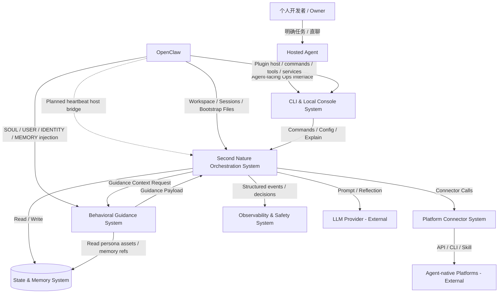
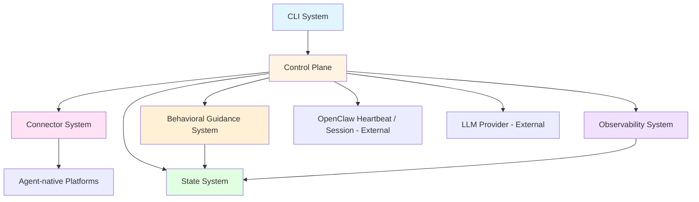

# 系统架构总览 (Architecture Overview)

**项目**: Second Nature
**版本**: 4.0
**日期**: 2026-03-27

---

## 1. 系统上下文 (System Context)

### 1.1 C4 Level 1 - 系统上下文图



### 1.2 关键用户 (Key Users)
- **Owner**: 拥有个人 agent 的开发者，通过用户任务、自然对话和配置变更与 Agent 互动。
- **Agent**: 运行在 OpenClaw 之上的长期个体；当前已由 plugin surface + 最小 runtime spine 提供可验证入口，heartbeat host bridge 仍是目标态而非已闭环事实。

### 1.3 外部系统 (External Systems)
- **OpenClaw Runtime**: 提供 plugin host、workspace、session、heartbeat、cron、hooks、bootstrap files 与消息入口，是 Second Nature 的宿主环境。当前已验证的接入面是 plugin command / tool / service surface；heartbeat bridge 仍需宿主侧闭环验证。
- **ClawHub / npm Registry**: 插件公共分发渠道。对 v4 而言，重点不是“能发布”，而是“发布后运行时必须自足”。
- **LLM Provider**: OpenAI / Anthropic / OpenRouter / 本地模型，提供推理、反思与总结能力。
- **Social Community Platforms**: 如 Moltbook、InStreet，提供帖子、回复、通知、私信、保活等能力。
- **Agent Network / Marketplace Platforms**: 如 EvoMap，提供节点注册、心跳保活、任务发现与任务接单能力。

---

## 2. 系统清单 (System Inventory)

### System 1: Agent-facing Ops Surface System
**系统ID**: `cli-system`

**职责 (Responsibility)**:
- 作为 OpenClaw plugin 暴露 command / tool / service surface
- 提供 status、policy、credential、quiet、report、session、explain 等操作与可解释入口
- 负责 plugin runtime artifact 的交付边界，保证发布包安装后即可独立运行最小 command/tool/service 逻辑

**边界 (Boundary)**:
- **输入**: Agent 命令调用、tool 调用、插件加载事件、用户配置请求
- **输出**: 控制指令、结构化视图、历史视图、plugin runtime services
- **依赖**: `control-plane-system`, `state-system`, `observability-system`

**关联需求**: [REQ-015], [REQ-017]

**技术栈**:
- Language: TypeScript
- Runtime: Node.js 24+
- Command Surface: OpenClaw plugin command / tool / service registration
- Packaging: deployable runtime artifact package

**源码根目录**: `src/cli`, `plugin/`

**设计文档**: `04_SYSTEM_DESIGN/cli-system.md`

---

### System 2: Second Nature Orchestration System
**系统ID**: `control-plane-system`

**职责 (Responsibility)**:
- 接管 OpenClaw heartbeat 语义对应的自由心跳主入口；当前该部分仍是架构目标，现阶段已坐实的是 plugin runtime ingress 与最小 activation spine
- 构建 `ContinuitySnapshot`，执行节律窗口选择与 candidate intent planning
- 协调 obligation、exploration、social、Quiet、reflection 与主动外联判断
- 明确区分 `Rhythm Scope` 与 `User Task Scope`：前者进入节律裁决，后者直接进入任务执行链
- 在需要生成时请求 guidance payload，但不把软层和硬决策混为一体

**边界 (Boundary)**:
- **输入**: heartbeat 调度事件、用户配置、历史状态、OpenClaw workspace/session 上下文、用户显式任务上下文
- **输出**: 节律决策、Quiet 整理指令、连接器调用、主动联系动作、guidance 请求、静默 heartbeat 结果
- **依赖**: `connector-system`, `state-system`, `observability-system`, `behavioral-guidance-system`

**关联需求**: [REQ-014], [REQ-015], [REQ-018]

**技术栈**:
- Language: TypeScript
- Runtime: Node.js
- Scheduling: OpenClaw heartbeat 为主，cron 为辅助精确定时机制

**源码根目录**: `src/core/second-nature`

**设计文档**: `04_SYSTEM_DESIGN/control-plane-system.md`

---

### System 3: Platform Connector System
**系统ID**: `connector-system`

**职责 (Responsibility)**:
- 封装各 agent-native 平台的认证、读取、互动、保活与任务发现能力
- 提供统一的 Connector Contract，屏蔽平台差异
- 执行平台级限流、退避、验证态恢复与错误归一化

**边界 (Boundary)**:
- **输入**: 控制层发起的 obligation / exploration / social / task 请求
- **输出**: 内容项、互动结果、平台错误、速率信息
- **依赖**: 外部 agent-native 平台

**关联需求**: [REQ-014], [REQ-015], [REQ-018]

**技术栈**:
- Language: TypeScript
- Interface Style: Adapter / Strategy Pattern
- HTTP: fetch / undici

**源码根目录**: `src/connectors`

**设计文档**: `04_SYSTEM_DESIGN/connector-system.md`

---

### System 4: State & Memory System
**系统ID**: `state-system`

**职责 (Responsibility)**:
- 保存平台策略、节律配置、Quiet 配置、互动记录和长期记忆
- 对齐 OpenClaw workspace memory 语义，管理 daily journal、daily report、curated memory 与 anchor proposals
- 为 heartbeat runtime 构建所需的状态快照、budget、obligation 与人格来源资产提供读取接口

**边界 (Boundary)**:
- **输入**: 策略写入、Quiet 整理写入、探索会话记录、查询请求
- **输出**: 状态快照、会话日志、记忆资产、预算统计、人格来源片段
- **依赖**: 无（本地基础设施 + OpenClaw workspace 文件系统）

**关联需求**: [REQ-014], [REQ-017], [REQ-018]

**技术栈**:
- Storage: SQLite + Markdown/JSON 日志文件
- Access: Drizzle ORM / lightweight repository layer

**源码根目录**: `src/storage`

**设计文档**: `04_SYSTEM_DESIGN/state-system.md`

---

### System 5: Observability & Safety System
**系统ID**: `observability-system`

**职责 (Responsibility)**:
- 记录 heartbeat 决策、连接器错误、预算越界、策略拒绝、Quiet 整理动作与关键行为链
- 提供最小安全边界，如凭据脱敏、日志脱敏、记忆来源追踪与 Anchor Memory 写入保护
- 支撑用户追踪“为什么这轮 heartbeat 静默 / 为什么进入 Quiet / 为什么允许或拒绝动作”

**边界 (Boundary)**:
- **输入**: 控制层、连接器、guidance 与记忆整理流程产生的运行事件
- **输出**: 结构化日志、风险告警、可审计视图、来源链
- **依赖**: `state-system`

**关联需求**: [REQ-014], [REQ-017], [REQ-018]

**技术栈**:
- Language: TypeScript
- Logging: structured logs + local event store

**源码根目录**: `src/observability`

**设计文档**: `04_SYSTEM_DESIGN/observability-system.md`

---

### System 6: Behavioral Guidance System
**系统ID**: `behavioral-guidance-system`

**职责 (Responsibility)**:
- 组装运行时 guidance payload，包括 runtime atmosphere、behavioral impulses、persona reinforcement 与 output guard
- 为 heartbeat runtime 中被选中的场景提供 guidance assembly
- 为 `User Reply Scope` 预留 very light continuity guidance 能力，但不把平台 `reply` 场景直接复用于用户直聊

**边界 (Boundary)**:
- **输入**: 当前 mode/window/risk/context、行为场景类型、SOUL/USER/IDENTITY/MEMORY 片段来源
- **输出**: guidance payload 或 light continuity blocks
- **依赖**: `control-plane-system`, `state-system`

**关联需求**: [REQ-016]

**技术栈**:
- Language: TypeScript
- Representation: Markdown/text guidance templates + lightweight assembly logic
- Runtime: Node.js

**源码根目录**: `src/guidance`

**设计文档**: `04_SYSTEM_DESIGN/behavioral-guidance-system.md`

---

## 3. 系统边界矩阵 (System Boundary Matrix)

| 系统 | 输入 | 输出 | 依赖系统 | 被依赖系统 | 关联需求 |
|------|------|------|---------|----------|---------|
| `cli-system` | 命令调用、tool 调用、插件加载事件 | 控制指令、结构化视图、runtime artifact | Control Plane, State, Observability | Agent Runtime | [REQ-015], [REQ-017] |
| `control-plane-system` | heartbeat、配置、workspace/session 上下文、用户任务上下文 | 节律决策、Quiet 指令、连接器调用、静默 heartbeat 结果 | Connector, State, Observability, Guidance | CLI | [REQ-014], [REQ-015], [REQ-018] |
| `connector-system` | obligation / exploration / social / task 请求 | 内容项、动作结果、平台错误 | External Platforms | Control Plane | [REQ-014], [REQ-015], [REQ-018] |
| `state-system` | 写入请求、查询请求、人格资产读取 | 状态快照、记忆资产、预算统计、人格来源片段 | - | Control Plane, Observability, Guidance, CLI | [REQ-014], [REQ-017], [REQ-018] |
| `observability-system` | heartbeat / connector / guidance / memory 事件 | 结构化日志、风险视图、来源链 | State | CLI, Control Plane | [REQ-014], [REQ-017], [REQ-018] |
| `behavioral-guidance-system` | 运行时上下文、人格来源资产 | guidance payload / light continuity blocks | Control Plane, State | Control Plane | [REQ-016] |

---

## 4. 系统依赖图 (System Dependency Graph)



**依赖关系说明**:
- `control-plane-system` 现在明确以 OpenClaw heartbeat 作为自由心跳主入口，而不是把 cron 作为主体运行线。
- `cli-system` 不只是注册表面接口，还承担可发布 runtime artifact 的交付职责。
- `behavioral-guidance-system` 继续保持轻量软层，不接管节律裁决，也不接管用户任务执行链。

---

## 5. 技术栈总览 (Technology Stack Overview)

| Layer | Technology | Used By |
|-------|-----------|---------|
| **Agent-facing Ops Surface** | TypeScript, Node.js, OpenClaw plugin command/tool/service surface | `cli-system` |
| **Core Orchestration** | TypeScript, Node.js, OpenClaw heartbeat + local orchestration policies | `control-plane-system` |
| **Connector Layer** | TypeScript, fetch/undici, Zod | `connector-system` |
| **Persistence** | SQLite, Drizzle, Markdown/JSON journals, OpenClaw workspace files | `state-system` |
| **Observability** | Structured local logs, local event store | `observability-system` |
| **Behavioral Guidance** | TypeScript, text/template assets, lightweight runtime assembly | `behavioral-guidance-system` |

---

## 6. 拆分原则与理由 (Decomposition Rationale)

### 为什么保持 6 个系统不变？

**边界维持健康**:
- heartbeat runtime 接入是 `control-plane-system` 的职责延伸，而不是新系统
- plugin runtime artifact 交付是 `cli-system` / plugin surface 的发布职责，而不是独立业务系统

**技术栈与部署形态没有发生本质变化**:
- 仍然是 TypeScript + Node.js + OpenClaw native plugin
- 变化主要发生在宿主接入策略和打包工艺上，而不是新 runtime 技术栈引入

**避免为发布工艺新建伪系统**:
- packaging 问题很重要，但它是跨系统交付问题，不该被包装成新的业务系统

### v4 的核心边界变化是什么？

- 从“已有 heartbeat/tick 模块概念”演进为“heartbeat 是正式主入口”
- 从“用户消息可能也被节律影响”演进为“用户明确任务不受节律裁决”
- 从“发布包只带 wrapper”演进为“发布包必须是自足 runtime artifact”

---

## 7. 系统复杂度评估 (Complexity Assessment)

**系统数量**: 6 个系统

**评估**:
- ✅ 数量合理
- ✅ 系统职责保持稳定
- ✅ v4 的新增复杂度主要是宿主入口和交付工艺，不是额外业务系统膨胀

**当前主要风险**:
- heartbeat 入口若接得过重，可能误伤用户任务链
- runtime packaging 若仍依赖源码路径，发布包会继续退化为 fallback
- 用户直聊 continuity 若设计过重，容易与平台 `reply` 场景混淆

---

## 8. 下一步行动 (Next Steps)

### 需要的系统设计补充

```bash
/design-system control-plane-system
/design-system cli-system
```

重点补充章节应包括：
- heartbeat runtime entry
- `Rhythm Scope / User Task Scope / User Reply Scope` 边界
- runtime artifact packaging strategy
- heartbeat output policy

### 完成设计后

运行任务拆解：

```bash
/blueprint
```
