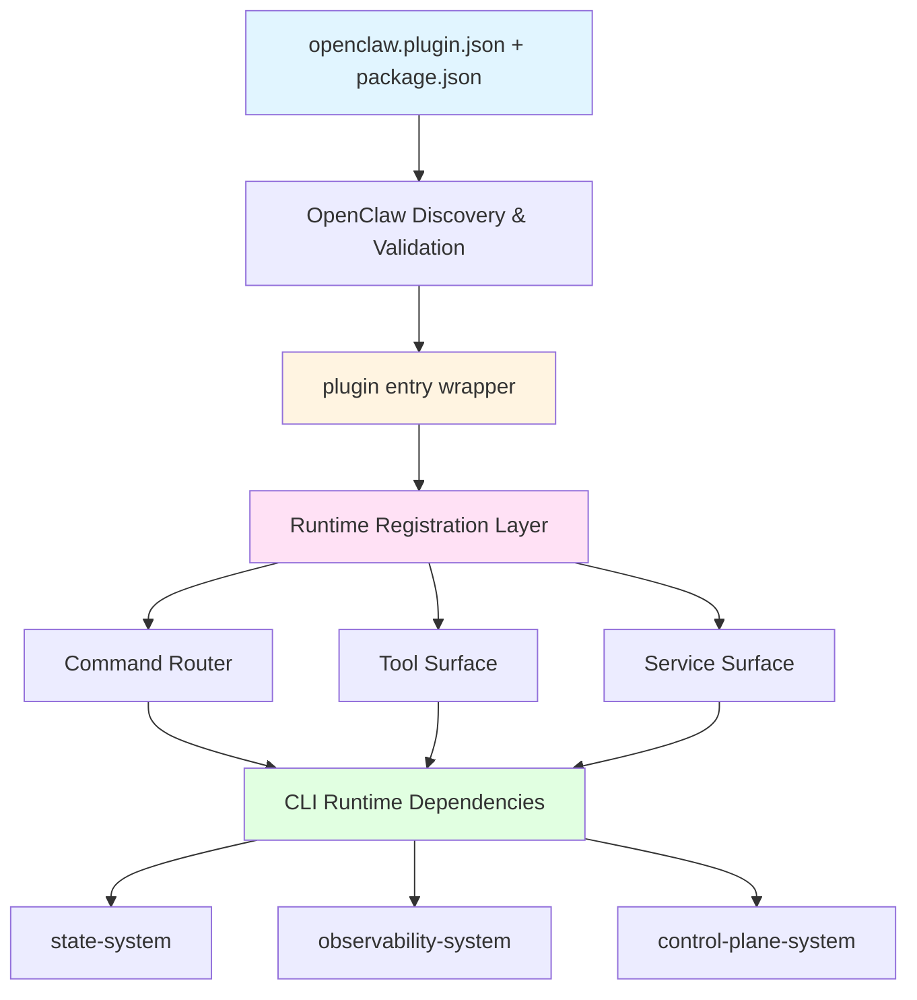
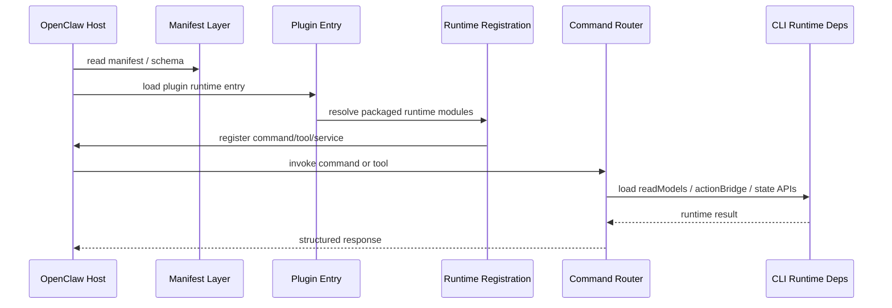
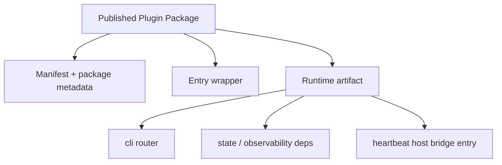
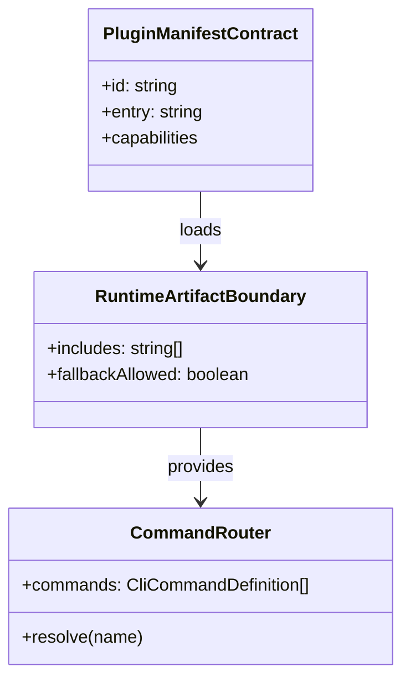

# CLI System 设计文档 (L0 — 导航层)

| 字段 | 值 |
| --- | --- |
| **System ID** | `cli-system` |
| **Project** | Second Nature |
| **Version** | 4.0 |
| **Status** | `Draft` |
| **Author** | OpenCode |
| **Date** | 2026-03-27 |
| **L1 Detail** | `本次不创建` — 当前设计重点是 plugin surface 与 runtime artifact 边界，不需要额外 L1 实现层 |

> [!IMPORTANT]
> **本次文档分层说明**
> - 本文件聚焦 command / tool / service 表面、manifest/runtime 分层与 plugin runtime artifact package。
> - 本次未触发 detail 文件创建条件：没有需要拆出的长篇伪代码、配置字典或实现层算法附录。

---

## 📋 目录 (Table of Contents)

| § | 章节 | 关键内容 |
| :---: | --- | --- |
| 1 | [概览](#1-概览-overview) | 系统目的、边界、职责 |
| 2 | [目标与非目标](#2-目标与非目标-goals--non-goals) | Goals / Non-Goals |
| 3 | [背景与上下文](#3-背景与上下文-background--context) | packaging 问题与宿主模型 |
| 4 | [系统架构](#4-系统架构-architecture) | plugin surface、runtime artifact、注册流程 |
| 5 | [接口设计](#5-接口设计-interface-design) | command / tool / service / manifest 合同；§5.1.1–5.1.2 host-safe |
| 6 | [数据模型](#6-数据模型-data-model) | manifest、runtime deps、artifact 结构 |
| 7 | [技术选型](#7-技术选型-technology-stack) | 主栈、构建与加载方式 |
| 8 | [Trade-offs](#8-trade-offs--alternatives-权衡与备选方案) | ADR 引用 + 本系统特有决策 |
| 9 | [安全性考虑](#9-安全性考虑-security-considerations) | 插件信任边界与 fallback 约束 |
| 10 | [性能考虑](#10-性能考虑-performance-considerations) | 启动成本、artifact 体积、加载路径 |
| 11 | [测试策略](#11-测试策略-testing-strategy) | 包内容验证、宿主安装验证、surface 验证 |
| 12 | [部署与运维](#12-部署与运维-deployment--operations) | npm / ClawHub / 本地路径分发 |
| 13 | [未来考虑](#13-未来考虑-future-considerations) | 更细粒度 artifact 拆分 |
| 14 | [附录](#14-appendix-附录) | 术语表、研究与参考 |

---

## 1. 概览 (Overview)

### 1.1 System Purpose (系统目的)

`cli-system` 在 v4 的核心意义已经从“命令集合”升级为“Second Nature 的 plugin surface 与 runtime artifact 交付边界”。

它负责两件同样重要的事：

- 把 Second Nature 暴露成 OpenClaw 可消费的 command / tool / service surface
- 保证通过 npm / ClawHub / 本地路径安装后的插件，真的带着运行时落到宿主里，而不是只带一层 wrapper

如果 `control-plane-system` 决定了 Agent 该怎么活，`cli-system` 决定的就是：这些能力最终怎么被宿主看见、怎么被安装、怎么在发布后真正跑起来。

### 1.2 System Boundary (系统边界)

- **输入 (Input)**:
  - OpenClaw plugin discovery / manifest validation
  - command / tool / service registration API
  - 用户配置、策略写入、解释请求
  - state / observability / control-plane runtime dependencies
- **输出 (Output)**:
  - `second-nature` command surface
  - `second_nature_ops` tool surface
  - `second-nature-runtime` / `second-nature-lifecycle` services
  - 可发布 runtime artifact package
  - manifest 与 config schema
- **依赖系统 (Dependencies)**: `control-plane-system`, `state-system`, `observability-system`, OpenClaw Runtime
- **被依赖系统 (Dependents)**: OpenClaw plugin host, Agent Runtime, Owner operator flows

### 1.3 System Responsibilities (系统职责)

**负责**:
- 声明和暴露 plugin manifest / command / tool / service surface
- 创建 command router 所需的最小 runtime 依赖图
- 为发布包定义自足 runtime artifact 边界
- 支撑 status / policy / credential / quiet / report / session / explain 这些 operator-facing 表面
- 为 heartbeat host bridge 暴露可被宿主消费的 service / tool / prompt bridge 入口

**不负责**:
- 不决定 heartbeat 轮该做什么（由 `control-plane-system` 负责）
- 不决定 connector 路由或平台策略（由 `connector-system` / `control-plane-system` 负责）
- 不承担 guidance 组装逻辑（由 `behavioral-guidance-system` 负责）
- 不把整个源码仓都打进发布包

---

## 2. 目标与非目标 (Goals & Non-Goals)

### 2.1 Goals

- **[G1]**: 发布包安装后即可独立运行 command / tool / service 所需的最小 runtime。
- **[G2]**: plugin manifest / config schema 与 runtime registration 明确分层，发现和配置验证不依赖执行插件代码。
- **[G3]**: command、tool、service 三个表面共享同一最小 runtime dependency graph，避免各自拉一套平行运行时。
- **[G4]**: heartbeat host bridge 能通过 service / tool / prompt bridge 中的至少一种稳定路径暴露给宿主，而不依赖源码仓路径。
- **[G5]**: fallback 保留为异常路径，而不是发布包常态。

### 2.2 Non-Goals

- **[NG1]**: 不在 cli-system 内重做 control-plane 逻辑。
- **[NG2]**: 不通过打包整个源码仓来掩盖运行时边界不清。
- **[NG3]**: 不把 bundle 兼容能力或 provider runtime hooks 当成当前主目标；本次重点是原生 plugin runtime。
- **[NG4]**: 不让 wrapper 继续依赖 `../src/*` 开发态路径假设。

---

## 3. 背景与上下文 (Background & Context)

### 3.1 Why This System? (为什么需要这个系统？)

Second Nature 的 v4 问题里，有一半不是“能力缺失”，而是“交付失败”。

云端实测已经证明：

- plugin 能被识别
- manifest 能被读到
- 安装能成功
- 但 runtime 找不到 `src/cli/index.js`
- 结果所有命令都 fallback

这说明当前的 `cli-system` 设计如果还停留在“命令长什么样”，就是避重就轻。

**关联 PRD 需求**: [REQ-015], [REQ-017]

### 3.2 Current State (现状分析)

- `plugin/index.ts`（宿主加载路径）负责同步注册 command / tool / service，并在 VM / sandbox 边界内使用 **host-safe command router**（`runtime_carrier_only`），不导入完整 workspace CLI runtime 依赖图
- 面向用户的完整 command router 仍存在于源码仓 `src/cli/`；发布包内的宿主路径与之刻意分离，以满足 ADR-006 的加载语义与 artifact 闭合
- wrapper 解析包内 runtime registration layer，而不是 `require("../src/...")`
- `second_nature_ops` / `second-nature` 已暴露 **shipping** `heartbeat_check`，并与仓库根 `HEARTBEAT.md` 对齐；宿主 bridge 闭环由 INT-S3 类验证承接，不等价于「所有 operator 命令均已接通完整 control-plane 读写路径」
- npm 发布包携带自足 runtime artifact；**社交连接器列表、真实 credential、policy/audit 证据链**在 host-safe 模式下多为合成或未实现，详见 §5.1.1

### 3.3 Constraints (约束条件)

- **宿主约束**:
  - OpenClaw 先读 manifest/schema，再决定 runtime 是否加载
  - 原生插件运行时代码在 Gateway 进程内执行
  - plugin API 不提供现成的 heartbeat callback；若要接入 heartbeat，必须通过宿主桥接策略落地
- **发布约束**:
  - 插件必须支持 npm / ClawHub / 本地路径安装
  - 发布包安装后不能依赖源码仓 `src/`
- **产品约束**:
  - heartbeat service 需要进入发布产物
  - operator-facing commands 也必须进入发布产物
- **复杂度约束**:
  - runtime artifact 要闭合，但不要求把整个源码仓塞进去

### 3.4 调研结论摘要

- 发布包当前失败的根因已经不再是“完全没有 runtime artifact”，而是要在 **宿主 host-safe 加载语义** 与 **完整 workspace runtime 能力** 之间维持清晰边界（参见 ADR-005 / ADR-006）
- 最稳的路线仍是保留 wrapper，但只允许它引用包内 runtime artifact
- fallback 值得保留，但不能继续当正式运行模式
- shipping bridge contract `HEARTBEAT.md + second_nature_ops("heartbeat_check")` 已随 T1.2.3 进入 plugin surface；宿主侧仍需对照 INT-S3 / 运维矩阵区分「bridge 可用」与「全量 operator 读写可用」
- packaging feasibility 的旧 `better-sqlite3` 风险结论需要持续刷新，因为当前 packaged runtime 已转到 `sql.js` 路径

完整调研见 `./_research/cli-system-research.md`。

---

## 4. 系统架构 (Architecture)

### 4.1 Architecture Diagram (架构图)



### 4.2 Core Components (核心组件)

| Component Name | Responsibility | Tech Stack | Notes |
| --- | --- | --- | --- |
| `Manifest Layer` | 声明 plugin id、capabilities、config schema | JSON | 宿主先于 runtime 读取 |
| `Plugin Entry Wrapper` | 最小入口，解析并加载包内 runtime registration | TypeScript | 不能再引用源码仓路径 |
| `Runtime Registration Layer` | 调用 `registerCommand` / `registerTool` / `registerService` | TypeScript | 负责把功能注册到宿主 |
| `Command Router` | 聚合 `status / policy / credential / quiet / report / session / explain / heartbeat_check` | TypeScript | 与 tool shell 共用同一 router；`heartbeat_check` 是当前 shipping host bridge 入口 |
| `CLI Runtime Dependencies` | 创建 stateDb / observabilityDb / stateApi / readModels / actionBridge | TypeScript | 这是发布包必须闭合的最小依赖图 |
| `Service Surface` | 暴露 `second-nature-runtime` 与 lifecycle service | TypeScript | 提供 runtime carrier / lifecycle truth，不单独充当 per-heartbeat callback |
| `Fallback Shell` | 提供极端场景的降级路径 | TypeScript | 只保留为异常路径 |

### 4.3 Data Flow (数据流)



**关键数据流说明**:
1. manifest 与 schema 必须在 runtime 执行前就能被宿主理解。
2. wrapper 只负责接到包内 runtime registration layer。
3. command / tool / service 共用同一套 runtime dependency graph。
4. `heartbeat_check` 作为 shipping bridge surface 必须与 `HEARTBEAT.md` 保持语义一致。
5. 发布包安装后，宿主不应再访问源码仓 `src/`。

### 4.4 Recommended Artifact Boundary



这个边界图表达的重点是“闭合依赖”，不是“固定目录名”。

---

## 5. 接口设计 (Interface Design)

### 5.1 操作契约表 (Operation Contracts)

| 操作 | [REQ-XXX] | 前置条件 | 消耗/输入 | 产出/副作用 | 实现细节 |
| --- | :---: | --- | --- | --- | :---: |
| `registerPluginSurface(api)` | [REQ-017] | plugin runtime entry 已加载 | OpenClaw plugin API | 注册 command / tool / service | 待 `/forge` |
| `resolvePackagedRuntime()` | [REQ-017] | 发布包内 runtime artifact 存在 | package-local runtime path | 包内 runtime registration layer | 待 `/forge` |
| `createCommandRouter()` | [REQ-017] | CLI runtime deps 可创建 | stateDb；observabilityDb；stateApi；readModels；actionBridge | command router 实例 | 待 `/forge` |
| `executeCommand(name, args?)` | [REQ-017] | command router 已可用 | command name；optional args | structured command result | 待 `/forge` |
| `executeTool(command, args?)` | [REQ-017] | tool shell 已注册 | tool params | 与 command 对齐的结果 | 待 `/forge` |
| `heartbeatCheck(args?)` | [REQ-014] | heartbeat shipping bridge 已进入 command/tool surface | optional heartbeat metadata | `HEARTBEAT_OK` 或结构化 heartbeat 决策结果 | 待 `/forge` |
| `startRuntimeService()` | [REQ-015] | service surface 已注册 | host service start context | 启动 packaged runtime carrier 与 lifecycle truth | 待 `/forge` |
| `runPackagingFeasibilityCheck()` | [REQ-017] | artifact 构建方案已初步确定 | jiti / native module / install flow assumptions | packaging feasibility report | 待 `/forge` |
| `fallbackUnavailable(command?)` | [REQ-017] | packaged runtime 不可用 | command / host context | 结构化 fallback result | 待 `/forge` |

#### 5.1.1 Host-safe carrier 表面矩阵（发布包在宿主中的真实语义）

> **适用范围**: 当前 npm 发布包在 Gateway 内加载的 **`createHostSafeRouter`** 路径（`bridge.serviceEntryMode: runtime_carrier_only`）。用于运维 smoke 与误判排障；完整读写能力与连接器真相以 workspace-attached full runtime 为准（参见 [ADR_006](../03_ADR/ADR_006_DEPLOYABLE_PLUGIN_RUNTIME_PACKAGE.md)、[ADR_005](../03_ADR/ADR_005_HEARTBEAT_RUNTIME_BOUNDARY.md)）。

| 命令 / tool `command` | 宿主侧典型结果 | 备注 |
| --- | --- | --- |
| `heartbeat_check` | `ok: true`，`heartbeat: HEARTBEAT_OK`，`data.bridge.serviceEntryMode: runtime_carrier_only` | 当前 **shipping** bridge；与 `HEARTBEAT.md` 配对验收 |
| `status` | `ok: true`；`data.connectors` / `data.credentials` 为空数组 | **合成占位**，不代表平台上真实连接器数量 |
| `credential`（`action: show` 等非 verify） | `ok: true`；`data.status: missing` | **合成占位**，不泄露 token |
| `quiet` / `report` | `ok: true`；多为占位字段 | 可读，不代表完整 Quiet / Report 内核已挂载 |
| `session` | 无 `sessionId` → `MISSING_SESSION_ID` | 契约要求显式 id |
| `explain` | 无 `args.subject` → `MISSING_EXPLAIN_SUBJECT`；合法 subject → `ok: true` 但结论为 minimal spine | 证据链需 full runtime |
| `policy`（show） / `audit` | `ok: false`，统一 host-safe 限制文案 | 未实现只读审计视图，不是网关崩溃 |
| **非法 command 名**（如拼接 `credential+show`） | `Unknown Second Nature command.` | **调用形态错误**；与上表功能边界区分 |

**Tool 调用形态**: `second_nature_ops` 参数必须为 `{ "command": "<name>", "args": { ... } }`（见 `plugin/index.ts` tool schema）。顶层只能出现一个路由命令名。

#### 5.1.2 `second_nature_ops` 参数示例与常见误判

##### 错误示例（会得到 `Unknown Second Nature command.`）

宿主侧工具会把 **顶层 `command`** 当作唯一路由键。下列形态不会命中任何已注册命令：

```json
{ "command": "credential+show" }
```

```json
{ "command": "credential show" }
```

##### 正确示例（与 `plugin/index.ts` tool schema 一致）

```json
{ "command": "heartbeat_check" }
```

```json
{ "command": "status" }
```

```json
{ "command": "credential", "args": { "action": "show", "platformId": "moltbook" } }
```

```json
{ "command": "explain", "args": { "subject": "decision:smoke-probe-001" } }
```

##### 常见误判排障

| 观测 | 优先判定 |
| --- | --- |
| `Unknown Second Nature command.` | **调用形态错误**（非法或拼接的 `command` 字符串），而非插件未加载 |
| `status.data.connectors` / `credentials` 为空数组 | **host-safe 合成占位**，不能单独当作「平台侧未连接」的证据 |
| `credential` 返回 `status: missing` | **预期占位**；真实凭证状态需 workspace-attached full runtime 或宿主既有存储路径验证 |
| `policy` / `audit` 返回统一 host-safe 限制文案 | **能力未在此 surface 开放**，不是 Gateway 崩溃 |
| `explain` → `MISSING_EXPLAIN_SUBJECT` | 未传 `args.subject`；补上 `decision:<id>` 等格式后再判故障 |
| 在 `~/.openclaw/*.json` 搜不到 EvoMap | 只说明该路径下配置未出现该关键字；connector 可能在其它配置路径或未接线 |

### 5.2 跨系统接口协议 (Cross-System Interface)

```ts
export interface CliRuntimeDeps {
  stateDb: StateDatabase;
  observabilityDb: ObservabilityDatabase;
  stateApi: StateAPI;
  readModels: CliReadModels;
  actionBridge: ActionBridge;
}

export interface CommandRouter {
  commands: CliCommandDefinition[];
  resolve(name: string): CliCommandDefinition | undefined;
}

export interface PluginSurfacePort {
  registerCommand(definition: unknown): void;
  registerTool(tool: unknown, options?: unknown): void;
  registerService(service: unknown): void;
}
```

### 5.3 Manifest / Runtime 分层摘要

| 层 | 负责什么 | 何时被宿主使用 |
| --- | --- | --- |
| Manifest / Config Layer | plugin id、capabilities、config schema | runtime 之前 |
| Runtime Registration Layer | command / tool / service 注册 | runtime 加载时 |
| Runtime Artifact Layer | command router、deps、service entry | command / tool / service 执行时 |

---

## 6. 数据模型 (Data Model)

### 6.1 核心实体 (Core Entities)

```ts
interface PluginManifestContract {
  id: string;
  name: string;
  version: string;
  entry: string;
  capabilities: {
    commands: string[];
    tools: string[];
    services: string[];
  };
}

interface RuntimeArtifactBoundary {
  includes: Array<'command_router' | 'read_models' | 'action_bridge' | 'state_runtime' | 'observability_runtime' | 'heartbeat_service_entry'>;
  fallbackAllowed: boolean;
}

interface PackagedCommandSurface {
  commandName: 'status' | 'policy' | 'credential' | 'quiet' | 'report' | 'session' | 'audit' | 'explain' | 'heartbeat_check';
  available: boolean;
}
```

### 6.2 实体关系图 (Entity Relationship)



### 6.3 数据流向 (Data Flow Direction)

- manifest 被宿主先读，用于发现与配置验证
- wrapper 再加载包内 runtime artifact
- runtime artifact 再连接 state / observability / control-plane 依赖
- command / tool / service 最终从同一运行时图上消费结果

---

## 7. 技术选型 (Technology Stack)

### 7.1 Core Technologies (核心技术)

| Domain | Choice | Rationale |
| --- | --- | --- |
| Plugin Surface | OpenClaw native plugin | 与宿主语义完全贴合 |
| Runtime Language | TypeScript + Node.js | 与主栈一致，避免跨语言 glue code |
| Packaging Model | deployable runtime artifact package | 解决安装后 runtime 缺失问题 |
| Config Contract | manifest + JSON schema | 让发现和验证先于 runtime 执行 |

### 7.2 Key Libraries/Dependencies (关键依赖)

- `state-system` 现有 snapshot / write APIs
- `observability-system` decision ledger / evidence query
- `behavioral-guidance-system` request / fallback 合同
- OpenClaw plugin registration API
- `sql.js` / SQLite runtime 路径（当前 packaged runtime 现实）；宿主安全加载边界与模块求值期 async bootstrap 需要继续验证

---

## 8. Trade-offs & Alternatives (权衡与备选方案)

### 8.1 继承的 ADR 决策

> **决策来源**: [ADR-001: 主技术栈与宿主运行时选择](../03_ADR/ADR_001_TECH_STACK.md)
>
> 本系统继续采用 TypeScript + Node.js + OpenClaw native plugin 形态，不在此重复主栈选择理由。

> **决策来源**: [ADR-006: 可发布的自足 Plugin Runtime Package](../03_ADR/ADR_006_DEPLOYABLE_PLUGIN_RUNTIME_PACKAGE.md)
>
> 本系统必须把发布包收成自足 runtime artifact，而不是继续依赖源码仓路径。

### 8.2 本系统特有决策

#### 决策 A: 保留 wrapper，但 wrapper 只能解析包内 runtime

**选择**:
- wrapper 保留为原生 OpenClaw plugin entry
- 但它只允许解析包内 runtime artifact

**为什么不选“直接让 wrapper 继续 require ../src/*”**:
- 这是当前失败根因
- 发布后路径立即失效

#### 决策 B: command / tool / service 共用同一 runtime dependency graph

**选择**:
- 三个表面统一走 `createCliRuntimeDeps()` 这一类最小依赖图

**为什么不选“每个表面自己拉一套依赖”**:
- 会加剧重复和漂移
- 更难验证发布包闭合边界

#### 决策 C: fallback 保留，但必须降级为异常路径

**选择**:
- fallback 仅用于 artifact 缺失或运行时损坏等极端场景

**为什么不选“默认 fallback 也可以接受”**:
- 那等于承认发布包默认不能运行
- 会掩盖真正的 packaging 缺口

#### 决策 D: packaging 先做 feasibility POC，再做全面收口

**选择**:
- 在大规模改 packaging 前，先验证 jiti、native module、`npm install --ignore-scripts` 与 artifact 闭合边界是否成立

**为什么不选“直接按乐观前提推进”**:
- `better-sqlite3` 这类依赖可能直接卡死整条路径
- challenge 在这里的提醒是成立的

#### 决策 E: `heartbeat_check` 进入 shipping command/tool surface

**选择**:
- 当前 shipping host bridge contract 采用 `HEARTBEAT.md + second_nature_ops("heartbeat_check")`
- 允许 `second-nature heartbeat_check` 保持 command parity，便于宿主外调试与验证

**为什么不选“只靠 service surface 暗示 bridge 已完成”**:
- service `start()` 只提供 runtime carrier / lifecycle truth
- 它不等于每轮 heartbeat 都已被宿主稳定注入
- 如果不把 `heartbeat_check` 进入 shipping surface，宿主就没有一条真实可消费的 bridge path

---

## 9. 安全性考虑 (Security Considerations)


- **插件信任边界**: 原生 OpenClaw 插件在进程内运行，发布包必须尽量最小化，只带运行所需 artifact。
- **manifest 安全边界**: 配置验证应先于 runtime 执行，避免用代码执行来换配置理解。
- **fallback 边界**: fallback 结果必须结构化且可见，不能默默把正式运行态吞成空壳。
- **command surface 安全边界**: `audit` 等尚未完善的命令可继续显式 not implemented，但这应是功能边界，不是 packaging 边界。

---

## 10. 性能考虑 (Performance Considerations)

- 包内 runtime 加载应尽量轻量，避免每次 plugin 注册时做重型初始化
- state / observability 依赖应在 command/service 真正使用时创建或懒加载，而不是在 manifest 阶段触发
- artifact package 体积应保持克制，不通过打包整个源码仓来换取“看起来能跑”

---

## 11. 测试策略 (Testing Strategy)

### 11.1 单元测试
- command router 构建与命令解析
- wrapper 到 packaged runtime 的解析路径
- fallback 仅在 runtime 缺失时触发
- packaging feasibility 检查结果能稳定区分可继续路径与阻塞风险

### 11.2 集成测试
- `status / credential / quiet / report / session / explain` 命令在 packaged runtime 下可正常运行
- tool shell `second_nature_ops` 与 command surface 返回一致结果
- `heartbeat_check` 已进入 shipping command/tool surface，且结果语义与 `HEARTBEAT.md` 对齐
- runtime service 继续提供 truthful runtime carrier / lifecycle 语义，不伪装成 per-heartbeat callback

### 11.3 发布验证
- `npm pack --dry-run` 验证 artifact 内容
- OpenClaw 云端安装后，`plugins info second-nature` 能看到 surface
- 安装后命令不再 fallback 到“packaging fallback mode”
- `heartbeat_check` 可被 `HEARTBEAT.md` 或等价调试入口稳定消费
- 当前 `sql.js` runtime 路径在目标宿主上要么可工作，要么已有明确宿主安全边界说明；不得继续把旧 `better-sqlite3` 叙事当主风险

---

## 12. 部署与运维 (Deployment & Operations)

- 支持本地路径、npm、ClawHub 三种安装方式
- 发布前必须检查：
  - manifest
  - wrapper
  - packaged runtime
  - heartbeat host bridge 候选入口
- 宿主重启后应能直接恢复 plugin surface，而无需依赖源码仓或手工补文件

---

## 13. 未来考虑 (Future Considerations)

- 后续可进一步把 runtime artifact 划分为更细的 build target，但当前阶段不需要过早复杂化
- 如果未来 plugin surface 继续扩张，可单独引入 provider/hook/runtime 子层，但不影响当前 artifact 边界
- 若将来需要 bundle 兼容层增强，那应作为另一个独立设计议题，不混进本次原生 plugin runtime 收口

---

## 14. Appendix (附录)

### 14.1 术语表 (Glossary)
- **Manifest Layer**: 宿主在 runtime 前读取的 plugin manifest / config schema 层。
- **Runtime Registration Layer**: 真正调用 `registerCommand` / `registerTool` / `registerService` 的运行时注册层。
- **Runtime Artifact Package**: 插件发布包中可独立运行的最小运行时产物。
- **Fallback Shell**: 在 artifact 缺失或损坏时返回的异常降级路径。

### 14.2 参考资料 (References)
- `./_research/cli-system-research.md`
- `../01_PRD.md`
- `../02_ARCHITECTURE_OVERVIEW.md`
- `../03_ADR/ADR_001_TECH_STACK.md`
- `../03_ADR/ADR_005_HEARTBEAT_RUNTIME_BOUNDARY.md`
- `../03_ADR/ADR_006_DEPLOYABLE_PLUGIN_RUNTIME_PACKAGE.md`
- `plugin/index.ts`
- `plugin/package.json`
- `src/cli/index.ts`
- `https://docs.openclaw.ai/zh-CN/tools/plugin`
