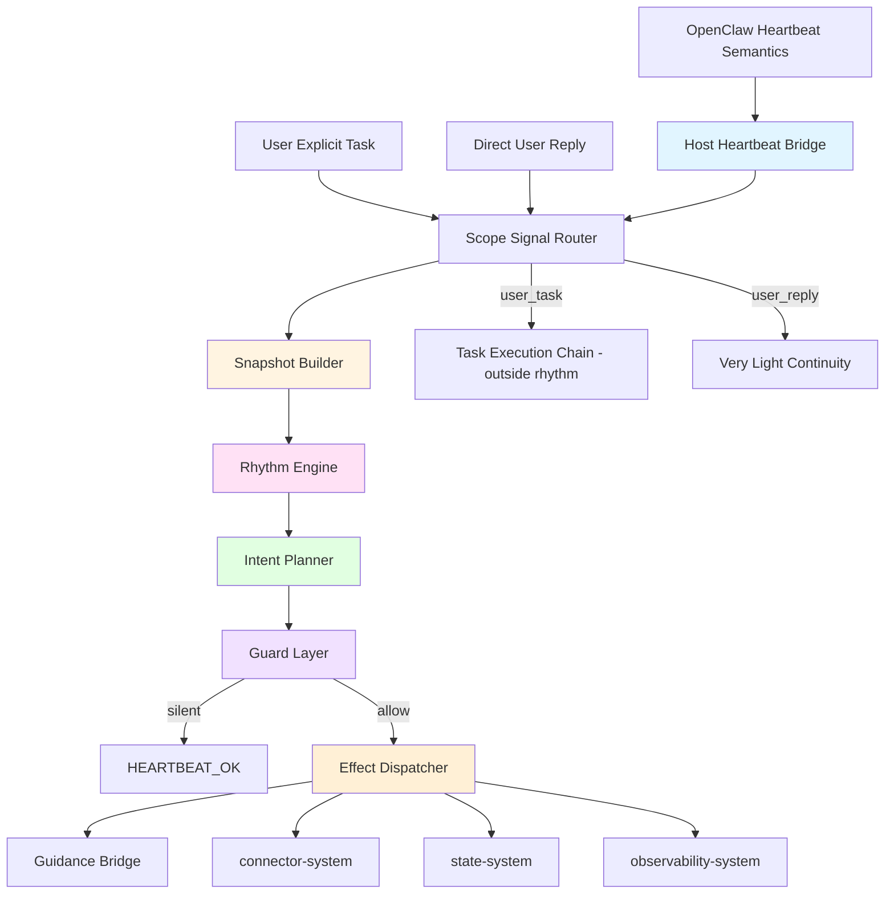
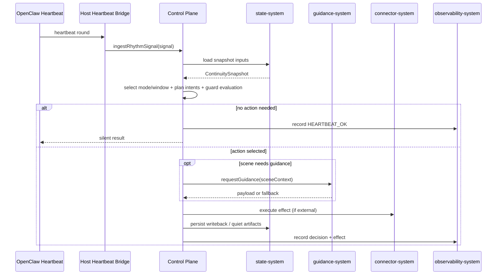
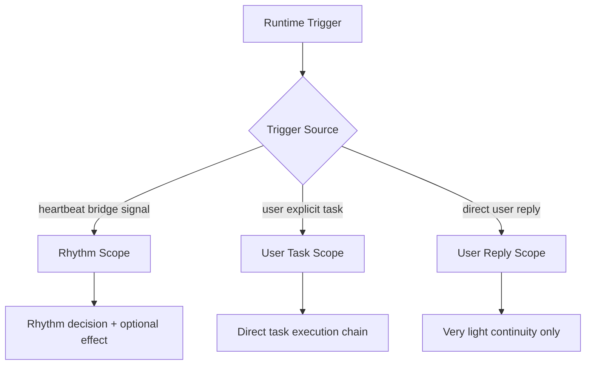
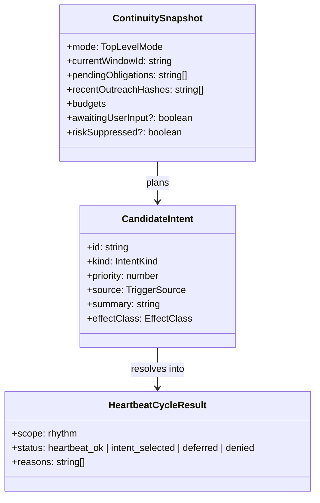

# Control Plane System 设计文档 (L0 — 导航层)

| 字段 | 值 |
| --- | --- |
| **System ID** | `control-plane-system` |
| **Project** | Second Nature |
| **Version** | 4.0 |
| **Status** | `Draft` |
| **Author** | OpenCode |
| **Date** | 2026-03-27 |
| **L1 Detail** | `本次不创建` — 当前设计重点在宿主入口、边界与运行合同，不需要额外 L1 实现层 |

> [!IMPORTANT]
> **本次文档分层说明**
> - 本文件聚焦 heartbeat 主入口、三层运行时边界、运行合同与控制面内部组件职责。
> - 本次未触发 detail 文件创建条件：没有需要长篇伪代码、配置常量字典或大体量实现层附录。

---

## 📋 目录 (Table of Contents)

| § | 章节 | 关键内容 |
| :---: | --- | --- |
| 1 | [概览](#1-概览-overview) | 系统目的、边界、职责 |
| 2 | [目标与非目标](#2-目标与非目标-goals--non-goals) | Goals / Non-Goals |
| 3 | [背景与上下文](#3-背景与上下文-background--context) | heartbeat 主入口的由来与约束 |
| 4 | [系统架构](#4-系统架构-architecture) | 架构图、核心组件、数据流 |
| 5 | [接口设计](#5-接口设计-interface-design) | heartbeat / user task / user reply 操作契约 |
| 6 | [数据模型](#6-数据模型-data-model) | snapshot、intent、scope、decision 结构 |
| 7 | [技术选型](#7-技术选型-technology-stack) | 核心技术与宿主接入方式 |
| 8 | [Trade-offs](#8-trade-offs--alternatives-权衡与备选方案) | ADR 引用 + 本系统特有决策 |
| 9 | [安全性考虑](#9-安全性考虑-security-considerations) | 任务边界、打扰边界、治理边界 |
| 10 | [性能考虑](#10-性能考虑-performance-considerations) | heartbeat 轮预算与静默默认值 |
| 11 | [测试策略](#11-测试策略-testing-strategy) | 合同测试、集成测试、宿主接入验证 |
| 12 | [部署与运维](#12-部署与运维-deployment--operations) | 宿主接入、可观测性、恢复 |
| 13 | [未来考虑](#13-未来考虑-future-considerations) | hooks 桥接、用户回复 continuity |
| 14 | [附录](#14-appendix-附录) | 术语表、研究与参考 |

---

## 1. 概览 (Overview)

### 1.1 System Purpose (系统目的)

`control-plane-system` 是 Second Nature 的高层连续性引擎。在 v4 中，它的中心变化很明确：

- heartbeat 被正式收口为主生命线，但不再被表述成 plugin 的天然回调入口
- 节律只控制 Agent 的自由心跳，不接管用户明确任务
- heartbeat 轮默认先感知和判断，没事时安静结束，而不是把每一轮都推成动作

这个系统不是通用调度器，也不是一个会接管所有对话入口的总控层。它存在的意义，是让 Agent 在没有用户明确指令时，依然能有分寸地活着。

### 1.2 System Boundary (系统边界)

- **输入 (Input)**:
  - OpenClaw heartbeat 语义及其可实现的宿主桥接信号
  - 用户配置与策略状态
  - workspace / session 上下文
  - state-system 提供的 snapshot、budget、memory、obligation
  - connector 结果与 runtime events
  - 用户显式任务上下文（通过显式入口 metadata 传入，仅用于 scope routing，不进入 rhythm gate）
- **输出 (Output)**:
  - 节律决策
  - Quiet / reflection 指令
  - connector 调用请求
  - 主动外联判断结果
  - `HEARTBEAT_OK` 或等价静默结果
  - 结构化 decision record
- **依赖系统 (Dependencies)**: `connector-system`, `state-system`, `observability-system`, `behavioral-guidance-system`, OpenClaw Runtime, LLM Provider
- **被依赖系统 (Dependents)**: `cli-system`, `observability-system`

### 1.3 System Responsibilities (系统职责)

**负责**:
- 接收 heartbeat bridge signal 并驱动自由心跳决策
- 构建 `ContinuitySnapshot`
- 选择当前 mode / window / intent
- 判断何时进入 obligation、exploration、Quiet、reflection、outreach judgment
- 明确区分 `Rhythm Scope`、`User Task Scope` 与 `User Reply Scope`
- 为允许/拒绝/静默结果生成可审计 decision record

**不负责**:
- 不接管用户明确任务的执行链
- 不直接操作外部平台（由 `connector-system` 负责）
- 不直接持久化记忆资产（由 `state-system` 负责）
- 不把用户直聊回复纳入平台 `reply` 场景
- 不把 cron 升格为主体生命线

---

## 2. 目标与非目标 (Goals & Non-Goals)

### 2.1 Goals

- **[G1]**: heartbeat 作为本系统唯一主运行入口被正式定义，并贯穿所有运行合同。
- **[G2]**: heartbeat 轮默认完成一次轻量感知与判断，正常情况下可在 P95 < 2s 内收敛到静默结果或动作决策。
- **[G3]**: `Rhythm Scope / User Task Scope / User Reply Scope` 三层边界零歧义。
- **[G4]**: 每次 heartbeat 轮都能形成可审计 decision record，包括 `HEARTBEAT_OK` 路径。
- **[G5]**: Quiet、reflection、obligation 与 exploration 统一进入 heartbeat runtime，而不是分散成多条互相竞争的调度线。

### 2.2 Non-Goals

- **[NG1]**: 不把所有用户消息都纳入节律裁决。
- **[NG2]**: 不让 heartbeat 默认高频对外发声。
- **[NG3]**: 不使用 cron 取代 heartbeat 作为主体生命线。
- **[NG4]**: 不把用户直聊 continuity 做成完整 `reply` scene。
- **[NG5]**: 不在本系统内处理 plugin packaging 问题本身；该问题的交付边界属于 `cli-system`。

---

## 3. 背景与上下文 (Background & Context)

### 3.1 Why This System? (为什么需要这个系统？)

Second Nature 在 v3 之前，已经有了不少“像 heartbeat”的内部模块：

- `ContinuitySnapshot`
- `IntentPlanner`
- `requestGuidance()`
- connector heartbeat capability

但真正缺的是“OpenClaw heartbeat 轮次如何通过宿主桥接进入 Second Nature，而不是谁来接一个并不存在的 plugin callback”。

如果没有这层正式设计，系统就会继续停在一种尴尬状态：

- 内部模块像是 ready 了
- 宿主入口却还没接上
- 用户任务链和自由心跳链的边界也会一直悬着

**关联 PRD 需求**: [REQ-014], [REQ-015], [REQ-018]

### 3.2 Current State (现状分析)

- 当前实现里已有 `planIntent()`、`evaluateOutreach()`、`quiet-pipeline` 等内部模块
- `plugin` 里注册了 `second-nature-runtime` service，但 `start()` 仍是空壳
- 目前“用户明确任务是否受节律影响”还没有正式写成运行合同
- OpenClaw heartbeat 文档已经明确了主会话周期性感知语义，但 plugin API 并未暴露直接 heartbeat 回调，说明真正的问题在于宿主桥接设计

### 3.3 Constraints (约束条件)

- **技术约束**:
  - 必须运行在 OpenClaw heartbeat 语义之上
  - heartbeat 运行在主会话中，但不是 plugin 直接事件
  - cron 仅用于精确定时或辅助触发
- **边界约束**:
  - 用户明确任务不受节律裁决
  - 用户直聊回复不进入平台 `reply` scene
  - guidance 仍只做软层 assembly，不接管硬决策
  - runtime scope 分类必须依赖桥接协议、入口类型或显式 signal metadata，而不是宿主天然分类
- **性能约束**:
  - heartbeat 轮默认是轻量判断，不应把每轮都推成高成本动作
  - 无事静默应是第一默认路径
- **安全约束**:
  - 任何对外动作都必须有 decision record
  - 主动外联要高阈值，不能因为 heartbeat 存在就默认触发

### 3.4 调研结论摘要

- OpenClaw heartbeat 本来就是主会话中的周期性智能体轮次，非常适合做 Second Nature 的自由脉搏语义基础
- `HEARTBEAT_OK` 是一个很健康的默认协议，不是鸡肋
- 用户任务和自由心跳必须明确分链，否则会把产品体验搞拧巴
- 控制层的核心不是“自动做事”，而是“在被桥接进来的 heartbeat 轮里做有分寸的判断”
- `HEARTBEAT.md` 可作为宿主 heartbeat 行为指导文件，是候选桥接路径的一部分，但不能单独替代 bridge contract 本身

完整调研见 `./_research/control-plane-system-research.md`。

---

## 4. 系统架构 (Architecture)

### 4.1 Architecture Diagram (架构图)



### 4.2 Core Components (核心组件)

| Component Name | Responsibility | Tech Stack | Notes |
| --- | --- | --- | --- |
| `HostHeartbeatBridge` | 将 OpenClaw heartbeat 语义桥接成可被 control-plane 消费的运行信号 | TypeScript / prompt-bridge / host integration | 需要通过 POC 确定接法 |
| `ScopeSignalRouter` | 根据桥接协议、入口类型或显式 metadata 区分 `Rhythm Scope` / `User Task Scope` / `User Reply Scope` | TypeScript | 保护边界，不假设宿主天然分类 |
| `SnapshotBuilder` | 从 state / workspace / runtime context 构建 `ContinuitySnapshot` | TypeScript | 为 heartbeat 轮准备输入 |
| `RhythmEngine` | 基于 mode / window / obligation / budget / risk 做节律判断 | TypeScript | 不直接执行动作 |
| `IntentPlanner` | 规划 obligation、exploration、Quiet、reflection、outreach judgment 候选意图 | TypeScript | heartbeat 轮默认只产候选 |
| `GuardLayer` | 过滤不该发生的动作，允许静默结果 | TypeScript | `HEARTBEAT_OK` 是正式结果 |
| `GuidanceBridge` | 在需要生成时请求 guidance payload | TypeScript | 只在选中 scene 时调用 |
| `EffectDispatcher` | 触发 connector、Quiet、reflection 或外联路径 | TypeScript | 只执行被允许的路径 |
| `DecisionRecorder` | 写入 decision ledger 与 observability trace | TypeScript | allow / defer / deny / silent 都记录 |

### 4.3 Data Flow (数据流)



**关键数据流说明**:
1. heartbeat 是自由心跳的唯一主生命线，但进入 control-plane 需要宿主桥接。
2. 用户明确任务不会走这条链，而是由 `ScopeSignalRouter` 直接分流到任务链。
3. `HEARTBEAT_OK` / 静默结果也是一条正式的输出路径。
4. guidance 只在需要生成具体 scene 时参与，不进入纯判断路径。

### 4.4 Top-Level Runtime Boundary



这个边界图是 v4 最重要的运行时法律之一。

---

## 5. 接口设计 (Interface Design)

### 5.1 操作契约表 (Operation Contracts)

| 操作 | [REQ-XXX] | 前置条件 | 消耗/输入 | 产出/副作用 | 实现细节 |
| --- | :---: | --- | --- | --- | :---: |
| `ingestRhythmSignal(signal)` | [REQ-014] | host bridge 已将 heartbeat 轮转换成可消费 signal | signal metadata；workspace/session context | 一次 heartbeat 决策结果；可能为 `HEARTBEAT_OK` | 待 `/forge` |
| `buildContinuitySnapshot()` | [REQ-014] | state / workspace 可读 | mode；pending obligations；recent outreach；budgets；risk | `ContinuitySnapshot` | 待 `/forge` |
| `selectRhythmMode(snapshot)` | [REQ-014] | snapshot 完整 | current window；risk；awaiting input；quiet state | `active / quiet / maintenance_only / paused_for_interrupt` | 待 `/forge` |
| `planHeartbeatIntents(snapshot)` | [REQ-014] | 当前轮进入 `Rhythm Scope` | snapshot；mode；window | candidate intents | 待 `/forge` |
| `evaluateHeartbeatGuards(intent, snapshot)` | [REQ-018] | intent 已形成 | risk；budget；quiet suppression；cooldown | `allow / defer / deny / silent` | 待 `/forge` |
| `dispatchSelectedIntent(intent, guidance?)` | [REQ-014] | guard verdict = allow | selected intent；optional guidance payload | connector / Quiet / reflection / outreach side effects | 待 `/forge` |
| `routeScopedInput(input)` | [REQ-015] | 输入带有桥接 metadata、入口类型或显式 scope hint | input context；scope signal | 路由到 rhythm / user_task / user_reply 三条链之一 | 待 `/forge` |
| `applyLightReplyContinuity(replyInput)` | [REQ-016] | 触发源已被分类为 direct user reply | reply context；light continuity blocks | 轻量连续性增强，不进入 rhythm gate | 待 `/forge` |
| `recordHeartbeatDecision(result)` | [REQ-018] | 本轮结果已确定 | decision result；evidence refs | observability / ledger writeback | 待 `/forge` |

### 5.2 跨系统接口协议 (Cross-System Interface)

```ts
export type RuntimeScope = 'rhythm' | 'user_task' | 'user_reply';

export type RuntimeTrigger = 'heartbeat_bridge' | 'user_task' | 'user_reply' | 'interrupt' | 'resume';

export interface ControlPlaneRuntimePort {
  ingestRhythmSignal(signal: HeartbeatSignal): Promise<HeartbeatCycleResult>;
  routeScopedInput(input: ScopedRuntimeInput): Promise<ScopeRouteResult>;
  applyLightReplyContinuity(input: UserReplyInput): Promise<LightContinuityResult>;
}

export interface StateSnapshotPort {
  loadContinuitySnapshot(): Promise<ContinuitySnapshot>;
}

export interface GuidanceRequestPort {
  requestGuidance(sceneContext: SceneContext): Promise<GuidancePayload | GuidanceFallback>;
}

export interface ConnectorExecutionPort {
  executeEffect(request: ExternalEffectRequest): Promise<ExternalEffectResult>;
}
```

### 5.3 宿主接入摘要 (Host Integration Summary)

| 宿主入口 | 是否进入本系统 | 说明 |
| --- | :---: | --- |
| OpenClaw heartbeat | 间接 | 通过宿主桥接进入 `Rhythm Scope` |
| OpenClaw cron | 部分 | 仅作为精确定时辅助，不是主体生命线 |
| 用户明确任务 | 否（不进 rhythm） | 通过显式入口 metadata 路由到任务链 |
| 用户直聊回复 | 否（不进 rhythm） | 通过显式入口 metadata 只允许 very light continuity |

**当前 bridge 候选路径**:
- `HEARTBEAT.md + tool use`：由 heartbeat 轮中的 LLM 读取 `HEARTBEAT.md` 并显式调用 Second Nature tool
- `service-assisted bridge`：由 plugin service 提供稳定 runtime 状态与 bridge helper，但不假装自己收到 per-heartbeat callback
- 其他宿主可实现方案：允许在 POC 中探索，只要最终能生成明确的 `heartbeat_bridge` signal contract

---

## 6. 数据模型 (Data Model)

### 6.1 核心实体 (Core Entities)

```ts
type RuntimeScope = 'rhythm' | 'user_task' | 'user_reply';

type TopLevelMode = 'active' | 'quiet' | 'maintenance_only' | 'paused_for_interrupt';

interface ContinuitySnapshot {
  mode: TopLevelMode;
  currentWindowId: string;
  pendingObligations: string[];
  recentOutreachHashes: string[];
  deniedIntents: Array<{ intentHash: string; reason: string; at: string }>;
  budgets?: {
    socialUsed: number;
    socialLimit: number;
  };
  awaitingUserInput?: boolean;
  riskSuppressed?: boolean;
}

interface CandidateIntent {
  id: string;
  kind: 'work' | 'exploration' | 'social' | 'reflection' | 'outreach' | 'maintenance';
  priority: number;
  source: 'heartbeat' | 'interrupt' | 'obligation' | 'quiet_plan';
  summary: string;
  effectClass: 'external_platform_action' | 'memory_curation' | 'narrative_reflection' | 'user_outreach' | 'maintenance';
}

interface HeartbeatCycleResult {
  scope: 'rhythm';
  status: 'heartbeat_ok' | 'intent_selected' | 'deferred' | 'denied';
  selectedIntentId?: string;
  reasons: string[];
}

interface ScopedRuntimeInput {
  trigger: RuntimeTrigger;
  scopeHint?: RuntimeScope;
  payload: Record<string, unknown>;
}
```

### 6.2 实体关系图 (Entity Relationship)



### 6.3 数据流向 (Data Flow Direction)

- `state-system` 提供 snapshot 与 memory-derived runtime inputs
- `control-plane-system` 只消费这些输入并形成决策
- `observability-system` 持久化每轮结果
- `connector-system` 只执行 allow 结果，不反过来充当节律 owner

---

## 7. 技术选型 (Technology Stack)

### 7.1 Core Technologies (核心技术)

| Domain | Choice | Rationale |
| --- | --- | --- |
| Runtime | Node.js + TypeScript | 与 OpenClaw plugin 运行时贴合 |
| Host Trigger | OpenClaw heartbeat | 主会话周期性感知最符合自由心跳定位 |
| Auxiliary Trigger | OpenClaw cron | 用于精确定时辅助，不承担主体生命线 |
| Persistence Input | SQLite + workspace files | snapshot、memory artifacts、budget 读取边界已经存在 |
| Guidance Bridge | lightweight payload assembly | 只在需要 scene generation 时介入 |

### 7.2 Key Libraries/Dependencies (关键依赖)

- `state-system` 现有 snapshot / write APIs
- `observability-system` decision ledger / evidence query
- `behavioral-guidance-system` request / fallback 合同
- OpenClaw heartbeat runtime

---

## 8. Trade-offs & Alternatives (权衡与备选方案)

### 8.1 继承的 ADR 决策

> **决策来源**: [ADR-001: 主技术栈与宿主运行时选择](../03_ADR/ADR_001_TECH_STACK.md)
>
> 本系统继续使用 TypeScript + Node.js + OpenClaw native plugin 语义，不在此重复主栈选择理由。

> **决策来源**: [ADR-003: Second Nature 行为节律、Quiet 与记忆治理原则](../03_ADR/ADR_003_SECOND_NATURE_GOVERNANCE.md)
>
> 本系统实现节律化行为系统、Quiet 治理与 Narrative Reflection 的编排边界，不在此重复产品理念层理由。

> **决策来源**: [ADR-005: Heartbeat 作为 Second Nature 的主运行入口与三层运行时边界](../03_ADR/ADR_005_HEARTBEAT_RUNTIME_BOUNDARY.md)
>
> 本系统必须把 heartbeat 视为主入口，并区分 `Rhythm Scope`、`User Task Scope` 与 `User Reply Scope`。

### 8.2 本系统特有决策

#### 决策 A: heartbeat 通过宿主桥接进入 control-plane

**选择**:
- 承认 OpenClaw heartbeat 是主会话 LLM 轮次语义，不把它误写成 plugin callback
- 由宿主桥接策略把 heartbeat 轮转换成 control-plane 可消费 signal

**为什么不选“直接假设 plugin 拿到 heartbeat 事件”**:
- 当前 plugin API 没有直接证明这一点
- 这是 challenge 中最扎实的一条质疑

#### 决策 B: heartbeat 默认先感知，再决定是否动作

**选择**:
- 默认每轮都完成 snapshot + guard + decision
- 只有条件充分时才进入实际动作

**为什么不选“每轮尽量做点事”**:
- 那会快速变成噪声发生器
- 与 OpenClaw 官方 `HEARTBEAT_OK` 约定相冲突
- 会破坏“有分寸的自由心跳”体验

#### 决策 C: 用户任务只做 routing，不做 rhythm gate

**选择**:
- 用户明确任务直接路由到任务链

**为什么不选“所有入口统一节律裁决”**:
- 会误伤任务链直接性
- 会让用户体感变成“每次都要先过作息审查”

#### 决策 D: 用户直聊 continuity 保持 very light

**选择**:
- 用户直聊不进入 `reply` scene
- 只应用 very light continuity

**为什么不选完整 reply guidance**:
- `reply` 场景主要服务平台回复
- 套在用户直聊上会让语气和关系感走偏

---

## 9. 安全性考虑 (Security Considerations)

- **任务边界安全**: 用户明确任务不能被节律系统静默吞掉或无限 defer。
- **打扰边界安全**: heartbeat 默认静默，无事不打扰。
- **动作边界安全**: 任何外部动作必须经过 guard 与 decision record。
- **Quiet 边界安全**: Quiet 可以被高价值 interrupt 打断，不能为了保持静谧而拒绝用户任务。

---

## 10. 性能考虑 (Performance Considerations)

- heartbeat 轮应默认保持轻量，目标是 P95 < 2s 收敛到静默或决策结果
- `buildContinuitySnapshot()` 应优先复用已有 state 读取能力，不重复做重型计算
- `HEARTBEAT_OK` 应视为低成本优先路径
- 只有选中 `reflection` 或需要生成时，才允许更高成本路径进入 LLM / guidance

---

## 11. 测试策略 (Testing Strategy)

### 11.1 单元测试
- heartbeat scope routing
- `HEARTBEAT_OK` 默认路径
- obligation / exploration / quiet candidate planning
- user task bypass rhythm gate

### 11.2 集成测试
- heartbeat -> snapshot -> plan -> guard -> silent result
- heartbeat -> selected intent -> optional guidance -> effect dispatch
- Quiet interrupt -> `paused_for_interrupt` -> user task route

### 11.3 宿主接入验证
- OpenClaw heartbeat 实际能否唤醒 runtime entry
- heartbeat 轮静默时是否符合宿主 `HEARTBEAT_OK` 协议
- 用户明确任务是否绕开 rhythm gate
- `HEARTBEAT.md` 候选路径是否能稳定驱动 tool use 或 bridge signal，而不是停留在文字约定层

---

## 12. 部署与运维 (Deployment & Operations)

- 本系统运行在 OpenClaw plugin runtime 内部
- heartbeat 主生命线依赖宿主 heartbeat 语义，桥接方式需经 POC 确认
- `HEARTBEAT.md` 可作为宿主侧行为指导文件，但不是替代桥接策略本身的唯一机制
- observability 需要能区分：
  - heartbeat decision
  - user task route
  - user reply light continuity
- 运行日志中应能明确每轮的 trigger source 和最终 status

---

## 13. 未来考虑 (Future Considerations)

- 后续可通过 hook 或消息事件桥接 `User Reply Scope` 的 very light continuity
- 若未来平台 obligation 更复杂，可在 `IntentPlanner` 内扩展 obligation taxonomy，但不改变三层边界
- 若 heartbeat 轮出现过多重型动作，可再拆分“感知轮”和“动作轮”，但本阶段不需要提前复杂化

---

## 14. Appendix (附录)

### 14.1 术语表 (Glossary)
- **Heartbeat Main Entry**: Second Nature 的主运行入口，承接 OpenClaw heartbeat。
- **Rhythm Scope**: 自由心跳域，包含 obligation、exploration、Quiet、reflection 与主动外联判断。
- **User Task Scope**: 用户明确任务域，直接进入任务执行链。
- **User Reply Scope**: 用户直聊回复域，只保留 very light continuity。
- **HEARTBEAT_OK**: heartbeat 轮完成后无须动作时的静默结果。

### 14.2 参考资料 (References)
- `./_research/control-plane-system-research.md`
- `../01_PRD.md`
- `../02_ARCHITECTURE_OVERVIEW.md`
- `../03_ADR/ADR_001_TECH_STACK.md`
- `../03_ADR/ADR_003_SECOND_NATURE_GOVERNANCE.md`
- `../03_ADR/ADR_005_HEARTBEAT_RUNTIME_BOUNDARY.md`
- `https://docs.openclaw.ai/zh-CN/automation/cron-vs-heartbeat`
- `https://docs.openclaw.ai/zh-CN/gateway/heartbeat`
