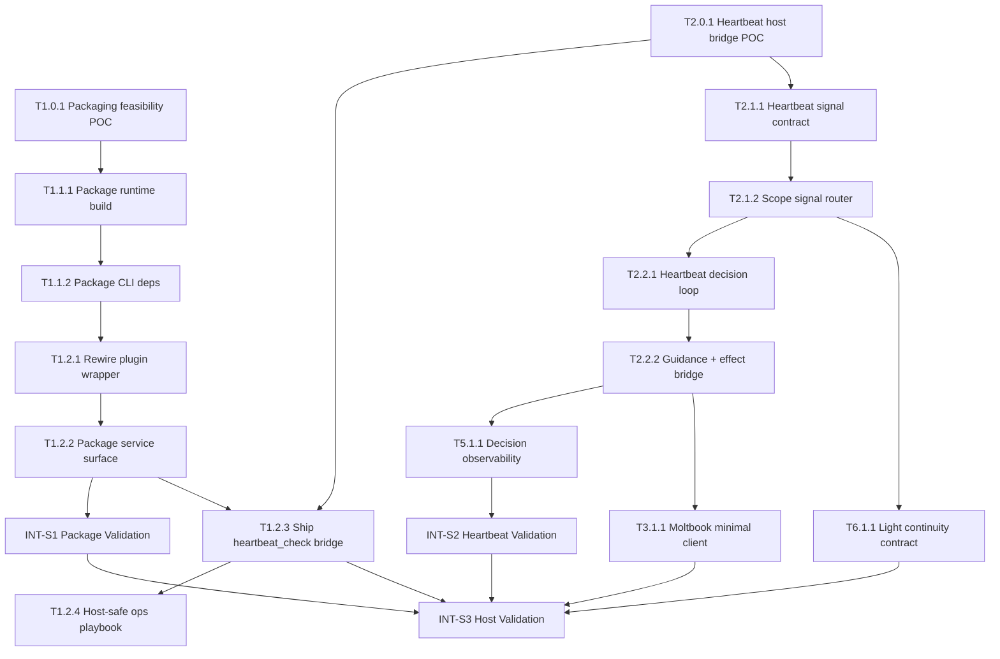

# 任务清单 (Task List) - .anws v4

## 依赖图总览

## 📊 Sprint 路线图

> 发布语义注记（2026-04-27）:
> 当前代码与本轮发布物已经覆盖 S1 的 runtime package 目标，并提供最小 activation spine。
> 但 T1.2.2 只证明 packaged service carrier 与 lifecycle truth，不等于 heartbeat host bridge 已完成。
> S2 / S3 中涉及 `HEARTBEAT.md + heartbeat_check` shipping bridge、最小平台动作闭环与云端宿主闭环的内容，不能仅凭当前 plugin surface 视为全部坐实。
>
> 运维承接注记（2026-05-01）:
> 宿主隧道实测已区分三类结果：**调用形态错误**（如非法 command 名）、**host-safe / `runtime_carrier_only` 设计边界**（合成 status、credential、未实现的 policy/audit）、**需完整 workspace runtime 或宿主配置** 才能验收的能力（真实连接器、EvoMap 配置）。对应文档与验收分层由 **T1.2.4** 收敛，避免后续优化误判范围。

| Sprint | 代号 | 核心任务 | 退出标准 | 预估 |
|--------|------|---------|---------|------|
| S1 | Runtime Package | packaging feasibility + plugin runtime artifact + command/tool/service 可运行 | 安装后的插件不再 fallback，核心命令可用，packaging 风险已验证 | 2-3d |
| S2 | Heartbeat Spine | heartbeat bridge POC + signal contract + decision record | heartbeat 内核能完成一次静默或动作决策，并留下可解释记录；该证明仅限 runtime 内部主链 | 3-4d |
| S3 | Host Closure | shipping heartbeat bridge + 最小平台客户端 + 轻量 continuity + 宿主验证 | 云端宿主可安装、加载、查看 surface，`HEARTBEAT.md + heartbeat_check` 可被消费，heartbeat 主链与最小平台动作可验证 | 2-3d |

> **覆盖范围说明**: 本任务清单只覆盖 `.anws/v4/01_PRD.md` 中定义的 `REQ-014` ~ `REQ-018`。更广泛的平台扩展、更多 connector 能力和额外 UX 能力不在本次 v4 blueprint 范围内。

---

## System 1: Agent-facing Ops Surface System (`cli-system`)

### Phase 0: Packaging Feasibility

- [x] **T1.0.1** [REQ-017]: 验证 packaged runtime 与原生依赖可行性
  - **描述**: 在正式改造 packaging 之前，先验证 jiti 加载、`better-sqlite3` 等原生依赖、`npm install --ignore-scripts` 与 artifact 闭合边界是否成立。
  - **输入**: `.anws/v4/03_ADR/ADR_006_DEPLOYABLE_PLUGIN_RUNTIME_PACKAGE.md`；`.anws/v4/04_SYSTEM_DESIGN/cli-system.md` §3.3, §8, §11.3
  - **输出**: packaging feasibility 记录、风险结论、可继续采用的构建策略
  - **📎 参考**: `ADR_006_DEPLOYABLE_PLUGIN_RUNTIME_PACKAGE.md`；`cli-system.md` §8
  - **验收标准**:
    - Given 当前 packaging 依赖 jiti 与原生模块假设
    - When 完成可行性验证
    - Then 团队能输出一份明确结论：`可继续沿用`、`需调整实现` 或 `需更换依赖` 三者之一，且附带证据
    - Then 至少验证 1 条成功路径和 1 条阻塞或风险路径，不能只给主观判断
  - **验证类型**: 手动验证
  - **验证说明**: 通过最小打包 POC、安装测试和依赖解析验证，确认原生模块与安装流程是否兼容
  - **估时**: 4h
  - **依赖**: 无
  - **优先级**: P0

### Phase 1: Runtime Package Foundation

- [x] **T1.1.1** [REQ-017]: 建立 plugin runtime artifact 构建边界
  - **描述**: 为 `plugin/` 定义正式的 runtime artifact 构建入口，明确发布包如何包含包内 runtime，而不是继续依赖源码仓 `src/` 相对路径。
  - **输入**: `.anws/v4/01_PRD.md` §4 US-004 [REQ-017]；`.anws/v4/03_ADR/ADR_006_DEPLOYABLE_PLUGIN_RUNTIME_PACKAGE.md`；`.anws/v4/04_SYSTEM_DESIGN/cli-system.md` §4.4
  - **输出**: plugin runtime artifact 构建入口、构建配置、artifact 目录约定
  - **📎 参考**: `ADR_006_DEPLOYABLE_PLUGIN_RUNTIME_PACKAGE.md`；`cli-system.md` §4, §8
  - **验收标准**:
    - Given 当前发布包只有 wrapper 和 manifest
    - When 构建流程执行完成
    - Then 生成的发布产物中包含独立的 runtime artifact 边界，而不是仅保留 wrapper
    - Then 构建后的 runtime 入口不得再包含 `../src/` 形式的源码仓相对路径引用
  - **验证类型**: 编译检查
  - **验证说明**: 运行构建流程，确认产物目录中出现包内 runtime 入口与构建后的可发布文件
  - **估时**: 4h
  - **依赖**: T1.0.1
  - **优先级**: P0

- [x] **T1.1.2** [REQ-017]: 打包 command router 与 CLI runtime 依赖图
  - **描述**: 将 command router、read models、action bridge、state/observability runtime 依赖图纳入 artifact，保证命令执行路径在宿主里闭合。
  - **输入**: `.anws/v4/04_SYSTEM_DESIGN/cli-system.md` §4.2, §4.3, §5.1；`src/cli/index.ts`；T1.1.1 产出的 artifact 构建入口
  - **输出**: 被打包的 command router、CLI runtime deps、artifact 内引用关系
  - **📎 参考**: `cli-system.md` §4.2, §5.1；`ADR_006_DEPLOYABLE_PLUGIN_RUNTIME_PACKAGE.md`
  - **验收标准**:
    - Given `status / policy / credential / quiet / report / session / explain` 依赖统一 runtime graph
    - When artifact 被生成
    - Then 这些命令所需依赖均存在于发布包内，不再引用源码仓 `src/`
    - Then 至少 `status`、`quiet`、`report`、`session`、`explain` 五个命令路径在 artifact 中可解析
  - **验证类型**: 编译检查
  - **验证说明**: 检查构建产物内容与模块引用路径，确认 CLI 运行图闭合
  - **估时**: 6h
  - **依赖**: T1.1.1
  - **优先级**: P0

### Phase 2: Plugin Surface Rewire

- [x] **T1.2.1** [REQ-017]: 重写 plugin wrapper 到包内 runtime 解析路径
  - **描述**: 修改 `plugin/index.ts`，让 wrapper 只解析包内 runtime registration layer，不再尝试 `require("../src/...")`。
  - **输入**: `.anws/v4/04_SYSTEM_DESIGN/cli-system.md` §4.1, §4.3, §8；`plugin/index.ts`；T1.1.2 产出的 packaged runtime modules
  - **输出**: 重写后的 plugin wrapper、稳定的包内 runtime 解析路径
  - **📎 参考**: `cli-system.md` §4.1, §8；`ADR_006_DEPLOYABLE_PLUGIN_RUNTIME_PACKAGE.md`
  - **验收标准**:
    - Given wrapper 作为原生 OpenClaw plugin entry 保留
    - When 插件在宿主中加载
    - Then wrapper 只会解析包内 runtime 模块，不再依赖源码仓外部路径
  - **验证类型**: 集成测试
  - **验证说明**: 在本地或临时宿主中加载插件，确认命令路径不再进入 packaging fallback mode
  - **估时**: 4h
  - **依赖**: T1.1.2
  - **优先级**: P0

- [x] **T1.2.2** [REQ-017]: 将 service surface 纳入 packaged runtime
  - **描述**: 让 `second-nature-runtime` 与 `second-nature-lifecycle` 服务由包内 runtime 产物驱动，提供 packaged runtime carrier、lifecycle truth 与最小 activation spine；这里不把 service `start()` 表述成已经收到 per-heartbeat callback。
  - **输入**: `.anws/v4/03_ADR/ADR_005_HEARTBEAT_RUNTIME_BOUNDARY.md`；`.anws/v4/04_SYSTEM_DESIGN/cli-system.md` §5.1；T1.2.1 产出的 wrapper 解析路径
  - **输出**: packaged service runtime、service bootstrap 入口、runtime lifecycle truth
  - **📎 参考**: `ADR_005_HEARTBEAT_RUNTIME_BOUNDARY.md`；`cli-system.md` §5.1
  - **验收标准**:
    - Given plugin `register(api)` 需要保持同步，且宿主只应看到 truthful service surface
    - When 插件完成注册
    - Then `second-nature-runtime` 与 `second-nature-lifecycle` 都来自 packaged runtime，而不是空壳占位
    - Then 这些 service 只声明 packaged runtime carrier / lifecycle truth，不把当前 `service-entry` 误写成已完成 heartbeat host bridge
  - **验证类型**: 集成测试
  - **验证说明**: 检查插件注册信息和服务启动行为，确认服务来自 packaged runtime，并且生命周期语义与当前最小 handle 保持一致
  - **估时**: 6h
  - **依赖**: T1.2.1
  - **优先级**: P0

- [x] **T1.2.3** [REQ-014]: 暴露 `heartbeat_check` shipping bridge 入口并补 `HEARTBEAT.md`
  - **描述**: 按 T2.0.1 已选定的桥接 POC，把 `HEARTBEAT.md + second_nature_ops("heartbeat_check")` 正式收口为 shipping plugin surface；command surface 允许等价 `second-nature heartbeat_check`，但不得破坏同步注册与 host-safe 加载边界。
  - **输入**: `.anws/v4/03_ADR/ADR_005_HEARTBEAT_RUNTIME_BOUNDARY.md`；`.anws/v4/04_SYSTEM_DESIGN/cli-system.md` §5.1, §11.2；`.anws/v4/04_SYSTEM_DESIGN/control-plane-system.md` §5.3, §11.3；T1.2.2 产出的 packaged service/runtime carrier；T2.0.1 产出的 bridge POC 结论
  - **输出**: `heartbeat_check` command/tool surface、`HEARTBEAT.md`、bridge result contract
  - **📎 参考**: `ADR_005_HEARTBEAT_RUNTIME_BOUNDARY.md`；`cli-system.md` §5.1；`control-plane-system.md` §5.3
  - **验收标准**:
    - Given 当前选定的宿主桥接方案是 `HEARTBEAT.md + second_nature_ops("heartbeat_check")`
    - When 插件完成注册并由宿主或等价调用方触发 `heartbeat_check`
    - Then tool / command surface 至少有一条 shipping 路径返回 `HEARTBEAT_OK` 或可消费的结构化 heartbeat 决策结果
    - Then 仓库中存在与该入口配套的 `HEARTBEAT.md`，明确调用指令、成功语义与下一步动作语义
    - Then `register(api)` 仍保持同步，且当前 `service-entry` 不被伪装成 per-heartbeat callback
  - **验证类型**: 集成测试
  - **验证说明**: 通过 plugin surface 集成测试验证 `heartbeat_check` 暴露、command/tool 语义一致、结果可消费，并检查 `HEARTBEAT.md` 与 surface 合同对齐
  - **估时**: 4h
  - **依赖**: T1.2.2, T2.0.1
  - **优先级**: P0

- [x] **T1.2.4** [REQ-017]: Host-safe surface 运维说明与验收分层（文档）
  - **描述**: 将 npm 发布包在 OpenClaw 宿主上的 **实际行为矩阵** 固化为运维可读文档：`second_nature_ops` 的合法 JSON（顶层 `command` + `args`，禁止复合命令名）、`serviceEntryMode: runtime_carrier_only` 含义、`status` 中空 `connectors`/`credentials` 为合成占位、`credential`/`policy`/`audit`/`explain` 在 host-safe 下的预期成功/失败语义；并明确与「完整 workspace runtime / 宿主侧 connector 配置」的验收分界，供后续优化与 INT-S3 类复测对照。
  - **输入**: `plugin/index.ts` host-safe router；`HEARTBEAT.md`；INT-S3 与 2026-05-01 隧道实测笔记；`.anws/v4/04_SYSTEM_DESIGN/cli-system.md`
  - **输出**: 写入 `cli-system.md`（或同级附录）的 **Host-safe 表面矩阵 + 常见误判排障**；可选：`README` / 发布说明中的简短链指
  - **📎 参考**: `ADR_006_DEPLOYABLE_PLUGIN_RUNTIME_PACKAGE.md`；`cli-system.md` §5
  - **验收标准**:
    - Given 运维人员只持有已安装的 `@haaaiawd/second-nature` 与 OpenClaw Control / `second_nature_ops`
    - When 按文档执行一轮最小 smoke（`heartbeat_check`、`status`、`credential` 正确形态、`explain` 带 `args.subject`）
    - Then 能明确判定结果是「调用错误」「host-safe 边界」还是「需另行启用完整运行时/配置」，且不把合成空列表误判为连接器功能缺失
    - Then 文档中列出至少一条 **错误调用示例**（如非法 command 名）与 **正确 tool 参数示例**
  - **验证类型**: 手动验证
  - **验证说明**: 对照宿主实测与 `plugin/index.ts` 路由，走读文档是否与管理界面观测一致
  - **估时**: 3h
  - **依赖**: T1.2.3
  - **优先级**: P1

- [x] **INT-S1** [MILESTONE]: S1 集成验证 — Runtime Package
  - **描述**: 验证 runtime artifact package 是否真正让插件安装后可运行，而不是继续退化为 fallback。
  - **输入**: T1.1.1、T1.1.2、T1.2.1、T1.2.2 的产出
  - **输出**: S1 集成验证报告（artifact 内容 + surface 可用性 + fallback 检查）
  - **验收标准**:
    - Given S1 所有任务已完成
    - When 安装或本地加载打包后的插件，并检查 command / tool / service surface
    - Then 核心命令不再默认进入 packaging fallback mode，S1 退出标准成立
  - **验证类型**: 集成测试
  - **验证说明**: 通过安装后的 `plugins info`、命令调用和工具调用结果确认 packaged runtime 生效
  - **估时**: 3h
  - **依赖**: T1.2.2
  - **优先级**: P0

---

## System 2: Second Nature Orchestration System (`control-plane-system`)

### Phase 0: Host Bridge Validation

- [x] **T2.0.1** [REQ-014]: 确认 OpenClaw heartbeat 宿主桥接策略
  - **描述**: 通过 POC 确认 OpenClaw heartbeat 如何被桥接进 Second Nature，并正式选定 `HEARTBEAT.md + second_nature_ops("heartbeat_check")` 为主桥接方案；service-assisted bridge 仅保留为 runtime carrier / helper，不单独宣称宿主闭环。
  - **输入**: `.anws/v4/03_ADR/ADR_005_HEARTBEAT_RUNTIME_BOUNDARY.md`；`.anws/v4/04_SYSTEM_DESIGN/control-plane-system.md` §3.3, §4.1, §5.3, §11.3
  - **输出**: heartbeat host bridge 策略、POC 结论、主/备桥接路径
  - **📎 参考**: `ADR_005_HEARTBEAT_RUNTIME_BOUNDARY.md`；`control-plane-system.md` §4.1, §5.3
  - **验收标准**:
    - Given OpenClaw heartbeat 是主会话 LLM 轮次，而非 plugin 直接事件
    - When 完成宿主桥接 POC
    - Then 团队已选定 `HEARTBEAT.md + second_nature_ops("heartbeat_check")` 作为主桥接方案，并给出 1 条备选路径
    - Then 主桥接方案明确 signal 从哪来、带什么 metadata、由谁消费，且明确当前 `service-entry` 不是 per-heartbeat callback
  - **验证类型**: 手动验证
  - **验证说明**: 通过 OpenClaw 宿主实验与最小桥接方案验证，确认选定桥接路径可行，并记录主/备路径边界
  - **估时**: 4h
  - **依赖**: T1.2.2
  - **优先级**: P0

### Phase 1: Runtime Boundary Foundation

- [x] **T2.1.1** [REQ-014]: 建立 heartbeat signal contract 与 snapshot 构建合同
  - **描述**: 基于宿主桥接策略，为 control-plane 实现正式 `ingestRhythmSignal()` 合同与 `ContinuitySnapshot` 构建路径，让 heartbeat 语义进入自由心跳主链。
  - **输入**: `.anws/v4/01_PRD.md` §4 US-001 [REQ-014]；`.anws/v4/03_ADR/ADR_005_HEARTBEAT_RUNTIME_BOUNDARY.md`；`.anws/v4/04_SYSTEM_DESIGN/control-plane-system.md` §4.1, §5.1, §6；T2.0.1 产出的 heartbeat host bridge 策略
  - **输出**: heartbeat signal contract、snapshot builder、heartbeat cycle result 合同
  - **📎 参考**: `ADR_005_HEARTBEAT_RUNTIME_BOUNDARY.md`；`control-plane-system.md` §4, §5, §6
  - **验收标准**:
    - Given 宿主桥接已将 heartbeat 轮次转换成可消费 signal
    - When 进入 control-plane runtime
    - Then 系统能构建一次完整的 `ContinuitySnapshot` 并产出 heartbeat cycle result
    - Then signal contract 至少包含 `trigger`、`scopeHint?`、`payload` 三类字段，且 snapshot builder 能消费这些字段
  - **验证类型**: 单元测试
  - **验证说明**: 运行心跳入口与 snapshot 相关测试，确认输入状态能稳定转成统一 snapshot 结构
  - **估时**: 6h
  - **依赖**: T2.0.1
  - **优先级**: P0

- [x] **T2.1.2** [REQ-015]: 实现显式 scope signal router
  - **描述**: 基于桥接协议、入口类型或显式 metadata，在 control-plane 内实现 `Rhythm Scope`、`User Task Scope` 与 `User Reply Scope` 的 signal routing，而不是假设宿主天然分类。
  - **输入**: `.anws/v4/01_PRD.md` §4 US-002 [REQ-015]；`.anws/v4/03_ADR/ADR_005_HEARTBEAT_RUNTIME_BOUNDARY.md`；`.anws/v4/04_SYSTEM_DESIGN/control-plane-system.md` §4.4, §5.1；T2.0.1 产出的 bridge metadata 约定
  - **输出**: scope signal router、trigger metadata 分类逻辑
  - **📎 参考**: `ADR_005_HEARTBEAT_RUNTIME_BOUNDARY.md`；`control-plane-system.md` §4.4, §5.1
  - **验收标准**:
    - Given heartbeat bridge signal、用户明确任务入口、用户直聊入口三种显式信号
    - When scope router 处理这些输入
    - Then 用户明确任务直接路由到任务链，heartbeat 留在 rhythm scope，用户直聊回复进入 user reply scope
    - Then 路由结果中必须显式输出 `rhythm / user_task / user_reply` 之一，不能依赖隐式推断
  - **验证类型**: 单元测试
  - **验证说明**: 通过不同触发源的测试用例确认 scope 归属和路由结果正确
  - **估时**: 4h
  - **依赖**: T2.1.1
  - **优先级**: P0

### Phase 2: Heartbeat Decision Spine

- [x] **T2.2.1** [REQ-018]: 实现 heartbeat 轮的默认保守决策路径
  - **描述**: 将 candidate intent planning、guard evaluation 和 `HEARTBEAT_OK` 静默结果接成正式 decision loop，让 heartbeat 默认先判断再动作。
  - **输入**: `.anws/v4/01_PRD.md` §4 US-005 [REQ-018]；`.anws/v4/04_SYSTEM_DESIGN/control-plane-system.md` §4.2, §4.3, §5.1；T2.1.1 产出的 heartbeat signal contract；T2.1.2 产出的 scope signal router
  - **输出**: heartbeat decision loop、静默结果路径、candidate intent planning 逻辑
  - **📎 参考**: `control-plane-system.md` §4.2, §4.3, §8；`ADR_005_HEARTBEAT_RUNTIME_BOUNDARY.md`
  - **验收标准**:
    - Given 一轮 heartbeat 进入 `Rhythm Scope`
    - When 当前没有足够理由执行动作
    - Then 系统返回 `HEARTBEAT_OK` 或等价静默结果，并且不会误触发外部动作
    - Then 在 `no obligation / no viable intent / guard deny` 三类代表性测试场景中，都能稳定落到静默或拒绝结果
  - **验证类型**: 单元测试
  - **验证说明**: 运行 heartbeat decision loop 测试，确认静默路径和 allow 路径都能稳定产出正确结果
  - **估时**: 6h
  - **依赖**: T2.1.2
  - **优先级**: P1

- [x] **T2.2.2** [REQ-014]: 接通 guidance bridge 与 allow-only effect dispatch
  - **描述**: 仅在 scene 被选中时请求 guidance payload，并将 allow 的 heartbeat 结果接到 connector / Quiet / reflection / outreach judgment 路径。
  - **输入**: `.anws/v4/04_SYSTEM_DESIGN/control-plane-system.md` §4.3, §5.1；`.anws/v4/03_ADR/ADR_005_HEARTBEAT_RUNTIME_BOUNDARY.md`；T2.2.1 产出的 heartbeat decision loop
  - **输出**: heartbeat scene guidance 接口、allow-only effect dispatch 路径
  - **📎 参考**: `control-plane-system.md` §4.3, §5.1；`ADR_005_HEARTBEAT_RUNTIME_BOUNDARY.md`
  - **验收标准**:
    - Given heartbeat 轮选中了需要生成的 scene
    - When 进入执行路径
    - Then guidance 只在该 scene 下被请求，且外部 effect 仅发生在 allow verdict 下
    - Then guidance payload 不直接传给 connector executor，而是只参与生成型路径的上下文组装
  - **验证类型**: 集成测试
  - **验证说明**: 检查 heartbeat 到 guidance request，再到 connector / Quiet / reflection 路径的联通性与 guard 约束
  - **估时**: 6h
  - **依赖**: T2.2.1
  - **优先级**: P0

---

## System 5: Observability & Safety System (`observability-system`)

### Phase 1: Decision Trace Closure

- [x] **T5.1.1** [REQ-018]: 记录 heartbeat 决策与 scope 标签
  - **描述**: 为 observability 增加 heartbeat decision record、scope tag 和静默结果记录，使 `HEARTBEAT_OK`、deny、allow 都能被解释与追踪。
  - **输入**: `.anws/v4/04_SYSTEM_DESIGN/control-plane-system.md` §5.1, §9, §11；`.anws/v4/02_ARCHITECTURE_OVERVIEW.md` §System 5；T2.2.2 产出的 heartbeat decision loop
  - **输出**: heartbeat decision ledger、scope-tagged observability events、查询支持
  - **📎 参考**: `control-plane-system.md` §9, §11；`ADR_005_HEARTBEAT_RUNTIME_BOUNDARY.md`
  - **验收标准**:
    - Given heartbeat 轮走过 silent、allow、deny 中任一结果
    - When 结果被记录
    - Then 记录中能区分 runtime scope、trigger source、decision status 与 reasons
    - Then 每条记录至少包含 `timestamp`、`runtimeScope`、`triggerSource`、`decisionStatus`、`reasons` 五类字段
  - **验证类型**: 集成测试
  - **验证说明**: 通过查询日志或审计读模型确认 heartbeat 决策链被完整记录
  - **估时**: 4h
  - **依赖**: T2.2.2
  - **优先级**: P1

- [x] **INT-S2** [MILESTONE]: S2 集成验证 — Heartbeat Spine
  - **描述**: 验证 heartbeat signal contract、scope routing、默认静默策略与 decision record 是否在 control-plane runtime 内形成完整主链；本里程碑只证明内部主链与 synthetic / explicit bridge signal 输入，不等价于宿主 shipping bridge 已闭环。
  - **输入**: T2.1.1、T2.1.2、T2.2.1、T2.2.2、T5.1.1 的产出
  - **输出**: S2 集成验证报告（runtime heartbeat 主链通过/失败 + Bug 清单）
  - **验收标准**:
    - Given S2 所有任务已完成
    - When 执行 `heartbeat_bridge` signal -> snapshot -> scope -> decision -> observability 的完整链路检查
    - Then 系统能够在 runtime 内产生 `HEARTBEAT_OK` 或 allow 结果，并留下可解释 decision record
    - Then 该结论不得直接外推成宿主已稳定消费 `heartbeat_check`；宿主闭环另由 INT-S3 负责
  - **验证类型**: 集成测试
  - **验证说明**: 按退出标准执行整链验证，确认 heartbeat 主链在 runtime 内可观测、可解释、可收敛；宿主侧 bridge 证明不计入本项
  - **估时**: 3h
  - **依赖**: T5.1.1
  - **优先级**: P0

---

## System 6: Behavioral Guidance System (`behavioral-guidance-system`)

### Phase 1: Light Continuity Closure

- [x] **T6.1.1** [REQ-016]: 实现用户直聊的 very light continuity 合同
  - **描述**: 为 `User Reply Scope` 增加 very light continuity contract，让用户直聊回复保持轻量人格连续性，但不进入平台 `reply` scene。
  - **输入**: `.anws/v4/01_PRD.md` §4 US-003 [REQ-016]；`.anws/v4/03_ADR/ADR_005_HEARTBEAT_RUNTIME_BOUNDARY.md`；`.anws/v4/04_SYSTEM_DESIGN/control-plane-system.md` §5.1；`.anws/v4/04_SYSTEM_DESIGN/behavioral-guidance-system.md` §5.4
  - **输出**: user reply light continuity contract、轻量 persona continuity block 或最小 guidance path
  - **📎 参考**: `ADR_005_HEARTBEAT_RUNTIME_BOUNDARY.md`；`behavioral-guidance-system.md` §5.4
  - **验收标准**:
    - Given 触发源是 direct user reply
    - When 系统生成用户回复上下文
    - Then 只应用 very light continuity guidance，不直接进入现有 `reply` scene impulse
  - **验证类型**: 集成测试
  - **验证说明**: 检查 direct user reply 路径的 guidance 结果，确认其轻量且与平台 reply scene 分离
  - **估时**: 4h
  - **依赖**: T2.1.2
  - **优先级**: P1

---

## System 3: Platform Connector System (`connector-system`)

### Phase 0: Integration Feasibility

- [x] **T3.0.1** [REQ-014]: 确认 Moltbook 最小真实对接路径与文档依据
  - **描述**: 在实现 Moltbook 最小客户端前，先确认真实 API、CLI 或 skill/browser fallback 的可用路径，并记录文档或实测依据。
  - **输入**: `.anws/v4/02_ARCHITECTURE_OVERVIEW.md` §System 3；`.anws/v4/04_SYSTEM_DESIGN/connector-system.md` §4.2, §5；`.anws/v4/04_SYSTEM_DESIGN/control-plane-system.md` §4.3
  - **输出**: Moltbook 对接依据、最小可行 capability 路径、认证与能力边界说明
  - **📎 参考**: `connector-system.md` §4.2, §5
  - **验收标准**:
    - Given 目前 Moltbook 客户端尚未落地
    - When 完成对接前调研与验证
    - Then 团队能明确说明是走真实 API、CLI fallback 还是其他可验证路径，并给出依据
  - **验证类型**: 手动验证
  - **验证说明**: 通过文档查验、实测或现有 skill/CLI 入口确认最小对接路径存在且可行
  - **估时**: 3h
  - **依赖**: T2.2.2
  - **优先级**: P0

### Phase 1: Minimal External Closure

- [x] **T3.1.1** [REQ-014]: 实现一个最小真实平台客户端闭环（Moltbook）
  - **描述**: 选择 Moltbook 作为第一优先平台，补一个最小真实平台协议客户端与 capability 执行路径，使 heartbeat allow path 至少有一个对接真实平台协议的出口；真实宿主/真实平台出口证明继续由 INT-S3 承接。
  - **输入**: `.anws/v4/02_ARCHITECTURE_OVERVIEW.md` §System 3；`.anws/v4/04_SYSTEM_DESIGN/control-plane-system.md` §4.3；`.anws/v4/04_SYSTEM_DESIGN/connector-system.md` §4.2, §5；T2.2.2 产出的 allow-only effect dispatch 路径
  - **输出**: Moltbook 最小客户端实现、至少一个真实平台协议 capability 路径、错误归一化与请求/响应合同验证记录
  - **📎 参考**: `connector-system.md` §4.2, §5；`control-plane-system.md` §4.3
  - **验收标准**:
    - Given heartbeat allow path 或手动触发路径已能进入 connector 执行
    - When 调用 Moltbook 最小 capability
    - Then 系统能够形成并执行至少一个面向真实平台协议的 capability 请求，而不是停在空接口
    - Then 所选 capability 必须明确指向一个可验证的真实出口，例如 `feed.read` 或 `post.publish`；若当前阶段只做 mock / near-real 合同验证，真实连通与认证返回语义验证由 INT-S3 承接
  - **验证类型**: 集成测试
  - **验证说明**: 通过集成测试验证 request construction、鉴权 header、超时/错误归一化与 response handling；真实或近真实平台出口验证继续放在 INT-S3
  - **估时**: 8h
  - **依赖**: T3.0.1
  - **优先级**: P0

---

## System Cross-Cut: Host Validation

### Phase 1: End-to-End Host Closure

- [x] **INT-S3** [MILESTONE]: S3 集成验证 — Host Closure
  - **描述**: 在真实或近真实 OpenClaw 宿主里验证 v4 的 packaged runtime、`HEARTBEAT.md + heartbeat_check` shipping bridge、最小平台出口和 light continuity 边界是否共同成立。
  - **输入**: INT-S1、INT-S2、T1.2.3、T3.1.1、T6.1.1 的产出
  - **输出**: 云端/宿主验证报告（安装、加载、surface、heartbeat、最小平台动作、边界验证）
  - **验收标准**:
    - Given Runtime Package、runtime heartbeat spine 与 shipping heartbeat bridge surface 均已就绪
    - When 在宿主环境安装并启用插件，检查 command / tool / service 与 heartbeat 入口
    - Then 插件可加载，核心命令可用，`heartbeat_check` 可通过 `second_nature_ops` 或等价 command surface 被消费，且 `HEARTBEAT.md` 与该入口语义对齐
    - Then heartbeat 主链能从宿主触发走到 runtime 结果，且至少一个最小平台 capability 在真实或 near-real 出口上得到验证，而不是只停留在 mock `fetch`
    - Then 用户任务边界与 very light continuity 边界不被破坏
  - **验证类型**: 手动验证
  - **验证说明**: 在目标宿主中安装插件，重启 gateway，检查插件信息、`heartbeat_check` surface、宿主 heartbeat 结果、最小平台 capability 与边界行为
  - **验证结果** (2026-04-29):
    - ✅ 插件 v0.1.8 已安装并被 gateway 加载 (`plugins.loaded: ["second-nature"]`)
    - ✅ `plugins.allow` 配置已更新，重启后插件自动加载
    - ✅ 宿主 heartbeat 触发后 agent 正确读取 workspace `HEARTBEAT.md`
    - ✅ agent thinking: "It says to use the Second Nature bridge. Let me run the heartbeat check."
    - ✅ `second_nature_ops("heartbeat_check")` 被成功调用，返回 `{"heartbeat":"HEARTBEAT_OK","status":"heartbeat_ok","nextAction":"continue"}`
    - ✅ agent 按指令静默继续，`silent: true`, `status: "ok-token"`, `durationMs: 250103`
    - ✅ 128/128 测试全绿
    - ⚠️ Moltbook 真实平台连通性仍使用 mock（R1 已知风险，non-blocker）
    - ⚠️ `openclaw gateway restart` 在 Windows 上因 `SIGUSR1` 不支持而失败（OpenClaw 上游 bug，workaround: stop + run）
    - 📌 **隧道复测补充**（2026-05-01，Control + SSH 本地端口转发）:
      - ✅ `heartbeat_check` / `status` / `quiet` / `report` 与 host-safe 路由一致；`session` 无 `sessionId` → `MISSING_SESSION_ID`（预期）
      - ⚠️ `second_nature_ops` 须使用 `{ "command": "<name>", "args": { ... } }`；**复合或拼接的命令名**（如 `credential+show`）会落入 `Unknown Second Nature command`，验收时需与功能缺失区分
      - ⚠️ host-safe 下：`policy`（show）、`audit` 走未实现路径；`credential` 为合成 `missing`；`status` 中 `connectors` / `credentials` 为空数组——**不推断**「社交平台未配置」或「存储失败」
      - ⚠️ `explain` 必须在 `args.subject` 传入主题（如 `decision:<id>`）；否则 `MISSING_EXPLAIN_SUBJECT`
      - 📎 抽样 `exec`：`HEARTBEAT.md` 可读；`~/.openclaw/*.json` 未见 `EVOMAP` 字符串 → EvoMap 需在宿主/OpenClaw 配置层另行接线后再做端到端验收
  - **估时**: 4h
  - **依赖**: INT-S1, INT-S2, T1.2.3, T3.1.1, T6.1.1
  - **优先级**: P0

---

## 🎯 User Story Overlay

### US-001: 将 heartbeat 作为 Second Nature 的自由心跳主入口 [REQ-014] (P0)
**涉及任务**: T2.0.1 → T2.1.1 → T2.2.1 → T2.2.2 → T5.1.1 → INT-S2；T1.2.3 → INT-S3  
**关键路径**: T2.0.1 → T2.1.1 → T2.2.1 → T2.2.2 → T5.1.1 → INT-S2；宿主闭环另需 T1.2.3 → INT-S3  
**独立可测**: ✅ S2 结束可验证内部主链；S3 完成宿主桥接闭环  
**覆盖状态**: ✅ 完整

### US-002: 明确用户任务链不受节律裁决 [REQ-015] (P0)
**涉及任务**: T2.0.1 → T2.1.2 → T2.2.1 → INT-S2 → INT-S3  
**关键路径**: T2.0.1 → T2.1.2 → T2.2.1 → INT-S2  
**独立可测**: ✅ S2 结束即可验证主边界，S3 完成宿主复核  
**覆盖状态**: ✅ 完整

### US-003: 用户直聊回复只保留 very light continuity guidance [REQ-016] (P1)
**涉及任务**: T6.1.1 → INT-S3  
**关键路径**: T6.1.1 → INT-S3  
**独立可测**: ✅ S3 结束可验证  
**覆盖状态**: ✅ 完整

### US-004: 发布包必须成为可独立运行的 plugin runtime [REQ-017] (P0)
**涉及任务**: T1.0.1 → T1.1.1 → T1.1.2 → T1.2.1 → T1.2.2 → INT-S1 → INT-S3  
**关键路径**: T1.0.1 → T1.1.1 → T1.1.2 → T1.2.1 → T1.2.2 → INT-S1  
**独立可测**: ✅ S1 结束即可验证，S3 宿主复核  
**覆盖状态**: ✅ 完整

### US-005: heartbeat 轮的默认行为保持克制 [REQ-018] (P1)
**涉及任务**: T2.2.1 → T5.1.1 → INT-S2  
**关键路径**: T2.2.1 → T5.1.1 → INT-S2  
**独立可测**: ✅ S2 结束即可验证  
**覆盖状态**: ✅ 完整

### 覆盖声明说明
本 Overlay 只声明 v4 PRD 中 `REQ-014` ~ `REQ-018` 的任务覆盖状态，不延伸宣称更早版本或更广范围 connector 需求已经全部实现。
