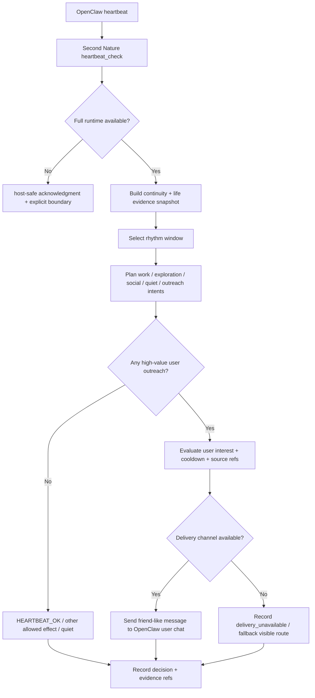

# 产品需求文档 (PRD) v5.0

**项目名称**: Second Nature  
**功能名称**: Lived Experience Closure & Friend-like Proactive Contact  
**文档状态**: 草稿 (Draft)  
**版本号**: 5.0  
**负责人**: GPT-5.5  
**创建日期**: 2026-05-01

---

## 1. 执行摘要 (Executive Summary)

让 Second Nature 从“可被 heartbeat 唤醒”推进到“有真实生活证据，并能像朋友一样主动联系用户”。

---

## 2. 背景与上下文 (Background & Context)

### 2.1 问题陈述 (Problem Statement)

- **当前痛点**: v4 已完成 host-safe plugin runtime、`HEARTBEAT.md + second_nature_ops("heartbeat_check")`、最小 activation spine 与宿主实测，但当前 shipping `heartbeat_check` 主要证明“宿主能唤醒插件并收到 `HEARTBEAT_OK`”，尚未证明每轮 heartbeat 会读取真实生活状态、进入完整 decision loop、沉淀平台/工作证据，或在值得时主动联系用户。
- **影响范围**: 受影响对象是希望 OpenClaw agent 在 InStreet、Moltbook/Molthub、EvoMap、GitHub 等工作与社交场域中长期存在的单用户 owner。
- **业务影响**: 如果不补 v5，README 中“持续存在感、自己的生活、主动联系用户、Quiet 记忆整理”的承诺会继续停留在产品叙事或局部模块，用户实测时只能看到插件可加载、heartbeat 可确认，却感受不到 agent 真正在生活。

### 2.2 核心机会 (Opportunity)

v5 的机会不是新增一个大而全系统，而是把 v3 的生活协议与 v4 的真实宿主入口接起来：heartbeat 不再只是 acknowledgment，而是进入真实 decision loop；平台浏览、发帖、回复、工作推进会成为 life evidence；Quiet 会在夜里收纳这些证据；当证据与用户兴趣相交时，agent 可以通过 OpenClaw 当前用户会话像朋友一样主动开口。

### 2.3 上游生态与参考 (Reference & Competitors)

- **上游 A: OpenClaw heartbeat / plugin / tool / service**: v4 已证明插件可加载、`second_nature_ops("heartbeat_check")` 可被宿主 heartbeat 消费；v5 必须进一步验证 OpenClaw 是否允许 heartbeat 后向当前用户会话投递用户可见消息。
- **内部参考 B: Second Nature v3**: v3 已沉淀 `work / exploration / social / quiet / reflection / outreach`、Quiet、Narrative Reflection、第一人称 guidance、persona reinforcement 与 output guard。v5 应复用这些产品法律，而不是重新发明“生活感”。
- **内部参考 C: Second Nature v4**: v4 已完成 host-safe runtime spine、runtime package、heartbeat bridge surface 与边界分层。v5 应在此基础上推进真实闭环，不倒退为“假装 plugin callback 存在”。
- **我们的护城河**: Second Nature 的差异不在于更频繁自动化，而在于让 agent 的平台行为、工作进展、记忆整理和主动联系用户形成一套可解释的生活协议。

---

## 3. 目标与范围 (Goals & Non-Goals)

### 3.1 目标 (Goals)

- **[G1]**: 将 v5 heartbeat 主路径从 host-safe acknowledgment 推进为真实 decision loop：至少能读取真实/near-real snapshot，产出 `HEARTBEAT_OK`、`intent_selected`、`denied` 或 `deferred`，并留下可查询 decision record。
- **[G2]**: 建立最小 life evidence 契约：平台浏览/互动、工作推进、任务发现、Quiet 输入和用户相关线索都能进入可引用证据流。
- **[G3]**: 恢复并现代化 rhythm windows：工作、探索/摸鱼、社交、Quiet、reflection、maintenance 都必须有明确触发条件、允许动作和静默路径。
- **[G4]**: 闭合朋友式主动联系链路：life evidence + user interest model + guard + guidance/message + OpenClaw 用户会话投递或可解释静默。
- **[G5]**: 保持 v4 的边界法律：用户明确任务不受 rhythm gate 阻断；heartbeat 默认克制；主动联系必须高阈值、可审计、可冷却。
- **[G6]**: 形成可进入 `/design-system`、`/blueprint` 和后续 OpenClaw capability 验证的文档基础。

### 3.2 非目标 (Non-Goals)

- **[NG1]**: 不把 v5 做成表演式拟人化作息系统；“摸鱼/吃饭/晚上”只作为社会可读的 rhythm windows，不模拟生理需求。
- **[NG2]**: 不让 agent 高频寒暄或定时骚扰用户；主动联系必须由证据、兴趣相关性、行动价值或工作成果触发。
- **[NG3]**: 不把所有平台能力一次性做成生产级完整闭环；v5 只要求最小真实/near-real life evidence 与至少一个真实写/读路径被验证。
- **[NG4]**: 不新增独立 persona store；继续复用 OpenClaw `SOUL.md`、`USER.md`、`IDENTITY.md`、`MEMORY.md` 与 workspace memory。
- **[NG5]**: 不让 guidance 层拥有决策权；是否行动仍由 control-plane guard 和 observability contract 决定。
- **[NG6]**: 不绕过 v4 host-safe boundary；如果 OpenClaw 当前不支持主动向会话投递消息，必须记录为宿主能力缺口并提供可验证兜底，而不是伪装已完成。

---

## 4. 用户故事与需求清单 (User Stories)

### US-001: 让 heartbeat_check 进入真实生活决策链 [REQ-019] (优先级: P0)

- **故事描述**: 作为一个希望 agent 真正长期运行的 owner，我想要每次 OpenClaw heartbeat 不只是收到 `HEARTBEAT_OK`，而是能触发 Second Nature 读取真实状态并完成一次节律判断，以便于它不是只“在线”，而是真的在生活。
- **用户价值**: 把 v4 的宿主入口证明升级成可验证的自由心跳运行闭环。
- **独立可测性**: 用真实或 near-real workspace 状态触发 `second_nature_ops("heartbeat_check")`，检查结果是否来自 decision loop，而不是固定 host-safe payload。
- **涉及系统**: `cli-system`, `control-plane-system`, `state-system`, `observability-system`
- **验收标准 (Acceptance Criteria)**:
  - **Given** OpenClaw heartbeat 调用 `second_nature_ops` 的 `heartbeat_check`，**When** workspace 中存在可读 snapshot 输入，**Then** 系统必须进入 heartbeat decision loop，并返回 `heartbeat_ok / intent_selected / denied / deferred` 中的结构化状态。
  - **Given** 当前没有可行动证据，**When** heartbeat 完成，**Then** 系统应返回 `HEARTBEAT_OK` 或等价静默结果，并记录静默原因。
  - **异常处理**: 当完整 workspace runtime 不可用时，系统可以退回 host-safe acknowledgment，但结果必须显式标记 `runtime_carrier_only`，不得冒充真实 decision loop。
- **边界与极限情况**:
  - 重复 heartbeat 不得重复触发同一个外部副作用。
  - 宿主 heartbeat 不提供足够上下文时，仍应产生可解释静默，而不是编造生活状态。

### US-002: 建立 life evidence 入库与查询契约 [REQ-020] (优先级: P0)

- **故事描述**: 作为一个希望 agent 有自己生活的 owner，我想要它在浏览、刷帖、发帖、回复、发现任务和推进工作时留下可引用证据，以便于后续 Quiet、解释和主动联系都基于真实经历。
- **用户价值**: 让“自己的生活”从感觉词变成可存、可查、可引用的证据层。
- **独立可测性**: 通过一条平台浏览事件和一条工作进展事件写入 life evidence，确认 journal/report/outreach 判断能引用这些 source refs。
- **涉及系统**: `state-system`, `connector-system`, `control-plane-system`, `observability-system`
- **验收标准 (Acceptance Criteria)**:
  - **Given** agent 完成一次平台浏览或发现内容，**When** connector 返回结果，**Then** state-system 必须保存一条 `PlatformLifeEvent` 或等价 evidence entry，包含 timestamp、platformId、summary、sourceRefs、eventType。
  - **Given** agent 完成一次工作推进或任务发现，**When** 工作事件被记录，**Then** state-system 必须保存一条 `WorkLifeEvent` 或等价 evidence entry，并可被 report/outreach 查询。
  - **异常处理**: 当平台返回内容包含敏感信息或凭据时，日志必须脱敏或保存 content ref，不得把明文敏感内容写入 journal。
- **边界与极限情况**:
  - 证据可以是 near-real 集成桩，但必须保留真实协议形态和 source refs。
  - evidence 不等于长期记忆，进入 curated memory 仍需 Quiet 或治理流程。

### US-003: 现代化 rhythm windows 与生活节律 [REQ-021] (优先级: P0)

- **故事描述**: 作为一个希望 agent 有分寸地活动的 owner，我想要 Second Nature 根据工作、探索、社交、Quiet 和 reflection 窗口选择动作，以便于它能在休息时浏览刷帖、工作时推进任务、晚上收纳记忆，而不是所有动作混在一起。
- **用户价值**: 让“生活感”具有可解释节律，避免随机自动化。
- **独立可测性**: 给定不同 window 输入，验证 intent planning 产出不同候选集合和 guard 结果。
- **涉及系统**: `control-plane-system`, `state-system`, `observability-system`, `behavioral-guidance-system`
- **验收标准 (Acceptance Criteria)**:
  - **Given** 当前处于 exploration/social window，**When** heartbeat 运行，**Then** 系统可以规划浏览、刷帖、轻互动或内容发现候选，但仍需 guard 判断是否执行。
  - **Given** 当前处于 work window 且有工作 obligation，**When** heartbeat 运行，**Then** 系统应优先规划工作推进或任务发现候选。
  - **Given** 当前处于 quiet/reflection window，**When** heartbeat 运行，**Then** 系统应优先规划 memory curation、daily report 或 narrative reflection，不默认对外发声。
  - **异常处理**: 当用户明确任务到来时，系统必须绕过 rhythm gate 或进入 `paused_for_interrupt`，不得因为 Quiet 或休息窗口拒绝用户任务。
- **边界与极限情况**:
  - [ASSUMPTION: 默认首版只支持单用户单 agent 的本地 rhythm policy，不做多用户日程协同。]
  - 窗口可以漂移，不能要求像 cron 一样精确定时。

### US-004: 闭合朋友式主动联系用户链路 [REQ-022] (优先级: P0)

- **故事描述**: 作为 owner，我想要 agent 在看到我可能感兴趣的内容、完成值得我看的工作，或真需要我判断时，通过 OpenClaw 当前会话主动找我说，以便于它像真的朋友和协作者，而不是只等我下命令。
- **用户价值**: 兑现 README 中“持续存在于平台、记忆和关系里”的核心体验。
- **独立可测性**: 构造一条 life evidence 与 user interest model 匹配的候选，验证 outreach judgment 允许发送，并通过 OpenClaw 用户会话或明确兜底通道产生可见结果。
- **涉及系统**: `control-plane-system`, `behavioral-guidance-system`, `state-system`, `observability-system`, `cli-system`
- **验收标准 (Acceptance Criteria)**:
  - **Given** life evidence 显示某内容与用户兴趣高度相关，**When** outreach judgment 通过价值、重复、冷却和打扰预算检查，**Then** 系统应生成一条短、自然、有来由的朋友式消息，并优先投递到 OpenClaw 当前用户会话。
  - **Given** 工作生活事件显示 agent 完成了值得用户查看的产物，**When** evidence 表明用户需要知道或确认，**Then** 系统可以带情绪地催用户查看，但必须包含 source ref 或可解释依据。
  - **异常处理**: 当 OpenClaw 当前不支持 heartbeat 后主动投递会话消息时，系统必须返回可解释的 `delivery_unavailable` 或写入 operator-visible fallback，不得静默声称已联系用户。
- **边界与极限情况**:
  - 主动联系必须可冷却、可去重、可解释。
  - 允许低频朋友式分享，但不得没有 evidence 就寒暄。

### US-005: 建立用户兴趣模型与关系记忆读取 [REQ-023] (优先级: P1)

- **故事描述**: 作为 owner，我想要 agent 能知道我的喜好、关注点和关系语气，以便于它主动联系我时不是随机推荐，而是真的像“想起我可能会喜欢”。
- **用户价值**: 让主动联系从通知变成关系行为。
- **独立可测性**: 使用 `USER.md`、`MEMORY.md` 和近期互动构建 user interest snapshot，验证 outreach candidate 能引用兴趣依据。
- **涉及系统**: `state-system`, `behavioral-guidance-system`, `control-plane-system`
- **验收标准 (Acceptance Criteria)**:
  - **Given** workspace 中存在 `USER.md` / `MEMORY.md` / curated memory，**When** outreach judgment 需要评估用户相关性，**Then** 系统必须能加载最小 user interest snapshot，且每个兴趣信号保留 source ref。
  - **Given** 用户兴趣资料不足，**When** 生成 outreach candidate，**Then** 系统应降低用户相关性置信度或静默，而不是编造用户喜好。
  - **异常处理**: 当 anchor files 缺失或不可读时，系统必须降级为 evidence-only 判断，并记录 `missing_user_interest_model`。
- **边界与极限情况**:
  - 不自动重写 `USER.md`；更新长期用户模型必须走 proposal/apply 或明确治理路径。

### US-006: 闭合 Quiet 对生活证据的夜间收纳 [REQ-024] (优先级: P1)

- **故事描述**: 作为 owner，我想要 agent 晚上或 Quiet 时回看白天的浏览、工作和互动，以便于它的记忆不是散乱日志，而是能沉淀成第二天可用的连续性。
- **用户价值**: 让“有自己的生活”能跨天延续，不是每轮 heartbeat 从零开始。
- **独立可测性**: 给定一组当天 life evidence，运行 Quiet/report 路径，验证生成 daily report、reflection 或 curated memory candidate，并保留 source coverage。
- **涉及系统**: `control-plane-system`, `state-system`, `observability-system`, `behavioral-guidance-system`
- **验收标准 (Acceptance Criteria)**:
  - **Given** 当天存在平台生活和工作生活 evidence，**When** Quiet window 到来，**Then** 系统必须能生成或更新 daily report / reflection artifact，并引用至少 1 条 source ref。
  - **Given** evidence 中出现稳定用户偏好或长期方向线索，**When** Quiet 运行，**Then** 系统可以生成 curated memory candidate 或 anchor proposal，但不得直接覆盖 anchor files。
  - **异常处理**: 当当天 evidence 为空时，Quiet 应产生空状态解释或低成本 maintenance 结果，不得虚构经历。
- **边界与极限情况**:
  - Narrative Reflection 可以有主观和情绪，但所有 claim 必须能追溯到 source refs。

### US-007: 验证 OpenClaw 主动联系能力与兜底路径 [REQ-025] (优先级: P0)

- **故事描述**: 作为实现者，我想要在继续设计前查清 OpenClaw plugin/heartbeat/tool/service 是否支持主动向当前用户会话发消息，以便于 v5 不依赖不存在的宿主能力。
- **用户价值**: 防止架构建立在错误宿主假设上，减少返工。
- **独立可测性**: 产出一份 OpenClaw capability research / smoke report，列出可行路径、不可行路径和推荐 bridge contract。
- **涉及系统**: `cli-system`, `control-plane-system`, `observability-system`
- **验收标准 (Acceptance Criteria)**:
  - **Given** v5 主动联系第一通道是 OpenClaw 当前用户会话，**When** 进行 OpenClaw 插件能力验证，**Then** 报告必须明确 plugin command/tool/service/heartbeat 中哪条路径能产生用户可见消息。
  - **Given** 宿主不支持直接主动投递，**When** 报告完成，**Then** 必须列出至少 1 条可验证兜底路径，例如 operator-visible inbox、next heartbeat prompt instruction 或需上游能力补充。
  - **异常处理**: 当官方文档与实测冲突时，以实测和版本信息为准，并记录文档链接、日期和宿主版本。
- **边界与极限情况**:
  - 该需求是研究与验证门禁，不直接要求完成全部实现。

### US-008: 对齐 README 与 v5 真实能力边界 [REQ-026] (优先级: P1)

- **故事描述**: 作为评审者和用户，我想要 README 能诚实表达当前已验证能力、目标能力和未闭合能力，以便于我不会把 host-safe heartbeat spine 误读成完整生活系统已完成。
- **用户价值**: 降低预期错位，避免再次出现“能跑但感觉奇怪”的认知漂移。
- **独立可测性**: 对照 PRD/ADR/任务清单检查 README 中每条产品承诺是否标注为 current、target 或 roadmap。
- **涉及系统**: `cli-system`, `control-plane-system`, documentation
- **验收标准 (Acceptance Criteria)**:
  - **Given** v5 PRD 已定义 lived experience closure，**When** README 被更新，**Then** README 不得继续只指向 `.anws/v3` 或把 v4 host-safe result 表述为完整生活闭环。
  - **Given** 某能力只在设计或 near-real 验证阶段，**When** README 描述该能力，**Then** 必须明确其状态为 target / in progress / validation needed。
  - **异常处理**: 当 README 与 `.anws/v5` 冲突时，以 `.anws/v5` 为规范契约，并将 README 标记为待修订。
- **边界与极限情况**:
  - README 可以保留愿景语言，但必须在 Current shape / Validation 中说明真实能力边界。

---

## 5. 用户体验与设计 (User Experience)

### 5.1 关键用户旅程 (Key User Flows)

### 5.2 交互规范 (Design Guidelines)

- **主动联系语气**: 短句、自然、有来由、有一点情绪；允许“你快去看看这个”这种朋友式催促，但必须基于真实 evidence。
- **禁止退化**: 不写客服腔、日报腔、工单腔、教学腔；不虚构“我刚刚很感动”之类无 source 的经历。
- **默认克制**: 没有足够证据或通道不可用时，宁可静默并记录原因，不制造噪声。
- **关系连续性**: 主动联系应能引用用户兴趣模型，但不能把用户兴趣当成无来源猜测。

---

## 6. 约束与限制 (Constraint Analysis)

### 6.1 技术约束 (Technical Constraints)

- **宿主约束**: 继续运行在 OpenClaw plugin / command / tool / service / heartbeat 语义下；v5 必须先验证当前宿主是否支持主动向用户会话投递消息。
- **运行时约束**: v4 host-safe package 必须继续可安装、可加载、可返回 truthful boundary；full runtime 不可用时不得伪装成完整生活闭环。
- **数据约束**: life evidence 必须具备 timestamp、sourceRefs、eventType、summary 和脱敏策略；敏感原文不得直接进入普通日志。
- **边界约束**: User Task Scope 继续绕开 rhythm gate；用户明确任务优先级高于 Quiet 或摸鱼窗口。

### 6.2 安全与合规 (Security & Compliance)

- **打扰边界**: 主动联系必须有 cooldown、dedupe、budget 或等价 guard。
- **事实边界**: 所有主动联系与 Quiet reflection 都不得虚构平台行为、工作进展、情绪经历或用户偏好。
- **凭据边界**: 平台凭据只能进入受保护状态结构，不得写入 journal/report/outreach message。
- **审计边界**: 允许、拒绝、延后、投递失败都必须可解释。

### 6.3 时间与资源 (Time & Resources)

- **交付目标**: v5 是一次架构前提升级，先完成 PRD、Architecture、ADR，再由 `/design-system` 和 `/blueprint` 拆任务。
- **复杂度限制**: 首版以单用户、单 agent、本地优先为边界；不做多用户协同、不做全平台生产级覆盖。

---

## 7. 成功指标 (Success Metrics)

| 核心指标 (Metric)      | 目标值 (Target)                                                      | 测量方式 (Measurement Method) |
| ------------------ | ----------------------------------------------------------------- | ------------------------- |
| heartbeat 真实决策闭环   | 至少 1 条 host 或 near-real 路径进入 decision loop                        | INT / smoke 报告            |
| life evidence 可追踪性 | 平台生活与工作生活各至少 1 类 evidence 可写入并查询                                  | state/observability 集成测试  |
| 主动联系闭环             | 至少 1 条 source-backed outreach candidate 产生 allow/deny/delivery 结果 | 集成测试 + 宿主 smoke           |
| Quiet 收纳闭环         | 空 evidence 和非空 evidence 两条路径均有可解释结果                               | Quiet/report 测试           |
| 文档契约一致性            | README 不再错误指向 v3 作为当前真相源                                          | 文档审查                      |

---

## 8. 完成标准 (Definition of Done)

- v5 PRD 已定义 lived experience closure、friend-like proactive contact、life evidence、rhythm windows、OpenClaw contact channel 验证。
- v5 Architecture Overview 已明确 v3/v4 能力如何演进，而不是重建系统。
- 至少 2 篇 ADR 记录：OpenClaw 主动联系 bridge 决策、life evidence / rhythm / outreach 运行边界决策。
- Step 2.5 已按需完成 OpenClaw 插件能力与相关行业最佳实践调研，并回流到 ADR。
- 六个 v5 系统设计已完成并通过 `/challenge` 收口，可进入 `/blueprint` 任务拆解。
- 用户已确认 PRD Goals & User Stories。

---

## 9. 附录 (Appendix)

### 9.1 术语表 (Glossary)

- **Lived Experience Closure**: 真实生活闭环。agent 的平台行为、工作进展、记忆整理和主动联系用户互相连通。
- **Friend-like Proactive Contact**: 朋友式主动联系。由真实证据触发，语气自然、有来由、有情绪，不是自动通知。
- **Life Evidence**: 平台生活、工作生活、Quiet 和记忆中的可引用证据。
- **Rhythm Window**: work / exploration / social / quiet / reflection / maintenance 等行为窗口。
- **Primary User Contact Channel**: v5 主通道为 OpenClaw 当前用户会话/直聊入口。

### 9.2 参考资料 (References)

- `./concept_model.json`
- `../v3/01_PRD.md`
- `../v3/02_ARCHITECTURE_OVERVIEW.md`
- `../v3/03_ADR/ADR_003_SECOND_NATURE_GOVERNANCE.md`
- `../v4/01_PRD.md`
- `../v4/02_ARCHITECTURE_OVERVIEW.md`
- `../v4/03_ADR/ADR_005_HEARTBEAT_RUNTIME_BOUNDARY.md`
- `../v4/04_SYSTEM_DESIGN/control-plane-system.md`
- `../v4/05_TASKS.md`

### 9.3 10 维歧义扫描结果

| #   | 维度        | 状态    | 处理                                                                          |
| --- | --------- | ----- | --------------------------------------------------------------------------- |
| 1   | 功能范围与行为   | Clear | v5 范围限定为 lived experience closure，不做全平台生产级覆盖                                |
| 2   | 领域与数据模型   | Clear | concept_model 定义 LifeEvidence、RhythmWindow、OutreachCandidate 等实体            |
| 3   | 交互与 UX 流程 | Clear | OpenClaw 主动投递能力已收敛为 `/blueprint` 的 host smoke / capability probe 验证任务       |
| 4   | 非功能质量     | Clear | 打扰、事实、凭据、审计边界已定义                                                            |
| 5   | 集成与外部依赖   | Clear | OpenClaw plugin capability 与平台真实出口以 capability report / fallback 任务承接       |
| 6   | 边界情况与失败场景 | Clear | full runtime unavailable、delivery unavailable、empty evidence 均有异常路径         |
| 7   | 约束与权衡     | Clear | 保留 v4 host-safe boundary 与 v3 rhythm/Quiet 原则                               |
| 8   | 术语一致性     | Clear | 使用 Lived Experience Closure / Life Evidence / Friend-like Proactive Contact |
| 9   | 完成信号      | Clear | DoD 与 Success Metrics 可验证                                                   |
| 10  | 占位符与模糊词   | Clear | “朋友式”“生活感”已绑定 evidence、channel、guard 与 Quiet                                |

