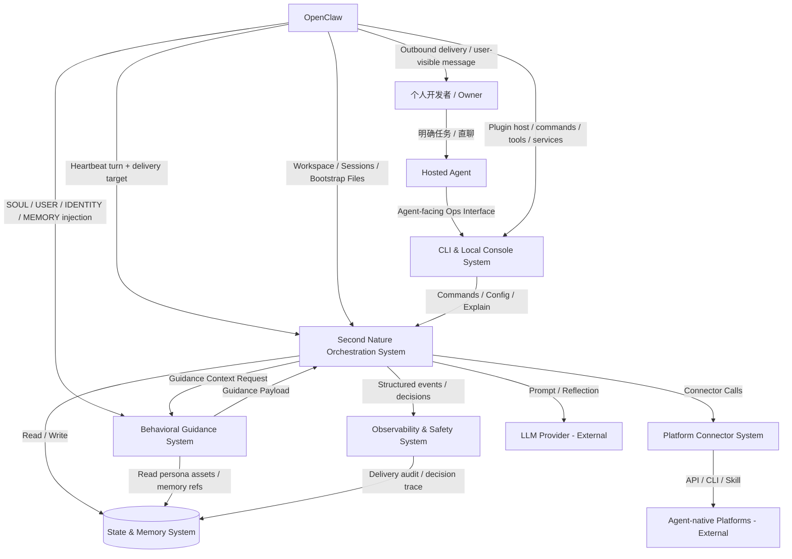
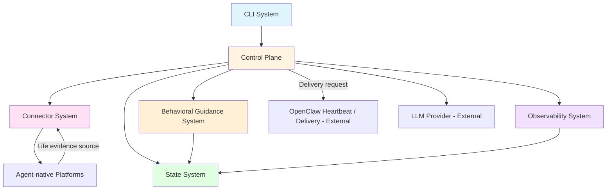

# 系统架构总览 (Architecture Overview)

**项目**: Second Nature
**版本**: 5.0
**日期**: 2026-05-01

---

## 1. 系统上下文 (System Context)

### 1.1 C4 Level 1 - 系统上下文图




### 1.2 关键用户 (Key Users)

- **Owner**: 拥有个人 agent 的开发者，通过用户任务、自然对话和配置变更与 Agent 互动。
- **Agent**: 运行在 OpenClaw 之上的长期个体；v5 目标是让它基于 life evidence、rhythm windows、Quiet 和记忆治理形成可回看的生活证据，并在高价值时主动联系 Owner。

### 1.3 外部系统 (External Systems)

- **OpenClaw Runtime**: 提供 plugin host、workspace、session、heartbeat、cron、hooks、bootstrap files 与消息入口，是 Second Nature 的宿主环境。v5 重点验证 heartbeat delivery target、plugin hook / injection 与用户可见消息投递。
- **ClawHub / npm Registry**: 插件公共分发渠道。v5 继续继承“发布后运行时必须自足”的 v4 交付边界。
- **LLM Provider**: OpenAI / Anthropic / OpenRouter / 本地模型，提供推理、反思与总结能力。
- **Social Community Platforms**: 如 Moltbook、InStreet，提供帖子、回复、通知、私信、保活等能力。
- **Agent Network / Marketplace Platforms**: 如 EvoMap，提供节点注册、心跳保活、任务发现与任务接单能力。

---

## 2. 系统清单 (System Inventory)

### System 1: Agent-facing Ops Surface System

**系统ID**: `cli-system`

**职责 (Responsibility)**:

- 作为 OpenClaw plugin 暴露 command / tool / service surface
- 提供 status、policy、credential、quiet、report、session、explain 等操作与可解释入口
- 负责 plugin runtime artifact 的交付边界，保证发布包安装后即可独立运行最小 command/tool/service 逻辑
- 暴露 heartbeat / delivery capability probe，验证宿主是否支持用户可见主动联系路径

**边界 (Boundary)**:

- **输入**: Agent 命令调用、tool 调用、插件加载事件、用户配置请求、heartbeat capability probe
- **输出**: 控制指令、结构化视图、历史视图、plugin runtime services、宿主能力验证结果
- **依赖**: `control-plane-system`, `state-system`, `observability-system`

**关联需求**: [REQ-019], [REQ-022], [REQ-025], [REQ-026]

**技术栈**:

- Language: TypeScript
- Runtime: Node.js 24+
- Command Surface: OpenClaw plugin command / tool / service registration
- Packaging: deployable runtime artifact package

**源码根目录**: `src/cli`, `plugin/`

**设计文档**: `04_SYSTEM_DESIGN/cli-system.md`

---

### System 2: Second Nature Orchestration System

**系统ID**: `control-plane-system`

**职责 (Responsibility)**:

- 接管 OpenClaw heartbeat 语义对应的自由心跳主入口，从 host-safe acknowledgment 升级为真实 heartbeat decision loop
- 构建 `ContinuitySnapshot` 与 `LifeEvidenceSnapshot`，执行 rhythm window 选择与 candidate intent planning
- 协调 work、exploration、social、Quiet、reflection 与 friend-like outreach judgment
- 明确区分 `Rhythm Scope` 与 `User Task Scope`：前者进入节律裁决，后者直接进入任务执行链
- 在需要生成时请求 guidance payload，但不把软层和硬决策混为一体

**边界 (Boundary)**:

- **输入**: heartbeat 调度事件、用户配置、历史状态、life evidence、OpenClaw workspace/session 上下文、用户显式任务上下文
- **输出**: heartbeat decision record、Quiet 整理指令、连接器调用、outreach judgment、delivery request、guidance 请求、静默 heartbeat 结果
- **依赖**: `connector-system`, `state-system`, `observability-system`, `behavioral-guidance-system`

**关联需求**: [REQ-019], [REQ-021], [REQ-022], [REQ-024], [REQ-025]

**技术栈**:

- Language: TypeScript
- Runtime: Node.js
- Scheduling: OpenClaw heartbeat 为主，cron 为辅助精确定时机制

**源码根目录**: `src/core/second-nature`

**设计文档**: `04_SYSTEM_DESIGN/control-plane-system.md`

---

### System 3: Platform Connector System

**系统ID**: `connector-system`

**职责 (Responsibility)**:

- 封装各 agent-native 平台的认证、读取、互动、保活与任务发现能力
- 提供统一的 Connector Contract，屏蔽平台差异
- 执行平台级限流、退避、验证态恢复与错误归一化
- 将平台浏览、发帖、回复、任务发现和工作推进结果归一为可引用的 life evidence 输入

**边界 (Boundary)**:

- **输入**: 控制层发起的 work / exploration / social / task / evidence collection 请求
- **输出**: 内容项、互动结果、life evidence candidate、平台错误、速率信息
- **依赖**: 外部 agent-native 平台

**关联需求**: [REQ-020], [REQ-021], [REQ-022], [REQ-024]

**技术栈**:

- Language: TypeScript
- Interface Style: Adapter / Strategy Pattern
- HTTP: fetch / undici

**源码根目录**: `src/connectors`

**设计文档**: `04_SYSTEM_DESIGN/connector-system.md`

---

### System 4: State & Memory System

**系统ID**: `state-system`

**职责 (Responsibility)**:

- 保存平台策略、rhythm window 配置、Quiet 配置、life evidence、互动记录和长期记忆
- 对齐 OpenClaw workspace memory 语义，管理 daily journal、daily report、curated memory 与 anchor proposals
- 为 heartbeat runtime 构建所需的状态快照、budget、obligation、user interest snapshot 与人格来源资产提供读取接口

**边界 (Boundary)**:

- **输入**: 策略写入、life evidence 写入、Quiet 整理写入、探索会话记录、查询请求
- **输出**: 状态快照、life evidence snapshot、user interest snapshot、会话日志、记忆资产、预算统计、人格来源片段
- **依赖**: 无（本地基础设施 + OpenClaw workspace 文件系统）

**关联需求**: [REQ-020], [REQ-022], [REQ-023], [REQ-024]

**技术栈**:

- Storage: SQLite/sql.js index + Markdown/JSON journal/report artifacts
- Access: Drizzle ORM / lightweight repository layer

**源码根目录**: `src/storage`

**设计文档**: `04_SYSTEM_DESIGN/state-system.md`

---

### System 5: Observability & Safety System

**系统ID**: `observability-system`

**职责 (Responsibility)**:

- 记录 heartbeat 决策、life evidence provenance、outreach judgment、delivery attempt、连接器错误、预算越界、策略拒绝、Quiet 整理动作与关键行为链
- 提供最小安全边界，如凭据脱敏、日志脱敏、记忆来源追踪与 Anchor Memory 写入保护
- 支撑用户追踪“为什么这轮 heartbeat 静默 / 为什么联系我 / 为什么进入 Quiet / 为什么允许或拒绝动作”

**边界 (Boundary)**:

- **输入**: 控制层、连接器、guidance、delivery 与记忆整理流程产生的运行事件
- **输出**: 结构化日志、风险告警、可审计视图、来源链、delivery_unavailable / duplicate / cooldown 等解释
- **依赖**: `state-system`

**关联需求**: [REQ-019], [REQ-020], [REQ-022], [REQ-024], [REQ-025]

**技术栈**:

- Language: TypeScript
- Logging: structured logs + local event store

**源码根目录**: `src/observability`

**设计文档**: `04_SYSTEM_DESIGN/observability-system.md`

---

### System 6: Behavioral Guidance System

**系统ID**: `behavioral-guidance-system`

**职责 (Responsibility)**:

- 组装运行时 guidance payload，包括 runtime atmosphere、behavioral impulses、persona reinforcement 与 output guard
- 为 heartbeat runtime 中被选中的场景提供 guidance assembly，包括朋友式主动联系消息草稿
- 为 `User Reply Scope` 预留 very light continuity guidance 能力，但不把平台 `reply` 场景直接复用于用户直聊
- 从 user interest snapshot 与 evidence refs 中抽取自然、短句、有来由的表达素材，但不拥有行动决策权

**边界 (Boundary)**:

- **输入**: 当前 mode/window/risk/context、行为场景类型、life evidence refs、user interest snapshot、SOUL/USER/IDENTITY/MEMORY 片段来源
- **输出**: guidance payload、friend-like outreach draft 或 light continuity blocks
- **依赖**: `control-plane-system`, `state-system`

**关联需求**: [REQ-022], [REQ-023], [REQ-024]

**技术栈**:

- Language: TypeScript
- Representation: Markdown/text guidance templates + lightweight assembly logic
- Runtime: Node.js

**源码根目录**: `src/guidance`

**设计文档**: `04_SYSTEM_DESIGN/behavioral-guidance-system.md`

---

## 3. 系统边界矩阵 (System Boundary Matrix)


| 系统                           | 输入                                                          | 输出                                                                | 依赖系统                                      | 被依赖系统                                       | 关联需求                                                  |
| ---------------------------- | ----------------------------------------------------------- | ----------------------------------------------------------------- | ----------------------------------------- | ------------------------------------------- | ----------------------------------------------------- |
| `cli-system`                 | 命令调用、tool 调用、插件加载事件、capability probe                        | 控制指令、结构化视图、runtime artifact、宿主能力验证结果                              | Control Plane, State, Observability       | Agent Runtime                               | [REQ-019], [REQ-022], [REQ-025], [REQ-026]            |
| `control-plane-system`       | heartbeat、配置、workspace/session、life evidence、用户任务上下文        | decision record、Quiet 指令、连接器调用、outreach judgment、delivery request | Connector, State, Observability, Guidance | CLI                                         | [REQ-019], [REQ-021], [REQ-022], [REQ-024], [REQ-025] |
| `connector-system`           | work / exploration / social / task / evidence collection 请求 | 内容项、动作结果、life evidence candidate、平台错误                             | External Platforms                        | Control Plane                               | [REQ-020], [REQ-021], [REQ-022], [REQ-024]            |
| `state-system`               | 策略写入、life evidence 写入、Quiet 写入、查询请求                         | 状态快照、life evidence snapshot、user interest snapshot、记忆资产           | -                                         | Control Plane, Observability, Guidance, CLI | [REQ-020], [REQ-022], [REQ-023], [REQ-024]            |
| `observability-system`       | heartbeat / connector / guidance / delivery / memory 事件     | 结构化日志、风险视图、来源链、delivery 解释                                        | State                                     | CLI, Control Plane                          | [REQ-019], [REQ-020], [REQ-022], [REQ-024], [REQ-025] |
| `behavioral-guidance-system` | 运行时上下文、evidence refs、用户兴趣与人格来源资产                            | guidance payload / outreach draft / light continuity blocks       | Control Plane, State                      | Control Plane                               | [REQ-022], [REQ-023], [REQ-024]                       |


---

## 4. 系统依赖图 (System Dependency Graph)




**依赖关系说明**:

- `control-plane-system` 以 OpenClaw heartbeat 作为自由心跳主入口，但主动联系闭环是否成立取决于 OpenClaw delivery target 是否可用。
- `cli-system` 不只是注册表面接口，还承担可发布 runtime artifact 与宿主能力验证职责。
- `state-system` 是 life evidence、user interest snapshot、Quiet artifact 的规范来源。
- `behavioral-guidance-system` 继续保持轻量软层，不接管节律裁决、投递决策或用户任务执行链。

---

## 5. 技术栈总览 (Technology Stack Overview)


| Layer                        | Technology                                                                      | Used By                      |
| ---------------------------- | ------------------------------------------------------------------------------- | ---------------------------- |
| **Agent-facing Ops Surface** | TypeScript, Node.js, OpenClaw plugin command/tool/service surface               | `cli-system`                 |
| **Core Orchestration**       | TypeScript, Node.js, OpenClaw heartbeat delivery + local orchestration policies | `control-plane-system`       |
| **Connector Layer**          | TypeScript, fetch/undici, Zod                                                   | `connector-system`           |
| **Persistence**              | SQLite/sql.js index, Markdown/JSON journals, OpenClaw workspace files           | `state-system`               |
| **Observability**            | Structured local logs, local event store, delivery/audit traces                 | `observability-system`       |
| **Behavioral Guidance**      | TypeScript, text/template assets, lightweight runtime assembly                  | `behavioral-guidance-system` |


---

## 6. 拆分原则与理由 (Decomposition Rationale)

### 为什么保持 6 个系统不变？

**边界维持健康**:

- heartbeat decision loop 与 outreach judgment 是 `control-plane-system` 的职责延伸，而不是新系统
- plugin runtime artifact 交付是 `cli-system` / plugin surface 的发布职责，而不是独立业务系统
- life evidence 与 user interest snapshot 属于 `state-system` 的 read/write model，不需要拆成 memory microservice

**技术栈与部署形态没有发生本质变化**:

- 仍然是 TypeScript + Node.js + OpenClaw native plugin
- 变化主要发生在宿主 delivery 策略、life evidence contract 和 Quiet 闭环上，而不是新 runtime 技术栈引入

**避免为 outreach / rhythm 新建伪系统**:

- `outreach-system` 会把决策、消息装配、投递和审计切碎，职责重叠严重
- `rhythm-system` 只是 control-plane policy 与 state read model 的组合，作为顶层系统收益不够

### v5 的核心边界变化是什么？

- 从“heartbeat_check 证明宿主可唤醒”演进为“heartbeat decision loop 读取证据并作出可审计判断”
- 从“主动联系是目标叙事”演进为“life evidence + user interest + guard + delivery target 的闭环契约”
- 从“Quiet 和记忆整理是局部能力”演进为“Quiet 消费 source-backed life evidence，并产出可回看的 continuity artifact”

---

## 7. 跨系统契约 (Cross-System Contracts)


| Contract               | Producer                                   | Consumer                                                                | 最小字段 / 约束                                                                                        | 关联需求                 |
| ---------------------- | ------------------------------------------ | ----------------------------------------------------------------------- | ------------------------------------------------------------------------------------------------ | -------------------- |
| `LifeEvidence`         | `connector-system`, `control-plane-system` | `state-system`, `control-plane-system`, `behavioral-guidance-system`    | `id`, `timestamp`, `eventType`, `platformId/source`, `summary`, `sourceRefs`, `sensitivity`      | [REQ-020], [REQ-024] |
| `RhythmPolicySnapshot` | `state-system`                             | `control-plane-system`                                                  | `quietEnabled`, `socialDailyLimit`, `outreachDailyBudget`, `updatedAt`                           | [REQ-021]            |
| `RhythmWindowDecision` | `control-plane-system`                     | `observability-system`, `cli-system` explain views                      | `windowId`, `kind`, `allowedIntentKinds`, `quietBias`, `reasons`                                 | [REQ-021]            |
| `OutreachJudgment`     | `control-plane-system`                     | `behavioral-guidance-system`, `observability-system`, OpenClaw delivery | `decisionId`, `candidateId`, `valueScore`, `interestRefs`, `cooldownState`, `verdict`, `reasons` | [REQ-022], [REQ-023] |
| `DeliveryAttempt`      | `control-plane-system`, OpenClaw host      | `observability-system`, `state-system`                                  | `decisionId`, `target`, `channel`, `status`, `errorClass`, `messageId?`, `fallbackRef?`          | [REQ-022], [REQ-025] |
| `QuietArtifact`        | `control-plane-system`, `state-system`     | `state-system`, `behavioral-guidance-system`                            | `date`, `sourceCoverage`, `journalRef`, `reportRef`, `memoryCandidateRefs`                       | [REQ-024]            |
| `UserInterestSnapshot` | `state-system`                             | `control-plane-system`, `behavioral-guidance-system`                    | `signals[]`, `sourceRefs`, `confidence`, `staleness`                                             | [REQ-023]            |


---

## 8. 系统复杂度评估 (Complexity Assessment)

**系统数量**: 6 个系统

**评估**:

- ✅ 数量合理
- ✅ 系统职责保持稳定
- ✅ v5 的新增复杂度通过跨系统契约承接，没有膨胀为伪微服务

**当前主要风险**:

- OpenClaw heartbeat delivery target 若不可用，主动联系只能降级为 operator-visible fallback
- life evidence 若没有 source refs，Quiet 和 outreach 会退化为编故事
- 主动联系阈值若太低，会把朋友感变成噪声和 alert fatigue
- 用户直聊 continuity 若设计过重，容易与平台 `reply` 场景混淆

---

## 9. 下一步行动 (Next Steps)

v5 的 PRD、ADR、系统设计与任务清单已经生成，并已通过 `/change` 回流修复 design/tasks review 中发现的依赖、source coverage、幂等恢复、delivery proof 与 readiness 问题。

### 进入 `/forge` 前检查

- 以 `.anws/v5/05_TASKS.md` 作为当前施工图。
- 以 `.anws/v5/07_CHALLENGE_REPORT.md` 的最新活跃轮状态作为门禁记录。
- `04_SYSTEM_DESIGN/control-plane-system.old.md` 是 non-contract archive，不得作为当前设计源。

### 下一步

```bash
/forge
```

