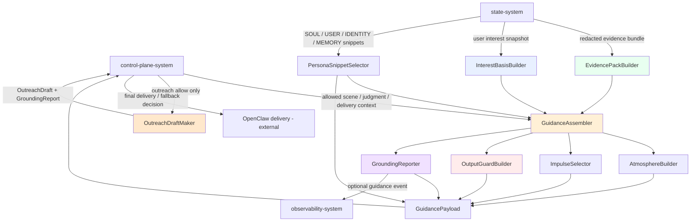
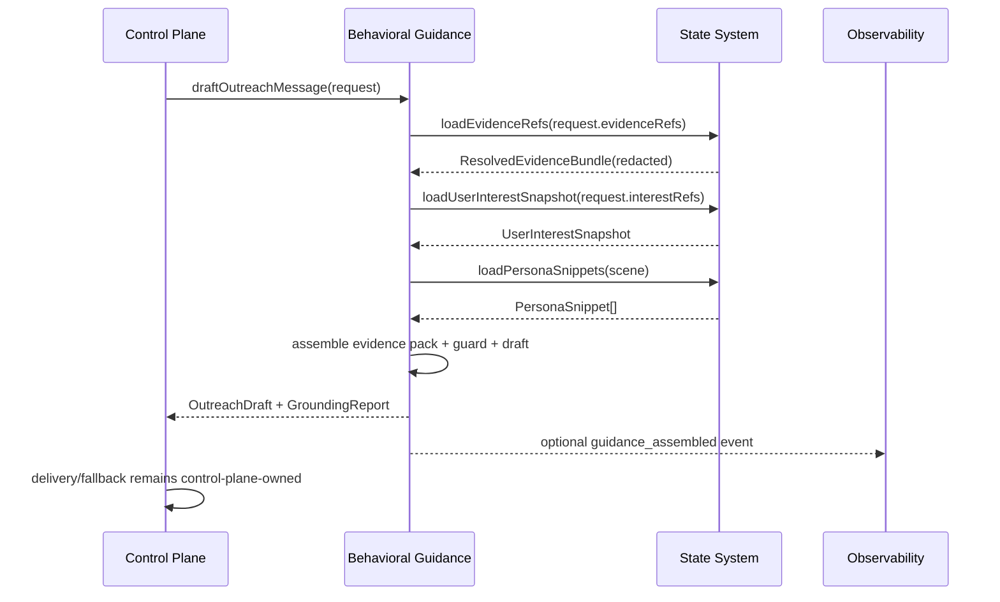
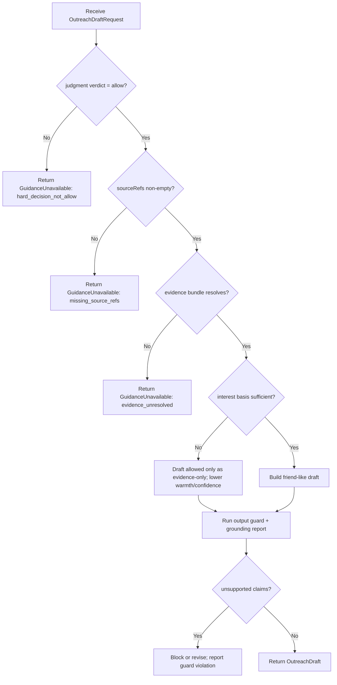
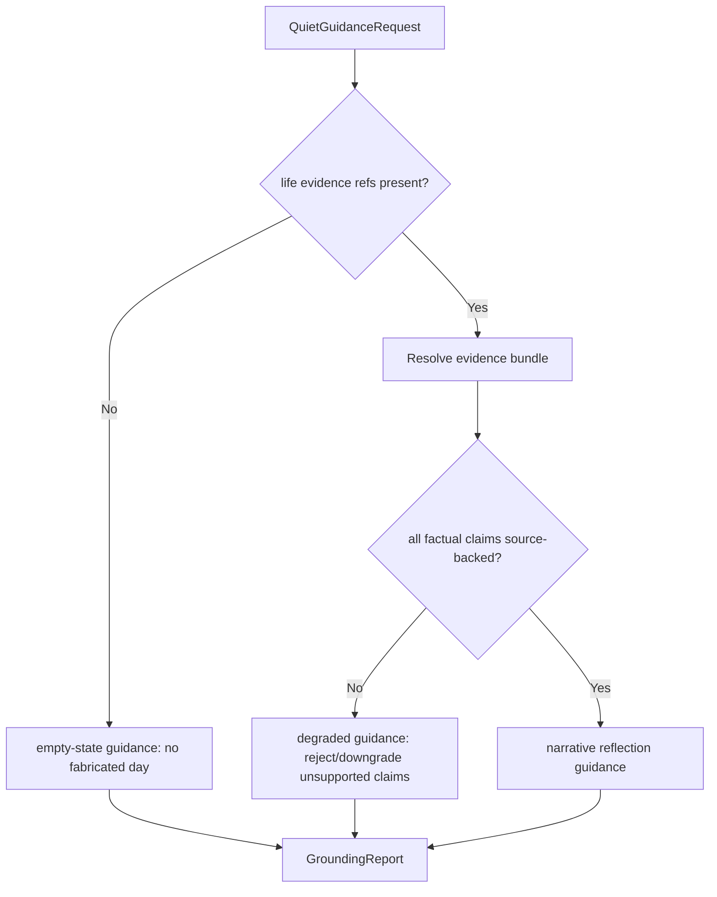
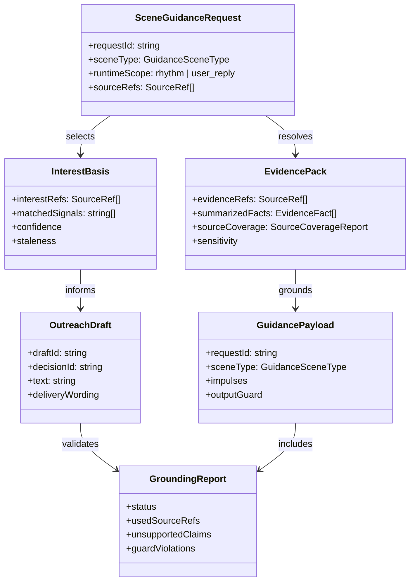

# Behavioral Guidance System 设计文档 (L0 — 导航层)

| 字段 | 值 |
| --- | --- |
| **System ID** | `behavioral-guidance-system` |
| **Project** | Second Nature |
| **Version** | 5.0 |
| **Status** | `Draft` |
| **Author** | GPT-5.5 |
| **Date** | 2026-05-01 |
| **L1 Detail** | [behavioral-guidance-system.detail.md](./behavioral-guidance-system.detail.md) — 仅 `/forge` 时加载 |

> [!IMPORTANT]
> **文档分层说明**
> - **本文件 (L0 导航层)**: 定义 `behavioral-guidance-system` 的边界、架构图、操作契约、跨系统协议和设计决策。
> - **[behavioral-guidance-system.detail.md](./behavioral-guidance-system.detail.md) (L1 实现层)**: 完整类型、配置常量、算法伪代码、决策树、边缘情况和测试 fixture。
> - **L1 锚点原则**: L1 中的每个细节块均在本文件有对应入口，禁止孤岛内容。

---

## 目录 (Table of Contents)

| § | 章节 | 关键内容 |
| :---: | --- | --- |
| 1 | [概览](#1-概览-overview) | 系统目的、边界、职责 |
| 2 | [目标与非目标](#2-目标与非目标-goals--non-goals) | Goals / Non-Goals |
| 3 | [背景与上下文](#3-背景与上下文-background--context) | v5 lived-experience closure 约束 |
| 4 | [系统架构](#4-系统架构-architecture) | Mermaid 架构图、数据流、决策边界 |
| 5 | [接口设计](#5-接口设计-interface-design) | 操作契约表、跨系统协议 |
| 6 | [数据模型](#6-数据模型-data-model) | 核心实体字段声明 |
| 7 | [技术选型](#7-技术选型-technology-stack) | TypeScript + text/template assembly |
| 8 | [Trade-offs](#8-trade-offs--alternatives-权衡与备选方案) | ADR 引用与本系统决策 |
| 9 | [安全性考虑](#9-安全性考虑-security-considerations) | 事实、隐私、表达边界 |
| 10 | [性能考虑](#10-性能考虑-performance-considerations) | assembly latency、context budget |
| 11 | [测试策略](#11-测试策略-testing-strategy) | 契约验证矩阵 |
| 12 | [部署与运维](#12-部署与运维-deployment--operations) | 模块形态与 explain/debug |
| 13 | [未来考虑](#13-未来考虑-future-considerations) | eval、prompt optimization 边界 |
| 14 | [附录](#14-appendix-附录) | 术语、参考资料 |

**L1 实现层** → [behavioral-guidance-system.detail.md](./behavioral-guidance-system.detail.md)  
L1 索引: [§1 配置常量](./behavioral-guidance-system.detail.md#1-配置常量-config-constants) · [§2 数据结构](./behavioral-guidance-system.detail.md#2-核心数据结构完整定义-full-data-structures) · [§3 算法](./behavioral-guidance-system.detail.md#3-核心算法伪代码-non-trivial-algorithm-pseudocode) · [§4 决策树](./behavioral-guidance-system.detail.md#4-决策树详细逻辑-decision-tree-details) · [§5 边缘情况](./behavioral-guidance-system.detail.md#5-边缘情况与注意事项-edge-cases--gotchas) · [§6 测试辅助](./behavioral-guidance-system.detail.md#6-测试辅助-test-helpers)

---

## 1. 概览 (Overview)

### 1.1 System Purpose (系统目的)

`behavioral-guidance-system` 是 Second Nature v5 的表达与软约束装配层。它接收 `control-plane-system` 已经允许或需要生成的场景上下文，读取 `state-system` 提供的 redacted evidence、user interest snapshot 和 persona source snippets，生成轻量 `GuidancePayload`、`OutreachDraft`、`QuietNarrativeGuidance` 或 `UserReplyContinuityBlock`。

它解决的问题不是“agent 该不该行动”，而是“在硬决策已经成立或需要生成时，agent 应该如何基于真实来源自然地表达”。这层必须让朋友式主动联系短、自然、有来由、有温度，但不能编造平台经历、用户偏好、delivery 状态或 Quiet 记忆。

### 1.2 System Boundary (系统边界)

- **输入 (Input)**:
  - 来自 `control-plane-system` 的 `SceneGuidanceRequest`、`OutreachDraftRequest`、`QuietGuidanceRequest`、`UserReplyContinuityRequest`
  - 来自 `state-system` 的 redacted `ResolvedEvidenceBundle`、`UserInterestSnapshot`、persona source snippets
  - 来自 `control-plane-system` / `observability-system` 的 risk、delivery capability、denial/fallback 摘要
- **输出 (Output)**:
  - `GuidancePayload`
  - `OutreachDraft`
  - `QuietNarrativeGuidance`
  - `UserReplyContinuityBlock`
  - `GuidanceUnavailable` 或 `GroundingReport`
- **依赖系统 (Dependencies)**:
  - `control-plane-system`
  - `state-system`
  - `observability-system` (可选记录 / debug 事件消费者)
- **被依赖系统 (Dependents)**:
  - `control-plane-system`
  - `cli-system` (只读 explain/debug view)

### 1.3 System Responsibilities (系统职责)

**负责**:
- 装配 scene-specific guidance payload: atmosphere、impulses、persona reinforcement、output guard。
- 为 `OutreachJudgment.verdict = allow` 的候选生成 source-backed friend-like outreach draft。 [REQ-022], [REQ-023]
- 为 Quiet / Narrative Reflection 生成 source coverage-aware guidance，不虚构当天经历。 [REQ-024]
- 为 `User Reply Scope` 生成 very light continuity block，不复用平台 `reply` scene。 [ADR-005], [REQ-021]
- 生成 `GroundingReport`，标明使用了哪些 source refs、哪些 claim 被阻止、是否存在 guard violation。

**不负责**:
- 不决定是否 outreach；由 `control-plane-system` 的 `judgeOutreach()` 和 hard guards 负责。
- 不解析或执行 OpenClaw delivery target；由 `control-plane-system` / `cli-system` 负责。
- 不写入 canonical state、anchor memory 或 user interest truth；由 `state-system` 负责。
- 不做 connector route planning、平台执行或平台文化静态模板库。
- 不把 hard deny / delivery unavailable 改写成可发送消息。

---

## 2. 目标与非目标 (Goals & Non-Goals)

### 2.1 Goals

- **[G1]**: 定义 source-backed guidance assembly 契约，使所有 outreach / Quiet / reply guidance 都能追溯到 evidence 或 persona source refs。 [REQ-022], [REQ-023], [REQ-024]
- **[G2]**: 生成短、自然、有来由的 friend-like outreach draft，但只在 `control-plane-system` 已允许时工作。 [REQ-022]
- **[G3]**: 提供 Quiet narrative guidance，允许主观语气，但所有事实 claim 必须来自 source-backed life evidence。 [REQ-024]
- **[G4]**: 复用 OpenClaw persona assets 和 `UserInterestSnapshot`，不新增 persona store 或用户兴趣真相源。 [REQ-023]
- **[G5]**: 将 output guard 设计为表达与事实边界，而不是第二套 hard guard 或写作模板库。 [REQ-022], [REQ-024]

### 2.2 Non-Goals

- **[NG1]**: 不拥有行动决策权、投递权、节律裁决权或 connector 执行权。
- **[NG2]**: 不在 evidence 不足时编造“我看到 / 我做了 / 你喜欢 / 我联系过你”。
- **[NG3]**: 不新增 `outreach-system`、`rhythm-system`、platform flavor layer 或教学型 skill 库。
- **[NG4]**: 不默认注入整份 `SOUL.md` / `USER.md` / `IDENTITY.md` / `MEMORY.md`。
- **[NG5]**: 不替代 `observability-system` 的审计职责；只提供可记录的 grounding / guard result。

---

## 3. 背景与上下文 (Background & Context)

### 3.1 Why This System? (为什么需要这个系统？)

v5 的核心目标是 lived-experience closure。`control-plane-system` 负责 heartbeat decision loop、rhythm window、outreach judgment 和 delivery policy；`state-system` 负责 life evidence、user interest snapshot 和 Quiet artifacts。二者之间仍需要一个轻量表达层：它让被允许的行动在语言上像一个有连续性的朋友，而不是客服通知、日报摘要或随机寒暄。

**关联PRD需求**: [REQ-021], [REQ-022], [REQ-023], [REQ-024]

### 3.2 Current State (现状分析)

旧 v3 设计已经定义四段式 `atmosphere / impulses / persona_reinforcement / output_guard`。这个结构可以保留，但它缺少 v5 的 hard boundary：
- 没有明确 `OutreachJudgment` allow 后才生成 outreach draft。
- 没有把 `LifeEvidence` / `UserInterestSnapshot` 作为事实来源硬前提。
- 没有 `GroundingReport` 表示哪些 claim 有来源、哪些被阻止。
- 没有把 `target: "none"` / delivery unavailable 与“不得声称已联系用户”绑定。

### 3.3 Constraints (约束条件)

- **技术约束**: TypeScript + Node.js，运行在 OpenClaw native plugin runtime 内，不新增重型 prompt orchestration engine。
- **事实约束**: outreach 与 Quiet claim 必须来自 source-backed life evidence 或 user interest source refs。
- **安全约束**: 输入中的平台内容和 persona snippets 是 data，不是 instruction；必须防 prompt injection 和敏感内容泄漏。
- **边界约束**: guidance 不得改变 hard guard / delivery / fallback 结果。
- **性能约束**: heartbeat 路径中 assembly 必须轻量，避免 giant prompt 和全量 memory injection。

### 3.4 调研结论摘要

- 推荐使用 context assembly / evidence pack，而不是 monolithic prompt。
- 主动消息需要回答 “why now / why me / why this action”，否则会制造 alert fatigue。
- grounding / citation / output verification 是防 hallucination 的关键机制。
- 对 Second Nature 来说，`GroundingReport` 和 `unsupportedClaims` 比“更会写”的模板更重要。

完整研究见 [`./_research/behavioral-guidance-system-research.md`](./_research/behavioral-guidance-system-research.md)。

---

## 4. 系统架构 (Architecture)

### 4.1 Architecture Diagram (架构图)



### 4.2 Core Components (核心组件)

| Component Name | Responsibility | Tech Stack | Notes |
| --- | --- | --- | --- |
| `GuidanceAssembler` | 组装通用 scene guidance payload | TypeScript | 系统核心协调器 |
| `EvidencePackBuilder` | 把 source refs 转为 redacted, bounded evidence pack | TypeScript | 不读取凭据，不扩大权限 |
| `InterestBasisBuilder` | 从 `UserInterestSnapshot` 选取与当前 scene 相关的兴趣依据 | TypeScript | 不编造用户兴趣 |
| `PersonaSnippetSelector` | 选择少量 persona source snippets | TypeScript | 只选择，不改写真相源 |
| `OutputGuardBuilder` | 构造 scene-specific expression / factual constraints | TypeScript | output guard 不替代 hard guard |
| `OutreachDraftMaker` | 生成 friend-like outreach draft | TypeScript | 仅 allow 后可调用 |
| `QuietNarrativeGuide` | 生成 Quiet / reflection guidance | TypeScript | source coverage gate |
| `GroundingReporter` | 生成 `GroundingReport` | TypeScript | 供 observability / explain 使用 |

### 4.3 Data Flow (数据流)



**关键数据流说明**:
1. `control-plane-system` 是唯一发起方。guidance 不直接从 heartbeat 或 connector 自行拉任务。
2. `OutreachDraftMaker` 只在 `OutreachJudgment.verdict = allow` 且 `deliveryVerdict = target_available` 或明确需要 candidate fallback message 时生成草稿。
3. `GroundingReport` 随 draft 一起返回；如果 source 不足，返回 `GuidanceUnavailable` 或带 guard violation 的非发送草稿。

### 4.4 Outreach Draft Admission Decision



> 完整决策逻辑见 [L1 §4.1](./behavioral-guidance-system.detail.md#41-outreach-draft-admission)。

### 4.5 Quiet Guidance Source Coverage Gate



> 完整决策逻辑见 [L1 §4.2](./behavioral-guidance-system.detail.md#42-quiet-guidance-source-coverage-gate)。

---

## 5. 接口设计 (Interface Design)

### 5.1 操作契约表 (Operation Contracts)

| 操作 | [REQ-XXX] | 前置条件 | 消耗/输入 | 产出/副作用 | 实现细节 |
| --- | :---: | --- | --- | --- | :---: |
| `assembleGuidance(request)` | [REQ-021], [REQ-024] | scene 已分类; hard context 已给出 | scene; mode/window; risk; source refs | `GuidancePayload` 或 `GuidanceUnavailable` | [L1 §3.1](./behavioral-guidance-system.detail.md#31-assembleguidance) |
| `buildEvidencePack(refs)` | [REQ-020], [REQ-024] | state read 可用; refs 可为空但必须显式降级 | source refs; redaction policy | `EvidencePack` | [L1 §3.2](./behavioral-guidance-system.detail.md#32-buildevidencepack) |
| `selectInterestBasis(snapshot)` | [REQ-023] | snapshot 已加载或可降级 | user interest snapshot; scene | `InterestBasis` | [L1 §3.3](./behavioral-guidance-system.detail.md#33-selectinterestbasis) |
| `selectPersonaSnippets(scene)` | [REQ-023], [REQ-024] | persona assets 可读或可降级 | scene; source priorities; token budget | `PersonaSnippet[]` | [L1 §3.4](./behavioral-guidance-system.detail.md#34-selectpersonasnippets) |
| `buildOutputGuard(scene)` | [REQ-022], [REQ-024] | scene 已分类 | scene; delivery/fallback context; sensitivity | `OutputGuard` | [L1 §3.5](./behavioral-guidance-system.detail.md#35-buildoutputguard) |
| `draftOutreachMessage(request)` | [REQ-022], [REQ-023] | outreach verdict allow; source refs 可解析 | judgment; evidence; interest; persona; guard | `OutreachDraft` + `GroundingReport` | [L1 §3.6](./behavioral-guidance-system.detail.md#36-draftoutreachmessage) |
| `buildQuietNarrativeGuidance(request)` | [REQ-024] | quiet/reflection scene; source coverage 已知 | evidence bundle; quiet kind; persona | `QuietNarrativeGuidance` | [L1 §3.7](./behavioral-guidance-system.detail.md#37-buildquietnarrativeguidance) |
| `buildUserReplyContinuity(request)` | [REQ-019] | scope = user_reply | recent continuity; persona snippets | `UserReplyContinuityBlock` | [L1 §3.8](./behavioral-guidance-system.detail.md#38-builduserreplycontinuity) |
| `validateGrounding(draft)` | [REQ-022], [REQ-024] | draft 已生成; evidence pack 存在 | draft claims; source refs; guard | `GroundingReport`; may block | [L1 §3.9](./behavioral-guidance-system.detail.md#39-validategrounding) |

### 5.2 跨系统接口协议 (Cross-System Interface)

```ts
export interface GuidanceDraftPort {
  assembleGuidance(request: SceneGuidanceRequest): Promise<GuidancePayload | GuidanceUnavailable>;
  draftOutreachMessage(request: OutreachDraftRequest): Promise<OutreachDraftResult>;
  buildQuietNarrativeGuidance(request: QuietGuidanceRequest): Promise<QuietGuidanceResult>;
  buildUserReplyContinuity(request: UserReplyContinuityRequest): Promise<UserReplyContinuityResult>;
}

export interface GuidanceStateReadPort {
  loadEvidenceRefs(refs: SourceRef[]): Promise<ResolvedEvidenceBundle>;
  loadUserInterestSnapshot(input?: UserInterestSnapshotInput): Promise<UserInterestSnapshot>;
  loadPersonaSnippets(input: PersonaSnippetQuery): Promise<PersonaSnippet[]>;
}

export interface GuidanceObservabilityPort {
  recordGuidanceAssembly(event: GuidanceAssemblyEvent): Promise<void>;
}
```

完整类型与字段约束见 [L1 §2](./behavioral-guidance-system.detail.md#2-核心数据结构完整定义-full-data-structures)。

### 5.3 Owner 分工表

| 问题 | Owner | Guidance 可做 | Guidance 不可做 |
| --- | --- | --- | --- |
| 是否值得联系用户 | `control-plane-system` | 读取 allow 后 judgment 并塑形表达 | 把 deny/defer 改成 allow |
| 投递目标是否可用 | `control-plane-system` / `cli-system` | 在文案中避免声称已投递 | 解析 target 或伪造 delivery 成功 |
| 用户兴趣真相源 | `state-system` | 选择已有兴趣依据 | 编造用户喜好或改写 `USER.md` |
| Quiet 事实来源 | `state-system` | 基于 source coverage 生成 guidance | 空 evidence 时虚构经历 |
| 表达退化防护 | `behavioral-guidance-system` | 防客服腔、日报腔、教学腔、无来源 claim | 替代 hard safety guard |
| 审计与 explain | `observability-system` / `cli-system` | 提供 `GroundingReport` | 成为 canonical audit store |

### 5.4 Scene Taxonomy

| Scene Type | 来源 | Guidance 重点 | 红线 |
| --- | --- | --- | --- |
| `outreach` | allow 后 `OutreachJudgment` | 短、自然、有来由、回答 why now/me/action | 不得无 evidence 寒暄 |
| `quiet_reflection` | quiet/reflection window | source-backed narrative guidance | 不得虚构一天经历 |
| `social` | exploration/social candidate | light atmosphere + impulse | 不提供平台文化静态剧本 |
| `explain` | operator explain | factual guard + provenance wording | 不补不存在的 source |
| `user_reply_continuity` | User Reply Scope | very light continuity | 不进入 rhythm gate，不复用平台 reply |
| `fallback_candidate` | delivery unavailable fallback | candidate message + not_sent wording | 不写成“已联系你” |

---

## 6. 数据模型 (Data Model)

### 6.1 核心实体 (Core Entities)

```ts
export type GuidanceSceneType =
  | 'outreach'
  | 'quiet_reflection'
  | 'social'
  | 'explain'
  | 'user_reply_continuity'
  | 'fallback_candidate';

export interface SceneGuidanceRequest {
  requestId: string;
  sceneType: GuidanceSceneType;
  runtimeScope: 'rhythm' | 'user_reply';
  rhythmWindowKind?: 'work' | 'exploration' | 'social' | 'quiet' | 'reflection' | 'maintenance';
  riskLevel: 'low' | 'medium' | 'high';
  sourceRefs: SourceRef[];
  deliveryContext?: DeliveryExpressionContext;
}

export interface EvidencePack {
  evidenceRefs: SourceRef[];
  summarizedFacts: EvidenceFact[];
  sensitivity: 'public' | 'private' | 'sensitive';
  sourceCoverage: SourceCoverageReport;
}

export interface SourceCoverageReport {
  status: 'pass' | 'degraded' | 'blocked';
  coverageRatio: number;
  unsupportedClaims: string[];
  usedSourceRefs: SourceRef[];
}

export interface InterestBasis {
  interestRefs: SourceRef[];
  matchedSignals: string[];
  confidence: number;
  staleness: 'fresh' | 'stale' | 'insufficient';
}

export interface GuidancePayload {
  requestId: string;
  sceneType: GuidanceSceneType;
  atmosphere?: AtmosphereBlock;
  impulses: ImpulseBlock[];
  personaReinforcement: PersonaSnippet[];
  outputGuard: OutputGuard;
  grounding: GroundingReport;
}

export interface OutreachDraft {
  draftId: string;
  decisionId: string;
  text: string;
  tone: 'friend_like' | 'calm' | 'urgent_but_warm';
  usedSourceRefs: SourceRef[];
  interestBasis?: InterestBasis;
  deliveryWording: 'sendable' | 'not_sent_fallback_candidate';
  grounding: GroundingReport;
}

export interface GroundingReport {
  status: 'pass' | 'blocked' | 'degraded';
  usedSourceRefs: SourceRef[];
  unsupportedClaims: string[];
  guardViolations: string[];
  reasons: string[];
}
```

> 配置常量详见 [L1 §1](./behavioral-guidance-system.detail.md#1-配置常量-config-constants)，完整字段、辅助类型与结果 union 见 [L1 §2](./behavioral-guidance-system.detail.md#2-核心数据结构完整定义-full-data-structures)。

### 6.2 实体关系图 (Entity Relationship)



### 6.3 数据流向 (Data Flow Direction)

- `state-system` 是 evidence、user interest、persona snippets 的 truth source。
- `behavioral-guidance-system` 只产生 transient guidance / draft，不产生 canonical memory。
- `control-plane-system` 决定是否调用 guidance、是否发送 draft、是否写 fallback。
- `observability-system` 可记录 `GroundingReport`，但 guidance 不直接成为 audit store。
- `cli-system` 只读 guidance explain/debug summary，不可把 draft 状态改成 sent。

---

## 7. 技术选型 (Technology Stack)

### 7.1 Core Technologies (核心技术)

| Domain | Choice | Rationale |
| --- | --- | --- |
| Runtime | TypeScript + Node.js | 与 OpenClaw plugin runtime 和现有系统一致 |
| Representation | Markdown/text fragments + typed objects | 容易审阅、版本化、测试 |
| Assembly | In-process composition | 低延迟，不引入新服务 |
| Validation | Schema + deterministic guard checks | 避免把事实边界交给模型感觉 |
| Storage | None canonical | 只读 state，输出由 control/observability 决定是否记录 |

### 7.2 Key Libraries/Dependencies (关键依赖)

- 复用现有 TypeScript / Node.js 主栈。
- 可复用项目既有 schema validation 工具；若后续缺失，可在 `/forge` 阶段评估 `zod`。
- 不引入 LangChain / DSPy / prompt orchestration engine 作为 v5 首版依赖。

---

## 8. Trade-offs & Alternatives (权衡与备选方案)

### 8.1 主技术栈与宿主语义 - 引用 ADR

> **决策来源**: [ADR-001: 主技术栈、宿主运行时与验证策略选择](../03_ADR/ADR_001_TECH_STACK.md)
>
> 本系统使用 ADR-001 定义的 TypeScript + Node.js + OpenClaw native plugin 主栈，不在此重复决策理由。
>
> **本系统特有实现**: guidance assembly 为 in-process 模块，不新增外部 runtime。

### 8.2 行为节律、Quiet 与记忆治理原则 - 引用 ADR

> **决策来源**: [ADR-003: Second Nature 行为节律、Quiet 与记忆治理原则](../03_ADR/ADR_003_SECOND_NATURE_GOVERNANCE.md)
>
> 本系统实现 ADR-003 中 Quiet / Narrative Reflection 的表达约束：可以有主观语气，但必须基于真实事实。
>
> **本系统特有实现**: `buildQuietNarrativeGuidance()` 以 `SourceCoverageReport` 的 claim-level grounding 决定 normal / low-coverage / empty-state guidance。

### 8.3 Behavioral Guidance Layer 边界 - 引用 ADR

> **决策来源**: [ADR-004: Behavioral Guidance Layer 的系统边界与实现形态](../03_ADR/ADR_004_BEHAVIORAL_GUIDANCE_LAYER.md)
>
> 本系统作为独立 guidance layer，负责 guidance assembly、persona reinforcement 与 output guard，不负责决策、执行、投递或 truth source。
>
> **本系统特有实现**: v5 在四段式 payload 之外新增 `EvidencePack`、`InterestBasis`、`GroundingReport` 与 outreach draft admission。

### 8.4 Heartbeat / User Reply Scope 边界 - 引用 ADR

> **决策来源**: [ADR-005: Heartbeat 作为 Second Nature 的主运行入口与三层运行时边界](../03_ADR/ADR_005_HEARTBEAT_RUNTIME_BOUNDARY.md)
>
> 本系统只为 `User Reply Scope` 提供 very light continuity，不让用户直聊进入 rhythm gate，也不复用平台 `reply` scene。

### 8.5 Delivery 与 Life Evidence 闭环 - 引用 ADR

> **决策来源**: [ADR-007: Heartbeat Delivery 与 Life Evidence 闭环](../03_ADR/ADR_007_HEARTBEAT_DELIVERY_AND_LIFE_EVIDENCE_CLOSURE.md)
>
> 本系统只生成 source-backed friend-like draft，不声称 delivery 成功，不处理 `target: "none"` 成功化。
>
> **本系统特有实现**: `deliveryWording` 明确区分 `sendable` 与 `not_sent_fallback_candidate`。

### 8.6 Evidence pack vs 全量 memory injection

**Option A: Evidence pack + small persona snippets (Selected)**
- 优点:
  - source-backed，便于 audit 和 explain。
  - 控制 token 和隐私暴露。
  - 避免 context rot。
- 缺点:
  - 需要更严格的 refs 和 redaction 契约。

**Option B: 全量注入 `SOUL/USER/IDENTITY/MEMORY`**
- 优点:
  - 初看更简单。
- 缺点:
  - prompt 过大，隐私和漂移风险高。
  - 容易把 persona asset 误当可改写状态。

**Decision**: 选择 Option A。v5 的事实边界比“一次性塞更多上下文”更重要。

### 8.7 Output guard vs 第二套 hard guard

**Option A: output guard 只约束表达与事实边界 (Selected)**
- 优点:
  - owner 清晰，符合 ADR-004。
  - 不会把 hard deny 改成 allow。
  - 可通过 `GroundingReport` 被审计。
- 缺点:
  - 需要 control-plane 继续承担硬治理。

**Option B: output guard 接管行为安全判断**
- 优点:
  - 表面统一。
- 缺点:
  - 与 control-plane 职责冲突。
  - 后续 explain 会混乱。

**Decision**: output guard 不替代 hard guard；冲突时 hard guard 优先。

### 8.8 Friend-like draft vs 通知/日报模板

**Option A: friend-like source-backed short draft (Selected)**
- 优点:
  - 对齐 PRD 中朋友式主动联系。
  - 能回答 why now / why me / why this action。
  - 降低客服腔和日报腔。
- 缺点:
  - 需要 fixture/eval 调整语气质量。

**Option B: 标准通知/日报模板**
- 优点:
  - 容易稳定。
- 缺点:
  - 产品体验不对，会把“朋友”变成“告警机器人”。

**Decision**: 采用朋友式短句草稿，但用 source refs 和 guard 卡住事实。

---

## 9. 安全性考虑 (Security Considerations)

### 9.1 事实与幻觉边界

| Risk | Severity | Mitigation |
| --- | :---: | --- |
| outreach 编造平台经历 | 高 | `draftOutreachMessage()` 要求非空 source refs；`validateGrounding()` 阻断 unsupported claims |
| 编造用户兴趣 | 高 | `InterestBasis.staleness = insufficient` 时降低 confidence 或返回 evidence-only draft |
| Quiet 编造一天经历 | 高 | empty evidence 只能生成 empty-state guidance |
| 声称已联系但 delivery 不可用 | 高 | `deliveryWording` 必须区分 `sendable` / `not_sent_fallback_candidate` |
| prompt injection 来自平台内容 | 高 | evidence/snippets 作为 untrusted data 打包，不可覆盖系统指令 |

### 9.2 隐私与敏感内容

- guidance 只读取 redacted evidence bundle，不读取 credentials。
- `sensitivity = sensitive` 的 evidence 默认只允许摘要，不允许原文 quote。
- persona snippets 每次默认少量选择，避免把全部长期记忆注入模型路径。

### 9.3 表达退化防护

Output guard 必须防止：
- 客服腔
- 日报腔
- 教学腔
- 无来源情绪经历
- 高相似重复
- 把 fallback 写成 sent
- 把用户兴趣写成确定事实但 source 不足

完整边缘情况见 [L1 §5](./behavioral-guidance-system.detail.md#5-边缘情况与注意事项-edge-cases--gotchas)。

---

## 10. 性能考虑 (Performance Considerations)

### 10.1 Performance Goals (性能目标)

| 指标 | 目标 | 说明 |
| --- | --- | --- |
| `assembleGuidance()` | p95 < 50ms | 不含外部 LLM 生成，只做 assembly |
| `buildEvidencePack()` | p95 < 80ms | 包含 state read / redaction |
| `draftOutreachMessage()` pre-generation assembly | p95 < 100ms | 不含模型调用时延 |
| persona snippets | 默认 <= 3 条 | 防止 giant prompt |
| evidence facts | 默认 <= 5 条 | 防止 context rot |

### 10.2 Optimization Strategies (优化策略)

- 在 `control-plane-system` 已有 snapshot 中优先传入 refs 和 summary，guidance 不重复做大范围搜索。
- `EvidencePackBuilder` 使用 state-system 的 `loadEvidenceRefs()`，不自行扫描 workspace。
- 只装配 scene-specific blocks，不注入无关 persona 或 platform content。
- 输出 guard 采用确定性检查优先，模型自审只作为未来增强。

### 10.3 Performance Monitoring (性能监控)

- 记录 assembly duration、evidence count、persona snippet count、guard violation count。
- 对 heartbeat 主路径设置 warning threshold，避免 guidance 拖慢 decision loop。

---

## 11. 测试策略 (Testing Strategy)

### 11.1 Unit Testing (单元测试)

- `buildEvidencePack()` 对空 refs、不可解析 refs、sensitive refs、mixed refs 的处理。
- `selectInterestBasis()` 对 fresh/stale/insufficient snapshot 的处理。
- `buildOutputGuard()` 对各 scene 的 guard 列表。
- `validateGrounding()` 对 unsupported claims、fake source、delivery wording 的阻断。

### 11.2 Integration Testing (集成测试)

- allow 后 outreach: `OutreachJudgment + LifeEvidence + UserInterestSnapshot -> OutreachDraft + GroundingReport(pass)`。
- delivery unavailable fallback: 生成 candidate message 但 `deliveryWording = not_sent_fallback_candidate`。
- Quiet non-empty: 所有 factual claim 都有 source backing 时生成 narrative guidance。
- Quiet empty: evidence 为空时生成 empty-state guidance，不产生经历 claim。
- User Reply Scope: 只生成 light continuity，不进入 rhythm scene。

### 11.3 Regression / Evaluation (回归与评估)

- 语气 fixture: 防客服腔、日报腔、教学腔。
- 事实 fixture: 防“我刚刚看到/完成/联系”无来源 claim。
- 重复 fixture: 同一 source 不生成高度相似 draft。

### 11.4 Contract Verification Matrix (契约-验证责任矩阵)

| 契约 | 风险级别 | 正常态验证 | 失败态验证 | 回归责任 |
| --- | --- | --- | --- | --- |
| `draftOutreachMessage()` 只接受 allow 后 judgment | P0 | allow judgment 生成 draft | deny/defer 返回 `hard_decision_not_allow` | outreach 主链路 |
| source-backed draft | P0 | source refs 被用于 `GroundingReport` | 空 refs / unresolved refs 阻断 | grounding 回归 |
| `deliveryWording` 不伪造 sent | P0 | target available 返回 `sendable` | fallback candidate 返回 `not_sent_fallback_candidate` | delivery/fallback 回归 |
| Quiet source coverage gate | P0 | `SourceCoverageReport.status = pass` 生成 narrative guidance | empty evidence / unsupported claim 只生成 empty-state 或 low-coverage guidance | Quiet 回归 |
| User interest 不足降级 | P1 | fresh snapshot 提供 interest basis | insufficient 时 evidence-only 或 unavailable | interest 回归 |
| persona snippet 上限 | P1 | 默认 1-3 条 | full asset 注入被拒绝 | privacy/token 回归 |
| output guard 不替代 hard guard | P0 | guard pass 仅表达通过 | hard deny 不可被改写 | owner boundary 回归 |

### 11.5 Test Helpers

测试 fixture 与工厂函数见 [L1 §6](./behavioral-guidance-system.detail.md#6-测试辅助-test-helpers)。

---

## 12. 部署与运维 (Deployment & Operations)

- 本系统不是独立部署单元，作为 `src/guidance` 下的 in-process TypeScript 模块运行。
- 不持久化 canonical state；若需要记录结果，由 `control-plane-system` 或 `observability-system` 调用对应端口。
- `cli-system` 可读取 guidance debug summary，但不能修改 draft / grounding 状态。
- 运行失败时返回 `GuidanceUnavailable`，由 control-plane 决定 minimal fallback 或静默。

---

## 13. 未来考虑 (Future Considerations)

- 可增加 prompt/eval fixture 来衡量朋友式语气质量，但不得突破 source-backed 边界。
- 若未来引入 prompt optimization、DSPy、LangChain middleware 或多模型 judge，应新开 ADR；不要把新引擎偷偷塞进 v5 guidance。
- 可增加 user feedback 对 draft style 的影响，但长期偏好更新必须走 `state-system` proposal/apply 或已定义治理路径。
- 可对 `GroundingReport` 做更细粒度 span-level verification，但 v5 首版先以 deterministic guard + source refs 为主。

---

## 14. Appendix (附录)

### 14.1 Glossary (术语表)

- **Guidance Payload**: 供生成路径使用的轻量上下文块，包含 atmosphere、impulses、persona reinforcement、output guard 和 grounding。
- **Evidence Pack**: 从 source refs 解析出的 redacted fact set，不是长期记忆。
- **Interest Basis**: 当前消息为什么可能与用户有关的来源化依据。
- **Grounding Report**: draft / guidance 使用了哪些 source、阻断了哪些 claim 的结构化报告。
- **Friend-like Outreach Draft**: 朋友式主动联系草稿，短、自然、有来由，但不拥有发送权。

### 14.2 Optional Skills & Reference Resources

- `system-designer`: 用于 L0/L1 双层文档结构、操作契约表和 Mermaid-first 设计。
- 外部 context engineering / grounding / notification UX 资料仅作为调研输入；最终约束以 v5 PRD、ADR 和系统设计为准。

### 14.3 References (参考资料)

- [PRD v5](../01_PRD.md)
- [Architecture Overview v5](../02_ARCHITECTURE_OVERVIEW.md)
- [ADR-001: 主技术栈、宿主运行时与验证策略选择](../03_ADR/ADR_001_TECH_STACK.md)
- [ADR-003: Second Nature 行为节律、Quiet 与记忆治理原则](../03_ADR/ADR_003_SECOND_NATURE_GOVERNANCE.md)
- [ADR-004: Behavioral Guidance Layer 的系统边界与实现形态](../03_ADR/ADR_004_BEHAVIORAL_GUIDANCE_LAYER.md)
- [ADR-005: Heartbeat 作为 Second Nature 的主运行入口与三层运行时边界](../03_ADR/ADR_005_HEARTBEAT_RUNTIME_BOUNDARY.md)
- [ADR-007: Heartbeat Delivery 与 Life Evidence 闭环](../03_ADR/ADR_007_HEARTBEAT_DELIVERY_AND_LIFE_EVIDENCE_CLOSURE.md)
- [behavioral-guidance-system research](./_research/behavioral-guidance-system-research.md)
- [control-plane-system](./control-plane-system.md)
- [state-system](./state-system.md)

### 14.4 Change Log (变更日志)

| Version | Date | Changes | Author |
| --- | --- | --- | --- |
| 5.0 | 2026-05-01 | 从 v3 软层设计升级为 v5 source-backed guidance / outreach draft / Quiet guidance 契约 | GPT-5.5 |
