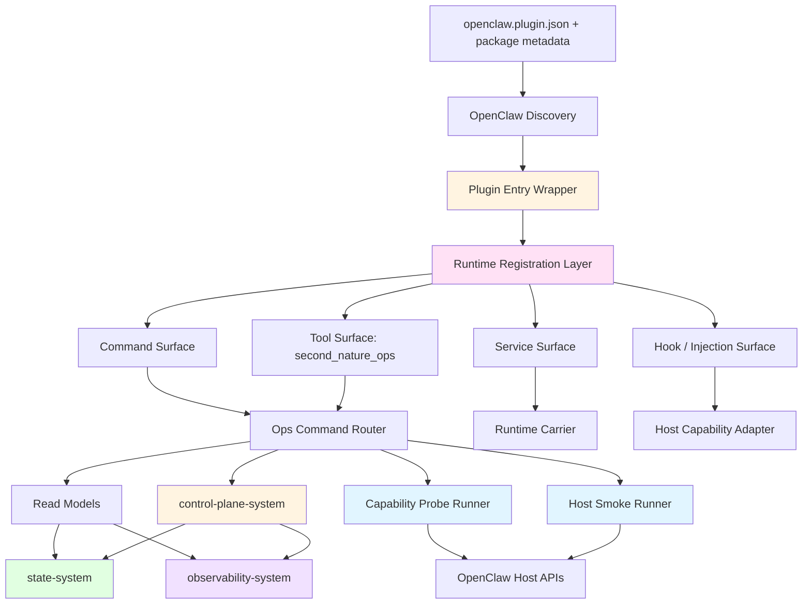
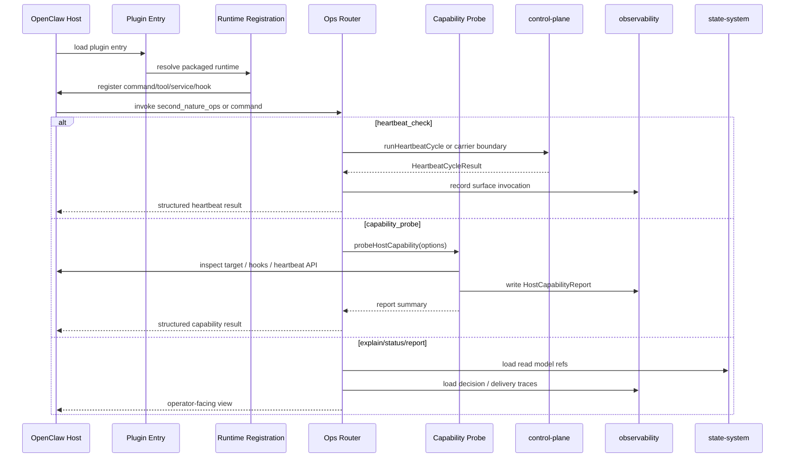
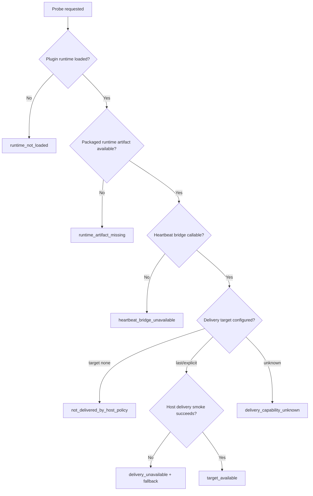
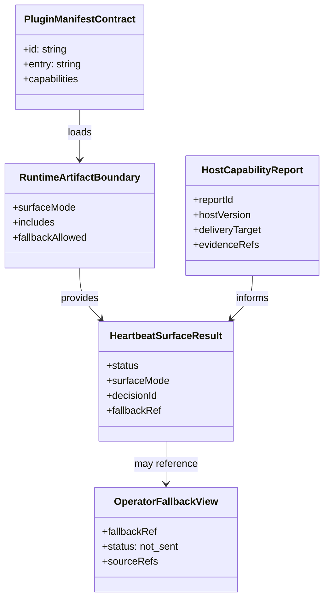

# CLI System 系统设计文档 (L0 — 导航层)

| 字段 | 值 |
| --- | --- |
| **System ID** | `cli-system` |
| **Project** | Second Nature |
| **Version** | 5.0 |
| **Status** | `Draft` |
| **Author** | GPT-5.5 |
| **Date** | 2026-05-01 |
| **L1 Detail** | [cli-system.detail.md](./cli-system.detail.md) — 仅 `/forge` 明确引用时加载 |

> [!IMPORTANT]
> **文档分层说明**
> - 本文件 (L0) 定义 v5 `cli-system` 的 OpenClaw command/tool/service surface、runtime artifact 边界、host capability probe、heartbeat delivery smoke 与 operator-facing explain 入口。
> - [cli-system.detail.md](./cli-system.detail.md) (L1) 放置配置常量、完整类型、核心伪代码、probe 决策树、边缘情况与测试辅助。
> - L1 中每一节都必须从本文件有入口，禁止孤岛实现细节。

---

## 目录 (Table of Contents)

| § | 章节 | 关键内容 |
| :---: | --- | --- |
| 1 | [概览](#1-概览-overview) | 系统目的、边界、职责 |
| 2 | [目标与非目标](#2-目标与非目标-goals--non-goals) | v5 CLI / plugin surface 目标 |
| 3 | [背景与上下文](#3-背景与上下文-background--context) | 从 v4 packaging 到 v5 capability proof |
| 4 | [系统架构](#4-系统架构-architecture) | 架构图、host smoke、数据流 |
| 5 | [接口设计](#5-接口设计-interface-design) | 操作契约、跨系统协议、宿主表面 |
| 6 | [数据模型](#6-数据模型-data-model) | manifest、surface、probe、fallback |
| 7 | [技术选型](#7-技术选型-technology-stack) | TypeScript / Node / OpenClaw native plugin |
| 8 | [Trade-offs](#8-trade-offs--alternatives-权衡与备选方案) | ADR 引用与本系统决策 |
| 9 | [安全性考虑](#9-安全性考虑-security-considerations) | 凭据、投递、fallback、host-safe |
| 10 | [性能考虑](#10-性能考虑-performance-considerations) | 启动、probe、artifact 体积 |
| 11 | [测试策略](#11-测试策略-testing-strategy) | 契约验证矩阵 |
| 12 | [部署与运维](#12-部署与运维-deployment--operations) | npm / ClawHub / host smoke |
| 13 | [未来考虑](#13-未来考虑-future-considerations) | OpenClaw API 演进 |
| 14 | [附录](#14-appendix-附录) | 术语、参考资料 |

**L1 实现层**: [§1 配置常量](./cli-system.detail.md#1-配置常量-config-constants) · [§2 数据结构](./cli-system.detail.md#2-核心数据结构完整定义-full-data-structures) · [§3 算法](./cli-system.detail.md#3-核心算法伪代码-non-trivial-algorithm-pseudocode) · [§4 决策树](./cli-system.detail.md#4-决策树详细逻辑-decision-tree-details) · [§5 边缘情况](./cli-system.detail.md#5-边缘情况与注意事项-edge-cases--gotchas)

---

## 1. 概览 (Overview)

### 1.1 System Purpose (系统目的)

`cli-system` 是 Second Nature v5 的 agent-facing ops surface。它把 Second Nature 暴露给 OpenClaw host、agent 和 owner：注册 command / tool / service，交付自足 runtime artifact，提供 status / report / explain / audit 视图，并承担 v5 最关键的宿主能力验证责任。

v5 的关键变化是：`cli-system` 不再只证明“插件能安装、命令能返回”。它必须能证明或否定“heartbeat 是否能以用户可见 delivery target 主动联系 owner”。这包括 `target: "none"`、`target: "last"`、显式 channel/to、`HEARTBEAT_OK` ack drop、`runHeartbeatOnce` / hook / injection 能力与 operator-visible fallback。

### 1.2 System Boundary (系统边界)

- **输入 (Input)**:
  - OpenClaw plugin discovery / load / register API
  - OpenClaw command / tool / service 调用
  - Owner 或 agent 发起的 status / explain / report / audit / capability probe 请求
  - control-plane 返回的 heartbeat result、delivery fallback、decision refs
  - state / observability 提供的 read model 与 smoke report
- **输出 (Output)**:
  - OpenClaw command / tool / service surface
  - `second_nature_ops` tool result
  - `second-nature` command result
  - `HostCapabilityReport`
  - `HostSmokeReport`
  - operator-facing read / explain / fallback view
  - packaged runtime artifact
- **依赖系统 (Dependencies)**: `control-plane-system`, `state-system`, `observability-system`, OpenClaw Runtime
- **被依赖系统 (Dependents)**: OpenClaw plugin host, owner operator flows, `/blueprint` host smoke tasks

### 1.3 System Responsibilities (系统职责)

**负责**:
- 声明 plugin manifest / config schema / command / tool / service surface。
- 把 command router、read models、action bridge、host bridge、probe runner 打入自足 runtime artifact。
- 暴露 `heartbeat_check`，并正确区分 `runtime_carrier_only` 与真实 decision loop。
- 执行或编排 host capability probe: delivery target、ack drop、runHeartbeatOnce/hook/injection 可用性。
- 通过 status / explain / audit 展示 delivery unavailable、fallback、target none、host unsupported 等原因。
- 为 README / release / `/blueprint` 提供可复现 smoke 证据。

**不负责**:
- 不决定 heartbeat 轮该做什么；由 `control-plane-system` 负责。
- 不生成朋友式 outreach draft；由 `behavioral-guidance-system` 负责。
- 不保存 life evidence / user interest truth；由 `state-system` 负责。
- 不把 delivery unavailable 改写成 sent。
- 不绕过 OpenClaw delivery 自建通知通道。
- 不把 host-safe 合成状态冒充完整 runtime 状态。

---

## 2. 目标与非目标 (Goals & Non-Goals)

### 2.1 Goals

- **[G1] [REQ-019]**: `heartbeat_check` 进入 command/tool surface，并能返回 host-safe ack、runtime carrier boundary 或真实 decision result。
- **[G2] [REQ-022]**: 为主动联系链路提供 operator-facing delivery/fallback/explain 视图，证明“是否真的联系了用户”。
- **[G3] [REQ-025]**: 提供 host capability probe 与 smoke report，验证 `target != "none"`、ack drop、delivery target、`runHeartbeatOnce` 或等价能力。
- **[G4] [REQ-026]**: 为 README / release note 提供 current / target / validation-needed 的真实能力边界证据。
- **[G5]**: 继承 ADR-006，自足发布包安装后不依赖源码仓 `src/`。

### 2.2 Non-Goals

- **[NG1]**: 不把 `cli-system` 做成独立业务 runtime 或新的 orchestration core。
- **[NG2]**: 不把 capability probe 结果当作 control-plane 决策逻辑。
- **[NG3]**: 不因 host capability 缺失而伪造用户可见 delivery。
- **[NG4]**: 不把整个源码仓打进插件包来逃避 artifact 边界。
- **[NG5]**: 不把 `HEARTBEAT_OK` ack drop 当作错误；它是必须验证的宿主语义。

---

## 3. 背景与上下文 (Background & Context)

### 3.1 Why This System? (为什么需要这个系统？)

v4 的 `cli-system` 解决了一个硬问题：发布包不能只是 wrapper，必须包含自足 runtime artifact。v5 在此基础上新增另一个硬问题：Second Nature 不能再把 `heartbeat_check` 成功返回当成“主动联系已成立”。如果 OpenClaw heartbeat 的 delivery target 是 `none`，或有效消息被 `HEARTBEAT_OK` ack drop 吞掉，owner 仍然不会看到 agent。

所以 `cli-system` 的 v5 职责非常具体：把宿主 capability 从“我们猜可以”变成“可以复现、可以解释、可以写进 smoke report”。这问题很工程，不浪漫，但它是朋友式主动联系能不能成立的门槛。别跳过，跳过就会回到 v4 的错觉里。

**关联 PRD 需求**: [REQ-019], [REQ-022], [REQ-025], [REQ-026]

### 3.2 Current State (现状分析)

- v4 已经定义 plugin command/tool/service surface 与 deployable runtime artifact 边界。
- 现有 v5 架构总览明确 `cli-system` 负责 command/tool/service surface、runtime artifact、host capability probe。
- `openclaw-lived-experience-closure-research.md` 已明确 `target: "none"`、`target: "last"`、ack drop、`runHeartbeatOnce` 等风险。
- `control-plane-system` 已定义 heartbeat decision loop，但 host delivery smoke 责任明确落在 `cli-system`。

### 3.3 Constraints (约束条件)

- **技术约束**: TypeScript + Node.js + OpenClaw native plugin。
- **发布约束**: npm / ClawHub / 本地路径安装后必须可加载包内 runtime artifact。
- **宿主约束**: plugin runtime 不能假设不存在的 heartbeat callback；delivery target 需以宿主能力为准。
- **事实约束**: host-safe carrier 只能声称 carrier 可用，不能声称 lived-experience loop 完整。
- **安全约束**: 凭据、channel target、recipient 与 fallback 内容必须脱敏或最小披露。

---

## 4. 系统架构 (Architecture)

### 4.1 Architecture Diagram (架构图)



完整 probe 决策树见 [L1 §4](./cli-system.detail.md#4-决策树详细逻辑-decision-tree-details)。

### 4.2 Core Components (核心组件)

| Component Name | Responsibility | Tech Stack | Notes |
| --- | --- | --- | --- |
| `Manifest Layer` | 声明 plugin id、entry、capabilities、config schema | JSON | runtime 前被宿主读取 |
| `Plugin Entry Wrapper` | 加载包内 runtime registration | TypeScript | 禁止引用源码仓 `src/` |
| `Runtime Registration Layer` | 注册 command / tool / service / hook | TypeScript / OpenClaw API | surface 唯一入口 |
| `Ops Command Router` | 路由 status / explain / report / audit / heartbeat / probe | TypeScript | command/tool 共用 |
| `Runtime Carrier` | 提供 packaged runtime lifecycle truth | TypeScript | 不伪装 per-heartbeat callback |
| `Capability Probe Runner` | 检测 host delivery / heartbeat / hooks / injection API | TypeScript | REQ-025 核心 |
| `Host Smoke Runner` | 产生可复现 smoke report | TypeScript | target/ack/fallback 验证 |
| `Read Models` | 读取 decision、delivery、fallback、capability report | TypeScript | 来自 state / observability |
| `Fallback View` | 展示 operator-visible fallback | TypeScript | 不等于 sent |

### 4.3 Data Flow (数据流)



### 4.4 Host Capability Probe Decision Tree



---

## 5. 接口设计 (Interface Design)

### 5.1 操作契约表 (Operation Contracts)

| 操作 | [REQ-XXX] | 前置条件 | 消耗/输入 | 产出/副作用 | 实现细节 |
| --- | :---: | --- | --- | --- | :---: |
| `registerPluginSurface(api)` | [REQ-019], [REQ-025] | plugin entry 已加载 | OpenClaw plugin API | 注册 command / tool / service / hook | [L1 §3.1](./cli-system.detail.md#31-registerpluginsurface) |
| `resolvePackagedRuntime()` | [REQ-019] | 发布包已安装 | package-local paths | runtime registration module 或错误 | [L1 §3.2](./cli-system.detail.md#32-resolvepackagedruntime) |
| `createOpsRouter(deps)` | [REQ-019], [REQ-026] | runtime deps 可创建 | read models; control-plane port; probe runner | ops router | [L1 §3.3](./cli-system.detail.md#33-createopsrouter) |
| `executeOpsCommand(command,args)` | [REQ-019], [REQ-022] | router 已创建 | command; args; output mode | structured result | [L1 §3.4](./cli-system.detail.md#34-executeopscommand) |
| `heartbeatCheck(args)` | [REQ-019], [REQ-022] | command/tool surface 可调用 | heartbeat metadata; optional probe mode | `HeartbeatSurfaceResult` | [L1 §3.5](./cli-system.detail.md#35-heartbeatcheck) |
| `probeHostCapability(options)` | [REQ-025] | host adapter 可用 | target; channel/to; API feature flags | `HostCapabilityReport` | [L1 §3.6](./cli-system.detail.md#36-probehostcapability) |
| `runHostSmoke(plan)` | [REQ-025], [REQ-026] | probe plan 已确认 | smoke cases; host version; workspace refs | `HostSmokeReport`; observability event | [L1 §3.7](./cli-system.detail.md#37-runhostsmoke) |
| `explainSurfaceSubject(subject)` | [REQ-022], [REQ-026] | read models 可读 | decision/outreach/delivery/probe subject | `ExplainReadModel` | [L1 §3.8](./cli-system.detail.md#38-explainsurfacesubject) |
| `showOperatorFallback(ref)` | [REQ-022], [REQ-025] | fallback ref 存在 | fallback id/ref | fallback view; next step | [L1 §3.9](./cli-system.detail.md#39-showoperatorfallback) |
| `fallbackUnavailable(reason)` | [REQ-019], [REQ-025] | runtime/probe 不可用 | command; host context | structured unavailable result | [L1 §3.10](./cli-system.detail.md#310-fallbackunavailable) |

### 5.2 跨系统接口协议 (Cross-System Interface)

```ts
export interface CliOpsRuntimePort {
  executeOpsCommand(input: OpsCommandInput): Promise<OpsCommandResult>;
  heartbeatCheck(input: HeartbeatSurfaceInput): Promise<HeartbeatSurfaceResult>;
  probeHostCapability(input: HostCapabilityProbeInput): Promise<HostCapabilityReport>;
  runHostSmoke(input: HostSmokePlan): Promise<HostSmokeReport>;
}

export interface ControlPlanePort {
  runHeartbeatCycle(signal: HeartbeatSignal): Promise<HeartbeatCycleResult>;
}

export interface OpsReadModelPort {
  loadStatusView(scope?: string): Promise<StatusView>;
  loadExplainView(subject: ExplainSubject): Promise<ExplainReadModel>;
  loadFallbackView(ref: string): Promise<OperatorFallbackView>;
  loadCapabilityReport(ref: string): Promise<HostCapabilityReport>;
}

export interface OpenClawHostAdapter {
  getHostVersion(): Promise<string | undefined>;
  inspectHeartbeatCapability(): Promise<HeartbeatHostFeatureSet>;
  inspectHeartbeatToolInvocation(input: HeartbeatToolInvocationProbe): Promise<CapabilityCheckResult>;
  inspectDeliveryTarget(input: DeliveryTargetProbeInput): Promise<DeliveryTargetProbeResult>;
  tryRunHeartbeatOnce?(input: RunHeartbeatOnceProbe): Promise<RunHeartbeatOnceProbeResult>;
}
```

完整类型、字段约束与枚举见 [L1 §2](./cli-system.detail.md#2-核心数据结构完整定义-full-data-structures)。

### 5.3 OpenClaw Surface Mapping

| Surface | 名称 | v5 语义 | 失败时必须返回 |
| --- | --- | --- | --- |
| Command | `second-nature` | 人类/agent ops 命令入口 | structured error + `requiredUserInput?` |
| Tool | `second_nature_ops` | OpenClaw agent-facing 工具入口 | stable JSON result |
| Service | `second-nature-runtime` | packaged runtime carrier / lifecycle truth | `runtime_carrier_only` 或 unavailable |
| Hook | `heartbeat_prompt_contribution` | 注入 evidence summary / capability hint | `hook_unavailable` 不阻塞 install |
| Hook | `message_sending` / `message_sent` | delivery audit 观察点 | `hook_unavailable` + probe reason |
| Runtime API | `runHeartbeatOnce` | 待验证增强路径 | `host_api_unavailable` |

### 5.4 Host-safe Carrier 表面矩阵

| 命令 / tool `command` | Host-safe 允许结果 | 不得声称 |
| --- | --- | --- |
| `heartbeat_check` | `runtime_carrier_only` / `heartbeat_ok` / structured result | 不得声称 user contact success，除非有 delivery attempt |
| `status` | runtime/surface/capability summary | 不得把合成 connector/credential 当真相 |
| `explain` | decision/delivery/probe/fallback explain | 不得编造 missing source refs |
| `report` | smoke/report/fallback summary | 不得把 fallback 写成 sent |
| `audit` | delivery/audit trace read model | 不得泄露凭据或完整 recipient secret |
| `capability_probe` | `HostCapabilityReport` | 不得把 `unknown` 当 `available` |

---

## 6. 数据模型 (Data Model)

### 6.1 核心实体 (Core Entities)

```ts
export type SurfaceMode = 'host_safe_carrier' | 'workspace_full_runtime' | 'capability_probe';
export type DeliveryCapabilityStatus =
  | 'target_available'
  | 'target_none'
  | 'channel_missing'
  | 'host_api_unavailable'
  | 'host_unsupported'
  | 'unknown';

export interface PluginManifestContract {
  id: string;
  name: string;
  version: string;
  entry: string;
  capabilities: {
    commands: string[];
    tools: string[];
    services: string[];
    hooks?: string[];
  };
}

export interface RuntimeArtifactBoundary {
  surfaceMode: SurfaceMode;
  includes: RuntimeArtifactModule[];
  fallbackAllowed: boolean;
  sourcePathDependencyAllowed: false;
}

export interface SourceRef {
  id: string;
  kind: 'platform_item' | 'workspace_artifact' | 'decision_record' | 'user_anchor' | 'connector_result' | 'host_report' | 'fallback_artifact';
  uri: string;
  excerptHash?: string;
  observedAt?: string;
}

export interface HostCapabilityDocReference {
  title: string;
  url: string;
  checkedAt: string;
  documentedBehavior: string;
}

export interface HostCapabilityConflictRecord {
  capability: string;
  documentedBehavior: string;
  observedBehavior: string;
  hostVersion?: string;
  docUrl?: string;
}

export interface HostCapabilityReport {
  reportId: string;
  generatedAt: string;
  hostVersion?: string;
  observedVersion?: string;
  docLinks: HostCapabilityDocReference[];
  conflictRecords: HostCapabilityConflictRecord[];
  heartbeatBridge: CapabilityCheckResult;
  heartbeatToolInvocation: CapabilityCheckResult;
  deliveryTarget: DeliveryCapabilityStatus;
  ackDropBehavior: CapabilityCheckResult;
  runHeartbeatOnce?: CapabilityCheckResult;
  hookSupport: CapabilityCheckResult[];
  evidenceRefs: SourceRef[];
  recommendedNextStep?: string;
}

export interface HeartbeatToolInvocationProbe {
  promptFixtureRef?: string;
  expectToolName: 'second_nature_ops';
  expectCommand: 'heartbeat_check';
  timeoutMs: number;
}

export interface HeartbeatSurfaceResult {
  ok: boolean;
  status: 'heartbeat_ok' | 'intent_selected' | 'denied' | 'deferred' | 'runtime_carrier_only' | 'delivery_unavailable';
  surfaceMode: SurfaceMode;
  decisionId?: string;
  deliveryAttemptId?: string;
  capabilityReportRef?: string;
  fallbackRef?: string;
  reasons: string[];
  /** When false, callers must not treat the round as lived-experience loop completion */
  livedExperienceLoopClaimed?: boolean;
  /** True when structured fields mirror a fake adapter for schema parity only */
  schemaParityOnly?: boolean;
}

export interface OperatorFallbackView {
  fallbackRef: string;
  reason: string;
  status: 'not_sent';
  sourceRefs: SourceRef[];
  candidateMessage?: string;
  nextStep: string;
}
```

> 配置常量、完整类型与测试 fixture 见 [L1 §1](./cli-system.detail.md#1-配置常量-config-constants)、[L1 §2](./cli-system.detail.md#2-核心数据结构完整定义-full-data-structures) 与 [L1 §6](./cli-system.detail.md#6-测试辅助-test-helpers)。

### 6.2 实体关系图 (Entity Relationship)



### 6.3 数据流向 (Data Flow Direction)

- `cli-system` 产出 surface invocation 与 host smoke 记录，但不成为 life evidence truth source。
- `control-plane-system` 产出 heartbeat result / delivery fallback / decision id。
- `observability-system` 保存 invocation、decision、delivery attempt、capability probe 与 smoke report trace。
- `state-system` 保存 fallback artifact、report index 与可查询 read model。
- OpenClaw host capability 只能被 probe / smoke 证明，不能被静态配置推断为成功。

---

## 7. 技术选型 (Technology Stack)

### 7.1 Core Technologies (核心技术)

| Domain | Choice | Rationale |
| --- | --- | --- |
| Runtime | TypeScript + Node.js | 继承主栈，贴合 OpenClaw plugin |
| Plugin Surface | OpenClaw native plugin | command/tool/service/hook 是宿主语义 |
| Packaging | deployable runtime artifact package | ADR-006，安装后不依赖源码仓 |
| Storage Read Path | state / observability read models | CLI 只读展示，不复制 truth |
| Probe | OpenClaw host adapter + structured smoke reports | REQ-025 需要可重复验证 |
| Output | JSON-first structured result | Agent-facing 工具优先稳定结构 |

### 7.2 Key Dependencies (关键依赖)

- OpenClaw plugin registration API
- OpenClaw heartbeat / delivery / hook / runtime API
- `control-plane-system` heartbeat runtime port
- `state-system` read model / fallback artifact port
- `observability-system` invocation / smoke / delivery trace port
- SQLite/sql.js + Markdown/JSON workspace artifacts via state layer

---

## 8. Trade-offs & Alternatives (权衡与备选方案)

### 8.1 跨系统决策引用

> **决策来源**: [ADR-001: 主技术栈、宿主运行时与验证策略选择](../03_ADR/ADR_001_TECH_STACK.md)
>
> 本系统使用 TypeScript + Node.js + OpenClaw native plugin，并承担 host smoke / capability probe 验证，不重复主栈选择理由。

> **决策来源**: [ADR-003: Second Nature 行为节律、Quiet 与记忆治理原则](../03_ADR/ADR_003_SECOND_NATURE_GOVERNANCE.md)
>
> 本系统只展示 Quiet / rhythm / memory 相关配置与结果，不拥有节律决策或记忆治理权。

> **决策来源**: [ADR-005: Heartbeat 作为 Second Nature 的主运行入口与三层运行时边界](../03_ADR/ADR_005_HEARTBEAT_RUNTIME_BOUNDARY.md)
>
> 本系统暴露 heartbeat shipping bridge 与 runtime surface，但不把 service carrier 表述为 per-heartbeat callback。

> **决策来源**: [ADR-006: 可发布的自足 Plugin Runtime Package](../03_ADR/ADR_006_DEPLOYABLE_PLUGIN_RUNTIME_PACKAGE.md)
>
> 本系统必须把 command/tool/service/probe 所需最小 runtime 打入自足发布包。

> **决策来源**: [ADR-007: Heartbeat Delivery 与 Life Evidence 闭环](../03_ADR/ADR_007_HEARTBEAT_DELIVERY_AND_LIFE_EVIDENCE_CLOSURE.md)
>
> 本系统实现 host capability probe、OpenClaw smoke report、operator-visible fallback 与 delivery target 可解释入口。

### 8.2 本系统特有决策: capability probe 作为一等 command/tool surface

**Option A: 一等 surface (Selected)**
- 优点: REQ-025 可复现，后续 blueprint 可直接拆任务。
- 缺点: command surface 更复杂，需要维护 report schema。

**Option B: 只写手工验证文档**
- 优点: 初期实现更少。
- 缺点: 不可审计，不适合回归，容易再次凭感觉判断宿主能力。

**Decision**: 选择 Option A。宿主能力是 v5 主动联系闭环的硬前提，不能靠 README 手工步骤糊过去。

### 8.3 本系统特有决策: JSON-first result，而不是人类文本优先

**Option A: JSON-first structured result (Selected)**
- 优点: OpenClaw tool / agent 调用稳定，可被 observability 与 tests 解析。
- 缺点: 人类直读需要二次格式化。

**Option B: 文本优先**
- 优点: 好看。
- 缺点: 解析困难，最容易让 fallback / sent / unknown 语义漂移。

**Decision**: 选择 Option A。人类可读视图可以是 formatter，底层契约必须结构化。

### 8.4 本系统特有决策: host-safe carrier 与 full runtime 明确分裂

**Option A: 明确 `surfaceMode` (Selected)**
- 优点: 防止 host-safe ack 被误判为完整 lived-experience loop。
- 缺点: 用户初看多一个概念。

**Option B: 只返回 `ok: true/false`**
- 优点: 简单。
- 缺点: 过度简化。这里“简单”是错的，会掩盖最关键的边界。

**Decision**: 选择 Option A。`ok: true` 在 v5 不够，它必须附带 surface/runtime truth。

---

## 9. 安全性考虑 (Security Considerations)

| Risk | Severity | Mitigation |
| --- | :---: | --- |
| 凭据或 recipient 明文出现在 CLI 输出 | 高 | redaction；只显示 channel class / masked target |
| host-safe 合成状态误导用户 | 高 | 所有结果带 `surfaceMode` 与 `status` |
| fallback 冒充已发送 | 高 | fallback view 固定 `status: not_sent` |
| probe 触发真实骚扰消息 | 高 | smoke 使用 dry-run / sentinel content / explicit consent gate |
| `HEARTBEAT_OK` 包住 alert 导致被 ack drop | 高 | smoke 验证 ack behavior；alert 不使用短 ack 格式 |
| hook 或 runtime API 不可用被吞掉 | 中 | 返回 `host_api_unavailable` 并写 report |
| command 参数注入或非法 subject | 中 | schema validate；unknown command 返回结构化错误 |

实现注意事项见 [L1 §5](./cli-system.detail.md#5-边缘情况与注意事项-edge-cases--gotchas)。

---

## 10. 性能考虑 (Performance Considerations)

### 10.1 Performance Goals (性能目标)

- plugin registration P95 < 500ms，不在 register 阶段做重型 probe。
- 普通 status/explain read P95 < 1s。
- host capability probe 可以较慢，但必须显式标注正在运行的 smoke case。
- 发布包体积保持最小运行时边界，不通过全仓打包换短期省事。

### 10.2 Optimization Strategies (优化策略)

1. **Lazy probe**: install/load 阶段只注册 surface，probe 由显式命令触发。
2. **Read model cache**: status/explain 读取 state / observability 的预聚合视图。
3. **Smoke case isolation**: 每个 smoke case 独立记录结果，失败不阻断其它 case。
4. **Artifact boundary**: 只打包 runtime deps，不打包测试、研究文档、开发脚本。

### 10.3 Monitoring Signals

- plugin load duration
- runtime artifact resolution status
- surface invocation count
- heartbeat_check status distribution
- capability probe status
- delivery target status
- fallback view count
- unknown command / validation error rate

---

## 11. 测试策略 (Testing Strategy)

### 11.1 Unit Testing (单元测试)

- `resolvePackagedRuntime()` 不访问源码仓 `src/`。
- `executeOpsCommand()` 对 unknown command、missing args、invalid subject 返回结构化错误。
- `heartbeatCheck()` 区分 `runtime_carrier_only`、真实 result、delivery unavailable。
- `showOperatorFallback()` 永远返回 `status: not_sent`。

### 11.2 Integration Testing (集成测试)

- command 与 `second_nature_ops` tool 对同一命令返回同一 schema。
- `heartbeat_check` 可调用 `control-plane-system.runHeartbeatCycle()` 或返回明确 carrier boundary。
- explain/status/report 能读取 observability 与 state read models。
- capability report 写入后可通过 explain/report 查询。

### 11.3 Host Smoke Testing (宿主冒烟)

- 插件可 install/load/register。
- `second_nature_ops({ command: "heartbeat_check" })` 可返回结构化结果。
- OpenClaw heartbeat turn 在真实/near-real prompt 下会实际调用 `second_nature_ops("heartbeat_check")`；若模型跳过 tool，必须记录 `heartbeat_tool_not_invoked`，不得当成 `HEARTBEAT_OK`。
- `target: "none"` heartbeat run 成功但 delivery 不成立。
- `target: "last"` 或 explicit channel/to 是否用户可见，写入 report。
- `HEARTBEAT_OK` ack drop 行为被验证。
- `runHeartbeatOnce` / hook / injection 可用性被验证或标记 unavailable。

### 11.4 Contract Verification Matrix (契约-验证责任矩阵)

| 契约 | 风险级别 | 正常态验证 | 失败态验证 | 回归责任 |
| --- | --- | --- | --- | --- |
| `registerPluginSurface(api)` | 高 | surface 全部注册成功 | API 缺失返回部分能力 report | plugin smoke |
| `resolvePackagedRuntime()` | 高 | 加载包内 runtime | 源码路径缺失不触发 fallback 常态 | packaging test |
| `heartbeatCheck(args)` | 高 | 返回真实 decision 或 ack | runtime 不可用返回 `runtime_carrier_only` | heartbeat bridge |
| heartbeat tool invocation | 高 | heartbeat turn 实际进入 `second_nature_ops("heartbeat_check")` | 模型跳过 tool 时记录 `heartbeat_tool_not_invoked` | host bridge smoke |
| `probeHostCapability(options)` | 高 | target available 写 report | target none / host unsupported 不算 sent | host capability |
| `runHostSmoke(plan)` | 高 | 生成 smoke report | 单 case 失败保留 reason | release gate |
| `explainSurfaceSubject(subject)` | 中 | explain delivery/probe/fallback | missing subject 返回 required input | explain read model |
| `OperatorFallbackView` | 高 | fallback 可查询 | 永不标记 sent | delivery fallback |
| JSON schema | 中 | command/tool schema 一致 | unknown command 结构化错误 | ops surface |

---

## 12. 部署与运维 (Deployment & Operations)

### 12.1 Runtime Artifact Boundary

发布包至少包含：
- plugin entry wrapper
- runtime registration layer
- command/tool/service definitions
- ops command router
- control-plane heartbeat bridge adapter
- host capability adapter
- probe/smoke runner
- read model adapters
- fallback shell

不得包含或依赖：
- 开发态 `src/` 相对路径假设
- 测试 fixture 作为运行依赖
- 未脱敏凭据或 host recipient 明文

### 12.2 Release Gate

每次 release 前需要产出：
- package contents check
- plugin install/load smoke
- `heartbeat_check` smoke
- target none smoke
- ack drop smoke
- delivery target availability report
- fallback visibility check

### 12.3 Recovery & Fallback

- packaged runtime 缺失: 返回 `runtime_artifact_missing`，不声称插件健康。
- full runtime 不可用: 返回 `runtime_carrier_only`，不冒充完整 loop。
- delivery target unavailable: 写 operator-visible fallback，`status = not_sent`。
- host API unknown: 写 `capability_unknown`，要求人工/上游验证。

---

## 13. 未来考虑 (Future Considerations)

- 如果 OpenClaw 稳定暴露 plugin-safe `runHeartbeatOnce({ heartbeat: { target: "last" } })`，可将其升级为首选主动 heartbeat smoke 与增强路径。
- 如果 OpenClaw 增加官方 delivery inspect API，`OpenClawHostAdapter` 可减少实验性 smoke。
- 如果后续支持多 owner / 多 channel，`HostCapabilityReport` 需要引入 owner identity 与 channel policy 维度。
- 如果 CLI 人类界面变重，可以引入 formatter 层，但底层 JSON 契约不变。

---

## 14. Appendix (附录)

### 14.1 Glossary (术语表)

- **Agent-facing Ops Surface**: OpenClaw command/tool/service/hook 暴露的操作表面。
- **Host Capability Probe**: 对 OpenClaw 当前宿主版本、delivery target、heartbeat API、hook/injection 能力的结构化检测。
- **Host Smoke Report**: 可复现宿主验证报告，说明某条能力是否真实成立。
- **Runtime Carrier**: packaged runtime 可加载和可提供 lifecycle truth 的最小运行体，不等于完整 heartbeat callback。
- **Operator-visible Fallback**: delivery 不可用时给操作者看的 fallback artifact，不等于已联系用户。

### 14.2 Optional Skills & Reference Resources (可选 Skills 与参考资源)

- `system-designer`: 用于 L0/L1 分层、操作契约表和契约验证矩阵。
- `sequential-thinking`: 本系统涉及 packaging、host capability 与 delivery 语义收敛，按其方法进行受控推理；未生成单独 replay 文件。

### 14.3 References (参考资料)

- [cli-system research](./_research/cli-system-research.md)
- [OpenClaw lived experience closure research](./_research/openclaw-lived-experience-closure-research.md)
- [PRD v5](../01_PRD.md)
- [Architecture Overview v5](../02_ARCHITECTURE_OVERVIEW.md)
- [ADR-001](../03_ADR/ADR_001_TECH_STACK.md)
- [ADR-003](../03_ADR/ADR_003_SECOND_NATURE_GOVERNANCE.md)
- [ADR-005](../03_ADR/ADR_005_HEARTBEAT_RUNTIME_BOUNDARY.md)
- [ADR-006](../03_ADR/ADR_006_DEPLOYABLE_PLUGIN_RUNTIME_PACKAGE.md)
- [ADR-007](../03_ADR/ADR_007_HEARTBEAT_DELIVERY_AND_LIFE_EVIDENCE_CLOSURE.md)

### 14.4 Change Log (变更日志)

| Version | Date | Changes | Author |
| --- | --- | --- | --- |
| 5.0 | 2026-05-01 | 从 v4 plugin packaging 设计升级为 v5 host capability / delivery smoke / ops surface 设计 | GPT-5.5 |
