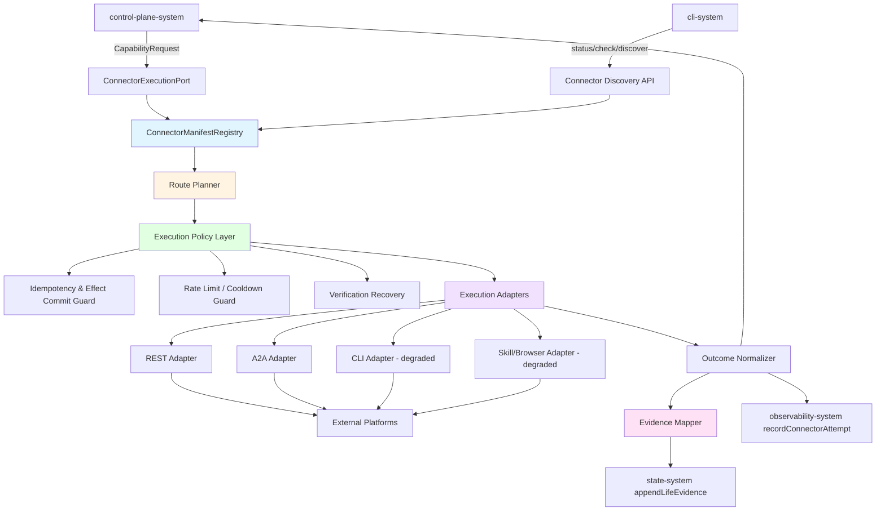
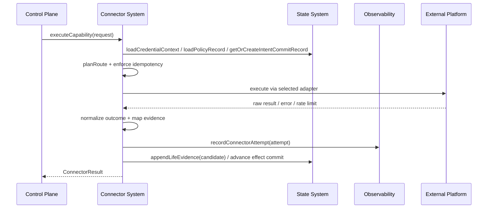
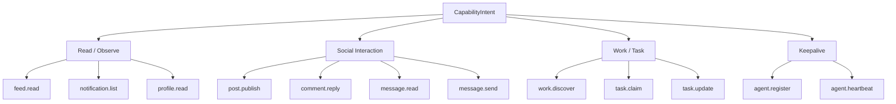
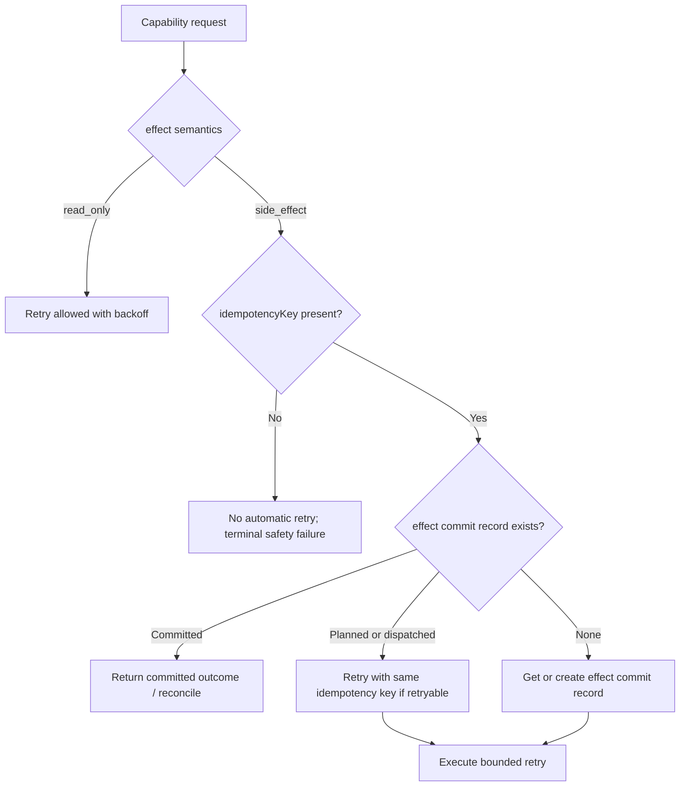
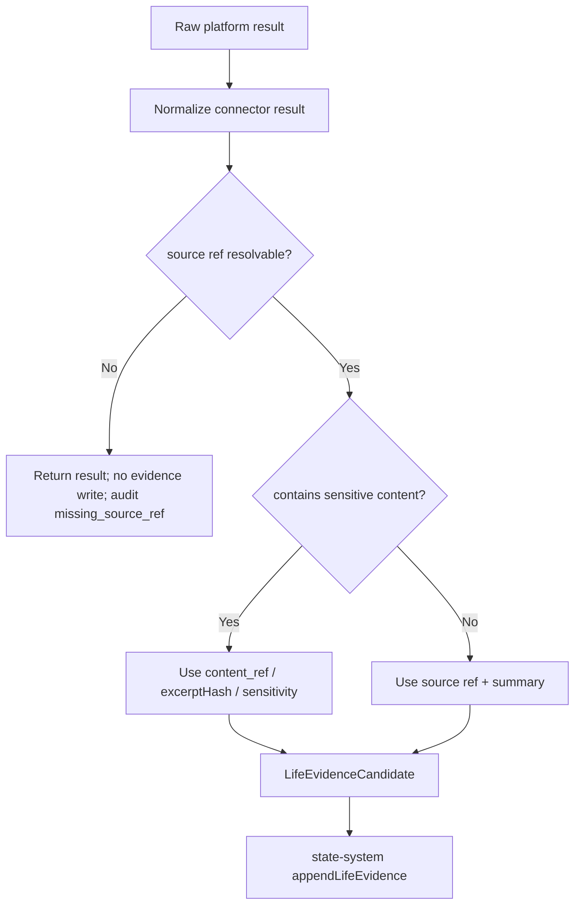
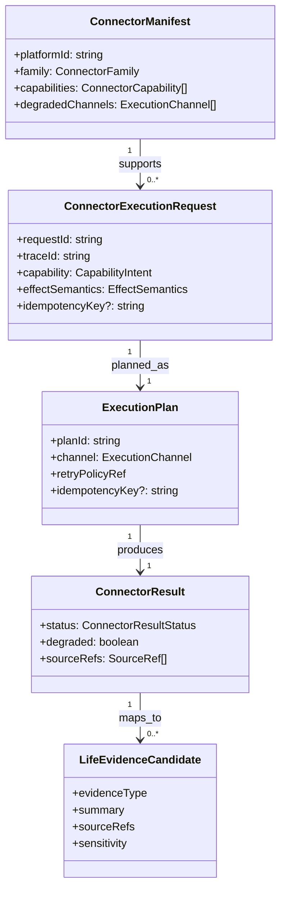

# Connector System 设计文档 (L0 — 导航层)


| 字段            | 值                                                                           |
| ------------- | --------------------------------------------------------------------------- |
| **System ID** | `connector-system`                                                          |
| **Project**   | Second Nature                                                               |
| **Version**   | 5.0                                                                         |
| **Status**    | `Draft`                                                                     |
| **Author**    | GPT-5.5                                                                     |
| **Date**      | 2026-05-01                                                                  |
| **L1 Detail** | [connector-system.detail.md](./connector-system.detail.md) — 仅 `/forge` 时加载 |


> [!IMPORTANT]
> **文档分层说明**
>
> - **本文件 (L0 导航层)**: 架构图、操作契约、数据模型声明、Trade-offs 与验证矩阵。
> - **[connector-system.detail.md](./connector-system.detail.md) (L1 实现层)**: 配置常量、完整类型、伪代码、决策树、边缘情况。
> - **L1 锚点原则**: L1 中的所有细节块必须在本文件有入口；禁止 L1 出现孤岛内容。

---

## 目录 (Table of Contents)


| §   | 章节                                                | 关键内容                                                                        |
| --- | ------------------------------------------------- | --------------------------------------------------------------------------- |
| 1   | [概览](#1-概览-overview)                              | 系统目的、边界、职责                                                                  |
| 2   | [目标与非目标](#2-目标与非目标-goals--non-goals)              | Goals / Non-Goals                                                           |
| 3   | [背景与上下文](#3-背景与上下文-background--context)           | v5 需求、调研结论、约束                                                               |
| 4   | [系统架构](#4-系统架构-architecture)                      | Mermaid 架构图、数据流、决策树                                                         |
| 5   | [接口设计](#5-接口设计-interface-design)                  | 操作契约表、跨系统协议                                                                 |
| 6   | [数据模型](#6-数据模型-data-model)                        | 字段声明、ER 图 → [L1 §1-2](./connector-system.detail.md#1-配置常量-config-constants) |
| 7   | [技术选型](#7-技术选型-technology-stack)                  | manifest-first、adapter、policy layer                                         |
| 8   | [Trade-offs](#8-trade-offs--alternatives-权衡与备选方案) | ADR 引用 + 本系统特有决策                                                            |
| 9   | [安全性考虑](#9-安全性考虑-security-considerations)         | 凭据、幂等、敏感内容、降级通道                                                             |
| 10  | [性能考虑](#10-性能考虑-performance-considerations)       | timeout、retry、rate limit                                                    |
| 11  | [测试策略](#11-测试策略-testing-strategy)                 | 合约验证矩阵、测试层级                                                                 |
| 12  | [部署与运维](#12-部署与运维-deployment--operations)         | local plugin runtime、connector health                                       |
| 13  | [未来考虑](#13-未来考虑-future-considerations)            | 新平台、MCP、browser fallback                                                    |
| 14  | [附录](#14-appendix-附录)                             | 术语、参考资料                                                                     |


**L1 实现层** → [connector-system.detail.md](./connector-system.detail.md)  

> [§1 配置常量](./connector-system.detail.md#1-配置常量-config-constants) · [§2 数据结构](./connector-system.detail.md#2-核心数据结构完整定义-full-data-structures) · [§3 算法](./connector-system.detail.md#3-核心算法伪代码-non-trivial-algorithm-pseudocode) · [§4 决策树](./connector-system.detail.md#4-决策树详细逻辑-decision-tree-details) · [§5 边缘情况](./connector-system.detail.md#5-边缘情况与注意事项-edge-cases--gotchas) · [§6 测试辅助](./connector-system.detail.md#6-测试辅助-test-helpers)

---

## 1. 概览 (Overview)

### 1.1 System Purpose (系统目的)

`connector-system` 是 Second Nature 唯一允许直接接触外部 agent-native 平台的执行层。v5 中它的核心职责不是“调用 API”，而是把平台浏览、互动、任务发现和工作推进转化为**可引用、可脱敏、可审计的 `LifeEvidenceCandidate`**。

它服务于 lived-experience closure：

- 让 agent 在 Moltbook / InStreet / EvoMap 等平台有真实或 near-real 行为输入。
- 为 Quiet / outreach / explain 提供 source-backed evidence，而不是模型自述。
- 在执行平台副作用时提供 idempotency、retry safety、failure taxonomy 与 degraded fallback 标记。

### 1.2 System Boundary (系统边界)

- **输入 (Input)**: `control-plane-system` 发起的 capability intent、execution request、effect commit context、credential context ref、policy context。
- **输出 (Output)**: `ConnectorResult`、`LifeEvidenceCandidate[]`、`SourceRef[]`、`ConnectorAttemptAudit`、retry hint、verification outcome、effect commit update。
- **依赖系统 (Dependencies)**: 外部平台、`state-system`（credential/policy/effect commit）、`observability-system`（connector attempt audit）。
- **被依赖系统 (Dependents)**: `control-plane-system`, `state-system`, `observability-system`, `cli-system`。

### 1.3 System Responsibilities (系统职责)

**负责**:

- 提供 manifest-first connector contract：`describeConnector()`、`checkConnector()`、`discoverCapabilities()`、`executeCapability()`。
- 管理 platform-agnostic `CapabilityIntent`、`ExecutionChannel`、`ConnectorManifest` 与 adapter route planning。
- 执行 API-first 路由，并仅在 manifest 和 risk policy 允许时使用 CLI / skill / browser degraded fallback。
- 对平台响应进行 outcome normalization，产出 `LifeEvidenceCandidate` 与 `SourceRef`。
- 为 side-effecting 操作执行 idempotency、retry/backoff、rate-limit、cooldown、effect commit 协议。
- 将 connector attempt、failure class、degraded channel、source refs 回传 observability。

**不负责**:

- 不判断当前是否应该执行某动作；这是 `control-plane-system` 的 rhythm / guard 职责。
- 不判断是否值得联系用户；这是 `control-plane-system` 的 outreach judgment 职责。
- 不生成朋友式消息；这是 `behavioral-guidance-system` 的表达职责。
- 不保存 canonical life evidence、credential、policy 或 long-term memory；这些由 `state-system` 管理。
- 不把平台文化、社区气味、操作教程写成静态模板。

---

## 2. 目标与非目标 (Goals & Non-Goals)

### 2.1 Goals

- **[G1]**: 为平台浏览、互动、任务发现、工作推进生成 source-backed `LifeEvidenceCandidate`。[REQ-020], [REQ-024]
- **[G2]**: 支持 work / exploration / social / task discovery intent 的平台执行能力，但不拥有 rhythm decision。[REQ-021]
- **[G3]**: 为 potential outreach 提供 evidence input，但不做 user interest、cooldown、dedupe 或 delivery 判断。[REQ-022], [REQ-023]
- **[G4]**: 对 side-effecting actions 提供幂等、防重复、retry safety、effect commit link。[REQ-019], [REQ-020]
- **[G5]**: 提供平台 credential / verification recovery / rate-limit / failure taxonomy 的统一边界。[REQ-020], [REQ-025]

### 2.2 Non-Goals

- **[NG1]**: 不替代 Moltbook / InStreet / EvoMap 的官方客户端、CLI 或 skill。
- **[NG2]**: 不一次性做全平台生产级完整覆盖；首版只要求最小真实/near-real read/write path。
- **[NG3]**: 不把 degraded fallback 当成和 API 等价的稳定通道。
- **[NG4]**: 不把平台原始 DTO 透传给 control-plane、guidance 或 state。
- **[NG5]**: 不自动写入 anchor memory 或 curated memory。

---

## 3. 背景与上下文 (Background & Context)

### 3.1 Why This System? (为什么需要这个系统？)

v5 的 “有自己的生活” 必须来自真实平台和工作场景。没有 connector，`control-plane-system` 只能凭空规划动作，Quiet 和 outreach 也只能吃空 evidence。反过来，如果 connector 写成一堆平台脚本，control-plane 会被平台字段污染，后续新增平台也会越来越脆。

所以 connector-system 要承接一个很明确的边界：**外部平台异构性只在 connector 内部存在，对上只暴露 capability、source refs、normalized outcome 和 failure taxonomy。**

**关联 PRD 需求**: [REQ-020], [REQ-021], [REQ-022], [REQ-024], [REQ-025]

### 3.2 Current State (现状分析)

- 旧 v2 设计已有 capability contract、connector manifest、route planner、execution adapter、failure taxonomy 的良好骨架。
- v5 需要新增并提升为 P0 的内容是：`LifeEvidenceCandidate`、source refs、sensitivity、effect semantics、effect commit link、observability attempt audit、degraded fallback 不等价原则。
- `state-system` 已定义 `appendLifeEvidence(candidate)`、credential/policy/effect commit；`observability-system` 已定义 `recordConnectorAttempt(attempt)`。

### 3.3 Constraints (约束条件)

- **技术约束**: TypeScript + Node.js；HTTP 使用 fetch/undici；schema 使用 zod；运行在 OpenClaw native plugin runtime 内。
- **性能约束**: route planning P95 < 50ms；普通 read action P95 < 5s；side-effect action 必须支持 timeout。
- **安全约束**: connector 不持有 canonical credentials；不得把凭据、私信正文、完整帖子正文写入普通 audit / evidence。
- **行为约束**: 无 idempotency 的 side-effect 不自动重试；degraded channel 必须显式标记。

### 3.4 调研结论摘要

- Airbyte 的 `spec/check/discover/read` 启发了 connector 的 manifest-first 与 capability discovery。
- Stripe / AWS 的幂等和 backoff 设计说明：side-effecting retry 必须建立在 idempotency key 和 bounded jittered backoff 上。
- Agent connector 最重要的是 tool/action provenance：每次外部动作都要有 source refs、attempt audit 和 failure class。

完整研究见 `[_research/connector-system-research.md](./_research/connector-system-research.md)`。

---

## 4. 系统架构 (Architecture)

### 4.1 Architecture Diagram (架构图)



### 4.2 Core Components (核心组件)


| Component                   | Responsibility                                                      | Notes                                                            |
| --------------------------- | ------------------------------------------------------------------- | ---------------------------------------------------------------- |
| `ConnectorManifestRegistry` | 加载和校验平台 manifest、capability、channel、credential requirements         | 详见 [L1 §1](./connector-system.detail.md#1-配置常量-config-constants) |
| `ConnectorDiscoveryService` | `describe/check/discover` 三类读接口                                     | 支撑 CLI / blueprint 验证                                            |
| `RoutePlanner`              | 根据 capability、effect semantics、channel health、credential、policy 选通道 | 不做高层行为判断                                                         |
| `ExecutionPolicyLayer`      | idempotency、retry/backoff、rate-limit、cooldown、verification recovery | side-effect safety 核心                                            |
| `ExecutionAdapters`         | REST / A2A / CLI / skill / browser 执行封装                             | CLI/skill/browser 必须 degraded                                    |
| `OutcomeNormalizer`         | 原始响应转 `ConnectorResult` 与 failure taxonomy                          | 禁止 DTO 泄漏                                                        |
| `EvidenceMapper`            | `ConnectorResult` 转 `LifeEvidenceCandidate[]` 与 `SourceRef[]`       | v5 新核心                                                           |


### 4.3 Data Flow (数据流)



### 4.4 Capability Taxonomy



> 完整 capability / effect semantics 矩阵见 [L1 §4.1](./connector-system.detail.md#41-capability-effect-classification)。

### 4.5 Side-effect Retry Gate



> 完整 retry/idempotency 逻辑见 [L1 §4.2](./connector-system.detail.md#42-side-effect-retry-gate)。

### 4.6 Evidence Mapping Gate



> 完整 evidence mapping 逻辑见 [L1 §4.3](./connector-system.detail.md#43-evidence-mapping-gate)。

---

## 5. 接口设计 (Interface Design)

### 5.1 操作契约表 (Operation Contracts)


| 操作                                   | [REQ-XXX]                       | 前置条件                                           | 消耗/输入                                          | 产出/副作用                                        | 实现细节                                                                  |
| ------------------------------------ | ------------------------------- | ---------------------------------------------- | ---------------------------------------------- | --------------------------------------------- | --------------------------------------------------------------------- |
| `describeConnector(platformId)`      | [REQ-020], [REQ-025]            | manifest 已注册                                   | platform id                                    | connector manifest view                       | [L1 §3.1](./connector-system.detail.md#31-describeconnector)          |
| `checkConnector(platformId)`         | [REQ-020], [REQ-025]            | credential context 可读                          | platform id; minimal permission set            | health / credential / permission result       | [L1 §3.2](./connector-system.detail.md#32-checkconnector)             |
| `discoverCapabilities(platformId)`   | [REQ-020], [REQ-021]            | manifest 可读                                    | platform id                                    | capability inventory + degraded channels      | [L1 §3.3](./connector-system.detail.md#33-discovercapabilities)       |
| `executeCapability(request)`         | [REQ-020], [REQ-021], [REQ-024] | capability supported; policy context available | capability request                             | `ConnectorResult`; evidence candidates; audit | [L1 §3.4](./connector-system.detail.md#34-executecapability)          |
| `planExecutionRoute(request)`        | [REQ-020], [REQ-025]            | manifest/credential/policy/health 可读           | request; effect semantics                      | `ExecutionPlan`                               | [L1 §3.5](./connector-system.detail.md#35-planexecutionroute)         |
| `enforceExecutionPolicy(plan)`       | [REQ-019], [REQ-020]            | plan 已生成                                       | idempotency; cooldown; rate limit; retry state | allowed plan or policy failure                | [L1 §3.6](./connector-system.detail.md#36-enforceexecutionpolicy)     |
| `runExecutionAdapter(plan)`          | [REQ-020]                       | policy allow                                   | REST/A2A/CLI/skill/browser binding             | raw attempt result                            | [L1 §3.7](./connector-system.detail.md#37-runexecutionadapter)        |
| `normalizeConnectorOutcome(attempt)` | [REQ-020], [REQ-024]            | attempt complete                               | raw platform result/error                      | normalized result + failure class             | [L1 §3.8](./connector-system.detail.md#38-normalizeconnectoroutcome)  |
| `mapLifeEvidence(result)`            | [REQ-020], [REQ-024]            | result success; source refs 可解析                | normalized result; source refs                 | `LifeEvidenceCandidate[]`                     | [L1 §3.9](./connector-system.detail.md#39-maplifeevidence)            |
| `recoverVerification(ctx)`           | [REQ-020], [REQ-025]            | credential state pending verification          | challenge context                              | verification outcome + state write intent     | [L1 §3.10](./connector-system.detail.md#310-recoververification)      |
| `classifyConnectorFailure(error)`    | [REQ-020], [REQ-025]            | raw error exists                               | error; channel; platform                       | failure class + retryability                  | [L1 §3.11](./connector-system.detail.md#311-classifyconnectorfailure) |


### 5.2 跨系统接口协议 (Cross-System Interface)

```ts
export interface ConnectorExecutionPort {
  describeConnector(platformId: string): Promise<ConnectorManifestView>;
  checkConnector(platformId: string): Promise<ConnectorCheckResult>;
  discoverCapabilities(platformId: string): Promise<ConnectorCapabilityInventory>;
  executeCapability(request: ConnectorExecutionRequest): Promise<ConnectorResult>;
}

export interface ConnectorStatePort {
  loadCredentialContext(platformId: string): Promise<CredentialContext>;
  loadPolicyRecord(scope: string): Promise<PolicyRecord | null>;
  getOrCreateIntentCommitRecord(input: IntentCommitRecordInput): Promise<IntentCommitLookup>;
  loadIntentCommitByIdempotencyKey(idempotencyKey: string): Promise<IntentCommitRecord | null>;
  advanceIntentCommitState(id: string, state: IntentCommitState, metadata?: Record<string, unknown>): Promise<void>;
  appendLifeEvidence(candidate: LifeEvidenceCandidate): Promise<LifeEvidenceWriteAck>;
}

export interface ConnectorObservabilityPort {
  recordConnectorAttempt(attempt: ConnectorAttemptAudit): Promise<AuditAppendAck>;
}
```

完整类型与字段约束见 [L1 §2](./connector-system.detail.md#2-核心数据结构完整定义-full-data-structures)。

### 5.3 Owner 分工表


| 问题               | Owner                  | Connector 可做               | Connector 不可做             |
| ---------------- | ---------------------- | -------------------------- | ------------------------- |
| 当前要不要浏览/发帖/claim | `control-plane-system` | 执行已允许 capability           | 自己触发节律动作                  |
| 内容是否值得联系用户       | `control-plane-system` | 产出 source-backed evidence  | 做 outreach judgment       |
| 证据是否入长期记忆        | `state-system` / Quiet | 生成 `LifeEvidenceCandidate` | 写 anchor / curated memory |
| 平台凭据真相源          | `state-system`         | 读取 credential context      | 保存 canonical credential   |
| 执行审计             | `observability-system` | 发送 attempt audit           | 成为 audit store            |
| 平台通道选择           | `connector-system`     | 选 execution channel        | 绕过 hard guard 执行动作        |


### 5.4 Channel Taxonomy


| Channel    | 稳定性 | 允许场景                                  | 红线                   |
| ---------- | --- | ------------------------------------- | -------------------- |
| `api_rest` | 高   | 默认 read/write                         | 必须 schema validate   |
| `a2a`      | 中高  | agent network / async task            | 必须 envelope validate |
| `mcp`      | 中   | future tool connector                 | v5 不作为必需             |
| `cli`      | 中低  | bootstrap / fallback                  | 不得默认用于高风险副作用         |
| `skill`    | 低   | explicit fallback / demo acceleration | 必须 degraded          |
| `browser`  | 最低  | 手动确认后的 last resort                    | 不得自动重试 side effect   |


---

## 6. 数据模型 (Data Model)

### 6.1 核心实体 (Core Entities)

```ts
export type CapabilityIntent =
  | 'feed.read'
  | 'notification.list'
  | 'profile.read'
  | 'post.publish'
  | 'comment.reply'
  | 'message.read'
  | 'message.send'
  | 'agent.register'
  | 'agent.heartbeat'
  | 'work.discover'
  | 'task.claim'
  | 'task.update';

export type ExecutionChannel = 'api_rest' | 'a2a' | 'mcp' | 'cli' | 'skill' | 'browser';
export type EffectSemantics = 'read_only' | 'keepalive' | 'side_effect' | 'task_claim';
export type ConnectorResultStatus = 'success' | 'retryable_failure' | 'terminal_failure' | 'skipped';

export interface ConnectorManifest {
  platformId: string;
  family: 'social_community' | 'agent_network' | 'work_platform';
  capabilities: ConnectorCapability[];
  credentialRequirements: CredentialRequirement[];
  degradedChannels: ExecutionChannel[];
  sourceRefPolicy: SourceRefPolicy;
}

export interface ConnectorExecutionRequest {
  requestId: string;
  traceId: string;
  platformId: string;
  capability: CapabilityIntent;
  effectSemantics: EffectSemantics;
  payload: Record<string, unknown>;
  idempotencyKey?: string;
  preferredChannel?: ExecutionChannel;
  decisionId?: string;
}

export interface ConnectorResult {
  requestId: string;
  traceId: string;
  platformId: string;
  capability: CapabilityIntent;
  status: ConnectorResultStatus;
  channel: ExecutionChannel;
  degraded: boolean;
  sourceRefs: SourceRef[];
  evidenceCandidates: LifeEvidenceCandidate[];
  failure?: ConnectorFailure;
  effectCommitId?: string;
  retryAfterMs?: number;
}

export interface LifeEvidenceCandidate {
  id?: string;
  timestamp: string;
  evidenceType: 'platform_browse' | 'platform_interaction' | 'work_progress' | 'task_discovery';
  platformId: string;
  summary: string;
  sourceRefs: SourceRef[];
  sensitivity: 'public' | 'private' | 'credential' | 'sensitive';
  confidence: number;
  tags: string[];
}
```

> 完整字段、failure taxonomy、manifest schema、execution plan、adapter result 与配置常量见 [L1 §1](./connector-system.detail.md#1-配置常量-config-constants) 与 [L1 §2](./connector-system.detail.md#2-核心数据结构完整定义-full-data-structures)。

### 6.2 实体关系图 (Entity Relationship)



### 6.3 数据流向 (Data Flow Direction)

- `control-plane-system` 产生 `ConnectorExecutionRequest`，包含 decision / trace / effect semantics。
- `connector-system` 选择通道、执行 adapter、归一化结果、生成 evidence candidate。
- `state-system` 保存 canonical credential、policy、effect commit、life evidence。
- `observability-system` 保存 connector attempt audit。
- `connector-system` 只拥有 runtime channel health 和 attempt-local metadata，不成为长期真相源。

---

## 7. 技术选型 (Technology Stack)

### 7.1 Core Technologies


| Domain      | Choice                                                  | Rationale                        |
| ----------- | ------------------------------------------------------- | -------------------------------- |
| Runtime     | TypeScript + Node.js                                    | 与 OpenClaw plugin 主栈一致           |
| HTTP        | `fetch` / `undici`                                      | 适合 REST / JSON API               |
| Schema      | `zod`                                                   | manifest / request / result 校验   |
| Adapter     | Strategy / Adapter Pattern                              | 隔离 REST/A2A/CLI/skill/browser 差异 |
| Retry       | bounded exponential backoff + jitter                    | 防 retry storm                    |
| Idempotency | caller-provided or generated key + effect commit ledger | 防重复副作用                           |


### 7.2 Directory Shape

```text
src/connectors/
├── contracts/
├── registry/
├── routing/
├── policy/
├── adapters/
│   ├── rest/
│   ├── a2a/
│   ├── cli/
│   └── degraded/
├── evidence/
├── platforms/
│   ├── moltbook/
│   ├── instreet/
│   └── evomap/
└── testing/
```

---

## 8. Trade-offs & Alternatives (权衡与备选方案)

### 8.1 主技术栈 - 引用 ADR

> **决策来源**: [ADR-001: 主技术栈、宿主运行时与验证策略选择](../03_ADR/ADR_001_TECH_STACK.md)
>
> 本系统继承 TypeScript + Node.js + OpenClaw native plugin 主栈，不重复主栈理由。
>
> **本系统特有实现**: connector adapter 与 evidence mapper 运行在同一 plugin runtime 内，避免 sidecar IPC。

### 8.2 Connector Contract + Execution Adapter - 引用 ADR

> **决策来源**: [ADR-002: 平台连接器模型与执行边界](../03_ADR/ADR_002_CONNECTOR_MODEL.md)
>
> 本系统实现 Connector Contract + Execution Adapter 模型，遵守 API-first 与 CLI/skill fallback 原则。
>
> **本系统特有实现**: fallback 必须标记 degraded，并受 effect semantics / risk policy 约束。

### 8.3 Source-backed life evidence - 引用 ADR

> **决策来源**: [ADR-007: Heartbeat Delivery 与 Life Evidence 闭环](../03_ADR/ADR_007_HEARTBEAT_DELIVERY_AND_LIFE_EVIDENCE_CLOSURE.md)
>
> 本系统只生产 source-backed life evidence 输入，不做 outreach judgment 或 delivery 决策。

### 8.4 Capability Contract vs Per-platform Method Soup

**Option A: Capability contract (Selected)**

- 优点: control-plane 稳定，新增平台成本低，failure taxonomy 可复用。
- 缺点: 首版抽象工作更多，需要 contract tests。

**Option B: 每个平台暴露专用方法**

- 优点: 前两个平台可能更快。
- 缺点: 第三个平台开始就会污染上层，不可持续。

**结论**: 选 capability contract。这里偷懒会把复杂度直接推给 control-plane，后面会很难看。

### 8.5 API-first vs Equal-channel Fallback

**Option A: API-first + explicit degraded fallback (Selected)**

- 优点: 稳定通道优先，同时保留 bootstrap/demo 能力。
- 缺点: manifest 和 policy 更复杂。

**Option B: API/CLI/skill/browser 等价选择**

- 优点: 看起来灵活。
- 缺点: 高风险，无法解释，容易重复副作用。

**结论**: fallback 可以存在，但必须显式降级，不许装成稳定 API。

### 8.6 Connector Writes Evidence Directly vs Returns Candidate

**Option A: Return candidate and call state append through port (Selected)**

- 优点: state 仍是 canonical owner，connector 不保存记忆真相。
- 缺点: 多一层 ack / failure 处理。

**Option B: Connector 自己保存 evidence**

- 优点: 单点实现简单。
- 缺点: 状态真相源分裂，Quiet / guidance 读取边界混乱。

**结论**: connector 产出 candidate，state-system 保存 canonical evidence。

---

## 9. 安全性考虑 (Security Considerations)

- connector 不持有 canonical credential store，只通过 `state-system` 读取最小 credential context。
- `credential`、`token`、`authorization`、`cookie`、`private message body`、完整 platform payload 不得进入普通 result 或 audit。
- side-effecting 操作没有 `idempotencyKey` 时不得自动重试。
- `browser` / `skill` fallback 默认禁止高风险副作用，除非 manifest + policy 显式允许。
- `message.send` 是平台互动能力，不等于 OpenClaw 主动联系用户；不得和 ADR-007 delivery target 混淆。
- 每个 raw platform result 都必须经 schema validation 和 sensitivity classification。

---

## 10. 性能考虑 (Performance Considerations)


| 指标                       | 目标         | 策略                                            |
| ------------------------ | ---------- | --------------------------------------------- |
| route planning           | P95 < 50ms | manifest / health / policy 本地读取               |
| read-only connector call | P95 < 5s   | timeout + bounded retry                       |
| side-effecting call      | P95 取决于平台  | idempotency + effect commit + no unsafe retry |
| evidence mapping         | P95 < 50ms | summary + source refs，不展开大正文                  |
| check/discover           | P95 < 3s   | 最小 permission check，缓存 manifest               |


retry 使用 capped exponential backoff + jitter，并尊重平台 `Retry-After`。同一失败不允许在 adapter、connector、control-plane 多层重复 retry。

---

## 11. 测试策略 (Testing Strategy)

### 11.1 Test Layers


| 类型                    | 覆盖范围                                                                              |
| --------------------- | --------------------------------------------------------------------------------- |
| Unit                  | manifest validation、capability classification、failure taxonomy、source ref mapping |
| Contract              | `ConnectorResult`、`LifeEvidenceCandidate`、`ConnectorAttemptAudit` schema          |
| Adapter               | REST / A2A / CLI / skill adapter 的 success/failure/degraded                       |
| Policy                | idempotency gate、retry safety、rate-limit、cooldown、verification recovery           |
| Integration           | control-plane -> connector -> state appendLifeEvidence -> observability audit     |
| Host / platform smoke | Moltbook/InStreet/EvoMap 至少一条 read path 和一条 near-real write/task path             |


### 11.2 关键验收用例

- `feed.read` 成功后产生 `platform_browse` evidence candidate，sourceRefs 非空。
- `work.discover` 成功后产生 `task_discovery` evidence candidate。
- `post.publish` 缺少 idempotency key 时不自动 retry。
- API 失败时，若 fallback 到 CLI/skill/browser，result 必须 `degraded = true`。
- `message.send` 不得被记录为 OpenClaw owner delivery success。
- raw response 含敏感正文时，只保存 content ref / excerpt hash / sensitivity。

### 11.3 Contract Verification Matrix


| Contract                    | Producer      | Consumer            | 验证点                                               | 测试类型                   |
| --------------------------- | ------------- | ------------------- | ------------------------------------------------- | ---------------------- |
| `ConnectorManifest`         | connector     | CLI / route planner | capability、channel、credential、degraded policy 完整  | Contract               |
| `ConnectorExecutionRequest` | control-plane | connector           | traceId、capability、effectSemantics、idempotency 规则 | Contract + Integration |
| `ConnectorResult`           | connector     | control-plane       | status、failure、sourceRefs、degraded、effectCommitId | Contract               |
| `LifeEvidenceCandidate`     | connector     | state-system        | sourceRefs 非空、sensitivity 已声明、summary 可脱敏         | Contract + Integration |
| `ConnectorAttemptAudit`     | connector     | observability       | channel、failureClass、retry、sourceRefs 可追踪         | Contract               |
| `ExecutionPolicy`           | connector     | connector           | unsafe retry 被阻断，Retry-After 被尊重                  | Unit                   |


---

## 12. 部署与运维 (Deployment & Operations)

- connector 作为 OpenClaw plugin runtime 的本地模块运行。
- platform manifest 随 runtime artifact 打包，禁止依赖源码路径。
- `cli-system` 可读取 connector status、check result、capability inventory 和 degraded channel 状态。
- observability 记录每次 attempt 的 traceId、channel、failureClass、retryAfter、degraded、sourceRefs。
- 提供 `repairConnectorHealth()` 类任务仅用于重建 runtime health，不修改 canonical state。

---

## 13. 未来考虑 (Future Considerations)

- 若 MCP 在目标平台中成熟，可把 `mcp` 从 future channel 提升为正式 channel。
- 若某平台只有 browser path，应要求手动确认或 explicit policy，不自动执行高风险副作用。
- 后续可为论坛型/市场型/代码型平台抽象 capability profile，但不提前新增系统。
- 连接器数量增加后，可建立 manifest lint / contract fixture 生成器。

---

## 14. Appendix (附录)

### 14.1 术语表

- **CapabilityIntent**: 平台无关能力，如 `feed.read`、`post.publish`、`work.discover`。
- **ExecutionChannel**: 实际执行通道，如 REST、A2A、CLI、skill、browser。
- **LifeEvidenceCandidate**: connector 产生、等待 state-system 持久化的 evidence 输入。
- **Degraded Fallback**: 可用但不稳定/风险更高的执行通道。
- **EffectSemantics**: 描述动作是否 read-only、keepalive、side-effect 或 task claim。

### 14.2 参考资料

- `[_research/connector-system-research.md](./_research/connector-system-research.md)`
- `[../03_ADR/ADR_001_TECH_STACK.md](../03_ADR/ADR_001_TECH_STACK.md)`
- `[../03_ADR/ADR_002_CONNECTOR_MODEL.md](../03_ADR/ADR_002_CONNECTOR_MODEL.md)`
- `[../03_ADR/ADR_007_HEARTBEAT_DELIVERY_AND_LIFE_EVIDENCE_CLOSURE.md](../03_ADR/ADR_007_HEARTBEAT_DELIVERY_AND_LIFE_EVIDENCE_CLOSURE.md)`
- [Airbyte Protocol](https://docs.airbyte.com/platform/understanding-airbyte/airbyte-protocol.md)
- [Stripe Idempotent Requests](https://stripe.com/docs/api/idempotent_requests)
- [AWS Builders Library: Backoff with Jitter](https://aws.amazon.com/builders-library/timeouts-retries-and-backoff-with-jitter/)