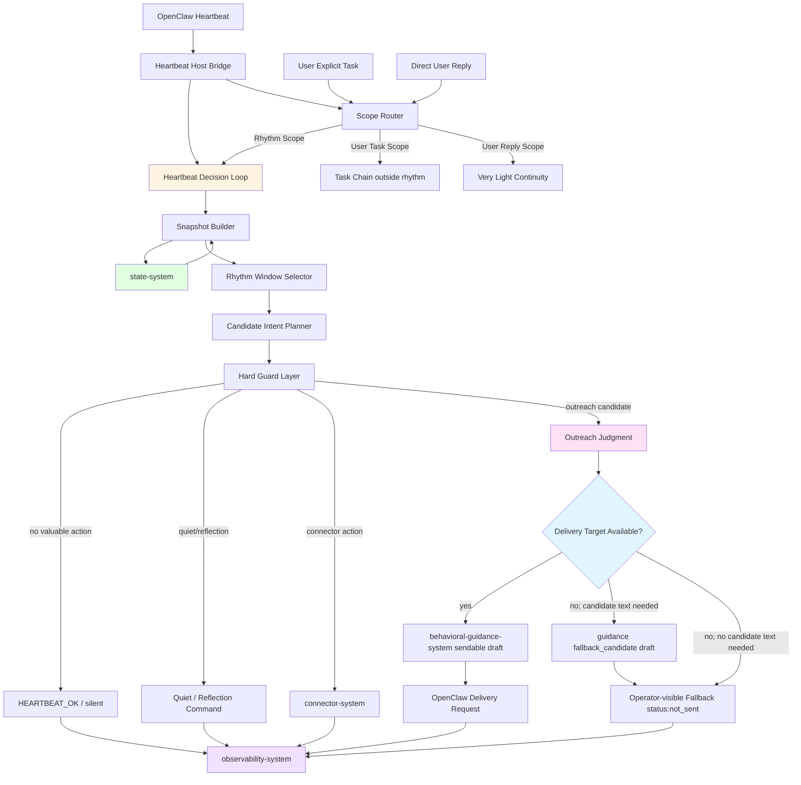
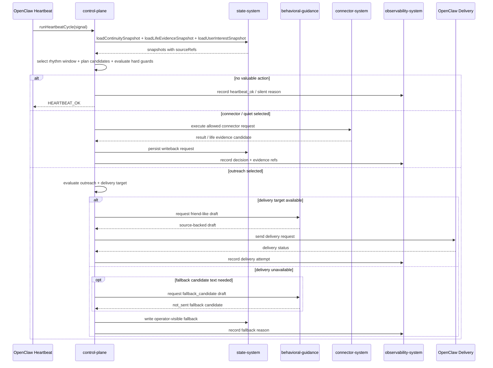
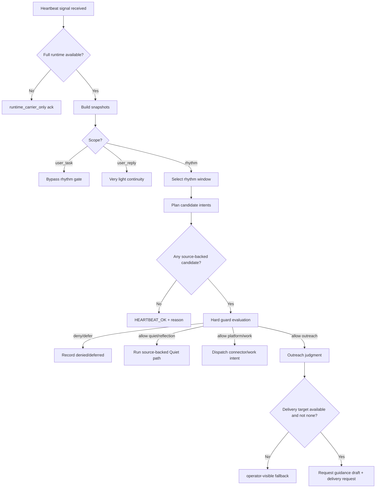
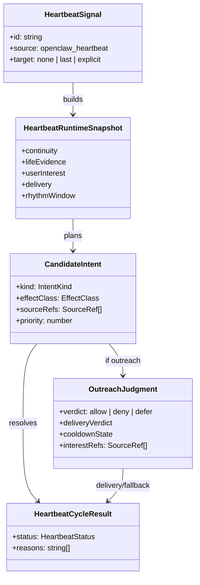

# Control Plane System 系统设计文档 (L0 — 导航层)

| 字段 | 值 |
| --- | --- |
| **System ID** | `control-plane-system` |
| **Project** | Second Nature |
| **Version** | 5.0 |
| **Status** | `Draft` |
| **Author** | GPT-5.5 |
| **Date** | 2026-05-01 |
| **L1 Detail** | [control-plane-system.detail.md](./control-plane-system.detail.md) — 仅 `/forge` 明确引用时加载 |

> [!IMPORTANT]
> **文档分层说明**
> - 本文件 (L0) 定义 v5 heartbeat decision loop、rhythm windows、outreach judgment、delivery policy 与跨系统契约。
> - [control-plane-system.detail.md](./control-plane-system.detail.md) (L1) 放置配置常量、完整类型、核心算法伪代码、决策树展开与边缘情况。
> - L1 中每一节都必须从本文件有入口，禁止孤岛实现细节。

---

## 目录 (Table of Contents)

| § | 章节 | 关键内容 |
| :---: | --- | --- |
| 1 | [概览](#1-概览-overview) | 系统目的、边界、职责 |
| 2 | [目标与非目标](#2-目标与非目标-goals--non-goals) | v5 control-plane 目标 |
| 3 | [背景与上下文](#3-背景与上下文-background--context) | v5 lived-experience closure |
| 4 | [系统架构](#4-系统架构-architecture) | 架构图、decision loop、数据流 |
| 5 | [接口设计](#5-接口设计-interface-design) | 操作契约、跨系统协议、宿主接入 |
| 6 | [数据模型](#6-数据模型-data-model) | 核心实体、ER、数据流向 |
| 7 | [技术选型](#7-技术选型-technology-stack) | TypeScript / OpenClaw / local state |
| 8 | [Trade-offs](#8-trade-offs--alternatives-权衡与备选方案) | ADR 引用与本系统决策 |
| 9 | [安全性考虑](#9-安全性考虑-security-considerations) | 打扰、事实、投递、用户任务边界 |
| 10 | [性能考虑](#10-性能考虑-performance-considerations) | heartbeat 成本预算 |
| 11 | [测试策略](#11-测试策略-testing-strategy) | 契约验证矩阵 |
| 12 | [部署与运维](#12-部署与运维-deployment--operations) | runtime、fallback、observability |
| 13 | [未来考虑](#13-未来考虑-future-considerations) | capability 演进 |
| 14 | [附录](#14-appendix-附录) | 术语、参考资料 |

**L1 实现层**: [§1 配置常量](./control-plane-system.detail.md#1-配置常量-config-constants) · [§2 数据结构](./control-plane-system.detail.md#2-核心数据结构完整定义-full-data-structures) · [§3 算法](./control-plane-system.detail.md#3-核心算法伪代码-non-trivial-algorithm-pseudocode) · [§4 决策树](./control-plane-system.detail.md#4-决策树详细逻辑-decision-tree-details) · [§5 边缘情况](./control-plane-system.detail.md#5-边缘情况与注意事项-edge-cases--gotchas)

---

## 1. 概览 (Overview)

### 1.1 System Purpose (系统目的)

`control-plane-system` 是 Second Nature v5 的自由心跳编排核心。它把 OpenClaw heartbeat 从“能唤醒并返回 `HEARTBEAT_OK`”推进为 evidence-backed heartbeat decision loop：读取生活证据、选择 rhythm window、规划候选 intent、执行 guard、做 outreach judgment，并把 delivery target / fallback / audit 结果写成可查询记录。

这个系统的关键判断很硬：**heartbeat run 成功不等于用户联系成功**。只有 delivery target 能解析到用户可见通道，且 outreach judgment 通过，才可以声明朋友式主动联系闭环成立。

### 1.2 System Boundary (系统边界)

- **输入 (Input)**:
  - OpenClaw heartbeat bridge signal / heartbeat runtime context
  - state-system 提供的 `ContinuitySnapshot`、`LifeEvidenceSnapshot`、`RhythmPolicySnapshot`、`UserInterestSnapshot`
  - connector-system 返回的 life evidence candidate、平台结果、工作推进结果
  - OpenClaw delivery capability / target metadata
  - 用户显式任务或直聊上下文的 scope signal
- **输出 (Output)**:
  - `HeartbeatCycleResult`
  - `OutreachJudgment`
  - `DeliveryRequest` / `DeliveryFallback`
  - Quiet / reflection / connector 调用指令
  - guidance request
  - decision record、source coverage、fallback reason
- **依赖系统 (Dependencies)**: `state-system`, `connector-system`, `observability-system`, `behavioral-guidance-system`, OpenClaw Runtime
- **被依赖系统 (Dependents)**: `cli-system`, `observability-system`

### 1.3 System Responsibilities (系统职责)

**负责**:
- 运行 heartbeat decision loop: snapshot -> rhythm window -> candidate intent -> guard -> effect / silence。
- 显式区分 `Rhythm Scope`、`User Task Scope`、`User Reply Scope`。
- 执行 work / exploration / social / quiet / reflection / maintenance / outreach 的窗口选择与候选规划。
- 判断主动联系是否 evidence-backed、interest-relevant、未重复、未冷却、delivery target 可用。
- 在允许时请求 behavioral-guidance 生成朋友式 outreach draft。
- 将 allow / deny / defer / silent / delivery unavailable 全部记录为可审计 decision。

**不负责**:
- 不新增 `outreach-system` 或 `rhythm-system`。
- 不生成最终表达风格；由 `behavioral-guidance-system` 负责 draft。
- 不拥有投递通道实现；通过 OpenClaw delivery 或 fallback contract。
- 不保存 life evidence / memory truth；由 `state-system` 负责。
- 不直接操作外部平台；由 `connector-system` 负责。
- 不让用户明确任务经过 rhythm gate。

---

## 2. 目标与非目标 (Goals & Non-Goals)

### 2.1 Goals

- **[G1] [REQ-019]**: 每次真实 runtime 可用的 heartbeat 都进入 decision loop，并返回结构化状态。
- **[G2] [REQ-021]**: 根据 rhythm window 选择候选 intent 集合，但不让 window 本身越权授权动作。
- **[G3] [REQ-022]**: 主动联系必须通过 evidence、user interest、cooldown、dedupe、delivery availability 检查。
- **[G4] [REQ-024]**: Quiet / reflection 只能消费 source-backed life evidence，空 evidence 不得虚构经历。
- **[G5] [REQ-025]**: delivery target/fallback 必须被显式建模；`target: "none"` 不算用户联系成功。

### 2.2 Non-Goals

- **[NG1]**: 不把 heartbeat 做成 cron 式固定动作执行器。
- **[NG2]**: 不让 guidance 决定是否行动或是否投递。
- **[NG3]**: 不绕过 OpenClaw delivery 自建私信/通知通道。
- **[NG4]**: 不直接更新 `SOUL.md` / `USER.md` / `IDENTITY.md` / `MEMORY.md` 等 anchor files。
- **[NG5]**: 不把 `HEARTBEAT_OK` 的 host ack drop 当成 bug；它是需要测试覆盖的宿主语义。

---

## 3. 背景与上下文 (Background & Context)

### 3.1 Why This System? (为什么需要这个系统？)

v4 已证明 host-safe runtime spine 与 `HEARTBEAT.md + second_nature_ops("heartbeat_check")` 可以让宿主唤醒插件，但这还没有证明 agent 真的“在生活”。v5 的控制层必须补上这一段：每轮 heartbeat 要读取真实或 near-real 证据，形成节律判断，在值得时尝试通过 OpenClaw 用户可见通道联系 owner，并在失败时留下解释。

**关联 PRD 需求**: [REQ-019], [REQ-021], [REQ-022], [REQ-024], [REQ-025]

### 3.2 Current State (现状分析)

- v4 `control-plane-system.md` 只定义 heartbeat 主入口和三层 scope，不包含 v5 delivery target / life evidence closure。
- 现有 control-plane 调研是 v4 heartbeat 边界笔记，已升级为 v5 调研报告：`./_research/control-plane-system-research.md`。
- `openclaw-lived-experience-closure-research.md` 已确认 `target: "none"`、`target: "last"`、`HEARTBEAT_OK` ack drop、hook / injection / `runHeartbeatOnce` 等关键风险。

### 3.3 Constraints (约束条件)

- **技术约束**: TypeScript + Node.js + OpenClaw native plugin；heartbeat 是主入口，cron 仅辅助。
- **宿主约束**: OpenClaw delivery target 是主动联系成立的硬前提。
- **事实约束**: outreach / Quiet / reflection 都必须引用 `LifeEvidence.sourceRefs` 或 `UserInterestSnapshot.sourceRefs`。
- **打扰约束**: 主动联系必须可冷却、可去重、可审计。
- **边界约束**: 用户明确任务不受 rhythm gate 阻断。
- **降级约束**: runtime 不完整时可返回 `runtime_carrier_only`，但不得冒充真实 decision loop。

---

## 4. 系统架构 (Architecture)

### 4.1 Architecture Diagram (架构图)



完整决策树展开见 [L1 §4](./control-plane-system.detail.md#4-决策树详细逻辑-decision-tree-details)。

### 4.2 Core Components (核心组件)

| Component Name | Responsibility | Tech Stack | Notes |
| --- | --- | --- | --- |
| `HeartbeatHostBridge` | 把 OpenClaw heartbeat/tool/service/hook 信号转成 control-plane input | TypeScript / OpenClaw plugin | 不假装存在未验证 callback |
| `ScopeRouter` | 区分 `Rhythm Scope` / `User Task Scope` / `User Reply Scope` | TypeScript | 用户任务不进 rhythm gate |
| `SnapshotBuilder` | 组装 continuity、life evidence、interest、delivery、budget 快照 | TypeScript | 读 state，不写 truth |
| `RhythmWindowSelector` | 解释 work/exploration/social/quiet/reflection/maintenance window | TypeScript | window 只影响候选和偏置 |
| `CandidateIntentPlanner` | 生成 work、social、Quiet、reflection、outreach 等候选 | TypeScript | 候选不是授权 |
| `HardGuardLayer` | 执行 cooldown、dedupe、risk、evidence、budget、scope guard | TypeScript | hard deny 优先于 guidance |
| `OutreachJudge` | 计算主动联系价值、兴趣相关、重复、冷却与投递可用性 | TypeScript | control-plane 拥有判断权 |
| `DeliveryPolicy` | 判断 `target != "none"`、channel/to、fallback reason | TypeScript / OpenClaw | delivery target 是硬前提 |
| `EffectDispatcher` | 调用 connector、Quiet、guidance、OpenClaw delivery | TypeScript | 只执行 allow 结果 |
| `DecisionRecorder` | 写入 observability trace 与 state index | TypeScript | silent / deny / fallback 都记录 |

### 4.3 Data Flow (数据流)



### 4.4 Heartbeat Decision Tree



---

## 5. 接口设计 (Interface Design)

### 5.1 操作契约表 (Operation Contracts)

| 操作 | [REQ-XXX] | 前置条件 | 消耗/输入 | 产出/副作用 | 实现细节 |
| --- | :---: | --- | --- | --- | :---: |
| `runHeartbeatCycle(signal)` | [REQ-019] | heartbeat bridge signal 已解析 | runtime context; delivery target; snapshots | `HeartbeatCycleResult`; decision record | [L1 §3.1](./control-plane-system.detail.md#31-runheartbeatcycle) |
| `routeScopedInput(input)` | [REQ-019] | input 有 trigger/scope metadata | user task/reply/heartbeat context | `ScopeRouteResult`; 用户任务绕过 rhythm | [L1 §3.2](./control-plane-system.detail.md#32-routescopedinput) |
| `buildRuntimeSnapshot(signal)` | [REQ-019], [REQ-020], [REQ-023] | state 可读 | continuity; life evidence; user interest; delivery capability | `HeartbeatRuntimeSnapshot` | [L1 §3.3](./control-plane-system.detail.md#33-buildruntimesnapshot) |
| `selectRhythmWindow(snapshot)` | [REQ-021] | rhythm policy 可读 | time; policy; obligations; quiet state | `RhythmWindowDecision` | [L1 §3.4](./control-plane-system.detail.md#34-selectrhythmwindow) |
| `planCandidateIntents(snapshot)` | [REQ-021], [REQ-024] | 已进入 Rhythm Scope | snapshot; window; evidence coverage | candidate intents | [L1 §3.5](./control-plane-system.detail.md#35-plancandidateintents) |
| `evaluateHardGuards(candidate)` | [REQ-022] | candidate 已形成 | risk; evidence; cooldown; dedupe; budget | allow / deny / defer / silent | [L1 §3.6](./control-plane-system.detail.md#36-evaluatehardguards) |
| `judgeOutreach(candidate)` | [REQ-022], [REQ-023] | candidate effectClass = user_outreach | evidence refs; interest refs; cooldown state | `OutreachJudgment` | [L1 §3.7](./control-plane-system.detail.md#37-judgeoutreach) |
| `resolveDeliveryTarget(snapshot)` | [REQ-022], [REQ-025] | outreach hard guard 已通过 | OpenClaw target/channel/to/capability | delivery request or fallback reason | [L1 §3.8](./control-plane-system.detail.md#38-resolvedeliverytarget) |
| `dispatchAllowedIntent(intent)` | [REQ-021], [REQ-024] | verdict = allow | connector/quiet/guidance/delivery request | external effect or writeback | [L1 §3.9](./control-plane-system.detail.md#39-dispatchallowedintent) |
| `recordDecision(result)` | [REQ-019], [REQ-022], [REQ-025] | result 已确定 | status; reasons; sourceRefs; delivery attempt | observability + state index | [L1 §3.10](./control-plane-system.detail.md#310-recorddecision) |

### 5.2 跨系统接口协议 (Cross-System Interface)

```ts
export interface ControlPlaneRuntimePort {
  runHeartbeatCycle(signal: HeartbeatSignal): Promise<HeartbeatCycleResult>;
  routeScopedInput(input: ScopedRuntimeInput): Promise<ScopeRouteResult>;
}

export interface StateSnapshotPort {
  loadContinuitySnapshot(): Promise<ContinuitySnapshot>;
  loadLifeEvidenceSnapshot(query: LifeEvidenceQuery): Promise<LifeEvidenceSnapshot>;
  loadUserInterestSnapshot(): Promise<UserInterestSnapshot>;
  writeOperatorFallback(fallback: DeliveryFallback): Promise<void>;
}

export interface GuidanceDraftPort {
  draftOutreachMessage(request: OutreachDraftRequest): Promise<OutreachDraftResult>;
}

export interface OpenClawDeliveryPort {
  resolveDeliveryTarget(input: DeliveryTargetInput): Promise<DeliveryTargetResolution>;
  sendDeliveryRequest(request: DeliveryRequest): Promise<DeliveryAttempt>;
}
```

完整类型与字段约束见 [L1 §2](./control-plane-system.detail.md#2-核心数据结构完整定义-full-data-structures)。

### 5.3 宿主接入摘要 (Host Integration Summary)

| 宿主入口 | 是否进入 control-plane | v5 语义 |
| --- | :---: | --- |
| OpenClaw heartbeat + `HEARTBEAT.md` | 是，但必须验证 | 主 heartbeat turn；当前桥接依赖模型实际调用 `second_nature_ops("heartbeat_check")`，不得假设宿主层强制必达 |
| `second_nature_ops("heartbeat_check")` | 是 | host-safe bridge + runtime carrier / real loop boundary |
| `heartbeat_prompt_contribution` | 间接 | 注入 evidence summary / policy delta，不替代 delivery |
| `enqueueNextTurnInjection` | 间接 | exactly-once 注入下一轮上下文 |
| `runHeartbeatOnce({ target })` | 待验证增强路径 | 若可用，可触发 target 非 none 的主动 heartbeat |
| OpenClaw cron | 部分 | 精确定时辅助，不是主体生命线 |
| 用户明确任务 | 不进 rhythm | 直接任务链 |

---

## 6. 数据模型 (Data Model)

### 6.1 核心实体 (Core Entities)

```ts
export type RuntimeScope = 'rhythm' | 'user_task' | 'user_reply';
export type HeartbeatStatus =
  | 'heartbeat_ok'
  | 'intent_selected'
  | 'denied'
  | 'deferred'
  | 'runtime_carrier_only'
  | 'delivery_unavailable';

export interface HeartbeatSignal {
  id: string;
  receivedAt: string;
  source: 'openclaw_heartbeat' | 'manual_probe' | 'service_resume';
  target?: 'none' | 'last' | 'explicit';
  channel?: string;
  recipient?: string;
}

export interface HeartbeatRuntimeSnapshot {
  continuity: ContinuitySnapshot;
  lifeEvidence: LifeEvidenceSnapshot;
  userInterest: UserInterestSnapshot;
  delivery: DeliveryCapabilitySnapshot;
  rhythmWindow: RhythmWindowDecision;
}

export interface SourceRef {
  id: string;
  kind: 'platform_item' | 'workspace_artifact' | 'decision_record' | 'user_anchor' | 'connector_result' | 'host_report' | 'fallback_artifact';
  uri: string;
  excerptHash?: string;
  observedAt?: string;
}

export interface CandidateIntent {
  id: string;
  kind: 'work' | 'exploration' | 'social' | 'quiet' | 'reflection' | 'outreach' | 'maintenance';
  effectClass: 'connector_action' | 'memory_curation' | 'narrative_reflection' | 'user_outreach' | 'no_effect';
  sourceRefs: SourceRef[];
  priority: number;
  summary: string;
}

export interface OutreachJudgment {
  decisionId: string;
  candidateId: string;
  verdict: 'allow' | 'deny' | 'defer';
  valueScore: number;
  interestRefs: SourceRef[];
  cooldownState: 'clear' | 'cooling_down' | 'duplicate';
  deliveryVerdict: 'target_available' | 'target_none' | 'channel_missing' | 'host_unsupported';
  reasons: string[];
}

export interface HeartbeatCycleResult {
  decisionId: string;
  status: HeartbeatStatus;
  selectedIntentId?: string;
  deliveryAttemptId?: string;
  fallbackRef?: string;
  reasons: string[];
}
```

> 完整类型、枚举与配置常量见 [L1 §1](./control-plane-system.detail.md#1-配置常量-config-constants) 和 [L1 §2](./control-plane-system.detail.md#2-核心数据结构完整定义-full-data-structures)。

### 6.2 实体关系图 (Entity Relationship)



### 6.3 数据流向 (Data Flow Direction)

- `state-system` 是 continuity、life evidence、user interest、Quiet artifact 的 truth source。
- `control-plane-system` 读取 state 并产出 decision，不直接成为 memory truth source。
- `behavioral-guidance-system` 只接收 allow 后的 evidence refs 和 interest refs，返回 draft。
- `observability-system` 记录 decision trace、delivery audit、source coverage、fallback reason。
- OpenClaw delivery 的 `target` 解析结果必须进入 decision，而不能只存在宿主配置里。

---

## 7. 技术选型 (Technology Stack)

### 7.1 Core Technologies (核心技术)

| Domain | Choice | Rationale |
| --- | --- | --- |
| Runtime | TypeScript + Node.js | 继承 OpenClaw plugin 主栈 |
| Host Entry | OpenClaw heartbeat | 自由心跳主入口 |
| Delivery | OpenClaw heartbeat delivery target | 不自建私信通道 |
| State Input | SQLite/sql.js index + Markdown/JSON artifacts | 读取 evidence、interest、quiet artifacts |
| Guidance | text/template payload assembly | guidance 只生成 draft |
| Observability | local structured decision trace | 支撑 explain / challenge / smoke |

### 7.2 Key Libraries/Dependencies (关键依赖)

- OpenClaw plugin command/tool/service/hook surface
- `state-system` snapshot / repository ports
- `observability-system` decision trace ports
- `behavioral-guidance-system` draft ports
- `connector-system` effect execution ports

---

## 8. Trade-offs & Alternatives (权衡与备选方案)

### 8.1 跨系统决策引用

> **决策来源**: [ADR-001: 主技术栈、宿主运行时与验证策略选择](../03_ADR/ADR_001_TECH_STACK.md)
>
> 本系统使用 TypeScript + Node.js + OpenClaw native plugin 语义，不重复主栈选择理由。

> **决策来源**: [ADR-003: Second Nature 行为节律、Quiet 与记忆治理原则](../03_ADR/ADR_003_SECOND_NATURE_GOVERNANCE.md)
>
> 本系统实现 rhythm windows、Quiet 与 Narrative Reflection 的编排边界；source-backed 约束按 v5 延伸注记执行。

> **决策来源**: [ADR-004: Behavioral Guidance Layer 的系统边界与实现形态](../03_ADR/ADR_004_BEHAVIORAL_GUIDANCE_LAYER.md)
>
> 本系统只向 guidance 请求表达草稿，不把行动决策权或投递权交给 guidance。

> **决策来源**: [ADR-005: Heartbeat 作为 Second Nature 的主运行入口与三层运行时边界](../03_ADR/ADR_005_HEARTBEAT_RUNTIME_BOUNDARY.md)
>
> 本系统继承 heartbeat 主入口与 `Rhythm Scope / User Task Scope / User Reply Scope` 三层边界。

> **决策来源**: [ADR-006: 可发布的自足 Plugin Runtime Package](../03_ADR/ADR_006_DEPLOYABLE_PLUGIN_RUNTIME_PACKAGE.md)
>
> 本系统的 heartbeat runtime entry 必须能进入发布产物，但 packaging 细节归 `cli-system`。

> **决策来源**: [ADR-007: Heartbeat Delivery 与 Life Evidence 闭环](../03_ADR/ADR_007_HEARTBEAT_DELIVERY_AND_LIFE_EVIDENCE_CLOSURE.md)
>
> 本系统实现 delivery target、life evidence、outreach judgment、fallback 与 Quiet source coverage 的核心闭环。

### 8.2 本系统特有决策: 统一 `runHeartbeatCycle` 而不是拆 `rhythm-system`

**Option A: control-plane 内部统一 heartbeat cycle (Selected)**
- 优点: 保持 6 系统边界，decision / guard / delivery / audit 连续。
- 缺点: control-plane 文档和测试矩阵更重。

**Option B: 新增 `rhythm-system`**
- 优点: 表面上把窗口选择拆开。
- 缺点: rhythm 只是 policy + snapshot 的解释层，拆出去会制造边界漂移。

**Decision**: 选择 Option A。v5 的复杂度来自 evidence-backed decision，而不是 rhythm 作为独立系统。

### 8.3 本系统特有决策: delivery unavailable 进入 fallback，而不是静默丢弃

**Option A: 写 operator-visible fallback (Selected)**
- 优点: 不冒充已联系用户，保留 source refs、candidate draft、reason 与下一步建议。
- 缺点: 用户体验弱于真实会话投递。

**Option B: 仅记录 observability trace**
- 优点: 实现更小。
- 缺点: owner 不主动查看 trace 就看不到，不能形成可操作兜底。

**Decision**: 选择 Option A。fallback 是兜底，不是主体验，但它必须用户/操作者可见。

### 8.4 本系统特有决策: HEARTBEAT_OK ack drop 作为 first-class host behavior

**Option A: 建模并测试 ack drop (Selected)**
- 优点: 无事静默与有效提醒边界清楚，避免提醒被宿主吞掉。
- 缺点: 需要额外 host smoke / contract test。

**Option B: 把 ack drop 当成 OpenClaw 内部细节**
- 优点: 文档更短。
- 缺点: 最危险，会把有效 outreach 写成会被丢弃的短 ack。

**Decision**: 选择 Option A。这个坑已经足够明确，不能装没看见。

---

## 9. 安全性考虑 (Security Considerations)

| Risk | Severity | Mitigation |
| --- | :---: | --- |
| 虚构生活经历 | 高 | outreach / Quiet / reflection 必须有 source refs |
| `target: "none"` 被误判为主动联系成功 | 高 | `DeliveryPolicy` 强制输出 `delivery_unavailable` / `not_delivered_by_host_policy` |
| guidance 越权允许动作 | 高 | guidance 只接收 allow 后 draft request，hard guard 永远优先 |
| 主动联系噪声过高 | 高 | cooldown、dedupe、budget、value threshold |
| 用户任务被 Quiet 阻断 | 高 | `User Task Scope` 绕过 rhythm gate |
| 敏感原文进入消息或日志 | 高 | 只传 source refs / redacted summary，凭据不进 journal / outreach |
| delivery fallback 冒充已发送 | 高 | fallback status 不得表述为 sent |

实现注意事项见 [L1 §5](./control-plane-system.detail.md#5-边缘情况与注意事项-edge-cases--gotchas)。

---

## 10. 性能考虑 (Performance Considerations)

### 10.1 Performance Goals (性能目标)

- heartbeat 默认路径 P95 < 2s，能收敛为 `heartbeat_ok` / `denied` / `deferred`。
- outreach / reflection 等模型辅助路径允许更高成本，但必须被明确选中后才进入。
- 每轮候选 intent 默认不超过 6 个，避免 heartbeat 变成全量规划器。

### 10.2 Optimization Strategies (优化策略)

1. **Snapshot reuse**: `state-system` 提供预聚合 `LifeEvidenceSnapshot` 和 `UserInterestSnapshot`。
2. **Two-stage guard**: v5 首版使用 rule-only hard guard + deterministic score；任何 model-assisted path 必须先补结构化输入/输出 schema、超时和 rule-only 降级契约后才能启用。
3. **Quiet batching**: Quiet 消费日内 evidence summary，不在 control-plane 中扫全量日志。
4. **Delivery first, guidance second**: `target: "none"` / channel missing 先进入 fallback decision；只有 fallback 需要候选文案时才请求 guidance 的 `fallback_candidate`，且 wording 必须是 `not_sent`。

### 10.3 Performance Monitoring (性能监控)

- heartbeat cycle duration
- snapshot load duration
- candidate count
- guard deny/defer ratio
- outreach allow ratio
- delivery unavailable ratio
- Quiet source coverage ratio

---

## 11. 测试策略 (Testing Strategy)

### 11.1 Unit Testing (单元测试)

- `routeScopedInput()` 区分 heartbeat / user task / user reply。
- `selectRhythmWindow()` 在 work、social、quiet、reflection、maintenance 下生成正确偏置。
- `evaluateHardGuards()` 覆盖 source missing、cooldown、dedupe、budget、risk。
- `resolveDeliveryTarget()` 覆盖 `target: "none"`、channel missing、host unsupported、target available。

### 11.2 Integration Testing (集成测试)

- heartbeat -> snapshot -> no candidate -> `HEARTBEAT_OK` + silent reason。
- heartbeat -> source-backed Quiet -> Quiet artifact write request + source coverage。
- heartbeat -> source-backed outreach -> judgment allow -> guidance draft -> delivery request。
- heartbeat -> outreach allow but delivery unavailable -> operator fallback。

### 11.3 Host Smoke Testing (宿主冒烟)

- `HEARTBEAT.md + second_nature_ops("heartbeat_check")` 能返回结构化 decision result。
- `HEARTBEAT_OK` ack drop 行为被验证。
- `target: "none"` run 成功但不外送，并记录为未联系用户。
- `target: "last"` / explicit channel-to 是否可用由 `cli-system` capability probe 证明。

### 11.4 Contract Verification Matrix (契约-验证责任矩阵)

| 契约 | 风险级别 | 正常态验证 | 失败态验证 | 回归责任 |
| --- | --- | --- | --- | --- |
| `runHeartbeatCycle(signal)` | 关键路径 | 集成测试返回 `heartbeat_ok` / `intent_selected` | runtime 不可用返回 `runtime_carrier_only` | heartbeat 主链路回归 |
| `routeScopedInput(input)` | 关键边界 | 用户任务绕过 rhythm | Quiet 中用户任务不被 defer | scope contract 回归 |
| `OutreachJudgment` | 高 | source-backed candidate allow | 无 evidence / cooldown / duplicate deny | outreach guard 回归 |
| `DeliveryPolicy` | 高 | target available 生成 delivery request | `target: "none"` 生成 fallback，不算 sent | delivery host smoke |
| `HEARTBEAT_OK` output | 高 | 无事静默被 ack drop | alert message 不被包装成短 ack | ack behavior smoke |
| `QuietSourceCoverage` | 高 | 非空 evidence 生成 source coverage | 空 evidence 不生成虚构 reflection | Quiet / reflection 回归 |
| `DecisionRecord` | 高 | allow / silent 都写 trace | deny / fallback 不丢审计 | observability 回归 |

---

## 12. 部署与运维 (Deployment & Operations)

### 12.1 Runtime Boundary

- control-plane 运行在 OpenClaw plugin runtime artifact 内。
- runtime entry 必须被 `cli-system` 打进自足发布包。
- `HEARTBEAT.md + second_nature_ops("heartbeat_check")` 是当前主 bridge；hook / injection / `runHeartbeatOnce` 是待验证增强路径。

### 12.2 Observability

每轮必须记录：
- trigger source
- runtime scope
- snapshot refs
- candidate count
- selected window
- guard verdict
- sourceRefs / interestRefs
- delivery target resolution
- fallback reason
- final status

### 12.3 Recovery & Fallback

- runtime 不可用: 返回 `runtime_carrier_only`，不冒充完整 loop。
- delivery 不可用: 写 operator-visible fallback，保留 candidate message、source refs、reason、下一步建议。
- connector failure: 记录外部 effect failure，不重复 dispatch 同一 intent。

---

## 13. 未来考虑 (Future Considerations)

- 若 OpenClaw 稳定暴露 `runHeartbeatOnce({ heartbeat: { target: "last" } })`，control-plane 可把它作为主动唤醒增强路径，但仍必须经过 `DeliveryPolicy`。
- 若 future 多用户/多 agent 出现，`UserInterestSnapshot` 和 delivery target 需要引入 owner identity 维度。
- 若 Quiet / reflection 复杂度上升，可在 state/guidance 内扩展 pipeline，但不改变 control-plane 的判断所有权。

---

## 14. Appendix (附录)

### 14.1 Glossary (术语表)

- **Heartbeat Decision Loop**: 每轮 heartbeat 的 snapshot、window、intent、guard、effect/fallback、audit 流程。
- **Lived Experience Closure**: 平台行为、工作推进、life evidence、Quiet、主动联系用户之间形成闭环。
- **Delivery Target**: OpenClaw heartbeat delivery 的 `target` / channel / recipient 配置。
- **Operator-visible Fallback**: delivery 不可用时写给操作者查看的 fallback artifact，不等于已联系用户。
- **Quiet Source Coverage**: Quiet / reflection claim 被 life evidence source refs 覆盖的比例与证明。

### 14.2 Optional Skills & Reference Resources (可选 Skills 与参考资源)

- `system-designer`: 用于 L0/L1 分层、操作契约表、Trade-offs 和契约验证矩阵。
- `sequential-thinking`: 本系统涉及多方案边界收敛，按其方法进行受控推理；未生成单独 replay 文件。

### 14.3 References (参考资料)

- [control-plane-system research](./_research/control-plane-system-research.md)
- [OpenClaw lived experience closure research](./_research/openclaw-lived-experience-closure-research.md)
- [PRD v5](../01_PRD.md)
- [Architecture Overview v5](../02_ARCHITECTURE_OVERVIEW.md)
- [ADR-001](../03_ADR/ADR_001_TECH_STACK.md)
- [ADR-003](../03_ADR/ADR_003_SECOND_NATURE_GOVERNANCE.md)
- [ADR-004](../03_ADR/ADR_004_BEHAVIORAL_GUIDANCE_LAYER.md)
- [ADR-005](../03_ADR/ADR_005_HEARTBEAT_RUNTIME_BOUNDARY.md)
- [ADR-006](../03_ADR/ADR_006_DEPLOYABLE_PLUGIN_RUNTIME_PACKAGE.md)
- [ADR-007](../03_ADR/ADR_007_HEARTBEAT_DELIVERY_AND_LIFE_EVIDENCE_CLOSURE.md)

### 14.4 Change Log (变更日志)

| Version | Date | Changes | Author |
| --- | --- | --- | --- |
| 5.0 | 2026-05-01 | 从 v4 heartbeat boundary 升级为 v5 lived-experience closure control-plane 设计 | GPT-5.5 |
