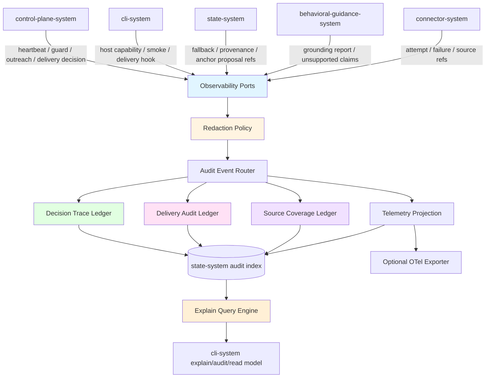
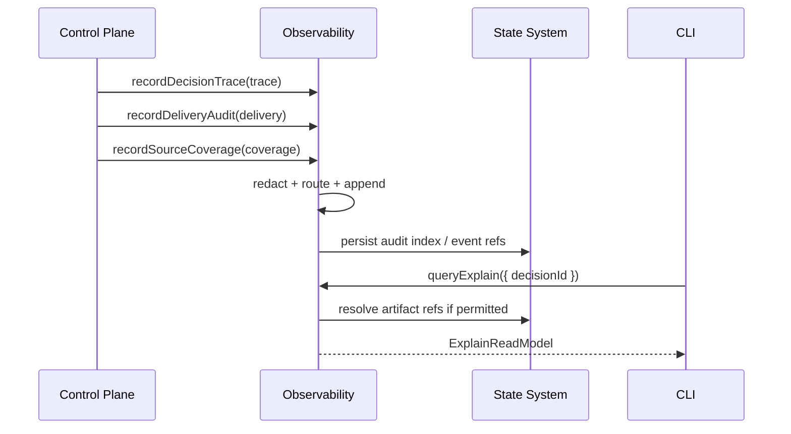
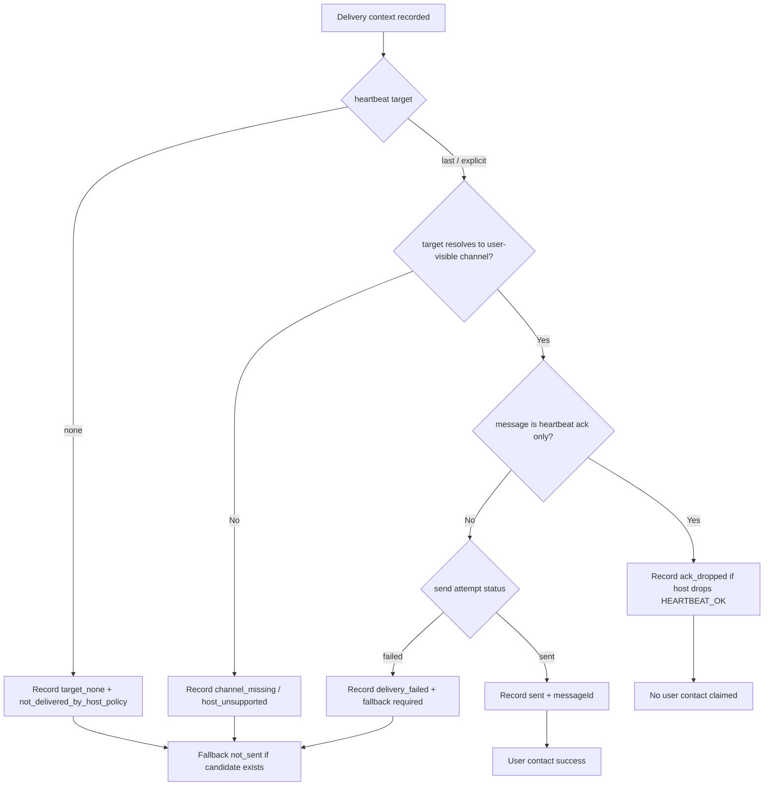
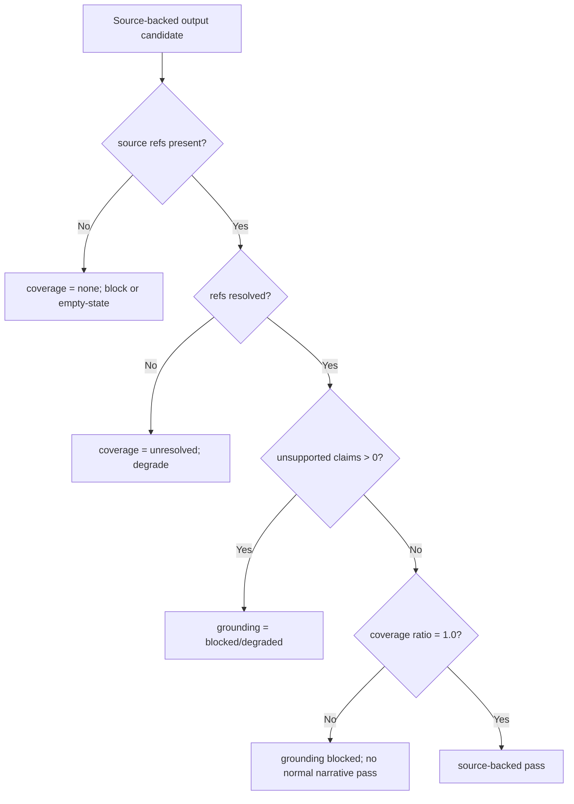
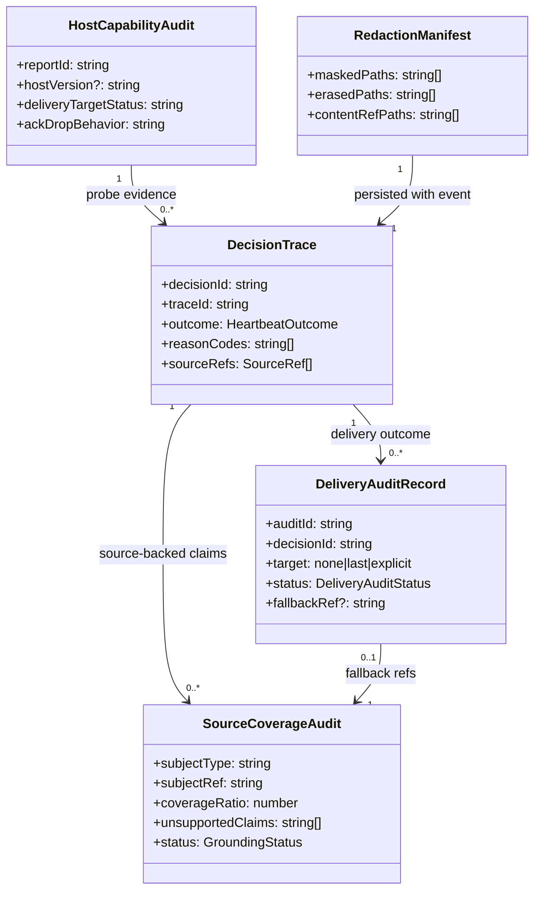

# Observability System 设计文档 (L0 — 导航层)

| 字段 | 值 |
| --- | --- |
| **System ID** | `observability-system` |
| **Project** | Second Nature |
| **Version** | 5.0 |
| **Status** | `Draft` |
| **Author** | GPT-5.5 |
| **Date** | 2026-05-01 |
| **L1 Detail** | [observability-system.detail.md](./observability-system.detail.md) — 仅 `/forge` 时加载 |

> [!IMPORTANT]
> **文档分层说明**
> - **本文件 (L0 导航层)**: 架构图、操作契约、数据模型声明、Trade-offs 与验证矩阵。
> - **[observability-system.detail.md](./observability-system.detail.md) (L1 实现层)**: 配置常量、完整类型、伪代码、决策树、边缘情况。
> - **L1 锚点原则**: L1 中的所有细节块必须在本文件有入口；禁止 L1 出现孤岛内容。

---

## 目录 (Table of Contents)

| § | 章节 | 关键内容 |
| :---: | --- | --- |
| 1 | [概览](#1-概览-overview) | 系统目的、边界、职责 |
| 2 | [目标与非目标](#2-目标与非目标-goals--non-goals) | Goals / Non-Goals |
| 3 | [背景与上下文](#3-背景与上下文-background--context) | v5 需求、调研结论、约束 |
| 4 | [系统架构](#4-系统架构-architecture) | Mermaid 架构图、数据流、决策树 |
| 5 | [接口设计](#5-接口设计-interface-design) | 操作契约表、跨系统协议 |
| 6 | [数据模型](#6-数据模型-data-model) | 字段声明、ER 图 → [L1 §1-2](./observability-system.detail.md#1-配置常量-config-constants) |
| 7 | [技术选型](#7-技术选型-technology-stack) | 本地审计、OTel-compatible projection |
| 8 | [Trade-offs](#8-trade-offs--alternatives-权衡与备选方案) | ADR 引用 + 本系统特有决策 |
| 9 | [安全性考虑](#9-安全性考虑-security-considerations) | redaction、敏感字段、篡改检测 |
| 10 | [性能考虑](#10-性能考虑-performance-considerations) | 写入、查询、保留策略 |
| 11 | [测试策略](#11-测试策略-testing-strategy) | 合约验证矩阵、测试层级 |
| 12 | [部署与运维](#12-部署与运维-deployment--operations) | local-first、exporter、repair |
| 13 | [未来考虑](#13-未来考虑-future-considerations) | OTel exporter、review UI、多 agent |
| 14 | [附录](#14-appendix-附录) | 术语、参考资料 |

**L1 实现层** → [observability-system.detail.md](./observability-system.detail.md)  
> [§1 配置常量](./observability-system.detail.md#1-配置常量-config-constants) · [§2 数据结构](./observability-system.detail.md#2-核心数据结构完整定义-full-data-structures) · [§3 算法](./observability-system.detail.md#3-核心算法伪代码-non-trivial-algorithm-pseudocode) · [§4 决策树](./observability-system.detail.md#4-决策树详细逻辑-decision-tree-details) · [§5 边缘情况](./observability-system.detail.md#5-边缘情况与注意事项-edge-cases--gotchas) · [§6 测试辅助](./observability-system.detail.md#6-测试辅助-test-helpers)

---

## 1. 概览 (Overview)

### 1.1 System Purpose (系统目的)

`observability-system` 是 v5 lived-experience closure 的**解释、审计与证据链系统**。

它要回答的不是“日志里有没有一行记录”，而是：
- 为什么这轮 heartbeat 静默、允许、拒绝、延后或只返回 `runtime_carrier_only`？
- 某次主动联系是否真的投递到用户可见 channel，还是只是 heartbeat run 成功？
- `target: "none"`、`HEARTBEAT_OK` ack drop、host capability 缺口、fallback 是否被正确区分？
- Quiet / Narrative Reflection / guidance draft 的 claim 是否有 source-backed life evidence？
- connector、state、guidance、delivery 的事件如何串成一条可查询证据链？

### 1.2 System Boundary (系统边界)

- **输入 (Input)**: heartbeat decision、scope route、rhythm decision、hard guard verdict、outreach judgment、delivery attempt、host capability report、life evidence provenance、Quiet artifact metadata、guidance grounding report、connector attempt、state fallback/proposal/apply 事件。
- **输出 (Output)**: `DecisionTrace`、`DeliveryAuditRecord`、`SourceCoverageAudit`、`GuidanceGroundingAudit`、`HostCapabilityAudit`、redacted audit bundle、operator explain read model。
- **依赖系统 (Dependencies)**: `state-system`（持久层、artifact refs、source refs、fallback refs）。
- **被依赖系统 (Dependents)**: `control-plane-system`, `cli-system`, `state-system`, `behavioral-guidance-system`, `connector-system`。

### 1.3 System Responsibilities (系统职责)

**负责**:
- 记录 heartbeat decision trace，覆盖 `heartbeat_ok / intent_selected / denied / deferred / runtime_carrier_only / delivery_unavailable`。
- 记录 delivery audit，明确 `target_none`、`ack_dropped`、`not_sent_fallback`、`sent`、`failed` 等状态。
- 记录 life evidence provenance 与 source coverage，支撑 Quiet / reflection / outreach 的 source-backed 验证。
- 记录 guidance grounding report，包括 used source refs、unsupported claims、guard violations。
- 提供 operator explain read model，回答 why silent / why contact / why fallback / why blocked。
- 执行结构化 redaction，保留 `RedactionManifest`，避免凭据、私信正文、完整 prompt 泄漏。
- 维护 local-first append-only audit ledger，并为可选 OTel-compatible export 提供 projection。

**不负责**:
- 不决定是否行动、是否联系用户、是否进入 Quiet；这些由 `control-plane-system` 负责。
- 不生成 friend-like 文案或 grounding report；这些由 `behavioral-guidance-system` 负责。
- 不保存 canonical life evidence / Quiet artifact / fallback artifact 正文；这些由 `state-system` 负责。
- 不执行 OpenClaw 投递或 host capability probe；这些由 `cli-system` / host adapter 负责。
- 不替代 connector 的平台错误处理、retry 或 backoff。

---

## 2. 目标与非目标 (Goals & Non-Goals)

### 2.1 Goals

- **[G1]**: 为每轮 heartbeat 产出可查询 `DecisionTrace`，覆盖静默、拒绝、延后、允许和 runtime fallback。[REQ-019]
- **[G2]**: 为 `LifeEvidence`、`UserInterestSnapshot`、Quiet artifact、guidance draft 建立 source coverage 与 provenance 审计。[REQ-020], [REQ-023], [REQ-024]
- **[G3]**: 明确区分 heartbeat run success、delivery target available、message sent、fallback not sent。[REQ-022], [REQ-025]
- **[G4]**: 支撑 CLI explain / audit surface，能用 decision id、trace id、fallback ref、source ref 查询解释链。[REQ-019], [REQ-026]
- **[G5]**: local-first，审计平面 append-only、结构化、可脱敏、可导出，但不依赖外部 tracing vendor。[REQ-020], [REQ-025]

### 2.2 Non-Goals

- **[NG1]**: 不做实时监控大屏或云端 APM 平台。
- **[NG2]**: 不做 ML 异常检测或自动策略调整。
- **[NG3]**: 不把 observability 当作第二个 memory store。
- **[NG4]**: 不保存完整私信、帖子正文、prompt、模型输出、凭据或 session token。
- **[NG5]**: 不把 OTel exporter 作为审计真相源；它只能是 projection。

---

## 3. 背景与上下文 (Background & Context)

### 3.1 Why This System? (为什么需要这个系统？)

v5 的风险点很尖：用户看到“没动静”时，系统必须知道这是 `HEARTBEAT_OK` 静默、`target: "none"` 不外送、OpenClaw host 不支持 delivery、cooldown/dedupe 拒绝，还是 evidence 不足。这个问题靠普通日志解决不了，必须把 decision、delivery、source coverage 和 fallback 建成正式契约。

**关联 PRD 需求**: [REQ-019], [REQ-020], [REQ-022], [REQ-024], [REQ-025], [REQ-026]

### 3.2 Current State (现状分析)

- 旧 v2 设计已有 `decision ledger + telemetry + governance audit` 的正确骨架。
- 旧设计的主要问题是需求号和事件族停留在 v2/v3，未覆盖 v5 的 heartbeat delivery target、ack drop、operator fallback、guidance grounding report 与 Quiet source coverage。
- 已完成的 `control-plane-system`、`cli-system`、`state-system`、`behavioral-guidance-system` 都已经把 observability 作为跨系统证据层依赖；本系统必须收束这些接口。

### 3.3 Constraints (约束条件)

- **技术约束**: TypeScript + Node.js；local-first；SQLite/sql.js index + Markdown/JSON artifacts；可选 OTel-compatible export。
- **性能约束**: critical audit write 可同步；高频 telemetry 可异步；最近 30 天 explain 查询 P95 < 1s。
- **安全约束**: 敏感字段默认不落原文；所有 mask / erase / hash 动作记录在 `RedactionManifest`。
- **产品约束**: `target: "none"` 不能算用户联系成功；fallback 必须标记 `not_sent`；Quiet / outreach 不能无 source 编故事。

### 3.4 调研结论摘要

- OpenTelemetry GenAI semantic conventions 适合做 agent/tool/LLM trace 字段骨架，但输入输出内容应 opt-in 或以 external content ref 记录。
- OPA decision logs 的 `decision_id`、`trace_id`、`masked`、`erased` 适合映射到 Second Nature 的 decision audit。
- 审计日志应 append-only、结构化、可篡改检测；audit 与 telemetry 应分平面。

完整研究见 [`_research/observability-system-research.md`](./_research/observability-system-research.md)。

---

## 4. 系统架构 (Architecture)

### 4.1 Architecture Diagram (架构图)



### 4.2 Core Components (核心组件)

| Component | Responsibility | Notes |
| --- | --- | --- |
| `DecisionTraceLedger` | 记录 heartbeat / scope / rhythm / guard / outreach 关键决策 | deny/defer/silent 与 allow 同级 |
| `DeliveryAuditLedger` | 记录 delivery target、attempt、ack drop、fallback、sent/failed | 明确 run success vs contact success |
| `SourceCoverageLedger` | 记录 Quiet、reflection、guidance、outreach 的 source coverage | 支撑防虚构 |
| `RedactionPolicy` | 字段级 mask / erase / hash / content_ref 替换 | 详见 [L1 §1](./observability-system.detail.md#1-配置常量-config-constants) |
| `AuditEventRouter` | 将事件路由到 decision / delivery / source / telemetry 平面 | 详见 [L1 §4.1](./observability-system.detail.md#41-audit-event-routing) |
| `ExplainQueryEngine` | 组装 operator explain read model | 不展开敏感正文 |
| `OtelProjectionBuilder` | 生成 OTel-compatible trace/span/event projection | 可选 exporter，不是真相源 |

### 4.3 Heartbeat Explain Data Flow



### 4.4 Delivery Audit Decision Tree



> 完整条件与 reason code 映射见 [L1 §4.2](./observability-system.detail.md#42-delivery-audit-classification)。

### 4.5 Source Coverage Gate



> 完整 source coverage 计算见 [L1 §4.3](./observability-system.detail.md#43-source-coverage-classification)。

---

## 5. 接口设计 (Interface Design)

### 5.1 操作契约表 (Operation Contracts)

| 操作 | [REQ-XXX] | 前置条件 | 消耗/输入 | 产出/副作用 | 实现细节 |
| --- | :---: | --- | --- | --- | :---: |
| `recordDecisionTrace(trace)` | [REQ-019], [REQ-022] | decision 已形成 | heartbeat/scope/rhythm/guard/outreach context | append `DecisionTrace`; explain index | [L1 §3.1](./observability-system.detail.md#31-recorddecisiontrace) |
| `recordDeliveryAudit(audit)` | [REQ-022], [REQ-025] | delivery resolution 或 attempt 已形成 | target/channel/status/ack/fallback info | append `DeliveryAuditRecord` | [L1 §3.2](./observability-system.detail.md#32-recorddeliveryaudit) |
| `recordSourceCoverage(audit)` | [REQ-020], [REQ-024] | source coverage 已计算 | source refs; resolved refs; unsupported claims | append `SourceCoverageAudit` | [L1 §3.3](./observability-system.detail.md#33-recordsourcecoverage) |
| `recordGuidanceGrounding(audit)` | [REQ-022], [REQ-024] | guidance 返回 grounding report | draft id; used refs; guard violations | append `GuidanceGroundingAudit` | [L1 §3.4](./observability-system.detail.md#34-recordguidancegrounding) |
| `recordHostCapability(report)` | [REQ-025], [REQ-026] | smoke/probe 已完成 | host version; target result; ack behavior | append `HostCapabilityAudit` | [L1 §3.5](./observability-system.detail.md#35-recordhostcapability) |
| `recordConnectorAttempt(attempt)` | [REQ-020], [REQ-024] | connector attempt started/completed | platform; operation; retry/failure/source refs | telemetry + provenance event | [L1 §3.6](./observability-system.detail.md#36-recordconnectorattempt) |
| `recordStateGovernance(event)` | [REQ-023], [REQ-024] | fallback/proposal/apply/commit 发生 | artifact refs; diff refs; source refs | governance audit event | [L1 §3.7](./observability-system.detail.md#37-recordstategovernance) |
| `queryExplain(query)` | [REQ-019], [REQ-022], [REQ-026] | query subject 有 id/ref | decisionId/traceId/fallbackRef/sourceRef | redacted `ExplainReadModel` | [L1 §3.8](./observability-system.detail.md#38-queryexplain) |
| `redactAuditEvent(event)` | [REQ-020], [REQ-025] | event 待持久化/导出 | raw audit event | redacted event + manifest | [L1 §3.9](./observability-system.detail.md#39-redactauditevent) |
| `exportAuditBundle(range)` | [REQ-025], [REQ-026] | range 合法; redaction policy 可用 | time range; event families | redacted bundle / OTel projection | [L1 §3.10](./observability-system.detail.md#310-exportauditbundle) |
| `verifyAuditHashChain(range)` | [REQ-025], [REQ-026] | audit integrity fields 已写入 | time range; event family filter | hash-chain verification report | [L1 §3.11](./observability-system.detail.md#311-verifyaudithashchain) |

### 5.2 跨系统接口协议 (Cross-System Interface)

```ts
export interface ObservabilityAuditPort {
  recordDecisionTrace(trace: DecisionTrace): Promise<AuditAppendAck>;
  recordDeliveryAudit(audit: DeliveryAuditRecord): Promise<AuditAppendAck>;
  recordSourceCoverage(audit: SourceCoverageAudit): Promise<AuditAppendAck>;
  recordGuidanceGrounding(audit: GuidanceGroundingAudit): Promise<AuditAppendAck>;
  recordHostCapability(report: HostCapabilityAudit): Promise<AuditAppendAck>;
}

export interface ObservabilityTelemetryPort {
  recordConnectorAttempt(attempt: ConnectorAttemptAudit): Promise<AuditAppendAck>;
  recordStateGovernance(event: StateGovernanceAudit): Promise<AuditAppendAck>;
}

export interface ObservabilityExplainPort {
  queryExplain(query: ExplainQuery): Promise<ExplainReadModel>;
  exportAuditBundle(range: AuditExportRange): Promise<AuditBundle>;
}
```

完整类型与字段约束见 [L1 §2](./observability-system.detail.md#2-核心数据结构完整定义-full-data-structures)。

### 5.3 事件族 (Event Families)

| Event Family | 说明 | 采样 | 保留 |
| --- | --- | --- | --- |
| `heartbeat.decision.*` | heartbeat result、scope、rhythm、guard、outreach verdict | 不采样 | 长期 |
| `delivery.*` | target resolution、attempt、ack drop、fallback、sent/failed | 不采样 | 长期 |
| `source_coverage.*` | Quiet / reflection / outreach / guidance source coverage | 不采样 | 长期 |
| `guidance.grounding.*` | used refs、unsupported claims、guard violations | 不采样 | 长期 |
| `host_capability.*` | capability probe / smoke report | 不采样 | 长期 |
| `connector.attempt.*` | connector calls、failures、retry、rate limit | 可采样摘要，错误不采样 | 中期 |
| `state.governance.*` | fallback/proposal/apply/effect commit | 不采样 | 长期 |

---

## 6. 数据模型 (Data Model)

### 6.1 核心实体 (Core Entities)

```ts
export type AuditPlane = 'decision' | 'delivery' | 'source_coverage' | 'governance' | 'telemetry';
export type HeartbeatOutcome = 'heartbeat_ok' | 'intent_selected' | 'denied' | 'deferred' | 'runtime_carrier_only' | 'delivery_unavailable';
export type DeliveryAuditStatus = 'not_requested' | 'target_available' | 'target_none' | 'channel_missing' | 'host_unsupported' | 'ack_dropped' | 'sent' | 'failed' | 'not_sent_fallback';
export type GroundingStatus = 'pass' | 'degraded' | 'blocked';

export interface DecisionTrace {
  decisionId: string;
  traceId: string;
  heartbeatId?: string;
  runtimeScope: 'rhythm' | 'user_task' | 'user_reply';
  outcome: HeartbeatOutcome;
  selectedIntentId?: string;
  candidateId?: string;
  rhythmWindowKind?: string;
  hardGuardVerdict?: 'allow' | 'deny' | 'defer' | 'silent';
  outreachVerdict?: 'allow' | 'deny' | 'defer';
  reasonCodes: string[];
  sourceRefs: SourceRef[];
  createdAt: string;
}

export interface DeliveryAuditRecord {
  auditId: string;
  decisionId: string;
  traceId: string;
  target?: 'none' | 'last' | 'explicit';
  channel?: string;
  recipientRef?: string;
  status: DeliveryAuditStatus;
  messageId?: string;
  fallbackRef?: string;
  ackDropMatched?: boolean;
  reasonCodes: string[];
  createdAt: string;
}

export interface SourceCoverageAudit {
  auditId: string;
  subjectType: 'quiet_artifact' | 'outreach_draft' | 'guidance_payload' | 'decision_trace' | 'host_report';
  subjectRef: string;
  usedSourceRefs: SourceRef[];
  unresolvedRefs: SourceRef[];
  coverageRatio: number;
  unsupportedClaims: string[];
  status: GroundingStatus;
  createdAt: string;
}

export interface RedactionManifest {
  manifestId: string;
  maskedPaths: string[];
  erasedPaths: string[];
  hashedPaths: string[];
  contentRefPaths: string[];
  sensitivity: 'public' | 'internal' | 'private' | 'credential' | 'sensitive';
}
```

> 完整字段、事件 union、host capability audit、connector attempt、explain model 与配置常量见 [L1 §1](./observability-system.detail.md#1-配置常量-config-constants) 与 [L1 §2](./observability-system.detail.md#2-核心数据结构完整定义-full-data-structures)。

### 6.2 实体关系图 (Entity Relationship)



### 6.3 数据流向 (Data Flow Direction)

- `control-plane-system` 是 decision trace 的主要 producer。
- `cli-system` 是 host capability / smoke / hook delivery audit 的主要 producer。
- `behavioral-guidance-system` 是 grounding audit 的主要 producer，但不保存 canonical audit。
- `state-system` 保存 audit index / event refs；artifact 正文仍由 state 负责。
- `observability-system` 输出 explain read model，不改写业务 truth。

---

## 7. 技术选型 (Technology Stack)

### 7.1 Core Technologies

| Domain | Choice | Rationale |
| --- | --- | --- |
| Language/runtime | TypeScript + Node.js | 与 OpenClaw plugin 和既有主栈一致 |
| Audit store | SQLite/sql.js append-only tables + JSON event payload | local-first、可索引、可迁移 |
| Artifact refs | Markdown/JSON workspace refs via `state-system` | 不重复保存正文 |
| Correlation | OTel-compatible trace/span ids | 未来可导出 |
| Redaction | field-based policy + JSON Pointer paths | 类 OPA decision log，解释性强 |
| Export | JSON audit bundle / optional OTLP projection | exporter 可选，不当真相源 |

### 7.2 Key Dependencies

- `zod`: audit event schema 校验。
- `drizzle-orm` 或等价轻量 repository: 本地索引表访问。
- Node `crypto`: record hash / content hash / optional hash chain。
- OpenTelemetry API（可选）: 只用于 projection，不作为 P0 必需 runtime。

---

## 8. Trade-offs & Alternatives (权衡与备选方案)

### 8.1 主技术栈与本地审计 - 引用 ADR

> **决策来源**: [ADR-001: 主技术栈、宿主运行时与验证策略选择](../03_ADR/ADR_001_TECH_STACK.md)
>
> 本系统继承 TypeScript + Node.js + SQLite/sql.js + OpenClaw native plugin 的主栈选择，不在此重复决策理由。
>
> **本系统特有实现**: local audit ledger 是 truth source；OTel / JSON exporter 只作为 projection。

### 8.2 Quiet / Anchor / source-backed 事实边界 - 引用 ADR

> **决策来源**: [ADR-003: Second Nature 行为节律、Quiet 与记忆治理原则](../03_ADR/ADR_003_SECOND_NATURE_GOVERNANCE.md)
>
> 本系统实现 Quiet 来源链、Narrative Reflection 真实性审计与 Anchor Memory 写保护事件记录，不重复治理原则。

### 8.3 Guidance 边界与 output guard 记录 - 引用 ADR

> **决策来源**: [ADR-004: Behavioral Guidance Layer 的系统边界与实现形态](../03_ADR/ADR_004_BEHAVIORAL_GUIDANCE_LAYER.md)
>
> 本系统只记录 guidance grounding report 与 guard violation，不把 guidance 变成决策或投递系统。

### 8.4 Heartbeat delivery 与 fallback 审计 - 引用 ADR

> **决策来源**: [ADR-007: Heartbeat Delivery 与 Life Evidence 闭环](../03_ADR/ADR_007_HEARTBEAT_DELIVERY_AND_LIFE_EVIDENCE_CLOSURE.md)
>
> 本系统实现 delivery audit、`target: "none"`、`HEARTBEAT_OK` ack drop、delivery unavailable 与 operator-visible fallback 的审计语义。

### 8.5 Decision-first vs Execution-log-first

**Option A: Decision-first audit (Selected)**
- 优点: 能解释“为什么没发生”；与 heartbeat/outreach guard 匹配。
- 缺点: schema 多，需要 reason code 纪律。

**Option B: Execution-log-first**
- 优点: 初期实现简单。
- 缺点: deny/defer/silent 没有证据，直接违背 v5 explain 目标。

**结论**: 选择 decision-first。这个没得含糊，v5 的信任问题不在“做过什么”，而在“为什么这么判断”。

### 8.6 Local audit ledger vs OTel-only

**Option A: Local audit ledger + optional OTel projection (Selected)**
- 优点: 本地真相源清晰，retention/redaction 可控，兼容未来标准。
- 缺点: 需要维护 projection 映射。

**Option B: OTel-only**
- 优点: 对接生态快。
- 缺点: 审计 retention、隐私、产品语义和离线 explain 都不稳。

**结论**: OTel 是相关性语言，不是 Second Nature 的记忆法庭。

### 8.7 Store full content vs Store refs and summaries

**Option A: `content_ref` + summary/hash + redaction manifest (Selected)**
- 优点: 降低泄漏面，仍可回溯。
- 缺点: explain 查询需要二次解析 state refs。

**Option B: full payload in audit**
- 优点: 查询直接。
- 缺点: 凭据、私信、prompt 和用户数据泄漏风险太高。

**结论**: observability 只存解释链，不存原文仓库。

---

## 9. 安全性考虑 (Security Considerations)

- 凭据、token、Authorization header、cookie、私信正文、完整帖子正文、完整 prompt / model output 默认进入 `erasedPaths` 或 `contentRefPaths`。
- `recipientRef` 只保存 hash/ref，不保存完整 channel secret。
- `RedactionManifest` 与事件一起保存，explain 时明确哪些字段被隐藏。
- append-only audit table 不允许 UPDATE/DELETE；修正只能追加 correction event。
- `recordHash` / `previousHash` 字段预留 hash-chain 验证能力，见 [L1 §2](./observability-system.detail.md#2-核心数据结构完整定义-full-data-structures)。
- audit bundle export 默认 redacted，除非 future break-glass policy 明确允许。

---

## 10. 性能考虑 (Performance Considerations)

| 指标 | 目标 | 策略 |
| --- | --- | --- |
| critical audit append | P95 < 50ms | decision/delivery/source coverage 同步或准同步写入 |
| telemetry append | P95 < 20ms | connector attempt 可异步缓冲 |
| explain query | 最近 30 天 P95 < 1s | `decisionId`, `traceId`, `fallbackRef`, `sourceRef` 索引 |
| audit bundle export | P95 < 3s（小范围） | 时间范围分页，默认 redacted |
| storage growth | 可配置保留 | telemetry 可裁剪，audit 长期保留 |

高频 telemetry 可采样，但以下事件不得采样：decision trace、delivery audit、source coverage、guidance grounding、host capability、state governance。

---

## 11. 测试策略 (Testing Strategy)

### 11.1 Test Layers

| 类型 | 覆盖范围 |
| --- | --- |
| Unit | redaction policy、reason code 映射、delivery status classifier、source coverage classifier |
| Contract | producer ports 的 schema、required fields、unsupported claim / source refs 规则 |
| Integration | heartbeat decision -> delivery audit -> fallback -> explain read model |
| Security | 凭据和正文不落 audit；manifest 准确记录 mask/erase/content_ref |
| Replay | deny/defer/silent、target_none、ack_dropped、low coverage、fallback not_sent 可回放 |
| Integrity | append-only audit hash chain 可校验，断链或重排能被报告 |
| Host smoke consumer | 读取 `HostCapabilityAudit` 并验证 report 中 `target:none` 不算 contact success |

### 11.2 关键验收用例

- `target: "none"` 下 heartbeat run 成功，但 `DeliveryAuditRecord.status = target_none`，explain 不得声称已联系用户。
- `HEARTBEAT_OK` ack drop 被记录为 `ack_dropped` 或 `heartbeat_ok_silent`，不触发 user contact success。
- guidance draft 出现 unsupported claim 时，`GuidanceGroundingAudit.status = blocked/degraded`。
- Quiet evidence 为空时，`SourceCoverageAudit.status = blocked/degraded` 且 reason 包含 `empty_evidence`。
- delivery unavailable 产生 `not_sent_fallback`，且 fallback ref 指向 state artifact。

### 11.3 Contract Verification Matrix

| Contract | Producer | Consumer | 验证点 | 测试类型 |
| --- | --- | --- | --- | --- |
| `DecisionTrace` | control-plane | CLI / state / blueprint | outcome、reasonCodes、sourceRefs、traceId 必填 | Contract + Integration |
| `DeliveryAuditRecord` | control-plane / cli | CLI explain / state fallback | `target_none` 不算 sent；fallback `not_sent` | Contract + Replay |
| `SourceCoverageAudit` | state / guidance / control-plane | CLI / challenge / tests | empty / blocked / pass 与 unsupported claim 可区分 | Unit + Integration |
| `GuidanceGroundingAudit` | guidance | observability / CLI | unsupported claims 和 guard violations 可查询 | Contract |
| `HostCapabilityAudit` | cli | control-plane / CLI | host version、target、ack behavior、evidence refs | Host smoke |
| `RedactionManifest` | observability | export / explain | mask/erase/hash/content_ref 路径准确 | Security |
| `AuditIntegrity` | observability | CLI / export / challenge | `previousHash` / `recordHash` 串链可验证 | Integrity |

---

## 12. 部署与运维 (Deployment & Operations)

- 默认随 Second Nature 本地 runtime 运行，不需要外部服务。
- audit index 存在 `state-system` 管理的 SQLite/sql.js store 中；Markdown/JSON artifact refs 仍由 state 保存。
- CLI 暴露 `explain`, `audit`, `fallback`, `capability report` 等读模型。
- exporter 默认关闭；开启时只导出 redacted bundle 或 OTel-compatible projection。
- 提供 `repairAuditIndex()` 任务，从 append-only audit events 重建查询索引。

---

## 13. 未来考虑 (Future Considerations)

- 若 OpenClaw 提供更完整 message_sent / message_failed hook，可扩展 delivery hook ingestion。
- v5 必须在 blueprint 中拆出 tamper-evident hash-chain verification 任务；nightly verification 可作为后续调度增强，但基础 `verifyAuditHashChain(range)` 不是 v6 范围外项。
- 可做 review UI 展示 decision trace / source coverage / delivery fallback。
- 多 agent 版本需要补 `actorId`, `agentId`, `ownerId` 与多租户隔离，但当前不提前复杂化。
- OTel GenAI conventions 稳定后，可补正式 OTLP exporter ADR 或 change。

---

## 14. Appendix (附录)

### 14.1 术语表

- **DecisionTrace**: heartbeat / guard / outreach 等关键判断的结构化审计记录。
- **DeliveryAuditRecord**: OpenClaw delivery target、attempt、ack drop、fallback 和 sent/failed 的审计记录。
- **SourceCoverageAudit**: 对 Quiet、reflection、outreach、guidance claim 的 source-backed 覆盖记录。
- **GuidanceGroundingAudit**: guidance 返回的 grounding report 在 observability 中的审计投影。
- **ExplainReadModel**: 面向 CLI / operator 的脱敏解释视图。
- **OTel Projection**: 从本地审计事件生成的 OpenTelemetry-compatible trace/span 表达。

### 14.2 参考资料

- [`_research/observability-system-research.md`](./_research/observability-system-research.md)
- [`../03_ADR/ADR_001_TECH_STACK.md`](../03_ADR/ADR_001_TECH_STACK.md)
- [`../03_ADR/ADR_003_SECOND_NATURE_GOVERNANCE.md`](../03_ADR/ADR_003_SECOND_NATURE_GOVERNANCE.md)
- [`../03_ADR/ADR_004_BEHAVIORAL_GUIDANCE_LAYER.md`](../03_ADR/ADR_004_BEHAVIORAL_GUIDANCE_LAYER.md)
- [`../03_ADR/ADR_007_HEARTBEAT_DELIVERY_AND_LIFE_EVIDENCE_CLOSURE.md`](../03_ADR/ADR_007_HEARTBEAT_DELIVERY_AND_LIFE_EVIDENCE_CLOSURE.md)
- [OpenTelemetry GenAI agent spans](https://opentelemetry.io/docs/specs/semconv/gen-ai/gen-ai-agent-spans)
- [OPA Decision Logs](https://openpolicyagent.org/docs/management-decision-logs)
