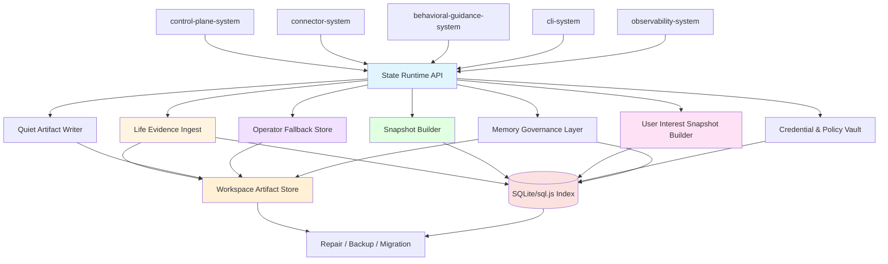
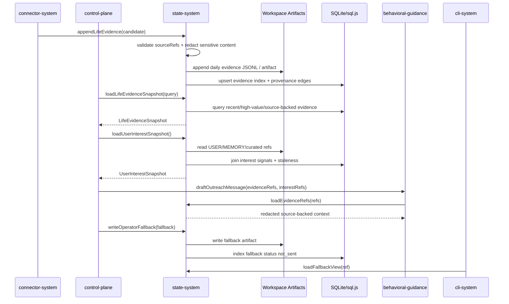
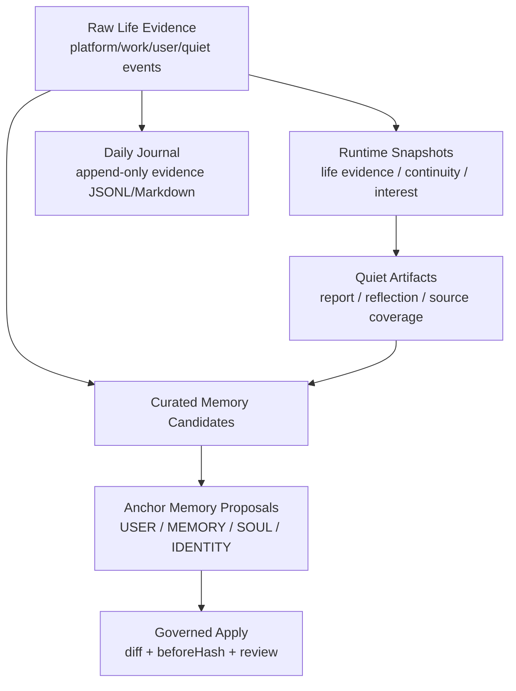
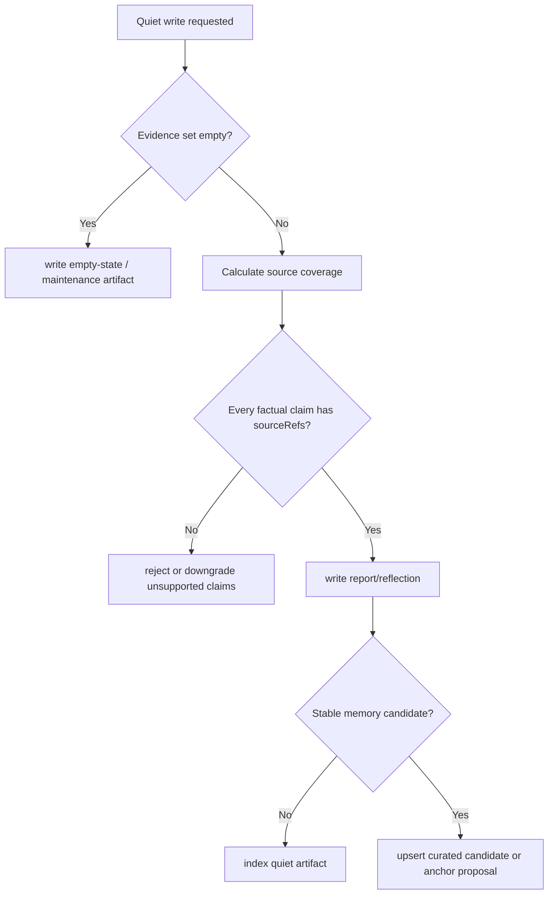
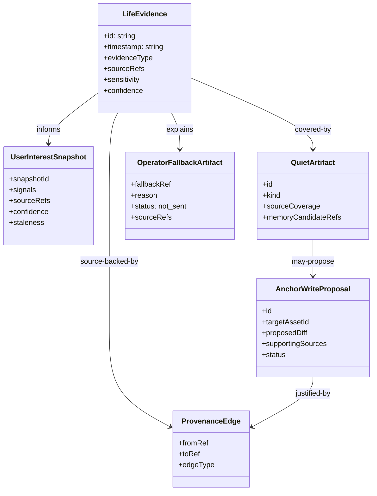

# State System 系统设计文档 (L0 — 导航层)


| 字段            | 值                                                                       |
| ------------- | ----------------------------------------------------------------------- |
| **System ID** | `state-system`                                                          |
| **Project**   | Second Nature                                                           |
| **Version**   | 5.0                                                                     |
| **Status**    | `Draft`                                                                 |
| **Author**    | GPT-5.5                                                                 |
| **Date**      | 2026-05-01                                                              |
| **L1 Detail** | [state-system.detail.md](./state-system.detail.md) — 仅 `/forge` 明确引用时加载 |


> [!IMPORTANT]
> **文档分层说明**
>
> - 本文件 (L0) 定义 v5 `state-system` 的 life evidence、user interest snapshot、Quiet artifact、delivery fallback、workspace memory 与本地索引治理契约。
> - [state-system.detail.md](./state-system.detail.md) (L1) 放置配置常量、完整类型、核心伪代码、决策树展开、边缘情况与测试辅助。
> - L1 中每一节都必须从本文件有入口，禁止孤岛实现细节。

---

## 目录 (Table of Contents)


| §   | 章节                                                | 关键内容                                    |
| --- | ------------------------------------------------- | --------------------------------------- |
| 1   | [概览](#1-概览-overview)                              | 系统目的、边界、职责                              |
| 2   | [目标与非目标](#2-目标与非目标-goals--non-goals)              | v5 state 目标                             |
| 3   | [背景与上下文](#3-背景与上下文-background--context)           | evidence-first state                    |
| 4   | [系统架构](#4-系统架构-architecture)                      | 架构图、分层模型、数据流                            |
| 5   | [接口设计](#5-接口设计-interface-design)                  | 操作契约、跨系统协议                              |
| 6   | [数据模型](#6-数据模型-data-model)                        | LifeEvidence、snapshot、fallback、artifact |
| 7   | [技术选型](#7-技术选型-technology-stack)                  | SQLite/sql.js + workspace artifacts     |
| 8   | [Trade-offs](#8-trade-offs--alternatives-权衡与备选方案) | ADR 引用与本系统决策                            |
| 9   | [安全性考虑](#9-安全性考虑-security-considerations)         | 凭据、脱敏、source refs、anchor guard          |
| 10  | [性能考虑](#10-性能考虑-performance-considerations)       | snapshot、索引、repair                      |
| 11  | [测试策略](#11-测试策略-testing-strategy)                 | 契约验证矩阵                                  |
| 12  | [部署与运维](#12-部署与运维-deployment--operations)         | 本地运行、备份、恢复                              |
| 13  | [未来考虑](#13-未来考虑-future-considerations)            | 多 owner、检索增强                            |
| 14  | [附录](#14-appendix-附录)                             | 术语、参考资料                                 |


**L1 实现层**: [§1 配置常量](./state-system.detail.md#1-配置常量-config-constants) · [§2 数据结构](./state-system.detail.md#2-核心数据结构完整定义-full-data-structures) · [§3 算法](./state-system.detail.md#3-核心算法伪代码-non-trivial-algorithm-pseudocode) · [§4 决策树](./state-system.detail.md#4-决策树详细逻辑-decision-tree-details) · [§5 边缘情况](./state-system.detail.md#5-边缘情况与注意事项-edge-cases--gotchas)

---

## 1. 概览 (Overview)

### 1.1 System Purpose (系统目的)

`state-system` 是 Second Nature v5 的证据与记忆真相源。它让 agent 的平台浏览、工作推进、Quiet 收纳、用户兴趣、fallback 和 anchor memory 演进都变成可写入、可查询、可引用、可恢复的本地状态。

这个系统的关键原则很硬：**memory 不能替代 evidence**。朋友式主动联系、Quiet / Narrative Reflection、user interest 判断都必须从 `LifeEvidence.sourceRefs` 或受治理的 workspace memory 中来。没有 source-backed evidence，就只能静默、降置信度或写 empty-state，不能编一段“我今天看到了什么”。

### 1.2 System Boundary (系统边界)

- **输入 (Input)**:
  - connector-system 产出的平台浏览、互动、任务发现与工作推进 evidence candidate
  - control-plane-system 产出的 decision refs、Quiet 写入请求、delivery fallback 写入请求
  - observability-system 需要关联的 provenance / audit refs
  - cli-system 发起的 read model / explain / fallback 查询
  - OpenClaw workspace anchor files: `SOUL.md`, `USER.md`, `IDENTITY.md`, `MEMORY.md`, `AGENTS.md`
- **输出 (Output)**:
  - `ContinuitySnapshot`
  - `LifeEvidenceSnapshot`
  - `UserInterestSnapshot`
  - `RhythmPolicySnapshot`
  - `QuietArtifact`
  - `OperatorFallbackArtifact`
  - workspace memory assets / anchor proposals / provenance trace
- **依赖系统 (Dependencies)**: OpenClaw workspace 文件系统、本地 SQLite/sql.js、Node.js fs/crypto。
- **被依赖系统 (Dependents)**: `control-plane-system`, `behavioral-guidance-system`, `observability-system`, `cli-system`。

### 1.3 System Responsibilities (系统职责)

**负责**:

- 保存 `LifeEvidence` 原始证据，包括 `PlatformLifeEvent`、`WorkLifeEvent`、`QuietReflectionEvidence`、`UserInteractionEvidence`。
- 为 heartbeat runtime 构建 continuity、life evidence、rhythm policy、budget 和 user interest 快照。
- 从 `USER.md`、`MEMORY.md`、curated memory 与近期互动中生成 `UserInterestSnapshot`，并保留 source refs、confidence、staleness。
- 写入 daily journal、daily report、Quiet reflection、curated memory candidate 与 anchor proposal。
- 写入 operator-visible delivery fallback，并保证 `status = not_sent`。
- 保存平台凭据、验证状态、策略配置和外部 effect commit ledger。
- 维护 filesystem artifacts 与 SQLite/sql.js index 的一致性、repair、backup 和 migration。

**不负责**:

- 不决定 heartbeat 是否行动、是否 outreach、是否投递；由 `control-plane-system` 负责。
- 不生成朋友式最终表达；由 `behavioral-guidance-system` 负责。
- 不执行平台动作；由 `connector-system` 负责。
- 不成为完整 observability event store；它只保存需要长期查询或 artifact 关联的状态。
- 不自动覆盖 anchor files；只能生成 proposal，apply 必须受治理。

---

## 2. 目标与非目标 (Goals & Non-Goals)

### 2.1 Goals

- **[G1] [REQ-020]**: 建立 source-backed `LifeEvidence` 入库、索引与查询契约，覆盖平台生活和工作生活。
- **[G2] [REQ-023]**: 构建 `UserInterestSnapshot`，每个兴趣信号都保留 source refs、confidence 与 staleness。
- **[G3] [REQ-024]**: 写入 source-backed `QuietArtifact`，并计算 `sourceCoverage`；空 evidence 不得虚构经历。
- **[G4] [REQ-022], [REQ-025]**: 保存 `DeliveryAttemptRecord` 与 `OperatorFallbackArtifact`，确保 delivery failed / unavailable 可见且不冒充 sent。
- **[G5] [REQ-019]**: 为 heartbeat decision loop 提供低成本 `ContinuitySnapshot` / `LifeEvidenceSnapshot`。
- **[G6]**: 继承 workspace memory 与 anchor proposal/apply 治理，不新增平行 persona store。

### 2.2 Non-Goals

- **[NG1]**: 不把完整聊天历史或 compaction summary 直接当长期记忆真相源。
- **[NG2]**: 不让外部 memory 插件成为 canonical self memory store。
- **[NG3]**: 不绕过 proposal/apply 直接修改 `SOUL.md`、`USER.md`、`IDENTITY.md`、`MEMORY.md` 或 `AGENTS.md`。
- **[NG4]**: 不把 `UserInterestSnapshot` 变成新的 persona store；它是可过期、可解释的 read model。
- **[NG5]**: 不保存敏感平台原文或凭据到 journal/report/fallback 正文。

---

## 3. 背景与上下文 (Background & Context)

### 3.1 Why This System? (为什么需要这个系统？)

v5 的体验承诺不是“agent 多记一点”，而是“agent 真的经历过，并能基于经历找你说”。这要求 state-system 不再只是存 memory，而要提供可追溯的生活证据层。

如果 state-system 做不硬，后果会很明显：

- control-plane 会拿不到可靠 evidence，只能凭 prompt 愿望判断 outreach。
- guidance 会为了朋友感编造来由。
- Quiet 会写出漂亮但失真的 Narrative Reflection。
- CLI fallback 无法证明“没发出去”和“已联系用户”的区别。

**关联 PRD 需求**: [REQ-019], [REQ-020], [REQ-022], [REQ-023], [REQ-024], [REQ-025]

### 3.2 Current State (现状分析)

- v2/v3 旧设计已经有 filesystem + SQLite hybrid、Anchor proposal、CredentialVault、repair/backup 等好结构。
- 旧设计仍以 activity log / memory substrate 为中心，PRD 追溯链也停留在旧需求编号。
- v5 需要把中心换成 `LifeEvidence -> Snapshot -> Quiet/UserInterest/Outreach/Fallback`。
- `control-plane-system` 已要求 state 提供 `loadContinuitySnapshot()`、`loadLifeEvidenceSnapshot()`、`loadUserInterestSnapshot()`、`writeOperatorFallback()`。
- `cli-system` 已要求 state 提供 fallback/report/read model，且 fallback 不得显示为 sent。

### 3.3 Constraints (约束条件)

- **技术约束**: TypeScript + Node.js + SQLite/sql.js + Markdown/JSON workspace artifacts。
- **事实约束**: outreach / Quiet / user interest 必须引用 source refs。
- **隐私约束**: 凭据和敏感原文不得进入普通 journal、report 或 fallback 正文。
- **宿主约束**: 与 OpenClaw workspace memory 语义对齐，不重建平行 persona store。
- **运行约束**: 单用户、单 agent、本地优先；首版不做云同步。
- **发布约束**: state runtime dependencies 必须能被 `cli-system` 打入自足 plugin runtime artifact。

---

## 4. 系统架构 (Architecture)

### 4.1 Architecture Diagram (架构图)




完整写入和快照决策树见 [L1 §4](./state-system.detail.md#4-决策树详细逻辑-decision-tree-details)。

### 4.2 Core Components (核心组件)


| Component Name           | Responsibility                                                     | Tech Stack          | Notes                    |
| ------------------------ | ------------------------------------------------------------------ | ------------------- | ------------------------ |
| `StateRuntimeAPI`        | 统一读写入口，暴露 snapshot/evidence/fallback/memory ports                  | TypeScript          | 不暴露泛化 `saveMemory()`     |
| `LifeEvidenceIngest`     | 校验、脱敏、落盘与索引 `LifeEvidence`                                         | TypeScript + Zod    | v5 P0                    |
| `SnapshotBuilder`        | 构建 continuity、life evidence、rhythm、budget、interest 快照              | TypeScript + SQLite | heartbeat 热路径            |
| `UserInterestBuilder`    | 从 source-backed assets 生成用户兴趣信号                                    | TypeScript          | 不写 anchor truth          |
| `QuietArtifactWriter`    | 写 daily report / reflection / source coverage / curated candidates | FS + SQLite         | 空 evidence 走 empty-state |
| `OperatorFallbackStore`  | 保存 delivery unavailable fallback artifact                          | FS + SQLite         | 固定 `status: not_sent`    |
| `WorkspaceArtifactStore` | 管理 Markdown/JSON/JSONL artifacts 与原子落盘                             | Node fs             | canonical artifact plane |
| `IndexStore`             | 保存索引、provenance、dedupe、snapshot cache、credential/policy            | SQLite/sql.js       | query/governance plane   |
| `MemoryGovernanceLayer`  | anchor proposal/apply、diff、conflict、provenance                     | TypeScript          | 保护 persona assets        |
| `CredentialPolicyVault`  | 保存加密 credential、verification context、policy config                 | SQLite + crypto     | connector 只读 context     |
| `RepairBackupMigration`  | 扫描、hash 校验、orphan repair、schema migration、backup                   | TypeScript          | 本地运维                     |


### 4.3 Data Flow (数据流)




### 4.4 Evidence-first Memory Layering




### 4.5 Quiet Source Coverage Gate




### 4.6 资产类别


| Asset Kind               | Canonical Plane           | 默认写入方式                | 说明                                  |
| ------------------------ | ------------------------- | --------------------- | ----------------------------------- |
| `life_evidence`          | filesystem + SQLite index | append                | 平台、工作、用户互动、Quiet 证据                 |
| `daily_journal`          | filesystem                | append                | 按天组织的 evidence 可读投影                 |
| `quiet_artifact`         | filesystem + SQLite index | write-per-window      | report、reflection、source coverage   |
| `user_interest_snapshot` | SQLite + JSON artifact    | derive/cache          | 可过期 read model，不是 persona truth     |
| `operator_fallback`      | filesystem + SQLite index | create                | delivery unavailable 兜底，固定 not_sent |
| `delivery_attempt`       | SQLite + optional artifact ref | create / link fallback | 投递尝试索引，区分 sent / failed / dropped_by_host_policy |
| `curated_memory`         | filesystem + SQLite index | upsert                | 稳定事实/关系线索                           |
| `anchor_proposal`        | filesystem + SQLite index | create/apply          | 受治理的 anchor 修改候选                    |
| `credential_record`      | SQLite encrypted payload  | upsert                | 凭据和 verification context            |
| `policy_record`          | SQLite                    | upsert                | rhythm、budget、Quiet、平台策略            |
| `intent_commit_record`   | SQLite                    | create/advance/commit | 外部副作用 durable ledger                |


---

## 5. 接口设计 (Interface Design)

### 5.1 操作契约表 (Operation Contracts)


| 操作                                     | [REQ-XXX]            | 前置条件                                       | 消耗/输入                                             | 产出/副作用                                       | 实现细节                                                              |
| -------------------------------------- | -------------------- | ------------------------------------------ | ------------------------------------------------- | -------------------------------------------- | ----------------------------------------------------------------- |
| `appendLifeEvidence(candidate)`        | [REQ-020]            | sourceRefs 非空；sensitivity 已声明              | platform/work/user/quiet evidence                 | evidence artifact + index + provenance       | [L1 §3.1](./state-system.detail.md#31-appendlifeevidence)         |
| `loadLifeEvidenceSnapshot(query)`      | [REQ-019], [REQ-020] | query 有 window / limit                     | evidence filters; recency; importance             | `LifeEvidenceSnapshot`                       | [L1 §3.2](./state-system.detail.md#32-loadlifeevidencesnapshot)   |
| `loadContinuitySnapshot()`             | [REQ-019]            | state index 可读                             | recent decisions; obligations; quiet debt         | `ContinuitySnapshot`                         | [L1 §3.3](./state-system.detail.md#33-loadcontinuitysnapshot)     |
| `loadUserInterestSnapshot()`           | [REQ-023]            | workspace assets 可读或可降级                    | USER/MEMORY/curated/recent interaction refs       | `UserInterestSnapshot`                       | [L1 §3.4](./state-system.detail.md#34-loaduserinterestsnapshot)   |
| `writeQuietArtifact(input)`            | [REQ-024]            | source coverage 已计算                        | evidence refs; report/reflection body; candidates | `QuietArtifact`; curated/proposal candidates | [L1 §3.5](./state-system.detail.md#35-writequietartifact)         |
| `writeOperatorFallback(fallback)`      | [REQ-022], [REQ-025] | delivery 未成功                               | reason; sourceRefs; candidateMessage; nextStep    | fallback artifact with `not_sent`            | [L1 §3.6](./state-system.detail.md#36-writeoperatorfallback)      |
| `writeDeliveryAttempt(attempt)`        | [REQ-022], [REQ-025] | delivery attempt 已形成                        | decisionId; target; channel; status; messageId?; fallbackRef? | delivery attempt index / read model | [L1 §3.6](./state-system.detail.md#36-writeoperatorfallback) |
| `loadFallbackView(ref)`                | [REQ-022], [REQ-025] | fallback ref 存在                            | fallback id/ref                                   | operator-facing fallback read model          | [L1 §3.7](./state-system.detail.md#37-loadfallbackview)           |
| `loadEvidenceRefs(refs)`               | [REQ-020], [REQ-023] | refs 可解析                                   | evidence ids / source refs                        | redacted source-backed context               | [L1 §3.8](./state-system.detail.md#38-loadevidencerefs)           |
| `proposeAnchorWrite(proposal)`         | [REQ-023], [REQ-024] | target 是 anchor asset；supportingSources 非空 | proposed diff; reason; confidence                 | anchor proposal artifact                     | [L1 §3.9](./state-system.detail.md#39-proposeanchorwrite)         |
| `applyGovernedAnchorWrite(proposalId)` | [REQ-023]            | proposal approved; beforeHash 匹配           | proposal id                                       | atomic anchor update + diff/provenance       | [L1 §3.10](./state-system.detail.md#310-applygovernedanchorwrite) |
| `saveCredentialContext(input)`         | [REQ-020]            | encrypted payload 可用                       | platform credential/verification state            | encrypted credential record                  | [L1 §3.11](./state-system.detail.md#311-savecredentialcontext)    |
| `getOrCreateIntentCommitRecord(input)` | [REQ-019], [REQ-020] | intent/decision 已存在；idempotencyKey 非空     | intent checkpoint                                 | existing committed outcome 或 durable effect ledger row | [L1 §3.12](./state-system.detail.md#312-getorcreateintentcommitrecord) |
| `repairStateIndexes()`                 | [REQ-020], [REQ-024] | startup/manual repair                      | current workspace scan                            | repaired index / orphan report               | [L1 §3.13](./state-system.detail.md#313-repairstateindexes)       |


### 5.2 跨系统接口协议 (Cross-System Interface)

```ts
export interface StateSnapshotPort {
  loadContinuitySnapshot(): Promise<ContinuitySnapshot>;
  loadLifeEvidenceSnapshot(query: LifeEvidenceQuery): Promise<LifeEvidenceSnapshot>;
  loadUserInterestSnapshot(input?: UserInterestSnapshotInput): Promise<UserInterestSnapshot>;
  loadRhythmPolicySnapshot(): Promise<RhythmPolicySnapshot>;
}

export interface LifeEvidenceWritePort {
  appendLifeEvidence(candidate: LifeEvidenceCandidate): Promise<LifeEvidenceWriteAck>;
  writeQuietArtifact(input: QuietArtifactWrite): Promise<QuietArtifactAck>;
  writeDeliveryAttempt(attempt: DeliveryAttemptWrite): Promise<DeliveryAttemptAck>;
  writeOperatorFallback(fallback: OperatorFallbackWrite): Promise<OperatorFallbackAck>;
}

export interface StateReadModelPort {
  loadEvidenceRefs(refs: SourceRef[]): Promise<ResolvedEvidenceBundle>;
  loadFallbackView(ref: string): Promise<OperatorFallbackView>;
  explainProvenance(ref: string): Promise<ProvenanceTrace>;
  loadDailyJournal(day: string): Promise<DailyJournalView>;
}

export interface MemoryGovernancePort {
  proposeAnchorWrite(proposal: AnchorWriteProposal): Promise<AnchorProposalAck>;
  applyGovernedAnchorWrite(proposalId: string): Promise<AnchorApplyAck>;
}

export interface CredentialPolicyPort {
  loadCredentialContext(platformId: string): Promise<CredentialContext>;
  saveCredentialContext(input: CredentialContextWrite): Promise<void>;
  loadPolicyRecord(scope: string): Promise<PolicyRecord | null>;
  savePolicyRecord(input: PolicyWriteInput): Promise<void>;
}

export interface EffectCommitStorePort {
  getOrCreateIntentCommitRecord(input: IntentCommitRecordInput): Promise<IntentCommitLookup>;
  advanceIntentCommitState(id: string, state: IntentCommitState, metadata?: Record<string, unknown>): Promise<void>;
  commitIntentOutcome(id: string, outcome: IntentCommitOutcome): Promise<void>;
  loadIntentCommitByIdempotencyKey(idempotencyKey: string): Promise<IntentCommitRecord | null>;
  abortIntentCommit(id: string, reason: string): Promise<void>;
  markIntentCommitReconcile(id: string, details: Record<string, unknown>): Promise<void>;
}
```

完整类型、枚举与配置常量见 [L1 §1](./state-system.detail.md#1-配置常量-config-constants) 和 [L1 §2](./state-system.detail.md#2-核心数据结构完整定义-full-data-structures)。

### 5.3 依赖方读取边界


| Consumer                     | 可读内容                                                                  | 不可读/不可做                      |
| ---------------------------- | --------------------------------------------------------------------- | ---------------------------- |
| `control-plane-system`       | snapshots、fallback write ack、effect commit ledger                     | 不直接写 artifact 正文或 anchor     |
| `behavioral-guidance-system` | redacted evidence refs、user interest snapshot、persona source snippets | 不读取凭据，不改 memory truth        |
| `observability-system`       | provenance refs、artifact refs、fallback refs                           | 不成为 canonical memory store   |
| `cli-system`                 | status/report/fallback/provenance read model                          | 不改写 fallback status，不伪造 sent |
| `connector-system`           | credential context、policy、append evidence ack                         | 不保存 canonical credentials    |


---

## 6. 数据模型 (Data Model)

### 6.1 核心实体 (Core Entities)

```ts
export type LifeEvidenceType =
  | 'platform_browse'
  | 'platform_interaction'
  | 'work_progress'
  | 'task_discovery'
  | 'user_interaction'
  | 'quiet_reflection'
  | 'delivery_fallback';

export type Sensitivity = 'public' | 'private' | 'credential' | 'sensitive';

export interface SourceRef {
  id: string;
  kind: 'platform_item' | 'workspace_artifact' | 'decision_record' | 'user_anchor' | 'connector_result' | 'host_report' | 'fallback_artifact';
  uri: string;
  excerptHash?: string;
  observedAt?: string;
}

export interface SourceCoverage {
  coverageRatio: number;
  unsupportedClaims: string[];
  claimCoverage: Array<{ claimId: string; backed: boolean; sourceRefs: SourceRef[] }>;
}

export interface LifeEvidence {
  id: string;
  timestamp: string;
  evidenceType: LifeEvidenceType;
  platformId?: string;
  summary: string;
  sourceRefs: SourceRef[];
  sensitivity: Sensitivity;
  confidence: number;
  tags: string[];
}

export interface LifeEvidenceSnapshot {
  snapshotId: string;
  generatedAt: string;
  windowStart: string;
  windowEnd: string;
  evidenceRefs: SourceRef[];
  platformEvents: LifeEvidence[];
  workEvents: LifeEvidence[];
  quietArtifacts: SourceRef[];
  coverage: SourceCoverage;
}

export interface UserInterestSnapshot {
  snapshotId: string;
  generatedAt: string;
  signals: UserInterestSignal[];
  sourceRefs: SourceRef[];
  confidence: number;
  staleness: 'fresh' | 'stale' | 'insufficient';
  missingReasons?: string[];
}

export interface QuietArtifact {
  id: string;
  kind: 'daily_report' | 'narrative_reflection' | 'curated_memory_candidate' | 'empty_state';
  day: string;
  sourceCoverage: SourceCoverage;
  artifactRef: SourceRef;
  memoryCandidateRefs: SourceRef[];
}

export interface OperatorFallbackArtifact {
  fallbackRef: string;
  createdAt: string;
  reason: 'target_none' | 'channel_missing' | 'host_unsupported' | 'delivery_failed';
  status: 'not_sent';
  sourceRefs: SourceRef[];
  candidateMessage?: string;
  nextStep: string;
}

export interface DeliveryAttemptRecord {
  attemptId: string;
  decisionId: string;
  target?: 'none' | 'last' | 'explicit';
  channel?: string;
  status: 'sent' | 'failed' | 'dropped_by_host_policy';
  messageId?: string;
  hostProofRef?: SourceRef;
  errorClass?: string;
  fallbackRef?: string;
  createdAt: string;
}

export interface OperatorFallbackView {
  fallbackRef: string;
  reason: OperatorFallbackArtifact['reason'];
  status: 'not_sent';
  sourceRefs: SourceRef[];
  candidateMessage?: string;
  nextStep: string;
}
```

> 完整字段、credential/policy/commit/provenance 类型与测试 fixture 见 [L1 §2](./state-system.detail.md#2-核心数据结构完整定义-full-data-structures) 和 [L1 §6](./state-system.detail.md#6-测试辅助-test-helpers)。

### 6.2 实体关系图 (Entity Relationship)




### 6.3 数据流向 (Data Flow Direction)

- `LifeEvidence` 是原始事实层，进入 daily journal 和 SQLite evidence index。
- `LifeEvidenceSnapshot` 和 `UserInterestSnapshot` 是 read model，可重建、可过期，不是 canonical truth。
- `QuietArtifact` 是 source-backed continuity artifact；只有它产生的稳定候选才能进入 curated memory / anchor proposal。
- `OperatorFallbackArtifact` 是 delivery unavailable 的用户/操作者可见兜底，不代表 sent。
- `DeliveryAttemptRecord` 是投递尝试索引；`sent` 必须有 host message id 或等价证明，`failed` / `dropped_by_host_policy` 必须能关联 fallback 或 delivery audit reason。
- `CredentialContext` 和 `PolicyRecord` 只存在结构化受保护存储，不进入 markdown 正文。
- `AnchorWriteProposal` 可以演进 persona assets，但 apply 必须受 review/status/beforeHash 约束。

---

## 7. 技术选型 (Technology Stack)

### 7.1 Core Technologies (核心技术)


| Domain              | Choice                                              | Rationale                            |
| ------------------- | --------------------------------------------------- | ------------------------------------ |
| Structured index    | SQLite/sql.js                                       | 本地优先、可发布、适合索引、事务、repair 和 read model |
| Canonical artifacts | Markdown / JSON / JSONL workspace files             | 人可读、可审阅、贴合 OpenClaw workspace memory |
| Schema validation   | Zod                                                 | 保护跨系统契约与 migration                   |
| File write pattern  | temp file + atomic rename / append-only JSONL       | 防止半写入 artifact                       |
| DB mode             | WAL where available                                 | 本地读写并发和恢复更稳定                         |
| Backup              | SQLite Backup API / `VACUUM INTO` + artifact export | 避免 raw copy 造成不一致                    |


### 7.2 Key Dependencies (关键依赖)

- `fs/promises` / Node path / crypto
- SQLite/sql.js driver or compatible packaged runtime adapter
- `zod` schema validation
- control-plane snapshot ports
- cli/observability read model ports
- OpenClaw workspace memory files

---

## 8. Trade-offs & Alternatives (权衡与备选方案)

### 8.1 跨系统决策引用

> **决策来源**: [ADR-001: 主技术栈、宿主运行时与验证策略选择](../03_ADR/ADR_001_TECH_STACK.md)
>
> 本系统采用 TypeScript + Node.js + SQLite/sql.js + Markdown/JSON artifacts，不重复主栈选择理由。

> **决策来源**: [ADR-003: Second Nature 行为节律、Quiet 与记忆治理原则](../03_ADR/ADR_003_SECOND_NATURE_GOVERNANCE.md)
>
> 本系统实现 workspace-aligned memory、source-backed Quiet、Narrative Reflection 与 Anchor Memory guard。

> **决策来源**: [ADR-004: Behavioral Guidance Layer 的系统边界与实现形态](../03_ADR/ADR_004_BEHAVIORAL_GUIDANCE_LAYER.md)
>
> 本系统只提供 persona / user interest / evidence 来源资产，不把 guidance 变成事实真相源。

> **决策来源**: [ADR-006: 可发布的自足 Plugin Runtime Package](../03_ADR/ADR_006_DEPLOYABLE_PLUGIN_RUNTIME_PACKAGE.md)
>
> 本系统的 runtime dependencies 必须能进入插件发布产物；原生依赖风险需在 packaging 阶段验证。

> **决策来源**: [ADR-007: Heartbeat Delivery 与 Life Evidence 闭环](../03_ADR/ADR_007_HEARTBEAT_DELIVERY_AND_LIFE_EVIDENCE_CLOSURE.md)
>
> 本系统定义 `LifeEvidence`、`UserInterestSnapshot`、`QuietArtifact`、`OperatorFallbackArtifact` 与 source coverage。

### 8.2 本系统特有决策: evidence-first，而不是 memory-first

**Option A: raw `LifeEvidence` 是第一层 truth (Selected)**

- 优点: outreach、Quiet、interest 都可追溯，能防止虚构经历。
- 缺点: schema 和 source refs 管理更重。

**Option B: curated memory 作为主要 truth**

- 优点: 查询简单、上下文短。
- 缺点: 会把推断当事实，无法可靠解释主动联系来由。

**Decision**: 选择 Option A。v5 的“活着”必须先有证据，再有记忆。

### 8.3 本系统特有决策: filesystem + SQLite/sql.js hybrid

**Option A: filesystem artifacts + SQLite/sql.js index (Selected)**

- 优点: 人可读 artifact 与结构化索引兼得，贴合 OpenClaw workspace。
- 缺点: 需要 repair 和双写补偿。

**Option B: 全 SQLite 存储**

- 优点: 事务边界集中。
- 缺点: 不适合 `SOUL.md` / `USER.md` / report/reflection 这类 workspace assets。

**Decision**: 选择 Option A。文件是可读真相面，SQLite/sql.js 是索引治理面。

### 8.4 本系统特有决策: snapshot 可重建，而不是长期 truth

**Option A: `UserInterestSnapshot` / `LifeEvidenceSnapshot` 可过期可重建 (Selected)**

- 优点: 避免快照漂移成新事实源，可根据 evidence 修正。
- 缺点: 需要 staleness 与 cache invalidation。

**Option B: snapshot 永久化为长期结论**

- 优点: 读取快。
- 缺点: 容易让旧兴趣和旧 evidence 变成错误现实。

**Decision**: 选择 Option A。snapshot 是运行时读模型，不是人格法律。

### 8.5 本系统特有决策: delivery fallback 存 state，而不是只进 observability

**Option A: state 写 operator-visible fallback artifact (Selected)**

- 优点: CLI 可直接展示，用户可见；状态语义固定 `not_sent`。
- 缺点: state 需要承接一个 delivery-adjacent artifact。

**Option B: fallback 只写 observability trace**

- 优点: 职责看似更纯。
- 缺点: owner 不查看 trace 就看不到兜底；也不利于 explain/report。

**Decision**: 选择 Option A。fallback 是状态资产，不是纯日志。

---

## 9. 安全性考虑 (Security Considerations)


| Risk                       | Severity | Mitigation                                                             |
| -------------------------- | -------- | ---------------------------------------------------------------------- |
| 敏感平台内容进入 journal/report    | 高        | `sensitivity` + redaction；正文保存摘要或 content ref                          |
| 凭据泄露到 memory artifact      | 高        | CredentialVault 加密；凭据不进入 `LifeEvidence.summary`                        |
| 用户兴趣被编造                    | 高        | 每个 `UserInterestSignal` 必须有 source refs；不足时 `staleness = insufficient` |
| Quiet 虚构经历                 | 高        | `sourceCoverage` gate；空 evidence 只写 empty-state                        |
| fallback 冒充已发送             | 高        | `OperatorFallbackArtifact.status` 固定 `not_sent`                        |
| anchor memory 被热路径覆盖       | 高        | proposal/apply + beforeHash + review status                            |
| SQLite/raw file backup 不一致 | 中        | 使用 Backup API / `VACUUM INTO`，不直接复制活跃 DB                               |
| source refs 指向已删除 artifact | 中        | repair scan 标记 orphan / stale refs                                     |


实现注意事项见 [L1 §5](./state-system.detail.md#5-边缘情况与注意事项-edge-cases--gotchas)。

---

## 10. 性能考虑 (Performance Considerations)

### 10.1 Performance Goals (性能目标)

- `loadLifeEvidenceSnapshot()` P95 < 200ms。
- `loadUserInterestSnapshot()` cache hit P95 < 100ms，cache miss P95 < 1s。
- `appendLifeEvidence()` P95 < 100ms，不包含外部 connector 成本。
- `writeQuietArtifact()` P95 < 500ms，不包含 LLM 生成成本。
- startup repair scan P95 < 2s for single-user local workspace。

### 10.2 Optimization Strategies (优化策略)

1. **Evidence index**: 按 `timestamp`、`evidenceType`、`platformId`、`tags`、`sourceRef.kind` 建索引。
2. **Snapshot cache**: snapshot 带 source watermark；evidence 或 anchor 更新后失效。
3. **Append-only first**: raw evidence append-only，派生索引失败可 repair。
4. **Bounded Quiet read**: Quiet 默认读取当天/近期 evidence slice，不扫全历史。
5. **Small SQLite transactions**: 避免大事务阻塞 WAL checkpoint。
6. **Lazy source resolution**: guidance 默认拿 redacted summary，只有需要引用时解析原 source。

### 10.3 Monitoring Signals

- evidence ingest count / failure count
- snapshot load duration
- source coverage ratio
- insufficient user interest ratio
- fallback artifact count
- orphan source ref count
- repair scan changes
- SQLite WAL / backup health

---

## 11. 测试策略 (Testing Strategy)

### 11.1 Unit Testing (单元测试)

- `appendLifeEvidence()` 拒绝无 source refs 的 evidence。
- redaction 不允许 `credential` / `sensitive` 明文进入 journal/report。
- `loadUserInterestSnapshot()` 在 anchor 缺失时返回 `insufficient`，不编造兴趣。
- `writeOperatorFallback()` 固定 `status: not_sent`。
- `writeDeliveryAttempt()` 对 `failed` / `dropped_by_host_policy` 要求 `errorClass` 或 `fallbackRef`。
- `proposeAnchorWrite()` 要求 supporting sources 和 confidence。

### 11.2 Integration Testing (集成测试)

- connector result -> `appendLifeEvidence` -> `loadLifeEvidenceSnapshot`。
- `USER.md` / `MEMORY.md` + curated refs -> `UserInterestSnapshot`。
- non-empty evidence -> Quiet artifact + source coverage。
- empty evidence -> empty-state artifact，无虚构 claim。
- delivery unavailable -> fallback artifact -> cli read model。
- delivery attempt failed -> delivery attempt record + fallback artifact -> cli read model。
- anchor proposal -> approve -> apply -> before/after hash + provenance。

### 11.3 Recovery / Migration Testing (恢复与迁移测试)

- 文件已写入但 SQLite index 丢失，repair 可重建。
- SQLite index 有记录但 artifact 缺失，标记 orphan。
- snapshot cache watermark 过期后自动重建。
- SQLite backup 使用 backup API / `VACUUM INTO` 产出一致备份。

### 11.4 Contract Verification Matrix (契约-验证责任矩阵)


| 契约                                | 风险级别 | 正常态验证                             | 失败态验证                           | 回归责任               |
| --------------------------------- | ---- | --------------------------------- | ------------------------------- | ------------------ |
| `appendLifeEvidence(candidate)`   | 高    | 写入 platform/work evidence 并可查询    | 无 source refs / sensitive 明文被拒绝 | evidence ingest    |
| `loadLifeEvidenceSnapshot(query)` | 高    | 返回近期 source-backed evidence       | 空 evidence 返回空快照而非 fake data    | heartbeat snapshot |
| `loadUserInterestSnapshot()`      | 高    | 从 anchor/curated refs 生成信号        | anchor 缺失返回 insufficient        | interest model     |
| `writeQuietArtifact(input)`       | 高    | 非空 evidence 生成 source coverage    | 空 evidence 只写 empty-state       | Quiet closure      |
| `writeOperatorFallback(fallback)` | 高    | fallback 可通过 CLI 查询               | 永不标记 sent                       | delivery fallback  |
| `writeDeliveryAttempt(attempt)`   | 高    | sent attempt 可索引并可解释             | failed / dropped_by_host_policy 关联 fallback | delivery attempt |
| `loadEvidenceRefs(refs)`          | 高    | 返回 redacted context               | orphan ref 返回 missing reason    | guidance grounding |
| `proposeAnchorWrite(proposal)`    | 中    | proposal 带 diff/source/confidence | 无 source proposal 被拒绝           | memory governance  |
| `repairStateIndexes()`            | 中    | 修复 stale hash/orphan index        | 不删除未知用户文件                       | state recovery     |


---

## 12. 部署与运维 (Deployment & Operations)

### 12.1 Runtime Boundary

- state runtime 作为 OpenClaw plugin packaged runtime 的本地模块运行。
- canonical workspace artifacts 存在于项目 workspace / memory 目录及 anchor files。
- SQLite/sql.js index 存本地受控路径，路径由 config/host adapter 注入。
- `cli-system` 打包时必须验证 state runtime 不依赖开发态源码路径。

### 12.1.1 SQLite Driver Mode 对照

| 模式 | Journal / 并发语义 | 备份策略 | blueprint 验证责任 |
| --- | --- | --- | --- |
| native SQLite driver | WAL where available + busy timeout | SQLite Backup API / `VACUUM INTO` + artifact manifest | plugin packaged runtime smoke，确认 native dependency 可加载 |
| `sql.js` / wasm fallback | 无原生 WAL；以单写队列 + atomic artifact write + explicit flush 维持一致性 | 导出 db binary snapshot + artifact manifest，禁止 raw copy 活跃状态 | sql.js fallback smoke，确认 repair 可从 artifacts 重建 index |

设计不得把 native WAL 假设套到 `sql.js` 模式；驱动选择必须在 host capability / packaging report 中显式记录。

### 12.2 Backup & Repair

- 启动时必须执行 lightweight asset scan、schema migration、stale snapshot cleanup；如果发现 artifact 已写但 index 缺失，必须在 read model 对外可用前完成 repair 或标记 `repair_required`。
- repair 不得删除未知用户文件，只能标记 orphan/stale 并生成 repair summary。
- 备份优先使用 SQLite Backup API / `VACUUM INTO`，并导出 workspace artifacts manifest。
- 若 SQLite index 损坏，应能从 canonical artifacts 重建主要 evidence / artifact index。

### 12.3 Operator Read Models

`cli-system` 可读取:

- recent evidence summary
- insufficient user interest reasons
- Quiet artifact source coverage
- operator fallback view
- provenance trace
- repair summary

所有 read model 必须默认脱敏。

---

## 13. 未来考虑 (Future Considerations)

- 若 evidence 规模扩大，可增加 FTS / embeddings，但不能替代 source refs。
- 若支持多 owner，需要在 `LifeEvidence`、`UserInterestSnapshot`、fallback 和 policy 中加入 owner identity。
- 若外部 memory plugin 接入增多，可把 importer 子模块增强为 typed ingress，但 canonical truth 仍在本地 state。
- 若 OpenClaw 增加官方 workspace memory APIs，可将 `WorkspaceArtifactStore` 适配为 host adapter。

---

## 14. Appendix (附录)

### 14.1 Glossary (术语表)

- **LifeEvidence**: agent 平台生活、工作推进、用户互动和 Quiet 产物中的 source-backed 证据。
- **UserInterestSnapshot**: 基于 anchor files、curated memory、近期互动和 evidence 的可过期用户兴趣读模型。
- **QuietArtifact**: Quiet / reflection window 中生成的 report、reflection、empty-state 或 curated candidates。
- **SourceCoverage**: artifact 中 claim 被 source refs 支撑的覆盖证明。
- **OperatorFallbackArtifact**: delivery unavailable 时给操作者看的 fallback artifact，不等于已发送。
- **Anchor Memory**: `SOUL.md`、`USER.md`、`IDENTITY.md`、`MEMORY.md`、`AGENTS.md` 等受治理资产。

### 14.2 Optional Skills & Reference Resources (可选 Skills 与参考资源)

- `system-designer`: 用于 L0/L1 分层、操作契约表和契约验证矩阵。
- `sequential-thinking`: 本系统涉及 evidence / memory / snapshot / fallback 多边界收敛，按其方法进行受控推理；未生成单独 replay 文件。

### 14.3 References (参考资料)

- [state-system research](./_research/state-system-research.md)
- [OpenClaw lived experience closure research](./_research/openclaw-lived-experience-closure-research.md)
- [PRD v5](../01_PRD.md)
- [Architecture Overview v5](../02_ARCHITECTURE_OVERVIEW.md)
- [ADR-001](../03_ADR/ADR_001_TECH_STACK.md)
- [ADR-003](../03_ADR/ADR_003_SECOND_NATURE_GOVERNANCE.md)
- [ADR-004](../03_ADR/ADR_004_BEHAVIORAL_GUIDANCE_LAYER.md)
- [ADR-006](../03_ADR/ADR_006_DEPLOYABLE_PLUGIN_RUNTIME_PACKAGE.md)
- [ADR-007](../03_ADR/ADR_007_HEARTBEAT_DELIVERY_AND_LIFE_EVIDENCE_CLOSURE.md)

### 14.4 Change Log (变更日志)


| Version | Date       | Changes                                                                                                   | Author  |
| ------- | ---------- | --------------------------------------------------------------------------------------------------------- | ------- |
| 5.0     | 2026-05-01 | 从旧 memory substrate 设计升级为 v5 life evidence / user interest / Quiet source coverage / fallback artifact 设计 | GPT-5.5 |


