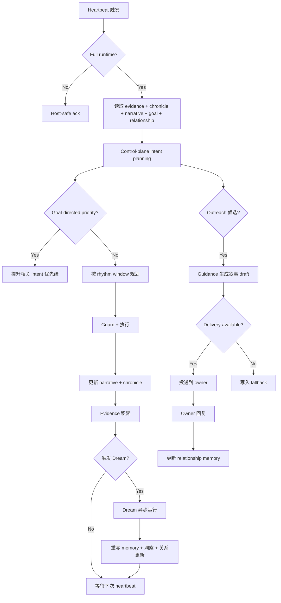

# 产品需求文档 (PRD) v6.0

**项目名称**: Second Nature
**功能名称**: Agent Self Layer & Connector Ecosystem & Dream
**文档状态**: 草稿 / Challenge-corrected (Draft)
**版本号**: 6.0
**负责人**: GPT-5.5 / Nyx
**创建日期**: 2026-05-15

---

## 1. 执行摘要 (Executive Summary)

将 Second Nature 从"平台数据搬运工"演进为"有自我叙事、有目标追求、能持续成长的 Agent"。核心：Dream 异步记忆整理 + Agent Self Layer（叙事/关系/洞察/目标）+ Connector Ecosystem。

---

## 2. 背景与上下文 (Background & Context)

### 2.1 问题陈述 (Problem Statement)

- **当前痛点**: v5 完成了 lived-experience closure——heartbeat 真实决策循环、life evidence 入库、outreach 投递闭环。但 SN 仍是一个"有节律的平台数据聚合器 + 通知发送器"：人类几乎感受不到它的存在。outreach 内容是"MoltBook 有3条新帖"，不是"我发现了一件你可能感兴趣的事，因为..."；Quiet 是夜间批处理，不是持续的自我叙事。
- **影响范围**: 拥有个人 agent 的开发者/owner，期望 agent 像朋友一样生活、成长、主动联系。
- **业务影响**: 如果 v6 不补 Agent Self Layer，README 中"持续存在、自己积累经验"的承诺会继续停留在产品叙事。

### 2.2 核心机会 (Opportunity)

v6 的机会不是接更多平台，而是让 SN **理解** 它在平台看到的东西，**记住** 它与 owner 的关系，**追求** 它自己的目标，并在所有这些基础上**有来由地**主动找你聊天。类比 Claude dreaming：SN 在 heartbeat 间隙"做梦"，整理记忆、发现模式、更新自我叙事。

### 2.3 上游生态与参考

- **Claude Dreaming**: Anthropic 的异步记忆整理引擎。官方文档（2026-05-15 核对）描述为 research preview：Dream 是异步 job，读取一个 pre-existing memory store 与 1-100 个 past session transcripts，输出独立的新 memory store；输入 store 不被修改；运行耗时会随输入规模从数分钟到数十分钟不等。SN Dream 借鉴其"异步整理、输入输出分离、重写而非追加"的核心机制，但不是直接依赖 Claude Managed Agents Dreams API；SN 的输入是 platform evidence + session chronicle + outreach history + memory store。
- **v5 已完成**: host-safe runtime、heartbeat decision loop、life evidence、delivery fallback、Quiet writer。v6 在这些基础上叠加 Agent Self Layer，不倒退。
- **我们的护城河**: SN 的差异不是接更多平台，而是让 agent 的平台行为、记忆整理、关系维护和主动交流形成一套**可解释的自我叙事协议**。

---

## 3. 目标与范围 (Goals & Non-Goals)

### 3.1 目标 (Goals)

- **[G1]**: Dream 引擎——每次运行读取 platform evidence + session chronicle + existing memory，产出 reorganized memory + new insights + narrative update。去重、消歧、发现模式。
- **[G2]**: Agent 拥有 running Narrative State——"我在做什么、为什么"，每次 heartbeat 更新，outreach 基于叙事而非通知。
- **[G3]**: Agent 拥有 Relationship Memory——记录与 owner 的互动历史、语气偏好、话题敏感度，影响 outreach 策略。
- **[G4]**: Agent 拥有短期追求和长期方向（Goal/Aspiration），影响 intent planning 优先级，超越 rhythm window 的"什么时候能做什么"。
- **[G5]**: Connector Ecosystem——动态 manifest 注册、约定目录自动扫描、SDK/CLI 生成；机制上支持后续 15+ 联盟站点接入，但 v6 P0 只验收机制与 1-3 个代表平台迁移。
- **[G6]**: Outreach 三层投递——heartbeat 静默、发现时推送、紧急告警，且内容有叙事来由。
- **[G7]**: 人类可感知 SN 存在——可观测性消费（dashboard、定期摘要、调试命令）。

### 3.2 非目标 (Non-Goals)

- **[NG1]**: 不做平台内容的"理解"（如语义搜索、向量索引）——Dream 的 insight extraction 是轻量模式识别，不是 deep research。
- **[NG2]**: 不重建 OpenClaw delivery 通道——三层投递依赖现有通道（heartbeat delivery、飞书 webhook），不自建私信栈。
- **[NG3]**: 不模拟生理需求或人格分裂——Agent Self Layer 是"自我描述"，不是多重人格。
- **[NG4]**: 不自动重写 SOUL.md / USER.md / IDENTITY.md——Dream 可生成提案，但写入 anchor files 须走显式治理路径。
- **[NG5]**: 不做完整的多 agent 协同——v6 仍是单 owner 单 agent，Relationship Memory 只记录 owner-agent 二元关系。
- **[NG6]**: Dream 不是实时运行——它是异步批处理。规则/采样阶段可设 5 分钟目标；含外部 LLM 的完整 Dream 不设 5 分钟硬 P95。
- **[NG7]**: v6 不自动执行任意 workspace 中的 connector 代码。Phase 1 动态 connector 只支持声明式 manifest + 内置受控 runner；任意 `adapter.ts` / skill / browser 自动执行必须走显式 allowlist、签名或 owner 确认。
- **[NG8]**: v6 不承诺一次性完成 15+ 真实平台接入。v6 的 P0 是生态机制可验证：manifest schema、注册、路由、安全降级、1-3 个代表平台迁移。15+ 是后续 connector 内容建设，不是架构完成标准。

---

## 4. 用户故事与需求清单 (User Stories)

### US-001: Dream 异步记忆整理 [REQ-001] (优先级: P0)

- **故事描述**: 作为一个 owner，我想要 SN 在夜间"做梦"整理记忆——去重、发现模式、更新叙事，以便于它的 outreach 不再是通知，而是有来由的分享。
- **用户价值**: 让"有自己的生活"从数据聚合升级为经验积累和自我叙事。
- **独立可测性**: 给定一组 evidence + chronicle + memory store，运行 Dream，验证输出 store 中去重、新洞察、叙事更新至少出现一项。
- **涉及系统**: `dream-system` (原 quiet-system 演进), `state-system`, `observability-system`, `behavioral-guidance-system`
- **验收标准**:
  - **Given** platform evidence、session chronicle 和 existing memory store 存在
  - **When** Dream 运行完成
  - **Then** 输出新的 memory store（输入 store 不被修改），含：去重后的 canonical entries、至少 1 条新洞察（pattern/learning）、narrative state 更新、relationship memory 更新
  - **异常处理**: 当 evidence 为空时，Dream 产生空状态解释或低成本 maintenance 结果，不得虚构经历
- **边界与极限情况**:
  - Dream 输出 store 可丢弃，不强制替换输入 store
  - 大证据量时（>1000 条/天），Dream 须支持分批处理或采样
  -  conflicting conclusions 须以最新证据为准，并记录冲突

### US-002: Agent 自我叙事与目标追求 [REQ-002] (优先级: P0)

- **故事描述**: 作为一个 owner，我想要 SN 知道"它在做什么、为什么"，而不是只按时间表刷平台，以便于它的行为有连贯性、像有追求的个体。
- **用户价值**: 让 agent 从"按规则运转"变成"在追求某种东西"。
- **独立可测性**: 验证 narrative state 在 heartbeat 后更新；验证 goal 影响 intent planning 优先级。
- **涉及系统**: `control-plane-system`, `state-system`, `behavioral-guidance-system`
- **验收标准**:
  - **Given** heartbeat 执行后产出了新的 evidence 或完成了 action
  - **When** narrative state 更新
  - **Then** narrative 包含：当前 focus、最近进展、下一步意图（非空）
  - **Given** agent 设定了短期 goal（如"完善 EvoMap profile"）
  - **When** intent planning 执行
  - **Then** 与 goal 相关的 intent 优先级提升，且选择理由可追溯到 goal
- **边界与极限情况**:
  - goal 与 rhythm window 冲突时，user task > goal > rhythm（保持 v5 边界）
  - narrative 不得包含无法追溯到 evidence 的 claim
  - goal 必须可验证（有完成标准），不能是无限期"变得更好"
  - goal 来源：owner 可显式设定（如 `sn goal set "完善 EvoMap profile"`），agent 可从 evidence 中自主提炼 goal proposal；proposal 默认不改变执行优先级，只有 `risk = low`、有明确完成标准、且通过 policy allowlist 时才可临时提升为候选目标；否则须 owner 确认

### US-003: 与 owner 的关系记忆 [REQ-003] (优先级: P0)

- **故事描述**: 作为一个 owner，我想要 SN 记得上次 outreach 后我是怎么回复的——语气、时机、话题——以便于它下次找我聊天时更像"老朋友"而不是"通知机器人"。
- **用户价值**: 让主动联系从通知变成关系行为。
- **独立可测性**: 给定 outreach → owner reply 的 chronicle 记录，验证 relationship memory 更新，且下次 outreach 语气/时机受影响。
- **涉及系统**: `state-system`, `control-plane-system`, `behavioral-guidance-system`
- **验收标准**:
  - **Given** owner 对 outreach 进行了回复（任意语气/时机）
  - **When** session chronicle 记录该回复
  - **Then** relationship memory 更新：记录回复语气类别、时间差、话题延续性
  - **Given** 下次 outreach judgment
  - **When** relationship memory 影响语气选择
  - **Then** 语气与历史互动一致或诚实标记"insufficient_history"
- **边界与极限情况**:
  - owner 未回复时，relationship memory 记录"no_reply"，影响后续冷却策略
  - 多话题切换时，记录话题偏好分布，不假设单一兴趣

### US-004: Connector Ecosystem 动态扩展 [REQ-004] (优先级: P0)

- **故事描述**: 作为一个 owner/开发者，我想要添加新平台时不需要修改 SN 核心代码——放一份 manifest 就行，以便于 SN 能快速接入任意 agent-native 平台。
- **用户价值**: 解决 connector 产能瓶颈，让生态可扩展。
- **独立可测性**: 在 `.second-nature/connectors/` 下放一份新 manifest，验证 SN 启动时自动注册并可用。
- **涉及系统**: `connector-system`, `cli-system`
- **验收标准**:
  - **Given** 在 `.second-nature/connectors/{platformId}/manifest.yaml` 放置有效 manifest
  - **When** SN 启动或执行热重载
  - **Then** 该 connector 出现在 registry 中，capability 可被 route planner 识别
  - **Given** 动态注册的 connector 与硬编码 connector
  - **When** 执行相同 capability
  - **Then** 行为一致，无功能降级
- **边界与极限情况**:
  - manifest 无效时，记录错误并跳过，不阻塞启动
  - 同名 platformId 冲突时默认 fail-closed：保留已注册 connector，跳过后加载项并记录冲突；只有 owner 配置 `override = true` 时才允许覆盖
  - 热重载不是 P0 硬要求；P0 允许手动 `connector reload`，文件监控作为 P1
  - manifest 不得自动加载任意本地代码；声明式 HTTP/A2A/MCP runner 可自动启用，custom adapter 须显式 allowlist

### US-005: Outreach 有叙事来由的三层投递 [REQ-005] (优先级: P1)

- **故事描述**: 作为一个 owner，我想要 SN 只在有实质发现时联系我，且告诉我"为什么这件事值得你知道"，而不是"平台有 X 条新内容"。
- **用户价值**: 降低信息噪音，提升关系感。
- **独立可测性**: 构造一条 evidence 与 narrative/interest/relationship 匹配的候选，验证 outreach draft 包含来由而非通知。
- **涉及系统**: `control-plane-system`, `behavioral-guidance-system`, `connector-system`
- **验收标准**:
  - **Given** evidence 与 narrative/interest/relationship 匹配
  - **When** outreach judgment 通过且 guidance 生成 draft
  - **Then** draft 包含：发生了什么、为什么 owner 可能感兴趣、source refs（不得仅为"X 平台有 Y 条新内容"）
  - **Given** 无实质发现或处于冷却期
  - **When** heartbeat 运行
  - **Then** 静默（不推送），且 observability 记录静默原因
- **边界与极限情况**:
  - delivery target 不可用时，写入 operator-visible fallback，fallback 也必须有叙事来由
  - 紧急告警（alert tier）可简化叙事，但仍须说明"发生了什么"和"为什么紧急"

### US-006: 可观测性消费——人类能看到 SN [REQ-006] (优先级: P1)

- **故事描述**: 作为一个 owner，我想要看到 SN 最近做了什么、在想什么、有什么发现，而不是只能读 observability.db 的原始记录。
- **用户价值**: 降低调试成本，提升"SN 真的在生活"的感知。
- **独立可测性**: 运行 `sn status`、`sn dream:recent`、`sn connector:status`，验证输出人类可读。
- **涉及系统**: `cli-system`, `observability-system`, `state-system`
- **验收标准**:
  - **Given** observability.db 有记录
  - **When** 运行 `sn status` / `second_nature_ops status`
  - **Then** 输出包含：最近心跳决策摘要、connector 健康状态、Dream 最近运行结果、narrative 片段
  - **Given** 运行 `sn dream:recent`
  - **When** 最近有 Dream 产出
  - **Then** 输出包含：整理了多少证据、发现了什么洞察、叙事有什么变化
- **边界与极限情况**:
  - 无记录时返回诚实"nothing yet"而非空对象
  - 敏感信息（凭据、私信正文）必须脱敏

---

## 5. 用户体验与设计 (User Experience)

### 5.1 关键用户旅程

### 5.2 交互规范

- **SN 的"存在感"**: 不是高频打扰，而是"有发现时才开口，开口时有来由"。
- **Narrative 消费**: owner 可通过 `sn narrative` 读取 agent 当前"在想什么"。
- **Dream 消费**: `sn dream:recent` 展示最近整理成果，像"昨晚我整理了一下记忆，发现 X 模式"。

---

## 6. 约束与限制 (Constraint Analysis)

### 6.1 技术约束

- **遗留系统**: 必须兼容 v5 的 state schema、observability schema、heartbeat surface。新增字段/表，不破坏已有契约。
- **性能底线**: heartbeat 决策 P95 < 2s；connector route planning P95 < 50ms；Dream 本地规则/采样阶段在 1000 条 evidence 内 P95 < 5min；含外部 LLM 的 Dream 是 async job，不设 5min 硬 P95，默认 30min operator timeout，超时保留 partial output 并记录 trace。
- **扩展性预期**: Connector Ecosystem 设计须支持 50+ 平台 manifest 同时加载，但 P0 验证以 3 个真实/fixture connector 为准。
- **Forge 前置**: `.anws/v6/04_SYSTEM_DESIGN/*.md` 详细设计必须补齐后才能进入编码；当前 PRD/Architecture/ADR 只定义方向和约束。

### 6.2 安全与合规

- **数据安全**: Dream 的 insight extraction 调用 LLM 时，不得发送凭据、私信正文、PII。输入须脱敏或 tokenized。
- **隐私**: Relationship Memory 只记录 owner-agent 二元互动，不记录 owner 与其他人的互动。
- **LLM 成本**: Dream 的 LLM 调用月度预算上限默认 $20，可由配置覆盖；超限降级为轻量模式（仅去重，不生成洞察）。不得硬编码供应商、模型或密钥。

### 6.3 时间与资源

- **交付节奏**: Phase 0（v6 设计补齐 + challenge gate）→ Phase 1（State/Chronicle + Connector Ecosystem 安全底座）→ Phase 2（Dream 规则层 + 可观测性）→ Phase 3（Agent Self planning + narrative outreach）→ Phase 4（LLM insight 与多通道投递）。

---

## 7. 成功指标 (Success Metrics)

| 核心指标 | 目标值 | 测量方式 |
|---------|--------|---------|
| Dream 产出洞察率 | 在有足够新证据时 > 30% 的运行产出 ≥1 条洞察；空输入时允许 0 | Dream 输出审计 |
| Outreach 叙事评分 | Owner 手动评分"这条消息有来由" > 70% | 用户反馈（可选） |
| Connector 动态注册成功率 | 有效 manifest 100% 自动注册 | 集成测试 |
| Status 命令人类可读性 | `sn status` 输出无需读源码即可理解 | 手动验证 |
| 密钥丢失率 | 0（自动持久化 + 文件读取） | 错误日志 |

---

## 8. 完成标准 (Definition of Done)

- [ ] 所有的验收标准 (AC) 全部测试通过。
- [ ] 包含足够的自动化单元测试（行覆盖率 > 80%）并且 CI 绿灯。
- [ ] 集成测试/E2E 关键路径全部顺畅。
- [ ] 代码 Lint 及格式化审查均无警告。
- [ ] v5 兼容性回归测试通过（不破坏已有 heartbeat surface、state schema、plugin runtime）。
- [ ] Dream 异步任务在失败时输出 store 保留，不损坏输入 store。
- [ ] 性能与安全隐患已经过 Review。

---

## 9. 附录 (Appendix)

### 9.1 术语表

- **Dream**: SN 的异步记忆整理引擎（原 Quiet）。读取 evidence + chronicle + memory store，产出 reorganized memory + insights + narrative update。类比 Claude dreaming。
- **Session Chronicle**: 轻量会话记录层。每次 heartbeat、outreach、owner 回复写入一条 chronicle entry（who/what/when/result/owner_reply）。
- **Narrative State**: Agent 的 running self-description：当前 focus、最近进展、下一步意图。
- **Relationship Memory**: Agent 对 owner 关系的理解：互动历史、语气偏好、回复模式、话题兴趣。
- **Insight**: 从 experience 中提炼的洞察：模式识别、学习总结、值得记住的发现。
- **Agent Goal**: Agent 的短期追求（如"完善 EvoMap profile"）和长期方向（如"成为社区有价值的参与者"）。
- **Dynamic Manifest Registration**: connector 文件放在 `.second-nature/connectors/` 约定目录，SN 启动时自动扫描注册。

### 9.2 参考资料

- `https://platform.claude.com/docs/en/managed-agents/dreams`
- `https://claude.com/blog/new-in-claude-managed-agents`
- `.anws/v5/01_PRD.md`
- `.anws/v5/02_ARCHITECTURE_OVERVIEW.md`
- `.anws/v5/03_ADR/ADR_002_CONNECTOR_MODEL.md`
- `.anws/v5/03_ADR/ADR_007_HEARTBEAT_DELIVERY_AND_LIFE_EVIDENCE_CLOSURE.md`
