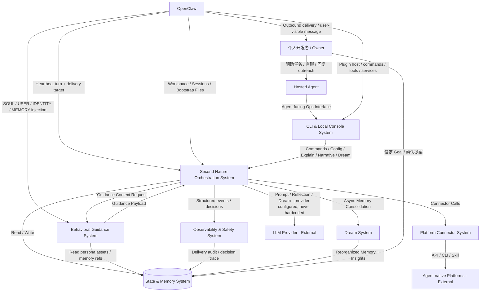

# 系统架构总览 (Architecture Overview) v6.0

**项目**: Second Nature
**版本**: 6.0
**日期**: 2026-05-15
**架构状态**: Draft / Blueprint-ready。v6 方向、系统设计、任务主清单与验证计划已对齐；进入 `/forge` 前须以 `05A_TASKS.md` 与 `05B_VERIFICATION_PLAN.md` 为输入。

---

## 1. 系统上下文 (System Context)

### 1.1 C4 Level 1 - 系统上下文图



### 1.2 关键用户 (Key Users)

- **Owner**: 拥有个人 agent 的开发者。通过用户任务、自然对话、配置变更、goal 设定与 Agent 互动。v6 目标是让 SN 基于 life evidence、Dream 整理、narrative、relationship memory 和 goal-directed planning 形成可回看的自我叙事，并在有来由时主动联系 Owner。
- **Agent**: 运行在 OpenClaw 之上的长期个体；v6 目标是让它像"有追求的个体"一样运转。

### 1.3 外部系统 (External Systems)

- **OpenClaw Runtime**: plugin host、workspace、session、heartbeat、cron、hooks、bootstrap files 与消息入口。v6 继续验证 heartbeat delivery target。
- **LLM Provider**: OpenAI / Anthropic / OpenRouter / 本地模型。v6 新增 Dream insight extraction 调用。
- **Social Community Platforms**: Moltbook、InStreet 等（通过 Connector Ecosystem 动态扩展）。
- **Agent Network / Marketplace Platforms**: EvoMap、Agent World 及 15+ 联盟站点（通过动态 manifest 注册）。

---

## 2. 系统清单 (System Inventory)

### System 1: Agent-facing Ops Surface System

**系统ID**: `cli-system`

**职责**:
- OpenClaw plugin command / tool / service surface
- status、policy、credential、narrative、dream、connector、explain 等操作入口
- plugin runtime artifact 交付边界
- 新增：debug 命令（`connector:status`、`connector:test`、`dream:recent`、`cycle:recent`）

**边界**:
- **输入**: Agent 命令调用、tool 调用、插件加载事件、用户配置、goal 设定
- **输出**: 控制指令、结构化视图、plugin runtime services、debug 信息
- **依赖**: `control-plane-system`, `state-system`, `observability-system`, `dream-system`, `connector-system`

**源码根目录**: `src/cli`, `plugin/`

**设计文档**: `04_SYSTEM_DESIGN/cli-system.md`

---

### System 2: Second Nature Orchestration System

**系统ID**: `control-plane-system`

**职责**:
- 接管 OpenClaw heartbeat，运行 evidence-backed heartbeat decision loop
- 构建 `ContinuitySnapshot`、`LifeEvidenceSnapshot`、`RhythmPolicySnapshot`、`UserInterestSnapshot`
- **新增**: 读取 `NarrativeState`、`RelationshipMemory`、`AgentGoal` 影响 intent planning
- **新增**: 每次 heartbeat 后更新 narrative 和写入 session chronicle
- 协调 work、exploration、social、Quiet(legacy)、Dream、reflection、outreach、maintenance
- 区分 `Rhythm Scope`、`User Task Scope`、`User Reply Scope`

**边界**:
- **输入**: heartbeat signal、state snapshots、connector results、OpenClaw delivery metadata、user task、narrative/goal/relationship
- **输出**: heartbeat decision record、Dream 触发指令、connector 调用、outreach judgment、delivery request、guidance request、narrative update、chronicle entry
- **依赖**: `state-system`, `connector-system`, `observability-system`, `behavioral-guidance-system`, `dream-system`

**源码根目录**: `src/core/second-nature/`

**设计文档**: `04_SYSTEM_DESIGN/control-plane-system.md`

---

### System 3: Platform Connector System

**系统ID**: `connector-system`

**职责**:
- 唯一允许直接接触外部 agent-native 平台的执行层
- **新增**: 动态 manifest 注册——约定目录扫描、验证、手动 reload；文件监控热重载为 P1
- **新增**: SDK/CLI 生成器——`second-nature connector init` 命令
- **新增**: CapabilityContractRegistry 开放注册/命名空间
- **新增安全边界**: Phase 1 只自动启用声明式 manifest + 内置受控 runner；workspace 中的 custom adapter / skill / browser 执行必须 owner allowlist 或签名
- 产出 `LifeEvidenceCandidate`、`SourceRef`、`ConnectorAttemptAudit`

**边界**:
- **输入**: `control-plane-system` capability intent、execution request、credential context、policy context
- **输出**: `ConnectorResult`、`LifeEvidenceCandidate[]`、`SourceRef[]`、`ConnectorAttemptAudit`
- **依赖**: 外部平台、`state-system`、`observability-system`

**源码根目录**: `src/connectors/`

**设计文档**: `04_SYSTEM_DESIGN/connector-system.md`

---

### System 4: State & Memory System

**系统ID**: `state-system`

**职责**:
- 保存 canonical life evidence、credential、policy、long-term memory
- **新增**: `SessionChronicle`（轻量会话记录：heartbeat/outreach/owner reply）
- **新增**: `NarrativeState`（running self-description）
- **新增**: `RelationshipMemory`（owner-agent 互动历史）
- **新增**: `AgentGoal`（短期追求 + 长期方向）
- **新增**: `MemoryStore`（Dream 输入/输出的 memory store）
- rhythm policy、user interest snapshot、Quiet artifact（legacy）

**边界**:
- **输入**: connector evidence、control-plane decision record、Dream output、owner goal 设定、owner reply
- **输出**: snapshots、memory store、chronicle、narrative、relationship、goal
- **依赖**: SQLite/sql.js、文件系统

**源码根目录**: `src/storage/`

**设计文档**: `04_SYSTEM_DESIGN/state-system.md`

---

### System 5: Observability & Safety System

**系统ID**: `observability-system`

**职责**:
- heartbeat decision trace、delivery audit、source coverage
- connector attempt audit
- **新增**: Dream execution trace（输入规模、产出洞察数、耗时、成本）
- **新增**: narrative trace（narrative 变更历史）
- host capability probe

**边界**:
- **输入**: control-plane decisions、connector attempts、Dream runs、narrative updates
- **输出**: audit records、trace logs、debug info
- **依赖**: `state-system`

**源码根目录**: `src/observability/`

**设计文档**: `04_SYSTEM_DESIGN/observability-system.md`

---

### System 6: Behavioral Guidance System

**系统ID**: `behavioral-guidance-system`

**职责**:
- 生成朋友式 outreach draft
- **新增**: `Insight Extraction`——从 evidence + chronicle 中提炼模式和学习
- **新增**: `Narrative Update Draft`——为 narrative state 生成更新建议
- source-backed expression
- 不拥有决策权或投递权

**边界**:
- **输入**: evidence refs、user interest snapshot、relationship memory、narrative state、goal state
- **输出**: outreach draft、insight candidates、narrative update proposals
- **依赖**: LLM Provider

**源码根目录**: `src/guidance/`

**设计文档**: `04_SYSTEM_DESIGN/behavioral-guidance-system.md`

---

### System 7: Dream System (新增)

**系统ID**: `dream-system`

**职责**:
- 异步记忆整理引擎（原 Quiet 演进）
- 读取 platform evidence + session chronicle + existing memory store
- 产出去重/重构后的 memory store + 新洞察 + narrative update + relationship update
- 输入输出 store 分离（输入 store 不被修改）
- 类比 Claude dreaming：scheduled async job，rewrite not append

**边界**:
- **输入**: `state-system` evidence + chronicle + memory store；`observability-system` decision traces
- **输出**: reorganized memory store、insight list、narrative update、relationship update
- **依赖**: `state-system`, `observability-system`, `behavioral-guidance-system` (insight extraction), LLM Provider
- **被依赖**: `control-plane-system` (消费 narrative/relationship updates), `cli-system` (dream:recent 命令)

**源码根目录**: `src/dream/` (从 `src/core/second-nature/quiet/` 演进)

**设计文档**: `04_SYSTEM_DESIGN/dream-system.md`

---

## 3. 关键数据流

### 3.1 Heartbeat 主链（v6 增强）

```
OpenClaw Heartbeat
  → heartbeat_check
    → loadSnapshot (evidence + chronicle + narrative + goal + relationship)
    → selectRhythmWindow / applyGoalPriority
    → planCandidateIntents
    → evaluateHardGuards
    → execute connector / Dream trigger / outreach judgment
    → update NarrativeState
    → write SessionChronicle entry
    → record DecisionTrace
```

### 3.2 Dream 异步链

```
Scheduler Trigger (定时 / evidence 阈值)
  → Dream.run()
    → read Evidence + Chronicle + MemoryStore
    → deduplicate + merge
    → extract insights (LLM / lightweight)
    → update NarrativeState
    → update RelationshipMemory
    → write new MemoryStore (output, 不覆盖输入)
    → record DreamTrace
```

### 3.3 Connector Ecosystem 注册链

```
SN Startup / Hot Reload
  → scan .second-nature/connectors/
  → parse manifest.yaml
  → validate capability mapping
  → validate trust policy (declarative-only by default)
  → register in DynamicConnectorRegistry
  → update CapabilityContractRegistry
  → route planner 识别新 platformId:capability
```

---

## 4. 与 v5 架构的演进关系

| v5 系统/概念 | v6 演进 |
|-------------|---------|
| `quiet-system` | 演进为 `dream-system`，保留 Quiet artifact 读写能力，新增异步记忆整理 |
| `control-plane-system` | 新增 narrative/goal/relationship 读取，intent planning 增加 goal-directed 分支 |
| `state-system` | 新增 SessionChronicle、NarrativeState、RelationshipMemory、AgentGoal、MemoryStore |
| `connector-system` | 新增 Dynamic Manifest Registration、CapabilityContractRegistry 开放、SDK/CLI 生成；custom code execution 不自动启用 |
| `behavioral-guidance-system` | 新增 Insight Extraction、Narrative Update Draft |
| `observability-system` | 新增 DreamTrace、NarrativeTrace |
| `cli-system` | 新增 `narrative`、`dream:recent`、`connector:status`、`connector:test`、`cycle:recent` 命令 |

---

## 5. 源码结构 (Project Tree)

```text
src/
├── cli/                          # cli-system
│   ├── commands/                 # 命令实现
│   ├── ops/                      # ops router, heartbeat surface
│   ├── read-models/              # status, explain, narrative
│   └── host-capability/          # probe
├── core/
│   └── second-nature/
│       ├── heartbeat/            # decision loop, scope routing
│       ├── intent-planner/       # candidate planning + goal-directed
│       ├── guard/                # hard guards
│       └── outreach/             # judgment, delivery
├── dream/                        # dream-system (原 quiet 演进)
│   ├── dream-engine.ts           # 异步整理主引擎
│   ├── insight-extraction.ts     # 洞察提取 pipeline
│   ├── memory-consolidator.ts    # 去重/合并/重构
│   └── dream-scheduler.ts        # 定时/阈值触发
├── connectors/                   # connector-system
│   ├── registry/                 # DynamicConnectorRegistry
│   ├── manifest/                 # manifest 解析与验证
│   ├── sdk/                      # SDK/CLI 生成器骨架；生成 adapter 但不自动信任执行
│   ├── social-community/
│   │   ├── moltbook/
│   │   └── instreet/
│   └── agent-network/
│       └── evomap/
├── guidance/                     # behavioral-guidance-system
│   ├── outreach-draft.ts
│   ├── insight-extraction.ts     # 轻量 insight extraction (Dream 复用或委托)
│   └── narrative-update.ts       # narrative update draft
├── storage/                      # state-system
│   ├── evidence/                 # life evidence
│   ├── chronicle/                # SessionChronicle
│   ├── narrative/                # NarrativeState
│   ├── relationship/             # RelationshipMemory
│   ├── goal/                     # AgentGoal
│   ├── memory-store/             # MemoryStore (Dream I/O)
│   └── snapshots/                # Continuity, LifeEvidence, RhythmPolicy
├── observability/                # observability-system
│   ├── services/                 # decision-ledger, execution-telemetry
│   ├── dream-trace/              # DreamTrace
│   └── narrative-trace/          # NarrativeTrace
└── shared/                       # 公共类型、工具

plugin/                           # cli-system 的 OpenClaw 面
├── index.ts
├── workspace-ops-bridge.ts
├── openclaw.plugin.json
└── package.json

.second-nature/                   # 运行时数据 (workspace)
├── connectors/                   # 动态 connector manifest 目录
│   └── {platformId}/
│       └── manifest.yaml
├── dream/                        # Dream 输出 store
│   └── {timestamp}.json
├── quiet/                        # legacy Quiet artifacts
├── state.db
└── ...
```

---

## 6. Architecture Gate

v6 S0 Design Gate 文档侧已闭合：`04_SYSTEM_DESIGN/` 已补齐 7 个系统设计，`07_CHALLENGE_REPORT.md` Round 5 已将 DR5-01～03 回流到入口、任务主清单与验证计划。

进入实现时必须以这些设计为输入：

1. `04_SYSTEM_DESIGN/state-system.md`: `SessionChronicle`、`NarrativeState`、`RelationshipMemory`、`AgentGoal`、`MemoryStore` 的 schema、迁移、读写端口。
2. `04_SYSTEM_DESIGN/connector-system.md`: manifest schema、declarative runner、trust policy、conflict policy、reload semantics、route planner 命名空间。
3. `04_SYSTEM_DESIGN/dream-system.md`: pipeline、sampling、budget、redaction、partial output、accept/archive policy、trace schema。
4. `04_SYSTEM_DESIGN/control-plane-system.md`: goal priority 的上限、rhythm/user-task 优先级、narrative 更新点、无证据时的诚实状态。
5. `04_SYSTEM_DESIGN/behavioral-guidance-system.md`: LLM 输出 schema、source grounding、unsupported claim 拦截、prompt/version 管理。
6. `04_SYSTEM_DESIGN/observability-system.md`: DreamTrace、NarrativeTrace、connector inventory vs telemetry 分列。
7. `04_SYSTEM_DESIGN/cli-system.md`: `narrative`、`goal`、`dream:recent`、`connector:*`、ops bridge JSON 契约。

---

## 7. Next Steps

1. **/forge**: 以 `05A_TASKS.md` 中 S1 起点任务、`05B_VERIFICATION_PLAN.md` 验证锚点和对应系统设计为输入推进实现。
2. **/challenge**: 若实现前需再审任务层，可对 `05A_TASKS.md` 与 `05B_VERIFICATION_PLAN.md` 做专项复查。
3. **INT-S4**: 真实宿主能力仍需按 v5/v6 ops surface 设计做实机验收。
