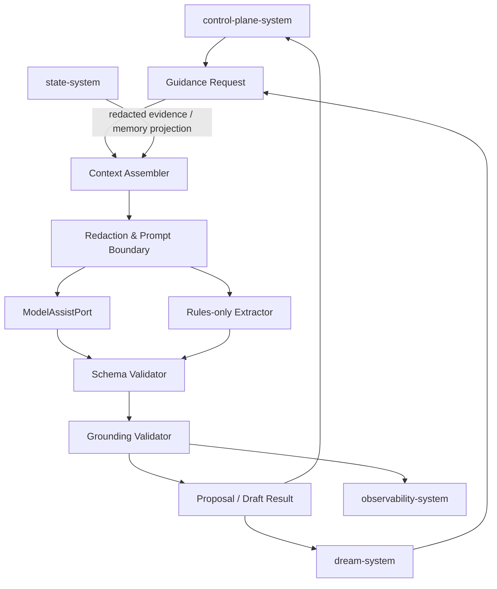
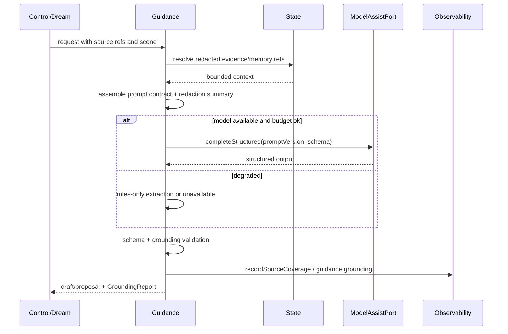
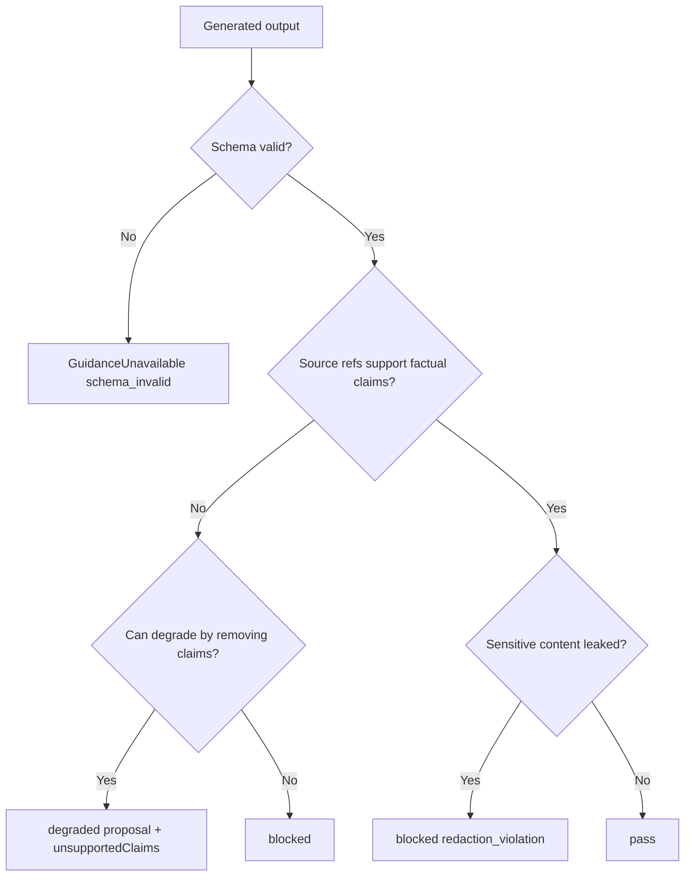
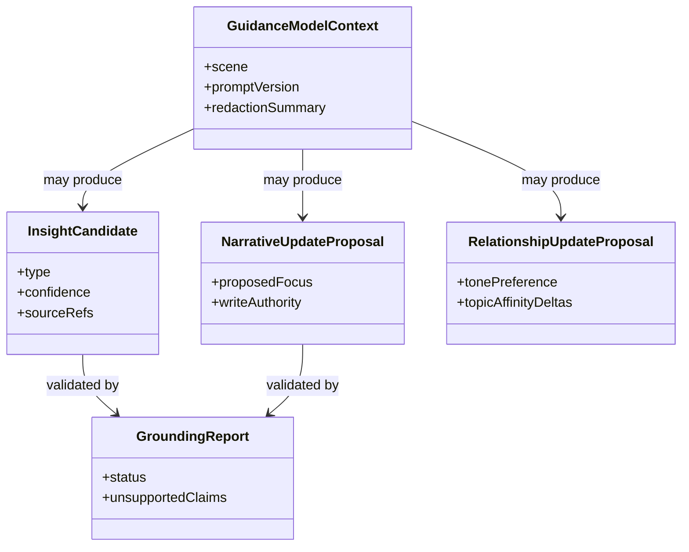

# Behavioral Guidance System 系统设计文档 (L0 — 导航层)

| 字段 | 值 |
| --- | --- |
| **System ID** | `behavioral-guidance-system` |
| **Project** | Second Nature |
| **Version** | 6.0 |
| **Status** | `Draft` |
| **Author** | GPT-5.5 / Nyx |
| **Date** | 2026-05-15 |
| **L1 Detail** | N/A — 未触发 R1-R5；prompt 模板全文如需固化再拆 `behavioral-guidance-system.detail.md` |

> [!IMPORTANT]
> 本文件定义 v6 guidance 的软层边界：生成 source-backed outreach draft、insight candidate、narrative update proposal 与 relationship update proposal。guidance 只生产结构化 proposal 和 grounding report，不写 canonical state，不决定行动，不投递消息。

---

## 目录 (Table of Contents)

| § | 章节 | 关键内容 |
| :---: | --- | --- |
| 1 | [概览](#1-概览-overview) | 目的、边界、职责 |
| 2 | [目标与非目标](#2-目标与非目标-goals--non-goals) | Goals / Non-Goals |
| 3 | [背景与上下文](#3-背景与上下文-background--context) | v5 grounding、v6 proposal |
| 4 | [系统架构](#4-系统架构-architecture) | guidance assembly、model port、grounding |
| 5 | [接口设计](#5-接口设计-interface-design) | 操作契约、跨系统端口 |
| 6 | [数据模型](#6-数据模型-data-model) | EvidencePack、Proposal、Grounding |
| 7 | [技术选型](#7-技术选型-technology-stack) | TS + ModelAssistPort |
| 8 | [Trade-offs](#8-trade-offs--alternatives-权衡与备选方案) | ADR 引用与取舍 |
| 9 | [安全性考虑](#9-安全性考虑-security-considerations) | prompt injection、PII、unsupported claims |
| 10 | [性能考虑](#10-性能考虑-performance-considerations) | context budget、model timeout |
| 11 | [测试策略](#11-测试策略-testing-strategy) | Contract matrix |
| 12 | [部署与运维](#12-部署与运维-deployment--operations) | prompt version、fallback |
| 13 | [未来考虑](#13-未来考虑-future-considerations) | eval/prompt optimization |
| 14 | [附录](#14-appendix-附录) | 术语与参考 |

---

## 1. 概览 (Overview)

### 1.1 System Purpose (系统目的)

`behavioral-guidance-system` 是 Second Nature 的表达、洞察提取与 proposal 生成层。v6 让它从 v5 outreach/Quiet guidance 扩展为 Dream 和 Agent Self Layer 的模型辅助入口：它可以提炼 insight、提出 narrative/relationship 更新、生成有来由的 outreach draft，但所有输出都必须被 source refs 和 grounding report 约束。

### 1.2 System Boundary (系统边界)

- **输入 (Input)**: evidence refs、chronicle refs、accepted memory projection、NarrativeState、RelationshipMemory、AgentGoal summary、OutreachJudgment、redaction policy、model budget context。
- **输出 (Output)**: `NarrativeOutreachDraft`、`InsightCandidate[]`、`NarrativeUpdateProposal`、`RelationshipUpdateProposal`、`GroundingReport`、`GuidanceUnavailable`。
- **依赖系统 (Dependencies)**: `state-system`, `observability-system`, LLM Provider via `ModelAssistPort`。
- **被依赖系统 (Dependents)**: `control-plane-system`, `dream-system`, `cli-system` explain/read surface。

### 1.3 System Responsibilities (系统职责)

**负责**:
- 装配 bounded evidence pack，不全量注入 workspace/memory。
- 生成 source-backed friend-like outreach draft。
- 为 Dream 提供 insight extraction、narrative update proposal、relationship update proposal。
- 对所有模型输出执行 schema validation、grounding validation、unsupported claim 拦截。
- 管理 prompt contract/version，向 observability 提供 promptVersion 与 redaction summary。

**不负责**:
- 不决定 heartbeat 是否行动或 outreach 是否发送。
- 不写 NarrativeState、RelationshipMemory、AgentGoal 或 MemoryStore。
- 不选择 connector route，不执行平台动作。
- 不读取凭据、token、私信全文或未脱敏敏感内容。
- 不把 LLM 输出当作事实真相。

---

## 2. 目标与非目标 (Goals & Non-Goals)

### 2.1 Goals

- **[G1]**: `draftNarrativeOutreach()` 生成“发生了什么、为什么 owner 可能感兴趣、source refs”的草稿。[REQ-005]
- **[G2]**: `extractInsightCandidates()` 从 evidence/chronicle/memory projection 中提炼结构化 insight。[REQ-001]
- **[G3]**: `draftNarrativeUpdate()` 产生 source-backed NarrativeState update proposal。[REQ-002]
- **[G4]**: `draftRelationshipUpdate()` 产生 tone/timing/topic 的关系更新 proposal。[REQ-003]
- **[G5]**: 所有输出带 `GroundingReport`、`promptVersion`、`unsupportedClaims` 和 redaction summary。[REQ-006]

### 2.2 Non-Goals

- **[NG1]**: 不做 long-term memory lifecycle 接纳。
- **[NG2]**: 不把 relationship memory 扩展为 owner 社交图。
- **[NG3]**: 不在 v6 P0 引入 prompt optimization 框架。
- **[NG4]**: 不自动改写 SOUL/USER/IDENTITY/MEMORY。
- **[NG5]**: 不承诺无模型时也能产出高质量 insight；可 rules-only 降级。

---

## 3. 背景与上下文 (Background & Context)

### 3.1 Why This System? (为什么需要这个系统？)

v6 的 Dream 和 Agent Self Layer 需要“理解”的软能力，但这层如果没有边界，很容易变成会写故事的越权层。guidance 的正确职责是生成可验证 proposal，让 control-plane、Dream 和 state lifecycle 决定是否使用。

**关联 PRD需求**: [REQ-001], [REQ-002], [REQ-003], [REQ-005], [REQ-006]

### 3.2 Current State (现状分析)

v5 guidance 已有 EvidencePack、InterestBasis、GroundingReport、deliveryWording。v6 新增的不是“更大 prompt”，而是更多结构化输出类型和 ModelAssistPort。

### 3.3 Constraints (约束条件)

- **技术约束**: TypeScript + Node.js；模型供应商通过端口注入，不硬编码。
- **预算约束**: Dream LLM 月度预算默认 $20，单次目标成本 <= $0.5，由配置覆盖。
- **隐私约束**: 凭据、PII、私信正文默认脱敏或 contentRef。
- **事实约束**: 所有 factual claim 必须可追溯 source refs。
- **运行约束**: model unavailable 必须返回 `GuidanceUnavailable` 或 rules-only result。

### 3.4 调研结论摘要

完整研究见 [_research/behavioral-guidance-system-research.md](./_research/behavioral-guidance-system-research.md)。结论是：guidance 要 schema-first、proposal-only、grounding-first。

---

## 4. 系统架构 (Architecture)

### 4.1 Architecture Diagram (架构图)



### 4.2 Core Components (核心组件)

| Component | Responsibility | Notes |
| --- | --- | --- |
| `ContextAssembler` | 构造 bounded evidence/chronicle/memory context | 外部内容作为 data |
| `EvidencePackBuilder` | 解析 source refs 并脱敏 | 不扫全量 workspace |
| `ModelAssistPort` | 调用配置模型并执行 timeout/budget | no hardcoded provider |
| `RulesOnlyExtractor` | 无模型或预算不足时降级 | insight 可为空 |
| `SchemaValidator` | 校验 proposal/draft 结构 | bad output -> unavailable |
| `GroundingValidator` | 检查 source coverage 和 unsupported claims | pass/degraded/blocked |
| `PromptContractRegistry` | 管理 promptName/promptVersion | trace 可回看 |

### 4.3 Guidance Data Flow



### 4.4 Proposal Admission Rule



---

## 5. 接口设计 (Interface Design)

### 5.1 操作契约表 (Operation Contracts)

| 操作 | 需求 | 前置条件 | 消耗/输入 | 产出/副作用 | 实现细节 |
| --- | :---: | --- | --- | --- | :---: |
| `draftNarrativeOutreach(request)` | [REQ-005] | control-plane judgment allow 或 fallback candidate | evidence; narrative; relationship; interest | draft + grounding | L0 |
| `extractInsightCandidates(request)` | [REQ-001] | redacted evidence/chronicle available | evidence pack; memory projection | insight candidates | L0 |
| `draftNarrativeUpdate(request)` | [REQ-002] | source refs or insufficient reason | evidence; prior narrative; insights | narrative proposal | L0 |
| `draftRelationshipUpdate(request)` | [REQ-003] | chronicle refs available | owner reply/no reply; current relationship | relationship proposal | L0 |
| `buildEvidencePack(refs)` | [REQ-001], [REQ-005] | state read available | source refs; redaction policy | bounded evidence pack | L0 |
| `validateGrounding(output)` | [REQ-002], [REQ-005] | output schema valid | output; evidence pack | grounding report | L0 |
| `completeStructuredWithModel(input)` | [REQ-001] | budget/model configured | prompt contract; schema | structured model result | L0 |
| `recordGuidanceGrounding(event)` | [REQ-006] | validation finished | source coverage; prompt version | observability event | L0 |

### 5.2 跨系统接口协议 (Cross-System Interface)

```ts
export interface GuidancePort {
  draftNarrativeOutreach(request: NarrativeOutreachDraftRequest): Promise<NarrativeOutreachDraftResult>;
  extractInsightCandidates(request: InsightExtractionRequest): Promise<InsightExtractionResult>;
  draftNarrativeUpdate(request: NarrativeUpdateDraftRequest): Promise<NarrativeUpdateProposalResult>;
  draftRelationshipUpdate(request: RelationshipUpdateDraftRequest): Promise<RelationshipUpdateProposalResult>;
}

export interface ModelAssistPort {
  completeStructured<T>(input: StructuredModelRequest<T>): Promise<StructuredModelResult<T>>;
}

export interface GuidanceStateReadPort {
  resolveEvidencePack(refs: SourceRef[], policy: RedactionPolicy): Promise<EvidencePack>;
  loadAcceptedMemoryProjection(): Promise<AcceptedMemoryProjection | null>;
  loadRelationshipMemory(): Promise<RelationshipMemory | null>;
}
```

### 5.3 Output Ownership

| Output | Producer | Accepted by | Canonical write owner |
| --- | --- | --- | --- |
| `NarrativeOutreachDraft` | guidance | control-plane | none; delivery/fallback owned by control-plane |
| `InsightCandidate` | guidance | dream-system | MemoryStore lifecycle |
| `NarrativeUpdateProposal` | guidance | dream/control-plane | state-system after validation |
| `RelationshipUpdateProposal` | guidance | dream-system | state-system after validation |
| `GroundingReport` | guidance | observability | observability-system |

---

## 6. 数据模型 (Data Model)

### 6.1 核心实体 (Core Entities)

```ts
export interface GuidanceModelContext {
  contextId: string;
  scene: "outreach" | "dream_insight" | "narrative_update" | "relationship_update";
  promptName: string;
  promptVersion: string;
  evidencePack: EvidencePack;
  narrative?: NarrativeState;
  relationship?: RelationshipMemory;
  acceptedGoals: AgentGoal[];
  redactionSummary: RedactionSummary;
}

export interface InsightCandidate {
  insightId: string;
  type: "pattern" | "learning" | "observation";
  description: string;
  confidence: number;
  sourceRefs: SourceRef[];
  unsupportedClaims: string[];
}

export interface NarrativeUpdateProposal {
  proposedFocus: string;
  proposedProgress: string[];
  proposedNextIntent: string;
  confidence: number;
  sourceRefs: SourceRef[];
  unsupportedClaims: string[];
  writeAuthority: "none";
}

export interface RelationshipUpdateProposal {
  tonePreference?: "casual" | "direct" | "quiet" | "unknown";
  replyDelayObservation?: string;
  topicAffinityDeltas: TopicAffinityDelta[];
  noReplySignal?: boolean;
  sourceRefs: SourceRef[];
  unsupportedClaims: string[];
}

export interface GroundingReport {
  status: "pass" | "degraded" | "blocked";
  usedSourceRefs: SourceRef[];
  unsupportedClaims: string[];
  guardViolations: string[];
  promptVersion: string;
}
```

### 6.2 实体关系图 (Entity Relationship)



### 6.3 数据流向 (Data Flow Direction)

- State provides redacted inputs and accepted projections.
- Guidance returns transient outputs.
- Dream/control-plane decide whether to use outputs.
- Observability records grounding and prompt version.
- State lifecycle validates before any canonical update.

---

## 7. 技术选型 (Technology Stack)

| Domain | Choice | Rationale |
| --- | --- | --- |
| Runtime | TypeScript + Node.js | 继承 ADR-001 |
| Model access | `ModelAssistPort` | 供应商/模型/密钥不硬编码 |
| Validation | schema parser such as zod/equivalent | 结构化输出必须强校验 |
| Prompt storage | versioned prompt contracts | audit/debug 可回看 |
| Redaction | state/observability redaction policy | 不让敏感内容进入模型 |
| Fallback | rules-only extractor | budget/model unavailable 可运行 |

---

## 8. Trade-offs & Alternatives (权衡与备选方案)

### 8.1 主技术栈 - 引用 ADR

> **决策来源**: [ADR-001: v6 技术栈继承与增量决策](../03_ADR/ADR_001_TECH_STACK.md)
>
> 本系统继承 TypeScript + Node.js；模型接入通过端口抽象，不硬编码供应商 SDK。

### 8.2 Agent Self Layer - 引用 ADR

> **决策来源**: [ADR-003: Agent Self Layer 边界与职责划分](../03_ADR/ADR_003_AGENT_SELF_LAYER.md)
>
> guidance 提供 insight extraction 和 narrative draft，但不拥有决策权或状态真相。

### 8.3 Dream 机制 - 引用 ADR

> **决策来源**: [ADR-004: Dream 异步记忆整理机制](../03_ADR/ADR_004_DREAM_MECHANISM.md)
>
> 本系统支持 Dream 的 LLM 层，但输出必须经过 Dream/state lifecycle 接纳。

### 8.4 Schema-first proposal vs free text

**Option A: schema-first proposal (Selected)**
- 优点: 可验证、可审计、可测试。
- 缺点: 初期 prompt 和 parser 更严格。

**Option B: free text output**
- 优点: 写起来快。
- 缺点: narrative/insight/relationship 无法稳定接纳。

**Decision**: 选择 schema-first。自由文本只适合最终表达，不适合跨系统契约。

### 8.5 Shared ModelAssistPort vs direct provider calls

**Option A: shared port (Selected)**
- 优点: 预算、脱敏、timeout、mock 测试统一。
- 缺点: 多一层接口。

**Option B: each module calls provider**
- 优点: 局部实现快。
- 缺点: 成本和安全边界会散。

**Decision**: 选择 shared port。

---

## 9. 安全性考虑 (Security Considerations)

| Risk | Severity | Mitigation |
| --- | :---: | --- |
| Platform content prompt injection | High | external content marked data; no instruction override |
| PII/credential sent to model | High | redaction before ModelAssistPort |
| unsupported narrative claim | High | grounding blocked/degraded |
| guidance writes state indirectly | High | proposals carry `writeAuthority: "none"` |
| relationship over-inference | Medium | confidence/sourceRefs required; no single-sample certainty |
| prompt drift | Medium | promptVersion traced |
| model cost runaway | Medium | budget context + timeout + rules-only fallback |

---

## 10. 性能考虑 (Performance Considerations)

| 指标 | 目标 | 策略 |
| --- | --- | --- |
| context assembly | P95 < 150ms | bounded refs |
| rules-only extraction | P95 < 500ms | no model |
| model timeout | configurable, default bounded by caller | async Dream can wait longer than heartbeat |
| evidence facts | default <= 12 | prevent context bloat |
| persona snippets | default <= 3 | privacy/token control |

Heartbeat synchronous path should avoid long model calls unless explicitly selected and timeout-bounded.

---

## 11. 测试策略 (Testing Strategy)

### 11.1 Test Layers

| 类型 | 覆盖范围 |
| --- | --- |
| Unit | schema validation、grounding、redaction summary、rules-only fallback |
| Contract | GuidancePort outputs consumed by Dream/control-plane |
| Integration | evidence -> insight/narrative proposal -> trace |
| Security | prompt injection fixture、PII/credential redaction |
| Evaluation | outreach tone fixture、unsupported claim fixture |

### 11.2 Contract Verification Matrix

| 契约 | Producer | Consumer | 正常态验证 | 失败态验证 | 回归责任 |
| --- | --- | --- | --- | --- | --- |
| `NarrativeOutreachDraft` | guidance | control-plane | contains why/what/source refs | no source blocked | T6.1.1 |
| `InsightCandidate` | guidance | dream-system | type/confidence/source refs present | bad schema unavailable | T7.1.3 |
| `NarrativeUpdateProposal` | guidance | dream/control-plane | source-backed proposal | unsupported claim degraded | T7.1.4, T2.1.5 |
| `RelationshipUpdateProposal` | guidance | dream-system | tone/timing/topic deltas | no reply handled honestly | T7.1.5 |
| `GroundingReport` | guidance | observability | pass/degraded/blocked visible | sensitive leak blocked | T5.1.2 |
| `ModelAssistPort` | runtime config | guidance/dream | mockable structured output | timeout/budget fallback | T7.1.3 |

---

## 12. 部署与运维 (Deployment & Operations)

- Runs as in-process `src/guidance` module inside packaged runtime.
- Model provider config comes from environment/config ports; no key or model is hardcoded.
- Prompt contracts are versioned and included in release artifact.
- Model unavailable returns typed unavailable result; caller chooses silent/degraded/fallback.
- Observability receives promptVersion and grounding status, not raw sensitive prompt.

---

## 13. 未来考虑 (Future Considerations)

- Add prompt/eval harness after first deterministic fixtures exist.
- Add span-level grounding if claim-level guard is not enough.
- Add multiple style profiles only after relationship memory contract is stable.
- Add prompt optimization framework only with separate ADR.

---

## 14. Appendix (附录)

### 14.1 Glossary

- **Proposal**: guidance 生成、等待其他系统验证和接纳的结构化建议。
- **GroundingReport**: 输出中哪些 claim 有来源、哪些被拦截的证明。
- **ModelAssistPort**: 统一模型调用端口，封装预算、脱敏、timeout 和 mock。
- **PromptContract**: 带版本的 prompt/schema 组合。

### 14.2 References

- [_research/behavioral-guidance-system-research.md](./_research/behavioral-guidance-system-research.md)
- [ADR-001: v6 技术栈继承与增量决策](../03_ADR/ADR_001_TECH_STACK.md)
- [ADR-003: Agent Self Layer 边界与职责划分](../03_ADR/ADR_003_AGENT_SELF_LAYER.md)
- [ADR-004: Dream 异步记忆整理机制](../03_ADR/ADR_004_DREAM_MECHANISM.md)
- [Dream System Design](./dream-system.md)
- [State System Design](./state-system.md)
- [Observability System Design](./observability-system.md)
- [v5 Behavioral Guidance Design](../../v5/04_SYSTEM_DESIGN/behavioral-guidance-system.md)

