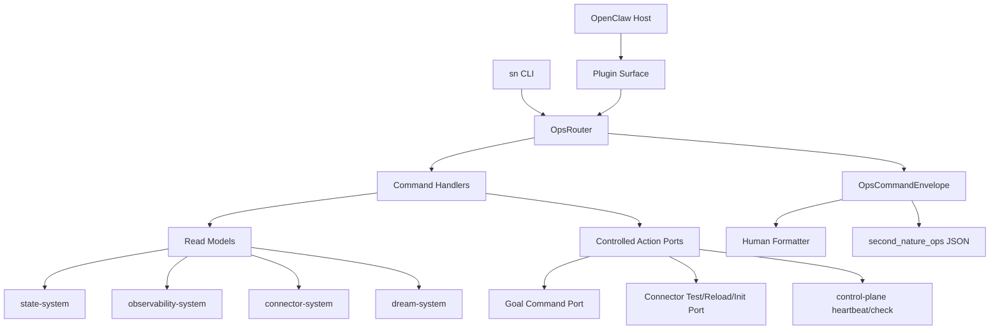
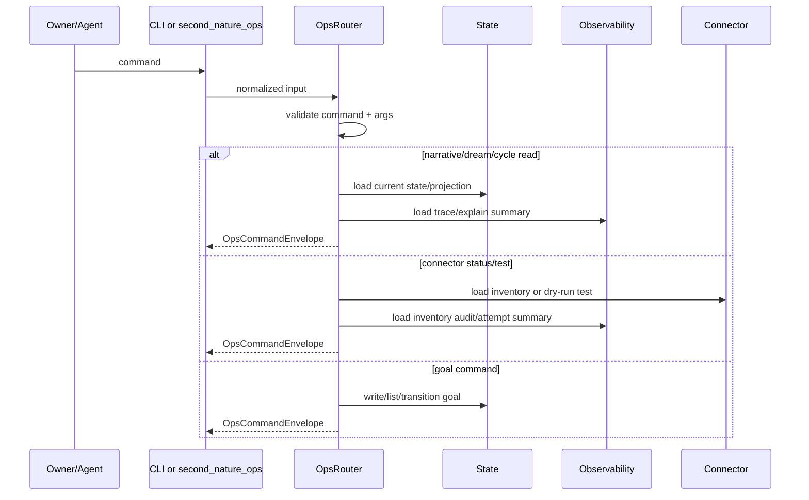
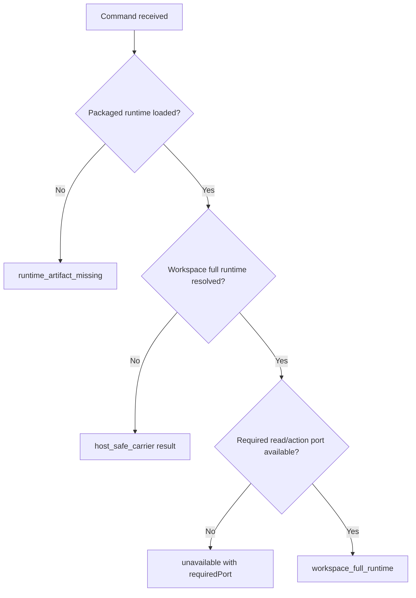
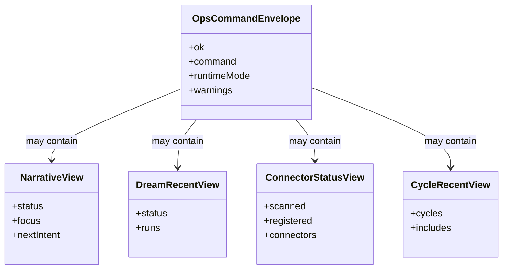

# Agent-facing Ops Surface System 系统设计文档 (L0 — 导航层)

| 字段 | 值 |
| --- | --- |
| **System ID** | `cli-system` |
| **Project** | Second Nature |
| **Version** | 6.0 |
| **Status** | `Draft` |
| **Author** | GPT-5.5 / Nyx |
| **Date** | 2026-05-15 |
| **L1 Detail** | N/A — 未触发 R1-R5；JSON schema 示例如需展开再拆 `cli-system.detail.md` |

> [!IMPORTANT]
> 本文件定义 v6 agent-facing ops surface：`narrative`、`goal`、`dream:recent`、`connector:*`、`cycle:recent` 与 `second_nature_ops` JSON 契约。cli-system 只做可见性、受控命令和 host-safe carrier，不拥有 planning、Dream、connector 或 state 真相。

---

## 目录 (Table of Contents)

| § | 章节 | 关键内容 |
| :---: | --- | --- |
| 1 | [概览](#1-概览-overview) | 目的、边界、职责 |
| 2 | [目标与非目标](#2-目标与非目标-goals--non-goals) | Goals / Non-Goals |
| 3 | [背景与上下文](#3-背景与上下文-background--context) | v5 ops surface、v6 commands |
| 4 | [系统架构](#4-系统架构-architecture) | command/tool/router/read model |
| 5 | [接口设计](#5-接口设计-interface-design) | 操作契约、JSON envelope |
| 6 | [数据模型](#6-数据模型-data-model) | Ops result、views、status |
| 7 | [技术选型](#7-技术选型-technology-stack) | TS / OpenClaw / read models |
| 8 | [Trade-offs](#8-trade-offs--alternatives-权衡与备选方案) | ADR 引用与取舍 |
| 9 | [安全性考虑](#9-安全性考虑-security-considerations) | dry-run、redaction、carrier truth |
| 10 | [性能考虑](#10-性能考虑-performance-considerations) | startup、status、read model |
| 11 | [测试策略](#11-测试策略-testing-strategy) | Contract matrix |
| 12 | [部署与运维](#12-部署与运维-deployment--operations) | packaging、bridge、fallback |
| 13 | [未来考虑](#13-未来考虑-future-considerations) | UI/dashboard |
| 14 | [附录](#14-appendix-附录) | 术语与参考 |

---

## 1. 概览 (Overview)

### 1.1 System Purpose (系统目的)

`cli-system` 是 Second Nature 暴露给 owner、agent 与 OpenClaw 的操作表面。v6 新增 Narrative、Goal、Dream、Connector Ecosystem 与 recent cycle 可见性；CLI 和 `second_nature_ops` 必须让人看见 SN 最近做了什么、为什么这么做、哪些 connector 可用、Dream 有何产出。

### 1.2 System Boundary (系统边界)

- **输入 (Input)**: CLI args、`second_nature_ops` tool input、OpenClaw plugin registration、owner goal command、connector ops command、read model query。
- **输出 (Output)**: structured JSON result、人类 formatter 输出、goal write command、connector dry-run/reload/init command、narrative/dream/connector/cycle read views、host-safe unavailable result。
- **依赖系统 (Dependencies)**: `state-system`, `observability-system`, `control-plane-system`, `connector-system`, `dream-system`。
- **被依赖系统 (Dependents)**: OpenClaw host, owner, agent, release/smoke workflows。

### 1.3 System Responsibilities (系统职责)

**负责**:
- 注册 OpenClaw command/tool/service surface。
- 维护 CLI 与 `second_nature_ops` 的同构 command router。
- 提供 JSON-first `OpsCommandEnvelope`，明确 `runtimeMode`、`ok`、`data`、`warnings`、`sourceRefs`。
- 实现 `narrative`、`goal`、`dream:recent`、`connector:status`、`connector:test`、`connector init`、`cycle:recent` 命令契约。
- host-safe 模式下返回明确 unavailable/carrier result，不伪装 full runtime。
- 对敏感字段做 redaction，不展示 raw prompt、token、credential、私信正文。

**不负责**:
- 不决定 heartbeat intent、goal priority 或 outreach allow/deny。
- 不保存 canonical state 或 audit truth。
- 不执行非 dry-run connector 副作用，除非 command 显式允许且通过 trust policy。
- 不解析模型输出或 Dream lifecycle。
- 不把 inventory failure 当作 connector execution failure。

---

## 2. 目标与非目标 (Goals & Non-Goals)

### 2.1 Goals

- **[G1]**: `sn narrative` / `second_nature_ops narrative` 展示 current NarrativeState 与 NarrativeTrace summary。[REQ-002], [REQ-006]
- **[G2]**: `sn dream:recent` 展示 DreamTrace、insight count、lifecycle 和 fallback reason。[REQ-001], [REQ-006]
- **[G3]**: `sn connector:status` 展示 connector inventory、trust/executable/conflict；`connector:test` 默认 dry-run。[REQ-004], [REQ-006]
- **[G4]**: `goal` 命令支持 owner-set/list/accept/reject，并清楚区分 proposal 与 accepted。[REQ-002]
- **[G5]**: `cycle:recent` 聚合 heartbeat decision、narrative update、Dream trigger 和 delivery/fallback。[REQ-006]

### 2.2 Non-Goals

- **[NG1]**: 不做图形 dashboard。
- **[NG2]**: 不在 CLI 中实现 control-plane planner。
- **[NG3]**: 不把 `connector:test` 默认做真实写操作。
- **[NG4]**: 不暴露未脱敏 audit bundle。
- **[NG5]**: 不通过全仓源码依赖逃避 packaged runtime 边界。

---

## 3. 背景与上下文 (Background & Context)

### 3.1 Why This System? (为什么需要这个系统？)

PRD [REQ-006] 要求 owner 能看到 SN 最近做了什么、在想什么、有什么发现。没有 ops surface，Dream 和 Narrative 都只是在后台写文件；用户感受不到存在感。

**关联 PRD需求**: [REQ-001], [REQ-002], [REQ-004], [REQ-006]

### 3.2 Current State (现状分析)

v5 已有 `second_nature_ops`、status/explain/audit/fallback/capability_probe、workspace bridge 和 packaged runtime。v6 应增量扩展命令，而不是开新 CLI。

### 3.3 Constraints (约束条件)

- **技术约束**: TypeScript + Node.js + OpenClaw native plugin。
- **输出约束**: tool path JSON-first；human formatter 不改变底层语义。
- **运行约束**: host-safe carrier 可能无法访问 workspace full runtime。
- **安全约束**: connector custom adapter 必须 pending trust 或 owner allowlist。
- **隐私约束**: status/explain 不展示 raw sensitive payload。

### 3.4 调研结论摘要

完整研究见 [_research/cli-system-research.md](./_research/cli-system-research.md)。结论是：扩展现有 OpsRouter，所有新命令走同一 JSON envelope；connector status 读 inventory，connector test 默认 dry-run。

---

## 4. 系统架构 (Architecture)

### 4.1 Architecture Diagram (架构图)



### 4.2 Core Components (核心组件)

| Component | Responsibility | Notes |
| --- | --- | --- |
| `PluginSurfaceRegistrar` | 注册 command/tool/service | package runtime boundary |
| `OpsRouter` | CLI/tool 同构路由 | stable command names |
| `OpsEnvelopeBuilder` | 构造 JSON-first result | includes runtimeMode |
| `NarrativeReadModel` | state + NarrativeTrace summary | for `narrative` |
| `DreamRecentReadModel` | DreamTrace + MemoryStore summary | for `dream:recent` |
| `ConnectorStatusReadModel` | inventory + trust/executable/conflict | not attempt-only |
| `GoalCommandHandler` | owner-set/list/accept/reject | writes through state port |
| `ConnectorOpsHandler` | status/test/init/reload | test dry-run by default |
| `CycleRecentReadModel` | recent decision/narrative/dream/delivery | human perceivable history |

### 4.3 Command Data Flow



### 4.4 Runtime Mode Decision



---

## 5. 接口设计 (Interface Design)

### 5.1 操作契约表 (Operation Contracts)

| 操作 | 需求 | 前置条件 | 消耗/输入 | 产出/副作用 | 实现细节 |
| --- | :---: | --- | --- | --- | :---: |
| `executeOpsCommand(input)` | [REQ-006] | command normalized | command; args; runtime context | `OpsCommandEnvelope` | L0 |
| `showNarrative(query)` | [REQ-002], [REQ-006] | state/trace readable | scope; format | narrative view | L0 |
| `setGoal(command)` | [REQ-002] | owner command | goal description; criteria | AgentGoal write/transition | L0 |
| `showDreamRecent(query)` | [REQ-001], [REQ-006] | DreamTrace readable | limit/window | dream recent view | L0 |
| `showConnectorStatus(query)` | [REQ-004], [REQ-006] | inventory readable | platform filter | inventory status view | L0 |
| `testConnector(command)` | [REQ-004] | connector registered; dry-run default | platformId; capability; dryRun | dry-run attempt result | L0 |
| `initConnector(command)` | [REQ-004] | workspace writable | platform/baseUrl/template | manifest/template files | L0 |
| `showCycleRecent(query)` | [REQ-006] | audit readable | limit/window | recent cycle summary | L0 |
| `formatHuman(envelope)` | [REQ-006] | envelope exists | output mode | readable text | L0 |

### 5.2 跨系统接口协议 (Cross-System Interface)

```ts
export interface CliOpsPort {
  executeOpsCommand(input: OpsCommandInput): Promise<OpsCommandEnvelope>;
}

export interface CliReadModelPort {
  loadNarrativeView(query: NarrativeViewQuery): Promise<NarrativeView>;
  loadDreamRecentView(query: DreamRecentQuery): Promise<DreamRecentView>;
  loadConnectorStatusView(query: ConnectorStatusQuery): Promise<ConnectorStatusView>;
  loadCycleRecentView(query: CycleRecentQuery): Promise<CycleRecentView>;
}

export interface CliActionPort {
  writeGoal(command: GoalCommand): Promise<GoalCommandResult>;
  testConnector(command: ConnectorTestCommand): Promise<ConnectorTestResult>;
  initConnector(command: ConnectorInitCommand): Promise<ConnectorInitResult>;
}
```

### 5.3 Command Set

| CLI | `second_nature_ops.command` | Semantics |
| --- | --- | --- |
| `sn narrative` | `narrative` | current narrative + trace summary |
| `sn goal set/list/accept/reject` | `goal` | owner-governed goal operations |
| `sn dream:recent` | `dream_recent` | DreamTrace + lifecycle summary |
| `sn connector:status` | `connector_status` | inventory/trust/conflict view |
| `sn connector:test` | `connector_test` | dry-run by default |
| `sn connector init` | `connector_init` | generate manifest/stubs |
| `sn cycle:recent` | `cycle_recent` | recent heartbeat/narrative/dream/delivery |
| `sn status` | `status` | aggregate summary |
| `sn explain` | `explain` | subject explain |

---

## 6. 数据模型 (Data Model)

### 6.1 核心实体 (Core Entities)

```ts
export interface OpsCommandEnvelope<T = unknown> {
  ok: boolean;
  command: string;
  runtimeMode: "host_safe_carrier" | "workspace_full_runtime" | "unavailable";
  data?: T;
  warnings: OpsWarning[];
  sourceRefs: SourceRef[];
  requiredAction?: string;
  generatedAt: string;
}

export interface NarrativeView {
  status: "active" | "awaiting_sources" | "nothing_yet" | "degraded";
  focus?: string;
  progress: string[];
  nextIntent?: string;
  sourceRefs: SourceRef[];
  latestTrace?: NarrativeTraceSummary;
}

export interface DreamRecentView {
  status: "has_runs" | "nothing_yet" | "degraded";
  runs: DreamRunSummary[];
}

export interface ConnectorStatusView {
  snapshotId?: string;
  scanned: number;
  registered: number;
  skipped: number;
  connectors: ConnectorInventoryRow[];
  conflicts: ConnectorConflict[];
}

export interface CycleRecentView {
  cycles: CycleSummary[];
  includes: ("decision" | "narrative" | "dream" | "delivery" | "connector")[];
}
```

### 6.2 实体关系图 (Entity Relationship)



### 6.3 数据流向 (Data Flow Direction)

- CLI read models consume state/observability/connector summaries.
- CLI action commands call typed ports; they do not mutate files directly except connector init through controlled generator.
- `second_nature_ops` returns envelope exactly; formatter is optional.
- Host-safe carrier result must preserve command schema but mark unavailable/full-runtime missing.

---

## 7. 技术选型 (Technology Stack)

| Domain | Choice | Rationale |
| --- | --- | --- |
| Runtime | TypeScript + Node.js | 继承 ADR-001 |
| Host surface | OpenClaw command/tool/service | v5 延续 |
| Output | JSON-first envelope | agent/tool 可解析 |
| Human formatter | thin formatting layer | 不改变 contract |
| Validation | schema parser | command args/result 稳定 |
| Connector init | template generator | 配合 ADR-002 |

---

## 8. Trade-offs & Alternatives (权衡与备选方案)

### 8.1 主技术栈 - 引用 ADR

> **决策来源**: [ADR-001: v6 技术栈继承与增量决策](../03_ADR/ADR_001_TECH_STACK.md)
>
> 本系统继续使用 TypeScript + Node.js + OpenClaw plugin runtime。

### 8.2 Connector Ecosystem - 引用 ADR

> **决策来源**: [ADR-002: Connector Ecosystem 动态注册模型](../03_ADR/ADR_002_CONNECTOR_ECOSYSTEM.md)
>
> `connector init/status/test` 遵循 dynamic manifest、trust policy、fail-closed conflict 和 dry-run safety。

### 8.3 Agent Self Layer - 引用 ADR

> **决策来源**: [ADR-003: Agent Self Layer 边界与职责划分](../03_ADR/ADR_003_AGENT_SELF_LAYER.md)
>
> CLI 可展示/设置 owner goal 和 narrative read model，但不拥有 goal priority 或 narrative 写入决策。

### 8.4 JSON-first vs text-first

**Option A: JSON-first envelope (Selected)**
- 优点: tool 稳定、测试稳定、host-safe/unavailable 语义清楚。
- 缺点: 需要 formatter。

**Option B: text-first CLI**
- 优点: 初看舒服。
- 缺点: agent/tool 解析不稳，容易把 degraded 写丢。

**Decision**: JSON-first 是底层契约。

### 8.5 Inventory-based status vs attempt-based status

**Option A: connector inventory read model (Selected)**
- 优点: 能解释 pending trust、conflict、invalid manifest。
- 缺点: 需要 ConnectorInventoryAudit 任务承接。

**Option B: only last attempt**
- 优点: 数据少。
- 缺点: 未执行 connector 的注册问题不可见。

**Decision**: status 看 inventory，test 看 attempt。别混，这里混了后面 debug 会很难受。

---

## 9. 安全性考虑 (Security Considerations)

| Risk | Severity | Mitigation |
| --- | :---: | --- |
| host-safe carrier 被误判 full runtime | High | `runtimeMode` required |
| connector:test 触发副作用 | High | dry-run default; explicit allow required |
| pending trust connector 显示 executable | High | inventory row has trust/executable |
| goal proposal 被误认 accepted | High | goal command displays status/origin/acceptedBy |
| raw prompt/token/PII exposed | High | read model redaction only |
| connector init 覆盖用户文件 | Medium | no overwrite unless explicit flag |
| command injection | Medium | strict schema validation |

---

## 10. 性能考虑 (Performance Considerations)

| 指标 | 目标 | 策略 |
| --- | --- | --- |
| plugin registration | P95 < 500ms | lazy read models |
| common read command | P95 < 1s | indexed explain/state queries |
| connector:status | P95 < 1s for 50 connectors | inventory snapshot |
| dream:recent | P95 < 1s | DreamTrace summary |
| connector:test | bounded by connector dry-run timeout | explicit timeout |

CLI startup should not run connector reload or Dream scan implicitly.

---

## 11. 测试策略 (Testing Strategy)

### 11.1 Test Layers

| 类型 | 覆盖范围 |
| --- | --- |
| Unit | command parsing、envelope builder、formatter、arg validation |
| Contract | CLI/tool schema parity |
| Integration | read model fixtures for narrative/dream/connector/cycle |
| Security | redaction, dry-run, no overwrite |
| Host smoke | OpenClaw tool visibility and workspace bridge |

### 11.2 Contract Verification Matrix

| 契约 | Producer | Consumer | 正常态验证 | 失败态验证 | 回归责任 |
| --- | --- | --- | --- | --- | --- |
| `OpsCommandEnvelope` | cli-system | agent/OpenClaw/tests | ok/data/warnings present | unavailable mode explicit | all T1 tasks |
| `narrative` command | cli-system | owner/agent | focus/progress/next intent visible | nothing_yet honest | T1.2.1, T5.1.2 |
| `dream_recent` command | cli-system | owner/agent | trace/lifecycle visible | no run returns nothing_yet | T1.2.2, T5.1.1 |
| `connector_status` command | cli-system | owner/agent | trust/conflict/executable visible | invalid manifest visible | T1.2.3, T5.1.3 |
| `connector_test` command | cli-system | connector-system | dry-run result visible | pending trust denied | T1.2.3 |
| `goal` command | cli-system | state/control-plane | owner-set accepted/listed | proposal not accepted by default | T4.1.4 |
| `cycle_recent` command | cli-system | owner/agent | decision/narrative/dream summary visible | missing traces degraded | INT-S4 |

---

## 12. 部署与运维 (Deployment & Operations)

- Plugin entry and OpsRouter ship inside packaged runtime.
- CLI and OpenClaw tool share command handler and envelope schema.
- Workspace full runtime resolution follows v5 bridge rules; failure returns host-safe envelope.
- Connector init writes only under `.second-nature/connectors/{platformId}/` and refuses overwrite by default.
- Redacted explain bundle may be exported by existing observability ports; raw audit is not printed by default.

---

## 13. 未来考虑 (Future Considerations)

- Add dashboard only after CLI read models stabilize.
- Add interactive connector trust approval flow.
- Add richer `cycle:recent` narrative formatter.
- Add shell completion after command set stops moving.

---

## 14. Appendix (附录)

### 14.1 Glossary

- **OpsCommandEnvelope**: CLI/tool 的稳定 JSON 返回外壳。
- **RuntimeMode**: host-safe carrier、full workspace runtime 或 unavailable。
- **ConnectorInventory**: connector 注册与 trust 状态，不等同执行尝试。
- **CycleRecent**: 最近 heartbeat、narrative、Dream、delivery 的聚合视图。

### 14.2 References

- [_research/cli-system-research.md](./_research/cli-system-research.md)
- [ADR-001: v6 技术栈继承与增量决策](../03_ADR/ADR_001_TECH_STACK.md)
- [ADR-002: Connector Ecosystem 动态注册模型](../03_ADR/ADR_002_CONNECTOR_ECOSYSTEM.md)
- [ADR-003: Agent Self Layer 边界与职责划分](../03_ADR/ADR_003_AGENT_SELF_LAYER.md)
- [State System Design](./state-system.md)
- [Observability System Design](./observability-system.md)
- [Connector System Design](./connector-system.md)
- [Dream System Design](./dream-system.md)
- [v5 CLI System Design](../../v5/04_SYSTEM_DESIGN/cli-system.md)

