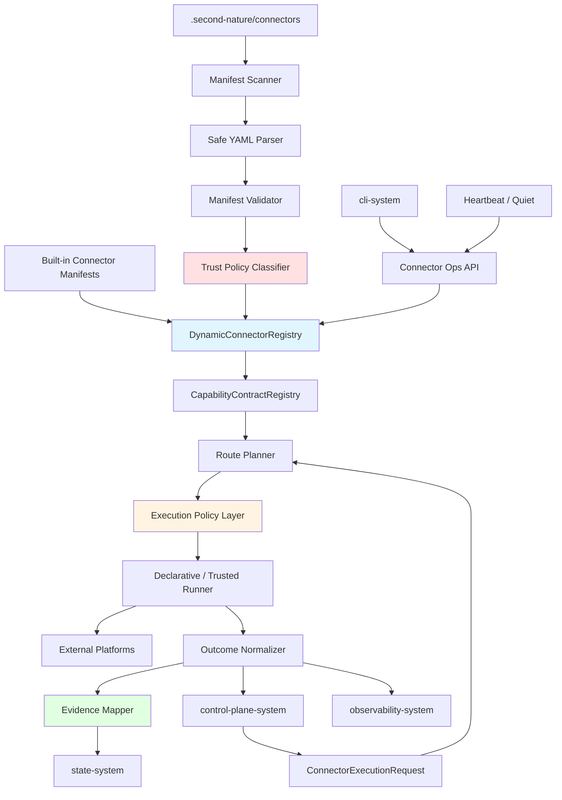
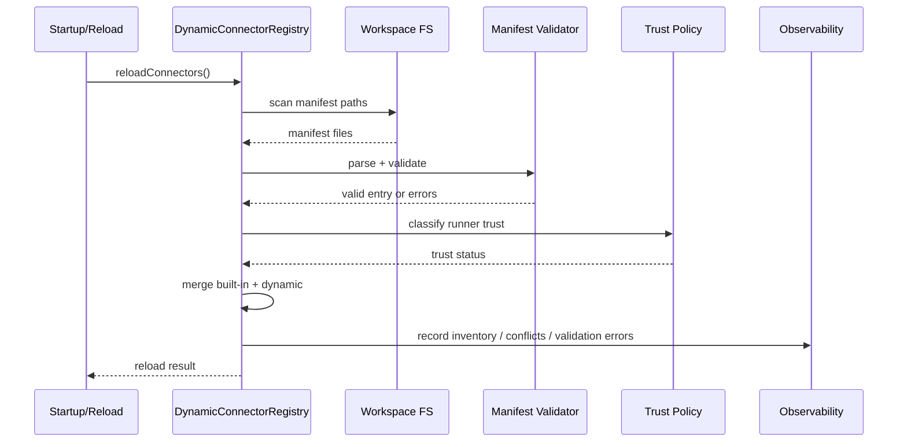
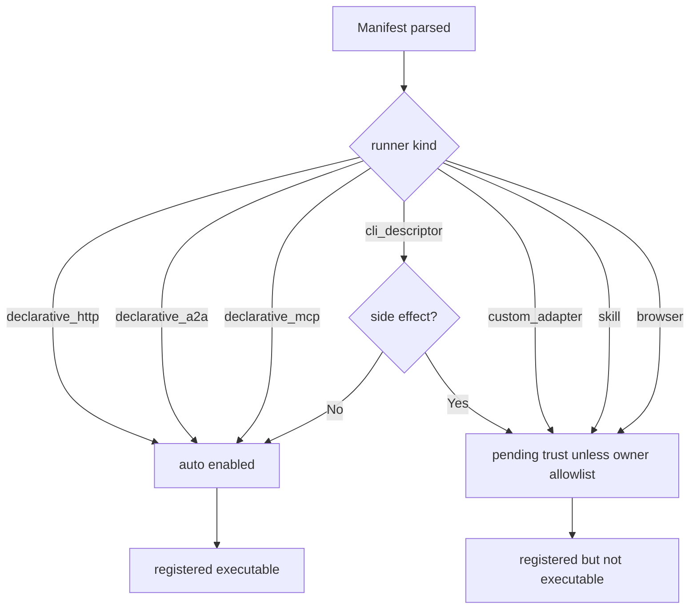
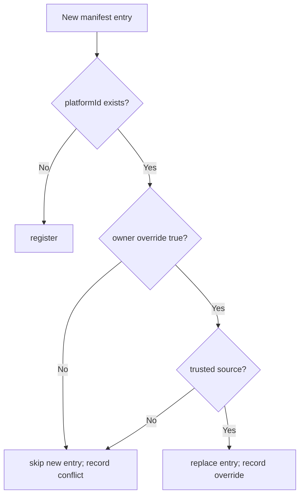
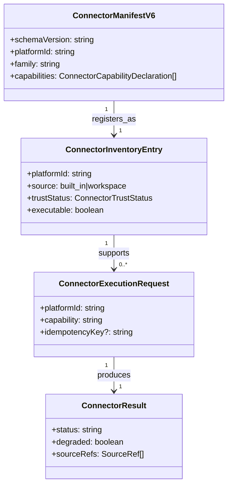

# Connector System 系统设计文档 (L0 — 导航层)

| 字段 | 值 |
| --- | --- |
| **System ID** | `connector-system` |
| **Project** | Second Nature |
| **Version** | 6.0 |
| **Status** | `Draft` |
| **Author** | GPT-5.5 / Nyx |
| **Date** | 2026-05-15 |
| **L1 Detail** | [connector-system.detail.md](./connector-system.detail.md) — R5 行数触发，仅 `/forge` 明确引用时加载 |

> [!IMPORTANT]
> 本文件定义 v6 Connector Ecosystem 的动态注册、安全信任与 route planning 契约。v6 继承 v5 capability/adapter/evidence 边界，但新增 manifest scan、namespace registry、trust policy 和 v5 parity 验证。
>
> **L1**: 实现层边缘规则、配置键与测试辅助见 [connector-system.detail.md](./connector-system.detail.md)。

---

## 目录 (Table of Contents)

| § | 章节 | 关键内容 |
| :---: | --- | --- |
| 1 | [概览](#1-概览-overview) | 目的、边界、职责 |
| 2 | [目标与非目标](#2-目标与非目标-goals--non-goals) | Goals / Non-Goals |
| 3 | [背景与上下文](#3-背景与上下文-background--context) | v5 基线、v6 变化、调研 |
| 4 | [系统架构](#4-系统架构-architecture) | registry、trust、route planning |
| 5 | [接口设计](#5-接口设计-interface-design) | 操作契约、跨系统端口 |
| 6 | [数据模型](#6-数据模型-data-model) | manifest、registry entry、trust status |
| 7 | [技术选型](#7-技术选型-technology-stack) | YAML、zod、strategy runner |
| 8 | [Trade-offs](#8-trade-offs--alternatives-权衡与备选方案) | ADR 引用与系统取舍 |
| 9 | [安全性考虑](#9-安全性考虑-security-considerations) | custom code、credentials、side effect |
| 10 | [性能考虑](#10-性能考虑-performance-considerations) | scan、route planning、reload |
| 11 | [测试策略](#11-测试策略-testing-strategy) | Contract matrix |
| 12 | [部署与运维](#12-部署与运维-deployment--operations) | workspace manifest、reload、status |
| 13 | [未来考虑](#13-未来考虑-future-considerations) | signatures、hot reload、profiles |
| 14 | [附录](#14-appendix-附录) | 术语与参考 |

---

## 1. 概览 (Overview)

### 1.1 System Purpose (系统目的)

`connector-system` 是 Second Nature 唯一允许直接接触外部 agent-native 平台的执行层。v6 让 connector 从硬编码平台注册演进为动态生态：workspace 放置声明式 `manifest.yaml` 后可注册平台能力，但 custom adapter、skill、browser runner 默认不能自动执行。

Wave 44 引入 **行为进化 (Behavior Evolution)**：当 heartbeat / Quiet / 人类协作过程中发现某个平台存在可重复的新动作时，Agent 可以先把它登记为 manifest capability。登记只是让系统“知道这件事”，不会自动授予执行代码或绕过 trust policy。

### 1.2 System Boundary (系统边界)

- **输入 (Input)**: `control-plane-system` 发起的 capability execution request；`cli-system` 发起的 connector status/test/init/reload；workspace `.second-nature/connectors/{platformId}/manifest.yaml`。
- **输出 (Output)**: `ConnectorResult`、`LifeEvidenceCandidate[]`、`SourceRef[]`、`ConnectorAttemptAudit`、connector inventory、trust status、manifest validation errors。
- **依赖系统 (Dependencies)**: 外部平台、`state-system`、`observability-system`。
- **被依赖系统 (Dependents)**: `control-plane-system`, `cli-system`, `state-system`, `observability-system`。

### 1.3 System Responsibilities (系统职责)

**负责**:
- 扫描约定目录并 safe-parse / validate `manifest.yaml`。
- 合并 built-in connector 与 dynamic connector registry。
- 支持 `platformId:capability` 命名空间路由。
- 对 connector runner 执行 trust policy：declarative 自动启用，custom adapter pending trust。
- 支持 `connector_behavior_add` 追加 workspace-defined capability，让 Agent 能把新发现的平台行为写回 manifest。
- 执行 route planning、credential/cooldown 检查、idempotency gate、degraded channel policy。
- 将平台响应归一化为 `ConnectorResult` 和 `LifeEvidenceCandidate`。
- 记录 connector inventory、attempt audit、validation failure 和 reload result。

**不负责**:
- 不决定当前是否应该执行动作；这是 `control-plane-system` 的职责。
- 不保存 canonical credential、policy、life evidence 或 audit store；这些由 `state-system` / `observability-system` 持有。
- 不把 workspace custom code 当作默认可信。
- 不承诺 v6 一次性完成 15+ 平台真实接入。
- 不把平台 `message.send` 混同为 OpenClaw owner outreach delivery。

---

## 2. 目标与非目标 (Goals & Non-Goals)

### 2.1 Goals

- **[G1]**: 有效 `manifest.yaml` 在 startup 或 manual reload 后进入 registry。[REQ-004]
- **[G2]**: manifest 无效或 platformId 冲突时 fail-closed，不阻塞 SN 启动。[REQ-004]
- **[G3]**: custom adapter / skill / browser runner 默认标记为 `custom_adapter_pending_trust`，不得自动执行。[REQ-004]
- **[G4]**: v5 built-in connector 与 dynamic manifest 在相同 capability 下行为一致。[REQ-004]
- **[G5]**: `connector:status`、`connector:test`、`connector init` 能消费 registry 与 manifest schema。[REQ-006]
- **[G6]**: Agent 可在不修改核心代码的前提下登记新行为 capability，并保持 trust / execution policy 不被放松。[REQ-004]

### 2.2 Non-Goals

- **[NG1]**: 不在 P0 支持任意 workspace `adapter.ts` 自动执行。
- **[NG2]**: 不在 P0 实现文件监控热重载；manual `connector reload` 足够。
- **[NG3]**: 不把 15+ 平台接入数量作为 v6 架构完成标准。
- **[NG4]**: 不在 connector 内保存凭据明文。
- **[NG5]**: 不让 degraded fallback 绕过 high-risk side-effect guard。

---

## 3. 背景与上下文 (Background & Context)

### 3.1 Why This System? (为什么需要这个系统？)

v5 证明了 connector 可以把 Moltbook/EvoMap 等平台行为转成 source-backed evidence，但新增平台仍依赖核心代码注册。v6 要支持生态扩展，就必须把“注册能力”和“信任执行”拆开：manifest 可以动态注册，执行通道必须受策略约束。

**关联 PRD需求**: [REQ-004], [REQ-005], [REQ-006]

### 3.2 Current State (现状分析)

当前实现已有：
- `src/connectors/base/contract.ts` 的 capability、channel、request/result 契约。
- `src/connectors/base/manifest.ts` 的 zod manifest parser 和 `CapabilityContractRegistry`。
- `src/connectors/base/route-planner.ts` 的 credential/cooldown/channel 选择和 degraded side-effect guard。
- `src/connectors/services/connector-executor-adapter.ts` 的 hardcoded Moltbook/EvoMap registry。
- `connector_behavior_add` runtime command，可把新行为追加到 `.second-nature/connectors/{platformId}/manifest.yaml`。

v6 的设计重点是把 hardcoded registry 演进为 built-in + dynamic merge，而不是推翻现有 route planner。行为进化沿用同一条线：开放 capability 命名，不开放任意执行。

### 3.3 Constraints (约束条件)

- **技术约束**: TypeScript + Node.js；YAML parser 必须 safe parse；schema validation 使用 zod 或等价结构化校验。
- **安全约束**: workspace manifest 不可信；custom code execution 默认禁止。
- **性能约束**: route planning P95 < 50ms；50+ manifest startup scan 不应明显拖慢 host-safe ack。
- **兼容约束**: v5 connector capability 和 near-real smoke 不得回退。

### 3.4 调研结论摘要

Airbyte 生态说明 connector 价值在于标准化接入、凭据抽象和 schema validation；Stripe/AWS retry 指南说明 side-effect retry 必须建立在 idempotency 和 bounded backoff 上；OWASP 反序列化建议说明 YAML manifest 必须当作不可信输入处理。

完整研究见 [_research/connector-system-research.md](./_research/connector-system-research.md)。

---

## 4. 系统架构 (Architecture)

### 4.1 Architecture Diagram (架构图)



### 4.2 Core Components (核心组件)

| Component | Responsibility | Notes |
| --- | --- | --- |
| `ManifestScanner` | 枚举 `.second-nature/connectors/*/manifest.yaml` | 不执行任何代码 |
| `ConnectorManifestParser` | safe YAML parse + schema validation | 禁止 custom YAML constructor |
| `DynamicConnectorRegistry` | 注册 built-in 与 dynamic entries | 冲突默认 fail-closed |
| `RegistrySnapshotStore` | 发布不可变 registry snapshot | reload 与 execute 并发时使用 atomic swap |
| `ConnectorTrustPolicy` | 将 manifest 分类为 declarative / pending / trusted | custom code 不自动执行 |
| `CapabilityContractRegistry` | 支持 `platformId:capability` namespace | v5 capability 兼容 |
| `BehaviorEvolutionWriter` | 将 Agent 新发现的行为追加为 capability 声明 | 不写 adapter，不写凭据 |
| `RoutePlanner` | 根据 manifest、credential、health、policy 选 channel | 继承 v5 |
| `ExecutionPolicyLayer` | idempotency、retry、cooldown、degraded guard | side-effect safety |
| `DeclarativeRunner` | HTTP/A2A/MCP/CLI descriptor 的受控执行 | P0 自动执行范围 |
| `OutcomeNormalizer` | raw result → `ConnectorResult` | 禁止 DTO 泄漏 |
| `EvidenceMapper` | result → `LifeEvidenceCandidate` | source-backed |

### 4.3 Registration Flow



### 4.4 Trust Decision Tree



### 4.5 Conflict Policy



---

## 5. 接口设计 (Interface Design)

### 5.1 操作契约表 (Operation Contracts)

| 操作 | [REQ-XXX] | 前置条件 | 消耗/输入 | 产出/副作用 | 实现细节 |
| --- | :---: | --- | --- | --- | :---: |
| `scanConnectorManifests(root)` | [REQ-004] | workspace root resolved | connector directory | manifest path list | L0 |
| `parseConnectorManifest(file)` | [REQ-004] | file exists; safe YAML parser | YAML text | parsed manifest or validation error | L0 |
| `registerConnector(manifest)` | [REQ-004] | schema valid; trust classified | manifest | registry entry or skipped conflict | L0 |
| `reloadConnectors()` | [REQ-004], [REQ-006] | registry available | workspace manifests | reload result + inventory audit | L0 |
| `resolveCapability(intent)` | [REQ-004] | registry loaded | `platformId:capability` or v5 capability | platform + capability route | L0 |
| `planExecutionRoute(request)` | [REQ-004] | capability supported; credential readable | execution request | execution plan | L0 |
| `executeCapability(request)` | [REQ-004], [REQ-005] | trust and policy allow | request payload | `ConnectorResult`; optional evidence | L0 |
| `mapLifeEvidence(result)` | [REQ-005] | source refs resolvable | normalized result | evidence candidates | L0 |
| `getConnectorStatus()` | [REQ-006] | registry loaded | none | inventory + health + trust status | L0 |
| `initConnectorSkeleton(input)` | [REQ-004] | target path safe | platform id, base url, runner kind | manifest skeleton + stubs | L0 |
| `connectorBehaviorAdd(input)` | [REQ-004] | manifest exists; ids valid | platform id, behavior id, optional note | appends capability declaration | L0 |

### 5.2 跨系统接口协议 (Cross-System Interface)

```ts
export interface DynamicConnectorRegistryPort {
  reloadConnectors(input: ConnectorReloadInput): Promise<ConnectorReloadResult>;
  getActiveRegistrySnapshot(): Promise<ConnectorRegistrySnapshot>;
  listConnectors(): Promise<ConnectorInventoryEntry[]>;
  describeConnector(platformId: string): Promise<ConnectorManifestView>;
  resolveCapability(intent: string): Promise<ResolvedConnectorCapability>;
}

export interface ConnectorExecutionPort {
  executeCapability(request: ConnectorExecutionRequest): Promise<ConnectorResult<unknown>>;
}

export interface ConnectorStatePort {
  loadCredentialContext(platformId: string): Promise<CredentialContext>;
  loadPolicyRecord(scope: string): Promise<PolicyRecord | null>;
  appendLifeEvidence(candidate: LifeEvidenceCandidate): Promise<LifeEvidenceWriteAck>;
}

export interface ConnectorObservabilityPort {
  recordConnectorAttempt(attempt: ConnectorAttemptAudit): Promise<void>;
  recordConnectorInventory(snapshot: ConnectorInventorySnapshot): Promise<void>;
}
```

### 5.3 Namespace Resolution

| 输入 | 解析结果 | 说明 |
| --- | --- | --- |
| `moltbook:feed.read` | platform=`moltbook`, capability=`feed.read` | v6 namespace |
| `agent-world:work.discover` | platform=`agent-world`, capability=`work.discover` | dynamic connector |
| `github:issue.search` | platform=`github`, capability=`issue.search` | workspace-defined behavior |
| `feed.read` + explicit platformId | platform from request | v5 compatibility |
| `feed.read` without platformId | error or planner default only if unambiguous | 防止隐式漂移 |

### 5.4 Runner Capability

| Runner kind | Auto executable | Allowed side effect | Notes |
| --- | :---: | :---: | --- |
| `declarative_http` | Yes | Yes, with idempotency and policy | P0 主路径 |
| `declarative_a2a` | Yes | Yes, with idempotency and policy | agent network path |
| `declarative_mcp` | Yes | Read-only by default | P0 可声明，执行按实现能力 |
| `cli_descriptor` | Conditional | No by default | P0 dry-run/read path 优先 |
| `custom_adapter` | No by default | Only trusted | pending trust |
| `skill` | No by default | No by default | degraded |
| `browser` | No by default | No by default | last resort |

---

## 6. 数据模型 (Data Model)

### 6.1 核心实体 (Core Entities)

```ts
export type ConnectorTrustStatus =
  | "declarative_trusted"
  | "custom_adapter_pending_trust"
  | "trusted_custom_adapter"
  | "blocked";

export type ConnectorRunnerKind =
  | "declarative_http"
  | "declarative_a2a"
  | "declarative_mcp"
  | "cli_descriptor"
  | "custom_adapter"
  | "skill"
  | "browser";

export interface ConnectorManifestV6 {
  schemaVersion: "sn.connector.v1";
  platformId: string;
  displayName: string;
  family: "social_community" | "agent_network" | "work_platform" | "custom";
  capabilities: ConnectorCapabilityDeclaration[];
  runner: ConnectorRunnerDeclaration;
  credentials: CredentialRequirementDeclaration[];
  sourceRefPolicy: SourceRefPolicyDeclaration;
  trust?: ConnectorTrustDeclaration;
}

export interface ConnectorCapabilityDeclaration {
  id: string;
  description?: string;
  channel?: string;
}

export interface ConnectorInventoryEntry {
  platformId: string;
  source: "built_in" | "workspace";
  manifestPath?: string;
  trustStatus: ConnectorTrustStatus;
  executable: boolean;
  capabilities: string[];
  validationErrors: string[];
  conflict?: ConnectorConflict;
}

export interface ConnectorReloadResult {
  scanned: number;
  registered: number;
  skipped: number;
  conflicts: ConnectorConflict[];
  validationErrors: ConnectorManifestValidationError[];
}
```

### 6.2 实体关系图 (Entity Relationship)



### 6.3 数据流向 (Data Flow Direction)

- Workspace manifest 只进入 registry 和 inventory，不直接进入 execution。
- Behavior Evolution 只追加 `capabilities[]` 声明，不生成 adapter、credential 或 allowlist。
- Reload 构建新的不可变 `ConnectorRegistrySnapshot`，验证完成后 atomic swap 为 active snapshot。
- Route planner 只消费 validated manifest view 和 trust status。
- Credential 由 `state-system` 提供最小 context，connector 不保存 canonical credential。
- Attempt audit 和 inventory audit 由 `observability-system` 保存。
- Evidence candidate 由 connector 产生，canonical life evidence 由 `state-system` 保存。

---

## 7. 技术选型 (Technology Stack)

### 7.1 Core Technologies

| Domain | Choice | Rationale |
| --- | --- | --- |
| Runtime | TypeScript + Node.js | 继承 ADR-001 |
| Manifest | YAML safe parse + zod validation | workspace 输入必须结构化校验 |
| Registry | Built-in + dynamic merge | v5 兼容与 v6 扩展共存 |
| Runner | Strategy pattern | 隔离 HTTP/A2A/MCP/CLI/custom |
| Retry | bounded backoff + jitter | 防 retry storm |
| Side effect safety | idempotency key + effect commit | 防重复副作用 |

### 7.2 Directory Shape

```text
src/connectors/
├── base/
├── registry/
│   ├── dynamic-connector-registry.ts
│   ├── manifest-scanner.ts
│   └── trust-policy.ts
├── manifest/
│   ├── manifest-schema.ts
│   └── manifest-parser.ts
├── routing/
│   └── capability-namespace.ts
├── sdk/
│   └── connector-init.ts
├── runners/
│   ├── declarative-http-runner.ts
│   └── trusted-custom-runner.ts
└── platforms/
```

---

## 8. Trade-offs & Alternatives (权衡与备选方案)

### 8.1 主技术栈 - 引用 ADR

> **决策来源**: [ADR-001: v6 技术栈继承与增量决策](../03_ADR/ADR_001_TECH_STACK.md)
>
> Connector 继承 TypeScript + Node.js，并新增 YAML parser 用于 manifest 解析。
>
> **本系统特有实现**: YAML 只作为配置格式，必须 safe parse + schema validate。

### 8.2 Connector Ecosystem - 引用 ADR

> **决策来源**: [ADR-002: Connector Ecosystem 动态注册模型](../03_ADR/ADR_002_CONNECTOR_ECOSYSTEM.md)
>
> 本系统实现约定目录扫描、manifest 注册、CLI 生成器和 trust policy。

### 8.3 Manifest Auto-register vs Custom Code Auto-run

**Option A: Declarative auto-register, custom pending trust (Selected)**
- 优点: 新平台可发现，且不默认执行 workspace 代码。
- 缺点: 开发者需要显式 trust custom adapter。

**Option B: `adapter.ts` 放入目录后自动执行**
- 优点: 体验爽。
- 缺点: 安全面炸开，等于给 workspace 任意代码执行入口。

**Decision**: 选择 Option A。生态扩展不能拿执行安全换。

### 8.4 Fail-closed Conflict vs Last-write-wins

**Option A: fail-closed conflict (Selected)**
- 优点: 保留已知 connector，不被后加载项覆盖。
- 缺点: override 需要 owner 显式配置。

**Option B: last-write-wins**
- 优点: 实现简单。
- 缺点: 平台身份可被 workspace 文件悄悄劫持。

**Decision**: 同名 `platformId` 默认跳过后加载项。

### 8.5 Namespace Capability vs Global Capability Only

**Option A: `platformId:capability` namespace (Selected)**
- 优点: 50+ 平台能力共存，不污染全局枚举。
- 缺点: route planner 需要解析兼容格式。

**Option B: 继续全局 capability enum**
- 优点: v5 简单。
- 缺点: 扩展后冲突和语义膨胀不可控。

**Decision**: v6 支持 namespace，同时保留 v5 explicit platform request。

### 8.6 Closed Capability Enum vs Behavior Evolution

**Option A: built-in capability enum only**
- 优点: 编译期枚举简单。
- 缺点: 每接一个社区网站或传统平台都要改核心代码，Agent 也无法把真实使用中发现的动作沉淀回来。

**Option B: open capability id with manifest validation (Selected)**
- 优点: GitHub、Agent World、MoltBook 或任意社区站点都可以先声明行为，再逐步补执行描述。
- 缺点: capability 命名需要更严格的校验和 namespace 习惯。

**Decision**: capability ID 使用受限开放字符串；执行仍由 manifest、trust policy、route planner 与 credential gate 共同决定。

---

## 9. 安全性考虑 (Security Considerations)

- `manifest.yaml` 是不可信输入，禁止 YAML custom tags/object constructors。
- `connector_behavior_add` 只允许追加 capability declaration，不允许写入 executable custom code、credential、secret 或 trust allowlist。
- `custom_adapter`、`skill`、`browser` 默认 `custom_adapter_pending_trust`，不可执行。
- side-effecting capability 缺少 idempotency key 时不得自动 retry。
- degraded channel 不得默认执行 high-risk side effect。
- credentials 只通过 `state-system` port 读取最小 context，不写入 manifest、audit 或 evidence。
- raw platform payload 必须经过 sensitivity classification，普通 audit 不保存 token、cookie、私信正文或完整敏感 payload。
- `connector init` 生成文件前必须限制目标路径在 workspace connector root 内。

---

## 10. 性能考虑 (Performance Considerations)

| 指标 | 目标 | 策略 |
| --- | --- | --- |
| startup scan | 50 manifest 内 P95 < 500ms | 文件枚举 + schema parse，失败不中断 |
| route planning | P95 < 50ms | registry in-memory index |
| reload | P95 < 1s for 50 manifests | manual reload，diff inventory |
| read connector call | P95 < 5s plus platform latency | timeout + bounded retry |
| side-effect connector call | platform dependent | idempotency + no unsafe retry |

Hot reload 是 P1；P0 只要求 startup scan 和 manual reload。

---

## 11. 测试策略 (Testing Strategy)

### 11.1 Test Layers

| 类型 | 覆盖范围 |
| --- | --- |
| Unit | YAML parser、schema validation、trust policy、namespace parser |
| Contract | `ConnectorManifestV6`、`ConnectorInventoryEntry`、`ConnectorReloadResult` |
| Policy | conflict fail-closed、custom pending trust、degraded side-effect guard |
| Integration | workspace manifest scan → registry → route planner |
| Regression | Moltbook/InStreet/EvoMap v5 parity |
| Smoke | `connector:status`、`connector:test --dry-run` |

### 11.2 关键验收用例

- Given valid manifest，When reload，Then connector appears in inventory。
- Given invalid manifest，When reload，Then skipped and startup continues。
- Given duplicate platformId，When override absent，Then existing entry kept and conflict recorded。
- Given custom adapter manifest，When reload，Then registered as pending trust and not executable。
- Given dynamic and built-in connector with same capability，When route planner executes，Then explicit platform selects correct route。
- Given side-effect request without idempotency key，When retryable failure，Then no automatic retry。

### 11.3 Contract Verification Matrix

| 契约 | Producer | Consumer | 正常态验证 | 失败态验证 | 回归责任 |
| --- | --- | --- | --- | --- | --- |
| `manifest.yaml` | developer / connector init | registry | valid manifest registers | invalid skipped with errors | T3.1.1 |
| `ConnectorTrustPolicy` | registry | route planner | declarative executable | custom pending not executable | T3.1.1 |
| `CapabilityContractRegistry` | registry | control-plane / route planner | namespace resolves | ambiguous unscoped intent rejected | T3.1.2 |
| `ConnectorRegistrySnapshot` | registry | route planner / cli-system | execute reads immutable active snapshot | reload failure keeps previous snapshot | T3.1.1 |
| `ConnectorResult` | connector runner | control-plane | normalized result returned | failure class and degraded recorded | T3.2.1 |
| `LifeEvidenceCandidate` | evidence mapper | state-system | source refs non-empty | missing source no evidence write | T3.2.1 |
| `ConnectorInventorySnapshot` | registry | observability / cli-system | status lists connectors | conflicts visible | T1.2.3 |

---

## 12. 部署与运维 (Deployment & Operations)

- Built-in connectors ship in plugin runtime artifact.
- Workspace dynamic manifests live under `.second-nature/connectors/{platformId}/manifest.yaml`.
- Startup scan must not block host-safe carrier ack; workspace runtime can expose full inventory.
- Manual reload should return scanned/registered/skipped/conflict counts.
- `connector:status` must show trust status, executable flag, health, validation errors and degraded channels.
- `connector:test --platform {id}` must default to dry-run/read-only and must not trigger side effects.
- `connector_behavior_add` is safe to expose to heartbeat / Quiet surfaces because it mutates only workspace manifest capability declarations.

---

## 13. 未来考虑 (Future Considerations)

- Add manifest signatures for shared connector marketplace.
- Add file watcher hot reload after manual reload path is stable.
- Add connector profile templates for social/community/work platforms.
- Add MCP runner once host support and trust policy are proven.
- Add marketplace lint that validates manifest before distribution.
- Add behavior proposal scoring: promote repeated failed/unknown platform actions into suggested capability declarations with owner-visible rationale.

---

## 14. Appendix (附录)

### 14.1 Glossary

- **DynamicConnectorRegistry**: built-in + workspace manifest 的统一 registry。
- **Declarative runner**: 不执行 workspace 代码、只按 manifest descriptor 调用 HTTP/A2A/MCP/CLI 的受控 runner。
- **Pending trust**: 注册可见但不可执行的 custom runner 状态。
- **Capability namespace**: `platformId:capability` 格式。
- **Behavior Evolution**: Agent 将反复出现的新平台动作登记为 manifest capability 的机制；它记录意图，不自动授予执行权。
- **Fail-closed conflict**: 冲突时保留已注册项，跳过后加载项。

### 14.2 References

- [_research/connector-system-research.md](./_research/connector-system-research.md)
- [ADR-001: v6 技术栈继承与增量决策](../03_ADR/ADR_001_TECH_STACK.md)
- [ADR-002: Connector Ecosystem 动态注册模型](../03_ADR/ADR_002_CONNECTOR_ECOSYSTEM.md)
- [PRD v6](../01_PRD.md)
- [Architecture Overview v6](../02_ARCHITECTURE_OVERVIEW.md)
- [v5 connector-system design](../../v5/04_SYSTEM_DESIGN/connector-system.md)
- [Stripe Idempotent Requests](https://docs.stripe.com/api/idempotent_requests)
- [AWS Builders Library: Timeouts, retries, and backoff with jitter](https://aws.amazon.com/builders-library/timeouts-retries-and-backoff-with-jitter/)
