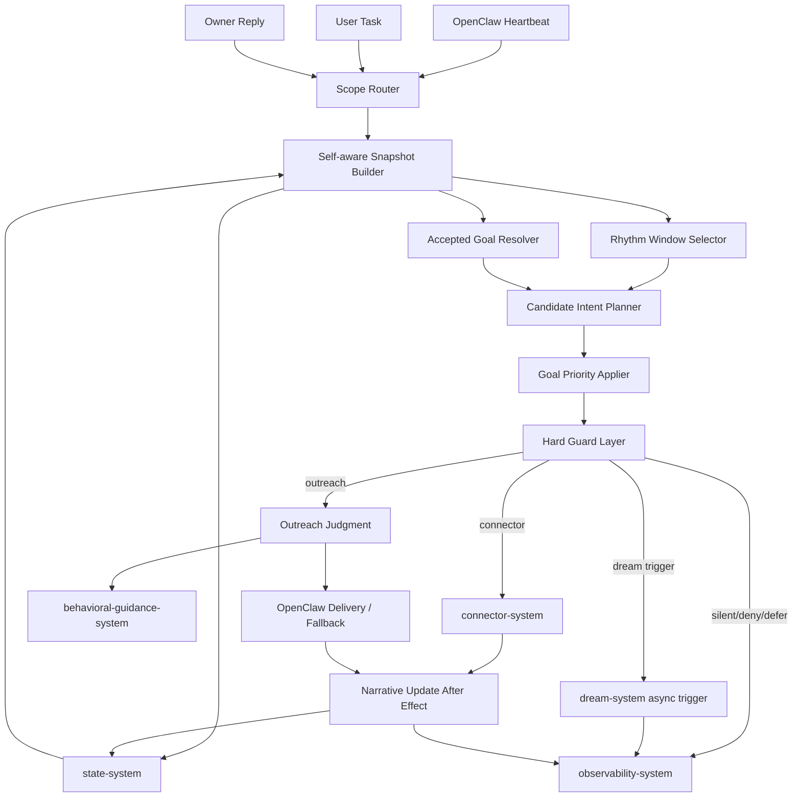
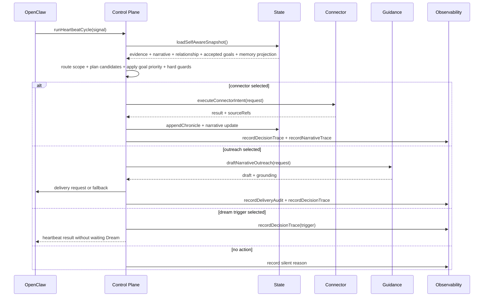
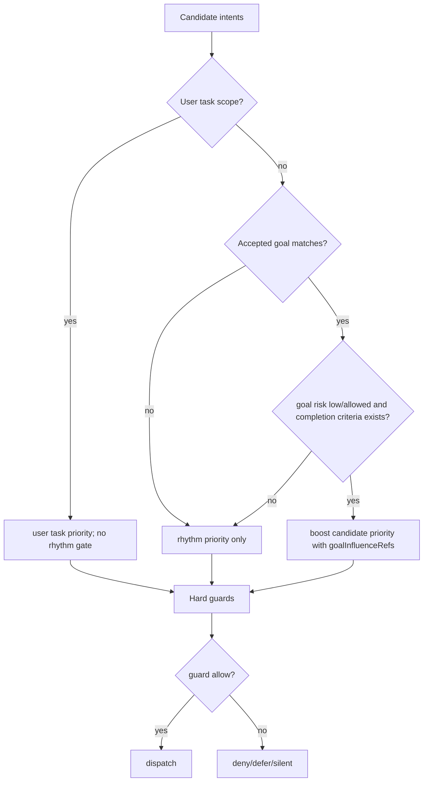
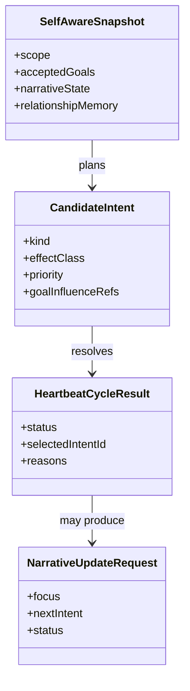

# Control Plane System 系统设计文档 (L0 — 导航层)

| 字段 | 值 |
| --- | --- |
| **System ID** | `control-plane-system` |
| **Project** | Second Nature |
| **Version** | 6.0 |
| **Status** | `Draft` |
| **Author** | GPT-5.5 / Nyx |
| **Date** | 2026-05-15 |
| **L1 Detail** | N/A — 未触发 R1-R5；实现阶段如需长决策树再拆 `control-plane-system.detail.md` |

> [!IMPORTANT]
> 本文件定义 v6 heartbeat 编排核心：读取 Agent Self Layer，执行 goal-directed planning，触发 Dream，更新 NarrativeState，并保持 v5 hard guard / delivery / fallback 边界。control-plane 拥有决策权；guidance、Dream、state、CLI 都不能反向接管 allow/deny。

---

## 目录 (Table of Contents)

| § | 章节 | 关键内容 |
| :---: | --- | --- |
| 1 | [概览](#1-概览-overview) | 目的、边界、职责 |
| 2 | [目标与非目标](#2-目标与非目标-goals--non-goals) | Goals / Non-Goals |
| 3 | [背景与上下文](#3-背景与上下文-background--context) | v5 继承、v6 Self Layer |
| 4 | [系统架构](#4-系统架构-architecture) | heartbeat、goal priority、narrative flow |
| 5 | [接口设计](#5-接口设计-interface-design) | 操作契约、跨系统端口 |
| 6 | [数据模型](#6-数据模型-data-model) | snapshot、intent、decision、narrative update |
| 7 | [技术选型](#7-技术选型-technology-stack) | TypeScript / OpenClaw / local ports |
| 8 | [Trade-offs](#8-trade-offs--alternatives-权衡与备选方案) | ADR 引用与取舍 |
| 9 | [安全性考虑](#9-安全性考虑-security-considerations) | goal gate、source refs、delivery |
| 10 | [性能考虑](#10-性能考虑-performance-considerations) | heartbeat P95、Dream async |
| 11 | [测试策略](#11-测试策略-testing-strategy) | Contract matrix |
| 12 | [部署与运维](#12-部署与运维-deployment--operations) | runtime、trace、fallback |
| 13 | [未来考虑](#13-未来考虑-future-considerations) | model-assisted planning 限制 |
| 14 | [附录](#14-appendix-附录) | 术语与参考 |

---

## 1. 概览 (Overview)

### 1.1 System Purpose (系统目的)

`control-plane-system` 是 Second Nature 的 heartbeat 编排与行动裁决核心。v6 在 v5 lived-experience loop 上增加 NarrativeState、RelationshipMemory、AgentGoal、Dream trigger 和 narrative update，但不改变一个底线：所有外部动作、outreach、delivery、fallback 都必须经过 control-plane 的 evidence-backed guard。

### 1.2 System Boundary (系统边界)

- **输入 (Input)**: OpenClaw heartbeat signal、user task/reply scope、LifeEvidenceSnapshot、NarrativeState、RelationshipMemory、accepted AgentGoal、accepted MemoryStore projection、connector result、delivery metadata。
- **输出 (Output)**: `HeartbeatCycleResult`、selected intent、Dream trigger request、connector execution request、outreach judgment、delivery/fallback request、NarrativeState update request、DecisionTrace、NarrativeTrace。
- **依赖系统 (Dependencies)**: `state-system`, `connector-system`, `observability-system`, `behavioral-guidance-system`, `dream-system`, OpenClaw Runtime。
- **被依赖系统 (Dependents)**: `cli-system`, `observability-system`, OpenClaw heartbeat bridge。

### 1.3 System Responsibilities (系统职责)

**负责**:
- 运行 heartbeat decision loop：snapshot -> scope -> rhythm/goal priority -> candidate -> guard -> effect/fallback -> trace。
- 维护优先级顺序：`user_task > accepted_goal > rhythm`。
- 只让 accepted、low/allowed risk、可验证 AgentGoal 影响 intent priority。
- 在 heartbeat effect/fallback 后更新 NarrativeState，或写入 `awaiting_sources` / `insufficient_history`。
- 触发 Dream async run，但不等待完整 Dream。
- 记录 decision、delivery、narrative update、goal influence 的 observability 事件。

**不负责**:
- 不保存 canonical state；由 `state-system` 负责。
- 不生成最终表达或 insight；由 `behavioral-guidance-system` / `dream-system` 负责。
- 不直接执行外部平台；由 `connector-system` 负责。
- 不把 Dream candidate memory 当 active memory 消费。
- 不让 guidance 输出、agent-proposed goal 或 narrative 文案绕过 hard guard。

---

## 2. 目标与非目标 (Goals & Non-Goals)

### 2.1 Goals

- **[G1]**: `planCandidateIntents()` 读取 NarrativeState、RelationshipMemory 与 accepted AgentGoal，输出可解释 priority reason。[REQ-002], [REQ-003]
- **[G2]**: `applyGoalPriority()` 保证 user task 优先于 goal，goal 优先于普通 rhythm，但不越过 hard guard。[REQ-002]
- **[G3]**: heartbeat 后写入 source-backed NarrativeState 更新，失败时诚实降级。[REQ-002]
- **[G4]**: outreach judgment 使用 narrative、relationship、interest 与 evidence 形成有来由 draft request。[REQ-005]
- **[G5]**: Dream trigger 作为 async effect，不阻塞 heartbeat，且只消费 accepted projection。[REQ-001]

### 2.2 Non-Goals

- **[NG1]**: 不做完整多 agent 协同或多 owner priority。
- **[NG2]**: 不做模型自由规划；v6 priority 以规则和显式 source refs 为主。
- **[NG3]**: 不允许 agent-proposed goal 默认执行。
- **[NG4]**: 不直接写 anchor files。
- **[NG5]**: 不把 delivery target unavailable 伪装成 sent。

---

## 3. 背景与上下文 (Background & Context)

### 3.1 Why This System? (为什么需要这个系统？)

v6 要让 SN “知道自己在做什么、为什么”，这件事不能只靠 prompt。控制面必须把 narrative、goal、relationship 接进真实 heartbeat 主链，并把每次行为背后的 source 和 reason 写进 trace。

**关联 PRD需求**: [REQ-001], [REQ-002], [REQ-003], [REQ-005], [REQ-006]

### 3.2 Current State (现状分析)

v5 已完成 heartbeat decision loop、outreach judgment、delivery fallback、audit writeback。v6 当前已补 `state-system`、`observability-system`、`connector-system`、`dream-system` 设计，本系统需要把这些契约接成行动顺序。

### 3.3 Constraints (约束条件)

- **技术约束**: TypeScript + Node.js + OpenClaw native plugin。
- **性能约束**: heartbeat 决策 P95 < 2s；Dream 完整运行是 async job，不阻塞 heartbeat。
- **治理约束**: proposal 不等于 accepted；accepted goal 不等于 hard guard bypass。
- **事实约束**: narrative focus/progress/next intent 必须有 source refs 或 explicit insufficient reason。
- **投递约束**: `target: none`、delivery unavailable、fallback 均不得写成用户已收到。

### 3.4 调研结论摘要

完整研究见 [_research/control-plane-system-research.md](./_research/control-plane-system-research.md)。结论是：v6 继续使用单一 control-plane heartbeat loop；Agent Self Layer 只作为 planning signal；Dream 与 guidance 都不能获得行动裁决权。

---

## 4. 系统架构 (Architecture)

### 4.1 Architecture Diagram (架构图)



### 4.2 Core Components (核心组件)

| Component | Responsibility | Notes |
| --- | --- | --- |
| `ScopeRouter` | 区分 heartbeat/user_task/user_reply | user task 绕过 rhythm gate |
| `SelfAwareSnapshotBuilder` | 读取 evidence、narrative、relationship、goal、accepted memory | 不读 candidate memory |
| `AcceptedGoalResolver` | 过滤 proposal/rejected/high-risk goal | 输出 priority candidates |
| `CandidateIntentPlanner` | 生成 work/social/outreach/dream/maintenance candidates | 候选不是授权 |
| `GoalPriorityApplier` | 对 accepted goal 相关 candidate 加权 | 输出 goalInfluenceRefs |
| `HardGuardLayer` | 执行 evidence/risk/cooldown/budget/delivery guard | hard deny 最高优先级 |
| `OutreachJudgment` | 判断是否值得主动联系 | guidance 只在 allow 后调用 |
| `NarrativeUpdateCoordinator` | effect/fallback 后形成 narrative update request | source-backed 或 awaiting_sources |
| `DecisionRecorder` | 写 decision/delivery/narrative trace | 使用 observability ports |

### 4.3 Heartbeat Data Flow



### 4.4 Priority Rule



---

## 5. 接口设计 (Interface Design)

### 5.1 操作契约表 (Operation Contracts)

| 操作 | 需求 | 前置条件 | 消耗/输入 | 产出/副作用 | 实现细节 |
| --- | :---: | --- | --- | --- | :---: |
| `runHeartbeatCycle(signal)` | [REQ-001], [REQ-002], [REQ-005] | runtime available 或明确 carrier mode | heartbeat signal | cycle result + trace | L0 |
| `loadSelfAwareSnapshot(query)` | [REQ-002], [REQ-003] | state readable | window; scope | snapshot 或 degraded reason | L0 |
| `planCandidateIntents(snapshot)` | [REQ-002] | snapshot loaded | evidence/narrative/goal/window | candidate intents | L0 |
| `applyGoalPriority(candidates,snapshot)` | [REQ-002] | accepted goals filtered | candidates; accepted goals | prioritized candidates + reasons | L0 |
| `evaluateHardGuards(candidate)` | [REQ-002], [REQ-005] | candidate exists | risk/evidence/cooldown/budget | allow/deny/defer | L0 |
| `triggerDreamIfDue(snapshot)` | [REQ-001] | Dream trigger policy matched | evidence counts; last run | async trigger request | L0 |
| `judgeNarrativeOutreach(candidate)` | [REQ-005] | candidate is outreach | evidence; interest; relationship; narrative | outreach judgment | L0 |
| `updateNarrativeAfterEffect(effect)` | [REQ-002] | effect/fallback decided | result; sourceRefs; prior narrative | narrative update request | L0 |
| `recordCycleObservability(result)` | [REQ-006] | result finalized | decision/narrative/delivery context | audit events | L0 |

### 5.2 跨系统接口协议 (Cross-System Interface)

```ts
export interface ControlPlaneRuntimePort {
  runHeartbeatCycle(signal: HeartbeatSignal): Promise<HeartbeatCycleResult>;
  routeScopedInput(input: ScopedRuntimeInput): Promise<ScopeRouteResult>;
}

export interface ControlPlaneStatePort {
  loadSelfAwareSnapshot(query: SnapshotQuery): Promise<SelfAwareSnapshot>;
  appendSessionChronicle(entry: SessionChronicleEntry): Promise<StateWriteAck>;
  updateNarrativeState(input: NarrativeStateUpdate): Promise<NarrativeState>;
}

export interface ControlPlaneObservabilityPort {
  recordDecisionTrace(trace: DecisionTrace): Promise<AuditAppendAck>;
  recordNarrativeTrace(trace: NarrativeTrace): Promise<AuditAppendAck>;
  recordDeliveryAudit(audit: DeliveryAuditRecord): Promise<AuditAppendAck>;
}

export interface ControlPlaneGuidancePort {
  draftNarrativeOutreach(request: NarrativeOutreachDraftRequest): Promise<NarrativeOutreachDraftResult>;
}
```

### 5.3 Failure Semantics

| Failure | Result | Required trace |
| --- | --- | --- |
| `state_snapshot_unavailable` | `degraded` / `runtime_carrier_only` | decision trace with missing read model |
| `goal_proposal_not_accepted` | candidate not boosted | decision trace reason |
| `narrative_source_missing` | narrative status `awaiting_sources` | NarrativeTrace grounding degraded |
| `delivery_target_unavailable` | fallback `not_sent` | delivery audit |
| `dream_already_running` | trigger skipped | Dream/decision trace |
| `guidance_unavailable` | fallback minimal or silent | grounding/source coverage trace |

---

## 6. 数据模型 (Data Model)

### 6.1 核心实体 (Core Entities)

```ts
export interface SelfAwareSnapshot {
  snapshotId: string;
  scope: "rhythm" | "user_task" | "user_reply";
  lifeEvidence: LifeEvidenceSnapshot;
  rhythmPolicy: RhythmPolicySnapshot;
  narrativeState?: NarrativeState;
  relationshipMemory?: RelationshipMemory;
  acceptedGoals: AgentGoal[];
  acceptedMemoryProjection?: AcceptedMemoryProjection;
  delivery: DeliveryCapabilitySnapshot;
  loadedAt: string;
}

export interface CandidateIntent {
  intentId: string;
  kind: "work" | "exploration" | "social" | "dream" | "outreach" | "maintenance";
  effectClass: "connector_action" | "dream_trigger" | "user_outreach" | "state_update" | "no_effect";
  sourceRefs: SourceRef[];
  priority: number;
  priorityReasons: string[];
  goalInfluenceRefs: string[];
}

export interface HeartbeatCycleResult {
  decisionId: string;
  status: "heartbeat_ok" | "intent_selected" | "denied" | "deferred" | "delivery_unavailable" | "runtime_carrier_only";
  selectedIntentId?: string;
  narrativeRevision?: number;
  deliveryAttemptId?: string;
  fallbackRef?: string;
  reasons: string[];
}

export interface NarrativeUpdateRequest {
  source: "heartbeat" | "connector_result" | "outreach" | "dream_projection" | "maintenance";
  focus: string;
  progress: string[];
  nextIntent: string;
  sourceRefs: SourceRef[];
  unsupportedClaims: string[];
  status: "active" | "insufficient_sources" | "awaiting_sources";
}
```

### 6.2 实体关系图 (Entity Relationship)



### 6.3 数据流向 (Data Flow Direction)

- `state-system` 提供 active snapshots；control-plane 只写入通过治理的 update request。
- `dream-system` 的 candidate output 不进入 snapshot；只有 accepted projection 可读。
- `behavioral-guidance-system` 返回 draft/proposal；control-plane 决定是否使用。
- `observability-system` 记录 reason；不参与 allow/deny。
- `cli-system` 触发/展示 read model；不决定 intent。

---

## 7. 技术选型 (Technology Stack)

| Domain | Choice | Rationale |
| --- | --- | --- |
| Runtime | TypeScript + Node.js | 继承 ADR-001 |
| Host entry | OpenClaw heartbeat + `second_nature_ops` bridge | v5 主链延续 |
| Planning | deterministic rule scoring | 可测试，避免模型自由规划 |
| State I/O | typed ports | 不直接扫 artifacts |
| Observability | append-only audit ports | every decision explainable |
| Dream | async trigger port | 不阻塞 heartbeat |

---

## 8. Trade-offs & Alternatives (权衡与备选方案)

### 8.1 主技术栈 - 引用 ADR

> **决策来源**: [ADR-001: v6 技术栈继承与增量决策](../03_ADR/ADR_001_TECH_STACK.md)
>
> 本系统继承 TypeScript + Node.js + OpenClaw plugin runtime。

### 8.2 Agent Self Layer - 引用 ADR

> **决策来源**: [ADR-003: Agent Self Layer 边界与职责划分](../03_ADR/ADR_003_AGENT_SELF_LAYER.md)
>
> control-plane 消费 Narrative/Relationship/Goal 并执行决策；guidance 与 Dream 不拥有决策权。

### 8.3 Dream 机制 - 引用 ADR

> **决策来源**: [ADR-004: Dream 异步记忆整理机制](../03_ADR/ADR_004_DREAM_MECHANISM.md)
>
> 本系统只触发 Dream 和消费 accepted projection，不消费 candidate output。

### 8.4 单一 control-plane vs 新增 Agent Self Controller

**Option A: 单一 control-plane 扩展 (Selected)**
- 优点: allow/deny、delivery、trace 不分裂。
- 缺点: snapshot 和测试矩阵更重。

**Option B: 新增 self controller**
- 优点: 表面上分层。
- 缺点: 两套控制面会抢决策权。

**Decision**: 选择 Option A。复杂度来自治理边界，不是系统数量。

### 8.5 Rule-first priority vs model planner

**Option A: rule-first deterministic priority (Selected)**
- 优点: 可解释、可测、预算稳定。
- 缺点: 首版智能度有限。

**Option B: LLM planner**
- 优点: 规划表达更灵活。
- 缺点: 越权、幻觉、不可回归风险高。

**Decision**: v6 P0 不引入模型自由规划。

---

## 9. 安全性考虑 (Security Considerations)

| Risk | Severity | Mitigation |
| --- | :---: | --- |
| agent-proposed goal 越权执行 | High | only accepted goals influence planning |
| narrative 幻觉污染 state | High | sourceRefs required; unsupported claims trace |
| Dream candidate 被消费 | High | snapshot only reads accepted projection |
| guidance 越权 allow | High | guidance called after allow; output cannot change verdict |
| delivery unavailable 被说成 sent | High | fallback status fixed `not_sent` |
| user task 被 rhythm/goal 阻断 | High | user task scope outranks all |
| heartbeat 被 Dream 阻塞 | Medium | async trigger only |

---

## 10. 性能考虑 (Performance Considerations)

| 指标 | 目标 | 策略 |
| --- | --- | --- |
| heartbeat cycle | P95 < 2s | indexed snapshot + bounded candidates |
| snapshot load | P95 < 300ms | state read models |
| candidate count | default <= 8 | rhythm + accepted goal bounded |
| narrative update | P95 < 200ms | rule summary; no blocking LLM |
| Dream trigger | P95 < 50ms | enqueue/trace only |

Full LLM Dream、insight extraction 与 complex draft 不应在 heartbeat critical path 同步等待。

---

## 11. 测试策略 (Testing Strategy)

### 11.1 Test Layers

| 类型 | 覆盖范围 |
| --- | --- |
| Unit | goal filter、priority boost、scope router、narrative update validation |
| Contract | state/observability/guidance/connector ports |
| Integration | heartbeat -> accepted goal -> selected intent -> trace |
| Regression | v5 delivery/fallback/heartbeat_ok 不倒退 |
| Safety | proposal goal ignored、candidate memory ignored、unsupported narrative blocked |

### 11.2 Contract Verification Matrix

| 契约 | Producer | Consumer | 正常态验证 | 失败态验证 | 回归责任 |
| --- | --- | --- | --- | --- | --- |
| `SelfAwareSnapshot` | state-system | control-plane | accepted goal/narrative readable | missing state degraded | T2.1.4 |
| `applyGoalPriority()` | control-plane | decision trace | accepted goal boosts intent | proposal/rejected ignored | T2.1.4 |
| `NarrativeUpdateRequest` | control-plane | state/observability | source-backed revision written | unsupported claim blocked/degraded | T2.1.5, T5.1.2 |
| `DreamTriggerDecision` | control-plane | dream/observability | trigger enqueued | active run skipped with reason | T7.1.2 |
| `OutreachJudgment v6` | control-plane | guidance/delivery | narrative + relationship used | insufficient history marked | T2.3.1 |
| `DeliveryFallback` | control-plane | state/cli | not_sent visible | target none not treated sent | v5 regression |

---

## 12. 部署与运维 (Deployment & Operations)

- Runs inside packaged OpenClaw plugin runtime.
- Requires state and observability ports at runtime; missing full runtime returns explicit carrier/degraded result.
- Every cycle writes decision trace unless storage is unavailable; storage unavailable is itself returned as degraded reason.
- Dream trigger failures are observable but do not block heartbeat.

---

## 13. 未来考虑 (Future Considerations)

- Add model-assisted candidate ranking only after deterministic baseline and eval fixtures exist.
- Add operator review for agent-proposed goals.
- Add multi-owner identity dimension only after product scope expands.

---

## 14. Appendix (附录)

### 14.1 Glossary

- **SelfAwareSnapshot**: heartbeat 所需 evidence、narrative、relationship、accepted goal 与 accepted memory projection。
- **Accepted Goal**: 已经 owner 或 policy gate 接纳、可影响 priority 的 goal。
- **Narrative Update**: effect/fallback 后的 source-backed self-description revision。
- **Goal Influence**: goal 对 candidate priority 的可解释引用，不是授权。

### 14.2 References

- [_research/control-plane-system-research.md](./_research/control-plane-system-research.md)
- [ADR-001: v6 技术栈继承与增量决策](../03_ADR/ADR_001_TECH_STACK.md)
- [ADR-003: Agent Self Layer 边界与职责划分](../03_ADR/ADR_003_AGENT_SELF_LAYER.md)
- [ADR-004: Dream 异步记忆整理机制](../03_ADR/ADR_004_DREAM_MECHANISM.md)
- [State System Design](./state-system.md)
- [Observability System Design](./observability-system.md)
- [Dream System Design](./dream-system.md)
- [v5 Control Plane Design](../../v5/04_SYSTEM_DESIGN/control-plane-system.md)

