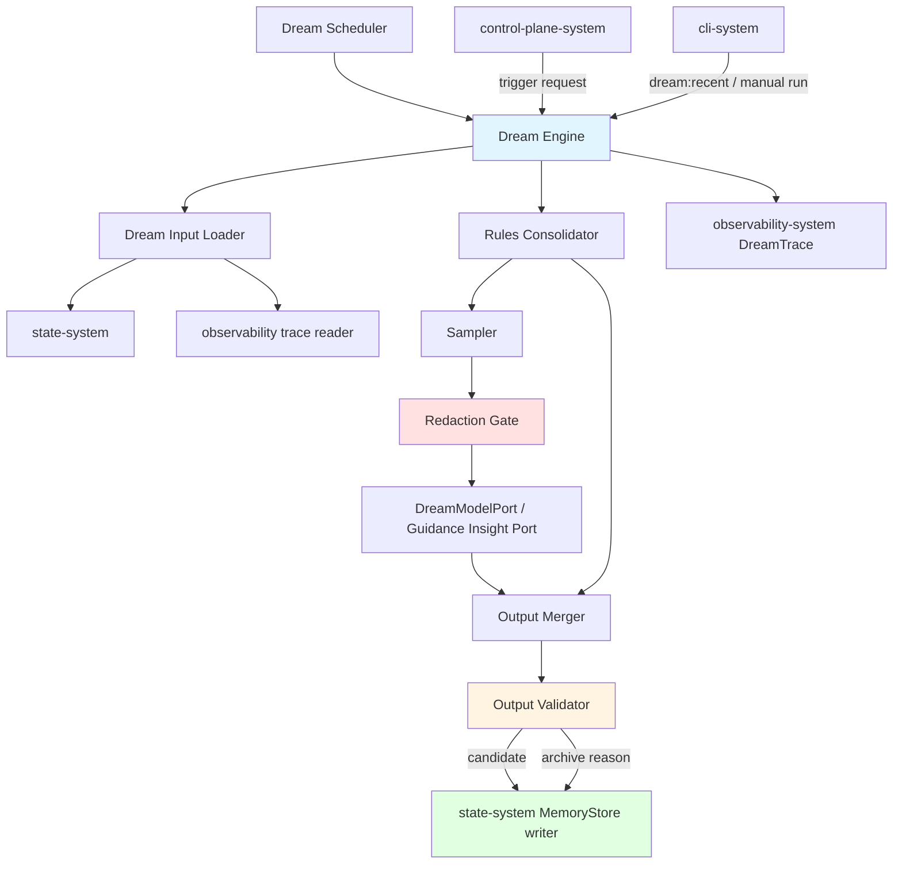
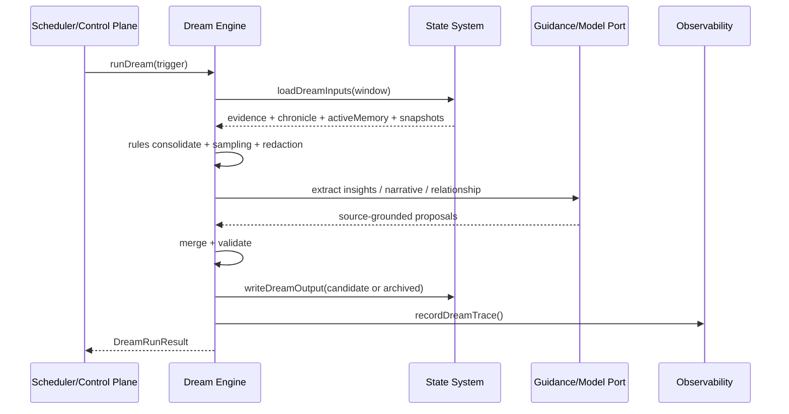
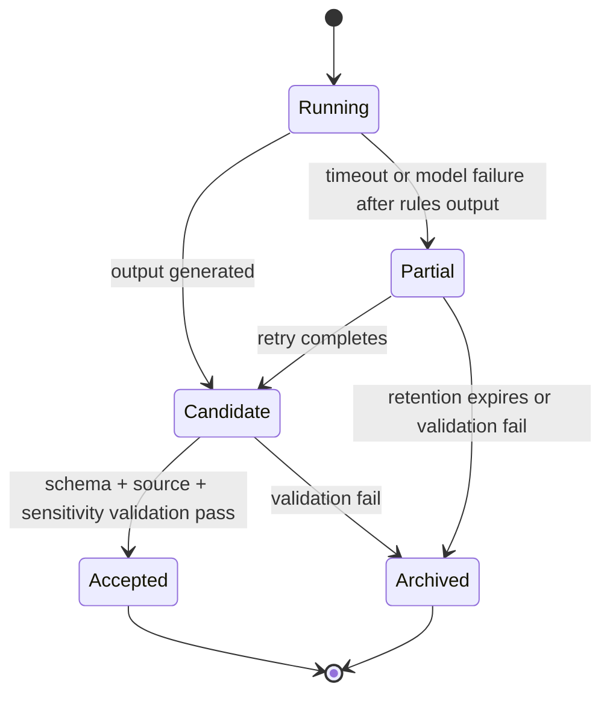
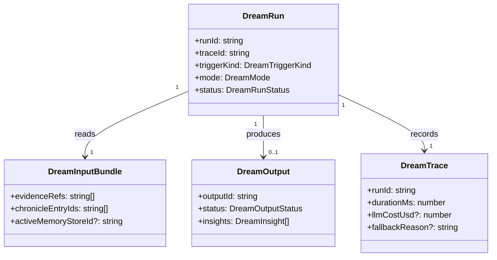

# Dream System 系统设计文档 (L0 — 导航层)

| 字段 | 值 |
| --- | --- |
| **System ID** | `dream-system` |
| **Project** | Second Nature |
| **Version** | 1.0 |
| **Status** | `Draft` |
| **Author** | GPT-5.5 / Nyx |
| **Date** | 2026-05-15 |
| **L1 Detail** | [dream-system.detail.md](./dream-system.detail.md) — R5 行数触发，仅 `/forge` 明确引用时加载 |

> [!IMPORTANT]
> 本文件定义 Dream 的系统边界与公共契约。Dream 只能生产 candidate memory output 与更新建议，不直接污染 active memory，不拥有 heartbeat 决策权，不绕过 state-system 的接纳治理。
>
> **L1**: 实现层边缘规则、配置键与测试辅助见 [dream-system.detail.md](./dream-system.detail.md)。

---

## 目录 (Table of Contents)

| § | 章节 | 关键内容 |
| :---: | --- | --- |
| 1 | [概览](#1-概览-overview) | 目的、边界、职责 |
| 2 | [目标与非目标](#2-目标与非目标-goals--non-goals) | Goals / Non-Goals |
| 3 | [背景与上下文](#3-背景与上下文-background--context) | v6 PRD、Quiet 演进、调研结论 |
| 4 | [系统架构](#4-系统架构-architecture) | 组件、数据流、生命周期 |
| 5 | [接口设计](#5-接口设计-interface-design) | 操作契约、跨系统端口 |
| 6 | [数据模型](#6-数据模型-data-model) | DreamRun、DreamOutput、MemoryStore 引用 |
| 7 | [技术选型](#7-技术选型-technology-stack) | TS/Node、port-first、async job |
| 8 | [Trade-offs](#8-trade-offs--alternatives-权衡与备选方案) | ADR 引用与系统取舍 |
| 9 | [安全性考虑](#9-安全性考虑-security-considerations) | 脱敏、source grounding、prompt injection |
| 10 | [性能考虑](#10-性能考虑-performance-considerations) | sampling、budget、timeout |
| 11 | [测试策略](#11-测试策略-testing-strategy) | Contract matrix |
| 12 | [部署与运维](#12-部署与运维-deployment--operations) | scheduler、trace、artifact 管理 |
| 13 | [未来考虑](#13-未来考虑-future-considerations) | quality score、review UI |
| 14 | [附录](#14-appendix-附录) | 术语与参考 |

---

## 1. 概览 (Overview)

### 1.1 System Purpose (系统目的)

`dream-system` 是 Second Nature v6 的异步记忆整理引擎。它读取 source-backed life evidence、session chronicle 与 existing memory store，产出新的 candidate memory store、insights、narrative update proposal 与 relationship update proposal。

### 1.2 System Boundary (系统边界)

- **输入 (Input)**: `state-system` 暴露的 life evidence、session chronicle、current active memory store、narrative snapshot、relationship snapshot、goal snapshot；`observability-system` 暴露的 decision trace 摘要。
- **输出 (Output)**: `DreamOutput` candidate artifact、`DreamTrace`、rules-only fallback result、partial output、validation result。
- **依赖系统 (Dependencies)**: `state-system`, `observability-system`, `behavioral-guidance-system`, LLM Provider。
- **被依赖系统 (Dependents)**: `control-plane-system`, `cli-system`, `state-system`, `observability-system`。

### 1.3 System Responsibilities (系统职责)

**负责**:
- 运行规则层去重、合并、过时清理与冲突标记。
- 对大输入执行采样，保留最近 7 天和关键事件。
- 通过 `DreamModelPort` 或 `behavioral-guidance-system` 受控提取 insight、narrative update 和 relationship update。
- 产出 `candidate` 状态的 `DreamOutput`，并执行 schema、source grounding、sensitivity validation。
- 写入 `DreamTrace`，记录输入规模、耗时、LLM 成本、降级原因和 output lifecycle。

**不负责**:
- 不直接修改 active memory store；active 接纳由 `state-system` 治理。
- 不决定 heartbeat 当前该做什么；这是 `control-plane-system` 的职责。
- 不绕过 owner/policy gate 接纳 agent-proposed goal。
- 不把凭据、私信正文、PII 或未脱敏 platform payload 发送给 LLM。
- 不承诺完整 LLM Dream 的 5 分钟 P95。

---

## 2. 目标与非目标 (Goals & Non-Goals)

### 2.1 Goals

- **[G1]**: 给定 evidence + chronicle + memory store，产出去重后的 candidate `MemoryStore`。[REQ-001]
- **[G2]**: 在有足够输入时产出至少一条 source-grounded insight。[REQ-001]
- **[G3]**: 产出可验证的 narrative update 与 relationship update proposal。[REQ-001], [REQ-002], [REQ-003]
- **[G4]**: LLM 不可用、超预算或超时时降级为 rules-only，并保留 trace。[REQ-001]
- **[G5]**: Dream output 必须经过 `candidate` → validation → `accepted` / `archived` 生命周期。[REQ-001]

### 2.2 Non-Goals

- **[NG1]**: 不做实时记忆整理；Dream 是异步 job。
- **[NG2]**: 不做 deep research 或向量语义搜索。
- **[NG3]**: 不直接写 SOUL.md / USER.md / IDENTITY.md。
- **[NG4]**: 不直接决定 outreach 是否投递。
- **[NG5]**: 不绑定任何单一 LLM vendor、model 或密钥。

---

## 3. 背景与上下文 (Background & Context)

### 3.1 Why This System? (为什么需要这个系统？)

v5 Quiet 证明了 source-backed reflection 可以避免虚构，但它只产出 report artifact。v6 要让 SN 有持续成长感，必须把 evidence 整理成可复用 memory、insight、narrative 和 relationship update。

**关联 PRD需求**: [REQ-001], [REQ-002], [REQ-003], [REQ-006]

### 3.2 Current State (现状分析)

当前实现已有 `src/core/second-nature/quiet/run-source-backed-quiet.ts` 和 `.second-nature/quiet` artifact 写入链路。它可以作为 Dream 的空态诚实、source-backed claim 和 workspace artifact 经验来源，但不能直接满足 MemoryStore lifecycle。

### 3.3 Constraints (约束条件)

- **技术约束**: TypeScript + Node.js；LLM 通过 port 抽象接入；不得硬编码供应商或密钥。
- **性能约束**: 规则/采样阶段在 1000 条 evidence 内 P95 < 5min；完整 LLM Dream 是 async job，默认 operator timeout 30min。
- **预算约束**: 月度 LLM 预算默认 $20；单次 Dream LLM 调用目标 <= $0.5。
- **安全约束**: LLM 输入必须先脱敏；output 未验证前不得进入 active memory。

### 3.4 调研结论摘要

Claude Dreams 的可借鉴点是 async job、input/output separation、memory store rewrite 和 optional human review；SN Dream 不直接依赖 Claude Managed Agents Dreams API。

完整研究见 [_research/dream-system-research.md](./_research/dream-system-research.md)。

---

## 4. 系统架构 (Architecture)

### 4.1 Architecture Diagram (架构图)



### 4.2 Core Components (核心组件)

| Component | Responsibility | Notes |
| --- | --- | --- |
| `DreamScheduler` | 定时、阈值、手动触发 Dream run | 不阻塞 heartbeat |
| `DreamRunLock` | 对同一 workspace / memory input window 提供 active-run 排他 | 由 `state-system` lease 或等价 port 持久化 |
| `DreamInputLoader` | 读取 evidence、chronicle、memory、narrative、relationship、trace 摘要 | 经 `state-system` / `observability-system` port |
| `MemoryConsolidator` | 规则去重、合并、过时清理、冲突标记 | LLM 不可用时仍可运行 |
| `DreamSampler` | 大输入采样最近 7 天 + 关键事件 | 防 token 和成本失控 |
| `DreamRedactionGate` | LLM 前脱敏、敏感字段阻断 | 失败则跳过 LLM 阶段 |
| `InsightExtractor` | 通过模型或 guidance port 提取 insight | 输出必须带 source refs |
| `DreamOutputMerger` | 合并 rules output 与 model output | 只产 candidate |
| `DreamOutputValidator` | schema/source/sensitivity validation | 决定 accepted eligibility |
| `DreamTraceRecorder` | 记录耗时、成本、fallback、lifecycle | 由 observability-system 持久化 |

### 4.3 Data Flow (数据流)



### 4.4 Dream Output Lifecycle



**关键规则**:
1. `inputMemoryStoreId` 指向的 store 不得被修改。
2. `candidate` 可被 operator 查看，但不得被 heartbeat 当作 active memory 消费。
3. `accepted` 只能由 `state-system` 的 lifecycle port 标记。
4. `partial` 必须记录完成到哪一阶段和可恢复输入。

---

## 5. 接口设计 (Interface Design)

### 5.1 操作契约表 (Operation Contracts)

| 操作 | [REQ-XXX] | 前置条件 | 消耗/输入 | 产出/副作用 | 实现细节 |
| --- | :---: | --- | --- | --- | :---: |
| `scheduleDream(trigger)` | [REQ-001] | trigger 通过 policy；无 active run 冲突 | cron/evidence/manual trigger | queued run 或 skipped reason | L0 |
| `runDream(input)` | [REQ-001] | state ports 可读；trace id 已生成 | evidence window; memory store id | `DreamRunResult`; candidate output; trace | L0 |
| `loadDreamInputs(window)` | [REQ-001] | state-system 可用 | time window; limits | `DreamInputBundle` | L0 |
| `consolidateMemory(bundle)` | [REQ-001] | bundle 已脱敏字段标记 | evidence; chronicle; memory | canonical entries; conflicts | L0 |
| `sampleDreamInput(bundle)` | [REQ-001] | input count 超阈值或 LLM 阶段启用 | evidence; chronicle | sampled evidence set | L0 |
| `extractDreamInsights(sample)` | [REQ-001] | budget allowed; redaction pass | sampled refs | insight proposals | L0 |
| `buildDreamOutput(parts)` | [REQ-001] | rules output 存在 | rules + model parts | `DreamOutput(status=candidate)` | L0 |
| `validateDreamOutput(output)` | [REQ-001] | output schema parseable | candidate output | accepted eligibility or archive reason | L0 |
| `recordDreamTrace(trace)` | [REQ-001], [REQ-006] | trace id exists | run metrics | audit append | L0 |

### 5.2 跨系统接口协议 (Cross-System Interface)

```ts
export interface DreamEnginePort {
  scheduleDream(input: DreamScheduleInput): Promise<DreamScheduleResult>;
  runDream(input: DreamRunInput): Promise<DreamRunResult>;
  getRecentDreamRuns(limit?: number): Promise<DreamRunSummary[]>;
}

export interface DreamStatePort {
  acquireDreamRunLock(input: DreamRunLockInput): Promise<DreamRunLockResult>;
  releaseDreamRunLock(input: DreamRunLockRelease): Promise<void>;
  loadDreamInputs(input: DreamInputQuery): Promise<DreamInputBundle>;
  writeDreamOutput(output: DreamOutputWrite): Promise<DreamOutputAck>;
  markDreamOutputLifecycle(input: DreamLifecycleTransition): Promise<DreamOutputAck>;
}

export interface DreamModelPort {
  extractInsights(input: RedactedDreamModelInput): Promise<DreamModelOutput>;
}

export interface DreamTracePort {
  recordDreamTrace(trace: DreamTrace): Promise<void>;
}
```

### 5.3 Failure Semantics

| Failure | Result | State write | Trace |
| --- | --- | --- | --- |
| `no_inputs` | `skipped` | none or empty candidate | `fallbackReason=no_inputs` |
| `budget_exceeded` | `rules_only` | candidate with no model insights | `fallbackReason=budget_exceeded` |
| `redaction_failed` | `archived` | archived candidate | `sensitivityFailure=true` |
| `model_timeout` | `partial` | partial output | `timeoutMs` |
| `validation_failed` | `archived` | archived candidate | `validationErrors[]` |

---

## 6. 数据模型 (Data Model)

### 6.1 核心实体 (Core Entities)

```ts
export type DreamTriggerKind = "scheduled" | "evidence_threshold" | "manual" | "maintenance";
export type DreamRunStatus = "queued" | "running" | "completed" | "skipped" | "failed";
export type DreamOutputStatus = "candidate" | "accepted" | "archived" | "partial";
export type DreamMode = "rules_only" | "hybrid_llm" | "model_skipped";

export interface DreamRun {
  runId: string;
  traceId: string;
  triggerKind: DreamTriggerKind;
  status: DreamRunStatus;
  mode: DreamMode;
  startedAt: string;
  finishedAt?: string;
  inputMemoryStoreId?: string;
  outputMemoryStoreId?: string;
  fallbackReason?: string;
}

export interface DreamInputBundle {
  evidenceRefs: string[];
  chronicleEntryIds: string[];
  activeMemoryStoreId?: string;
  narrativeSnapshotId?: string;
  relationshipSnapshotId?: string;
  goalSnapshotIds: string[];
  inputCounts: {
    evidence: number;
    chronicle: number;
    memoryEntries: number;
  };
}

export interface DreamOutput {
  outputId: string;
  runId: string;
  status: DreamOutputStatus;
  inputMemoryStoreId?: string;
  canonicalEntryRefs: string[];
  insights: DreamInsight[];
  narrativeUpdate?: DreamNarrativeUpdate;
  relationshipUpdate?: DreamRelationshipUpdate;
  validation: DreamOutputValidation;
}

export interface DreamInsight {
  id: string;
  type: "pattern" | "learning" | "observation" | "conflict";
  summary: string;
  sourceRefs: string[];
  confidence: number;
}
```

`MemoryStore`、`SessionChronicle`、`NarrativeState`、`RelationshipMemory` 的持久化字段由 `state-system.md` 定义；Dream 在本文件只声明消费和产出的接口约束。

### 6.2 实体关系图 (Entity Relationship)



### 6.3 数据流向 (Data Flow Direction)

- `state-system` 是 active memory 和 lifecycle 的真相源。
- `dream-system` 读取 active input，写 candidate output。
- `observability-system` 保存 `DreamTrace`，供 `cli-system` 的 `dream:recent` 使用。
- `control-plane-system` 只消费 accepted projections，不消费 raw candidate。

---

## 7. 技术选型 (Technology Stack)

### 7.1 Core Technologies

| Domain | Choice | Rationale |
| --- | --- | --- |
| Runtime | TypeScript + Node.js | 继承 v6 ADR-001 |
| Job Model | Async local job with trace id | 不阻塞 heartbeat |
| Model Access | `DreamModelPort` | 防 vendor lock-in 和硬编码密钥 |
| Validation | zod / schema validation | output 接纳前强校验 |
| Storage | state-system ports | 避免 Dream 自建真相源 |

### 7.2 Directory Shape

```text
src/dream/
├── dream-engine.ts
├── dream-scheduler.ts
├── input-loader.ts
├── memory-consolidator.ts
├── sampler.ts
├── redaction-gate.ts
├── insight-extractor.ts
├── output-validator.ts
└── types.ts
```

---

## 8. Trade-offs & Alternatives (权衡与备选方案)

### 8.1 主技术栈 - 引用 ADR

> **决策来源**: [ADR-001: v6 技术栈继承与增量决策](../03_ADR/ADR_001_TECH_STACK.md)
>
> 本系统继承 TypeScript + Node.js + OpenClaw plugin 主栈，不重复主栈理由。
>
> **本系统特有实现**: LLM 访问通过 `DreamModelPort`，不得在 pipeline 内硬编码 SDK、模型或密钥。

### 8.2 Agent Self Layer 边界 - 引用 ADR

> **决策来源**: [ADR-003: Agent Self Layer 边界与职责划分](../03_ADR/ADR_003_AGENT_SELF_LAYER.md)
>
> Dream 承担 memory consolidation，Narrative/Relationship/Goal 的真相源仍由 `state-system` 持久化。
>
> **本系统特有实现**: Dream 只生成 update proposal，不能直接改变 control-plane allow/deny 逻辑。

### 8.3 Dream 机制 - 引用 ADR

> **决策来源**: [ADR-004: Dream 异步记忆整理机制](../03_ADR/ADR_004_DREAM_MECHANISM.md)
>
> 本系统实现混合模式：规则层、采样层、LLM 层、合并层与 output lifecycle。

### 8.4 Hybrid Pipeline vs Pure LLM

**Option A: Hybrid rules + sampling + optional LLM (Selected)**
- 优点: 成本可控、可降级、可测性强。
- 缺点: 合并和 validation 更复杂。

**Option B: Pure LLM rewrite**
- 优点: 表达能力强。
- 缺点: 成本、隐私、幻觉和 token 上限风险都高。

**Decision**: 选择 hybrid pipeline，因为长期 agent memory 需要失败可控，不需要一次性最聪明。

### 8.5 Candidate Lifecycle vs Direct Accept

**Option A: Candidate before accepted (Selected)**
- 优点: 坏输出可 archive，不污染 active memory。
- 缺点: 多一层 lifecycle 和 CLI 可见状态。

**Option B: Dream 完成后直接 active**
- 优点: 实现简单。
- 缺点: LLM 幻觉会变成长期行为偏差。

**Decision**: 所有 Dream output 初始为 `candidate`。

---

## 9. 安全性考虑 (Security Considerations)

- LLM 输入禁止包含 credential、token、cookie、私信全文、PII 原文。
- `DreamRedactionGate` 必须在 `DreamModelPort` 前执行。
- insight、narrative update、relationship update 均必须带 source refs 或标记 `unsupported_claim` 并拒绝接纳。
- Prompt injection 风险来自 platform evidence；Dream 不执行 evidence 中的指令，只把它们当作被观察内容。
- `candidate` 不得被 active heartbeat 消费；只有 `accepted` projection 可被 control-plane 读取。
- partial output 必须可见、可清理、不可静默升级。

---

## 10. 性能考虑 (Performance Considerations)

| 指标 | 目标 | 策略 |
| --- | --- | --- |
| rules/sampling stage | 1000 条 evidence 内 P95 < 5min | 本地去重、hash、bounded scan |
| LLM stage | async，默认 30min operator timeout | 不阻塞 heartbeat |
| 单次 LLM 成本 | 目标 <= $0.5 | sampling + budget gate |
| 月度预算 | 默认 $20 | `DreamBudgetPort` |
| output validation | P95 < 2s | schema + source ref lookup |

大输入默认采样最近 7 天 evidence、outreach、owner reply、goal milestone 和 high-confidence source refs。

---

## 11. 测试策略 (Testing Strategy)

### 11.1 Test Layers

| 类型 | 覆盖范围 |
| --- | --- |
| Unit | consolidator、sampler、redaction、validator、budget gate |
| Contract | `DreamOutput`、`DreamTrace`、`DreamModelOutput` schema |
| Integration | state inputs → Dream output → trace write |
| Regression | v5 Quiet 空 evidence 不虚构原则保留 |
| Mock LLM | insight/narrative/relationship proposal source grounding |

### 11.2 关键验收用例

- Given input memory store，When Dream 运行，Then input store 不被修改。
- Given output validation fail，When lifecycle transition，Then candidate archived and active memory unchanged。
- Given LLM unavailable，When Dream 运行，Then rules-only candidate and trace records fallback。
- Given evidence > 1000，When sampling，Then recent 7 days and key events are kept.
- Given unsupported claim in model output，When validation，Then claim rejected or output archived。

### 11.3 Contract Verification Matrix

| 契约 | Producer | Consumer | 正常态验证 | 失败态验证 | 回归责任 |
| --- | --- | --- | --- | --- | --- |
| `DreamInputBundle` | state-system | dream-system | load evidence/chronicle/memory refs | empty input returns skipped | T7.1.1 |
| `DreamOutput` | dream-system | state-system / cli-system | candidate contains canonical refs and insights | validation fail archives | T7.1.1, INT-S2 |
| `DreamOutputLifecycle` | state-system | control-plane | accepted only consumed by heartbeat | candidate not consumed | T4.1.5, T7.1.1 |
| `DreamTrace` | dream-system | observability / cli-system | records duration/cost/counts | timeout/fallback reason recorded | T5.1.1 |
| `DreamModelPort` | guidance/model adapter | dream-system | source-grounded proposals | redaction or budget blocks model call | T7.1.3 |
| `DreamRunLock` | state-system | dream-system | one active run per workspace/input window | concurrent trigger returns skipped/queued | T7.1.2 |

---

## 12. 部署与运维 (Deployment & Operations)

- Dream runs inside the OpenClaw plugin workspace runtime, not host-safe carrier mode.
- Scheduler may be triggered by cron, evidence threshold, manual CLI, or maintenance.
- `dream:recent` reads `DreamTrace` and accepted/candidate output summaries through read models.
- Retention policy should archive old candidate/partial outputs after configurable days.
- Operator-visible failure reasons must include `budget_exceeded`, `model_timeout`, `redaction_failed`, `validation_failed`, and `no_inputs`.

---

## 13. 未来考虑 (Future Considerations)

- Add operator review UI for candidate outputs.
- Add insight quality scoring after P0 source grounding is stable.
- Add vector similarity dedupe only if rules-based dedupe becomes insufficient.
- Add provider-specific model adapters behind `DreamModelPort`.

---

## 14. Appendix (附录)

### 14.1 Glossary

- **Dream**: 异步 memory consolidation job。
- **Candidate output**: 未验证或未接纳的 Dream output。
- **Accepted output**: 通过 validation 并由 state-system 接纳的 Dream output。
- **Partial output**: 超时或部分失败后保留的可恢复结果。
- **Rules-only**: 不调用 LLM 的去重/合并/清理模式。

### 14.2 References

- [_research/dream-system-research.md](./_research/dream-system-research.md)
- [ADR-001: v6 技术栈继承与增量决策](../03_ADR/ADR_001_TECH_STACK.md)
- [ADR-003: Agent Self Layer 边界与职责划分](../03_ADR/ADR_003_AGENT_SELF_LAYER.md)
- [ADR-004: Dream 异步记忆整理机制](../03_ADR/ADR_004_DREAM_MECHANISM.md)
- [PRD v6](../01_PRD.md)
- [Architecture Overview v6](../02_ARCHITECTURE_OVERVIEW.md)
- [Claude Dreams official docs](https://platform.claude.com/docs/en/managed-agents/dreams)
