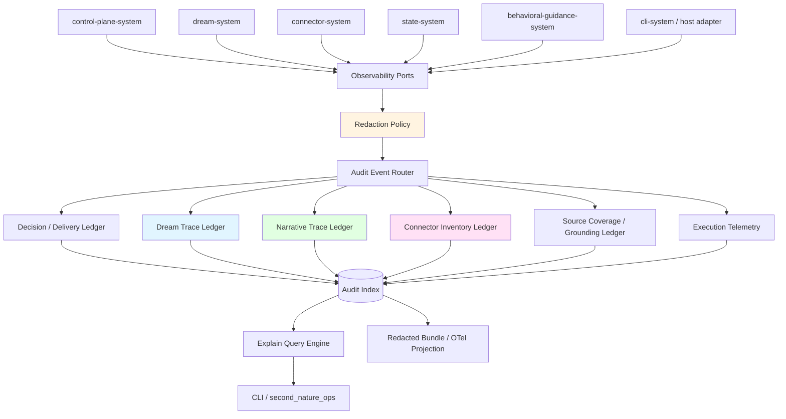
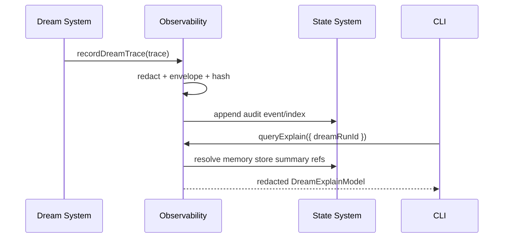
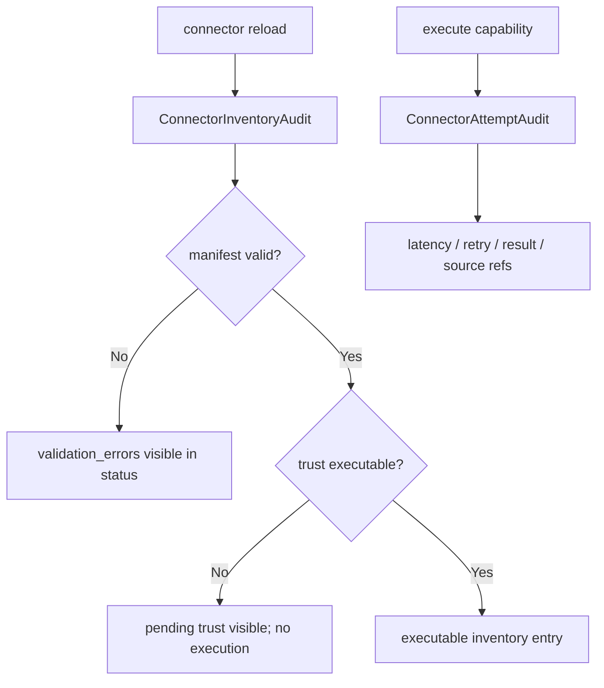
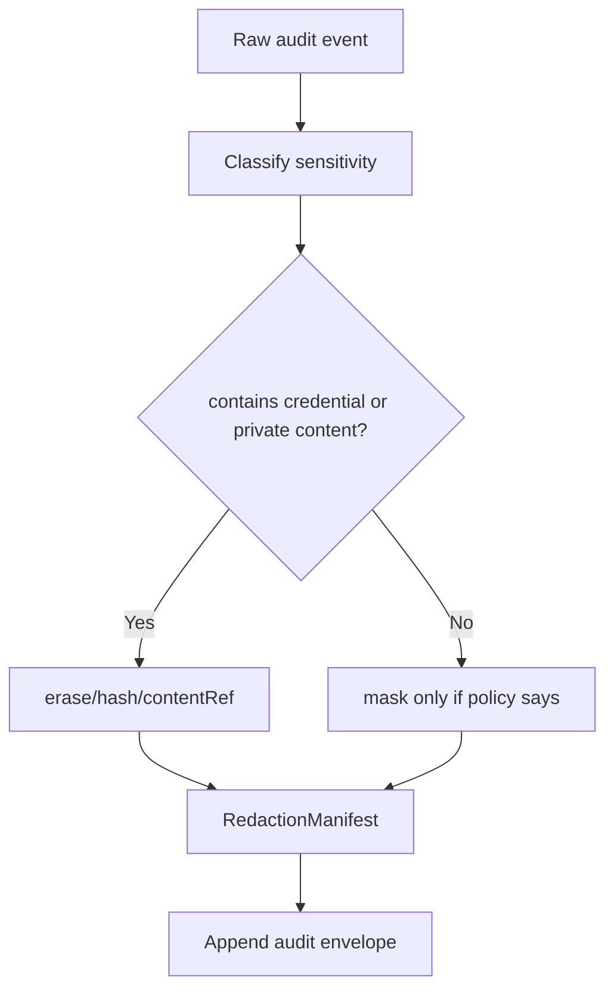
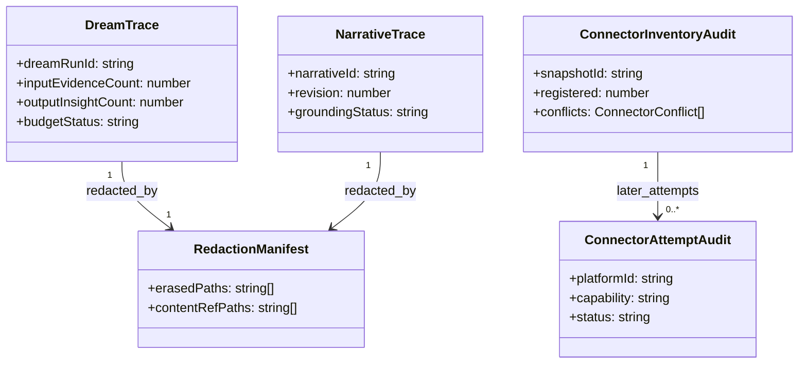

# Observability & Safety System 系统设计文档 (L0 — 导航层)

| 字段 | 值 |
| --- | --- |
| **System ID** | `observability-system` |
| **Project** | Second Nature |
| **Version** | 6.0 |
| **Status** | `Draft` |
| **Author** | GPT-5.5 / Nyx |
| **Date** | 2026-05-15 |
| **L1 Detail** | [observability-system.detail.md](./observability-system.detail.md) — R5 行数触发，仅 `/forge` 明确引用时加载 |

> [!IMPORTANT]
> 本文件定义 v6 的解释、审计与安全可观测性。observability-system 记录为什么发生、为什么没发生、为什么降级或被拒绝；它不保存 canonical memory，不生成业务状态，不替代 state-system。
>
> **L1**: 配置键、redaction policy、伪代码、决策树、边缘情况与测试辅助见 [observability-system.detail.md](./observability-system.detail.md)。

---

## 目录 (Table of Contents)

| § | 章节 | 关键内容 |
| :---: | --- | --- |
| 1 | [概览](#1-概览-overview) | 目的、边界、职责 |
| 2 | [目标与非目标](#2-目标与非目标-goals--non-goals) | Goals / Non-Goals |
| 3 | [背景与上下文](#3-背景与上下文-background--context) | v5 继承、v6 新增、调研 |
| 4 | [系统架构](#4-系统架构-architecture) | audit planes、trace flow、explain |
| 5 | [接口设计](#5-接口设计-interface-design) | 操作契约、跨系统端口 |
| 6 | [数据模型](#6-数据模型-data-model) | DreamTrace、NarrativeTrace、InventoryAudit |
| 7 | [技术选型](#7-技术选型-technology-stack) | local ledger + OTel-compatible projection |
| 8 | [Trade-offs](#8-trade-offs--alternatives-权衡与备选方案) | ADR 引用与系统取舍 |
| 9 | [安全性考虑](#9-安全性考虑-security-considerations) | redaction、content refs、hash chain |
| 10 | [性能考虑](#10-性能考虑-performance-considerations) | append、query、retention |
| 11 | [测试策略](#11-测试策略-testing-strategy) | Contract matrix |
| 12 | [部署与运维](#12-部署与运维-deployment--operations) | export、repair、integrity |
| 13 | [未来考虑](#13-未来考虑-future-considerations) | OTLP exporter、review UI |
| 14 | [附录](#14-appendix-附录) | 术语与参考 |

---

## 1. 概览 (Overview)

### 1.1 System Purpose (系统目的)

`observability-system` 是 Second Nature 的本地解释与审计层。v6 继续承接 v5 heartbeat decision、delivery audit、source coverage、host capability，同时新增 DreamTrace、NarrativeTrace、connector inventory audit 和 Agent Self explain。

### 1.2 System Boundary (系统边界)

- **输入 (Input)**: heartbeat decision、delivery outcome、Dream run、narrative update、goal gate verdict、connector inventory/reload、connector attempt、guidance grounding、state lifecycle event、host capability probe。
- **输出 (Output)**: append-only audit event、redacted explain read model、audit bundle、hash-chain verification report、OTel-compatible projection。
- **依赖系统 (Dependencies)**: `state-system` audit index / artifact refs、Node crypto、SQLite/sql.js。
- **被依赖系统 (Dependents)**: `cli-system`, `control-plane-system`, `dream-system`, `connector-system`, `behavioral-guidance-system`, `state-system`。

### 1.3 System Responsibilities (系统职责)

**负责**:
- 记录 decision、delivery、source coverage、guidance grounding、host capability 的 v5 审计事件。
- 记录 `DreamTrace`，包括 input size、output insight count、duration、cost、budget status、fallback reason、lifecycle。
- 记录 `NarrativeTrace`，包括 narrative revision、source coverage、unsupported claims、goal influence。
- 记录 connector inventory audit，与 connector attempt telemetry 分列。
- 统一执行 redaction，并随事件写入 `RedactionManifest`。
- 提供 `queryExplain()`，支持 decision、dream run、narrative、platform inventory、fallback、source ref 查询。
- 提供 hash-chain integrity verification 和 redacted export。

**不负责**:
- 不决定 heartbeat、goal、delivery 或 connector route。
- 不保存 canonical `MemoryStore`、`NarrativeState`、`AgentGoal` 或 `RelationshipMemory`。
- 不保存完整 prompt、模型输出、私信正文、凭据、token。
- 不依赖外部 APM 或 OTLP collector 才能完成本地 explain。
- 不把 connector inventory 失败当作 connector execution failure。

---

## 2. 目标与非目标 (Goals & Non-Goals)

### 2.1 Goals

- **[G1]**: 为每次 Dream run 记录 `DreamTrace`，支撑 `dream:recent` 和预算/timeout explain。[REQ-001], [REQ-006]
- **[G2]**: 为 narrative 变更记录 `NarrativeTrace`，支撑 source-backed self explanation。[REQ-002], [REQ-006]
- **[G3]**: 记录 connector inventory/reload/conflict/trust status，支撑 `connector:status`。[REQ-004], [REQ-006]
- **[G4]**: 保留 v5 decision/delivery/source coverage/fallback explain 语义不倒退。
- **[G5]**: 所有 audit 默认 redacted，支持 hash-chain verification 与 redacted bundle export。

### 2.2 Non-Goals

- **[NG1]**: 不做云端 APM 或实时 dashboard。
- **[NG2]**: 不做自动策略调整或异常检测。
- **[NG3]**: 不把 OTel exporter 作为 truth source。
- **[NG4]**: 不保存完整 LLM input/output 原文。
- **[NG5]**: 不对外暴露未脱敏 audit bundle。

---

## 3. 背景与上下文 (Background & Context)

### 3.1 Why This System? (为什么需要这个系统？)

v6 的主动性更强，审计要求也更高。Dream 为什么降级、narrative 为什么更新、goal 为什么没有影响 planning、connector 为什么可见但不可执行，都必须能解释。否则“自主”就是不可审计的黑箱，这个不行。

**关联 PRD需求**: [REQ-001], [REQ-002], [REQ-004], [REQ-005], [REQ-006]

### 3.2 Current State (现状分析)

v5 已有 append-only audit store、hash-chain verification、decision ledger、execution telemetry、explain query 和 host capability report。v6 要扩展事件族，不要推翻这些骨架。

### 3.3 Constraints (约束条件)

- **技术约束**: TypeScript + Node.js + SQLite/sql.js；OTel 只做 optional projection。
- **隐私约束**: prompt、model output、私信正文、凭据默认 contentRef/erased/hash。
- **性能约束**: critical audit append P95 < 50ms；最近 30 天 explain P95 < 1s。
- **产品约束**: `target_none` 不等于 sent；candidate memory 不等于 accepted；pending trust connector 不等于 executable。

### 3.4 调研结论摘要

OpenTelemetry GenAI conventions 可作为字段语言，但规范仍处 Development；OPA decision log 的 JSON Pointer mask/erase 模式适合 SN 的 redaction manifest。完整研究见 [_research/observability-system-research.md](./_research/observability-system-research.md)。

---

## 4. 系统架构 (Architecture)

### 4.1 Architecture Diagram (架构图)



### 4.2 Core Components (核心组件)

| Component | Responsibility | Notes |
| --- | --- | --- |
| `AuditEnvelopeBuilder` | 增加 traceId、recordHash、redaction manifest | 所有事件共用 |
| `DreamTraceLedger` | 记录 Dream run metrics、fallback、lifecycle | T5.1.1 |
| `NarrativeTraceLedger` | 记录 narrative revision/source/unsupported claims | 支撑 `sn narrative` explain |
| `ConnectorInventoryLedger` | 记录 registry snapshot、conflict、trust status | 承接 DR2-03 |
| `ConnectorAttemptTelemetry` | 记录执行尝试、retry、latency、failure | 与 inventory 分列 |
| `SourceCoverageLedger` | 记录 evidence grounding 和 unsupported claims | v5 继承 |
| `ExplainQueryEngine` | 组装 redacted explain read model | 不展开敏感正文 |
| `OtelProjectionBuilder` | 可选生成 OTel-compatible span/event | 不是真相源 |

### 4.3 Dream Trace Flow



### 4.4 Connector Inventory vs Attempt



**关键规则**: inventory 说明 connector 是否注册、可信、可执行；attempt 说明一次调用是否成功。两个平面不能合并。

### 4.5 Redaction Gate



---

## 5. 接口设计 (Interface Design)

### 5.1 操作契约表 (Operation Contracts)

| 操作 | 需求 | 前置条件 | 消耗/输入 | 产出/副作用 | 实现细节 |
| --- | :---: | --- | --- | --- | :---: |
| `recordDecisionTrace(trace)` | [REQ-005], [REQ-006] | decision 已形成 | decision context | audit event | L0 |
| `recordDeliveryAudit(audit)` | [REQ-005] | delivery resolution/attempt 已形成 | target/channel/status | delivery audit | L0 |
| `recordDreamTrace(trace)` | [REQ-001], [REQ-006] | dream run id exists | input/output counts; cost; duration; lifecycle | dream audit event | [L1 §3.1](./observability-system.detail.md#31-recorddreamtracetrace) |
| `recordNarrativeTrace(trace)` | [REQ-002], [REQ-006] | narrative revision written or rejected | source refs; unsupported claims; goal influence | narrative audit event | [L1 §3.2](./observability-system.detail.md#32-recordnarrativetracetrace) |
| `recordConnectorInventory(snapshot)` | [REQ-004], [REQ-006] | reload/status snapshot exists | scanned/registered/conflict/trust | inventory audit event | [L1 §3.3](./observability-system.detail.md#33-recordconnectorinventorysnapshot) |
| `recordConnectorAttempt(attempt)` | [REQ-004], [REQ-005] | attempt started/completed | platform/capability/result | telemetry event | L0 |
| `recordSourceCoverage(audit)` | [REQ-001], [REQ-005] | source coverage calculated | subject refs; unsupported claims | grounding audit | L0 |
| `queryExplain(query)` | [REQ-006] | subject id/ref supplied | decisionId/dreamRunId/narrativeId/platformId/fallbackRef | redacted explain model | [L1 §3.4](./observability-system.detail.md#34-queryexplainquery) |
| `exportAuditBundle(range)` | [REQ-006] | range bounded | time range; families | redacted bundle/projection | L0 |
| `verifyAuditHashChain(range)` | [REQ-006] | hash fields exist | range; families | integrity report | L0 |

### 5.2 跨系统接口协议 (Cross-System Interface)

```ts
export interface ObservabilityAuditPort {
  recordDecisionTrace(trace: DecisionTrace): Promise<AuditAppendAck>;
  recordDeliveryAudit(audit: DeliveryAuditRecord): Promise<AuditAppendAck>;
  recordDreamTrace(trace: DreamTrace): Promise<AuditAppendAck>;
  recordNarrativeTrace(trace: NarrativeTrace): Promise<AuditAppendAck>;
  recordConnectorInventory(snapshot: ConnectorInventoryAudit): Promise<AuditAppendAck>;
  recordSourceCoverage(audit: SourceCoverageAudit): Promise<AuditAppendAck>;
}

export interface ObservabilityTelemetryPort {
  recordConnectorAttempt(attempt: ConnectorAttemptAudit): Promise<AuditAppendAck>;
  recordRuntimeMetric(metric: RuntimeMetricEvent): Promise<AuditAppendAck>;
}

export interface ObservabilityExplainPort {
  queryExplain(query: ExplainQuery): Promise<ExplainReadModel>;
  exportAuditBundle(range: AuditExportRange): Promise<AuditBundle>;
  verifyAuditHashChain(range: AuditIntegrityQuery): Promise<AuditIntegrityReport>;
}
```

### 5.3 Event Families

| Event Family | 说明 | 采样 | 保留 |
| --- | --- | --- | --- |
| `heartbeat.decision.*` | v5 decision trace | 不采样 | 长期 |
| `delivery.*` | target/send/fallback | 不采样 | 长期 |
| `dream.trace.*` | Dream run metrics/lifecycle | 不采样 | 长期 |
| `narrative.trace.*` | Narrative revision/source/goal influence | 不采样 | 长期 |
| `connector.inventory.*` | reload/snapshot/conflict/trust | 不采样 | 长期 |
| `connector.attempt.*` | execution latency/retry/failure | success 可摘要，error 不采样 | 中期 |
| `source_coverage.*` | grounding/unsupported claims | 不采样 | 长期 |
| `host_capability.*` | host smoke/probe | 不采样 | 长期 |

---

## 6. 数据模型 (Data Model)

### 6.1 核心实体 (Core Entities)

```ts
export interface DreamTrace {
  traceId: string;
  dreamRunId: string;
  triggerKind: "scheduled" | "evidence_threshold" | "manual" | "maintenance";
  mode: "rules_only" | "hybrid_llm" | "model_skipped";
  status: "queued" | "running" | "completed" | "skipped" | "failed" | "partial";
  inputEvidenceCount: number;
  inputChronicleCount: number;
  inputMemoryEntryCount: number;
  outputInsightCount: number;
  durationMs: number;
  llmCostUsd?: number;
  budgetStatus: "ok" | "approaching_limit" | "exceeded" | "not_applicable";
  fallbackReason?: string;
  outputMemoryStoreId?: string;
  lifecycleStatus?: "candidate" | "accepted" | "archived" | "partial";
  createdAt: string;
}

export interface NarrativeTrace {
  traceId: string;
  narrativeId: string;
  revision: number;
  updateSource: "heartbeat" | "dream" | "owner" | "maintenance";
  sourceRefs: SourceRef[];
  unsupportedClaims: string[];
  groundingStatus: "pass" | "degraded" | "blocked";
  goalInfluenceRefs: string[];
  createdAt: string;
}

export interface ConnectorInventoryAudit {
  auditId: string;
  snapshotId: string;
  scanned: number;
  registered: number;
  skipped: number;
  conflicts: ConnectorConflict[];
  validationErrors: ConnectorManifestValidationError[];
  trustSummary: Record<string, number>;
  createdAt: string;
}

export interface RedactionManifest {
  manifestId: string;
  maskedPaths: string[];
  erasedPaths: string[];
  hashedPaths: string[];
  contentRefPaths: string[];
  sensitivity: "public" | "internal" | "private" | "credential" | "sensitive";
}
```

完整字段、event union、reason code 与 projection mapping 见 [L1 §1](./observability-system.detail.md#1-配置常量-config-constants) 与 [L1 §2](./observability-system.detail.md#2-核心数据结构完整定义-full-data-structures)。

### 6.2 实体关系图 (Entity Relationship)



### 6.3 数据流向 (Data Flow Direction)

- `dream-system` 生产 `DreamTrace`，observability 持久化并供 CLI 查询。
- `state-system` 生产 narrative/memory lifecycle refs，observability 记录 trace，不保存 canonical state。
- `connector-system` 生产 inventory snapshot 和 attempt，observability 分别入不同事件族。
- `cli-system` 读取 explain/read model，不读 raw sensitive payload。

---

## 7. 技术选型 (Technology Stack)

### 7.1 Core Technologies

| Domain | Choice | Rationale |
| --- | --- | --- |
| Runtime | TypeScript + Node.js | 继承 ADR-001 |
| Audit store | SQLite/sql.js append-only ledger | local-first、可 hash-chain |
| Redaction | JSON Pointer policy + manifest | 可解释、可测试 |
| Correlation | traceId/spanId-compatible IDs | 未来 OTel projection |
| Export | JSON bundle + optional OTel-compatible projection | exporter 不是真相源 |
| Integrity | recordHash/previousHash | 篡改检测 |

---

## 8. Trade-offs & Alternatives (权衡与备选方案)

### 8.1 主技术栈 - 引用 ADR

> **决策来源**: [ADR-001: v6 技术栈继承与增量决策](../03_ADR/ADR_001_TECH_STACK.md)
>
> 本系统继承 TypeScript + Node.js + SQLite/sql.js，本地 audit ledger 为 truth source。

### 8.2 Agent Self Layer 边界 - 引用 ADR

> **决策来源**: [ADR-003: Agent Self Layer 边界与职责划分](../03_ADR/ADR_003_AGENT_SELF_LAYER.md)
>
> observability 记录 narrative/goal/dream 的解释链，但不拥有这些状态。

### 8.3 Dream 机制 - 引用 ADR

> **决策来源**: [ADR-004: Dream 异步记忆整理机制](../03_ADR/ADR_004_DREAM_MECHANISM.md)
>
> 本系统记录 DreamTrace、budget、timeout、fallback 与 lifecycle 状态。

### 8.4 Local Ledger vs OTel-only

**Option A: local ledger + optional projection (Selected)**
- 优点: 离线 explain、redaction、retention、hash-chain 可控。
- 缺点: 需要维护 projection mapping。

**Option B: OTel-only**
- 优点: 接生态快。
- 缺点: 产品语义、隐私和本地可恢复性都不够稳。

**Decision**: OTel 是输出语言，不是 SN 的审计法庭。

### 8.5 Content Ref vs Full Payload

**Option A: content ref + hash + redaction manifest (Selected)**
- 优点: 可追溯，泄漏面小。
- 缺点: explain 需要按权限解析引用。

**Option B: full prompt/output in audit**
- 优点: 查询直接。
- 缺点: 凭据、PII、私信和 prompt 泄漏风险过高。

**Decision**: 默认不保存完整敏感内容。

---

## 9. 安全性考虑 (Security Considerations)

| Risk | Severity | Mitigation |
| --- | :---: | --- |
| Prompt/model output 泄漏 | High | 默认 erased/contentRef；full content 非 P0 |
| Connector token 进入 audit | High | Authorization/cookie/token path 强制 erase |
| Candidate memory 被误解释为 accepted | High | DreamTrace lifecycleStatus 必填 |
| Pending trust connector 被显示为可执行 | High | inventory audit 记录 executable=false |
| Hash-chain 被破坏 | Medium | `verifyAuditHashChain(range)` 报告断点 |
| OTel export 暴露敏感字段 | Medium | export 只能基于 redacted bundle |

---

## 10. 性能考虑 (Performance Considerations)

| 指标 | 目标 | 策略 |
| --- | --- | --- |
| critical audit append | P95 < 50ms | small envelope + indexed insert |
| telemetry append | P95 < 20ms | connector success 可异步摘要 |
| explain query | 最近 30 天 P95 < 1s | subject indexes |
| audit bundle export | 小范围 P95 < 3s | pagination + redaction-first |
| hash-chain verification | bounded range | streaming verification |

Decision、delivery、DreamTrace、NarrativeTrace、inventory、source coverage 不采样。

---

## 11. 测试策略 (Testing Strategy)

### 11.1 Test Layers

| 类型 | 覆盖范围 |
| --- | --- |
| Unit | redaction policy、reason code、budget status、inventory classifier |
| Contract | `DreamTrace`、`NarrativeTrace`、`ConnectorInventoryAudit` schema |
| Integration | Dream run → trace → `dream:recent` explain |
| Security | credential/prompt/private fields not persisted |
| Integrity | hash-chain verification detects tamper/reorder |
| Regression | v5 decision/delivery/source coverage explain still passes |

### 11.2 Contract Verification Matrix

| 契约 | Producer | Consumer | 正常态验证 | 失败态验证 | 回归责任 |
| --- | --- | --- | --- | --- | --- |
| `DreamTrace` | dream-system | cli-system / observability | input/output/cost/duration visible | budget/timeout fallback visible | T5.1.1 |
| `NarrativeTrace` | control-plane / dream | cli-system / challenge | source-backed revision visible | unsupported claim blocked/degraded | T2.1.5 |
| `ConnectorInventoryAudit` | connector-system | cli-system | trust/executable/conflicts visible | invalid manifest visible | T1.2.3 |
| `ConnectorAttemptAudit` | connector-system | explain / tests | result and source refs visible | retry/failure reason visible | T3.2.1 |
| `RedactionManifest` | observability | export / explain | erased/contentRef paths present | sensitive raw value absent | security tests |
| `AuditIntegrity` | observability | CLI / challenge | hash-chain valid | tamper detected | integrity tests |
| v5 delivery audit | control-plane / cli | CLI explain | target_none not sent | fallback not_sent visible | v5 regression |

---

## 12. 部署与运维 (Deployment & Operations)

- Observability runs locally inside packaged runtime.
- Audit index uses state-system managed SQLite/sql.js storage path but owns event schema.
- Export defaults to redacted JSON bundle; OTel projection is disabled unless explicitly configured.
- Repair rebuilds query indexes from append-only envelopes.
- Retention may trim sampled telemetry, but never trims decision/delivery/DreamTrace/NarrativeTrace/inventory/source coverage without explicit retention policy.

---

## 13. 未来考虑 (Future Considerations)

- Add OTLP exporter after local event families stabilize.
- Add review UI for Dream and narrative traces.
- Add cross-agent correlation IDs if multi-agent scope becomes real.
- Add break-glass full content review with owner confirmation and separate audit.

---

## 14. Appendix (附录)

### 14.1 Glossary

- **DreamTrace**: Dream run 的输入规模、产出、耗时、成本、fallback 和 lifecycle 审计。
- **NarrativeTrace**: NarrativeState revision 的 source coverage 与 unsupported claim 审计。
- **ConnectorInventoryAudit**: connector 注册、冲突、trust/executable 状态快照。
- **ConnectorAttemptAudit**: 单次 connector execution 尝试。
- **RedactionManifest**: 描述 mask、erase、hash、contentRef 的字段级脱敏清单。
- **OTel Projection**: 从本地 audit event 派生的 OpenTelemetry-compatible 表达。

### 14.2 References

- [_research/observability-system-research.md](./_research/observability-system-research.md)
- [ADR-001: v6 技术栈继承与增量决策](../03_ADR/ADR_001_TECH_STACK.md)
- [ADR-003: Agent Self Layer 边界与职责划分](../03_ADR/ADR_003_AGENT_SELF_LAYER.md)
- [ADR-004: Dream 异步记忆整理机制](../03_ADR/ADR_004_DREAM_MECHANISM.md)
- [Dream System Design](./dream-system.md)
- [Connector System Design](./connector-system.md)
- [v5 Observability System Design](../../v5/04_SYSTEM_DESIGN/observability-system.md)
- [OpenTelemetry GenAI Semantic Conventions](https://opentelemetry.io/docs/specs/semconv/gen-ai/)
- [OpenTelemetry GenAI Spans](https://opentelemetry.io/docs/specs/semconv/gen-ai/gen-ai-spans/)
- [Open Policy Agent Decision Logs](https://www.openpolicyagent.org/docs/management-decision-logs)
