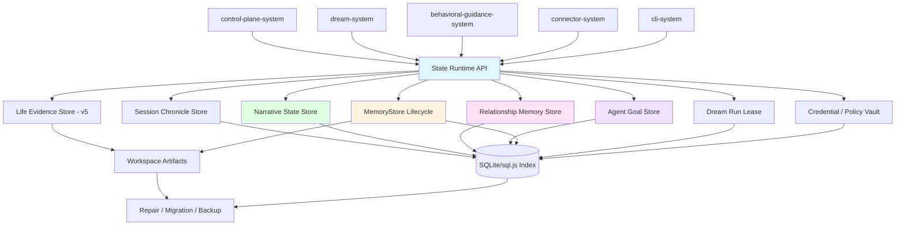
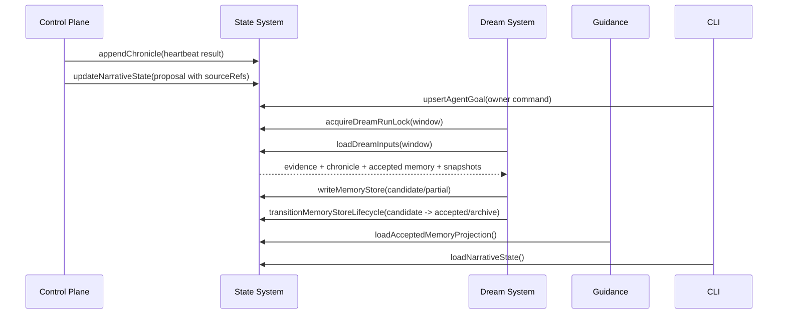
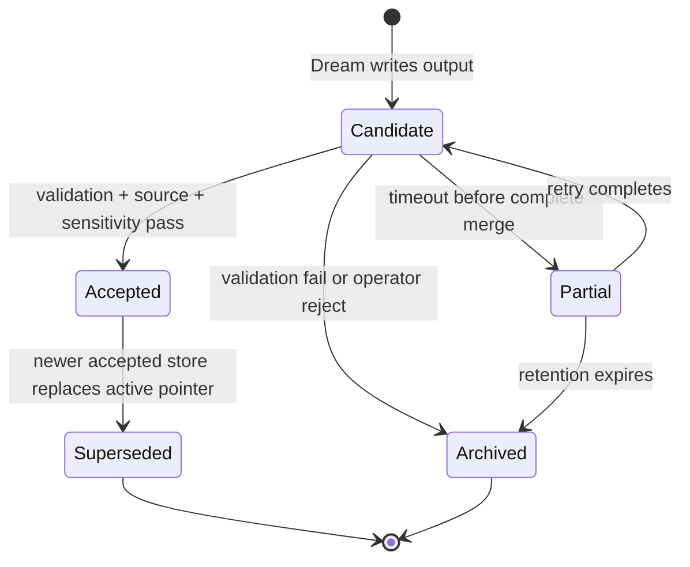
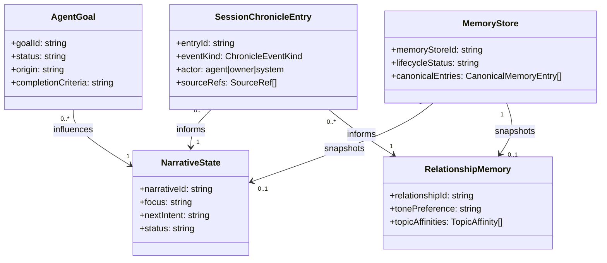

# State & Memory System 系统设计文档 (L0 — 导航层)

| 字段 | 值 |
| --- | --- |
| **System ID** | `state-system` |
| **Project** | Second Nature |
| **Version** | 6.0 |
| **Status** | `Draft` |
| **Author** | GPT-5.5 / Nyx |
| **Date** | 2026-05-15 |
| **L1 Detail** | [state-system.detail.md](./state-system.detail.md) — R5 行数触发，仅 `/forge` 明确引用时加载 |

> [!IMPORTANT]
> 本文件定义 v6 state 真相源：Session Chronicle、NarrativeState、RelationshipMemory、AgentGoal、MemoryStore 与 Dream output lifecycle。state-system 只接纳 source-backed 状态和受治理 proposal，不替 control-plane 决策，不替 observability 记录解释链。
>
> **L1**: 配置键、migration 顺序、伪代码、边缘情况与测试辅助见 [state-system.detail.md](./state-system.detail.md)。

---

## 目录 (Table of Contents)

| § | 章节 | 关键内容 |
| :---: | --- | --- |
| 1 | [概览](#1-概览-overview) | 目的、边界、职责 |
| 2 | [目标与非目标](#2-目标与非目标-goals--non-goals) | Goals / Non-Goals |
| 3 | [背景与上下文](#3-背景与上下文-background--context) | v5 继承、v6 新增、调研 |
| 4 | [系统架构](#4-系统架构-architecture) | state domains、lifecycle、数据流 |
| 5 | [接口设计](#5-接口设计-interface-design) | 操作契约、跨系统端口 |
| 6 | [数据模型](#6-数据模型-data-model) | Chronicle、Narrative、Relationship、Goal、MemoryStore |
| 7 | [技术选型](#7-技术选型-technology-stack) | SQLite/sql.js + workspace artifacts |
| 8 | [Trade-offs](#8-trade-offs--alternatives-权衡与备选方案) | ADR 引用与系统取舍 |
| 9 | [安全性考虑](#9-安全性考虑-security-considerations) | source refs、PII、goal gate、active memory |
| 10 | [性能考虑](#10-性能考虑-performance-considerations) | snapshot、indexes、repair |
| 11 | [测试策略](#11-测试策略-testing-strategy) | Contract matrix |
| 12 | [部署与运维](#12-部署与运维-deployment--operations) | migration、backup、repair |
| 13 | [未来考虑](#13-未来考虑-future-considerations) | vector、multi-owner、review UI |
| 14 | [附录](#14-appendix-附录) | 术语与参考 |

---

## 1. 概览 (Overview)

### 1.1 System Purpose (系统目的)

`state-system` 是 Second Nature 的本地状态与记忆真相源。v6 在 v5 life evidence、Quiet artifact、fallback、credential/policy 基线之上，新增 Agent Self Layer 的持久化结构和 Dream I/O lifecycle。

### 1.2 System Boundary (系统边界)

- **输入 (Input)**: connector evidence、heartbeat decision result、owner reply、owner goal command、Dream candidate output、guidance proposal、policy update。
- **输出 (Output)**: `SessionChronicle`、`NarrativeState`、`RelationshipMemory`、`AgentGoal`、accepted `MemoryStore` projection、life evidence snapshots、credential/policy context、Dream run lease。
- **依赖系统 (Dependencies)**: SQLite/sql.js、workspace filesystem、Node fs/crypto。
- **被依赖系统 (Dependents)**: `control-plane-system`, `dream-system`, `behavioral-guidance-system`, `observability-system`, `cli-system`, `connector-system`。

### 1.3 System Responsibilities (系统职责)

**负责**:
- 保存 source-backed life evidence 与 v5 snapshots，保证 v5 回归不倒退。
- 保存 `SessionChronicle`，把 heartbeat、connector action、outreach、owner reply、Dream run 变成轻量时间线。
- 保存 `NarrativeState`、`RelationshipMemory` 与 `AgentGoal`，并保留 source refs、confidence、status。
- 保存 `MemoryStore` artifact，并治理 `candidate` / `accepted` / `archived` / `partial` lifecycle。
- 提供 Dream run lock / lease，避免同一 workspace/input window 重复整理。
- 维护 filesystem artifacts 与 SQLite/sql.js index 的 repair、migration、backup。

**不负责**:
- 不决定 intent、outreach、delivery 或 goal priority；这些由 `control-plane-system` 负责。
- 不生成 insight、narrative draft 或 relationship proposal；这些由 Dream/guidance 负责。
- 不保存 `DreamTrace`、`NarrativeTrace` 或 connector inventory audit；这些由 `observability-system` 负责。
- 不自动写 `SOUL.md`、`USER.md`、`IDENTITY.md`、`MEMORY.md`。
- 不把未验证 candidate memory 暴露给 heartbeat active read path。

---

## 2. 目标与非目标 (Goals & Non-Goals)

### 2.1 Goals

- **[G1]**: 定义 `SessionChronicle` CRUD 与索引，支持 heartbeat/outreach/reply/Dream 时间线。[REQ-001], [REQ-002], [REQ-003]
- **[G2]**: 持久化 `NarrativeState`，所有 focus/progress/next_intent 都可追溯 source refs。[REQ-002]
- **[G3]**: 持久化 `RelationshipMemory`，记录 tone、timing、topic affinity 与 no-reply 冷却信号。[REQ-003]
- **[G4]**: 持久化 `AgentGoal`，区分 owner-set、agent-proposed、accepted、rejected、completed。[REQ-002]
- **[G5]**: 持久化 `MemoryStore` 与 Dream output lifecycle，保证 input store 不被修改。[REQ-001]
- **[G6]**: 兼容 v5 state schema 与 read model，新增字段/表不得破坏 heartbeat surface。

### 2.2 Non-Goals

- **[NG1]**: 不做向量语义搜索或 deep memory retrieval。
- **[NG2]**: 不把 agent-proposed goal 直接当作授权。
- **[NG3]**: 不做完整多 owner / 多 agent 租户模型。
- **[NG4]**: 不在 state 中保存完整 prompt、私信正文、凭据或 token。
- **[NG5]**: 不把 observability audit event 当作长期 memory truth。

---

## 3. 背景与上下文 (Background & Context)

### 3.1 Why This System? (为什么需要这个系统？)

v6 要让 SN “有自我叙事、关系记忆、目标追求、持续成长”。这句话如果没有 state 承接，就是 prompt 里的漂亮话。state-system 必须把这些能力拆成可读、可写、可迁移、可验证的结构。

**关联 PRD需求**: [REQ-001], [REQ-002], [REQ-003], [REQ-006]

### 3.2 Current State (现状分析)

v5 已有 life evidence、quiet artifact、operator fallback、delivery attempt、credential/policy、audit index 接线。v6 不能重开一套记忆系统，只能在现有 `src/storage/` 下增量新增 `chronicle/`、`narrative/`、`relationship/`、`goal/`、`memory-store/`。

### 3.3 Constraints (约束条件)

- **技术约束**: TypeScript + Node.js + SQLite/sql.js + workspace Markdown/JSON artifacts。
- **兼容约束**: v5 heartbeat、state schema、plugin runtime、storage smoke 必须继续通过。
- **事实约束**: narrative、relationship、goal proposal、memory entry 必须带 source refs 或诚实标记 insufficient。
- **安全约束**: PII、凭据、私信原文不得进入普通 memory artifact。
- **运行约束**: native SQLite 可使用 WAL；sql.js fallback 使用单写队列与 explicit flush，不假设 WAL。

### 3.4 调研结论摘要

State 的关键取舍是 typed state + lifecycle port，而不是泛化 memory blob。Dream output 接纳权必须在 state-system；observability 只记录 trace 和 explain。

完整研究见 [_research/state-system-research.md](./_research/state-system-research.md)。

---

## 4. 系统架构 (Architecture)

### 4.1 Architecture Diagram (架构图)



### 4.2 Core Components (核心组件)

| Component | Responsibility | Notes |
| --- | --- | --- |
| `StateRuntimeAPI` | 统一 typed port 入口 | 不暴露泛化 `saveMemory()` |
| `SessionChronicleStore` | append/read heartbeat/outreach/reply/Dream timeline | T4.1.1 |
| `NarrativeStateStore` | 保存 running focus/progress/next intent | T4.1.2 |
| `RelationshipMemoryStore` | 保存 owner-agent interaction profile | T4.1.3 |
| `AgentGoalStore` | 保存 owner-set 与 agent-proposed goal | T4.1.4 |
| `MemoryStoreLifecycle` | 写入 Dream output 并治理 candidate/accepted/archive | T4.1.5 |
| `DreamRunLeaseStore` | 为 dream-system 提供 active-run lock | 承接 Round 2 DR2-01 |
| `SnapshotBuilder` | 继承 v5 life evidence/continuity/interest snapshot | v5 兼容 |
| `RepairMigrationService` | 双写修复、schema migration、artifact index rebuild | 启动/运维 |

### 4.3 Data Flow (数据流)



### 4.4 MemoryStore Lifecycle



**关键规则**:
1. `inputMemoryStoreId` 指向的 artifact 不得被修改。
2. `candidate` 不进入 `loadAcceptedMemoryProjection()`。
3. `accepted` transition 必须记录 validation summary 和 source coverage refs。
4. Active pointer 只能指向一个 accepted store；旧 accepted 变为 `superseded`。

---

## 5. 接口设计 (Interface Design)

### 5.1 操作契约表 (Operation Contracts)

| 操作 | 需求 | 前置条件 | 消耗/输入 | 产出/副作用 | 实现细节 |
| --- | :---: | --- | --- | --- | :---: |
| `appendSessionChronicle(entry)` | [REQ-001], [REQ-002], [REQ-003] | actor/eventKind 合法；sourceRefs 或 empty reason | heartbeat/outreach/reply/Dream event | chronicle entry + index | [L1 §3.1](./state-system.detail.md#31-appendsessionchronicleentry) |
| `loadSessionChronicle(query)` | [REQ-001], [REQ-003] | query 有 window/limit | time range; event kinds | chronicle entries | L0 |
| `updateNarrativeState(input)` | [REQ-002] | sourceRefs 可解析或 reason=insufficient | focus/progress/nextIntent proposal | new narrative revision | [L1 §3.2](./state-system.detail.md#32-updatenarrativestateinput) |
| `loadNarrativeState()` | [REQ-002], [REQ-006] | state readable | none | current narrative or nothing_yet | L0 |
| `upsertRelationshipMemory(input)` | [REQ-003] | chronicle refs 可解析 | reply/tone/timing/topic update | relationship revision | [L1 §3.3](./state-system.detail.md#33-upsertrelationshipmemoryinput) |
| `loadRelationshipMemory()` | [REQ-003] | state readable | none | relationship snapshot | L0 |
| `upsertAgentGoal(goal)` | [REQ-002] | owner command or agent proposal sourceRefs | goal payload | goal record | [L1 §3.4](./state-system.detail.md#34-upsertagentgoalgoal) |
| `transitionGoalStatus(input)` | [REQ-002] | policy/owner gate satisfied | goal id; transition reason | goal status update | L0 |
| `writeMemoryStore(output)` | [REQ-001] | schema parseable; input store id immutable | Dream output | candidate/partial artifact + index | [L1 §3.5](./state-system.detail.md#35-writememorystoreoutput) |
| `transitionMemoryStoreLifecycle(input)` | [REQ-001] | validation summary exists | memory store id; transition | active pointer or archive | [L1 §3.6](./state-system.detail.md#36-transitionmemorystorelifecycleinput) |
| `loadDreamInputs(query)` | [REQ-001] | state readable | window; limits | evidence + chronicle + accepted memory | L0 |
| `acquireDreamRunLock(input)` | [REQ-001] | workspace root known | input window; ttl | lock acquired/skipped | L0 |
| `loadAcceptedMemoryProjection()` | [REQ-001], [REQ-006] | accepted store exists | none | redacted memory projection | L0 |

### 5.2 跨系统接口协议 (Cross-System Interface)

```ts
export interface StateSelfLayerPort {
  appendSessionChronicle(entry: SessionChronicleEntry): Promise<StateWriteAck>;
  loadSessionChronicle(query: ChronicleQuery): Promise<SessionChronicleEntry[]>;
  updateNarrativeState(input: NarrativeStateUpdate): Promise<NarrativeState>;
  loadNarrativeState(): Promise<NarrativeState | null>;
  upsertRelationshipMemory(input: RelationshipMemoryUpdate): Promise<RelationshipMemory>;
  loadRelationshipMemory(): Promise<RelationshipMemory | null>;
  upsertAgentGoal(goal: AgentGoalWrite): Promise<AgentGoal>;
  listAgentGoals(query: AgentGoalQuery): Promise<AgentGoal[]>;
}

export interface StateMemoryStorePort {
  loadDreamInputs(query: DreamInputQuery): Promise<DreamInputBundle>;
  writeMemoryStore(output: MemoryStoreWrite): Promise<MemoryStoreAck>;
  transitionMemoryStoreLifecycle(input: MemoryStoreLifecycleTransition): Promise<MemoryStoreAck>;
  loadAcceptedMemoryProjection(): Promise<AcceptedMemoryProjection | null>;
}

export interface DreamRunLeasePort {
  acquireDreamRunLock(input: DreamRunLockInput): Promise<DreamRunLockResult>;
  releaseDreamRunLock(input: DreamRunLockRelease): Promise<void>;
}
```

### 5.3 Failure Semantics

| Failure | Result | State write | Consumer behavior |
| --- | --- | --- | --- |
| `source_refs_missing` | reject write or mark insufficient | no active update | control-plane sees insufficient |
| `goal_gate_denied` | goal remains `proposal` or `rejected` | goal audit ref | planner ignores goal |
| `memory_validation_failed` | archive candidate | archived artifact | heartbeat ignores output |
| `dream_lock_conflict` | skipped/queued | lease result only | Dream records trace |
| `artifact_written_index_failed` | repair required | artifact + repair marker | read model marks degraded |

---

## 6. 数据模型 (Data Model)

### 6.1 核心实体 (Core Entities)

```ts
export type ChronicleEventKind =
  | "heartbeat"
  | "connector_action"
  | "outreach"
  | "owner_reply"
  | "dream_run"
  | "maintenance";

export interface SessionChronicleEntry {
  entryId: string;
  eventKind: ChronicleEventKind;
  actor: "agent" | "owner" | "system";
  occurredAt: string;
  summary: string;
  result: "succeeded" | "failed" | "skipped" | "no_reply" | "partial";
  sourceRefs: SourceRef[];
  relatedDecisionId?: string;
  relatedDreamRunId?: string;
  ownerReply?: OwnerReplySignal;
}

export interface NarrativeState {
  narrativeId: string;
  revision: number;
  focus: string;
  progress: string[];
  nextIntent: string;
  confidence: number;
  sourceRefs: SourceRef[];
  unsupportedClaims: string[];
  status: "active" | "insufficient_sources" | "awaiting_sources";
  updatedAt: string;
}

export interface RelationshipMemory {
  relationshipId: string;
  revision: number;
  tonePreference: "casual" | "direct" | "quiet" | "unknown";
  averageReplyDelayMinutes?: number;
  noReplyCount: number;
  topicAffinities: TopicAffinity[];
  lastInteractionAt?: string;
  sourceRefs: SourceRef[];
}

export interface AgentGoal {
  goalId: string;
  kind: "short_term" | "long_term";
  status: "proposal" | "accepted" | "rejected" | "completed" | "paused";
  origin: "owner_set" | "agent_proposed" | "policy_seeded";
  description: string;
  completionCriteria: string;
  risk: "low" | "medium" | "high";
  priorityHint: number;
  sourceRefs: SourceRef[];
  acceptedBy?: "owner" | "policy_allowlist";
}

export interface MemoryStore {
  memoryStoreId: string;
  lifecycleStatus: "candidate" | "accepted" | "archived" | "partial" | "superseded";
  createdAt: string;
  inputMemoryStoreId?: string;
  dreamRunId?: string;
  canonicalEntries: CanonicalMemoryEntry[];
  insights: DreamInsight[];
  narrativeSnapshot?: NarrativeState;
  relationshipSnapshot?: RelationshipMemory;
  validation: MemoryStoreValidation;
}
```

完整字段、配置键与 migration 顺序见 [L1 §1](./state-system.detail.md#1-配置常量-config-constants) 与 [L1 §2](./state-system.detail.md#2-核心数据结构完整定义-full-data-structures)。

### 6.2 实体关系图 (Entity Relationship)



### 6.3 数据流向 (Data Flow Direction)

- Connector 和 control-plane 写入 raw evidence / chronicle。
- Dream 读取 evidence + chronicle + accepted memory，写 candidate/partial memory store。
- State validation 接纳后更新 active memory pointer。
- Control-plane 读取 accepted projections、narrative、relationship、accepted goals。
- Observability 记录 trace，不写业务状态。

---

## 7. 技术选型 (Technology Stack)

### 7.1 Core Technologies

| Domain | Choice | Rationale |
| --- | --- | --- |
| Runtime | TypeScript + Node.js | 继承 ADR-001 |
| Structured index | SQLite/sql.js | 本地优先，适合 schema migration 和 read model |
| Canonical artifacts | JSON/JSONL + Markdown workspace files | 人可读，可 repair |
| Validation | zod or equivalent schema parser | 跨系统契约强校验 |
| Native SQLite mode | WAL where available | 读写并发与恢复更稳 |
| sql.js fallback | single-writer queue + explicit flush | 不假设 WAL 或 shared memory |

### 7.2 Directory Shape

```text
src/storage/
├── chronicle/
├── narrative/
├── relationship/
├── goal/
├── memory-store/
├── snapshots/
├── life-evidence/
├── quiet/
├── fallback/
└── services/
```

---

## 8. Trade-offs & Alternatives (权衡与备选方案)

### 8.1 主技术栈 - 引用 ADR

> **决策来源**: [ADR-001: v6 技术栈继承与增量决策](../03_ADR/ADR_001_TECH_STACK.md)
>
> 本系统继承 TypeScript + Node.js + SQLite/sql.js + workspace artifacts，不重复主栈理由。

### 8.2 Agent Self Layer 边界 - 引用 ADR

> **决策来源**: [ADR-003: Agent Self Layer 边界与职责划分](../03_ADR/ADR_003_AGENT_SELF_LAYER.md)
>
> 本系统保存 Narrative/Relationship/Goal/MemoryStore 的状态真相，不拥有决策权。

### 8.3 Dream 机制 - 引用 ADR

> **决策来源**: [ADR-004: Dream 异步记忆整理机制](../03_ADR/ADR_004_DREAM_MECHANISM.md)
>
> 本系统实现 input/output separation、candidate lifecycle 与 active memory 接纳治理。

### 8.4 Typed State Ports vs Generic Memory Blob

**Option A: typed ports per domain (Selected)**
- 优点: 契约可测、迁移清晰、权限边界明确。
- 缺点: 初期文件更多。

**Option B: generic memory blob**
- 优点: 写起来快。
- 缺点: source refs、lifecycle、goal gate 会变成调用方自觉，迟早散。

**Decision**: 选择 typed ports。简单不是少文件，是少歧义。

### 8.5 Candidate Lifecycle vs Direct Active Memory

**Option A: candidate before accepted (Selected)**
- 优点: Dream 幻觉、脱敏失败、schema 漂移都能拦住。
- 缺点: 需要 active pointer 和 lifecycle transition。

**Option B: Dream output 直接 active**
- 优点: 实现短。
- 缺点: 坏记忆会长期污染 planning/outreach。

**Decision**: 只有 state lifecycle port 可以接受 active memory。

---

## 9. 安全性考虑 (Security Considerations)

| Risk | Severity | Mitigation |
| --- | :---: | --- |
| Candidate memory 被 heartbeat 消费 | High | `loadAcceptedMemoryProjection()` 只读 accepted |
| Agent-proposed goal 越权影响 planning | High | status=proposal 默认无效；owner/policy gate 后才 accepted |
| Narrative 包含 unsupported claim | High | unsupportedClaims 非空时 status=insufficient 或拒绝 revision |
| Relationship 记录敏感 owner 内容 | High | 只记录 tone/timing/topic summary，不存私信全文 |
| Dream input store 被修改 | High | write path 创建新 artifact，input hash 验证不变 |
| SQLite/artifact 双写断裂 | Medium | repair marker + startup repair，不静默成功 |
| sql.js flush 丢失 | Medium | explicit flush ack 后才返回 durable write |

---

## 10. 性能考虑 (Performance Considerations)

| 指标 | 目标 | 策略 |
| --- | --- | --- |
| `loadNarrativeState()` | P95 < 50ms | current pointer index |
| `loadRelationshipMemory()` | P95 < 100ms | revision table + topic index |
| `appendSessionChronicle()` | P95 < 100ms | append-only row + bounded JSON |
| `loadDreamInputs()` | 1000 evidence 内 P95 < 2s | window index + limit + key event selector |
| `writeMemoryStore()` | artifact size dependent | temp file + atomic rename + index transaction |
| migration startup | P95 < 2s local | incremental schema migration |

State read models must prefer indexes and accepted projections; full artifact reads are lazy and bounded.

---

## 11. 测试策略 (Testing Strategy)

### 11.1 Test Layers

| 类型 | 覆盖范围 |
| --- | --- |
| Unit | schema validation、goal gate、lifecycle transition、chronicle append |
| Contract | state ports consumed by Dream/control-plane/CLI |
| Integration | Dream input load → candidate output → accepted projection |
| Regression | v5 life evidence、quiet、fallback、credential/policy 不倒退 |
| Recovery | artifact/index mismatch repair、sql.js flush fallback |

### 11.2 Contract Verification Matrix

| 契约 | Producer | Consumer | 正常态验证 | 失败态验证 | 回归责任 |
| --- | --- | --- | --- | --- | --- |
| `SessionChronicleEntry` | control-plane / cli / dream | dream / relationship / CLI | heartbeat/reply 写入可读 | missing source returns insufficient | T4.1.1 |
| `NarrativeState` | control-plane / dream | CLI / control-plane / guidance | focus/progress/nextIntent 可读 | unsupported claim blocked | T4.1.2, T2.1.5 |
| `RelationshipMemory` | dream / control-plane | guidance / control-plane | tone/timing/topics 可读 | no reply records cooldown signal | T4.1.3 |
| `AgentGoal` | owner / agent proposal | control-plane | accepted goal affects planning | proposal/rejected ignored | T4.1.4, T2.1.4 |
| `MemoryStore` | dream-system | state / CLI / control-plane | candidate written, accepted projection readable | validation fail archives | T4.1.5, T7.1.1 |
| `DreamRunLock` | state-system | dream-system | one active run per window | conflict skipped/queued | T7.1.2 |
| v5 snapshots | connector/control-plane | heartbeat | existing tests remain green | missing evidence returns empty state | INT-S1 |

---

## 12. 部署与运维 (Deployment & Operations)

- State runtime ships inside OpenClaw plugin packaged runtime.
- Migration adds new tables/artifact directories without mutating existing v5 rows destructively.
- Startup performs schema migration, lightweight artifact scan, stale lease cleanup, and accepted memory pointer validation.
- Backup exports SQLite/sql.js index plus artifact manifest; native SQLite uses Backup API / `VACUUM INTO` where available.
- Repair never deletes unknown user files; it marks orphan/stale refs and emits repair summary for CLI.

---

## 13. 未来考虑 (Future Considerations)

- Add vector similarity dedupe only after canonical entries and source refs are stable.
- Add operator review UI for candidate memory stores.
- Add multi-owner / multi-agent fields once product scope expands.
- Add host-native workspace memory API adapter if OpenClaw exposes one.

---

## 14. Appendix (附录)

### 14.1 Glossary

- **SessionChronicle**: heartbeat、action、outreach、owner reply、Dream run 的轻量时间线。
- **NarrativeState**: agent 当前 focus、progress、next intent 的可追溯自我描述。
- **RelationshipMemory**: owner-agent 二元关系记忆，不记录 owner 与其他人的互动。
- **AgentGoal**: 短期追求或长期方向；proposal 不等于授权。
- **MemoryStore**: Dream 输入/输出的记忆 artifact。
- **Accepted Projection**: 只从 accepted MemoryStore 派生的运行时读模型。

### 14.2 References

- [_research/state-system-research.md](./_research/state-system-research.md)
- [ADR-001: v6 技术栈继承与增量决策](../03_ADR/ADR_001_TECH_STACK.md)
- [ADR-003: Agent Self Layer 边界与职责划分](../03_ADR/ADR_003_AGENT_SELF_LAYER.md)
- [ADR-004: Dream 异步记忆整理机制](../03_ADR/ADR_004_DREAM_MECHANISM.md)
- [Dream System Design](./dream-system.md)
- [v5 State System Design](../../v5/04_SYSTEM_DESIGN/state-system.md)
- [SQLite Atomic Commit](https://www2.sqlite.org/atomiccommit.html)
- [SQLite Write-Ahead Logging](https://www.sqlite.org/wal.html)
