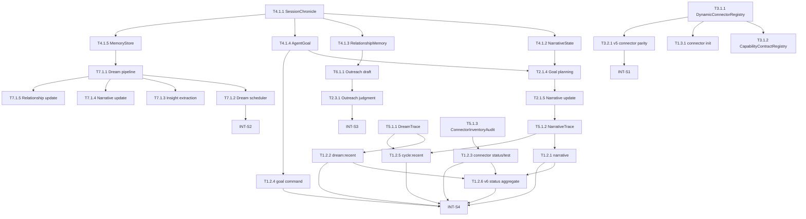

# Second Nature v6 执行主清单 (05A_TASKS)

> **版本**: v6  
> **生成日期**: 2026-05-16  
> **Source of Truth**: `.anws/v6/01_PRD.md`, `.anws/v6/02_ARCHITECTURE_OVERVIEW.md`, `.anws/v6/03_ADR/`, `.anws/v6/04_SYSTEM_DESIGN/`  
> **Verification Plan**: `.anws/v6/05B_VERIFICATION_PLAN.md`  
> **兼容说明**: `.anws/v6/05_TASKS.md` 保留为旧版合并任务草案；后续 `/forge` 与 `/challenge` 以本文件和 `05B_VERIFICATION_PLAN.md` 为准。

---

## Contract Mapping

| 公共契约 | 类型 | 实现承接 | 验证承接 |
| --- | --- | --- | --- |
| `SessionChronicle` schema | 持久化结构 | T4.1.1 | T4.1.1, INT-S1 |
| `NarrativeState` | 状态 / 控制接口 | T4.1.2, T2.1.5 | T4.1.2, T2.1.5, INT-S3 |
| `RelationshipMemory` | 状态接口 | T4.1.3, T7.1.5 | T4.1.3, T7.1.5, INT-S3 |
| `AgentGoal` | 状态 / 授权治理 | T4.1.4, T2.1.4 | T4.1.4, T2.1.4, INT-S3 |
| `MemoryStore` / `DreamOutputLifecycle` | 文件与治理状态 | T4.1.5, T7.1.1 | T4.1.5, T7.1.1, INT-S2 |
| `DreamTrace` | 审计结构 | T5.1.1 | T5.1.1, INT-S4 |
| `NarrativeTrace` | 审计结构 | T5.1.2, T2.1.5 | T5.1.2, INT-S4 |
| `ConnectorInventoryAudit` | 审计结构 | T5.1.3, T3.1.1 | T5.1.3, T1.2.3, INT-S1 |
| `DynamicConnectorRegistry` | 跨系统接口 | T3.1.1 | T3.1.1, INT-S1 |
| `CapabilityContractRegistry` | 跨系统接口 | T3.1.2 | T3.1.2, INT-S1 |
| `manifest.yaml` schema | 配置 / 文件格式 | T3.1.1 | T3.1.1, INT-S1 |
| `ConnectorTrustPolicy` | 安全治理 | T3.1.1 | T3.1.1, T1.2.3, INT-S1 |
| `second-nature connector init` | CLI 操作契约 | T1.3.1 | T1.3.1 |
| `sn narrative` / `sn dream:recent` / `sn connector:status` | CLI / ops surface | T1.2.1, T1.2.2, T1.2.3 | T1.2.1, T1.2.2, T1.2.3, INT-S4 |
| `sn goal` / `sn cycle:recent` / `sn status` | CLI / ops surface | T1.2.4, T1.2.5, T1.2.6 | T1.2.4, T1.2.5, T1.2.6, INT-S4 |
| v5 schema 兼容性 | 回归契约 | 所有 state / connector / ops 任务 | INT-S1, INT-S4 |

---

## Sprint 路线图

| Sprint | 代号 | 核心任务 | 退出标准 | 预估 |
| --- | --- | --- | --- | --- |
| S1 | Foundation & Connector Ecosystem | State schemas, DynamicConnectorRegistry, CapabilityContractRegistry, manifest trust | state 新 schema 可读写；manifest 可解析注册；custom runner 不可执行；v5 回归绿灯 | 7-8d |
| S2 | Dream Engine | Dream pipeline, scheduler, insight/narrative/relationship update, DreamTrace | Dream 可产出 candidate output；timeout/partial/budget 可见；accepted projection 不污染输入 store | 7-8d |
| S3 | Agent Self Integration | goal-directed planning, heartbeat narrative update, narrative outreach draft | accepted goal 可影响 intent；proposal 不越权；outreach 有 source-backed 来由 | 6-7d |
| S4 | Outreach & Observability | CLI/read model, goal/status/cycle ops, connector status/test, documentation/readiness | owner 可通过 CLI 感知 narrative/dream/goal/connector/cycle/status；host-safe/full runtime 语义可验收 | 6-7d |

---

## 依赖图总览

---

## System 1: Agent-facing Ops Surface System (`cli-system`)

### Phase 1: Debug & Narrative Commands

- [ ] **T1.2.1** [REQ-002][REQ-006]: 实现 `sn narrative` 命令
  - **描述**: 让 owner 可读取 agent 当前 NarrativeState 和 narrative explain 摘要。
  - **输入**: `04_SYSTEM_DESIGN/cli-system.md` §5.1；`04_SYSTEM_DESIGN/state-system.md` §NarrativeState；T4.1.2 输出；T5.1.2 输出。
  - **输出**: `narrative` CLI command、`second_nature_ops` route、human formatter。
  - **契约承接**: `sn narrative` CLI / tool 操作契约；host-safe envelope 语义。
  - **参考**: `04_SYSTEM_DESIGN/cli-system.md` §5, §9；`04_SYSTEM_DESIGN/observability-system.md` §NarrativeTrace。
  - **验收标准**:
    - Given NarrativeState 有数据
    - When 运行 `sn narrative`
    - Then 输出 focus、progress、next intent、source refs 与 grounding status
    - Given 无 narrative 数据
    - When 运行 `sn narrative`
    - Then 返回诚实 `nothing_yet` 或 `awaiting_sources`，不返回空对象
  - **验证类型**: API接口功能测试 + 集成测试
  - **验证摘要**: fixture state DB 覆盖有数据、无数据、host-safe unavailable 三条路径。
  - **验证引用**: `05B_VERIFICATION_PLAN.md#t1-2-1`
  - **证据产出**: `tests/integration/cli/t1-2-1-narrative-command.test.ts`
  - **估时**: 3h
  - **依赖**: T4.1.2, T5.1.2
  - **优先级**: P1

- [ ] **T1.2.2** [REQ-001][REQ-006]: 实现 `sn dream:recent` 命令
  - **描述**: 展示最近 Dream 运行结果、candidate/accepted 状态、fallback 与 partial output 摘要。
  - **输入**: `04_SYSTEM_DESIGN/cli-system.md` §5.1；`04_SYSTEM_DESIGN/dream-system.md` §DreamTrace；T5.1.1 输出；T7.1.1 输出。
  - **输出**: `dream:recent` CLI command、tool route、human formatter。
  - **契约承接**: `sn dream:recent` CLI / tool 操作契约；DreamTrace read model。
  - **参考**: `04_SYSTEM_DESIGN/dream-system.md` §12；`04_SYSTEM_DESIGN/observability-system.md` §5。
  - **验收标准**:
    - Given 最近有 Dream 产出
    - When 运行 `sn dream:recent`
    - Then 输出 evidence 整理数、insights 摘要、lifecycle status、fallback reason
    - Given 无 Dream 历史
    - When 运行 `sn dream:recent`
    - Then 返回诚实 `nothing_yet`
  - **验证类型**: API接口功能测试 + 集成测试
  - **验证摘要**: fixture DreamTrace + MemoryStore 覆盖 success、partial、empty。
  - **验证引用**: `05B_VERIFICATION_PLAN.md#t1-2-2`
  - **证据产出**: `tests/integration/cli/t1-2-2-dream-recent-command.test.ts`
  - **估时**: 3h
  - **依赖**: T5.1.1, T7.1.1
  - **优先级**: P1

- [x] **T1.2.3** [REQ-004][REQ-006]: 实现 `sn connector:status` 和 `sn connector:test`
  - **描述**: 显示 connector inventory、trust/executable/conflict，并 dry-run 测试单个 connector。
  - **输入**: `04_SYSTEM_DESIGN/cli-system.md` §5.1；`04_SYSTEM_DESIGN/connector-system.md` §registry / health；T3.1.1 输出；T5.1.3 输出。
  - **输出**: `connector:status`、`connector:test` CLI commands。
  - **契约承接**: `sn connector:status` / `connector:test` 操作契约；ConnectorInventoryAudit read model。
  - **参考**: `04_SYSTEM_DESIGN/cli-system.md` §5, §9；`04_SYSTEM_DESIGN/connector-system.md` §9, §11。
  - **验收标准**:
    - Given 有动态注册 connector
    - When 运行 `sn connector:status`
    - Then 输出 health、trustStatus、executable、conflicts、validationErrors
    - Given pending trust connector
    - When 运行 `sn connector:test --platform {id}`
    - Then 返回 denied/pending_trust，不触发副作用
    - Given executable declarative connector
    - When 运行 dry-run test
    - Then 返回 dry-run result，不提交外部副作用
  - **验证类型**: API接口功能测试 + 集成测试
  - **验证摘要**: 覆盖 executable、pending trust、invalid manifest、conflict。
  - **验证引用**: `05B_VERIFICATION_PLAN.md#t1-2-3`
  - **证据产出**: `tests/integration/cli/t1-2-3-connector-commands.test.ts`
  - **估时**: 4h
  - **依赖**: T3.1.1, T5.1.3
  - **优先级**: P1

- [ ] **T1.2.4** [REQ-002][REQ-006]: 实现 `sn goal set/list/accept/reject` 命令
  - **描述**: 让 owner 通过 CLI / `second_nature_ops` 显式设定、查看、接受或拒绝 AgentGoal，并保持 proposal 与 accepted 的治理边界。
  - **输入**: `04_SYSTEM_DESIGN/cli-system.md` §5.1, §5.3；`04_SYSTEM_DESIGN/state-system.md` §AgentGoal；T4.1.4 输出。
  - **输出**: `goal` CLI command、`second_nature_ops` route、goal human formatter。
  - **契约承接**: `sn goal set/list/accept/reject` 操作契约；owner-governed AgentGoal transition；host-safe envelope 语义。
  - **参考**: `04_SYSTEM_DESIGN/cli-system.md` §5, §9；ADR-003。
  - **验收标准**:
    - Given owner 提供 goal 描述与 completion criteria
    - When 运行 `sn goal set`
    - Then 写入 accepted owner-set goal，并返回 goal id、status、acceptedBy
    - Given agent-proposed goal 存在
    - When 运行 `sn goal accept` 或 `sn goal reject`
    - Then status transition 通过 state port 完成，且 before/after 状态可见
    - Given host-safe carrier 无 workspace full runtime
    - When 调用 `second_nature_ops goal`
    - Then 返回诚实 `runtimeMode=host_safe_carrier` 或 `unavailable`
  - **验证类型**: API接口功能测试 + 集成测试
  - **验证摘要**: 覆盖 set/list/accept/reject、proposal 不默认 accepted、host-safe unavailable 与 before/after 状态断言。
  - **验证引用**: `05B_VERIFICATION_PLAN.md#t1-2-4`
  - **证据产出**: `tests/integration/cli/t1-2-4-goal-command.test.ts`
  - **估时**: 5h
  - **依赖**: T4.1.4
  - **优先级**: P0

- [ ] **T1.2.5** [REQ-006]: 实现 `sn cycle:recent` read model
  - **描述**: 聚合最近 heartbeat decision、narrative update、Dream trigger/result 与 delivery/fallback 摘要，让 owner 能看到 SN 最近的行动链。
  - **输入**: `04_SYSTEM_DESIGN/cli-system.md` §5.1, §5.3；`04_SYSTEM_DESIGN/observability-system.md` §DreamTrace / §NarrativeTrace；T5.1.1、T5.1.2 输出。
  - **输出**: `cycle:recent` CLI command、`second_nature_ops` route、CycleRecent read model。
  - **契约承接**: `sn cycle:recent` 操作契约；recent cycle read model；RuntimeMode envelope。
  - **参考**: `04_SYSTEM_DESIGN/cli-system.md` §5, §6, §11；`04_SYSTEM_DESIGN/observability-system.md` §5。
  - **验收标准**:
    - Given 最近存在 heartbeat decision、narrative trace、DreamTrace 或 delivery/fallback audit
    - When 运行 `sn cycle:recent`
    - Then 输出 cycles，并标明包含 decision、narrative、dream、delivery、connector 中哪些维度
    - Given 缺少部分 trace
    - When 运行 `sn cycle:recent`
    - Then 返回 degraded 或 partial view，不伪造缺失维度
    - Given 无历史记录
    - When 运行 `sn cycle:recent`
    - Then 返回诚实 `nothing_yet`
  - **验证类型**: API接口功能测试 + 集成测试
  - **验证摘要**: fixture audit/read model 覆盖完整、partial、empty 与 host-safe unavailable。
  - **验证引用**: `05B_VERIFICATION_PLAN.md#t1-2-5`
  - **证据产出**: `tests/integration/cli/t1-2-5-cycle-recent-command.test.ts`
  - **估时**: 3h
  - **依赖**: T5.1.1, T5.1.2
  - **优先级**: P1

- [ ] **T1.2.6** [REQ-006]: 实现 v6 `sn status` 聚合视图
  - **描述**: 将 narrative、Dream recent、connector inventory、cycle recent 与 runtime mode 汇总到 v6 status，避免 status 只停留在 v5 heartbeat/ops 摘要。
  - **输入**: `04_SYSTEM_DESIGN/cli-system.md` §5.1, §5.3；T1.2.1、T1.2.2、T1.2.3、T1.2.5 输出。
  - **输出**: v6 `status` aggregate read model、CLI / `second_nature_ops` route、human formatter。
  - **契约承接**: `sn status` / `second_nature_ops status` v6 aggregate 操作契约；redacted read model；RuntimeMode envelope。
  - **参考**: `04_SYSTEM_DESIGN/cli-system.md` §5, §6, §9；`01_PRD.md` US-006。
  - **验收标准**:
    - Given narrative、DreamTrace、connector inventory 与 recent cycle 有数据
    - When 运行 `sn status` 或 `second_nature_ops status`
    - Then 输出最近心跳决策摘要、connector 健康状态、Dream 最近运行结果与 narrative 片段
    - Given 某个 read model 无数据
    - When 运行 status
    - Then 对应区块返回 `nothing_yet` / `awaiting_sources` / `degraded`，不返回空对象
    - Given status 输入含敏感字段引用
    - When formatter 输出
    - Then 不展示 raw prompt、token、credential 或私信正文
  - **验证类型**: API接口功能测试 + 集成测试
  - **验证摘要**: 聚合 read model 覆盖完整、部分缺失、host-safe unavailable 与 redaction。
  - **验证引用**: `05B_VERIFICATION_PLAN.md#t1-2-6`
  - **证据产出**: `tests/integration/cli/t1-2-6-status-aggregate.test.ts`
  - **估时**: 4h
  - **依赖**: T1.2.1, T1.2.2, T1.2.3, T1.2.5
  - **优先级**: P1

### Phase 2: Connector SDK

- [x] **T1.3.1** [REQ-004]: 实现 `second-nature connector init` CLI 命令
  - **描述**: 一行命令生成 connector 骨架：manifest.yaml + adapter stub + types stub，并保证生成物不被自动信任执行。
  - **输入**: `04_SYSTEM_DESIGN/connector-system.md` §SDK/CLI；`04_SYSTEM_DESIGN/cli-system.md` §5.1；ADR-002；T3.1.1 输出的 manifest schema。
  - **输出**: `connector init` CLI implementation、manifest/template files、safe path generator。
  - **契约承接**: `second-nature connector init` CLI 操作契约；workspace connector root path safety；custom adapter pending-trust 规则。
  - **参考**: `04_SYSTEM_DESIGN/connector-system.md` §9, §11；`04_SYSTEM_DESIGN/cli-system.md` §9。
  - **验收标准**:
    - Given 运行 `sn connector init --platform agent-world --base-url https://world.coze.com`
    - When 目标目录不存在
    - Then 生成 `.second-nature/connectors/agent-world/manifest.yaml`、`adapter.ts`、`types.ts`
    - Given 生成的 manifest
    - When SN 启动扫描
    - Then 该 connector 可见但 custom adapter row 为 `custom_adapter_pending_trust` 且 `executable=false`
    - Given 目标文件已存在
    - When 未传显式 overwrite flag
    - Then 命令失败并保留用户文件
    - Given platform path 试图逃逸 workspace connector root
    - When 执行 init
    - Then 返回 path_safety_denied 且不写入文件
  - **验证类型**: API接口功能测试 + 集成测试
  - **验证摘要**: 覆盖生成成功、pending trust、安全不覆盖、路径逃逸拒绝。
  - **验证引用**: `05B_VERIFICATION_PLAN.md#t1-3-1`
  - **证据产出**: `tests/integration/cli/t1-3-1-connector-init.test.ts`
  - **估时**: 6h
  - **依赖**: T3.1.1
  - **优先级**: P1

---

## System 2: Second Nature Orchestration System (`control-plane-system`)

- [ ] **T2.1.4** [REQ-002]: 实现 Goal-Directed Intent Planning
  - **描述**: 让 intent planning 读取 accepted AgentGoal 和 NarrativeState，提升相关 intent 优先级。
  - **输入**: `04_SYSTEM_DESIGN/control-plane-system.md` §5；T4.1.2 输出；T4.1.4 输出。
  - **输出**: `planCandidateIntents()` goal-directed branch、priority reason model。
  - **契约承接**: accepted `AgentGoal` -> intent priority influence；proposal 不越权。
  - **参考**: ADR-003；`04_SYSTEM_DESIGN/control-plane-system.md` §4, §5。
  - **验收标准**:
    - Given accepted AgentGoal 为 `完善 EvoMap profile`
    - When intent planning 执行
    - Then EvoMap 相关 intent 优先级提升，且 reason 引用 goal
    - Given goal 与 rhythm window 冲突且 user task 存在
    - When planning 执行
    - Then user task > accepted goal > rhythm
    - Given goal 为 proposal 或 rejected
    - When planning 执行
    - Then goal 不影响 candidate priority
  - **验证类型**: 单元测试 + 集成测试
  - **验证摘要**: 表驱动覆盖 accepted/proposal/rejected 与 user task precedence。
  - **验证引用**: `05B_VERIFICATION_PLAN.md#t2-1-4`
  - **证据产出**: `tests/unit/control-plane/t2-1-4-goal-priority.test.ts`
  - **估时**: 5h
  - **依赖**: T4.1.2, T4.1.4
  - **优先级**: P0

- [ ] **T2.1.5** [REQ-002]: 实现 heartbeat 后 NarrativeState 更新
  - **描述**: 每次 heartbeat effect/fallback 后写入 source-backed narrative revision 或诚实空态。
  - **输入**: `04_SYSTEM_DESIGN/control-plane-system.md` §5；T4.1.2 输出；T5.1.2 输出接口。
  - **输出**: `updateNarrativeAfterEffect()`、heartbeat runner integration。
  - **契约承接**: heartbeat -> NarrativeState update；NarrativeTrace grounding。
  - **参考**: `04_SYSTEM_DESIGN/control-plane-system.md` §5.3；`04_SYSTEM_DESIGN/observability-system.md` §NarrativeTrace。
  - **验收标准**:
    - Given heartbeat 执行 connector action
    - When heartbeat 完成
    - Then narrative focus/progress 反映该 action 且含 source refs
    - Given heartbeat 无候选 intent
    - When heartbeat 完成
    - Then narrative 更新为 `awaiting_sources` 或等价诚实状态
    - Given narrative proposal 含 unsupported claim
    - When 写入 narrative
    - Then state 拒绝或 degraded，NarrativeTrace 记录 unsupportedClaims
  - **验证类型**: 单元测试 + 集成测试
  - **验证摘要**: 覆盖 success、awaiting_sources、unsupported claim degraded。
  - **验证引用**: `05B_VERIFICATION_PLAN.md#t2-1-5`
  - **证据产出**: `tests/integration/control-plane/t2-1-5-narrative-update.test.ts`
  - **估时**: 4h
  - **依赖**: T2.1.4, T4.1.2
  - **优先级**: P0

- [ ] **T2.3.1** [REQ-005]: 实现 Outreach v6 judgment 集成
  - **描述**: outreach judgment 通过后，生成 source-backed narrative draft request 并保持 delivery / hard guard 边界。
  - **输入**: `04_SYSTEM_DESIGN/control-plane-system.md` §outreach；`04_SYSTEM_DESIGN/behavioral-guidance-system.md` §draftNarrativeOutreach；T6.1.1 输出。
  - **输出**: outreach judgment v6 integration、draft request wiring。
  - **契约承接**: outreach draft 须包含来由、interest、relationship、source refs；hard guard 不被 goal/narrative 绕过。
  - **参考**: ADR-003；`04_SYSTEM_DESIGN/control-plane-system.md` §5, §9。
  - **验收标准**:
    - Given evidence 与 narrative/interest/relationship 匹配
    - When outreach judgment 通过
    - Then draft request 含发生了什么、为什么感兴趣、source refs
    - Given delivery policy 或 cooldown 拒绝
    - When outreach judgment 执行
    - Then 不生成投递请求，仅记录 denied/deferred reason
  - **验证类型**: 单元测试 + 集成测试
  - **验证摘要**: 覆盖 allow、policy denied、insufficient_history。
  - **验证引用**: `05B_VERIFICATION_PLAN.md#t2-3-1`
  - **证据产出**: `tests/integration/control-plane/t2-3-1-outreach-v6.test.ts`
  - **估时**: 5h
  - **依赖**: T6.1.1, T2.1.4
  - **优先级**: P0

---

## System 3: Platform Connector System (`connector-system`)

- [x] **T3.1.1** [REQ-004]: 实现 DynamicConnectorRegistry
  - **描述**: 扫描 `.second-nature/connectors/` manifest.yaml，safe parse、validate、classify trust 并发布 immutable registry snapshot。
  - **输入**: `04_SYSTEM_DESIGN/connector-system.md` §4-§6；ADR-002。
  - **输出**: `DynamicConnectorRegistry`、`ConnectorManifestValidator`、`RegistrySnapshotStore`。
  - **契约承接**: `DynamicConnectorRegistry`；`manifest.yaml` schema；`ConnectorTrustPolicy`；conflict fail-closed。
  - **参考**: `04_SYSTEM_DESIGN/connector-system.md` §5, §9, §11。
  - **验收标准**:
    - Given valid manifest
    - When reload runs
    - Then platform appears in registry snapshot
    - Given invalid manifest
    - Then startup continues and inventory records validation error
    - Given duplicate platformId without override
    - Then existing entry remains active and conflict is recorded
    - Given custom adapter / skill / browser runner
    - Then registered row is pending trust and not executable
  - **验证类型**: 单元测试 + 集成测试
  - **验证摘要**: safe YAML parse、schema failure、atomic snapshot、pending trust。
  - **验证引用**: `05B_VERIFICATION_PLAN.md#t3-1-1`
  - **证据产出**: `tests/unit/connectors/t3-1-1-dynamic-registry.test.ts`, `tests/integration/connectors/t3-1-1-registry-reload.test.ts`
  - **估时**: 8h
  - **依赖**: 无
  - **优先级**: P0

- [x] **T3.1.2** [REQ-004]: 实现 CapabilityContractRegistry 开放注册/命名空间
  - **描述**: 支持 `platformId:capability` 命名空间，同时保留 v5 explicit platform request。
  - **输入**: `04_SYSTEM_DESIGN/connector-system.md` §CapabilityContractRegistry；T3.1.1 snapshot 输出。
  - **输出**: `CapabilityContractRegistry.register()`、route planner namespace resolver。
  - **契约承接**: `platformId:capability` route contract；v5 compatibility route contract。
  - **参考**: ADR-002；`04_SYSTEM_DESIGN/connector-system.md` §5, §8。
  - **验收标准**:
    - Given 注册 `agent-world:feed.read`
    - When route planner 解析 intent
    - Then 识别 `agent-world` 并路由到对应 manifest
    - Given v5 capability + explicit platformId
    - When route planner 解析
    - Then v5 路由仍可用
  - **验证类型**: 单元测试 + API接口功能测试
  - **验证摘要**: 覆盖 namespaced 与 v5 explicit platform 两类 API。
  - **验证引用**: `05B_VERIFICATION_PLAN.md#t3-1-2`
  - **证据产出**: `tests/unit/connectors/t3-1-2-capability-registry.test.ts`
  - **估时**: 5h
  - **依赖**: T3.1.1
  - **优先级**: P0

- [x] **T3.2.1** [REQ-004]: 验证 v5 connector 动态注册 parity
  - **描述**: 将 Moltbook/InStreet/EvoMap connector 表达为 manifest parity fixtures 并验证行为一致。
  - **输入**: v5 connector implementation；T3.1.1 registry；T3.1.2 route planner。
  - **输出**: 3 个 parity manifest fixture、regression tests。
  - **契约承接**: v5 connector behavior compatibility；LifeEvidenceCandidate source refs。
  - **参考**: `04_SYSTEM_DESIGN/connector-system.md` §11。
  - **验收标准**:
    - Given v5 connector parity manifest
    - When dynamic route 执行相同 capability
    - Then normalized result 与 v5 hardcoded path 一致
    - Given side-effecting capability 无 idempotency key
    - When retryable failure occurs
    - Then no automatic retry
  - **验证类型**: 回归测试 + 集成测试
  - **验证摘要**: 覆盖 read capability、side-effect idempotency、source refs。
  - **验证引用**: `05B_VERIFICATION_PLAN.md#t3-2-1`
  - **证据产出**: `tests/integration/connectors/t3-2-1-v5-parity.test.ts`
  - **估时**: 4h
  - **依赖**: T3.1.1, T3.1.2
  - **优先级**: P1

---

## System 4: State & Memory System (`state-system`)

- [x] **T4.1.1** [REQ-001][REQ-002][REQ-003]: 实现 SessionChronicle 持久化层
  - **描述**: 新增 chronicle entry schema、append/read API 与索引。
  - **输入**: `04_SYSTEM_DESIGN/state-system.md` §SessionChronicle；ADR-004。
  - **输出**: `SessionChronicle` schema、store、CRUD、index。
  - **契约承接**: `SessionChronicle` 持久化结构；source refs 或 explicit insufficient reason。
  - **参考**: `04_SYSTEM_DESIGN/state-system.md` §5, §6。
  - **验收标准**:
    - Given heartbeat decision chronicle entry
    - When append then read
    - Then who/what/when/result/sourceRefs 完整返回
    - Given owner reply chronicle entry
    - Then relationship-relevant tone/timing fields can be queried
  - **验证类型**: 单元测试 + API接口功能测试
  - **验证摘要**: 覆盖 append/read、missing source insufficient、owner reply projection。
  - **验证引用**: `05B_VERIFICATION_PLAN.md#t4-1-1`
  - **证据产出**: `tests/unit/storage/t4-1-1-session-chronicle.test.ts`
  - **估时**: 4h
  - **依赖**: 无
  - **优先级**: P0

- [x] **T4.1.2** [REQ-002]: 实现 NarrativeState 持久化层
  - **描述**: 存储 running focus、progress、next intent、source refs、confidence 和 status。
  - **输入**: `04_SYSTEM_DESIGN/state-system.md` §NarrativeState；ADR-003；T4.1.1 output。
  - **输出**: `NarrativeState` schema、store、current pointer、CRUD。
  - **契约承接**: `NarrativeState` 状态结构；unsupported claim handling。
  - **参考**: `04_SYSTEM_DESIGN/state-system.md` §5, §6, §9。
  - **验收标准**:
    - Given source-backed narrative update
    - When write then load
    - Then focus/progress/nextIntent/status/sourceRefs 返回完整
    - Given unsupportedClaims 非空
    - Then write is rejected or stored as insufficient_sources according to policy
  - **验证类型**: 单元测试 + API接口功能测试
  - **验证摘要**: before/after state assertions and unsupported claim failure.
  - **验证引用**: `05B_VERIFICATION_PLAN.md#t4-1-2`
  - **证据产出**: `tests/unit/storage/t4-1-2-narrative-state.test.ts`
  - **估时**: 3h
  - **依赖**: T4.1.1
  - **优先级**: P0

- [x] **T4.1.3** [REQ-003]: 实现 RelationshipMemory 持久化层
  - **描述**: 存储 owner-agent tone、timing、topic affinity、no-reply cooldown signal。
  - **输入**: `04_SYSTEM_DESIGN/state-system.md` §RelationshipMemory；ADR-003；T4.1.1 output。
  - **输出**: `RelationshipMemory` schema、store、CRUD、topic index。
  - **契约承接**: `RelationshipMemory` 状态结构；single-sample over-inference guard。
  - **参考**: `04_SYSTEM_DESIGN/state-system.md` §5, §6；`04_SYSTEM_DESIGN/behavioral-guidance-system.md` §9。
  - **验收标准**:
    - Given owner reply with tone/delay/topic summary
    - When upsert relationship memory
    - Then tone distribution, reply delay, topic affinity can be read
    - Given no reply signal
    - Then cooldown signal is recorded without inventing preference
  - **验证类型**: 单元测试 + API接口功能测试
  - **验证摘要**: 覆盖 reply/no_reply and confidence/source refs.
  - **验证引用**: `05B_VERIFICATION_PLAN.md#t4-1-3`
  - **证据产出**: `tests/unit/storage/t4-1-3-relationship-memory.test.ts`
  - **估时**: 3h
  - **依赖**: T4.1.1
  - **优先级**: P0

- [x] **T4.1.4** [REQ-002]: 实现 AgentGoal 持久化层
  - **描述**: 存储 owner-set 与 agent-proposed goals，区分 proposal、accepted、rejected、completed。
  - **输入**: `04_SYSTEM_DESIGN/state-system.md` §AgentGoal；ADR-003；T4.1.1 output。
  - **输出**: `AgentGoal` schema、store、goal status transition API。
  - **契约承接**: `AgentGoal` status lifecycle；owner/policy gate。
  - **参考**: ADR-003；`04_SYSTEM_DESIGN/state-system.md` §5, §6, §9。
  - **验收标准**:
    - Given owner-set goal with completion criteria
    - When write then list
    - Then goal is accepted and includes completion criteria
    - Given agent-proposed goal
    - Then status is proposal by default
    - Given low risk + completionCriteria + policy allowlist
    - When transition runs
    - Then goal can become accepted with `acceptedBy=policy_allowlist`
  - **验证类型**: 单元测试 + API接口功能测试
  - **验证摘要**: before/after assertions for status transitions and gate denial.
  - **验证引用**: `05B_VERIFICATION_PLAN.md#t4-1-4`
  - **证据产出**: `tests/unit/storage/t4-1-4-agent-goal.test.ts`
  - **估时**: 4h
  - **依赖**: T4.1.1
  - **优先级**: P0

- [x] **T4.1.5** [REQ-001]: 实现 MemoryStore 与 Dream output lifecycle
  - **描述**: 保存 Dream input/output store，治理 candidate、accepted、archived、partial 与 active pointer。
  - **输入**: `04_SYSTEM_DESIGN/state-system.md` §MemoryStore；`04_SYSTEM_DESIGN/dream-system.md` §DreamOutputLifecycle；ADR-004。
  - **输出**: `MemoryStoreLifecycle`、write/read API、accepted projection API。
  - **契约承接**: input store immutable；candidate lifecycle；accepted projection only。
  - **参考**: `04_SYSTEM_DESIGN/state-system.md` §4.4, §5, §9。
  - **验收标准**:
    - Given input MemoryStore
    - When Dream writes output
    - Then output is new candidate artifact and input hash remains unchanged
    - Given validation passes
    - When transition accepted
    - Then accepted projection changes and validation summary is recorded
    - Given validation fails
    - Then candidate archives and active pointer remains unchanged
  - **验证类型**: 单元测试 + API接口功能测试 + 集成测试
  - **验证摘要**: lifecycle transition before/after, immutable input hash, accepted projection.
  - **验证引用**: `05B_VERIFICATION_PLAN.md#t4-1-5`
  - **证据产出**: `tests/integration/storage/t4-1-5-memory-store-lifecycle.test.ts`
  - **估时**: 4h
  - **依赖**: T4.1.1
  - **优先级**: P0

---

## System 5: Observability & Safety System (`observability-system`)

- [ ] **T5.1.1** [REQ-001][REQ-006]: 实现 DreamTrace 审计层
  - **描述**: 记录 Dream input size、output counts、duration、cost、budget status、fallback reason、lifecycle。
  - **输入**: `04_SYSTEM_DESIGN/observability-system.md` §DreamTrace；T7.1.1 output。
  - **输出**: `recordDreamTrace()`、schema、query/read model。
  - **契约承接**: `DreamTrace` audit structure；RedactionManifest。
  - **参考**: `04_SYSTEM_DESIGN/observability-system.md` §5, §6, §9。
  - **验收标准**:
    - Given Dream run completes
    - When query DreamTrace
    - Then input/output/cost/duration/lifecycle are visible
    - Given budget near limit
    - Then budget_status is `approaching_limit`
    - Given trace contains prompt/private fields
    - Then redaction manifest erases or contentRefs sensitive paths
  - **验证类型**: 单元测试 + API接口功能测试
  - **验证摘要**: schema validation, redaction fixture, query read model.
  - **验证引用**: `05B_VERIFICATION_PLAN.md#t5-1-1`
  - **证据产出**: `tests/unit/observability/t5-1-1-dream-trace.test.ts`
  - **估时**: 3h
  - **依赖**: T7.1.1
  - **优先级**: P1

- [ ] **T5.1.2** [REQ-002][REQ-006]: 实现 NarrativeTrace 审计层
  - **描述**: 记录 narrative revision source coverage、unsupportedClaims、goalInfluenceRefs、groundingStatus。
  - **输入**: `04_SYSTEM_DESIGN/observability-system.md` §NarrativeTrace；T2.1.5 output。
  - **输出**: `recordNarrativeTrace()`、schema、narrative explain/read model。
  - **契约承接**: `NarrativeTrace` audit structure；DR3-01 回流项。
  - **参考**: `04_SYSTEM_DESIGN/observability-system.md` §5, §6。
  - **验收标准**:
    - Given NarrativeState revision written
    - When query NarrativeTrace
    - Then narrativeId、revision、sourceRefs、groundingStatus、goalInfluenceRefs are returned
    - Given unsupported claim was blocked
    - Then trace records unsupportedClaims and degraded/blocked status
  - **验证类型**: 单元测试 + API接口功能测试
  - **验证摘要**: success and unsupported claim blocked read model.
  - **验证引用**: `05B_VERIFICATION_PLAN.md#t5-1-2`
  - **证据产出**: `tests/unit/observability/t5-1-2-narrative-trace.test.ts`
  - **估时**: 3h
  - **依赖**: T2.1.5, T4.1.2
  - **优先级**: P1

- [x] **T5.1.3** [REQ-004][REQ-006]: 实现 ConnectorInventoryAudit 审计层
  - **描述**: 记录 connector scan/reload 的 scanned、registered、skipped、conflicts、validationErrors、trust/executable summary。
  - **输入**: `04_SYSTEM_DESIGN/observability-system.md` §ConnectorInventoryAudit；T3.1.1 output。
  - **输出**: `recordConnectorInventory()`、inventory read model、status query API。
  - **契约承接**: `ConnectorInventoryAudit` audit structure；DR3-01 回流项。
  - **参考**: `04_SYSTEM_DESIGN/observability-system.md` §5, §6；`04_SYSTEM_DESIGN/connector-system.md` §11。
  - **验收标准**:
    - Given reload scans three manifests with one invalid
    - When query inventory audit
    - Then scanned=3、registered=2、skipped=1 and validationErrors visible
    - Given custom adapter is pending trust
    - Then executable=false appears in read model
    - Given platform conflict
    - Then conflict appears in inventory, not execution telemetry
  - **验证类型**: 单元测试 + API接口功能测试
  - **验证摘要**: inventory snapshot schema, conflict classification, pending trust view.
  - **验证引用**: `05B_VERIFICATION_PLAN.md#t5-1-3`
  - **证据产出**: `tests/unit/observability/t5-1-3-connector-inventory.test.ts`
  - **估时**: 3h
  - **依赖**: T3.1.1
  - **优先级**: P1

---

## System 6: Behavioral Guidance System (`behavioral-guidance-system`)

- [ ] **T6.1.1** [REQ-005]: 实现 Narrative Outreach Draft 生成
  - **描述**: 生成包含发生了什么、为什么 owner 可能感兴趣、source refs 的 source-backed draft。
  - **输入**: `04_SYSTEM_DESIGN/behavioral-guidance-system.md` §draftNarrativeOutreach；T4.1.2 output；T4.1.3 output。
  - **输出**: `draftNarrativeOutreach()`、GroundingReport、promptVersion。
  - **契约承接**: narrative outreach draft schema；GroundingReport；redaction before model call。
  - **参考**: `04_SYSTEM_DESIGN/behavioral-guidance-system.md` §5, §9。
  - **验收标准**:
    - Given evidence + narrative + relationship
    - When draft is generated
    - Then draft includes what happened, why it matters, and source refs
    - Given source refs missing
    - Then draft is blocked or degraded with unsupportedClaims
    - Given relationship insufficient
    - Then tone uses honest `insufficient_history`
  - **验证类型**: 单元测试 + 集成测试
  - **验证摘要**: grounded success, missing source blocked, insufficient relationship tone.
  - **验证引用**: `05B_VERIFICATION_PLAN.md#t6-1-1`
  - **证据产出**: `tests/unit/guidance/t6-1-1-narrative-outreach.test.ts`
  - **估时**: 5h
  - **依赖**: T4.1.2, T4.1.3
  - **优先级**: P0

---

## System 7: Dream System (`dream-system`)

- [ ] **T7.1.1** [REQ-001]: 实现 Dream Pipeline
  - **描述**: Dream core: rules consolidate -> sampling -> redaction -> optional model -> validation -> candidate output。
  - **输入**: `04_SYSTEM_DESIGN/dream-system.md` §pipeline；ADR-004；T4.1.1-T4.1.5 outputs。
  - **输出**: `dream-engine.ts`、`memory-consolidator.ts`、`dream-validator.ts`。
  - **契约承接**: `DreamOutput`; input/output separation; candidate lifecycle; budget gate。
  - **参考**: `04_SYSTEM_DESIGN/dream-system.md` §5, §6, §9。
  - **验收标准**:
    - Given evidence + chronicle + input memory store
    - When Dream runs
    - Then candidate output contains canonical entries and at least one of insight/narrative/relationship update when sources support it
    - Then input store hash is unchanged
    - Given budget exceeded
    - Then rules-only candidate and fallback reason are recorded
    - Given unsupported model claim
    - Then output is rejected/archived or claim is removed before acceptance
  - **验证类型**: 单元测试 + 集成测试
  - **验证摘要**: rules path, model fallback, validation failure, input immutability.
  - **验证引用**: `05B_VERIFICATION_PLAN.md#t7-1-1`
  - **证据产出**: `tests/integration/dream/t7-1-1-dream-pipeline.test.ts`
  - **估时**: 12h
  - **依赖**: T4.1.1, T4.1.2, T4.1.3, T4.1.4, T4.1.5
  - **优先级**: P0

- [ ] **T7.1.2** [REQ-001]: 实现 Dream 调度器
  - **描述**: 支持 cron、evidence threshold、manual trigger，并通过 DreamRunLock 避免同 window 重复运行。
  - **输入**: `04_SYSTEM_DESIGN/dream-system.md` §scheduleDream；`04_SYSTEM_DESIGN/state-system.md` §DreamRunLease；T7.1.1 output。
  - **输出**: `dream-scheduler.ts`、trigger policy、lease integration。
  - **契约承接**: Dream trigger contract；DreamRunLock；operator timeout / partial output。
  - **参考**: ADR-004；`04_SYSTEM_DESIGN/dream-system.md` §5, §12。
  - **验收标准**:
    - Given cron trigger due
    - When scheduler runs
    - Then Dream starts async and heartbeat is not blocked
    - Given same workspace/input window already has active run
    - Then scheduler returns skipped/queued with trace
    - Given operator timeout
    - Then partial output is retained and timeout trace is recorded
  - **验证类型**: 集成测试 + 冒烟测试
  - **验证摘要**: async trigger, lock conflict, timeout partial.
  - **验证引用**: `05B_VERIFICATION_PLAN.md#t7-1-2`
  - **证据产出**: `tests/integration/dream/t7-1-2-dream-scheduler.test.ts`
  - **估时**: 4h
  - **依赖**: T7.1.1
  - **优先级**: P0

- [ ] **T7.1.3** [REQ-001]: 实现 Insight Extraction
  - **描述**: 从 sampled evidence 中提取 source-grounded insight candidates。
  - **输入**: `04_SYSTEM_DESIGN/dream-system.md` §insight extraction；`04_SYSTEM_DESIGN/behavioral-guidance-system.md` §ModelAssistPort；T7.1.1 output。
  - **输出**: `extractInsights()`、prompt contract、mockable model adapter。
  - **契约承接**: insight candidate schema；redaction before model call；budget fallback。
  - **参考**: `04_SYSTEM_DESIGN/behavioral-guidance-system.md` §5, §9。
  - **验收标准**:
    - Given sampled evidence
    - When insight extraction runs
    - Then each insight has type, description, confidence, sourceRefs
    - Given PII/credential in input
    - Then model receives redacted content refs only
    - Given model unavailable
    - Then rules-only fallback returns honest unavailable reason
  - **验证类型**: 单元测试 + 集成测试
  - **验证摘要**: mock model success, redaction, unavailable fallback.
  - **验证引用**: `05B_VERIFICATION_PLAN.md#t7-1-3`
  - **证据产出**: `tests/unit/dream/t7-1-3-insight-extraction.test.ts`
  - **估时**: 6h
  - **依赖**: T7.1.1
  - **优先级**: P0

- [ ] **T7.1.4** [REQ-001][REQ-002]: 实现 Narrative Update proposal
  - **描述**: 基于 evidence + insight 生成 narrative update proposal，不直接绕过 state validation。
  - **输入**: `04_SYSTEM_DESIGN/dream-system.md` §narrative update；T4.1.2 output；T7.1.1 output。
  - **输出**: `draftNarrativeFromDream()`、NarrativeUpdateProposal。
  - **契约承接**: NarrativeUpdateProposal schema；source-backed claim contract。
  - **参考**: `04_SYSTEM_DESIGN/dream-system.md` §5；`04_SYSTEM_DESIGN/state-system.md` §NarrativeState。
  - **验收标准**:
    - Given evidence + insights
    - When narrative update proposal is generated
    - Then focus/progress/nextIntent claims are source-backed
    - Given unsupported claim appears
    - Then proposal is degraded/blocked before state acceptance
  - **验证类型**: 单元测试
  - **验证摘要**: source-backed success and unsupported claim failure.
  - **验证引用**: `05B_VERIFICATION_PLAN.md#t7-1-4`
  - **证据产出**: `tests/unit/dream/t7-1-4-narrative-update.test.ts`
  - **估时**: 4h
  - **依赖**: T7.1.1
  - **优先级**: P0

- [ ] **T7.1.5** [REQ-001][REQ-003]: 实现 Relationship Update proposal
  - **描述**: 基于 chronicle 生成 relationship update proposal，并防止单样本过度推断。
  - **输入**: `04_SYSTEM_DESIGN/dream-system.md` §relationship update；T4.1.3 output；T7.1.1 output。
  - **输出**: `draftRelationshipFromDream()`、RelationshipUpdateProposal。
  - **契约承接**: RelationshipUpdateProposal schema；confidence/sourceRefs/no_reply semantics。
  - **参考**: `04_SYSTEM_DESIGN/behavioral-guidance-system.md` §9；`04_SYSTEM_DESIGN/state-system.md` §RelationshipMemory。
  - **验收标准**:
    - Given chronicle contains owner reply
    - When relationship update proposal is generated
    - Then tone/timing/topic deltas include sourceRefs and confidence
    - Given owner no-reply signal
    - Then proposal records cooldown signal without inventing preference
  - **验证类型**: 单元测试
  - **验证摘要**: reply/no-reply and no over-inference.
  - **验证引用**: `05B_VERIFICATION_PLAN.md#t7-1-5`
  - **证据产出**: `tests/unit/dream/t7-1-5-relationship-update.test.ts`
  - **估时**: 4h
  - **依赖**: T7.1.1
  - **优先级**: P0

---

## INT 里程碑任务

- [ ] **INT-S1** [MILESTONE][REQ-004]: S1 集成验证 — Foundation & Connector Ecosystem
  - **描述**: 验证 state schema、dynamic connector registry、trust policy、v5 parity 的 S1 退出标准。
  - **输入**: T3.1.1, T3.1.2, T3.2.1, T4.1.1-T4.1.5, T5.1.3 产出。
  - **输出**: `reports/int-s1-v6-foundation-connector.md`
  - **契约承接**: state schemas、manifest schema、ConnectorTrustPolicy、v5 compatibility。
  - **验收标准**:
    - Given S1 tasks completed
    - When run unit/API/integration suites and connector registry smoke
    - Then state new schema works, manifest registers, custom runner pending trust, v5 regression passes
  - **验证类型**: 冒烟测试 + 回归测试
  - **验证摘要**: S1 关门任务；失败则不得标记 S1 完成。
  - **验证引用**: `05B_VERIFICATION_PLAN.md#int-s1`
  - **证据产出**: `reports/int-s1-v6-foundation-connector.md`
  - **估时**: 4h
  - **依赖**: T3.2.1, T4.1.5, T5.1.3
  - **优先级**: P0

- [ ] **INT-S2** [MILESTONE][REQ-001]: S2 集成验证 — Dream Engine
  - **描述**: 验证 Dream pipeline、scheduler、lifecycle、trace 和 partial/timeout 行为。
  - **输入**: T7.1.1-T7.1.5, T5.1.1, T1.2.2 产出。
  - **输出**: `reports/int-s2-v6-dream-engine.md`
  - **契约承接**: DreamOutputLifecycle、DreamRunLock、DreamTrace、redaction/budget/timeout。
  - **验收标准**:
    - Given S2 tasks completed
    - When execute Dream smoke with normal, empty, timeout, model unavailable fixtures
    - Then candidate/partial/accepted semantics and DreamTrace evidence are correct
  - **验证类型**: 冒烟测试 + 集成测试
  - **验证摘要**: S2 关门任务；验证 active memory 不消费 candidate。
  - **验证引用**: `05B_VERIFICATION_PLAN.md#int-s2`
  - **证据产出**: `reports/int-s2-v6-dream-engine.md`
  - **估时**: 4h
  - **依赖**: T7.1.5, T5.1.1, T1.2.2
  - **优先级**: P0

- [ ] **INT-S3** [MILESTONE][REQ-002][REQ-003][REQ-005]: S3 集成验证 — Agent Self Integration
  - **描述**: 验证 accepted goal planning、narrative update、relationship-aware outreach draft。
  - **输入**: T2.1.4, T2.1.5, T2.3.1, T6.1.1, T5.1.2 产出。
  - **输出**: `reports/int-s3-v6-agent-self.md`
  - **契约承接**: user task > accepted goal > rhythm；NarrativeTrace；source-backed outreach。
  - **验收标准**:
    - Given accepted goal and relationship memory exist
    - When heartbeat/outreach flow runs
    - Then goal affects candidate priority, proposal goals do not, draft contains source-backed reason
  - **验证类型**: 冒烟测试 + 集成测试
  - **验证摘要**: S3 关门任务；覆盖 goal governance 与 outreach 来由。
  - **验证引用**: `05B_VERIFICATION_PLAN.md#int-s3`
  - **证据产出**: `reports/int-s3-v6-agent-self.md`
  - **估时**: 4h
  - **依赖**: T2.3.1, T5.1.2
  - **优先级**: P0

- [ ] **INT-S4** [MILESTONE][REQ-006]: S4 集成验证 — Ops Surface & Host Readiness
  - **描述**: 验证 narrative、goal、dream:recent、connector:status、cycle:recent、status 与 host-safe/full runtime envelope。
  - **输入**: T1.2.1-T1.2.6, T5.1.1, T5.1.2, T5.1.3 产出。
  - **输出**: `reports/int-s4-v6-ops-host-readiness.md`
  - **契约承接**: JSON-first ops surface、RuntimeMode、redacted read models、v5 INT-S4 non-regression。
  - **验收标准**:
    - Given workspace full runtime is available
    - When invoking v6 ops commands
    - Then each returns structured JSON data and human formatter output
    - Given host-safe carrier cannot access workspace
    - When invoking ops commands
    - Then response truthfully reports `runtimeMode=host_safe_carrier` or `unavailable`
  - **验证类型**: 冒烟测试 + 手动验证 + 回归测试
  - **验证摘要**: S4 关门任务；真实宿主验证仅记录触发与证据预期，实机执行由 `/forge` 承接。
  - **验证引用**: `05B_VERIFICATION_PLAN.md#int-s4`
  - **证据产出**: `reports/int-s4-v6-ops-host-readiness.md`
  - **估时**: 4h
  - **依赖**: T1.2.1, T1.2.2, T1.2.3, T1.2.4, T1.2.5, T1.2.6
  - **优先级**: P0

---

## User Story Overlay

| User Story | 任务链 | 独立可测 | 状态 |
| --- | --- | :---: | :---: |
| US-001 Dream 异步记忆整理 | T4.1.1 -> T4.1.5 -> T7.1.1 -> T7.1.2 -> T7.1.3 -> T7.1.4 -> T7.1.5 -> T5.1.1 -> T1.2.2 -> INT-S2 | 是 | Planned |
| US-002 Agent 自我叙事与目标追求 | T4.1.2 -> T4.1.4 -> T1.2.4 -> T2.1.4 -> T2.1.5 -> T5.1.2 -> T7.1.4 -> T1.2.1 -> INT-S3 | 是 | Planned |
| US-003 与 owner 的关系记忆 | T4.1.3 -> T7.1.5 -> T6.1.1 -> T2.3.1 -> INT-S3 | 是 | Planned |
| US-004 Connector Ecosystem 动态扩展 | T3.1.1 -> T3.1.2 -> T3.2.1 -> T5.1.3 -> T1.3.1 -> T1.2.3 -> INT-S1 | 是 | Planned |
| US-005 Outreach 有叙事来由 | T2.1.4 -> T2.1.5 -> T6.1.1 -> T2.3.1 -> INT-S3 | 是 | Planned |
| US-006 可观测性消费 | T5.1.1 -> T5.1.2 -> T5.1.3 -> T1.2.1 -> T1.2.2 -> T1.2.3 -> T1.2.4 -> T1.2.5 -> T1.2.6 -> INT-S4 | 是 | Planned |

---

## 任务统计

- Level 3 任务数: 27
- INT 任务数: 4
- 总任务数: 31
- P0 任务: 21
- P1 任务: 10
- P2 任务: 0
- 总预估工时: 138h
