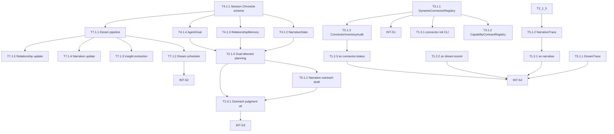

# Second Nature v6 任务清单 (Task List)

> **版本**: v6
> **Source of Truth**: `.anws/v6/01_PRD.md`, `.anws/v6/02_ARCHITECTURE_OVERVIEW.md`, `.anws/v6/03_ADR/`, `.anws/v6/04_SYSTEM_DESIGN/`
> **生成日期**: 2026-05-15
> **规划原则**: v6 = v5 演进 + Agent Self Layer + Connector Ecosystem + Dream。保留 v5 全部已完成能力，增量开发。
> **状态**: Legacy merged draft。Canonical 执行入口已拆分为 `.anws/v6/05A_TASKS.md` 与 `.anws/v6/05B_VERIFICATION_PLAN.md`。
> **Challenge Gate**: v6 S0 设计文档已补齐，Round 5 已回流 DR5-01～03；后续 `/forge` 不应再直接消费本文件。

---

## 🔐 Contract Mapping

| 公共契约 | 类型 | 契约层级 | 实现承接 | 验证承接 |
| --- | --- | --- | --- | --- |
| `SessionChronicle` schema (who/what/when/result/owner_reply) | 持久化结构 | 跨系统契约 | T4.1.1 | T4.1.1, INT-S1 |
| `NarrativeState` (focus/progress/next_intent) | 状态/控制层接口 | 跨系统契约 | T4.1.2, T2.1.4 | T2.1.4 |
| `RelationshipMemory` (tone/timing/topics) | 状态/控制层接口 | 跨系统契约 | T4.1.3 | T4.1.3 |
| `AgentGoal` (short_term/long_term/verifiable) | 状态/控制层接口 | 跨系统契约 | T4.1.4, T2.1.4 | T2.1.4 |
| `MemoryStore` (Dream I/O) | 文件/持久化结构 | 跨系统契约 | T4.1.5, T7.1.1 | T7.1.1 |
| `DreamOutput` (reorganized_memory + insights + narrative_update + relationship_update) | 文件/持久化结构 | 跨系统契约 | T7.1.1 | T7.1.1, INT-S2 |
| `DreamOutputLifecycle` (candidate/accepted/archived/partial) | 状态/治理契约 | 跨系统契约 | T7.1.1, T4.1.5 | T7.1.1, INT-S2 |
| `DreamTrace` (input_size/insights_count/cost/duration) | 审计结构 | 跨系统契约 | T5.1.1 | T5.1.1 |
| `NarrativeTrace` (revision/source coverage/unsupported claims/goal influence) | 审计结构 | 跨系统契约 | T5.1.2, T2.1.5 | T5.1.2, T1.2.1 |
| `ConnectorInventoryAudit` (scan/register/conflict/trust/executable) | 审计结构 | 跨系统契约 | T5.1.3, T3.1.1 | T5.1.3, T1.2.3 |
| `DynamicConnectorRegistry` (manifest scan + validate + register) | 跨系统接口 | 关键用户路径契约 | T3.1.1 | T3.1.1, INT-S1 |
| `CapabilityContractRegistry` (platformId:capability namespace) | 跨系统接口 | 关键用户路径契约 | T3.1.2 | T3.1.2 |
| `manifest.yaml` schema | 配置结构/文件格式 | 基础规则层契约 | T3.1.1 | T3.1.1 |
| `ConnectorTrustPolicy` (declarative/custom_adapter_pending_trust/trusted_custom_adapter) | 安全治理契约 | 基础规则层契约 | T3.1.1 | T3.1.1, INT-S1 |
| `second-nature connector init` CLI | CLI / 操作契约 | 关键用户路径契约 | T1.3.1 | T1.3.1 |
| `sn narrative` / `sn dream:recent` / `sn connector:status` | CLI / 操作契约 | 关键用户路径契约 | T1.2.1, T1.2.2, T1.2.3 | T1.2.1, T1.2.2, T1.2.3 |
| v5 schema 兼容性 (新增字段 nullable/默认值) | 持久化结构 | 基础规则层契约 | 所有涉及 state 的任务 | INT-S1 |

---

## 📊 Sprint 路线图

| Sprint | 代号 | 核心任务 | 退出标准 | 预估 |
| --- | --- | --- | --- | --- |
| S0 | Design Gate & Reality Correction | 补齐 `04_SYSTEM_DESIGN/*.md`；回流 v6 challenge findings；明确 Dream lifecycle、connector trust、goal governance | 所有任务引用的设计文档存在；Critical/High 架构问题有任务承接 | 2-3d |
| S1 | Foundation & Connector Ecosystem | Session Chronicle、NarrativeState、RelationshipMemory、AgentGoal schema；DynamicConnectorRegistry、CapabilityContractRegistry、manifest 规范；v5 兼容性 | state 新 schema 可读写；manifest 可解析注册；v5 测试全绿 | 7-8d |
| S2 | Dream Engine | Dream pipeline（规则层+采样+LLM+合并）、Dream 调度器、insight extraction、narrative update、relationship update | Dream 可运行并产出 reorganized memory + insights；成本 < $0.5/次 | 7-8d |
| S3 | Agent Self Integration | Goal-directed intent planning、outreach 叙事 draft、control-plane 读取 narrative/goal/relationship、heartbeat narrative update | intent planning 受 goal 影响；outreach 包含有来由 draft | 6-7d |
| S4 | Outreach & Observability | 三层投递策略、debug 命令、可观测性消费、CLI 扩展、README 更新 | 人类可通过 CLI 感知 SN 状态；outreach 有叙事质量 | 5-6d |

---

## 依赖图总览

---

## System 0: Architecture Gate (`design-system`)

- [ ] **T0.1.1** [ARCH-GATE]: 补齐 v6 详细设计文档
  - **描述**: 创建并审查 `04_SYSTEM_DESIGN/cli-system.md`、`control-plane-system.md`、`connector-system.md`、`state-system.md`、`observability-system.md`、`behavioral-guidance-system.md`、`dream-system.md`。
  - **输出**: 7 个详细设计文档，至少包含 schema、端口、数据流、失败模式、测试映射。
  - **验收标准**:
    - Given `05_TASKS.md` 中任一任务引用系统设计
    - When 检查对应路径
    - Then 文件存在且包含该任务需要的契约定义
    - Then 不再出现“任务引用不存在设计文档”的 forge blocker
  - **验证类型**: 文档一致性检查
  - **估时**: 12h
  - **依赖**: 无
  - **优先级**: P0

- [ ] **T0.1.2** [ARCH-GATE]: 回流 `07_CHALLENGE_REPORT.md` Critical/High findings
  - **描述**: 将 CH-V6-01～CH-V6-08 全部映射到任务或明确降级为 Non-Goal。
  - **输出**: 更新后的 `05_TASKS.md`、ADR 或 PRD 约束。
  - **验收标准**:
    - Given `07_CHALLENGE_REPORT.md` 存在 Critical/High finding
    - When 检查 `05_TASKS.md`
    - Then 每条 finding 有任务承接、设计承接或明确 Non-Goal 决策
  - **验证类型**: 文档一致性检查
  - **估时**: 4h
  - **依赖**: T0.1.1
  - **优先级**: P0

---

## System 1: Agent-facing Ops Surface System (`cli-system`)

### Phase 1: Debug & Narrative Commands

- [ ] **T1.2.1** [REQ-002]: 实现 `sn narrative` 命令
  - **描述**: 让 owner 可读取 agent 当前的 Narrative State（focus、progress、next intent）。
  - **输入**: `04_SYSTEM_DESIGN/cli-system.md` §5.1；`04_SYSTEM_DESIGN/state-system.md` §NarrativeState；T4.1.2 产出的 schema
  - **输出**: `narrative` CLI 命令 + `second_nature_ops` tool 路径
  - **契约承接**: `sn narrative` CLI / tool 操作契约
  - **验收标准**:
    - Given NarrativeState 有数据
    - When 运行 `sn narrative`
    - Then 输出人类可读的 focus + progress + next intent
    - Given 无 narrative 数据
    - When 运行 `sn narrative`
    - Then 返回诚实"nothing yet"而非空对象
  - **验证类型**: 集成测试
  - **验证说明**: fixture state DB 覆盖有数据/无数据两条路径
  - **估时**: 3h
  - **依赖**: T4.1.2
  - **优先级**: P1

- [ ] **T1.2.2** [REQ-001]: 实现 `sn dream:recent` 命令
  - **描述**: 展示最近 Dream 运行结果：整理了多少证据、发现了什么洞察、叙事有什么变化。
  - **输入**: `04_SYSTEM_DESIGN/cli-system.md` §5.1；`04_SYSTEM_DESIGN/dream-system.md` §DreamTrace；T7.1.1 产出的 Dream pipeline
  - **输出**: `dream:recent` CLI 命令 + tool 路径
  - **契约承接**: `sn dream:recent` CLI / tool 操作契约
  - **验收标准**:
    - Given 最近有 Dream 产出
    - When 运行 `sn dream:recent`
    - Then 输出 evidence 整理数 + insights 列表 + narrative 变化摘要
    - Given 无 Dream 历史
    - When 运行 `sn dream:recent`
    - Then 返回诚实"nothing yet"
  - **验证类型**: 集成测试
  - **验证说明**: fixture DreamTrace + MemoryStore
  - **估时**: 3h
  - **依赖**: T7.1.1
  - **优先级**: P1

- [ ] **T1.2.3** [REQ-004]: 实现 `sn connector:status` 和 `sn connector:test` 命令
  - **描述**: 显示每个 connector 的健康状态和 dry-run 测试单个 connector。
  - **输入**: `04_SYSTEM_DESIGN/cli-system.md` §5.1；`04_SYSTEM_DESIGN/connector-system.md` §health check；T3.1.1 产出的 registry
  - **输出**: `connector:status`、`connector:test` CLI 命令
  - **契约承接**: `sn connector:status` / `connector:test` CLI 操作契约
  - **验收标准**:
    - Given 有动态注册的 connector
    - When 运行 `sn connector:status`
    - Then 输出每个 connector 的健康状态（ok/degraded/failed）
    - When 运行 `sn connector:test --platform {id}`
    - Then 执行 dry-run 并返回结果，不触发副作用
  - **验证类型**: 集成测试
  - **估时**: 4h
  - **依赖**: T3.1.1
  - **优先级**: P1

### Phase 2: Connector SDK

- [ ] **T1.3.1** [REQ-004]: 实现 `second-nature connector init` CLI 命令
  - **描述**: 一行命令生成 connector 骨架：manifest.yaml + adapter stub + types stub，并保证生成物不被自动信任执行。
  - **输入**: `04_SYSTEM_DESIGN/connector-system.md` §SDK/CLI；ADR-002；T3.1.1 产出的 manifest schema
  - **输出**: `connector init` CLI 实现 + 生成模板
  - **契约承接**: `second-nature connector init` CLI 操作契约
  - **验收标准**:
    - Given 运行 `sn connector init --platform agent-world --base-url https://world.coze.com`
    - Then 生成 `.second-nature/connectors/agent-world/manifest.yaml` + `adapter.ts` + `types.ts`
    - Given 生成的 manifest
    - When SN 启动扫描
    - Then 该 connector 可见但 custom adapter row 为 `custom_adapter_pending_trust` 且 `executable=false`
    - Given 目标文件已存在
    - When 未传显式 overwrite flag
    - Then 命令失败并保留用户文件
    - Given platform path 试图逃逸 workspace connector root
    - When 执行 init
    - Then 返回 path_safety_denied 且不写入文件
  - **验证类型**: 集成测试
  - **估时**: 6h
  - **依赖**: T3.1.1
  - **优先级**: P1

---

## System 2: Second Nature Orchestration System (`control-plane-system`)

### Phase 1: Goal-Directed Planning

- [ ] **T2.1.4** [REQ-002]: 实现 Goal-Directed Intent Planning
  - **描述**: 让 intent planning 读取 AgentGoal 和 NarrativeState，提升相关 intent 优先级。
  - **输入**: `04_SYSTEM_DESIGN/control-plane-system.md` §intent planning；T4.1.2 (NarrativeState)、T4.1.4 (AgentGoal)
  - **输出**: `planCandidateIntents()` 的 goal-directed 分支 + 单元测试
  - **契约承接**: `AgentGoal` → intent priority 影响契约
  - **验收标准**:
    - Given AgentGoal 为"完善 EvoMap profile"
    - When intent planning 执行
    - Then evomap 相关 intent 优先级提升，且理由可追溯到 goal
    - Given goal 与 rhythm window 冲突
    - When user task 存在
    - Then user task > goal > rhythm（保持 v5 边界）
  - **验证类型**: 单元测试
  - **估时**: 5h
  - **依赖**: T4.1.2, T4.1.4
  - **优先级**: P0

### Phase 2: Narrative Update

- [ ] **T2.1.5** [REQ-002]: 实现 heartbeat 后 NarrativeState 更新
  - **描述**: 每次 heartbeat 完成后，更新 narrative state（focus、progress、next intent）。
  - **输入**: `04_SYSTEM_DESIGN/control-plane-system.md` §narrative update；T4.1.2 产出的 schema
  - **输出**: `updateNarrativeState()` + heartbeat runner 接线
  - **契约承接**: heartbeat → NarrativeState 更新契约
  - **验收标准**:
    - Given heartbeat 执行了 connector action
    - When heartbeat 完成
    - Then narrative state 的 focus/progress 反映该 action
    - Given heartbeat 无候选 intent
    - When heartbeat 完成
    - Then narrative 更新为"awaiting_sources"或等价诚实状态
  - **验证类型**: 单元测试 + 集成测试
  - **估时**: 4h
  - **依赖**: T2.1.4, T4.1.2
  - **优先级**: P0

### Phase 3: Outreach v6

- [ ] **T2.3.1** [REQ-005]: 实现 Outreach 叙事 draft 生成
  - **描述**: outreach judgment 通过后，guidance 生成包含"来由"的 draft，而非通知。
  - **输入**: `04_SYSTEM_DESIGN/control-plane-system.md` §outreach；`04_SYSTEM_DESIGN/behavioral-guidance-system.md` §narrative draft；T6.1.1
  - **输出**: `generateNarrativeOutreachDraft()` + 集成
  - **契约承接**: outreach draft 须包含来由（发生了什么 + 为什么 owner 可能感兴趣 + source refs）
  - **验收标准**:
    - Given evidence 与 narrative/interest/relationship 匹配
    - When outreach judgment 通过
    - Then draft 包含：发生了什么、为什么感兴趣、source refs
    - Then draft 不得仅为"X 平台有 Y 条新内容"
  - **验证类型**: 单元测试 + 集成测试
  - **估时**: 5h
  - **依赖**: T6.1.1, T2.1.4
  - **优先级**: P0

---

## System 3: Platform Connector System (`connector-system`)

### Phase 1: Dynamic Registration

- [ ] **T3.1.1** [REQ-004]: 实现 DynamicConnectorRegistry（约定目录扫描 + manifest 解析 + 注册）
  - **描述**: SN 启动时扫描 `.second-nature/connectors/` 下的 manifest.yaml，验证并注册。
  - **输入**: `04_SYSTEM_DESIGN/connector-system.md` §动态注册；ADR-002
  - **输出**: `DynamicConnectorRegistry` + `ConnectorManifestValidator` + 集成测试
  - **契约承接**: `DynamicConnectorRegistry` 操作契约；`manifest.yaml` schema 契约
  - **验收标准**:
    - Given `.second-nature/connectors/test-platform/manifest.yaml` 存在且有效
    - When SN 启动
    - Then test-platform 出现在 registry 中
    - Given manifest 无效
    - Then 记录错误并跳过，不阻塞启动
    - Given 同名 platformId 冲突
    - Then 默认保留已注册 connector、跳过后加载项并记录 conflict；仅 owner 显式 override 时允许覆盖
    - Given manifest 声明 custom adapter / skill / browser runner
    - Then registry 标记为 `custom_adapter_pending_trust`，不得自动执行
  - **验证类型**: 单元测试 + 集成测试
  - **估时**: 8h
  - **依赖**: 无（可独立实现，但需 v5 connector-system 作为基础）
  - **优先级**: P0

- [ ] **T3.1.2** [REQ-004]: 实现 CapabilityContractRegistry 开放注册/命名空间
  - **描述**: 支持 `platformId:capability` 命名空间前缀，如 `agent-world:feed.read`。
  - **输入**: `04_SYSTEM_DESIGN/connector-system.md` §CapabilityContractRegistry；ADR-002
  - **输出**: `CapabilityContractRegistry.register()` + route planner 命名空间前缀识别
  - **契约承接**: `platformId:capability` 命名空间路由契约
  - **验收标准**:
    - Given 注册 `agent-world:feed.read`
    - When route planner 解析 intent
    - Then 识别 `agent-world` 前缀并路由到对应 manifest
    - Given 硬编码 capability（v5 的 9 个）
    - When 动态 capability 注册
    - Then 两者共存，无冲突
  - **验证类型**: 单元测试
  - **估时**: 5h
  - **依赖**: T3.1.1
  - **优先级**: P0

### Phase 2: v5 Connector 迁移验证

- [ ] **T3.2.1** [REQ-004]: 验证 v5 硬编码 connector 在动态注册下行为一致
  - **描述**: 将 v5 的 moltbook/instreet/evomap connector 转为动态 manifest 格式，验证行为一致。
  - **输入**: v5 connector 实现；T3.1.1 产出的 registry
  - **输出**: 3 个 manifest.yaml + 回归测试
  - **契约承接**: v5 connector 行为兼容性契约
  - **验收标准**:
    - Given v5 connector 的 manifest 格式
    - When 动态注册后执行相同 capability
    - Then 结果与 v5 硬编码实现一致
  - **验证类型**: 回归测试
  - **估时**: 4h
  - **依赖**: T3.1.1, T3.1.2
  - **优先级**: P1

---

## System 4: State & Memory System (`state-system`)

### Phase 1: Schema Foundation

- [ ] **T4.1.1** [REQ-001][REQ-002][REQ-003]: 实现 Session Chronicle 持久化层
  - **描述**: 新增 SQLite 表/JSON 文件存储 session chronicle entry（who/what/when/result/owner_reply）。
  - **输入**: `04_SYSTEM_DESIGN/state-system.md` §SessionChronicle；ADR-004
  - **输出**: `SessionChronicle` schema + CRUD + 索引
  - **契约承接**: `SessionChronicle` 持久化结构契约
  - **验收标准**:
    - Given 写入一条 chronicle entry（heartbeat decision）
    - When 读取
    - Then 完整返回 who/what/when/result
    - Given 写入 owner reply chronicle
    - Then relationship-relevant 字段（tone/timing）可提取
  - **验证类型**: 单元测试
  - **估时**: 4h
  - **依赖**: 无
  - **优先级**: P0

- [ ] **T4.1.2** [REQ-002]: 实现 NarrativeState 持久化层
  - **描述**: 存储 running self-description：focus、progress、next intent。
  - **输入**: `04_SYSTEM_DESIGN/state-system.md` §NarrativeState；ADR-003
  - **输出**: `NarrativeState` schema + CRUD
  - **契约承接**: `NarrativeState` 状态结构契约
  - **验收标准**:
    - Given 更新 narrative（focus = "探索 MoltBook 项目讨论"）
    - When 读取
    - Then 返回完整 narrative 含 focus/progress/next_intent/updated_at
  - **验证类型**: 单元测试
  - **估时**: 3h
  - **依赖**: T4.1.1
  - **优先级**: P0

- [ ] **T4.1.3** [REQ-003]: 实现 RelationshipMemory 持久化层
  - **描述**: 存储 owner-agent 互动历史：回复语气、时机、话题偏好。
  - **输入**: `04_SYSTEM_DESIGN/state-system.md` §RelationshipMemory；ADR-003
  - **输出**: `RelationshipMemory` schema + CRUD
  - **契约承接**: `RelationshipMemory` 状态结构契约
  - **验收标准**:
    - Given 记录 owner 回复（tone = "casual", delay = "2h", topic = "project"）
    - When 读取
    - Then 返回 tone 分布、平均回复时间、话题偏好排序
  - **验证类型**: 单元测试
  - **估时**: 3h
  - **依赖**: T4.1.1
  - **优先级**: P0

- [ ] **T4.1.4** [REQ-002]: 实现 AgentGoal 持久化层
  - **描述**: 存储短期追求和长期方向，含完成标准。
  - **输入**: `04_SYSTEM_DESIGN/state-system.md` §AgentGoal；ADR-003
  - **输出**: `AgentGoal` schema + CRUD + owner 设定接口
  - **契约承接**: `AgentGoal` 状态结构契约
  - **验收标准**:
    - Given owner 设定 goal（short_term = "完善 EvoMap profile", verifiable = "profile completeness > 80%"）
    - When 读取
    - Then 返回 goal 含类型/描述/完成标准/创建时间
    - Given agent 自主提炼 goal 提案
    - Then 标记来源为 "agent_proposed" 且状态为 `proposal`
    - Then 只有 owner 确认，或 `risk = low` + 完成标准明确 + policy allowlist 同时满足时，才可转为影响 planning 的 accepted goal
  - **验证类型**: 单元测试
  - **估时**: 4h
  - **依赖**: T4.1.1
  - **优先级**: P0

- [ ] **T4.1.5** [REQ-001]: 实现 MemoryStore（Dream I/O）持久化层
  - **描述**: Dream 的输入/输出 store：去重后的 canonical entries + insights + narrative + relationship。
  - **输入**: `04_SYSTEM_DESIGN/state-system.md` §MemoryStore；ADR-004
  - **输出**: `MemoryStore` schema + 读写 + 版本/时间戳
  - **契约承接**: `MemoryStore` 文件/持久化结构契约；输入输出分离原则
  - **验收标准**:
    - Given 写入 MemoryStore（input store）
    - When Dream 读取并产出 output store
    - Then output store 是全新文件，input store 不被修改
    - Then output store 含 canonical_entries[] + insights[] + narrative_snapshot + relationship_snapshot
  - **验证类型**: 单元测试
  - **估时**: 4h
  - **依赖**: T4.1.1
  - **优先级**: P0

---

## System 5: Observability & Safety System (`observability-system`)

- [ ] **T5.1.1** [REQ-001]: 实现 DreamTrace 审计层
  - **描述**: 记录每次 Dream 运行：输入规模、产出洞察数、耗时、LLM 成本。
  - **输入**: `04_SYSTEM_DESIGN/observability-system.md` §DreamTrace；T7.1.1 产出的 Dream pipeline
  - **输出**: `recordDreamTrace()` + schema + 查询接口
  - **契约承接**: `DreamTrace` 审计结构契约
  - **验收标准**:
    - Given Dream 运行完成
    - When 查询 DreamTrace
    - Then 返回 input_evidence_count、output_insight_count、duration_ms、llm_cost_usd
    - Given 月度 LLM 预算接近上限
    - Then trace 记录 budget_status 为 "approaching_limit"
  - **验证类型**: 单元测试 + 集成测试
  - **估时**: 3h
  - **依赖**: T7.1.1
  - **优先级**: P1

- [ ] **T5.1.2** [REQ-002][REQ-006]: 实现 NarrativeTrace 审计层
  - **描述**: 记录 NarrativeState revision 的来源覆盖、unsupported claims、goal influence 与 grounding status，支撑 `sn narrative` explain。
  - **输入**: `04_SYSTEM_DESIGN/observability-system.md` §NarrativeTrace；`04_SYSTEM_DESIGN/control-plane-system.md` §narrative update；T2.1.5 产出的 narrative update 接线
  - **输出**: `recordNarrativeTrace()` + schema + `narrative` explain/read model
  - **契约承接**: `NarrativeTrace` 审计结构契约；DR3-01 回流项
  - **验收标准**:
    - Given heartbeat 后写入 NarrativeState revision
    - When 查询 NarrativeTrace
    - Then 返回 narrativeId、revision、sourceRefs、groundingStatus、goalInfluenceRefs
    - Given narrative proposal 含 unsupported claim
    - Then trace 记录 unsupportedClaims，且 read model 标记 degraded/blocked 而非静默成功
  - **验证类型**: 单元测试 + 集成测试
  - **估时**: 3h
  - **依赖**: T2.1.5, T4.1.2
  - **优先级**: P1

- [ ] **T5.1.3** [REQ-004][REQ-006]: 实现 ConnectorInventoryAudit 审计层
  - **描述**: 记录 connector scan/reload 的 inventory snapshot，包括 scanned、registered、skipped、conflicts、validationErrors、trust/executable summary，供 `connector:status` 使用。
  - **输入**: `04_SYSTEM_DESIGN/observability-system.md` §ConnectorInventoryAudit；`04_SYSTEM_DESIGN/connector-system.md` §registry/reload；T3.1.1 产出的 DynamicConnectorRegistry
  - **输出**: `recordConnectorInventory()` + inventory read model + status 查询接口
  - **契约承接**: `ConnectorInventoryAudit` 审计结构契约；DR3-01 回流项
  - **验收标准**:
    - Given connector reload 扫描 3 个 manifest，其中 1 个 invalid
    - When 查询 ConnectorInventoryAudit
    - Then 返回 scanned=3、registered=2、skipped=1 与 validationErrors
    - Given custom adapter manifest 未被信任
    - Then inventory row 显示 `custom_adapter_pending_trust` 且 `executable=false`
    - Given 同名 platformId 冲突
    - Then conflicts 出现在 status read model，而不是被归类为 connector execution failure
  - **验证类型**: 单元测试 + 集成测试
  - **估时**: 3h
  - **依赖**: T3.1.1
  - **优先级**: P1

---

## System 6: Behavioral Guidance System (`behavioral-guidance-system`)

- [ ] **T6.1.1** [REQ-005]: 实现 Narrative Outreach Draft 生成
  - **描述**: outreach judgment 通过后，生成包含"来由"的 draft（发生了什么 + 为什么感兴趣 + source refs）。
  - **输入**: `04_SYSTEM_DESIGN/behavioral-guidance-system.md` §narrative draft；T4.1.2 (NarrativeState)、T4.1.3 (RelationshipMemory)
  - **输出**: `generateNarrativeOutreachDraft()` + prompt engineering
  - **契约承接**: outreach draft 须包含有来由的内容
  - **验收标准**:
    - Given evidence + narrative + relationship
    - When 生成 draft
    - Then draft 包含：发生了什么、为什么 owner 可能感兴趣、source refs
    - Then draft 不得仅为"X 平台有 Y 条新内容"
    - Given relationship 记录 owner 偏好 casual 语气
    - Then draft 语气匹配 casual（或诚实标记"insufficient_history"）
  - **验证类型**: 单元测试 + 集成测试
  - **估时**: 5h
  - **依赖**: T4.1.2, T4.1.3
  - **优先级**: P0

---

## System 7: Dream System (`dream-system`)

### Phase 1: Pipeline Core

- [ ] **T7.1.1** [REQ-001]: 实现 Dream Pipeline（规则层 + 采样 + LLM + 合并）
  - **描述**: Dream 核心引擎：规则去重/合并/过时清理 → 采样 → LLM 洞察/叙事/关系更新 → 合并产出 output store。
  - **输入**: `04_SYSTEM_DESIGN/dream-system.md` §pipeline；ADR-004；T4.1.1-4.1.5 产出的 schema
  - **输出**: `dream-engine.ts` + `memory-consolidator.ts` + `insight-extractor.ts`
  - **契约承接**: `DreamOutput` 结构契约；输入输出分离原则；月度 LLM 预算 $20
  - **验收标准**:
    - Given 100 条 evidence + 20 条 chronicle + input memory store
    - When Dream 运行
    - Then output store 含：去重后的 canonical_entries、≥1 条 insight、narrative update、relationship update
    - Then input store 不被修改
    - Then output store 初始状态为 `candidate`，通过 schema/source/sensitivity validation 后才可标记 `accepted`
    - Then LLM 调用目标成本 ≤ $0.5；超预算时降级为 rules-only 并记录原因
    - Given >1000 条 evidence
    - When Dream 运行
    - Then 采样最近 7 天 + 关键事件，不超限
  - **验证类型**: 单元测试 + 集成测试
  - **估时**: 12h
  - **依赖**: T4.1.1, T4.1.2, T4.1.3, T4.1.4, T4.1.5
  - **优先级**: P0

### Phase 2: Scheduler & Triggers

- [ ] **T7.1.2** [REQ-001]: 实现 Dream 调度器（定时 + 阈值触发）
  - **描述**: Dream 的触发机制：夜间 cron 定时运行，或 evidence 积累到阈值时触发。
  - **输入**: `04_SYSTEM_DESIGN/dream-system.md` §scheduler；ADR-004
  - **输出**: `dream-scheduler.ts` + 配置
  - **契约承接**: Dream 调度触发契约
  - **验收标准**:
    - Given 配置 cron = "0 2 * * *"（每天 2 AM）
    - When 到达触发时间
    - Then Dream 异步运行，不阻塞 heartbeat
    - Given evidence 积累 > 100 条（阈值可配置）
    - When 触发条件满足
    - Then Dream 运行
    - Given LLM API 不可用
    - Then 降级为规则层-only，记录降级原因
    - Given Dream 超过 operator timeout（默认 30min）
    - Then 停止等待、保留 partial output、记录 timeout trace，不阻塞 heartbeat
  - **验证类型**: 集成测试
  - **估时**: 4h
  - **依赖**: T7.1.1
  - **优先级**: P0

### Phase 3: LLM Integration

- [ ] **T7.1.3** [REQ-001]: 实现 Insight Extraction（LLM 层）
  - **描述**: 从采样后的 evidence 中提取洞察：模式识别、学习总结。
  - **输入**: `04_SYSTEM_DESIGN/dream-system.md` §insight extraction；`04_SYSTEM_DESIGN/behavioral-guidance-system.md`；ADR-004
  - **输出**: `extractInsights()` + prompt template + 成本控制
  - **契约承接**: insight extraction 输出格式契约
  - **验收标准**:
    - Given 采样后的 evidence 子集
    - When LLM 提取洞察
    - Then 产出 insight 列表，每条含：type(pattern/learning/observation)、description、source_refs
    - Then 输入 evidence 中的凭据/PII 已脱敏
  - **验证类型**: 单元测试（mock LLM）+ 集成测试（真实 LLM，控制成本）
  - **估时**: 6h
  - **依赖**: T7.1.1
  - **优先级**: P0

- [ ] **T7.1.4** [REQ-001]: 实现 Narrative Update（LLM 层）
  - **描述**: 基于 evidence + insight 更新 narrative state。
  - **输入**: `04_SYSTEM_DESIGN/dream-system.md` §narrative update；T4.1.2
  - **输出**: `updateNarrativeFromDream()` + prompt template
  - **契约承接**: narrative update 输出格式契约
  - **验收标准**:
    - Given evidence + insights
    - When 生成 narrative update
    - Then 产出 focus/progress/next_intent，全部可追溯到 evidence 或 insight
    - Then 不得包含无法追溯的 claim
  - **验证类型**: 单元测试（mock LLM）
  - **估时**: 4h
  - **依赖**: T7.1.1
  - **优先级**: P0

- [ ] **T7.1.5** [REQ-001]: 实现 Relationship Update（LLM 层）
  - **描述**: 基于 chronicle（尤其 owner reply）更新 relationship memory。
  - **输入**: `04_SYSTEM_DESIGN/dream-system.md` §relationship update；T4.1.3
  - **输出**: `updateRelationshipFromDream()` + prompt template
  - **契约承接**: relationship update 输出格式契约
  - **验收标准**:
    - Given chronicle 含 owner reply
    - When 生成 relationship update
    - Then 产出 tone/timing/topics 更新建议
    - Then owner 未回复时记录 no_reply 影响
  - **验证类型**: 单元测试（mock LLM）
  - **估时**: 4h
  - **依赖**: T7.1.1
  - **优先级**: P0

---

## 🎯 User Story Overlay

### US-001: Dream 异步记忆整理 (P0)
**涉及任务**: T4.1.1 → T4.1.5 → T7.1.1 → T7.1.2 → T7.1.3 → T7.1.4 → T7.1.5 → T5.1.1 → T1.2.2 → INT-S2
**关键路径**: T4.1.1-4.1.5 (schema) → T7.1.1 (pipeline) → T7.1.2 (scheduler)
**覆盖状态**: ⏳

### US-002: Agent 自我叙事与目标追求 (P0)
**涉及任务**: T4.1.2 → T4.1.4 → T2.1.4 → T2.1.5 → T5.1.2 → T7.1.4 → T1.2.1 → INT-S3
**关键路径**: T4.1.2 (NarrativeState) → T4.1.4 (AgentGoal) → T2.1.4 (goal-directed planning)
**覆盖状态**: ⏳

### US-003: 与 owner 的关系记忆 (P0)
**涉及任务**: T4.1.3 → T7.1.5 → T6.1.1 → T2.3.1 → INT-S3
**关键路径**: T4.1.3 (RelationshipMemory) → T7.1.5 (relationship update) → T6.1.1 (narrative draft)
**覆盖状态**: ⏳

### US-004: Connector Ecosystem 动态扩展 (P0)
**涉及任务**: T3.1.1 → T5.1.3 → T3.1.2 → T3.2.1 → T1.3.1 → T1.2.3 → INT-S1
**关键路径**: T3.1.1 (registry) → T3.1.2 (capability namespace) → T3.2.1 (v5 migration)
**覆盖状态**: ⏳

### US-005: Outreach 有叙事来由的三层投递 (P1)
**涉及任务**: T2.1.4 → T2.1.5 → T6.1.1 → T2.3.1 → INT-S3
**关键路径**: T2.1.4 (goal-directed) → T6.1.1 (narrative draft) → T2.3.1 (outreach v6)
**覆盖状态**: ⏳

### US-006: 可观测性消费 (P1)
**涉及任务**: T5.1.1 → T5.1.2 → T5.1.3 → T1.2.1 → T1.2.2 → T1.2.3 → INT-S4
**关键路径**: T1.2.1 (narrative cmd) → T1.2.2 (dream:recent) → T1.2.3 (connector:status)
**覆盖状态**: ⏳

---

## 🔐 Contract Coverage Overlay

| 契约 | 类型 | 实现承接 | 验证承接 | 状态 |
| --- | --- | --- | --- | :---: |
| SessionChronicle | 持久化结构 | T4.1.1 | T4.1.1, INT-S1 | ⏳ |
| NarrativeState | 状态/控制层接口 | T4.1.2, T2.1.5 | T2.1.4, T2.1.5 | ⏳ |
| RelationshipMemory | 状态/控制层接口 | T4.1.3, T7.1.5 | T4.1.3, T7.1.5 | ⏳ |
| AgentGoal | 状态/控制层接口 | T4.1.4, T2.1.4 | T2.1.4 | ⏳ |
| MemoryStore (Dream I/O) | 文件/持久化结构 | T4.1.5, T7.1.1 | T7.1.1, INT-S2 | ⏳ |
| DreamOutput | 文件/持久化结构 | T7.1.1 | T7.1.1, INT-S2 | ⏳ |
| DreamTrace | 审计结构 | T5.1.1 | T5.1.1 | ⏳ |
| NarrativeTrace | 审计结构 | T5.1.2, T2.1.5 | T5.1.2, T1.2.1 | ⏳ |
| ConnectorInventoryAudit | 审计结构 | T5.1.3, T3.1.1 | T5.1.3, T1.2.3 | ⏳ |
| DynamicConnectorRegistry | 跨系统接口 | T3.1.1 | T3.1.1, INT-S1 | ⏳ |
| CapabilityContractRegistry | 跨系统接口 | T3.1.2 | T3.1.2 | ⏳ |
| manifest.yaml schema | 配置结构 | T3.1.1 | T3.1.1 | ⏳ |
| connector init CLI | CLI / 操作契约 | T1.3.1 | T1.3.1 | ⏳ |
| sn narrative / dream:recent / connector:status | CLI / 操作契约 | T1.2.1, T1.2.2, T1.2.3 | T1.2.1, T1.2.2, T1.2.3 | ⏳ |
| v5 schema 兼容性 | 持久化结构 | 所有 state 任务 | INT-S1 | ⏳ |

---

## ✅ Blueprint 检查清单

- [ ] 每个 Sprint 有退出标准和 INT 集成验证任务
- [ ] Level 3 任务均包含输入、输出、契约承接、验收标准、验证类型、验证说明、估时、依赖、优先级
- [ ] 任务间输入/输出已对齐，依赖任务引用具体产物
- [ ] 公共契约均有实现任务与验证承接点
- [ ] 基础层低依赖逻辑优先拆了单元测试：schema、registry、chronicle、consolidator、diff/merge
- [ ] 冒烟测试收敛在 INT-S1~INT-S4 里程碑
- [ ] User Story Overlay 覆盖 US-001 ~ US-006

## 📊 任务统计

- Level 3 任务数: 23
- INT 任务数: 4
- 总任务数: 27
- P0 任务: 15
- P1 任务: 8
- P2 任务: 0
- Milestone 任务: 4
- 总预估工时: ~126h
