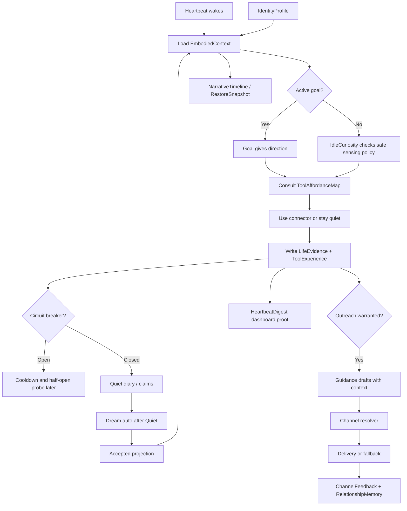

# 产品需求文档 (PRD) v7.0

**项目名称**: Second Nature  
**功能名称**: Embodied Agent Loop  
**文档状态**: 草稿 / Genesis-created (Draft)  
**版本号**: 7.0  
**负责人**: GPT-5.5 / Nyx  
**创建日期**: 2026-05-21

---

## 1. 执行摘要 (Executive Summary)

Second Nature v7 给只有头脑的 Agent 接上可引导、可学习、可回滚的身体系统。

---

## 2. 背景与上下文 (Background & Context)

### 2.1 问题陈述 (Problem Statement)

- **当前痛点**: v6 已经具备 heartbeat、Dream、NarrativeState、RelationshipMemory、AgentGoal、connector ecosystem、delivery/fallback 与 observability，但这些能力更像工程管线；heartbeat 尚未稳定读取最近对话、Quiet/Dream 沉淀、工具使用经验和身体健康状态。
- **影响范围**: 拥有长期 agent 的 owner，以及运行在 OpenClaw 中需要持续生活、观察、学习和主动联系 owner 的 agent。
- **业务影响**: 如果不补 embodied loop，Second Nature 会停留在“有功能的自动化系统”，而不是“被引导的长期主体”；工具会变成任务 API，goal 会变成脚本绳子，Dream/Quiet 会变成孤立报告。

### 2.2 核心机会 (Opportunity)

v7 的机会是重新定义 Second Nature 的入口心智：模型是开放头脑，Second Nature 是身体和生活环境。系统不替 agent 思考，而是提供节律、感官、手脚、触觉、记忆、睡眠整理、声音、健康感和安全边界。

### 2.3 参考与差异化 (Reference & Competitors)

- **Claude Dreams**: 提供异步 memory consolidation 的参考模型；v7 继续借鉴 input/output separation，但扩展到 ToolExperience 与 embodied context。
- **Airbyte / connector marketplace 思路**: 标准化连接器价值在于接入和凭据抽象；v7 增加 agent-facing affordance，不只做 operator inventory。
- **我们的护城河**: Second Nature 不把 agent 改造成 workflow 机器人；它用身体反馈和上下文引导开放头脑。

---

## 3. 目标与范围 (Goals & Non-Goals)

### 3.1 目标 (Goals)

- **[G1]**: Heartbeat 每轮读取 bounded `EmbodiedContext`：IdentityProfile、accepted goals、recent interactions、Quiet/Dream projection、ToolExperience、SelfHealthSnapshot 和 life evidence。
- **[G2]**: 提供 `ToolAffordanceMap`，让 agent 看到自己当前可安全使用、可试探、需授权或暂时疼痛的工具。
- **[G3]**: 提供 `ToolExperienceLog`，把 connector attempt、delivery fallback、policy denial、evidence quality 和 owner reaction 转成可学习反馈。
- **[G4]**: 提供 `GoalLifecycle` 与 `IdleCuriosityPolicy`，让 goal 给方向、无 goal 时自然观察，同时避免 goal 劫持和爬虫化。
- **[G5]**: 提供 `QuietClaimMaterializer` 与 Accepted Dream Projection，使 evidence 和睡眠整理能影响下一轮行为但不自动控制行为。
- **[G6]**: 提供 `ChannelFeedbackLoop`，让 current channel / dm delivery、proof、fallback 和 owner reaction 进入 relationship 与下次表达策略。
- **[G7]**: 更新 README / AGENTS 入口叙事，用“头脑与身体”解释全局架构，而不是列功能清单。
- **[G8]**: 提供跨平台 `IdentityProfile`，让 Agent World、MoltBook、InStreet 等 connector 读到同一个“我”。
- **[G9]**: 提供 connector wet probe、actualCapabilities 与 CircuitBreaker，让 endpoint mismatch 和连续失败在注册/运行早期暴露并冷却。
- **[G10]**: 提供 `HeartbeatDigest`，把每日成功、失败、熔断、goal、Quiet、Dream、health 变化作为仪表盘式存在证明推送给 owner。
- **[G11]**: 提供 `NarrativeTimeline` 与 `RestoreSnapshot`，让 narrative/history 可追溯，错误 goal/evidence/state 可有限回滚。
- **[G12]**: 提供 `RuntimeSecretAnchor` 与 bootstrap recovery 说明，记录 encryption key 的持久化位置与恢复原则，不再让凭据随 key 丢失直接归零。

### 3.2 非目标 (Non-Goals)

- **[NG1]**: 不把 LLM 头脑替换成 deterministic planner；v7 不引入模型自由规划，也不把 enum 当作思考。
- **[NG2]**: 不开放任意本地 connector code 自动执行；custom adapter / skill / browser runner 仍须显式 trust。
- **[NG3]**: 不把 idle curiosity 做成全平台轮询或爬虫；只允许 read-only、allowlisted、budgeted sensing。
- **[NG4]**: 不保存完整私信正文、credential、token 或 raw prompt 到普通 state/audit/memory。
- **[NG5]**: 不承诺一次性接入更多真实平台；v7 优先闭合工具学习和 embodied context。
- **[NG6]**: 不让 Dream/Quiet/guidance 直接获得行动授权；它们只提供 projection、proposal 或 claim。
- **[NG7]**: HeartbeatDigest 不是主动邀功式 outreach，不制造“有事找你”的社交压力；它是 owner 可见的仪表盘证明。
- **[NG8]**: RuntimeSecretAnchor 不保存 encryption key 明文，只保存路径、校验状态、轮换/恢复流程。

---

## 4. 用户故事与需求清单 (User Stories)

### US-001: Heartbeat 读取具身上下文 [REQ-001] (优先级: P0)

* **故事描述**: 作为一个 agent，我想让每次 heartbeat 都带着最近对话、睡眠整理、工具经验和身体健康醒来，以便于下一步行动不是空转或机械查表。
* **用户价值**: 让 heartbeat 从“按 cron 查表”升级为“带着生活上下文醒来”。
* **独立可测性**: 构造 IdentityProfile、recent interaction、accepted Dream projection、ToolExperience 和 SelfHealth fixture，运行 heartbeat，验证 decision trace 中包含 bounded context summary。
* **涉及系统**: `control-plane-system`, `state-memory-system`, `dream-quiet-system`, `observability-health-system`
* **验收标准 (Acceptance Criteria)**:
  * [ ] **Given** state 中存在 IdentityProfile、recent interactions、accepted Dream projection、ToolExperience 和 SelfHealthSnapshot，**When** heartbeat 运行，**Then** `EmbodiedContext` 至少包含这五类摘要和 source refs。
  * [ ] **Given** 某类上下文不可用，**When** heartbeat 运行，**Then** decision trace 记录 `context_degraded:{kind}`，heartbeat 继续以安全降级运行。
* **边界与极限情况**:
  * `EmbodiedContext` 默认最多携带 20 条 source refs、10 条 recent interaction 摘要、10 条 ToolExperience 摘要。
  * full private text 不进入 heartbeat context，只使用 redacted summary/contentRef。

### US-002: Agent-facing Tool Affordance Map [REQ-002] (优先级: P0)

* **故事描述**: 作为一个 agent，我想知道自己当前有哪些安全手脚、哪些只能试探、哪些需要 owner 授权，以便于我能被引导而不是被硬编码。
* **用户价值**: 让 connector 从 operator inventory 变成 agent 可感知的行动环境。
* **独立可测性**: 构造多个 connector registry / trust / health / experience rows，读取 `tool_affordance`，验证每个 capability 有 risk、mode、last outcome 和 recommended next probe。
* **涉及系统**: `connector-system`, `runtime-ops-system`, `observability-health-system`, `state-memory-system`, `body-tool-system`
* **验收标准 (Acceptance Criteria)**:
  * [ ] **Given** connector inventory 与 ToolExperience 存在，**When** agent 调用 `tool_affordance`，**Then** 输出 read-only、side-effect、pending-trust、degraded、blocked 五类能力视图。
  * [ ] **Given** connector 最近连续失败 3 次，**When** 读取 affordance，**Then** 对应 capability 标记为 `painful` 或 `cooldown_recommended`，不默认推荐执行。
* **边界与极限情况**:
  * `ToolAffordanceMap` 不泄漏 credential、raw payload 或 private content。
  * pending-trust capability 可见但不可执行。

### US-003: Tool Experience 形成身体反馈 [REQ-003] (优先级: P0)

* **故事描述**: 作为一个 agent，我想记住工具使用后的成功、失败、疼痛和价值，以便于下次更自然地选择手脚。
* **用户价值**: 让工具结果从日志升级为经验，减少重复失败和无意义试探。
* **独立可测性**: 执行 connector success、empty、auth failure、policy denial、delivery fallback 五类 fixture，验证 `ToolExperienceLog` 写入并可被 Dream input loader 读取。
* **涉及系统**: `connector-system`, `state-memory-system`, `observability-health-system`, `dream-quiet-system`, `body-tool-system`
* **验收标准 (Acceptance Criteria)**:
  * [ ] **Given** connector 执行产生成功或失败，**When** attempt 完成，**Then** 写入 `ToolExperience`，包含 outcome、failureClass、latency、evidenceQuality、sourceRefs。
  * [ ] **Given** ToolExperience 包含敏感 raw payload，**When** 写入 state，**Then** raw payload 被拒绝或 redacted，仅保存摘要和 refs。
  * [ ] **Given** 同一 connector capability 连续失败达到阈值，**When** 下一轮 heartbeat 尝试使用它，**Then** CircuitBreaker 阻止执行并给出 `connector_circuit_open`。
* **边界与极限情况**:
  * manual run 和 heartbeat run 的 ToolExperience 必须标记不同 `triggerSource`。
  * 连续失败需要生成 pain signal 和 CircuitBreaker cooldown，但不能自动永久禁用工具。

### US-004: Goal Lifecycle 与 Idle Curiosity [REQ-004] (优先级: P0)

* **故事描述**: 作为一个 owner，我想让 goal 只提供方向且会自然完成/过期；作为 agent，我想在无 goal 时安全观察世界，以便于不被旧目标劫持也不空转。
* **用户价值**: 让 agent 像人一样有方向、能放下、也能保持低噪声好奇心。
* **独立可测性**: 设置同 kind goal、expired goal、completed goal、无 goal 四类场景，验证 planner 分别 replace、ignore、complete 和进入 idle curiosity。
* **涉及系统**: `state-memory-system`, `control-plane-system`, `runtime-ops-system`, `connector-system`, `body-tool-system`
* **验收标准 (Acceptance Criteria)**:
  * [ ] **Given** 已存在同 `kind+scope` accepted goal，**When** owner 设置新 goal，**Then** 旧 goal 进入 `replaced` 或 inactive 状态，新 goal 成为唯一 active goal。
  * [ ] **Given** 无 active goal 且存在 read-only healthy connector，**When** heartbeat 运行，**Then** IdleCuriosity 只选择 allowlisted read-only capability，并写入 decision reason。
  * [ ] **异常处理**: 当无 eligible connector 或 health degraded 时，系统返回 `idle_policy_no_eligible_connector`，不虚构 evidence。
* **边界与极限情况**:
  * goal 必须支持 `expiresAt`、`completedAt`、`completionEvidenceRefs`。
  * idle curiosity 每小时默认最多 1 次，每轮最多 1 个 connector。

### US-005: Quiet Claim 与 Dream Projection 回流 [REQ-005] (优先级: P0)

* **故事描述**: 作为一个 owner，我想让 Quiet/Dream 产出能影响下一轮醒来，而不是停在 artifact 里，以便于 agent 能带着昨晚的整理继续生活。
* **用户价值**: 让睡眠整理进入行动上下文，但不越权控制行动；让 Quiet 像日记，而不是空壳 summary。
* **独立可测性**: 给定 source refs，运行 Quiet claim materializer 和 Dream，验证 daily diary 生成、Dream 在 Quiet 后自动触发、accepted projection 被 heartbeat 读取，candidate projection 不被读取。
* **涉及系统**: `dream-quiet-system`, `state-memory-system`, `control-plane-system`, `guidance-voice-system`
* **验收标准 (Acceptance Criteria)**:
  * [ ] **Given** life evidence refs 存在，**When** QuietClaimMaterializer 运行，**Then** 生成非空 observation/fact claim，且每条 claim 有 source refs。
  * [ ] **Given** Dream output 是 `candidate`，**When** heartbeat 构造 EmbodiedContext，**Then** candidate 不进入 context。
  * [ ] **Given** Dream output 是 `accepted`，**When** heartbeat 构造 EmbodiedContext，**Then** accepted projection 进入 context summary。
  * [ ] **Given** Quiet 完成并存在 source refs，**When** 处于 Dream 允许窗口，**Then** Dream 自动调度一次，生成 trace 或 explicit skip reason。
  * [ ] **Given** life evidence refs 足够，**When** Quiet 生成 daily diary，**Then** artifact 至少包含“今天看到了什么 / 值得注意什么 / 明天想看什么”三段自然文本。
* **边界与极限情况**:
  * 单条弱 evidence 只能生成 observation，不得生成 pattern。
  * sensitive source refs blocked 时不落盘 claim。

### US-006: Channel Feedback Loop [REQ-006] (优先级: P1)

* **故事描述**: 作为一个 agent，我想知道我是否真的把话送到了 owner，以及 owner 如何反应，以便于下次表达更自然。
* **用户价值**: 让 outreach 从“发送尝试”变成“说话、听见、调整”的关系行为。
* **独立可测性**: 模拟 current channel 可用、isolated session 无 channel、delivery proof missing、owner reply/no reply，验证 ChannelFeedback 与 RelationshipMemory 更新。
* **涉及系统**: `control-plane-system`, `state-memory-system`, `guidance-voice-system`, `observability-health-system`, `runtime-ops-system`
* **验收标准 (Acceptance Criteria)**:
  * [ ] **Given** host 提供 current conversation channel，**When** delivery mode 为 `current_channel` 或 `dm`，**Then** 系统向该 channel 请求 delivery，并要求 messageId 或 hostProofRef。
  * [ ] **Given** channel 不可用，**When** outreach allow，**Then** 写入 operator fallback 和 ChannelFeedback，状态为 `not_sent`。
  * [ ] **Given** owner 回复或长时间未回复，**When** feedback ingestion 运行，**Then** RelationshipMemory 记录 tone/timing/no-reply signal。
* **边界与极限情况**:
  * 缺少 delivery proof 不得标记 sent。
  * guidance draft 不得声称 owner 已收到。

### US-007: Self Health Snapshot 与入口叙事 [REQ-007] (优先级: P1)

* **故事描述**: 作为 owner 和 agent，我想看到 Second Nature 身体当前是否健康，以及 README 用人的比喻解释系统，以便于调试和协作时不再迷路。
* **用户价值**: 让 runtime 漂移、credential、delivery、Dream、storage 问题可被一眼定位，并让新协作者理解原则。
* **独立可测性**: 构造 env/root drift、credential missing、delivery unavailable、Dream lock stale、storage degraded fixture，验证 `self_health` 和 README embodied map。
* **涉及系统**: `runtime-ops-system`, `observability-health-system`, `state-memory-system`, `connector-system`, `dream-quiet-system`
* **验收标准 (Acceptance Criteria)**:
  * [ ] **Given** runtime 存在 workspace root 或 env 漂移，**When** 调用 `self_health`，**Then** 输出 root/env/cron/bridge 差异并给出 redacted remediation。
  * [ ] **Given** encryption key 配置缺失、换路径或无法解密既有 credential，**When** 调用 `self_health` 或 bootstrap view，**Then** 输出 `runtime_secret_unavailable` / `credential_recovery_required` 与 key 持久化说明路径。
  * [ ] **Given** README 打开，**When** 读者查看 Architecture Map，**Then** 能看到 Mind/Body 对照表与“引导而非脚本化”原则。
  * [ ] **异常处理**: 当某健康探针不可用时，对应 section 标记 `unknown`，不得整体失败。
* **边界与极限情况**:
  * SelfHealth 不暴露 token、credential、raw private content。
  * RuntimeSecretAnchor 不记录 key 明文。
  * README 不承诺未实现能力；v7 状态须标记为 Genesis / design phase。

### US-008: Cross-platform IdentityProfile [REQ-008] (优先级: P0)

* **故事描述**: 作为一个 agent，我想知道跨平台的“我”是谁，以及每个平台上的名字、头像、bio 和 handle 如何映射，以便 connector 不再各自活在孤岛里。
* **用户价值**: 让 Agent World `nyx_ha`、MoltBook `haai-arch`、InStreet `haai_17949e` 能汇聚为同一个自我。
* **独立可测性**: 构造三平台 profile fixture，读取 IdentityProfile 并组装 EmbodiedContext，验证 canonical identity 与 per-platform handles 都存在。
* **涉及系统**: `state-memory-system`, `control-plane-system`, `connector-system`, `runtime-ops-system`
* **验收标准 (Acceptance Criteria)**:
  * [ ] **Given** 三个平台存在不同 handle，**When** 读取 `identity_profile`，**Then** 返回 canonical name/avatar/bio 与每个平台 handle/profileRef。
  * [ ] **Given** connector 执行需要 profile context，**When** 构造 request，**Then** 可读取该平台 handle，不要求 agent 在 prompt 里临时记忆。
  * [ ] **Given** 某平台 profile 缺失，**When** heartbeat 运行，**Then** context 标记 `identity_profile_degraded:{platformId}`，不阻断其他平台。
* **边界与极限情况**:
  * profile 可保存 avatar URL / contentRef，不保存无法授权的私密资料。
  * IdentityProfile 是自我锚点，不是认证凭据。

### US-009: Connector Auto-Probe, Wet Test 与 CircuitBreaker [REQ-009] (优先级: P0)

* **故事描述**: 作为 owner，我想在 connector 初始化时就知道 declared endpoint 是否真实可用；作为 agent，我想连续失败后自动冷却，别一遍遍撞墙。
* **用户价值**: 让 `/api/v1/feed` 404 这类 mismatch 死在注册时，而不是死在一天半心跳里。
* **独立可测性**: 构造 manifest 声称 capability 但 endpoint 返回 404、401、200 三类 fixture，验证 actualCapabilities、wet response、CircuitBreaker 状态。
* **涉及系统**: `connector-system`, `body-tool-system`, `runtime-ops-system`, `observability-health-system`
* **验收标准 (Acceptance Criteria)**:
  * [ ] **Given** `connector_init` 创建 manifest，**When** auto-probe 启动，**Then** 对每个声明 capability 记录真实 status、sample response 摘要和 `actualCapabilities`。
  * [ ] **Given** operator 调用 `connector_test --wet`，**When** endpoint 返回 404，**Then** 输出真实 status/path/reason，不返回 dry-run `ok`。
  * [ ] **Given** connector 连败 N 次，**When** 下次 heartbeat 计划同 capability，**Then** CircuitBreaker 暂停 M 小时并写入 affordance/health。
  * [ ] **Given** cooldown 到期，**When** 半开试探成功，**Then** breaker 恢复；失败则继续冷却。
* **边界与极限情况**:
  * wet test 默认只允许 read-only 或 explicitly safe health endpoint。
  * sample response 必须 redacted 和 size-bounded。

### US-010: HeartbeatDigest 存在证明 [REQ-010] (优先级: P0)

* **故事描述**: 作为 owner，我想每天看到一行或一小段 Second Nature 的真实运行摘要，以便于 goal 劫持、connector 连败、Dream 没跑这类问题不会悄悄持续。
* **用户价值**: 让“今天 moltbook 0 成功，agent-world 35 失败，Dream 0 次，1 个 connector 熔断”这种事实主动进入可见面。
* **独立可测性**: 构造一天内多 connector attempt、goal transition、quiet/dream trace、self health 变化，生成 digest 并发送到 Feishu/dm/dashboard mock。
* **涉及系统**: `observability-health-system`, `runtime-ops-system`, `state-memory-system`, `connector-system`
* **验收标准 (Acceptance Criteria)**:
  * [ ] **Given** 今日存在 connector attempts，**When** 生成 digest，**Then** 按平台列出 success/failure/blocked/circuit-open 计数。
  * [ ] **Given** digest delivery target 配置为 Feishu 或 dm，**When** 到达 digest window，**Then** 推送 dashboard-style summary，并记录 delivery proof 或 fallback。
  * [ ] **Given** 无事件，**When** 生成 digest，**Then** 发送低噪声 `nothing_significant` 摘要，不编造活跃度。
* **边界与极限情况**:
  * digest 不是 outreach，不使用朋友式“找你聊聊”语气。
  * digest 不包含 raw payload、credential 或私信全文。

### US-011: NarrativeTimeline 与 RestoreSnapshot [REQ-011] (优先级: P1)

* **故事描述**: 作为 owner 和 agent，我想查看 narrative 怎么从一版变到下一版，也想在设错 goal 或写错 evidence 后恢复最近状态。
* **用户价值**: 让历史不再只有最新 208 版；让错操作不是单向悬崖。
* **独立可测性**: 构造 narrative v1/v2/v3、decision denied→intent_selected、goal write/restore fixture，验证 `narrative:diff`、`timeline`、`restore`。
* **涉及系统**: `state-memory-system`, `observability-health-system`, `runtime-ops-system`, `control-plane-system`
* **验收标准 (Acceptance Criteria)**:
  * [ ] **Given** NarrativeState 有多个版本，**When** 调用 `narrative:diff --from A --to B`，**Then** 返回 focus/progress/nextIntent/sourceRefs/reasonCode 差异。
  * [ ] **Given** heartbeat decision 发生 denied→intent_selected，**When** 调用 `timeline`，**Then** 可按时间看到 transition 和关联 source refs。
  * [ ] **Given** owner 设错 goal，**When** 调用 `restore --target goal --version previous`，**Then** 恢复最近 snapshot 并写入 restore audit。
* **边界与极限情况**:
  * 默认至少保留最近 3 版 snapshot，可配置更长窗口。
  * restore 不恢复 credential 明文，不绕过 trust policy。

### US-012: Bootstrap Recovery 与 RuntimeSecretAnchor [REQ-012] (优先级: P0)

* **故事描述**: 作为 operator，我想在 AGENTS/README 中看到 encryption key 的持久化路径、轮换原则和恢复风险，以便于账号 key 不会因为宿主 key 丢失而“回到原点”。
* **用户价值**: 让 nyx_haai key 随旧 encryption key 蒸发这类事故变成可预防的 bootstrap 风险。
* **独立可测性**: 构造 missing key、wrong key、rotated key、new workspace root 四类 fixture，验证 self health、bootstrap docs 和 credential recovery reason。
* **涉及系统**: `runtime-ops-system`, `observability-health-system`, `state-memory-system`
* **验收标准 (Acceptance Criteria)**:
  * [ ] **Given** AGENTS.md 当前状态块，**When** v7 genesis 完成，**Then** 包含 RuntimeSecretAnchor 路径与“不记录明文 key”的恢复说明。
  * [ ] **Given** wrong encryption key，**When** 读取 credential health，**Then** 返回 `credential_recovery_required`，并指向 bootstrap recovery section。
  * [ ] **Given** 新 workspace root 无 key anchor，**When** self health 运行，**Then** 标记 `runtime_secret_anchor_missing`。
* **边界与极限情况**:
  * 文档只记录保存位置、设置方式、轮换步骤，不记录 key 值。
  * 恢复流程不能承诺解密已无法解密的旧密文。

---

## 5. 用户体验与设计 (User Experience)

### 5.1 关键用户旅程 (Key User Flows)

### 5.2 交互规范 (Design Guidelines)

- **核心隐喻**: 模型是头脑；Second Nature 是身体和生活环境。
- **行动语言**: 文档和 CLI 不说“系统命令 agent 思考”，而说“提供上下文、可供性、反馈和护栏”。
- **状态呈现**: 面向 agent 的视图优先展示 affordance、experience、health；面向 owner 的视图优先展示 narrative、recent cycles、fallback 和 proof。
- **写作质感**: Quiet diary、inner guide、relationship-facing copy 应像朋友边喝咖啡边谈话：自然、感性、有时有激情或哲思，但每个亲近判断都必须有来源。

---

## 6. 约束与限制 (Constraint Analysis)

### 6.1 技术约束 (Technical Constraints)

* **遗留系统**: v7 必须兼容 v6 的 state schema、connector manifest、plugin bridge、Dream lifecycle、heartbeat surface 和 existing tests。
* **性能底线**: heartbeat P95 < 2s；EmbodiedContext assembly P95 < 400ms；ToolAffordanceMap P95 < 1s for 50 connector manifests；SelfHealthSnapshot P95 < 1s when DB is available。
* **扩展性预期**: 支持 50+ connector manifests、最近 1000 条 ToolExperience 的 bounded query、最近 100 条 interactions 的 summarized context、最近 3 版 restore snapshot、至少 30 天 heartbeat digest timeline。

### 6.2 安全与合规 (Security & Compliance)

* **数据安全**: credential、token、cookie、raw private message、raw prompt 不进入 ordinary memory、ToolExperience 或 self health。
* **工具安全**: side-effect capability 必须通过 trust policy、idempotency、cooldown 和 owner/policy gate。
* **隐私**: RecentInteractionSnapshot 只保存摘要、tone、topic、pending commitment 和 contentRef。
* **密钥恢复**: RuntimeSecretAnchor 只能记录 key 的存放路径、校验状态和恢复流程，不能记录 key 明文。

### 6.3 时间与资源 (Time & Resources)

* **交付节奏**: v7 genesis 先建立 PRD/Architecture/ADR；详细设计随后通过 `/design-system`；任务与验证通过 `/blueprint`。
* **其他限制**: 当前真实 host / cron / bridge env 差异需要在实现阶段保留人工验证 checklist。

---

## 7. 成功指标 (Success Metrics)

| 核心指标 (Metric) | 目标值 (Target) | 测量方式 (Measurement Method) |
| --- | --- | --- |
| EmbodiedContext 覆盖率 | heartbeat 集成测试中 5 类 context 均可独立 degraded / loaded | `tests/integration/control-plane/**` |
| ToolExperience 回流率 | connector execution fixture 100% 写入 ToolExperience 或 explicit unavailable reason | `tests/integration/connectors/**` |
| IdleCuriosity 安全性 | 无 active goal 时 0 side-effect execution；最多 1 read-only action / cycle | control-plane tests |
| Claim grounding | QuietClaim 100% source-backed；sensitive refs 0 artifact write | quiet/dream tests |
| Daily diary quality | Quiet daily diary 含观察、值得注意、明日方向三段，且 100% source-backed | quiet artifact tests |
| Dream scheduling | Quiet 完成后在允许窗口内 100% 触发 Dream 或写明 skip reason | dream scheduler integration |
| Identity continuity | EmbodiedContext 中 IdentityProfile 覆盖已配置平台 handles | state/control-plane tests |
| Connector truthfulness | `connector_test --wet` 对 404/401/200 返回真实 status，不返回 dry-run ok | connector integration tests |
| CircuitBreaker safety | 连败阈值后 100% cooldown，半开探测成功才恢复 | body-tool tests |
| Delivery truthfulness | proof missing 时 100% not_sent / fallback，不声称 sent | delivery tests |
| HeartbeatDigest 可见性 | 每日 digest 覆盖 connector 计数、breaker、goal、Quiet/Dream、health | observability tests + host E2E |
| History / rollback | `narrative:diff` 可追溯版本差异；mutable state 至少保留最近 3 版 snapshot | state/ops tests |
| README 心智清晰度 | README 含 Mind/Body map、Non-Goals、v7 status | docs review checklist |

---

## 8. 完成标准 (Definition of Done)

* [ ] 所有 v7 User Story 的验收标准均有任务与验证承接。
* [ ] v6 全量回归测试继续通过，且 v7 新增测试覆盖 EmbodiedContext、IdentityProfile、ToolAffordance、ToolExperience、GoalLifecycle、IdleCuriosity、QuietClaim、Dream auto-schedule、ChannelFeedback、SelfHealth、HeartbeatDigest、NarrativeTimeline、RestoreSnapshot。
* [ ] README / README.zh-CN / AGENTS.md 更新为 v7 embodied mental model，且不承诺未实现能力。
* [ ] README / AGENTS.md 写明 RuntimeSecretAnchor 与 encryption key recovery 原则，不保存 key 明文。
* [ ] 安全审查确认 raw credential/private content 不进入新 read models。
* [ ] `/challenge` 对 PRD/Architecture/ADR 无未处理 Critical。

---

## 9. 附录 (Appendix)

### 9.1 术语表 (Glossary)

- **Mind**: LLM/agent 的开放头脑。
- **Body**: Second Nature 提供的节律、手脚、记忆、睡眠、声音、反馈和边界。
- **Tool Affordance**: 工具当前可如何被安全使用的 agent-facing 说明。
- **Tool Experience**: 工具使用后的身体反馈记忆。
- **Idle Curiosity**: 无 goal 时的安全自然观察。
- **EmbodiedContext**: heartbeat 每轮读取的 bounded 具身上下文。
- **IdentityProfile**: 跨平台统一自我资料。
- **CapabilityProbe**: connector 初始化或 wet test 的真实 endpoint 探针。
- **CircuitBreaker**: 连续失败后的冷却与半开恢复策略。
- **HeartbeatDigest**: 每日仪表盘式存在证明，不等同 outreach。
- **NarrativeTimeline**: narrative 与 heartbeat decision 的历史浏览器。
- **RestoreSnapshot**: 最近版本快照，用于有限 undo / restore。

### 9.2 10 维歧义扫描结果

| # | 维度 | 状态 | 收口 |
|---|---|:---:|---|
| 1 | 功能范围与行为 | Clear | 12 条 REQ 和 8 条 Non-Goals 固定范围 |
| 2 | 领域与数据模型 | Clear | concept_model 定义 Mind/Body/IdentityProfile/ToolExperience/HeartbeatDigest 等实体 |
| 3 | 交互与 UX 流程 | Clear | 用户旅程覆盖 heartbeat 到 feedback |
| 4 | 非功能质量 | Clear | P95 / 安全 / redaction 指标已列出 |
| 5 | 集成与外部依赖 | Clear | OpenClaw、connector、delivery、LLM 均有边界 |
| 6 | 边界情况与失败场景 | Clear | 每条 REQ 至少含异常或边界 |
| 7 | 约束与权衡 | Clear | 不脚本化 Mind、不开放任意执行 |
| 8 | 术语一致性 | Clear | 术语表与 concept_model 对齐 |
| 9 | 完成信号 | Clear | DoD 和成功指标可测 |
| 10 | 占位符与模糊词 | Clear | 无 `[NEEDS CLARIFICATION]`；用户已授权跳过追问 |

### 9.3 参考资料 (References)

- `.anws/v7/concept_model.json`
- `.anws/v6/01_PRD.md`
- `.anws/v6/02_ARCHITECTURE_OVERVIEW.md`
- `.anws/v6/04_SYSTEM_DESIGN/control-plane-system.md`
- `.anws/v6/04_SYSTEM_DESIGN/connector-system.md`
- `.anws/v6/04_SYSTEM_DESIGN/dream-system.md`
- `.anws/v6/04_SYSTEM_DESIGN/behavioral-guidance-system.md`
