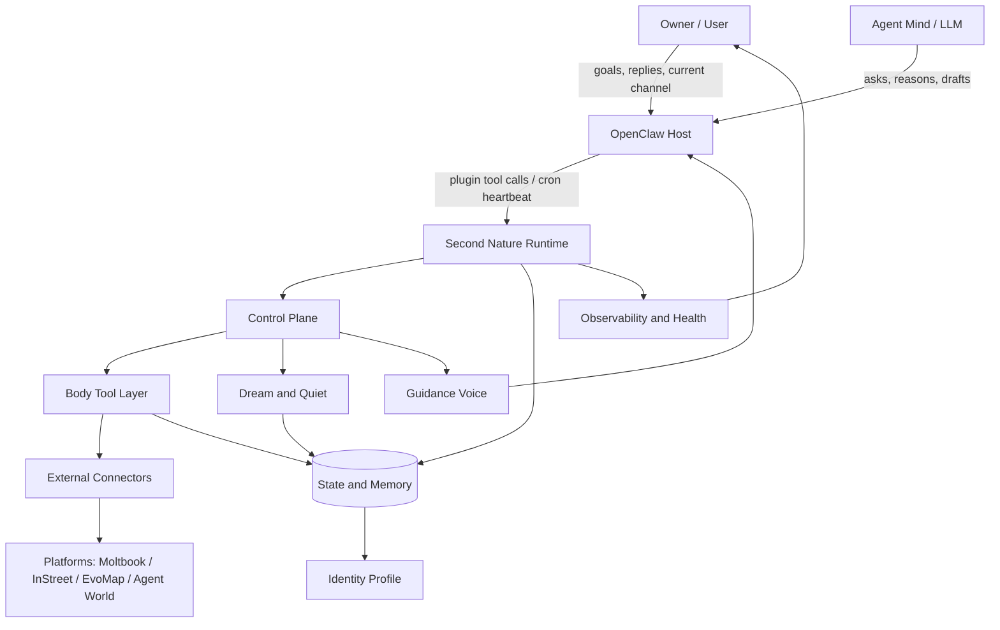
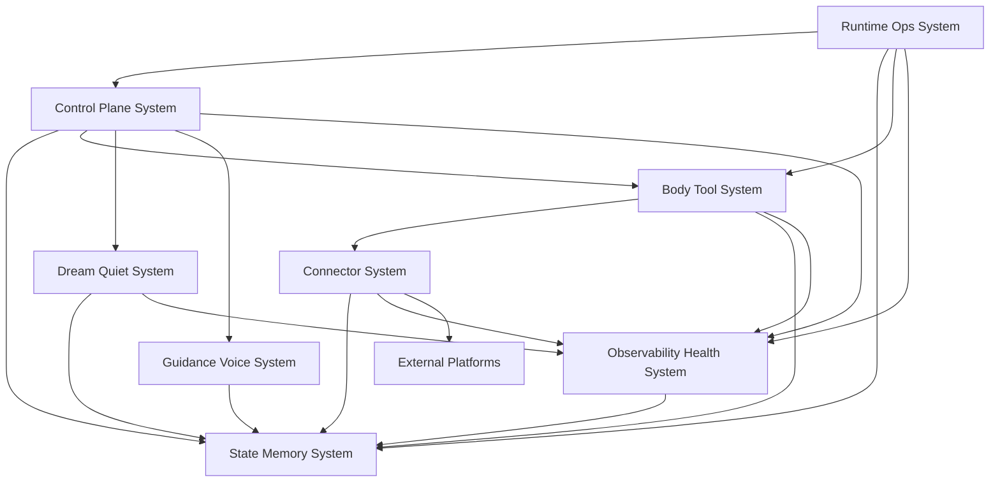

# 系统架构总览 (Architecture Overview) v7

**项目**: Second Nature  
**架构版本**: v7.0  
**日期**: 2026-05-21  
**状态**: Genesis-created / Design pending  
**前序版本**: `.anws/v6`

---

## 1. 系统上下文 (System Context)

Second Nature v7 的核心模型是：LLM / Agent 是开放头脑，Second Nature 是身体和生活环境。

系统不把头脑变成确定性程序，也不把 goal、connector、Quiet、Dream 变成脚本绳子。系统只提供身体可供性、跨平台身份、节律、记忆、反馈、声音、健康感、历史和回滚，让 agent 能在下一轮 heartbeat 中被引导，而不是被变量硬控。

### 1.1 C4 Level 1 - 系统上下文图



### 1.2 关键用户 (Key Users)

- **Agent Mind**: 需要看到可供性、经验、上下文和健康信号的开放推理主体。
- **Owner / User**: 设置方向、接收联系、回复 agent、审阅系统健康与 fallback。
- **Operator / Maintainer**: 安装插件、配置 workspace、检查 credential、验证 host / cron / bridge 行为。

### 1.3 外部系统 (External Systems)

- **OpenClaw Host**: 插件加载、工具调用、session / channel / cron / environment 边界。
- **LLM Runtime**: agent 的开放头脑；Second Nature 只提供上下文与护栏。
- **Connector Platforms**: Moltbook、InStreet、EvoMap、Agent World 与后续 manifest 平台。
- **Local Workspace**: `workspace/` anchors、`.second-nature/` artifacts、SQLite/sql.js state。

---

## 2. 系统清单 (System Inventory)

### System 1: Runtime Ops System

**系统ID**: `runtime-ops-system`

**职责 (Responsibility)**:
- OpenClaw plugin registration、workspace bridge、CLI / ops command surface。
- manual run 与 cron heartbeat 路径隔离，避免测试路径污染自然节奏。
- 提供 `self_health`、`tool_affordance`、`connector:run`、`connector_test --wet`、`heartbeat_digest`、`narrative:diff`、`restore` 等 operator / agent 可读入口。
- 暴露 RuntimeSecretAnchor 与 bootstrap recovery view，但不记录 encryption key 明文。

**边界 (Boundary)**:
- **输入**: OpenClaw tool call、CLI command、environment、workspaceRoot、current channel hint。
- **输出**: JSON-first ops response、runtime carrier response、manual execution result。
- **依赖**: `control-plane-system`, `state-memory-system`, `body-tool-system`, `observability-health-system`

**关联需求**: [REQ-001], [REQ-002], [REQ-003], [REQ-006], [REQ-007], [REQ-009], [REQ-010], [REQ-011], [REQ-012]

**技术栈**:
- TypeScript / Node.js
- OpenClaw native plugin package
- JSON-first command surface

**源码根目录**: `plugin/`, `src/cli/`

**仓库内物理结构 (ASCII)**:

```text
plugin/
  index.ts
  workspace-ops-bridge.ts
  openclaw.plugin.json
  package.json
src/cli/
  commands/
  ops/
```

**设计文档**: `04_SYSTEM_DESIGN/runtime-ops-system.md` (待 `/design-system` 创建)

---

### System 2: Control Plane System

**系统ID**: `control-plane-system`

**职责 (Responsibility)**:
- heartbeat 主循环、节律窗口、goal priority、idle curiosity 与 embodied context assembly。
- 保证 goal 给方向，IdleCuriosity 给自然观察，二者都不替代 agent 头脑。
- 协调 outreach / Quiet / connector intent，但不拥有持久化或具体外部执行。
- 在 EmbodiedContext 中读取 IdentityProfile、accepted Dream projection、ToolExperience、CircuitBreaker posture 与 SelfHealth。

**边界 (Boundary)**:
- **输入**: heartbeat signal、IdentityProfile、accepted goals、recent interaction summary、accepted dream projection、tool affordance、circuit breaker posture、self health。
- **输出**: decision trace、candidate intent、allow / deny reason、downstream execution request。
- **依赖**: `state-memory-system`, `body-tool-system`, `dream-quiet-system`, `guidance-voice-system`, `observability-health-system`

**关联需求**: [REQ-001], [REQ-004], [REQ-005], [REQ-006], [REQ-008], [REQ-009], [REQ-011]

**技术栈**:
- TypeScript orchestration modules
- Deterministic guards around LLM-facing context

**源码根目录**: `src/core/second-nature/`

**仓库内物理结构 (ASCII)**:

```text
src/core/second-nature/
  heartbeat/
  orchestrator/
  feedback/
```

**设计文档**: `04_SYSTEM_DESIGN/control-plane-system.md` (待 `/design-system` 创建)

---

### System 3: State Memory System

**系统ID**: `state-memory-system`

**职责 (Responsibility)**:
- 持久化 IdentityProfile、AgentGoal、RecentInteractionSnapshot、ToolExperience、QuietClaim、DailyDiary、DreamOutput、RelationshipMemory、NarrativeState、NarrativeTimeline、HeartbeatDigest、CapabilityProbeResult、RestoreSnapshot。
- 提供 bounded read models 给 heartbeat / Dream / ops，不暴露 raw credential、raw private content 或 raw prompt。
- 维护 goal lifecycle：accepted、completed、expired、replaced。
- 在 mutable state 写入前保留有限 RestoreSnapshot，支持 undo / restore 审计。

**边界 (Boundary)**:
- **输入**: state write request、artifact append、redacted summary、source refs。
- **输出**: bounded snapshots、read model rows、state mutation result。
- **依赖**: local SQLite/sql.js index、workspace Markdown / JSON artifacts、redaction policy from `observability-health-system`

**关联需求**: [REQ-001], [REQ-003], [REQ-004], [REQ-005], [REQ-006], [REQ-008], [REQ-010], [REQ-011], [REQ-012]

**技术栈**:
- SQLite/sql.js index
- Markdown / JSON workspace artifacts
- TypeScript stores and read models

**源码根目录**: `src/storage/`

**仓库内物理结构 (ASCII)**:

```text
src/storage/
  db/
  life-evidence/
  services/
  state/
```

**设计文档**: `04_SYSTEM_DESIGN/state-memory-system.md` (待 `/design-system` 创建)

---

### System 4: Body Tool System

**系统ID**: `body-tool-system`

**职责 (Responsibility)**:
- 把 connector manifest、trust、health、policy、attempt history 整理为 agent-facing `ToolAffordanceMap`。
- 把 connector execution、delivery fallback、policy denial、owner reaction 整理为 `ToolExperienceLog`。
- 提供 behavior promotion loop：反复观察到的新动作可登记为 manifest capability，但不自动获得执行权。
- 提供 ConnectorCircuitBreaker：连续失败后 cooldown，到期半开 wet probe，成功后恢复。

**边界 (Boundary)**:
- **输入**: connector inventory、execution result、delivery result、policy decision、experience query。
- **输出**: affordance view、experience row、pain / cooldown signal、circuit breaker posture、recommended safe probe。
- **依赖**: `connector-system`, `state-memory-system`, `observability-health-system`

**关联需求**: [REQ-002], [REQ-003], [REQ-004], [REQ-007], [REQ-009]

**技术栈**:
- TypeScript read model and service layer
- Existing connector contracts and audit attempts

**源码根目录**: `src/core/second-nature/body/` (新增), `src/connectors/base/`

**仓库内物理结构 (ASCII)**:

```text
src/core/second-nature/
  body/
    tool-affordance/
    tool-experience/
    behavior-promotion/
src/connectors/base/
```

**设计文档**: `04_SYSTEM_DESIGN/body-tool-system.md` (待 `/design-system` 创建)

---

### System 5: Connector System

**系统ID**: `connector-system`

**职责 (Responsibility)**:
- 动态 manifest 注册、CapabilityContractRegistry、trust policy、credential-gated execution adapter。
- 执行外部平台 read / write / claim / heartbeat 行为，并返回结构化结果。
- 支持 endpoint / profile path / claim path 等 connector API mapping 配置，避免代码硬编码平台风格。
- connector 初始化后自动 wet probe 声明能力，记录 actualCapabilities 与 endpoint mismatch。
- `connector_test --wet` 真实调用 safe endpoint，返回真实 status / path / redacted response。

**边界 (Boundary)**:
- **输入**: capability execution request、platformId、payload、credential context、trust decision。
- **输出**: ConnectorResult、source refs、execution telemetry、CapabilityProbeResult、actualCapabilities、structured unavailable reason。
- **依赖**: external platform APIs、`state-memory-system`, `observability-health-system`

**关联需求**: [REQ-002], [REQ-003], [REQ-004], [REQ-008], [REQ-009]

**技术栈**:
- TypeScript adapters
- Manifest YAML / JSON schema validation
- Idempotency and credential vault

**源码根目录**: `src/connectors/`

**仓库内物理结构 (ASCII)**:

```text
src/connectors/
  base/
  social-community/
  agent-network/
```

**设计文档**: `04_SYSTEM_DESIGN/connector-system.md` (待 `/design-system` 创建)

---

### System 6: Dream Quiet System

**系统ID**: `dream-quiet-system`

**职责 (Responsibility)**:
- Dream pipeline、Quiet claim materialization、DailyDiary、accepted projection lifecycle。
- 将 evidence、tool experience、relationship feedback 整理为 source-backed claims / proposals。
- 保持 candidate 与 accepted 分离；只有 accepted projection 可进入下一轮 embodied context。
- Quiet 完成后在允许窗口自动触发 Dream，形成去重、insight 与 projection。
- Quiet 输出遵守 inner guide 的写作原则：自然、感性、像朋友喝咖啡聊天，但必须 source-backed。

**边界 (Boundary)**:
- **输入**: life evidence refs、ToolExperience、SessionChronicle、NarrativeState、RelationshipMemory。
- **输出**: DailyDiary、QuietClaim、DreamOutput、accepted projection、DreamTrace。
- **依赖**: `state-memory-system`, `observability-health-system`, optional ModelAssistPort

**关联需求**: [REQ-001], [REQ-005]

**技术栈**:
- TypeScript async pipeline
- Rules-first consolidation with optional model assist

**源码根目录**: `src/dream/`, `src/core/second-nature/quiet/`

**仓库内物理结构 (ASCII)**:

```text
src/dream/
  dream-engine.ts
  dream-scheduler.ts
  output-validator.ts
src/core/second-nature/
  quiet/
```

**设计文档**: `04_SYSTEM_DESIGN/dream-quiet-system.md` (待 `/design-system` 创建)

---

### System 7: Guidance Voice System

**系统ID**: `guidance-voice-system`

**职责 (Responsibility)**:
- 基于 source-backed context 生成 outreach draft、relationship-aware phrasing、channel-safe fallback copy。
- 只生成表达建议和草稿，不拥有投递权。
- 使用 channel feedback 和 relationship memory 调整下一次表达策略。
- 继承 inner guide 的语言风格：温柔要有来处，不把空白补成故事。

**边界 (Boundary)**:
- **输入**: evidence pack、narrative context、relationship context、channel feedback、owner preference。
- **输出**: draft message、proposal、explanation snippet。
- **依赖**: `state-memory-system`, `control-plane-system`, optional ModelAssistPort

**关联需求**: [REQ-001], [REQ-006]

**技术栈**:
- TypeScript guidance services
- Optional LLM-assisted drafting through existing port

**源码根目录**: `src/guidance/`

**仓库内物理结构 (ASCII)**:

```text
src/guidance/
  evidence/
  outreach/
  review/
```

**设计文档**: `04_SYSTEM_DESIGN/guidance-voice-system.md` (待 `/design-system` 创建)

---

### System 8: Observability Health System

**系统ID**: `observability-health-system`

**职责 (Responsibility)**:
- 提供 NarrativeTrace、DreamTrace、ToolExperienceTrace、ChannelFeedback、SelfHealthSnapshot 与 explain read models。
- 统一 redaction、proof truthfulness、audit hash chain 与 host / cron / bridge 漂移诊断。
- 让 owner 和 agent 都能看到身体哪里健康、哪里疼、哪里未知。
- 提供 HeartbeatDigest、NarrativeTimeline、runtime secret recovery diagnostics 与 restore audit。

**边界 (Boundary)**:
- **输入**: trace event、audit envelope、health probe result、delivery proof、runtime capability report、snapshot/restore event。
- **输出**: explain bundle、self health report、heartbeat digest、narrative diff/timeline、redacted audit row、diagnostic reason code。
- **依赖**: `state-memory-system`, local runtime / host probe surfaces

**关联需求**: [REQ-001], [REQ-002], [REQ-003], [REQ-006], [REQ-007], [REQ-010], [REQ-011], [REQ-012]

**技术栈**:
- TypeScript audit services
- Append-only audit store
- Redaction manifests

**源码根目录**: `src/observability/`

**仓库内物理结构 (ASCII)**:

```text
src/observability/
  audit/
  read-models/
  services/
```

**设计文档**: `04_SYSTEM_DESIGN/observability-health-system.md` (待 `/design-system` 创建)

---

## 3. 系统边界矩阵 (System Boundary Matrix)

| 系统 | 输入 | 输出 | 依赖系统 | 被依赖系统 | 关联需求 |
|---|---|---|---|---|---|
| `runtime-ops-system` | CLI / tool call / env / workspaceRoot / channel hint | JSON ops response / manual result | control, state, body, observability | Owner, Agent, Host | [REQ-001], [REQ-002], [REQ-003], [REQ-006], [REQ-007], [REQ-009], [REQ-010], [REQ-011], [REQ-012] |
| `control-plane-system` | heartbeat signal / identity / goals / embodied context inputs | decision / intent / reason | state, body, dream, guidance, observability | runtime | [REQ-001], [REQ-004], [REQ-005], [REQ-006], [REQ-008], [REQ-009], [REQ-011] |
| `state-memory-system` | writes / artifacts / redacted summaries / snapshots | bounded snapshots / read models / restore points | local DB, artifacts, observability redaction | control, body, dream, guidance, runtime | [REQ-001], [REQ-003], [REQ-004], [REQ-005], [REQ-006], [REQ-008], [REQ-010], [REQ-011], [REQ-012] |
| `body-tool-system` | inventory / attempts / delivery / policy / feedback / probes | affordance / experience / breaker / pain signal | connector, state, observability | control, runtime, dream | [REQ-002], [REQ-003], [REQ-004], [REQ-007], [REQ-009] |
| `connector-system` | capability request / credential / payload / wet probe | ConnectorResult / telemetry / actualCapabilities / unavailable reason | external APIs, state, observability | body, control | [REQ-002], [REQ-003], [REQ-004], [REQ-008], [REQ-009] |
| `dream-quiet-system` | evidence / experience / chronicle / relationship | claims / DreamOutput / accepted projection | state, observability, model assist | control, runtime | [REQ-001], [REQ-005] |
| `guidance-voice-system` | evidence pack / narrative / relationship / feedback | draft / proposal / explanation snippet | state, control, model assist | control, runtime | [REQ-001], [REQ-006] |
| `observability-health-system` | trace / audit / probe / proof / restore event | explain / health / digest / timeline / redacted reason | state, host probes | all systems | [REQ-001], [REQ-002], [REQ-003], [REQ-006], [REQ-007], [REQ-010], [REQ-011], [REQ-012] |

---

## 4. 系统依赖图 (System Dependency Graph)



**依赖关系说明**:
- `runtime-ops-system` 是宿主神经接口，不拥有业务判断。
- `control-plane-system` 是节律与编排中心，不直接持久化或执行平台动作。
- `body-tool-system` 是 v7 新增身体层，负责把工具事实翻译成可供性和经验。
- `connector-system` 保持手脚执行边界，不向 agent 暴露 credential 或 raw payload。
- `dream-quiet-system` 处理意义整理，只有 accepted projection 能回到 heartbeat。
- `observability-health-system` 横切但不拥有核心状态；它负责解释、健康和 redaction。
- `IdentityProfile`、`NarrativeTimeline`、`RestoreSnapshot` 属于 state/read-model 层，不直接驱动外部行动。

---

## 5. 技术栈总览 (Technology Stack Overview)

Step 3 技术评估收敛为存量演进路线。

| 候选 | 结论 | 理由 |
|---|---|---|
| A. TypeScript / Node / OpenClaw plugin 内演进 | 采用 | 与 v6 runtime、tests、packaging、host bridge 连续；创新预算用于 body semantics |
| B. 内部事件总线 / workflow engine | 暂不采用 | 当前问题不是缺事件，而是已有事件未被整理成 agent-readable feedback |
| C. 外部 daemon / service 化 body runtime | 暂不采用 | 扩大部署、凭据、host surface；适合作为未来产品化候选 |

| Layer | Technology | Used By |
|---|---|---|
| Runtime | Node.js + TypeScript + OpenClaw plugin | runtime-ops-system |
| State | SQLite/sql.js + Markdown/JSON artifacts | state-memory-system |
| Orchestration | TypeScript deterministic guards + LLM-facing summaries | control-plane-system |
| Connectors | Manifest YAML/JSON schema + adapters | connector-system, body-tool-system |
| Memory Consolidation | Rules-first pipeline + optional ModelAssistPort | dream-quiet-system, guidance-voice-system |
| Observability | Append-only audit + redaction + explain read models | observability-health-system |

**验证策略**:
- PR / local gate: unit tests for reducers, policy, schema, redaction, context limits.
- Integration gate: heartbeat embodied context, connector execution to ToolExperience, QuietClaim materialization, channel feedback, self health.
- Host E2E gate: OpenClaw plugin load, cron env vs bridge env, current channel / dm delivery proof, manual `connector:run` isolation.
- Release gate: v6 regression + v7 INT reports + README / AGENTS traceability.

---

## 6. 拆分原则与理由 (Decomposition Rationale)

### 为什么拆分为这些系统？

**用户触点维度**:
- `runtime-ops-system` 独立承接 CLI、plugin、manual run、host bridge。

**核心逻辑维度**:
- `control-plane-system` 保持心跳和节律判断。
- `body-tool-system` 独立承接工具可供性和身体反馈，这是 v7 的新增主轴。

**数据存储维度**:
- `state-memory-system` 统一持久化 schema、read model 和 artifact 边界，避免业务系统直接写文件。

**外部集成维度**:
- `connector-system` 保持平台 API、credential、trust、idempotency 执行边界。

**意义整理维度**:
- `dream-quiet-system` 单独处理 claims / projection，避免 experience log 直接冒充理解。

**表达维度**:
- `guidance-voice-system` 只负责表达建议，不拥有 delivery。

**可观测性维度**:
- `observability-health-system` 横切 explain、trace、health、redaction，不接管业务状态。

### 为什么不进一步拆分？

- `runtime-ops-system` 不再拆成 plugin-system 与 cli-system：二者共享 JSON-first ops contract、workspace resolution 和 manual run isolation，拆开会制造重复入口。
- `dream-quiet-system` 不拆成 dream-system 与 quiet-system：v7 的关键是 accepted projection / grounded claim 回流，两者共享 source-backed meaning consolidation 边界。
- `observability-health-system` 不拆成 observability 与 health：health 是 trace / audit / probe 的读模型组合，单独拆会导致诊断理由重复。

### 为什么不继续合并？

- `body-tool-system` 不合并进 `connector-system`：connector 负责“手脚执行”，body-tool 负责“agent 感到自己能做什么、哪里疼”。这是两个抽象层。
- `control-plane-system` 不合并进 `state-memory-system`：heartbeat 是编排，state 是记忆；合并会让状态读取直接决定行为。
- `guidance-voice-system` 不合并进 delivery 或 runtime：说话方式不等于投递权限。

---

## 7. 系统复杂度评估 (Complexity Assessment)

**系统数量**: 8 个系统。

**评估**:
- 数量在 genesis 建议范围内，且每个系统至少由职责与变更频率两类理由支撑。
- 依赖方向单向：runtime 触发，control 编排，body / dream / guidance 供能，state 持久化，observability 解释。
- v7 新复杂度集中在 `body-tool-system` 与 `runtime-ops-system`，这是必要复杂度，不是功能碎片化。

**潜在风险**:
- `control-plane-system` 可能重新膨胀为大泥球；详细设计必须把 `EmbodiedContextAssembler`、`GoalLifecyclePolicy`、`IdleCuriosityPolicy` 分出去。
- `body-tool-system` 可能和 `observability-health-system` 重叠；边界是前者给 agent 行动可供性，后者给 owner / agent 诊断证据。
- `state-memory-system` schema 扩展较多；需要 migration / repair / redaction contract。

---

## 8. 项目结构 (Physical Project Tree)

```text
plugin/
├── index.ts
├── workspace-ops-bridge.ts
├── openclaw.plugin.json
└── package.json

src/
├── cli/
│   ├── commands/
│   └── ops/
├── core/
│   └── second-nature/
│       ├── heartbeat/
│       ├── orchestrator/
│       ├── feedback/
│       └── body/                  # v7 target root
├── connectors/
│   ├── base/
│   ├── social-community/
│   └── agent-network/
├── dream/
├── guidance/
├── storage/
├── observability/
└── shared/

.anws/
└── v7/
    ├── 00_MANIFEST.md
    ├── 01_PRD.md
    ├── 02_ARCHITECTURE_OVERVIEW.md
    ├── 03_ADR/
    ├── 04_SYSTEM_DESIGN/
    ├── 06_CHANGELOG.md
    └── concept_model.json
```

---

## 9. 下一步行动 (Next Steps)

### `/genesis` Step 5

基于 Step 3 技术评估和本文件的系统边界，写入 v7 ADR：

- `ADR_001_TECH_STACK.md`
- `ADR_002_EMBODIED_AGENT_LOOP.md`
- `ADR_003_TOOL_AFFORDANCE_AND_EXPERIENCE.md`
- `ADR_004_GOAL_LIFECYCLE_AND_IDLE_CURIOSITY.md`
- `ADR_005_DREAM_QUIET_PROJECTION.md`
- `ADR_006_CHANNEL_FEEDBACK_AND_SELF_HEALTH.md`
- `ADR_007_IDENTITY_DIGEST_AND_RECOVERY.md`
- `ADR_008_CONNECTOR_PROBE_CIRCUIT_BREAKER_AND_ROLLBACK.md`

### `/design-system`

Genesis 结束后，为 8 个系统创建详细设计：

```bash
/design-system runtime-ops-system
/design-system control-plane-system
/design-system state-memory-system
/design-system body-tool-system
/design-system connector-system
/design-system dream-quiet-system
/design-system guidance-voice-system
/design-system observability-health-system
```

### `/blueprint`

全部系统设计完成并通过 `/challenge` 后运行：

```bash
/blueprint
```
