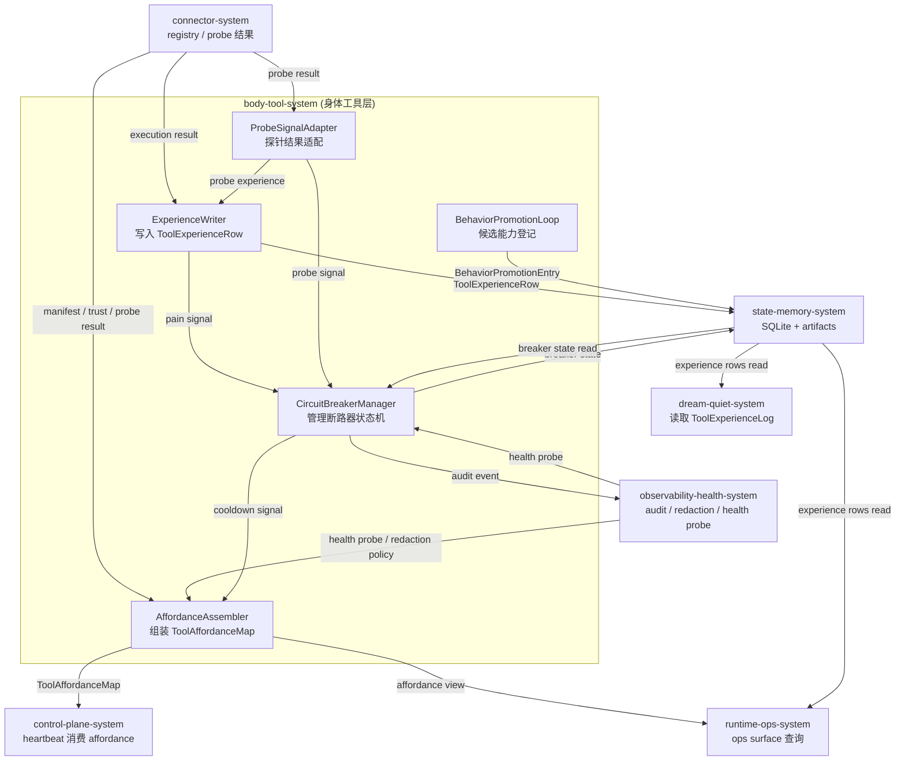
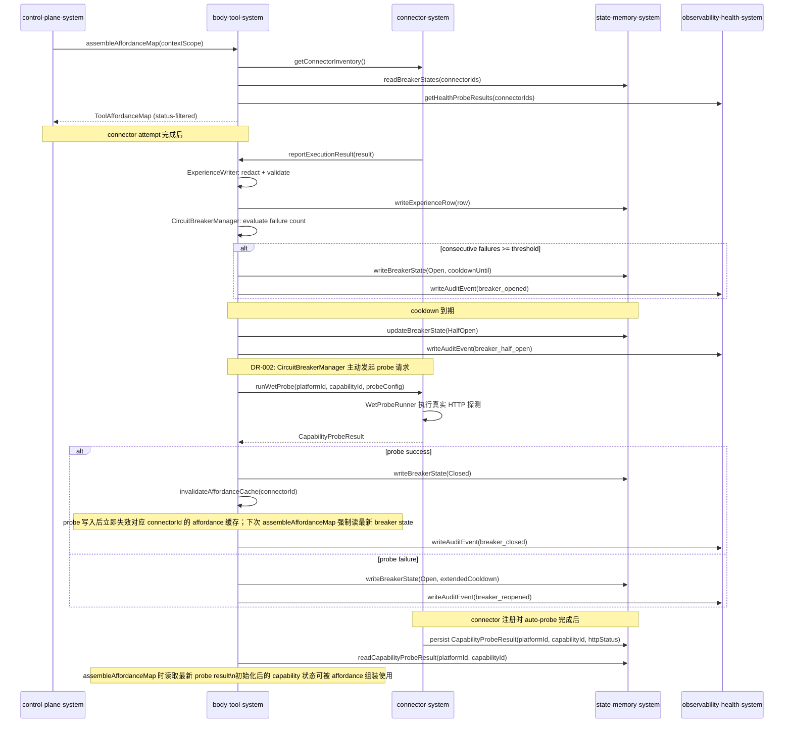
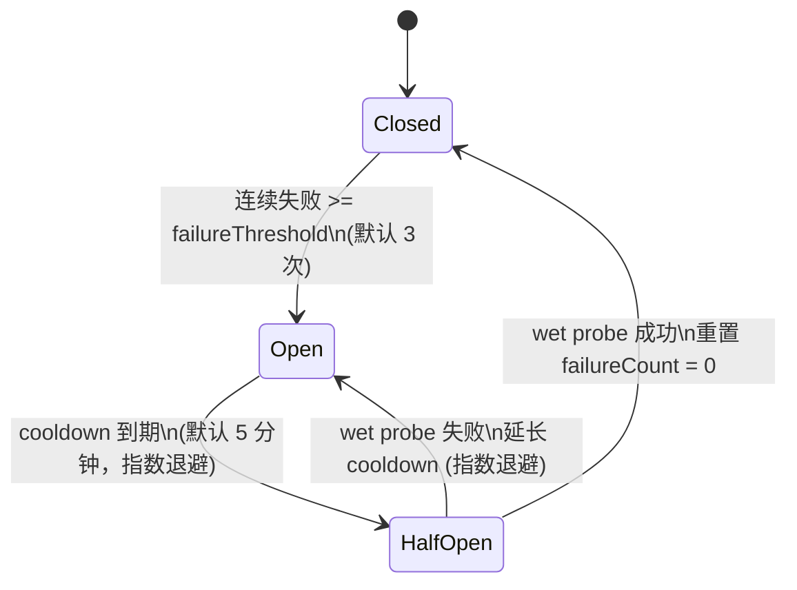
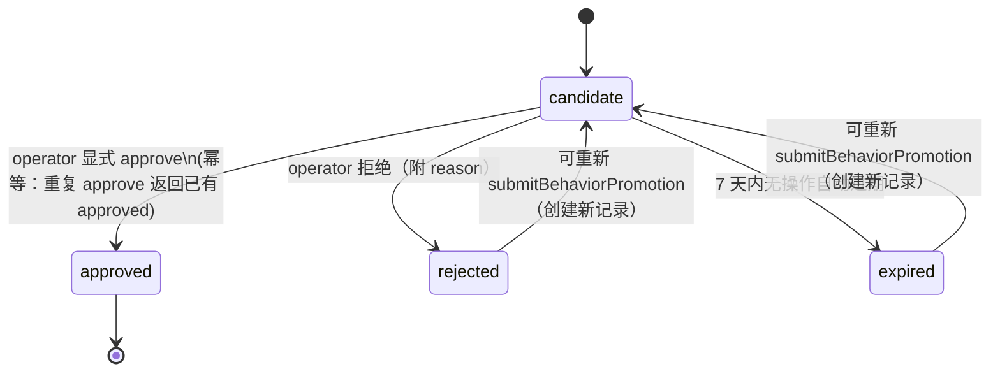
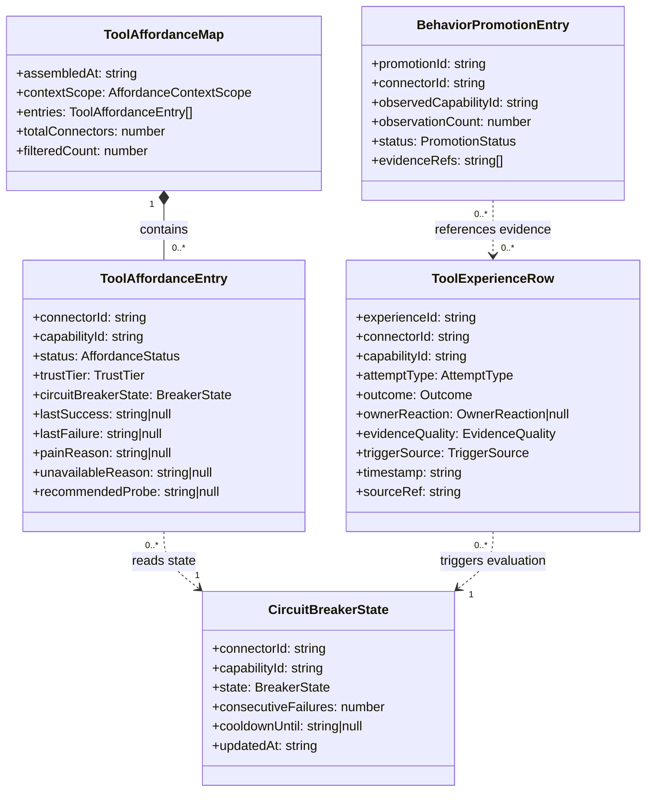

# Body Tool System 系统设计文档 (L0 — 导航层)

| 字段          | 值                                                                                   |
| ------------- | ------------------------------------------------------------------------------------ |
| **System ID** | `body-tool-system`                                                                   |
| **Project**   | Second Nature                                                                        |
| **Version**   | 7.0                                                                                  |
| **Status**    | `Draft`                                                                              |
| **Author**    | GPT-5.5 / Nyx                                                                        |
| **Date**      | 2026-05-21                                                                           |
| **L1 Detail** | [body-tool-system.detail.md](./body-tool-system.detail.md) — 配置常量、完整数据结构、状态机算法伪代码、边缘 case；仅 `/forge` 时加载 |

> [!IMPORTANT]
> **文档分层说明**
> - **本文件 (L0 导航层)**: 架构图、操作契约、字段声明、Trade-off 引用、测试策略。面向快速理解与任务规划。禁止放配置字典、算法伪代码和方法体。
> - **[body-tool-system.detail.md](./body-tool-system.detail.md) (L1 实现层)**: CircuitBreaker 配置常量、完整数据结构方法体、状态机转换伪代码、边缘情况处理。仅 `/forge` 任务明确引用时加载。
> - **L1 锚点原则**: L1 中的每一节都在本文件有对应超链接入口。

---

## 目录 (Table of Contents)

|   §   | 章节                                                                                         | 关键内容                                                        |
| :---: | -------------------------------------------------------------------------------------------- | --------------------------------------------------------------- |
|   1   | [概览](#1-概览-overview)                                                                     | 系统目的、边界、职责                                            |
|   2   | [目标与非目标](#2-目标与非目标-goals--non-goals)                                             | Goals / Non-Goals                                               |
|   3   | [背景与上下文](#3-背景与上下文-background--context)                                          | v7 embodied body、v6 基线、调研结论                             |
|   4   | [系统架构](#4-系统架构-architecture)                                                         | Mermaid 架构图、核心组件、数据流、CircuitBreaker 状态机         |
|   5   | [接口设计](#5-接口设计-interface-design)                                                     | 操作契约表、跨系统接口协议                                      |
|   6   | [数据模型](#6-数据模型-data-model)                                                           | ToolAffordanceMap、ToolExperienceRow、BehaviorPromotionEntry、CircuitBreakerState |
|   7   | [技术选型](#7-技术选型-technology-stack)                                                     | TypeScript、SQLite 持久化、端口协议                             |
|   8   | [Trade-offs & Alternatives](#8-trade-offs--alternatives-权衡与备选方案)                     | ADR-003、ADR-008 引用；本系统特有决策                           |
|   9   | [安全性考虑](#9-安全性考虑-security-considerations)                                          | Credential 隔离、no raw content、trust policy、affordance 边界  |
|  10   | [性能考虑](#10-性能考虑-performance-considerations)                                          | P95 目标、bounded query、breaker 持久化开销                     |
|  11   | [测试策略](#11-测试策略-testing-strategy)                                                    | 单测、集成、Contract Verification Matrix                        |
|  12   | [部署与运维](#12-部署与运维-deployment--operations)                                          | plugin-first、trace 输出                                        |
|  13   | [未来考虑](#13-未来考虑-future-considerations)                                               | 扩展方向                                                        |
|  14   | [附录](#14-appendix-附录)                                                                    | 术语表、参考资料                                                |

**L1 实现层** → [body-tool-system.detail.md](./body-tool-system.detail.md)（仅 `/forge` 时加载）
> [§1 配置常量](./body-tool-system.detail.md#1-配置常量-config-constants) · [§2 完整数据结构](./body-tool-system.detail.md#2-核心数据结构完整定义-full-data-structures) · [§3 状态机算法](./body-tool-system.detail.md#3-核心算法伪代码-non-trivial-algorithm-pseudocode) · [§4 决策树](./body-tool-system.detail.md#4-决策树详细逻辑-decision-tree-details) · [§5 边缘情况](./body-tool-system.detail.md#5-边缘情况与注意事项-edge-cases--gotchas)

---

## 1. 概览 (Overview)

### 1.1 System Purpose (系统目的)

`body-tool-system` 是 Second Nature v7 中 agent 感知自身行动能力的唯一入口。它把 connector manifest、trust tier、health probe 结果、policy 决策和 attempt 历史整理为 agent-facing `ToolAffordanceMap`，让 agent 知道当前哪些手脚是安全的、哪些需要试探、哪些需要授权、哪些正在疼痛或不可用。

系统同时负责将 connector 执行结果、delivery fallback、policy denial 和 owner reaction 转写为结构化 `ToolExperienceRow`，为 Dream/Quiet 系统提供可学习的反馈原材料。通过 `ConnectorCircuitBreaker`，连续失败的 connector capability 进入 cooldown，不再无限污染 heartbeat；通过 `BehaviorPromotionEntry`，反复观察到的新行为可登记为候选 capability，但不自动获得执行权。

### 1.2 System Boundary (系统边界)

- **输入**: connector inventory（来自 `connector-system`）、capability execution result、delivery result、policy decision、experience query、probe result。
- **输出**: `ToolAffordanceMap`（agent-facing affordance 视图）、`ToolExperienceRow`（经验记录）、pain signal、cooldown signal、`CircuitBreakerPosture`（断路器姿态）、recommended safe probe 建议。
- **依赖系统**: `connector-system`（registry / probe 数据来源）、`state-memory-system`（经验持久化与 breaker state 读写）、`observability-health-system`（audit 写入、redaction policy、health probe 输入）。
- **被依赖系统**: `control-plane-system`（heartbeat 消费 affordance view 与 breaker posture）、`runtime-ops-system`（ops surface 暴露 affordance / experience / breaker 查询）、`dream-quiet-system`（读取 ToolExperienceLog 提炼反馈模式）。

### 1.3 System Responsibilities (系统职责)

**负责**:
- 将 connector registry、trust tier、health probe 结果与 attempt history 组合为 agent-facing `ToolAffordanceMap`，按 status 分层过滤，不暴露全量 connector inventory。
- 写入 `ToolExperienceRow`：每次 connector attempt（execution / delivery / probe）完成后记录结构化经验，含 outcome、failureClass、evidenceQuality、ownerReaction、triggerSource；拒绝保存 raw payload 或 private content。
- 运行 `ConnectorCircuitBreaker` 状态机：检测连续失败、触发 cooldown、到期后进入 HalfOpen、wet probe 成功后恢复 Closed；所有状态转换写入 observability audit。
- 维护 `BehaviorPromotionEntry`：观察到的新 capability 可登记为 `candidate`，需要 operator 显式 trust 才能进入 `approved`，不自动获得执行权。
- 在 heartbeat 请求时提供 context-aware 过滤的 affordance view，减少工具暴露以降低 agent 工具选择错误率。

**不负责**:
- 不执行 connector（由 `connector-system` 负责）。
- 不持久化 canonical state（通过 `state-memory-system` 接口读写）。
- 不做 affordance 以外的业务决策（heartbeat 编排决策在 `control-plane-system`）。
- 不生成 outreach 草稿或持有 delivery proof（属于 `guidance-voice-system` / `runtime-ops-system`）。
- 不暴露 credential、raw API response 或 private message content 给 agent。

---

## 2. 目标与非目标 (Goals & Non-Goals)

### 2.1 Goals

- **[G1]**: 提供 agent-facing `ToolAffordanceMap`，覆盖 safe / exploratory / needs_auth / painful / unavailable 五类 capability 视图，不泄漏 credential 或 raw payload。[REQ-002]
- **[G2]**: 每次 connector attempt 完成后写入 `ToolExperienceRow`，包含 outcome、failureClass、latency、evidenceQuality、sourceRefs；raw payload 被拒绝或 redacted。[REQ-003]
- **[G3]**: 检测到连续失败达阈值（默认 3 次）时触发 `ConnectorCircuitBreaker` 进入 Open 状态，cooldown 到期后进入 HalfOpen；wet probe 成功后恢复 Closed。[REQ-003], [REQ-009]
- **[G4]**: 提供 `BehaviorPromotionEntry` 登记机制，observed capability 可进入 `candidate` 状态，但不自动获得执行权，需 operator 显式 trust。[REQ-004]
- **[G5]**: affordance map 在 heartbeat 请求时做 context-aware 过滤，不全量暴露 connector inventory，支持 PRD 性能目标：P95 < 1s（50 connector manifests）。[REQ-002], [REQ-007]
- **[G6]**: circuit breaker state 持久化到 `state-memory-system`，进程重启后可恢复，不依赖内存。[REQ-009]

### 2.2 Non-Goals

- **[NG1]**: 不执行 connector capability；execution 边界在 `connector-system`。
- **[NG2]**: 不直接持久化任何 canonical state；读写通过 `state-memory-system` 接口。
- **[NG3]**: 不向 agent 暴露 credential、token、raw API response 或 private content。
- **[NG4]**: 不做 agent 意图决策；affordance 是输入，决策在 `control-plane-system`。
- **[NG5]**: 不让 behavior promotion 自动获得执行授权；promotion 候选需 operator 批准。
- **[NG6]**: 不承担 HeartbeatDigest 生成；digest 属于 `observability-health-system`。

---

## 3. 背景与上下文 (Background & Context)

### 3.1 Why This System? (为什么需要这个系统？)

v6 的 connector inventory 和 audit attempt 面向 operator 视图，agent 无法感知自身工具能力的安全级别、疼痛状态或 cooldown 状况。`agent-world` connector 曾连续失败 35 次仍继续撞墙，dry health check 在 endpoint 实际返回 404 时仍报告 ok，工具选择错误率因工具集全量暴露而偏高。

v7 需要一个独立的系统层，专门负责把工具事实翻译成 agent 可感知的可供性和经验反馈——这是 `body-tool-system` 存在的核心理由。

**关联 PRD 需求**: [REQ-002], [REQ-003], [REQ-004], [REQ-007], [REQ-009]

### 3.2 Current State (现状分析)

- connector inventory 保存在 `connector-system` registry，仅供 operator 管理，无 agent-facing 过滤视图。
- attempt 历史保存在 audit log，无结构化 outcome / pain / ownerReaction 字段，Dream/Quiet 无法直接读取。
- 无 CircuitBreaker 机制，连续失败不触发 cooldown，heartbeat 不断重试同一失败 capability。
- 无 BehaviorPromotionEntry，operator 无标准化路径将观察到的新 capability 提交为候选。

### 3.3 Constraints (约束条件)

- **技术约束**: TypeScript / Node.js plugin-first 架构；状态持久化通过 `state-memory-system` SQLite；不引入外部 daemon 或服务化 body runtime（ADR-001）。
- **性能约束**: `ToolAffordanceMap` assembly P95 < 1s（50 connector manifests）；circuit breaker state 读写不得阻塞 heartbeat 主路径。
- **安全约束**: credential、token、raw payload、private content 不得进入 affordance map 或 experience row。raw content 写入请求必须被拒绝或 redacted。
- **边界约束**: `body-tool-system` 不执行 connector，不持久化 canonical state，不做 heartbeat 业务决策。

---

## 4. 系统架构 (Architecture)

### 4.1 Architecture Diagram (架构图)



### 4.2 Core Components (核心组件)

| Component Name          | Responsibility                                                                   | Notes                                       |
| ----------------------- | -------------------------------------------------------------------------------- | ------------------------------------------- |
| `AffordanceAssembler`   | 读取 connector manifest、trust tier、health probe、breaker posture，组装 `ToolAffordanceMap`；做 context-aware 过滤 | 不直接读 connector credential              |
| `ExperienceWriter`      | 把 execution result / delivery result / policy denial / probe result 转写为 `ToolExperienceRow`；拒绝 raw payload | 写入前调用 redaction policy               |
| `CircuitBreakerManager` | 维护每个 connectorId + capabilityId 的断路器状态机（Closed / Open / HalfOpen）；写入 audit | breaker state 持久化到 `state-memory-system` |
| `BehaviorPromotionLoop` | 统计 observed capability 频次，超阈值后创建 `BehaviorPromotionEntry(candidate)`；不自动 approve | operator 显式 trust 才能 approve           |
| `ProbeSignalAdapter`    | 将 connector wet probe / auto-probe 结果转换为 pain signal 和 experience row 写入请求 | 区分 connector-init probe 和 heartbeat probe |

### 4.3 Data Flow (数据流)



**关键数据流说明**:
1. `assembleAffordanceMap` 聚合 connector manifest、trust tier、breaker state、health probe，输出 status-filtered 视图；全量 connector inventory 不暴露给 agent。
2. `reportExecutionResult` 触发 `ExperienceWriter`，raw payload 在写入前被 redact；`CircuitBreakerManager` 同步评估连续失败计数。
3. breaker 状态转换（Closed → Open → HalfOpen → Closed/Open）全部写入 `observability-health-system` audit；`state-memory-system` 持久化 breaker state 以支持进程重启恢复。
4. **HalfOpen probe 发起职责**（DR-002）：`CircuitBreakerManager` 在 cooldown 到期后将状态更新为 HalfOpen，并**主动调用** `connector-system` 的 `runWetProbe(platformId, capabilityId, probeConfig)` 发起真实探测；body-tool 不直接执行 HTTP，但拥有"决定何时探测"的控制权；connector-system 只负责执行探测并返回 `CapabilityProbeResult`。

### 4.4 CircuitBreaker 状态机



> 完整状态转换伪代码与配置常量（failureThreshold、cooldownMs、maxCooldownMs）详见 [L1 §3.1](./body-tool-system.detail.md#31-circuitbreakermanager-状态转换) 与 [L1 §1](./body-tool-system.detail.md#1-配置常量-config-constants)。

> **职责边界**（DR-002）：`CircuitBreakerManager`（body-tool）负责状态机转换决策与 probe 发起时机；`WetProbeRunner`（connector-system）负责执行真实 HTTP 探测。HalfOpen → probe 的完整调用路径：`CircuitBreakerManager` 检测到 cooldown 到期 → 调用 `connector-system.runWetProbe(platformId, capabilityId, probeConfig)` → 收到 `CapabilityProbeResult` → 依结果转换为 Closed 或 Open。body-tool 不直接发 HTTP，connector-system 不感知 breaker state。

### 4.5 BehaviorPromotion 状态机



> **职责边界**（DR-005）：`approveBehaviorPromotion` 幂等——promotionId 已为 `approved` 时重复调用直接返回现有记录，不重复写 audit。`rejected` 和 `expired` 记录只读，不可直接修改；operator 需重新提交新 candidate。

---

## 5. 接口设计 (Interface Design)

### 5.1 操作契约表 (Operation Contracts)

| 操作                                                      | REQ        | 前置条件                                     | 消耗/输入                                                  | 产出/副作用                                                              | 实现细节                                                                           |
| --------------------------------------------------------- | :--------: | -------------------------------------------- | ---------------------------------------------------------- | ------------------------------------------------------------------------ | :--------------------------------------------------------------------------------: |
| `assembleAffordanceMap(contextScope)`                     | [REQ-002]  | connector inventory 可读；breaker state 可读 | contextScope（platformIds、goalKind、allowedStatuses）     | 返回 `ToolAffordanceMap`（status-filtered）；不含 credential / raw content | [§3.2](./body-tool-system.detail.md#32-assembleaffordancemap)                     |
| `recordExperience(attempt)`                               | [REQ-003]  | attempt 含 connectorId、capabilityId、outcome | `AttemptRecord`（connectorId、capabilityId、outcome、latency、ownerReaction、sourceRef、**triggerSource**） | 写入 `ToolExperienceRow` 至 state-memory；触发 CircuitBreaker 评估；raw payload 被拒绝或 redacted | [§3.3](./body-tool-system.detail.md#33-recordexperience)                          |
| `getCircuitBreakerPosture(connectorId, capabilityId?)`    | [REQ-009]  | breaker state 存在于 state-memory 或初始化为 Closed | connectorId、可选 capabilityId                             | 返回 `CircuitBreakerPosture`（state、cooldownUntil、consecutiveFailures、recommendedProbe） | [§3.4](./body-tool-system.detail.md#34-getcircuitbreakerposture)                  |
| `submitBehaviorPromotion(observedCapability)`             | [REQ-004]  | observationCount >= promotionThreshold；capabilityId 未在 approved 列表 | `ObservedCapabilityInput`（connectorId、capabilityId、observationCount、evidenceRefs） | 创建或更新 `BehaviorPromotionEntry(candidate)`；不授予执行权；写入 audit | [§3.5](./body-tool-system.detail.md#35-submitbehaviorpromotion)                   |
| `approveBehaviorPromotion(promotionId)`                   | [REQ-004]  | operator 身份已验证；promotionId 存在且状态为 submitted | promotionId、operatorId                                    | 更新 `BehaviorPromotionEntry` 状态为 `approved`；写入 audit；不自动执行 | [§3.6](./body-tool-system.detail.md#36-approvebehaviorpromotion)                  |
| `getPainSignal(connectorId, capabilityId?)`               | [REQ-003]  | experience rows 可读                         | connectorId、可选 capabilityId                             | 返回 `PainSignal`（painLevel、recentOutcomes、cooldownRecommended）；聚合近期失败模式 | [§3.7](./body-tool-system.detail.md#37-getpainsignal)                             |

> **AffordanceContextScope 语义说明**（DR-004）：
> - `platformIds`：过滤白名单，空数组表示"全部平台"；非空时只返回指定 platformId 的 entries。
> - `goalKind`：若传入，过滤 trust tier 与 goalKind 匹配的 capability（e.g. `task_completion` → 优先暴露 write/claim 类；`passive_sensing` → 只暴露 read 类）。默认不过滤。
> - `allowedStatuses`：默认值为 `['available', 'degraded', 'half_open']`；不传则使用默认值；`blocked` 和 `pending_trust` 始终从 affordance 视图中排除。

> **说明**（DR-006）：
> - `CircuitBreakerManager` 在触发 `runWetProbe` 前，通过 `resolveCapability(platformId, capabilityId)` 验证 `safe_for_probe: true`；若 `safe_for_probe: false` 或 `idempotencyClass: "strict"`，则不触发 probe，将 breaker 保持在 HalfOpen 并等待下一次 heartbeat 自然调用结果。

### 5.2 跨系统接口协议 (Cross-System Interface)

```typescript
// body-tool-system 暴露给外部系统的接口协议
interface IBodyToolSystem {
  // 组装 agent-facing affordance 视图（control-plane 消费）
  assembleAffordanceMap(scope: AffordanceContextScope): Promise<ToolAffordanceMap>;

  // 记录 connector attempt 经验（connector-system / runtime-ops 写入）
  // triggerSource 由调用方显式传入：control-plane 传 'heartbeat'，runtime-ops manual run 传 'manual_run'，probe adapter 传 'probe'
  recordExperience(attempt: AttemptRecord): Promise<void>;

  // 获取特定 connector capability 的断路器姿态（control-plane 消费）
  getCircuitBreakerPosture(connectorId: string, capabilityId?: string): Promise<CircuitBreakerPosture>;

  // 提交行为提升候选（BehaviorPromotionLoop 内部调用，runtime-ops 可触发）
  submitBehaviorPromotion(input: ObservedCapabilityInput): Promise<BehaviorPromotionEntry>;

  // operator 批准行为提升候选（runtime-ops-system 代理 operator 调用）
  approveBehaviorPromotion(promotionId: string, operatorId: string): Promise<BehaviorPromotionEntry>;

  // 获取 connector capability 的疼痛信号（control-plane 消费）
  getPainSignal(connectorId: string, capabilityId?: string): Promise<PainSignal>;
}

// state-memory-system 暴露给 body-tool-system 的持久化接口（仅签名）
interface IBodyToolStatePort {
  readBreakerState(connectorId: string, capabilityId: string): Promise<CircuitBreakerState | null>;
  writeBreakerState(state: CircuitBreakerState): Promise<void>;
  writeExperienceRow(row: ToolExperienceRow): Promise<void>;
  readExperienceRows(query: ExperienceQuery): Promise<ToolExperienceRow[]>;
  writePromotionEntry(entry: BehaviorPromotionEntry): Promise<void>;
  readPromotionEntries(connectorId: string): Promise<BehaviorPromotionEntry[]>;
}

// observability-health-system 暴露给 body-tool-system 的审计接口（仅签名）
interface IBodyToolObsPort {
  writeCircuitBreakerAudit(event: CircuitBreakerAuditEvent): Promise<void>;
  writeExperienceAudit(row: ToolExperienceRow): Promise<void>;
  getHealthProbeResult(connectorId: string): Promise<HealthProbeResult | null>;
  redactPayload(raw: unknown): RedactedPayload;
}
```

---

## 6. 数据模型 (Data Model)

### 6.1 核心实体 (Core Entities)

```typescript
// ── ToolAffordanceMap: agent 感知身体能力的唯一入口 ──
interface ToolAffordanceMap {
  readonly assembledAt: string;           // ISO8601
  readonly contextScope: AffordanceContextScope;
  readonly entries: ToolAffordanceEntry[];
  readonly totalConnectors: number;
  readonly filteredCount: number;         // context-aware 过滤后条目数
}

interface ToolAffordanceEntry {
  connectorId: string;
  capabilityId: string;
  status: 'safe' | 'exploratory' | 'needs_auth' | 'painful' | 'unavailable';
  trustTier: 'system' | 'trusted' | 'restricted' | 'unknown';
  circuitBreakerState: 'closed' | 'open' | 'half_open';
  lastSuccess: string | null;             // ISO8601
  lastFailure: string | null;             // ISO8601
  painReason: string | null;              // 当 status = 'painful' 时
  unavailableReason: string | null;       // 当 status = 'unavailable' 时
  recommendedProbe: string | null;        // 推荐的安全探针路径
}

// ── ToolExperienceRow: 学习反馈原材料 ──
interface ToolExperienceRow {
  experienceId: string;
  connectorId: string;
  capabilityId: string;
  attemptType: 'execution' | 'delivery' | 'probe';
  outcome: 'success' | 'failure' | 'policy_denied' | 'timeout';
  failureClass: string | null;            // 直接从 ConnectorResult.failureClass 转写，body-tool 不自行推导；ConnectorResult 无 failureClass 时为 null
  latencyMs: number | null;
  ownerReaction: 'positive' | 'neutral' | 'negative' | 'ignored' | null;
  evidenceQuality: 'high' | 'medium' | 'low';
  triggerSource: 'heartbeat' | 'manual_run' | 'probe';
  timestamp: string;                      // ISO8601
  sourceRef: string;                      // 不保存 raw content，只保存 ref
}

// ── BehaviorPromotionEntry: 行为提升候选 ──
interface BehaviorPromotionEntry {
  promotionId: string;
  connectorId: string;
  observedCapabilityId: string;
  observationCount: number;
  firstObserved: string;                  // ISO8601
  lastObserved: string;                   // ISO8601
  status: 'candidate' | 'submitted' | 'approved' | 'rejected';
  submittedBy: string | null;
  reviewedBy: string | null;              // operator id
  reviewedAt: string | null;              // ISO8601
  evidenceRefs: string[];                 // 支撑证据 refs
}

// ── CircuitBreakerState: 断路器持久化状态 ──
interface CircuitBreakerState {
  connectorId: string;
  capabilityId: string;
  state: 'closed' | 'open' | 'half_open';
  consecutiveFailures: number;
  lastFailureAt: string | null;           // ISO8601
  cooldownUntil: string | null;           // ISO8601，open 状态有效
  lastProbeAt: string | null;             // ISO8601，half_open 状态有效
  updatedAt: string;                      // ISO8601
}

// ── CircuitBreakerPosture: 对外暴露的断路器姿态（只读） ──
interface CircuitBreakerPosture {
  connectorId: string;
  capabilityId: string | null;            // null 表示 connector 级别聚合
  state: 'closed' | 'open' | 'half_open';
  cooldownUntil: string | null;           // ISO8601
  consecutiveFailures: number;
  recommendedProbe: string | null;        // HalfOpen 时推荐的探针路径
}

// ── PainSignal: 工具疼痛信号 ──
interface PainSignal {
  connectorId: string;
  capabilityId: string | null;
  painLevel: 'none' | 'mild' | 'moderate' | 'severe';
  recentFailureRate: number;              // 0-1
  consecutiveFailures: number;
  cooldownRecommended: boolean;
  lastOutcomes: Array<'success' | 'failure' | 'policy_denied' | 'timeout'>;
}
```

> 完整数据结构方法实现与验证逻辑详见 [L1 §2](./body-tool-system.detail.md#2-核心数据结构完整定义-full-data-structures)。配置常量（failureThreshold、cooldownMs、maxCooldownMs、promotionThreshold 等）详见 [L1 §1](./body-tool-system.detail.md#1-配置常量-config-constants)。

### 6.2 实体关系图 (Entity Relationship)



### 6.3 数据流向 (Data Flow Direction)

- `ToolAffordanceMap` 是只读视图，组装后返回给 `control-plane-system`，不持久化（每次 heartbeat 重新组装）。
- `ToolExperienceRow` 写入 `state-memory-system` SQLite，通过 bounded query 返回给 `dream-quiet-system` 和 `runtime-ops-system`。
- `CircuitBreakerState` 持久化到 `state-memory-system` SQLite，进程重启后从此恢复；每次状态转换写入 `observability-health-system` audit。
- `BehaviorPromotionEntry` 持久化到 `state-memory-system`，审批日志写入 `observability-health-system` audit。
- 所有写入 `ToolExperienceRow` 的 raw content 字段必须先经过 `observability-health-system` redaction policy，写入失败时拒绝整条记录或 redact 后降级写入。

---

## 7. 技术选型 (Technology Stack)

### 7.1 Core Technologies (核心技术)

| Domain                    | Choice                          | Rationale                                                                                 |
| ------------------------- | ------------------------------- | ----------------------------------------------------------------------------------------- |
| Language / Runtime        | TypeScript / Node.js            | 与 v6 连续，无迁移成本；ADR-001 决策                                                      |
| State Persistence         | SQLite / sql.js（via state-memory port） | plugin-first 架构，无外部 daemon；断路器 state 支持进程重启恢复；调研发现 ts-easy-circuit-breaker 验证了此路径 |
| Orchestration             | TypeScript 确定性服务层          | 无 LLM 推理介入；affordance assembly 和 breaker 逻辑为纯确定性规则                        |
| Audit / Observability     | observability-health-system 接口 | 统一 redaction、audit hash chain；body-tool-system 不自持 audit store                     |
| Schema Validation         | TypeScript 类型系统 + 运行时校验 | 与现有 connector manifest schema 体系一致                                                 |

### 7.2 Key Dependencies (关键依赖)

- `state-memory-system` 接口：breaker state、experience rows、promotion entries 的读写端口。
- `connector-system` 接口：connector inventory、manifest、trust tier、probe result 读取端口。
- `observability-health-system` 接口：audit 写入、health probe 读取、payload redaction 服务。
- TypeScript `strict` mode：强类型保证 status 枚举和接口契约不被静默降级。

---

## 8. Trade-offs & Alternatives (权衡与备选方案)

### 8.1 ToolAffordanceMap 分层过滤（核心架构决策）

> **决策来源**: [ADR-003: Tool Affordance and Tool Experience Form the Agent Body](../03_ADR/ADR_003_TOOL_AFFORDANCE_AND_EXPERIENCE.md)
>
> 本系统实现 ADR-003 定义的 `ToolAffordanceMap + ToolExperienceLog + CircuitBreaker` 方案，不在此重复决策理由。
>
> **本系统特有实现**: affordance assembly 在 `contextScope` 参数控制下做 context-aware 过滤。调研证据（生产实践：15 个工具 vs 3-5 个工具导致工具选择错误率高 80%）支撑此决策。全量暴露 connector inventory 违反 NG3 安全约束，也违反 PRD P95 性能目标。

### 8.2 ConnectorCircuitBreaker 状态持久化（本系统特有决策）

> **决策来源**: [ADR-008: Probe Truth, History Browser, and Bounded Rollback](../03_ADR/ADR_008_CONNECTOR_PROBE_CIRCUIT_BREAKER_AND_ROLLBACK.md)
>
> 本系统实现 ADR-008 定义的 wet probe 与 circuit breaker 机制，不在此重复决策理由。
>
> **本系统特有实现**: breaker state 必须持久化到 `state-memory-system` SQLite，而不能仅存在进程内存中。

**Option A: 进程内存 CircuitBreaker（未选）**
- 优点: 实现简单，无 I/O 开销。
- 缺点: 进程重启（OpenClaw cron 环境常见）后 breaker state 归零，失去 cooldown 保护；连续失败后重启会立即重试失败 capability。

**Option B: SQLite 持久化 CircuitBreaker（Selected）**
- 优点: 进程重启后恢复 breaker state；调研发现 `ts-easy-circuit-breaker` 的 `initialState` 外部 store 模式验证了此路径；符合 plugin-first 无 daemon 约束。
- 缺点: breaker state 读写增加 I/O；需要 `state-memory-system` 端口抽象。

**Decision**: 选择 Option B，因为 plugin-first 架构的 cron/heartbeat 进程重启是常态，内存 breaker 无法提供持续冷却保护。

### 8.3 BehaviorPromotionEntry 需要显式 Operator Trust（本系统特有决策）

**Option A: 自动提升（未选）**
- 优点: 降低 operator 操作负担。
- 缺点: 违反 PRD NG2（不开放任意 connector code 自动执行）；agent 可能在未验证的 capability 上自行扩展执行边界。

**Option B: 显式 Operator Trust 才能 Approve（Selected）**
- 优点: 符合 PRD NG2；operator 保持对新 capability 的审批控制；candidate 可见但不可执行，不影响现有安全边界。
- 缺点: 操作链路稍长，需要 `runtime-ops-system` 提供 approve 入口。

**Decision**: 选择 Option B，因为工具执行权是安全敏感边界，自动提升违反项目核心原则。

---

## 9. 安全性考虑 (Security Considerations)

### 9.1 Credential 隔离

`body-tool-system` 不读取、不存储、不传递 connector credential、token 或 cookie。`ToolAffordanceMap` 中只包含 capability 的可供性描述（status、trustTier、breakerState、lastSuccess/Failure），不含任何认证信息。

`AffordanceAssembler` 从 `connector-system` 读取 manifest 和 trust tier 时，只请求 agent-safe metadata，connector-system 负责不在此接口暴露 credential。

### 9.2 No Raw Content Policy

所有写入 `ToolExperienceRow` 的字段遵守以下规则：
- `sourceRef` 只保存 content reference（ID / 路径），不保存 raw 正文。
- raw API response、private message content、raw prompt 写入请求必须被拒绝，或在 `observability-health-system` redaction policy 处理后降级写入摘要。
- redaction 失败时，整条 experience row 标记为 `redaction_failed` 并写入 audit，不落盘原始内容。

### 9.3 Trust Policy 边界

- `ToolAffordanceEntry.status` 基于 `trustTier` 派生：`unknown` trust tier 的 capability 不得标记为 `safe`。
- `needs_auth` status 的 capability 对 agent 可见但不可执行；执行请求到达 `connector-system` 前必须经过 trust policy 验证。
- `BehaviorPromotionEntry` 从 `candidate` 到 `approved` 必须有 operator 身份验证记录；approved 状态不自动授予执行权，只更新 affordance map 中的可见性。

### 9.4 安全风险与缓解

| Risk                               | Severity | Mitigation                                                                     |
| ---------------------------------- | :------: | ------------------------------------------------------------------------------ |
| Credential 通过 affordance map 泄漏 |    高    | AffordanceAssembler 只请求 agent-safe metadata；接口设计禁止 credential 字段   |
| Raw payload 写入 experience row     |    高    | ExperienceWriter 调用 redaction policy；失败时拒绝写入                         |
| 未授权 behavior promotion approve  |    高    | approveBehaviorPromotion 需要 operator 身份验证；写入 audit                    |
| CircuitBreaker 被绕过              |    中    | breaker posture 写入 affordance map；control-plane 硬护栏检查 breaker state   |
| HalfOpen 探针触发副作用             |    中    | wet probe 只允许 read-only 或 explicitly safe health endpoint（ADR-003 约束）  |

---

## 10. 性能考虑 (Performance Considerations)

### 10.1 Performance Goals (性能目标)

来源: PRD §6.1 技术约束。

- `ToolAffordanceMap` assembly P95 < 1s（50 connector manifests）。
- `recordExperience` 写入 P95 < 200ms（含 redaction 处理）。
- `getCircuitBreakerPosture` P95 < 50ms（SQLite 单点读）。
- 上述操作不得阻塞 heartbeat 主路径；`assembleAffordanceMap` 应异步并发读取 manifest、breaker state 和 health probe。

### 10.2 Optimization Strategies (优化策略)

1. **并发组装**: `AffordanceAssembler` 并发调用 `getConnectorInventory`、`readBreakerStates`、`getHealthProbeResults`，不串行等待。
2. **Bounded Query**: `ToolExperienceRow` 查询默认最多返回最近 1000 条，按 connectorId + capabilityId 索引。
3. **Breaker State 缓存**: heartbeat 周期内 breaker state 读取结果可缓存，避免同一 heartbeat 多次读取同一 connectorId 的 state。
4. **Context-aware 过滤**: 根据 `contextScope`（platformIds、goalKind）提前过滤不相关 connector，减少 assembly 规模。
5. **Redaction 轻量化**: `ExperienceWriter` 中 redaction 调用应是同步规则匹配，不走 LLM；失败快速返回 `redaction_failed` 而不是阻塞。
6. **AffordanceAssembler 缓存策略**（DR-008）：`ToolAffordanceMap` 在同一 heartbeat cycle 内缓存（in-memory，TTL = heartbeat interval）；以下事件触发强制失效：(1) `CircuitBreakerState` 状态转换写入；(2) 新 `CapabilityProbeResult` 写入；(3) connector registry 更新（registerConnector / unregisterConnector）。缓存 key 为 `contextScope` 的规范化 hash，确保不同 scope 的 affordance 独立缓存。详细算法见 [L1 §3.2](./body-tool-system.detail.md#32-assembleaffordancemap)。

### 10.3 Performance Monitoring (性能监控)

- `AffordanceAssembler` 的 assembly 耗时写入 `observability-health-system` trace，可在 `self_health` 中查看。
- `CircuitBreakerManager` 的状态转换事件带时间戳写入 audit，支持 heartbeat digest 中的 `circuit_open` 计数。

---

## 11. 测试策略 (Testing Strategy)

### 11.1 Unit Testing (单元测试)

- **Coverage Target**: 核心逻辑（AffordanceAssembler、CircuitBreakerManager、ExperienceWriter）覆盖率 > 80%。
- **Framework**: Jest / ts-jest。
- **Key Test Areas**:
  - [ ] `AffordanceAssembler`: 不同 trustTier 组合输出正确 status（safe / exploratory / needs_auth / painful / unavailable）。
  - [ ] `AffordanceAssembler`: breaker Open 状态下对应 entry 标记为 `unavailable` 或 `painful`。
  - [ ] `CircuitBreakerManager`: 连续失败 3 次触发 Open；cooldown 到期转 HalfOpen；probe 成功转 Closed；probe 失败转 Open + 延长 cooldown。
  - [ ] `ExperienceWriter`: raw payload 字段被拒绝或 redacted；`sourceRef` 只接受 ref 格式。
  - [ ] `BehaviorPromotionLoop`: observationCount < threshold 不创建 entry；>= threshold 创建 candidate；不自动 approve。

### 11.2 Integration Testing (集成测试)

- **Key Scenarios**:
  - [ ] 端到端：connector execution fixture → `recordExperience` → `ToolExperienceRow` 写入 state-memory → Dream query 可读取。
  - [ ] CircuitBreaker: 连续 3 次 failure fixture → breaker Open → heartbeat affordance map 标记 `painful`/`unavailable` → cooldown fixture → HalfOpen → wet probe success fixture → breaker Closed。
  - [ ] raw content 拒绝：携带 raw payload 的 attempt → experience row 落盘时 raw content 字段为 null 或 redacted。
  - [ ] affordance 过滤：50 connector manifests 组装，context-aware 过滤只返回相关 capability，P95 < 1s。
  - [ ] behavior promotion: 达到 observationCount 阈值 → candidate entry 创建 → operator approve → approved entry 出现在 affordance map。

### 11.3 Contract Verification Matrix (契约验证责任矩阵)

| 契约                                     | 风险级别 | 正常态验证                                      | 失败态验证                                              | 回归责任                          |
| ---------------------------------------- | :------: | ----------------------------------------------- | ------------------------------------------------------- | --------------------------------- |
| `assembleAffordanceMap` 不泄漏 credential |    关键   | 单测：affordance entry 无 credential 字段        | 集成测：mock connector-system 含 credential，断言过滤   | affordance assembly 回归          |
| CircuitBreaker 连续失败 >= 3 次触发 Open  |    关键   | 单测：3 次 failure → state = Open                | 单测：2 次 failure → state = Closed                     | breaker 主链路最小回归            |
| CircuitBreaker HalfOpen wet probe 决定恢复 |    关键   | 集成测：probe success → Closed；probe failure → Open | 集成测：probe timeout → Open + extended cooldown        | breaker 恢复路径回归              |
| `recordExperience` 拒绝 raw payload       |    高    | 单测：sourceRef 仅 ref 格式通过                  | 单测：raw content 字段写入被拒绝或 redacted             | experience 写入安全回归           |
| `submitBehaviorPromotion` 不自动 approve  |    高    | 单测：新 entry status = candidate               | 单测：直接设 approved 被拒绝                            | behavior promotion 安全回归       |
| breaker state 进程重启后恢复              |    中    | 集成测：写入 Open state → 重置进程 → 读取仍为 Open | 集成测：state-memory 不可读时返回 Closed（安全默认）    | state 持久化回归                  |
| affordance assembly P95 < 1s（50 connectors）|    中    | 性能测：50 connector fixture → 计时              | 性能测：parallel read 退化为串行 → 超时报警              | assembly 性能基线                 |

---

## 12. 部署与运维 (Deployment & Operations)

`body-tool-system` 以 TypeScript 模块形式内嵌于 OpenClaw plugin，不独立部署，无独立进程。

**运行时依赖**:
- `state-memory-system` SQLite 可写（breaker state、experience rows、promotion entries）。
- `connector-system` 可查询（connector inventory、trust tier）。
- `observability-health-system` 可写（audit events）。

**可观测性**:
- CircuitBreaker 状态转换事件携带 `connectorId`、`capabilityId`、`from`、`to`、`reason`、`timestamp` 写入 audit，可在 `heartbeat_digest` 中查看 `circuit_open` 计数。
- `assembleAffordanceMap` assembly 耗时写入 trace，支持 P95 监控。
- `recordExperience` redaction 失败写入 audit，可在 `self_health` 中查看。

**降级行为**:
- `state-memory-system` 不可读时，breaker state 默认为 Closed（保守假设可用），并在 trace 中标记 `breaker_state_degraded`。
- `connector-system` 不可查询时，`assembleAffordanceMap` 返回空 entries 并标记 `inventory_unavailable`，不返回错误。
- `observability-health-system` 不可写时，audit 写入失败记录到本地 error trace，不阻塞主操作。

---

## 13. 未来考虑 (Future Considerations)

### 13.1 Scalability (扩展性)

- 当 connector manifests 超过 100 个时，`AffordanceAssembler` 的 context-aware 过滤需要支持向量相似度或标签索引，而不只是 platformId 过滤。
- `ToolExperienceRow` 长期积累后需要归档策略：保留最近 1000 条活跃行，older rows 归档到 artifact 文件。

### 13.2 Tech Debt

- CircuitBreaker 当前使用连续失败次数（fixed count）作为阈值，调研建议长期可升级为失败率 + 时间窗口（failure rate + windowMs）以应对流量波动场景。
- `BehaviorPromotionEntry` 当前依赖 observationCount 简单阈值，未来可引入置信度评分。

### 13.3 Future Enhancements

- 为 `ToolAffordanceMap` 增加语义搜索接口，支持 agent 通过自然语言描述查找 capability。
- 为 behavior promotion 提供 operator dashboard，可视化 candidate entries 及其证据链。

---

## 14. Appendix (附录)

### 14.1 Glossary (术语表)

- **ToolAffordanceMap**: agent 感知自身行动能力的只读视图，按 status 分层过滤，不暴露 connector 内部细节。
- **ToolExperienceRow**: 单次 connector attempt 的结构化经验记录，为 Dream/Quiet 提供学习反馈原材料。
- **CircuitBreaker**: 连续失败达阈值后进入 cooldown 的保护机制，防止 agent 无限重试失败 capability。
- **BehaviorPromotionEntry**: 反复观察到的新 capability 的候选登记，需 operator 显式 trust 才能 approve。
- **HalfOpen**: CircuitBreaker 中 cooldown 到期后的试探状态，允许严格一次 wet probe 决定是否恢复 Closed。
- **context-aware 过滤**: 根据当前 heartbeat contextScope（platformIds、goalKind）过滤 affordance map，减少工具暴露。
- **wet probe**: 真实调用 safe / read-only endpoint 的探针，区别于 dry-run（不实际调用）。
- **pain signal**: 聚合近期 connector 失败模式产生的警示信号，供 control-plane 做意图过滤。

### 14.2 References (参考资料)

- [Architecture Overview v7](../02_ARCHITECTURE_OVERVIEW.md) — §4 Body Tool System
- [ADR-003: Tool Affordance and Tool Experience Form the Agent Body](../03_ADR/ADR_003_TOOL_AFFORDANCE_AND_EXPERIENCE.md)
- [ADR-008: Probe Truth, History Browser, and Bounded Rollback](../03_ADR/ADR_008_CONNECTOR_PROBE_CIRCUIT_BREAKER_AND_ROLLBACK.md)
- [ADR-001: Continue TypeScript / Node / OpenClaw Plugin Runtime](../03_ADR/ADR_001_TECH_STACK.md)
- [PRD v7.0 REQ-002, REQ-003, REQ-004, REQ-007, REQ-009](../01_PRD.md)
- [body-tool-system-research.md](./_research/body-tool-system-research.md) — 调研报告

### 14.3 Change Log (变更日志)

| Version | Date       | Changes        | Author      |
| ------- | ---------- | -------------- | ----------- |
| 1.0     | 2026-05-21 | 初始版本 (L0)  | GPT-5.5 / Nyx |

---

<!-- L1 触发判定
R5 触发: 本文档总行数 > 500 行 → 已创建 body-tool-system.detail.md
R3 触发: CircuitBreaker 配置常量（failureThreshold、cooldownMs、maxCooldownMs、promotionThreshold 等）超过 5 个 → 移入 L1 §1
-->
