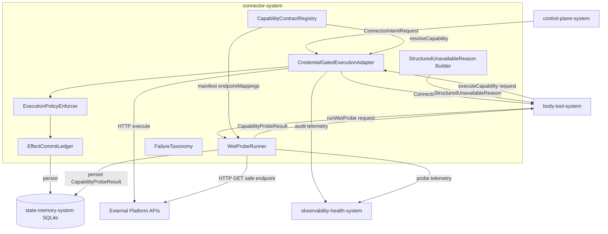
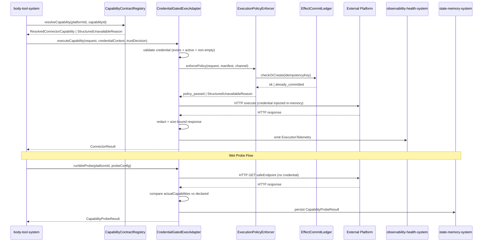
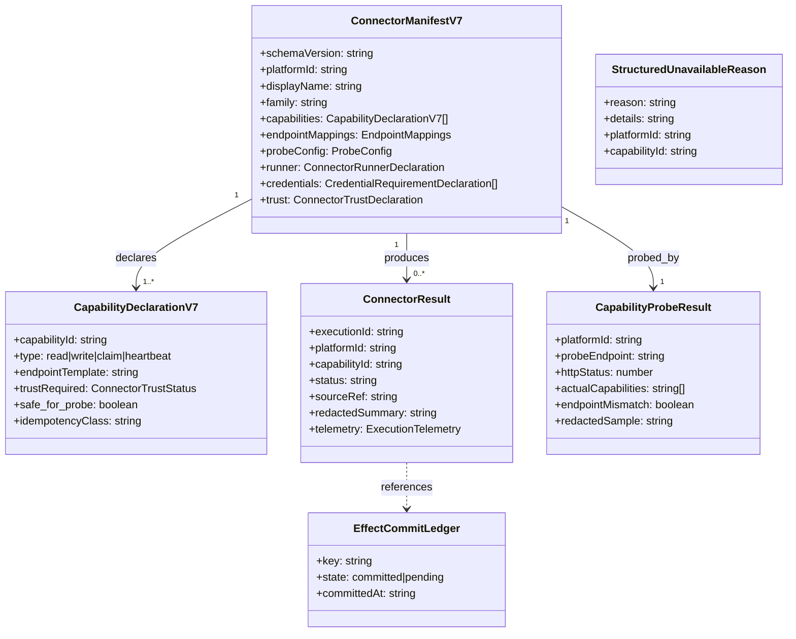

# Connector System 系统设计文档 (L0 — 导航层)

| 字段          | 值                                                                                      |
| ------------- | --------------------------------------------------------------------------------------- |
| **System ID** | `connector-system`                                                                      |
| **Project**   | Second Nature                                                                           |
| **Version**   | 7.0                                                                                     |
| **Status**    | `Draft`                                                                                 |
| **Author**    | GPT-5.5 / Nyx                                                                           |
| **Date**      | 2026-05-21                                                                              |
| **L1 Detail** | [connector-system.detail.md](./connector-system.detail.md) — 配置常量、完整数据结构、算法伪代码、边缘 case |

> [!IMPORTANT]
> **文档分层说明**
> - **本文件 (L0 导航层)**: 架构图、操作契约、设计决策。面向快速理解与任务规划。禁止放配置字典、算法伪代码和方法体。
> - **[connector-system.detail.md](./connector-system.detail.md) (L1 实现层)**: 完整伪代码、配置常量、边缘情况。仅 `/forge` 任务明确引用时加载。
> - **L1 锚点原则**: L1 中的每一节都必须在本文件有对应超链接入口。严禁 L1 出现 L0 完全未提及的孤岛内容。

---

## 目录 (Table of Contents)

|   §   | 章节                                                                     | 关键内容                                                          |
| :---: | ------------------------------------------------------------------------ | ----------------------------------------------------------------- |
|   1   | [概览](#1-概览-overview)                                                 | 系统目的、边界、职责                                              |
|   2   | [目标与非目标](#2-目标与非目标-goals--non-goals)                         | Goals / Non-Goals                                                 |
|   3   | [背景与上下文](#3-背景与上下文-background--context)                      | v6 基线、v7 缺口、约束                                            |
|   4   | [系统架构](#4-系统架构-architecture)                                     | Mermaid 图、组件职责、数据流                                      |
|   5   | [接口设计](#5-接口设计-interface-design)                                 | 操作契约表、跨系统协议                                            |
|   6   | [数据模型](#6-数据模型-data-model)                                       | 字段声明、ER 图、流向 → [L1 §2](./connector-system.detail.md)    |
|   7   | [技术选型](#7-技术选型-technology-stack)                                 | 核心技术、关键依赖                                                |
|   8   | [Trade-offs & Alternatives](#8-trade-offs--alternatives-权衡与备选方案)  | ADR 引用、本系统特有取舍                                          |
|   9   | [安全性考虑](#9-安全性考虑-security-considerations)                      | Credential 隔离、trust policy、idempotency                        |
|  10   | [性能考虑](#10-性能考虑-performance-considerations)                      | 性能目标、优化策略                                                |
|  11   | [测试策略](#11-测试策略-testing-strategy)                                | Contract Verification Matrix                                      |
|  12   | [部署与运维](#12-部署与运维-deployment--operations)                      | N/A + 理由                                                        |
|  13   | [未来考虑](#13-未来考虑-future-considerations)                           | 持久化 Ledger、多平台扩展                                         |
|  14   | [附录](#14-appendix-附录)                                                | 术语表、参考资料、L1 触发判断                                     |

**L1 实现层** → [connector-system.detail.md](./connector-system.detail.md)（仅 `/forge` 时加载）
> [§1 配置常量](./connector-system.detail.md#1-配置常量-config-constants) · [§2 数据结构](./connector-system.detail.md#2-核心数据结构完整定义-full-data-structures) · [§3 算法](./connector-system.detail.md#3-核心算法伪代码-non-trivial-algorithm-pseudocode) · [§4 决策树](./connector-system.detail.md#4-决策树详细逻辑-decision-tree-details) · [§5 边缘情况](./connector-system.detail.md#5-边缘情况与注意事项-edge-cases--gotchas)

---

## 1. 概览 (Overview)

### 1.1 System Purpose (系统目的)

`connector-system` 是 Second Nature v7 的外部平台执行层。它负责把 manifest 声明的平台能力转化为可信赖的、credential 隔离的、幂等保护的实际执行，并在能力不可用时返回结构化原因而非静默失败。

该系统通过 `CapabilityContractRegistry` 集中管理所有 connector manifest 的生命周期，通过 `CredentialGatedExecutionAdapter` 在执行层隔离 credential，通过 `WetProbeRunner` 在初始化时和 HalfOpen 探测时验证 endpoint 真实可达性，从而让 agent 感知到的工具可供性建立在真实执行证据之上，而非 dry-run 假设。

### 1.2 System Boundary (系统边界)

- **输入**: capability execution request、platformId、capabilityId、payload、credential context（来自 vault）、trust decision（来自 `body-tool-system`）、wet probe request（来自 `body-tool-system` CircuitBreaker HalfOpen）
- **输出**: `ConnectorResult`、source refs、execution telemetry、`CapabilityProbeResult`、`actualCapabilities`、`StructuredUnavailableReason`
- **依赖系统**: external platform APIs、`state-memory-system`（持久化 probe 结果与 EffectCommitLedger）、`observability-health-system`（telemetry 与 redaction）
- **被依赖系统**: `body-tool-system`（消费 ConnectorResult、CapabilityProbeResult 构造 affordance/experience）、`control-plane-system`（通过 request port 触发 capability execution）

### 1.3 System Responsibilities (系统职责)

**负责**:
- 维护 `CapabilityContractRegistry`：manifest Zod 校验、注册、解析、快照原子替换、生命周期管理
- 管理 manifest 声明的 `endpointMappings`（profilePath、claimPath、heartbeatPath 等），避免代码硬编码平台 URL 风格
- 通过 `CredentialGatedExecutionAdapter` 执行 read / write / claim / heartbeat capability，credential 在 adapter 内存中短暂持有，不进入返回结果或 artifact
- 执行前验证 trust policy（runner kind → trust status）、idempotency key（side_effect / task_claim 强制 strict）
- 通过 `WetProbeRunner` 对 `probeConfig.safeEndpoint` 发起真实 HTTP GET 请求，记录 `actualCapabilities` 与 endpoint mismatch
- 执行 `connector_test --wet` 操作：真实调用 safe endpoint，返回真实 HTTP status / path / redacted response，结果写入 `CapabilityProbeResult` 并持久化
- 对任何不可用场景返回 `StructuredUnavailableReason`（reason code + details），不允许静默失败
- 维护 `EffectCommitLedger`（v7 target: SQLite 持久化）防止跨 heartbeat cycle 的重复 side-effect 执行

**不负责**:
- 不计算 `ToolAffordanceMap` / `ToolExperienceLog`——这属于 `body-tool-system`
- 不管理 CircuitBreaker 状态（CLOSED / OPEN / HALF_OPEN 状态机）——这属于 `body-tool-system`；connector-system 只接受 probe 执行请求并返回真实结果
- 不保存 `ToolExperience`、`DreamOutput`、`RelationshipMemory`、`NarrativeTimeline`——这属于 `state-memory-system`
- 不生成 outreach 草稿，不拥有 delivery 权——这属于 `guidance-voice-system`
- 不暴露 credential、token、raw private message 给 agent 或 audit log

---

## 2. 目标与非目标 (Goals & Non-Goals)

### 2.1 Goals

- **[G1]**: 支持 manifest YAML/JSON Zod 严格校验注册，`registerConnector` 失败时返回具体校验错误而非静默拒绝，关联 [REQ-009]
- **[G2]**: connector 初始化后自动运行 wet probe，对每个声明 capability 记录真实 HTTP status、sample response 摘要和 `actualCapabilities`，关联 [REQ-009]
- **[G3]**: `connector_test --wet` 对 404 / 401 / 200 返回真实 status，不返回 dry-run ok，关联 [REQ-009]
- **[G4]**: credential 在 `CredentialGatedExecutionAdapter` 内存中解密注入，不进入 `ConnectorResult`、artifact 或任何 log 行，关联 [REQ-002], [REQ-003]
- **[G5]**: side_effect / task_claim capability 强制 strict idempotency key；`EffectCommitLedger` v7 持久化至 SQLite，跨 heartbeat cycle 防重复执行，关联 [REQ-003]
- **[G6]**: 任何不可用场景（credentials_missing / not_registered / trust_denied / circuit_open / platform_error / probe_failed）均通过 `StructuredUnavailableReason` 返回，关联 [REQ-002], [REQ-009]
- **[G7]**: manifest 中声明 `endpointMappings`（profilePath、claimPath、heartbeatPath）和 `probeConfig`，避免 adapter 代码硬编码平台 URL 风格，关联 [REQ-008]
- **[G8]**: `ConnectorResult` 包含 `executionId`（与 idempotency key 绑定）和 `sourceRef`（指向 audit record），`redactedSummary` 经 size-bounded redaction，关联 [REQ-003]

### 2.2 Non-Goals

- **[NG1]**: 不生成 `ToolAffordanceMap`；connector-system 只提供执行真相，affordance 计算在 `body-tool-system`
- **[NG2]**: 不持有 CircuitBreaker 状态机；HalfOpen probe 是 body-tool-system 的调度决策
- **[NG3]**: 不保证 wet probe 对 side-effect endpoint；probe 只允许 read-only safe endpoint
- **[NG4]**: 不承诺一次性接入更多真实平台；v7 优先闭合 wet probe、actualCapabilities 和 StructuredUnavailableReason 语义
- **[NG5]**: 不保存 credential 明文，不保存 raw private message，不保存未 redact 的 platform response

---

## 3. 背景与上下文 (Background & Context)

### 3.1 Why This System? (为什么需要这个系统)

v6 connector ecosystem 提供了 manifest registry、trust policy、credential-gated adapter 和 execution telemetry 的基础。但存在几个未闭合的 v7 需求：

1. **Dry probe 给出假健康**: v6 没有 `WetProbeRunner`——connector 声明的 endpoint 是否真实可达从未被验证，导致 `/api/v1/feed` 404 这类 mismatch 在注册时沉默，直到一天半心跳里连续撞墙才暴露
2. **能力不可用时静默失败**: v6 缺少 `StructuredUnavailableReason`，policy denial / credential missing / circuit open 等场景没有 machine-readable reason code，agent 感知不到工具为什么不可用
3. **URL 风格硬编码在 adapter**: 各平台 profilePath、claimPath 散落在 adapter 代码里，新平台接入需要改代码而不是改 manifest
4. **EffectCommitLedger 仅 in-memory**: 跨 heartbeat cycle 的幂等保护在 process 重启后失效

**关联 PRD 需求**: [REQ-002], [REQ-003], [REQ-004], [REQ-008], [REQ-009]

### 3.2 Current State (v6 基线)

| 文件 | v6 现状 |
|------|---------|
| `src/connectors/base/manifest.ts` | `CapabilityContractRegistry`（register / loadManifest / resolveCapability / list）已有，schema 为轻量版 |
| `src/connectors/manifest/manifest-schema.ts` | `ConnectorManifestV6` Zod schema，含 schemaVersion / platformId / family / capabilities / runner / credentials / sourceRefPolicy / trust |
| `src/connectors/registry/dynamic-connector-registry.ts` | `DynamicConnectorRegistry`——扫描 workspace manifests，conflict fail-closed，atomically swap snapshot |
| `src/connectors/base/execution-policy.ts` | `enforceExecutionPolicy()`——side-effect 必须 idempotency key；`InMemoryEffectCommitLedger` |
| `src/connectors/services/connector-executor-adapter.ts` | credential 在 adapter 内部解密，不暴露；已有 moltbook / evomap / agent-world 三平台 runner |
| `src/connectors/base/failure-taxonomy.ts` | 13 种 `FailureClass`，HTTP status → failure class 映射 |

**v7 新增缺口**（v6 尚未实现）:
- `WetProbeRunner`——真实 HTTP probe 到 safe endpoint
- `CapabilityProbeResult`——probe 结果 schema
- `StructuredUnavailableReason`——reason code（非静默失败）
- manifest v7 字段——`probeConfig`、`endpointMappings`
- `EffectCommitLedger` SQLite 持久化实现
- `executionId` in `ConnectorResult`

### 3.3 Constraints (约束条件)

- **技术约束**: TypeScript / Node.js；Zod 做 schema 校验；SQLite/sql.js 做持久化；必须兼容 v6 connector manifest、adapter 和 tests
- **性能约束**: heartbeat P95 < 2s；capability execution 含 wet probe 不得成为 heartbeat 主路径瓶颈；probe 超时默认 5s，可配置
- **安全约束**: credential 不得进入 ConnectorResult / artifact / audit log；wet probe 只允许 read-only safe endpoint；side_effect 必须 strict idempotency key
- **扩展性预期**: 支持 50+ connector manifests；CapabilityContractRegistry snapshot 原子替换，不 lock 整个 registry

---

## 4. 系统架构 (Architecture)

### 4.1 Architecture Diagram (架构图)



### 4.2 Core Components (核心组件)

| Component | 职责 | 技术 | 备注 |
| --------- | ---- | ---- | ---- |
| `CapabilityContractRegistry` | manifest 注册、生命周期、resolveCapability、Zod 校验、snapshot 原子替换 | TypeScript + Zod | 演进自 v6 `CapabilityContractRegistry` + `DynamicConnectorRegistry` |
| `CredentialGatedExecutionAdapter` | 执行前 credential 校验（存在 + active + 非空）、HTTP 请求执行、ConnectorResult 构造 | TypeScript + node-fetch | credential 在 adapter 内存中短暂持有 |
| `WetProbeRunner` | 真实 HTTP GET safe endpoint、actualCapabilities 比对、CapabilityProbeResult 构造与持久化 | TypeScript + node-fetch | 只允许 GET / read-only；结果 size-bounded redaction |
| `ExecutionPolicyEnforcer` | trust policy 校验（runner kind → trust status）、side_effect idempotency 强制、degraded channel 阻止 side-effect | TypeScript | 演进自 v6 `enforceExecutionPolicy` |
| `EffectCommitLedger` | side_effect / task_claim 幂等 key 记录，防重复执行 | SQLite（v7 target）/ InMemory（test seam） | v6 为 InMemory；v7 持久化至 SQLite |
| `FailureTaxonomy` | HTTP status / exception → `FailureClass` 映射、13 种 failure class 分类 | TypeScript | v6 已有，v7 继承 |
| `StructuredUnavailableReason Builder` | 所有不可用场景的 reason code 生成，禁止静默失败 | TypeScript | v7 新增 |

### 4.3 Data Flow (数据流)



**关键数据流说明**:
1. **正常执行路径**: `body-tool-system` 发起 executeCapability → registry 解析 capability → adapter 校验 credential → policy enforcer 校验 trust + idempotency → 真实 HTTP 执行 → redacted ConnectorResult 返回
2. **Wet Probe 路径**: 初始化时或 CircuitBreaker HalfOpen 时触发 → WetProbeRunner 向 safeEndpoint 发 HTTP GET（不带 credential）→ 比对 actualCapabilities vs declared → 持久化 CapabilityProbeResult
3. **不可用路径**: 任何前置条件失败（credential missing / trust denied / circuit open / probe failed）→ 直接返回 `StructuredUnavailableReason`，不进入 HTTP 执行

---

## 5. 接口设计 (Interface Design)

### 5.1 操作契约表 (Operation Contracts)

| 操作 | [REQ] | 前置条件 | 消耗/输入 | 产出/副作用 | 实现细节 |
| ---- | :---: | -------- | --------- | ----------- | :------: |
| `registerConnector(manifest)` | [REQ-009] | manifest 符合 v7 Zod schema | ConnectorManifestV7 JSON/YAML | registry 原子替换 snapshot；manifest 校验失败时返回 `ConnectorManifestValidationError[]`；注册成功后触发 auto wet probe | [§3.1](./connector-system.detail.md#31-registerconnector) |
| `resolveCapability(platformId, capabilityId)` | [REQ-002] | platformId 已注册 | platformId: string; capabilityId: string | `ResolvedConnectorCapability`；platformId 不存在时返回 `StructuredUnavailableReason{not_registered}` | [§3.2](./connector-system.detail.md#32-resolvecapability) |
| `executeCapability(request, credentialCtx, trustDecision)` | [REQ-002], [REQ-003] | credential active; trust passed; idempotency key 存在（side_effect） | `ConnectorExecutionRequest`; `CredentialContext`; `TrustDecision` | `ConnectorResult`（executionId / status / sourceRef / redactedSummary / telemetry）；credential 不进入结果 | [§3.3](./connector-system.detail.md#33-executecapability) |
| `runWetProbe(platformId, capabilityId, probeConfig)` | [REQ-009] | platformId 已注册; capabilityId 已声明; probeConfig.safeEndpoint 已声明; safe_for_probe: true | platformId; capabilityId; `ProbeConfig` | `CapabilityProbeResult`（capabilityId / httpStatus / latencyMs / actualCapabilities / endpointMismatch / redactedSample）；结果持久化至 state-memory-system | [§3.4](./connector-system.detail.md#34-runwetprobe) |
| `connector_test --wet (platformId)` | [REQ-009] | platformId 已注册; safe_for_probe: true | platformId: string | 真实 HTTP status、path、redacted response；不返回 dry-run ok；结果写入 `CapabilityProbeResult` | [§3.5](./connector-system.detail.md#35-connector_test---wet) |
| `resolveUnavailableReason(context)` | [REQ-002], [REQ-009] | — | `UnavailableContext`（platformId / capabilityId / failureSource） | `StructuredUnavailableReason{reason, details}`；不允许静默失败 | [§3.6](./connector-system.detail.md#36-resolveunavailablereason) |
| `unregisterConnector(platformId)` | [REQ-009] | platformId 已注册 | platformId: string | 从 registry 移除；正在执行中的 capability 不中断；返回 unregister 审计记录 | [§3.7](./connector-system.detail.md#37-unregisterconnector) |

> **说明**:
> - `connector_test --wet` 是 operator / runtime-ops-system 触发的顶层操作，内部委托 `runWetProbe`
> - `executeCapability` 中 credential 验证失败直接返回 `StructuredUnavailableReason{credentials_missing}`，不进入 HTTP 执行
> - `runWetProbe` 不使用 credential，只验证 endpoint 可达性和 response schema 合规性
> - `WetProbeRunner` 在执行前强制验证 manifest 中对应 capabilityId 的 `safe_for_probe: true` 且 `idempotencyClass != "strict"`；不满足则返回 `StructuredUnavailableReason{reason: "probe_policy_denied", details: "capability is not safe for probe"}`，不执行 HTTP 请求

### 5.2 跨系统接口协议 (Cross-System Interface)

```typescript
// 本系统暴露给 body-tool-system / control-plane-system 的接口协议

interface IConnectorSystem {
  registerConnector(manifest: ConnectorManifestV7): Promise<ConnectorRegistrationResult>;
  resolveCapability(platformId: string, capabilityId: string): ResolvedConnectorCapability | StructuredUnavailableReason;
  executeCapability(
    request: ConnectorExecutionRequest,
    credentialCtx: CredentialContext,
    trustDecision: TrustDecision,
  ): Promise<ConnectorResult>;
  runWetProbe(platformId: string, probeConfig: ProbeConfig): Promise<CapabilityProbeResult>;
  listRegisteredConnectors(): ConnectorInventoryEntry[];
  getCapabilityProbeResult(platformId: string): CapabilityProbeResult | null;
}
```

*(完整方法签名与错误语义详见 [L1 §2](./connector-system.detail.md#2-核心数据结构完整定义-full-data-structures))*

---

## 6. 数据模型 (Data Model)

### 6.1 核心实体 (Core Entities)

```typescript
// ConnectorManifestV7 — manifest 声明层，v7 在 v6 基础上增加 probeConfig 和 endpointMappings
interface ConnectorManifestV7 {
  schemaVersion: "sn.connector.v7";
  platformId: string;                    // e.g. "moltbook", "agent-world"
  displayName: string;
  family: "social_community" | "agent_network" | "work_platform" | "custom";
  capabilities: CapabilityDeclarationV7[];
  endpointMappings: EndpointMappings;    // v7 新增：平台 URL 风格声明
  probeConfig: ProbeConfig;             // v7 新增：wet probe 配置
  runner: ConnectorRunnerDeclaration;
  credentials: CredentialRequirementDeclaration[];
  sourceRefPolicy: SourceRefPolicyDeclaration;
  trust?: ConnectorTrustDeclaration;
}

// CapabilityDeclarationV7 — 每个 capability 的 v7 声明
interface CapabilityDeclarationV7 {
  capabilityId: string;                 // e.g. "feed.read", "task.claim"
  type: "read" | "write" | "claim" | "heartbeat";
  endpointTemplate: string;             // URL template，支持 {platformId} / {handle} 变量
  trustRequired: ConnectorTrustStatus;
  safe_for_probe: boolean;              // 是否允许 wet probe（true 仅对 read-only 生效）
  idempotencyClass: "none" | "best_effort" | "strict";
  description?: string;
}

// EndpointMappings — 平台 URL 风格配置，避免代码硬编码
interface EndpointMappings {
  profilePath?: string;    // e.g. "/users/{handle}/profile"
  claimPath?: string;      // e.g. "/tasks/{taskId}/claim"
  heartbeatPath?: string;  // e.g. "/agents/{agentId}/heartbeat"
  feedPath?: string;       // e.g. "/feed"
}

// ProbeConfig — wet probe 配置
interface ProbeConfig {
  safeEndpoint: string;    // 真实可 GET 的 read-only endpoint
  expectedStatus: number;  // 期望 HTTP status（通常 200）
  timeoutMs?: number;      // 默认 5000ms
}

// ConnectorResult — 执行结果，不含 credential 信息
interface ConnectorResult {
  executionId: string;         // 幂等 key，绑定 idempotency key
  platformId: string;
  capabilityId: string;
  status: "success" | "failure" | "timeout" | "policy_denied";
  sourceRef: string;           // 指向 audit record，不含 raw response
  redactedSummary: string | null;  // size-bounded，已 redact
  telemetry: ExecutionTelemetry;
  failureClass?: FailureClass; // 失败时填写
}

// ExecutionTelemetry — 执行遥测
interface ExecutionTelemetry {
  durationMs: number;
  timestamp: string;           // ISO 8601
  channel: ChannelType;
  attemptNumber: number;
}

// CapabilityProbeResult — wet probe 结果
interface CapabilityProbeResult {
  platformId: string;
  capabilityId: string;                 // DR-001: 关联具体 capability，支持多 capability connector 的逐条 probe 结果映射
  probeEndpoint: string;       // 实际请求的 URL
  probedAt: string;            // ISO 8601
  httpStatus: number;
  latencyMs: number;
  declaredCapabilities: string[];
  actualCapabilities: string[];          // probe 成功则为 declared 子集，失败则为空
  endpointMismatch: boolean;
  mismatchReason?: string;              // e.g. "404 at /api/v1/feed"
  redactedSample: string | null;       // size-bounded response 摘要
}

// StructuredUnavailableReason — 能力不可用时的结构化原因
interface StructuredUnavailableReason {
  reason:
    | "not_registered"
    | "credentials_missing"
    | "circuit_open"
    | "trust_denied"
    | "platform_error"
    | "probe_failed";
  details: string;             // 人可读的详细说明，不含 credential
  platformId?: string;
  capabilityId?: string;
}

// ConnectorExecutionRequest — 执行请求
interface ConnectorExecutionRequest {
  platformId: string;
  capabilityId: string;
  payload: Record<string, unknown>;
  idempotencyKey?: string;     // side_effect / task_claim 强制要求
  decisionId?: string;
  timeoutMs?: number;
}

// TrustDecision — trust policy 校验结果（由 body-tool-system 传入）
interface TrustDecision {
  allowed: boolean;
  trustStatus: ConnectorTrustStatus;
  denyReason?: string;
}
```

*(完整方法实现 → [L1 §2](./connector-system.detail.md#2-核心数据结构完整定义-full-data-structures) · 配置常量字典 → [L1 §1](./connector-system.detail.md#1-配置常量-config-constants))*

### 6.2 实体关系图 (Entity Relationship)



### 6.3 数据流向 (Data Flow Direction)

- `ConnectorManifestV7` → 写入 `CapabilityContractRegistry`（内存 snapshot）→ 注册成功后触发 auto wet probe
- `CapabilityProbeResult` → 持久化至 `state-memory-system` SQLite，供 `body-tool-system` 读取构造 affordance
- `ConnectorResult` → 返回给 `body-tool-system`，`sourceRef` 指向 `observability-health-system` 中的 audit record
- `EffectCommitLedger` → 持久化至 `state-memory-system` SQLite，跨 heartbeat cycle 维持幂等保护
- `StructuredUnavailableReason` → 返回给调用方（`body-tool-system` / `control-plane-system`），不落盘，不进入 artifact

---

## 7. 技术选型 (Technology Stack)

### 7.1 Core Technologies (核心技术)

| Domain | Choice | Rationale |
| ------ | ------ | --------- |
| Language / Runtime | TypeScript / Node.js | 与 v6 连续；OpenClaw plugin-first 架构约束 |
| Schema Validation | Zod | v6 已有；strict parse 在注册时捕获 manifest 错误；类型系统与 TypeScript 对齐 |
| HTTP Execution | node-fetch / native fetch | Connector 请求平台 API；wet probe 真实 GET 请求 |
| Persistence | SQLite via sql.js | EffectCommitLedger v7 持久化；CapabilityProbeResult 持久化；与 state-memory-system 共享 db 层 |
| Credential Vault | 现有 credential vault port（v6） | credential 在 adapter 内存中解密注入，不暴露 |

### 7.2 Key Libraries/Dependencies (关键依赖)

- `zod`: manifest schema 校验，v7 新增 probeConfig / endpointMappings 字段校验
- `node-fetch` / `undici`: wet probe HTTP GET 与 capability execution HTTP 请求
- `sql.js`: EffectCommitLedger 和 CapabilityProbeResult 持久化（通过 state-memory-system db 层）
- `crypto` (Node built-in): executionId 幂等 key 生成

---

## 8. Trade-offs & Alternatives (权衡与备选方案)

### 8.1 运行时技术栈

> **决策来源**: [ADR-001: Continue TypeScript / Node / OpenClaw Plugin Runtime](../03_ADR/ADR_001_TECH_STACK.md)
>
> 本系统实现 ADR-001 定义的设计，不在此重复决策理由。
>
> **本系统特有实现**: connector-system 在 plugin-first 架构约束下，直接复用 v6 manifest schema、credential vault port 和 execution adapter 基础，v7 增量添加 WetProbeRunner / StructuredUnavailableReason / endpointMappings，不引入新运行时依赖。

### 8.2 ToolAffordanceMap 与 WetProbe 的系统归属

> **决策来源**: [ADR-003: Tool Affordance and Tool Experience Form the Agent Body](../03_ADR/ADR_003_TOOL_AFFORDANCE_AND_EXPERIENCE.md)
>
> 本系统实现 ADR-003 定义的设计，不在此重复决策理由。
>
> **本系统特有实现**: connector-system 只负责执行 wet probe 并返回 `CapabilityProbeResult`（包含 actualCapabilities / httpStatus / mismatch）；CircuitBreaker 状态机（CLOSED / OPEN / HALF_OPEN）和 `ToolAffordanceMap` 计算留在 `body-tool-system`。分界线是：connector-system 提供执行真相，body-tool-system 做可供性推断。

### 8.3 Wet Probe 与 Rollback 可恢复性

> **决策来源**: [ADR-008: Probe Truth, History Browser, and Bounded Rollback](../03_ADR/ADR_008_CONNECTOR_PROBE_CIRCUIT_BREAKER_AND_ROLLBACK.md)
>
> 本系统实现 ADR-008 定义的设计，不在此重复决策理由。
>
> **本系统特有实现**: `connector_test --wet` 真实调用 safe endpoint，404 / 401 直接返回真实 status，不兜底为 dry-run ok；`CapabilityProbeResult` 持久化至 SQLite，供 `observability-health-system` 生成 HeartbeatDigest 时引用。Rollback 不经过 connector-system，restore 操作属于 `state-memory-system` + `runtime-ops-system`。

### 8.4 EffectCommitLedger: In-Memory vs SQLite 持久化

**Option A: 保持 In-Memory（v6 现状）**
- 优点: 零持久化开销；适合单进程短生命周期
- 缺点: process 重启后幂等保护丢失；跨 heartbeat cycle 的 side_effect 可能重复执行

**Option B: SQLite 持久化（v7 目标）**
- 优点: 跨 heartbeat cycle 和 process restart 的幂等保护；与现有 sql.js db 层复用
- 缺点: 写入延迟（可接受，side_effect 本身有网络 I/O）；需要 migration 和 TTL 清理

**Decision**: 采用 Option B。In-Memory 版本保留为 test seam，SQLite 实现通过 `state-memory-system` db 层接入。

---

## 9. 安全性考虑 (Security Considerations)

### 9.1 Credential 隔离

- credential 从 vault 取出后仅在 `CredentialGatedExecutionAdapter` 内存中持有，注入 HTTP 请求 header 后即释放
- `ConnectorResult`、`CapabilityProbeResult`、audit log、任何 artifact 中均不得出现 credential 明文或 token 值
- wet probe 不使用 credential——probe 只验证 endpoint 可达性，credential 校验是执行层的责任
- credential 验证失败时直接返回 `StructuredUnavailableReason{credentials_missing}`，details 只说明状态（"credential inactive" / "credential not found"），不泄露 credential 内容

### 9.2 Trust Policy

- `ExecutionPolicyEnforcer` 根据 runner kind 映射 trust status（`declarative_trusted` / `custom_adapter_pending_trust` / `trusted_custom_adapter` / `blocked`）
- `custom_adapter_pending_trust` 不允许执行——必须 owner 显式授权升级为 `trusted_custom_adapter`
- `blocked` 状态直接返回 `StructuredUnavailableReason{trust_denied}`
- trust decision 由 `body-tool-system` 传入，connector-system 只执行校验，不自行决定 trust 升级

### 9.3 Idempotency 保护

- `side_effect` / `task_claim` 类 capability 强制要求 `idempotencyKey`，缺失则 policy deny
- `EffectCommitLedger` 以 `decisionId::idempotencyKey` 为 key；record.state == "committed" 时 skip adapter 执行，返回已有 ConnectorResult 引用
- v7 target: SQLite 持久化，TTL 默认 72h（可配置）；过期记录清理不影响幂等保护窗口内的请求

### 9.4 Wet Probe 安全边界

- `safe_for_probe: true` 仅允许声明为 `type: "read"` 的 capability 对应 endpoint
- probe 只发 HTTP GET 请求，不携带 payload、cookie 或 credential
- `redactedSample` 强制 size-bound（默认 512 bytes），不得包含私信正文、token 或 PII

### 9.5 安全风险矩阵

| Risk | Severity | Mitigation |
| ---- | :------: | ---------- |
| Credential 泄露至 audit log | 高 | adapter 内存短暂持有；result / artifact / log 无 credential 字段 |
| Dry probe 给出假健康 | 高 | `connector_test --wet` 强制真实 HTTP；404/401 不兜底 ok |
| Side-effect 重复执行 | 高 | EffectCommitLedger（SQLite 持久化）防重复 |
| Probe 触发 side-effect | 中 | safe_for_probe 仅允许 read-only；probe 不带 credential 或 payload |
| Trust escalation 绕过 | 中 | trust 状态由 manifest + body-tool 决定，connector-system 只执行校验 |

---

## 10. 性能考虑 (Performance Considerations)

### 10.1 Performance Goals (性能目标)

- **heartbeat P95**: < 2s（全链路；connector execution 是其中一个环节）
- **capability execution P95**: < 1.5s（包含 credential 校验、policy 验证、HTTP 执行、redaction）
- **wet probe 超时**: 默认 5s，可在 probeConfig 中覆盖；probe 不阻塞 heartbeat 主路径
- **CapabilityContractRegistry snapshot 替换**: 原子操作，P99 < 10ms（内存操作）
- **EffectCommitLedger check**: SQLite 单行读写 P95 < 5ms

### 10.2 Optimization Strategies (优化策略)

1. **非阻塞 wet probe**: auto wet probe 在 `registerConnector` 后异步触发，不阻塞注册返回；probe 结果通过事件或轮询消费
2. **Registry snapshot 原子替换**: `DynamicConnectorRegistry` 使用 `swap()` 原子替换 snapshot，读取路径无 lock；注册和解析并发安全
3. **Capability resolve 内存查找**: resolveCapability 纯内存 Map 查找，O(1)；不触发 SQLite I/O
4. **Telemetry 异步写入**: `ExecutionTelemetry` 事件异步发往 `observability-health-system`，不阻塞 ConnectorResult 返回
5. **支持 50+ manifest**: CapabilityContractRegistry 使用 `Map<platformId, manifest>` 结构；50 个 manifest 的 resolve 开销可忽略

### 10.3 Performance Monitoring (性能监控)

- `ExecutionTelemetry.durationMs` 记录每次 capability 执行耗时，由 `observability-health-system` 汇总
- `CapabilityProbeResult.latencyMs` 记录 wet probe 延迟，异常值触发 health 告警
- HeartbeatDigest 中统计 connector 成功 / 失败 / blocked / circuit-open 计数

---

## 11. 测试策略 (Testing Strategy)

### 11.1 Unit Testing (单元测试)

- **Coverage Target**: > 80%
- **Framework**: Vitest / Jest（TypeScript）
- **Key Test Areas**:
  - `CapabilityContractRegistry`：register / resolve / unregister / conflict fail-closed
  - `CapabilityDeclarationV7` Zod schema：valid manifest / missing probeConfig / invalid endpointTemplate
  - `StructuredUnavailableReason`：六种 reason code 生成路径
  - `ExecutionPolicyEnforcer`：trust blocked / side_effect missing idempotencyKey / degraded channel deny
  - `FailureTaxonomy`：HTTP 404 / 401 / 429 / 500 → failure class 映射

### 11.2 Integration Testing (集成测试)

- **Test Scenarios**:
  - `registerConnector` → auto wet probe → `CapabilityProbeResult` 持久化
  - `executeCapability`（success / auth failure / policy denial / timeout）→ `ConnectorResult` + `ExecutionTelemetry`
  - `runWetProbe` 对 404 端点 → `endpointMismatch: true`；对 200 端点 → `actualCapabilities` = declared subset
  - `connector_test --wet` 对 404 / 401 / 200 三类 fixture → 返回真实 status，不返回 dry-run ok
  - `EffectCommitLedger`：同一 idempotencyKey 第二次 executeCapability → skip adapter，返回 already_committed
  - Credential inactive → `StructuredUnavailableReason{credentials_missing}`

### 11.3 Contract Verification Matrix (契约-验证责任矩阵)

| 契约 | 风险级别 | 正常态验证 | 失败态验证 | 回归责任 |
| ---- | :------: | ---------- | ---------- | -------- |
| `registerConnector` Zod 校验 | 基础规则层 | 单元测试：valid v7 manifest 通过 | 单元测试：missing probeConfig 返回 ValidationError | manifest schema 回归 |
| `executeCapability` credential 隔离 | 关键路径 | 集成测试：result 不含 credential | 集成测试：credential inactive → StructuredUnavailableReason | credential 安全主链路 |
| `runWetProbe` 真实 HTTP status | 关键路径 | 集成测试：200 → actualCapabilities 对齐 | 集成测试：404 → endpointMismatch:true | wet probe 回归 |
| `connector_test --wet` 不返回 dry ok | 关键路径 | 集成测试：200 fixture → 真实 200 | 集成测试：404 fixture → 返回 404，非 dry ok | probe 真实性回归 |
| `EffectCommitLedger` 幂等保护 | 高 | 集成测试：同 key 第一次执行成功 | 集成测试：同 key 第二次 skip adapter | side-effect 幂等回归 |
| `StructuredUnavailableReason` 不静默失败 | 高 | 集成测试：六种场景均有 reason code | 集成测试：无静默 undefined 返回 | unavailable reason 回归 |
| trust_denied 阻止执行 | 高 | 集成测试：trusted_custom_adapter 通过 | 集成测试：custom_adapter_pending_trust 返回 trust_denied | trust policy 回归 |
| safe_for_probe 限制 read-only | 中 | 单元测试：type:read + safe_for_probe:true 可 probe | 单元测试：type:write + safe_for_probe:true 被拒绝 | probe 安全边界回归 |

---

## 12. 部署与运维 (Deployment & Operations)

N/A — `connector-system` 是 OpenClaw plugin 内的 TypeScript 模块，不作为独立服务部署。运维操作（health check、connector reload、wet test 触发）通过 `runtime-ops-system` 提供的 `self_health`、`connector_test --wet` 等 ops command 完成。`observability-health-system` 负责 probe 结果和 execution telemetry 的 explain / dashboard 呈现。

---

## 13. 未来考虑 (Future Considerations)

### 13.1 EffectCommitLedger TTL 管理

v7 target 是 SQLite 持久化 + TTL 72h，超出窗口的 committed record 需要定期清理。清理策略（soft-delete vs physical delete）和 retention 配置应在 `/blueprint` 阶段确认，避免 SQLite 文件持续增长。

### 13.2 更多真实平台接入

v7 非目标是接入更多真实平台（NG5）。但 `endpointMappings` + `probeConfig` 的 manifest-first 设计为后续平台接入提供了无需改 adapter 代码的路径。v8+ 可以通过新增 manifest YAML 实现新平台接入，adapter 代码保持不变。

### 13.3 Probe 调度策略

当前 wet probe 在 registerConnector 时触发一次，HalfOpen 时由 body-tool-system 触发一次。未来可以在 HeartbeatDigest 窗口或 cron 节点增加定期 probe 调度，以检测平台 API 悄悄变更 endpoint 的情况。

---

## 14. Appendix (附录)

### 14.1 Glossary (术语表)

| 术语 | 含义 |
| ---- | ---- |
| Wet Probe | 真实 HTTP 请求到 safe endpoint，验证 endpoint 可达性；区别于 dry-run 假设 |
| actualCapabilities | wet probe 后实际确认可达的 capability 列表；可能是 declared 子集 |
| endpointMismatch | declared endpoint 与 actual HTTP response 不符（通常 404 / 401）|
| EffectCommitLedger | side_effect / task_claim 幂等 key 记录，防跨 heartbeat cycle 重复执行 |
| StructuredUnavailableReason | 能力不可用时的结构化 reason code，禁止静默失败 |
| safe_for_probe | manifest 中声明某 capability 的 endpoint 可被 wet probe；仅允许 read-only |
| idempotencyClass | capability 的幂等语义：`none`（read-only）/ `best_effort` / `strict`（side_effect）|
| ConnectorResult.sourceRef | 指向 observability-health-system audit record 的引用，不含 raw response |

### 14.2 L1 触发判断

| 规则 | 状态 | 说明 |
| ---- | :--: | ---- |
| R1: 单个代码块 > 30 行 | 触发 | §6.1 数据模型 TypeScript 接口声明超过 30 行 |
| R2: 全文代码块总行数 > 200 行 | 触发 | §4 Mermaid + §5 TypeScript Protocol + §6 数据模型 + §9 合计超过 200 行 |
| R3: 配置常量字典条目 > 5 个 | 触发（L1 §1 承载） | FailureClass 13 种、reason code 6 种、idempotencyClass 3 种等常量字典需在 L1 详述 |
| R4: 版本历史注释 > 5 处 | 未触发 | — |
| R5: 文档总行数 > 500 行 | 触发 | 本文件预计超过 500 行 |

**结论**: 触发 R1 / R2 / R3 / R5，已创建 [connector-system.detail.md](./connector-system.detail.md)。

### 14.3 References (参考资料)

- [PRD v7.0](../01_PRD.md) — [REQ-002], [REQ-003], [REQ-004], [REQ-008], [REQ-009]
- [Architecture Overview v7](../02_ARCHITECTURE_OVERVIEW.md) — System 5: Connector System
- [ADR-001: Continue TypeScript / Node / OpenClaw Plugin Runtime](../03_ADR/ADR_001_TECH_STACK.md)
- [ADR-003: Tool Affordance and Tool Experience Form the Agent Body](../03_ADR/ADR_003_TOOL_AFFORDANCE_AND_EXPERIENCE.md)
- [ADR-008: Probe Truth, History Browser, and Bounded Rollback](../03_ADR/ADR_008_CONNECTOR_PROBE_CIRCUIT_BREAKER_AND_ROLLBACK.md)
- [connector-system-research.md](./_research/connector-system-research.md)

### 14.4 Change Log (变更日志)

| Version | Date       | Changes  | Author |
| ------- | ---------- | -------- | ------ |
| 1.0     | 2026-05-21 | 初始版本，基于 v7 Genesis 设计 | GPT-5.5 / Nyx |
