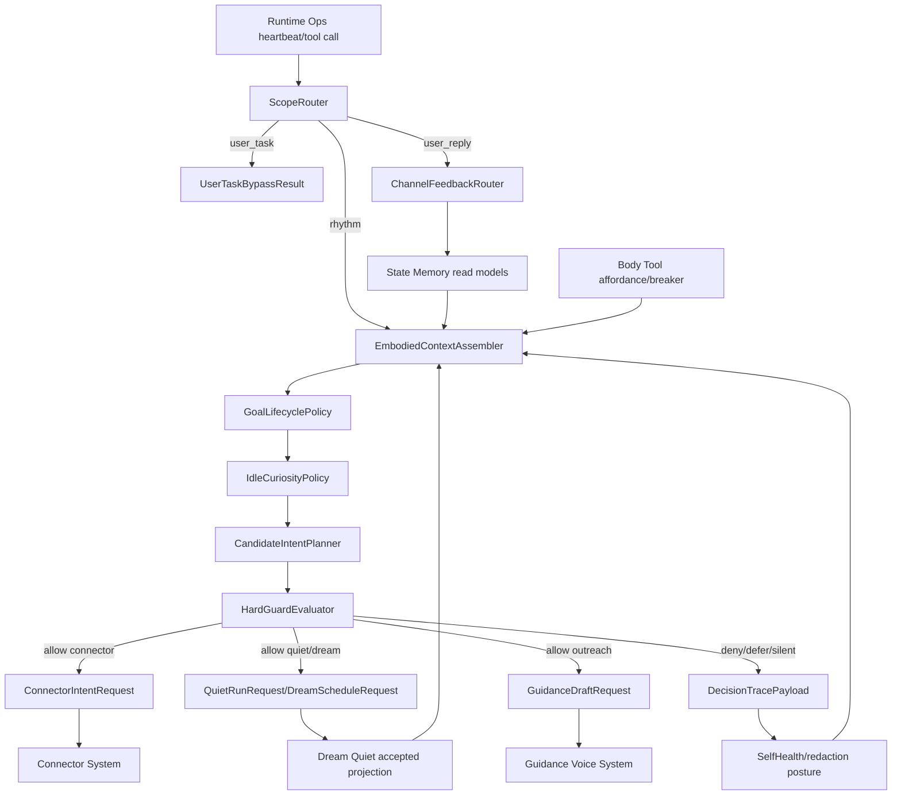
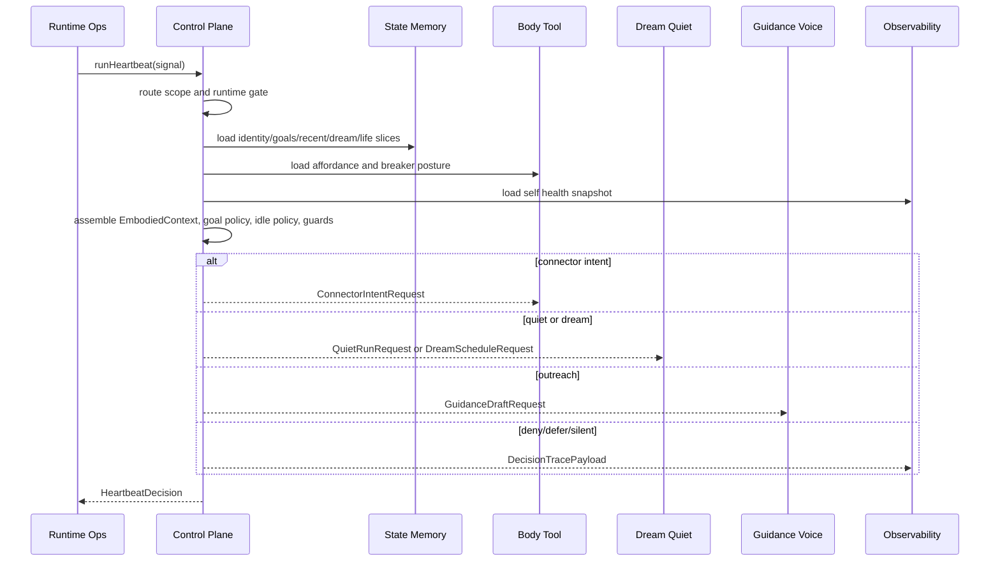
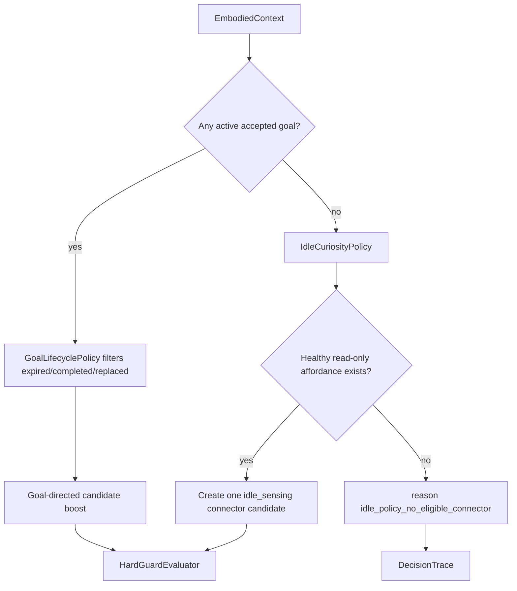
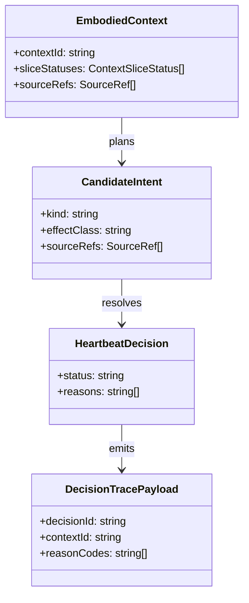

# Control Plane System 系统设计文档 (L0 - 导航层)

| 字段 | 值 |
| --- | --- |
| **System ID** | `control-plane-system` |
| **Project** | Second Nature |
| **Version** | 7.0 |
| **Status** | `Draft` |
| **Author** | GPT-5.5 / Nyx |
| **Date** | 2026-05-21 |
| **L1 Detail** | [control-plane-system.detail.md](./control-plane-system.detail.md) — 配置常量、完整数据结构、算法伪代码、guard 顺序与边缘 case |

> [!IMPORTANT]
> 本文件定义 v7 control plane：heartbeat 醒来、组装 bounded `EmbodiedContext`、评估 `GoalLifecyclePolicy` 与 `IdleCuriosityPolicy`、选择候选意图、应用硬护栏，并发出 typed downstream request。它不保存 canonical state、不执行 connector、不生成 guidance 文案、不保存 delivery proof。

## 目录 (Table of Contents)

| § | 章节 | 关键内容 |
| :---: | --- | --- |
| 1 | [概览](#1-概览-overview) | 目的、边界、职责 |
| 2 | [目标与非目标](#2-目标与非目标-goals--non-goals) | Goals / Non-Goals |
| 3 | [背景与上下文](#3-背景与上下文-background--context) | v7 embodied loop、v6 基线、调研 |
| 4 | [系统架构](#4-系统架构-architecture) | Mermaid、组件、数据流 |
| 5 | [接口设计](#5-接口设计-interface-design) | 操作契约、跨系统协议、错误语义 |
| 6 | [数据模型](#6-数据模型-data-model) | 字段声明、关系、流向 |
| 7 | [技术选型](#7-技术选型-technology-stack) | TS/Node、端口、规则策略 |
| 8 | [Trade-offs](#8-trade-offs--alternatives-权衡与备选方案) | ADR 引用与本系统取舍 |
| 9 | [安全性考虑](#9-安全性考虑-security-considerations) | 授权、隐私、越权风险 |
| 10 | [性能考虑](#10-性能考虑-performance-considerations) | P95、限流、降级 |
| 11 | [测试策略](#11-测试策略-testing-strategy) | Contract Verification Matrix |
| 12 | [部署与运维](#12-部署与运维-deployment--operations) | runtime、trace |
| 13 | [未来考虑](#13-未来考虑-future-considerations) | 后续演进 |
| 14 | [附录](#14-appendix-附录) | L1 判断、参考 |

## 1. 概览 (Overview)

### 1.1 System Purpose (系统目的)

`control-plane-system` 是 Second Nature v7 的节律与具身编排层。它让 agent 每轮 heartbeat 带着身份、目标、近期互动、Dream/Quiet 沉淀、工具经验、工具可供性、健康状态和 life evidence 醒来，然后做可解释的意图选择。

### 1.2 System Boundary (系统边界)

- **输入**: heartbeat signal、runtime scope、IdentityProfile summary、accepted goals、recent interactions、accepted Dream projection、Quiet claim snapshot、ToolExperience summaries、ToolAffordanceMap、CircuitBreaker posture、SelfHealthSnapshot、life evidence slice。
- **输出**: `HeartbeatDecision`、`DecisionTracePayload`、`CandidateIntent`、`GoalTransitionRequest`、`ConnectorIntentRequest`、`QuietRunRequest`、`DreamScheduleRequest`、`GuidanceDraftRequest`、`ChannelFeedbackIngestionRequest`。
- **依赖系统**: `state-memory-system`, `body-tool-system`, `dream-quiet-system`, `guidance-voice-system`, `observability-health-system`, `runtime-ops-system`, `connector-system` through request ports。
- **被依赖系统**: `runtime-ops-system` heartbeat / ops surface, `observability-health-system` timeline/explain, `guidance-voice-system` outreach scene assembly。

### 1.3 System Responsibilities (系统职责)

**负责**:
- 运行 heartbeat scope gate：`rhythm` 进入编排，`user_task` 绕过 rhythm gate，`user_reply` 进入轻量反馈路径。
- 通过 `EmbodiedContextAssembler` 构造 bounded context，并为每个 slice 标记 `loaded` / `degraded` / `blocked`。
- 通过 `GoalLifecyclePolicy` 判断 active goal、expired/completed/replaced goal 和 transition request。
- 通过 `IdleCuriosityPolicy` 在无 active goal 时选择最多一个 healthy、allowlisted、read-only sensing intent。
- 规划候选意图，应用 affordance、CircuitBreaker、source、budget、cooldown、quiet、risk 等硬护栏。
- 向下游发出 typed request，并记录 machine-readable decision reason。

**不负责**:
- 不保存 IdentityProfile、AgentGoal、ToolExperience、DreamOutput、RelationshipMemory、NarrativeTimeline 或 RestoreSnapshot；这些属于 `state-memory-system`。
- 不执行 connector、wet probe、credential 解密或外部 API；这些属于 `connector-system` / `body-tool-system`。
- 不生成 outreach 文案，不拥有投递权；草稿属于 `guidance-voice-system`，投递 proof 属于 `runtime-ops-system` / `observability-health-system`。
- 不运行 Dream pipeline 或写 Quiet diary；它只发出 request 或 skip reason。
- 不发布 HeartbeatDigest；digest 是 observability/runtime ops 的 dashboard proof。

## 2. 目标与非目标 (Goals & Non-Goals)

### 2.1 Goals

- **[G1]**: 每轮 heartbeat 构造 bounded `EmbodiedContext`，覆盖 IdentityProfile、accepted goals、recent interactions、accepted Dream projection、ToolExperience、SelfHealthSnapshot 和 life evidence。[REQ-001], [REQ-008]
- **[G2]**: 在 context slice 不可用时继续安全降级，并输出 `context_degraded:{kind}` reason。[REQ-001]
- **[G3]**: 让 active goal 给方向但不绕过硬护栏；replace、expire、complete、pause 由 lifecycle policy 形成 transition request。[REQ-004]
- **[G4]**: 无 active goal 时执行 IdleCuriosity 的 read-only 单意图选择；无 eligible connector 时返回 `idle_policy_no_eligible_connector`。[REQ-004]
- **[G5]**: 只消费 accepted Dream projection，拒绝 candidate projection 进入 heartbeat context。[REQ-005]
- **[G6]**: 将 outreach、Quiet/Dream、connector、channel feedback 建模为下游请求，不抢下游系统职责。[REQ-005], [REQ-006], [REQ-009], [REQ-011]

### 2.2 Non-Goals

- **[NG1]**: 不把 agent mind 替换成 deterministic planner。
- **[NG2]**: 不让 goal、Dream、Quiet、guidance 或 digest 直接获得行动授权。
- **[NG3]**: 不实现 body-tool schema、connector registry、state schema、Dream validation、delivery proof 存储或 restore 执行。
- **[NG4]**: 不保存 raw private message、credential、token、cookie、raw prompt 或 raw connector payload。
- **[NG5]**: 不在 heartbeat critical path 同步等待长 Dream 或长模型调用。

## 3. 背景与上下文 (Background & Context)

### 3.1 Why This System? (为什么需要这个系统？)

v7 把 Second Nature 从功能管线推进为 embodied loop。control-plane 是醒来的节律入口，但它的正确角色是编排身体信号，不是把头脑脚本化。

**关联 PRD 需求**: [REQ-001], [REQ-004], [REQ-005], [REQ-006], [REQ-008], [REQ-009], [REQ-011]

### 3.2 Current State (现状分析)

v6 已有 `runHeartbeatCycle()`、`ingestRhythmSignal()`、`planCandidateIntents()`、`applyGoalPriority()`、`evaluateHardGuards()`、outreach dispatch、Quiet writer 和 narrative update。现有代码已能读取 life evidence、accepted goals、narrative、relationship 和 connector registry；v7 concept model 指出现有 heartbeat 尚未稳定读取 recent conversation、Quiet claims 或 accepted Dream projection。

事实来源:
- `src/core/second-nature/heartbeat/run-heartbeat-cycle.ts`
- `src/core/second-nature/heartbeat/heartbeat-loop.ts`
- `src/core/second-nature/orchestrator/intent-planner.ts`
- `.anws/v7/concept_model.json`

### 3.3 Constraints (约束条件)

- **技术约束**: TypeScript + Node.js + OpenClaw plugin runtime；继承 ADR-001。
- **性能约束**: heartbeat P95 < 2s；`EmbodiedContext` assembly P95 < 400ms；context 必须 bounded。
- **安全约束**: private raw text、credential、token、raw prompt 不进入 context、trace 或 ordinary memory。
- **架构约束**: control-plane 不直接持久化或执行平台动作；Architecture Overview 要求拆出 `EmbodiedContextAssembler`、`GoalLifecyclePolicy`、`IdleCuriosityPolicy`。
- **协作约束**: state-memory、runtime-ops、body-tool 的最终字段以各自 L0 为准，本文件只定义消费契约和请求边界。

### 3.4 Research Summary

完整调研见 [_research/control-plane-system-research.md](./_research/control-plane-system-research.md)。核心结论：扩展 v6 deterministic guard loop，但把 embodied context、goal lifecycle 和 idle curiosity 变成一等组件，避免 control-plane 膨胀成执行器。

## 4. 系统架构 (Architecture)

### 4.1 Architecture Diagram (架构图)



### 4.2 Core Components (核心组件)

| Component | Responsibility | Boundary |
| --- | --- | --- |
| `ScopeRouter` | Classifies `rhythm`, `user_task`, `user_reply` and applies runtime availability gate. | Does not load state on carrier-only path. |
| `EmbodiedContextAssembler` | Loads bounded context slices and emits per-slice status/reasons. | Reads via ports; does not write state. |
| `GoalLifecyclePolicy` | Filters active goals and emits transition requests. | Durable goal mutation belongs to state-memory. |
| `IdleCuriosityPolicy` | Selects at most one healthy read-only sensing intent. | Does not execute connector. |
| `CandidateIntentPlanner` | Produces ordered candidates from context, goals, rhythm, and idle policy. | Candidate is not authorization. |
| `HardGuardEvaluator` | Applies source, affordance, breaker, budget, cooldown, quiet, risk, and privacy guards. | Guard result is final for control-plane. |
| `DownstreamIntentOrchestrator` | Maps allowed intent to typed downstream request. | Does not own downstream implementation. |
| `DecisionTraceEmitter` | Emits trace payloads and degradation reasons. | Audit persistence belongs to observability. |

### 4.3 Heartbeat Data Flow



### 4.4 Goal and Idle Decision Model



## 5. 接口设计 (Interface Design)

### 5.1 操作契约表 (Operation Contracts)

| 操作 | 需求 | 前置条件 | 消耗/输入 | 产出/副作用 | 实现细节 |
| --- | :---: | --- | --- | --- | :---: |
| `runHeartbeat(signal)` | [REQ-001] | runtime scope known | `HeartbeatSignal` | `HeartbeatDecision` + trace request | L0 |
| `assembleEmbodiedContext(query)` | [REQ-001], [REQ-008] | read ports available or degraded | slice limits; timestamp | `EmbodiedContext` with slice statuses | L0 |
| `evaluateGoalLifecycle(context)` | [REQ-004] | goals loaded or degraded reason present | accepted/proposed goals | active goals + transition requests | L0 |
| `selectIdleCuriosity(context)` | [REQ-004], [REQ-009] | no active goal | affordance; breaker; health; budget | zero or one read-only candidate | L0 |
| `planCandidateIntents(context)` | [REQ-001], [REQ-004] | context assembled | rhythm; goals; idle candidate | ordered candidates | L0 |
| `evaluateHardGuards(candidate)` | [REQ-001], [REQ-009] | candidate exists | source refs; affordance; breaker; cooldown | allow/defer/deny/escalate | L0 |
| `orchestrateAllowedIntent(intent)` | [REQ-005], [REQ-006] | guard verdict is allow | allowed candidate | typed downstream request | L0 |
| `routeOwnerReplyFeedback(input)` | [REQ-006] | scope is user_reply | delivery/reply signal | channel feedback ingestion request | L0 |
| `emitDecisionTrace(decision)` | [REQ-001], [REQ-011] | decision finalized | context statuses; reasons; refs | observability append request | L0 |

### 5.2 Cross-System Interface

```ts
export interface ControlPlanePort {
  runHeartbeat(input: HeartbeatRunInput): Promise<HeartbeatDecision>;
  assembleEmbodiedContext(input: EmbodiedContextQuery): Promise<EmbodiedContext>;
  routeScopedInput(input: ScopedRuntimeInput): ScopeRouteResult;
}
```

```ts
export interface ControlPlaneReadPorts {
  state: EmbodiedStateReadPort;
  body: BodyAffordanceReadPort;
  dreamQuiet: DreamQuietProjectionReadPort;
  health: SelfHealthReadPort;
}
```

```ts
export interface ControlPlaneDownstreamPorts {
  connectorIntent: (request: ConnectorIntentRequest) => Promise<DownstreamAck>;
  quiet: (request: QuietRunRequest) => Promise<DownstreamAck>;
  dream: (request: DreamScheduleRequest) => Promise<DownstreamAck>;
  guidance: (request: GuidanceDraftRequest) => Promise<DownstreamAck>;
  trace: (payload: DecisionTracePayload) => Promise<void>;
}
```

### 5.3 Failure Semantics

| Failure / Reason | Result | Required Behavior |
| --- | --- | --- |
| `context_degraded:{kind}` | continue if safety permits | Trace degraded slice and omit unavailable summary. |
| `identity_profile_degraded:{platformId}` | continue | Do not block other platform context. |
| `accepted_dream_projection_unavailable` | continue | Do not consume candidate Dream output. |
| `idle_policy_no_eligible_connector` | `heartbeat_ok` or `denied` | Do not fabricate evidence or polling request. |
| `connector_circuit_open` | `deferred` | Emit reason and no connector request. |
| `missing_source_refs` | `denied` unless maintenance/no-effect | Do not allow factual outreach or connector action. |
| `delivery_target_unavailable` | downstream fallback request | Do not mark sent in control-plane result. |
| `trace_unavailable` | decision remains truthful | Return decision with trace degradation reason when possible. |

## 6. 数据模型 (Data Model)

### 6.1 核心实体 (Core Entities)

```ts
export interface EmbodiedContext {
  contextId: string;
  assembledAt: string;
  sliceStatuses: ContextSliceStatus[];
  sourceRefs: SourceRef[];
  identity?: IdentityProfileSlice;
  goals: GoalContextSlice;
  acceptedDream?: AcceptedDreamProjectionSlice;
  affordance: ToolAffordanceSlice;
}
```

```ts
export interface ContextSliceStatus {
  kind: "identity" | "goals" | "recent_interactions" | "quiet" | "dream" | "tool_experience" | "affordance" | "self_health" | "life_evidence";
  status: "loaded" | "degraded" | "blocked";
  reason?: string;
  sourceRefCount: number;
}
```

```ts
export interface CandidateIntent {
  intentId: string;
  kind: "work" | "exploration" | "social" | "quiet" | "reflection" | "outreach" | "maintenance" | "idle_sensing";
  effectClass: "connector_action" | "quiet_run" | "dream_schedule" | "user_outreach" | "maintenance" | "no_effect";
  priority: number;
  sourceRefs: SourceRef[];
  goalInfluenceRefs: string[];
  platformId?: string;
  capabilityId?: string;
  idempotencyKey: string;
}
```

```ts
export interface HeartbeatDecision {
  decisionId: string;
  scope: "rhythm" | "user_task" | "user_reply";
  status: "heartbeat_ok" | "intent_selected" | "deferred" | "denied" | "delivery_unavailable" | "runtime_carrier_only";
  selectedIntentId?: string;
  downstreamRequestId?: string;
  reasons: string[];
  contextId?: string;
}
```

### 6.2 实体关系图 (Entity Relationship)



### 6.3 数据流向 (Data Flow Direction)

- State-memory owns durable identity, goals, recent interactions, DreamOutput, QuietClaim, relationship, timeline, and restore snapshots.
- Body-tool owns ToolAffordanceMap, ToolExperienceLog, and ConnectorCircuitBreaker posture.
- Dream-quiet owns Quiet diary, Quiet claims, Dream candidate/accepted lifecycle, and accepted projection.
- Guidance-voice owns draft/proposal generation.
- Observability-health owns trace persistence, self health aggregation, digest, timeline read models, redaction audit, and restore audit.
- Control-plane reads summaries, evaluates policy, emits requests, and records decision reasons.

## 7. 技术选型 (Technology Stack)

### 7.1 Core Technologies

| Domain | Choice | Rationale |
| --- | --- | --- |
| Runtime | TypeScript + Node.js | Inherits ADR-001 and v6 implementation. |
| Host entry | OpenClaw heartbeat + ops bridge | Existing runtime-ops entrypoint. |
| Context assembly | Typed read ports + bounded slices | Keeps context limits auditable and testable. |
| Policy | Deterministic rule-first policy modules | Goal/idle/guard behavior must be regression-testable. |
| Downstream orchestration | Typed request ports | Prevents control-plane from owning execution. |
| Observability | Trace payload port | Trace persistence stays outside control-plane. |

## 8. Trade-offs & Alternatives (权衡与备选方案)

### 8.1 Cross-System Decisions - ADR References

| ADR | Control-plane application |
| --- | --- |
| [ADR-001](../03_ADR/ADR_001_TECH_STACK.md) | Continue TypeScript / Node / OpenClaw plugin runtime. |
| [ADR-002](../03_ADR/ADR_002_EMBODIED_AGENT_LOOP.md) | Implement bounded context and guards without replacing agent mind. |
| [ADR-003](../03_ADR/ADR_003_TOOL_AFFORDANCE_AND_EXPERIENCE.md) | Consume affordance, experience summary, and breaker posture; do not own body-tool state. |
| [ADR-004](../03_ADR/ADR_004_GOAL_LIFECYCLE_AND_IDLE_CURIOSITY.md) | Evaluate runtime goal lifecycle and idle curiosity; do not mutate canonical goals directly. |
| [ADR-005](../03_ADR/ADR_005_DREAM_QUIET_PROJECTION.md) | Consume accepted Dream projection only. |
| [ADR-006](../03_ADR/ADR_006_CHANNEL_FEEDBACK_AND_SELF_HEALTH.md) | Preserve sent/not_sent truth by request/trace boundary. |
| [ADR-007](../03_ADR/ADR_007_IDENTITY_DIGEST_AND_RECOVERY.md) | Consume IdentityProfile and SelfHealth; do not implement digest or secret anchor. |
| [ADR-008](../03_ADR/ADR_008_CONNECTOR_PROBE_CIRCUIT_BREAKER_AND_ROLLBACK.md) | Respect wet probe, breaker, timeline, and restore read models without executing them. |

### 8.2 Context Assembler vs Flat Snapshot

**Option A: Extend flat `SnapshotInputs`** keeps changes small but hides slice degradation and limits.

**Option B: First-class `EmbodiedContextAssembler` (Selected)** makes each slice testable, bounded, and traceable.

**Decision**: select Option B. v7 complexity is the embodied context contract; hiding it in flat fields would be偶然复杂度。

### 8.3 Idle Curiosity as Policy vs Connector Poller

**Option A: Policy selector (Selected)** selects one read-only candidate and leaves execution to body/connector.

**Option B: Connector poller** creates activity but risks crawler behavior.

**Decision**: select Option A. Idle curiosity is natural observation, not platform polling.

## 9. 安全性考虑 (Security Considerations)

### 9.1 Authentication & Authorization

- Control-plane does not read credential plaintext, decrypt credentials, or bypass connector trust policy.
- Side-effect capability must pass body-tool/connector trust, idempotency, cooldown, and owner/policy gates.
- Agent-proposed goal cannot influence priority before owner or policy allowlist acceptance.

### 9.2 Data Privacy

- `EmbodiedContext` carries redacted summary, source refs, contentRef, and bounded counts only.
- Full private message, raw prompt, credential, token, cookie, and raw connector payload do not enter context or decision trace.
- SelfHealth uses redacted diagnostics only.

### 9.3 Risks & Mitigations

| Risk | Severity | Mitigation |
| --- | :---: | --- |
| Control-plane becomes executor | High | Only typed requests cross boundary; owners listed in §6.3. |
| Candidate Dream pollutes heartbeat | High | Only accepted projection enters context. |
| Idle curiosity becomes crawler | High | One read-only allowlisted capability per cycle; health and breaker required. |
| Old goal hijacks behavior | High | Lifecycle policy filters expired/completed/replaced/paused goals. |
| Guidance changes allow verdict | High | Guidance only after allow; draft cannot alter guard result. |
| Missing delivery proof becomes sent | High | Control-plane keeps request/reason; proof truth belongs downstream. |
| Context bloat | Medium | source refs <= 20, recent interactions <= 10, ToolExperience <= 10. |

## 10. 性能考虑 (Performance Considerations)

### 10.1 Performance Goals

| Metric | Target | Source |
| --- | --- | --- |
| Heartbeat cycle | P95 < 2s | `.anws/v7/01_PRD.md` |
| EmbodiedContext assembly | P95 < 400ms | `.anws/v7/01_PRD.md` |
| Context source refs | <= 20 | `.anws/v7/01_PRD.md` |
| Recent interactions | <= 10 summaries | `.anws/v7/01_PRD.md` |
| ToolExperience summaries | <= 10 summaries | `.anws/v7/01_PRD.md` |

### 10.2 Optimization Strategies

- Read context through purpose-built read models rather than artifact scans.
- Load independent context slices in parallel where the runtime port allows it.
- Fail soft per non-safety slice and avoid retries inside heartbeat critical path.
- Keep Dream and long model work asynchronous.
- Keep trace payload compact: ids, reason codes, counts, and source refs.

## 11. 测试策略 (Testing Strategy)

### 11.1 Test Layers

| Type | Scope |
| --- | --- |
| Unit | context limits, slice degradation, goal filtering, idle selection, guard reasons |
| Contract | state/body/dream/guidance/observability ports and downstream request payloads |
| Integration | heartbeat -> context -> policy -> guard -> downstream request -> trace |
| Safety | candidate Dream blocked, side-effect idle blocked, proof missing not sent, raw private content excluded |
| Regression | v6 scope routing, accepted goal priority, source guard, cooldown, quiet suppression |

### 11.2 Contract Verification Matrix

| 契约 | Producer | Consumer | 正常态验证 | 失败态验证 | 回归责任 |
| --- | --- | --- | --- | --- | --- |
| `EmbodiedContext` | control-plane | planner/trace | required slices loaded and bounded | each slice degraded independently | control-plane integration |
| `ContextSliceStatus` | control-plane | observability/explain | loaded slices include source counts | `context_degraded:{kind}` emitted | control-plane + observability |
| `GoalLifecycleDecision` | control-plane | state-memory/runtime trace | active accepted goal influences priority | expired/completed/replaced/proposal ignored | control-plane + state-memory |
| `IdleCuriosityPolicy` | control-plane | connector/body request port | one read-only capability selected | no eligible connector reason | control-plane + body-tool |
| `AcceptedDreamProjectionSlice` | dream-quiet/state-memory | control-plane | accepted projection enters context | candidate projection blocked | dream-quiet + control-plane |
| `ToolAffordanceSlice` | body-tool | control-plane | healthy modes visible | circuit open blocks connector intent | body-tool + control-plane |
| `ConnectorIntentRequest` | control-plane | body-tool/connector | allow verdict maps to request | missing platform/capability denied | control-plane + connector |
| `GuidanceDraftRequest` | control-plane | guidance-voice | outreach allow includes refs | insufficient sources prevents request | guidance + control-plane |
| `ChannelFeedbackIngestionRequest` | control-plane/runtime | state/observability | owner reply routes to feedback | no proof/no channel records not_sent | runtime-ops + control-plane |
| `DecisionTracePayload` | control-plane | observability-health | selected intent/reasons/context recorded | trace unavailable reported truthfully | observability + control-plane |

## 12. 部署与运维 (Deployment & Operations)

- Runtime entry is owned by `runtime-ops-system`; control-plane runs in the packaged OpenClaw plugin process.
- Carrier-only mode returns `runtime_carrier_only` before state/context reads.
- Optional context slice failures degrade; safety-critical affordance or policy failures deny/defer affected actions.
- Stable reason codes feed explain, timeline, and digest aggregation.
- Host E2E must cover cron heartbeat, manual run isolation, channel/dm availability, and no-channel fallback with runtime-ops.

## 13. 未来考虑 (Future Considerations)

- Model-assisted candidate ranking can be added only after deterministic policy replay tests exist.
- Richer idle curiosity depends on stable read-only allowlist, budget, and breaker semantics.
- Multi-owner context depends on IdentityProfile and RelationshipMemory schema support.
- Policy simulation CLI depends on a stable `DecisionTracePayload`.

## 14. Appendix (附录)

### 14.1 L1 Decision

L1 is not triggered: code blocks are short declarations, no config dictionary is embedded, version notes are centralized, and this L0 stays below the R5 threshold.

> **已生成**: `control-plane-system.detail.md` 包含配置常量、完整类型、四个核心算法伪代码（context assembly / goal lifecycle / idle curiosity / hard guards）、三个决策树展开与边缘 case。

### 14.2 References

- [_research/control-plane-system-research.md](./_research/control-plane-system-research.md)
- [PRD v7](../01_PRD.md), [Architecture Overview v7](../02_ARCHITECTURE_OVERVIEW.md), [ADR-001](../03_ADR/ADR_001_TECH_STACK.md), [ADR-002](../03_ADR/ADR_002_EMBODIED_AGENT_LOOP.md), [ADR-003](../03_ADR/ADR_003_TOOL_AFFORDANCE_AND_EXPERIENCE.md), [ADR-004](../03_ADR/ADR_004_GOAL_LIFECYCLE_AND_IDLE_CURIOSITY.md), [ADR-005](../03_ADR/ADR_005_DREAM_QUIET_PROJECTION.md), [ADR-006](../03_ADR/ADR_006_CHANNEL_FEEDBACK_AND_SELF_HEALTH.md), [ADR-007](../03_ADR/ADR_007_IDENTITY_DIGEST_AND_RECOVERY.md), [ADR-008](../03_ADR/ADR_008_CONNECTOR_PROBE_CIRCUIT_BREAKER_AND_ROLLBACK.md)
- [v6 Control Plane Design](../../v6/04_SYSTEM_DESIGN/control-plane-system.md)
- [v6 Dream Design](../../v6/04_SYSTEM_DESIGN/dream-system.md), [v6 Behavioral Guidance Design](../../v6/04_SYSTEM_DESIGN/behavioral-guidance-system.md), [v6 State Design](../../v6/04_SYSTEM_DESIGN/state-system.md)
- `src/core/second-nature/heartbeat/`, `src/core/second-nature/orchestrator/`, `src/core/second-nature/feedback/`, `src/dream/`

### 14.3 Change Log

| Version | Date | Changes | Author |
| --- | --- | --- | --- |
| 7.0 | 2026-05-21 | Initial v7 L0 design for `control-plane-system` | GPT-5.5 / Nyx |
